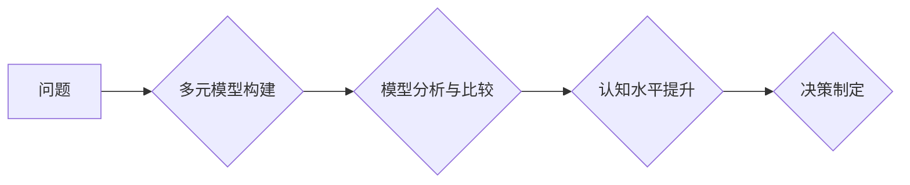

                 

## 多元模型思维:提升管理者认知水平

> 关键词：多元模型、认知水平、管理者、系统思维、复杂系统、决策制定、创新

## 1. 背景介绍

在当今瞬息万变的商业环境中，管理者面临着前所未有的挑战。传统单一思维模式已难以应对复杂、多变的市场需求和竞争格局。为了提升管理者的认知水平，帮助他们更有效地分析问题、制定决策、应对挑战，多元模型思维应运而生。

多元模型思维是一种基于多角度、多层次、多维度的思考方式，它强调从不同视角分析问题，构建多重模型，并通过模型之间的相互作用和比较，最终获得更全面、更深入的理解。这种思维方式能够帮助管理者打破思维定式，跳出局限性，洞察问题本质，从而做出更明智的决策。

## 2. 核心概念与联系

### 2.1 多元模型

多元模型是指构建多个相互关联的模型，以描述和理解一个复杂系统。每个模型都从不同的角度、不同的层次、不同的维度来描述系统，并以不同的方式进行分析和预测。

### 2.2 认知水平

认知水平是指个体对信息进行感知、理解、记忆、思考和应用的能力。多元模型思维能够提升管理者的认知水平，使其能够更有效地处理复杂信息，做出更明智的决策。

### 2.3 系统思维

系统思维是一种看待问题和解决问题的整体性思维方式，它强调系统内部各个要素之间的相互联系和相互作用。多元模型思维与系统思维相辅相成，两者共同构成了管理者应对复杂问题的有效思维工具。

**Mermaid 流程图**



## 3. 核心算法原理 & 具体操作步骤

### 3.1 算法原理概述

多元模型思维的核心算法原理是基于多重模型的分析和比较。通过构建多个模型，从不同的角度、不同的层次、不同的维度来描述和理解一个复杂系统，并通过模型之间的相互作用和比较，最终获得更全面、更深入的理解。

### 3.2 算法步骤详解

1. **问题定义:** 明确需要解决的问题，并将其分解成多个子问题。
2. **模型构建:** 根据问题特点，构建多个不同的模型，每个模型都从不同的角度、不同的层次、不同的维度来描述和理解问题。
3. **模型分析:** 对每个模型进行分析，识别其优势和局限性，并找出模型之间的联系和差异。
4. **模型比较:** 将不同模型的结果进行比较，分析其一致性和差异性，并从中得出更全面、更深入的理解。
5. **决策制定:** 基于多元模型的分析结果，制定更明智的决策。

### 3.3 算法优缺点

**优点:**

* 能够从多角度、多层次、多维度来分析问题，获得更全面、更深入的理解。
* 能够打破思维定式，跳出局限性，洞察问题本质。
* 能够提高决策的准确性和有效性。

**缺点:**

* 模型构建需要花费较多时间和精力。
* 模型分析和比较需要一定的专业知识和经验。
* 多元模型的整合和应用需要一定的技巧和能力。

### 3.4 算法应用领域

多元模型思维广泛应用于各个领域，例如：

* **商业管理:** 战略规划、市场分析、产品开发、风险管理等。
* **科技创新:** 技术研发、产品设计、系统架构等。
* **社会治理:** 政策制定、问题解决、公共服务等。

## 4. 数学模型和公式 & 详细讲解 & 举例说明

### 4.1 数学模型构建

多元模型思维可以借助数学模型来进行更精确的分析和预测。例如，我们可以使用线性回归模型来预测市场需求，使用神经网络模型来识别客户画像，使用系统动力学模型来模拟社会发展趋势。

### 4.2 公式推导过程

每个数学模型都有其对应的公式和推导过程。例如，线性回归模型的公式如下：

$$y = mx + c$$

其中，$y$ 是预测值，$x$ 是自变量，$m$ 是回归系数，$c$ 是截距。

### 4.3 案例分析与讲解

假设我们想要预测某个产品的销售量。我们可以使用线性回归模型，将过去的产品销售数据作为训练样本，并根据公式推导得到回归系数和截距。然后，我们可以将未来产品的相关信息作为自变量，代入公式进行预测。

## 5. 项目实践：代码实例和详细解释说明

### 5.1 开发环境搭建

为了实现多元模型思维，我们可以使用 Python 语言和相关库进行开发。例如，我们可以使用 scikit-learn 库来构建线性回归模型，使用 TensorFlow 或 PyTorch 库来构建神经网络模型。

### 5.2 源代码详细实现

```python
# 导入必要的库
import pandas as pd
from sklearn.linear_model import LinearRegression

# 加载数据
data = pd.read_csv('sales_data.csv')

# 构建线性回归模型
model = LinearRegression()

# 训练模型
model.fit(data[['广告投入']], data['销售量'])

# 预测未来销售量
future_ad_spend = [10000]
predicted_sales = model.predict(future_ad_spend)

# 打印预测结果
print(f'预测的销售量: {predicted_sales[0]}')
```

### 5.3 代码解读与分析

这段代码首先导入必要的库，然后加载销售数据。接着，构建一个线性回归模型，并使用训练数据训练模型。最后，使用训练好的模型预测未来销售量。

### 5.4 运行结果展示

运行这段代码后，会输出预测的销售量。

## 6. 实际应用场景

多元模型思维在实际应用场景中具有广泛的应用价值。例如：

### 6.1 市场营销

多元模型思维可以帮助企业从多个角度分析市场需求，制定更精准的营销策略。例如，我们可以使用客户画像模型来识别目标客户，使用市场趋势模型来预测市场变化，使用产品生命周期模型来制定产品策略。

### 6.2 产品开发

多元模型思维可以帮助企业从多个维度进行产品开发，提高产品创新性和市场竞争力。例如，我们可以使用用户需求模型来分析用户需求，使用技术可行性模型来评估技术方案，使用市场定位模型来确定产品定位。

### 6.3 风险管理

多元模型思维可以帮助企业从多个角度分析风险，制定更有效的风险管理策略。例如，我们可以使用风险识别模型来识别潜在风险，使用风险评估模型来评估风险等级，使用风险应对模型来制定风险应对措施。

### 6.4 未来应用展望

随着人工智能、大数据等技术的不断发展，多元模型思维将得到更广泛的应用。例如，我们可以使用深度学习模型来构建更复杂的模型，使用云计算平台来实现模型的快速部署和迭代。

## 7. 工具和资源推荐

### 7.1 学习资源推荐

* **书籍:**

    * 《复杂系统》
    * 《思维导图》
    * 《系统思考》

* **在线课程:**

    * Coursera: 系统思维
    * edX: 复杂系统

### 7.2 开发工具推荐

* **Python:** 

    * scikit-learn
    * TensorFlow
    * PyTorch

* **数据可视化工具:**

    * Tableau
    * Power BI

### 7.3 相关论文推荐

* **多元模型思维的理论基础:**

    * "Multi-Model Thinking: A Framework for Complex Problem Solving"

* **多元模型思维的应用案例:**

    * "Multi-Model Thinking in Business Strategy"

## 8. 总结：未来发展趋势与挑战

### 8.1 研究成果总结

多元模型思维是一种有效的认知工具，能够帮助管理者更全面、更深入地理解复杂问题，做出更明智的决策。

### 8.2 未来发展趋势

未来，多元模型思维将朝着以下方向发展:

* **模型复杂度提升:** 使用更复杂的模型，例如深度学习模型，来进行更精准的分析和预测。
* **模型融合:** 将多个模型融合在一起，形成更强大的分析和预测能力。
* **自动化:** 使用人工智能技术，自动构建和管理多元模型。

### 8.3 面临的挑战

多元模型思维的发展也面临着一些挑战:

* **模型构建难度:** 构建复杂的模型需要大量的专业知识和经验。
* **模型解释性:** 复杂的模型往往难以解释，这可能会影响决策的透明度和可信度。
* **数据质量:** 模型的准确性依赖于数据的质量，而数据质量往往难以保证。

### 8.4 研究展望

未来，我们需要继续研究多元模型思维的理论基础和应用方法，并开发更有效、更易于使用的工具，以推动多元模型思维的广泛应用。

## 9. 附录：常见问题与解答

### 9.1 如何构建多元模型？

构建多元模型需要根据问题特点，选择合适的模型类型，并收集相关数据进行训练。

### 9.2 如何分析和比较多元模型？

可以通过分析模型的预测精度、解释性、鲁棒性等指标来比较不同模型的优劣。

### 9.3 如何应用多元模型思维？

多元模型思维可以应用于各个领域，例如市场营销、产品开发、风险管理等。


作者：禅与计算机程序设计艺术 / Zen and the Art of Computer Programming 
<end_of_turn>

