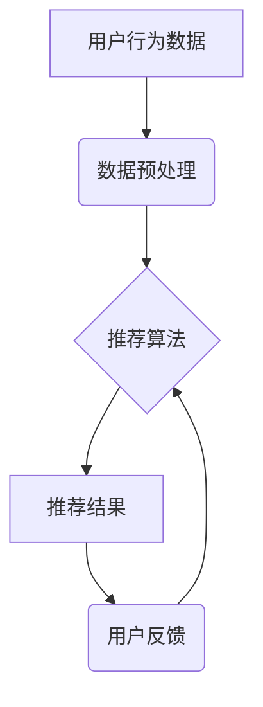

                 

## 大数据与AI 驱动的电商搜索推荐：以准确率与用户体验为中心

> 关键词：电商搜索推荐、大数据、人工智能、机器学习、深度学习、推荐算法、用户体验、准确率

## 1. 背景介绍

在当今数字经济时代，电商平台已成为人们购物的首选方式。然而，面对海量商品和用户需求，如何精准推荐用户感兴趣的产品，提升用户购物体验，成为电商平台面临的重大挑战。传统基于关键词匹配的搜索推荐方式已难以满足用户日益个性化的需求。

大数据和人工智能技术的兴起为电商搜索推荐带来了新的机遇。大数据技术能够收集和分析海量用户行为数据，挖掘用户兴趣和偏好；人工智能技术，特别是机器学习和深度学习，能够从数据中学习，构建更精准的推荐模型。

## 2. 核心概念与联系

电商搜索推荐的核心是利用用户行为数据，预测用户对商品的兴趣，并推荐相关商品。

**2.1 核心概念**

* **用户行为数据:** 包括用户浏览历史、搜索记录、购买记录、评价信息、购物车内容等，是构建推荐模型的基础数据。
* **推荐算法:** 用于分析用户行为数据，预测用户兴趣，并生成推荐结果的算法。
* **用户体验:** 指用户使用电商平台进行搜索和购物的感受，包括搜索结果的准确性、推荐结果的个性化、平台的易用性等。

**2.2 架构图**



## 3. 核心算法原理 & 具体操作步骤

### 3.1 算法原理概述

常见的电商搜索推荐算法包括：

* **基于内容的推荐:** 根据商品的属性和描述，推荐与用户过去浏览或购买的商品相似的商品。
* **基于协同过滤的推荐:** 根据用户的行为相似性，推荐与相似用户喜欢的商品。
* **基于深度学习的推荐:** 利用深度神经网络，从用户行为数据中学习更复杂的特征，进行更精准的推荐。

### 3.2 算法步骤详解

以基于协同过滤的推荐算法为例，其具体步骤如下：

1. **数据收集:** 收集用户行为数据，例如用户对商品的评分、购买记录等。
2. **数据预处理:** 对数据进行清洗、去噪、转换等处理，使其适合算法训练。
3. **相似度计算:** 计算用户之间的相似度，可以使用余弦相似度、皮尔逊相关系数等方法。
4. **推荐生成:** 根据用户与其他用户的相似度，推荐与相似用户喜欢的商品。

### 3.3 算法优缺点

**基于协同过滤的推荐算法:**

* **优点:** 可以发现用户之间的隐性关联，推荐个性化商品。
* **缺点:** 数据稀疏性问题，当用户行为数据不足时，算法效果会下降。

### 3.4 算法应用领域

基于协同过滤的推荐算法广泛应用于电商平台、音乐平台、视频平台等，用于推荐商品、音乐、视频等内容。

## 4. 数学模型和公式 & 详细讲解 & 举例说明

### 4.1 数学模型构建

基于协同过滤的推荐算法通常使用矩阵分解模型，将用户-商品交互矩阵分解成用户特征矩阵和商品特征矩阵。

假设用户集合为U，商品集合为I，用户-商品交互矩阵为R，其中R(u,i)表示用户u对商品i的评分。

用户特征矩阵为U，商品特征矩阵为V，则有：

$$R \approx U V^T$$

其中，U(u,k)表示用户u的第k个特征，V(i,k)表示商品i的第k个特征。

### 4.2 公式推导过程

通过最小化用户-商品交互矩阵与预测矩阵之间的误差，可以得到用户特征矩阵和商品特征矩阵的最佳解。

常用的损失函数为均方误差：

$$L = \frac{1}{2} \sum_{u \in U} \sum_{i \in I} (R(u,i) - \hat{R}(u,i))^2$$

其中，$\hat{R}(u,i)$为预测的用户u对商品i的评分。

通过梯度下降算法，可以迭代更新用户特征矩阵和商品特征矩阵，最小化损失函数。

### 4.3 案例分析与讲解

假设有一个用户-商品交互矩阵，其中用户1对商品1评分为5，用户2对商品1评分为3，用户1对商品2评分为4，用户2对商品2评分为2。

可以使用矩阵分解模型将这个矩阵分解成用户特征矩阵和商品特征矩阵，并通过梯度下降算法迭代更新这两个矩阵，最终得到用户和商品的特征向量。

## 5. 项目实践：代码实例和详细解释说明

### 5.1 开发环境搭建

* Python 3.x
* TensorFlow 或 PyTorch
* Jupyter Notebook

### 5.2 源代码详细实现

```python
import tensorflow as tf

# 定义用户-商品交互矩阵
R = tf.constant([[5, 4], [3, 2]])

# 定义用户特征矩阵和商品特征矩阵
U = tf.Variable(tf.random.normal([2, 10]))
V = tf.Variable(tf.random.normal([2, 10]))

# 定义损失函数
def loss_function(R, U, V):
  return tf.reduce_mean(tf.square(R - tf.matmul(U, V, transpose_b=True)))

# 定义优化器
optimizer = tf.keras.optimizers.Adam()

# 训练模型
for epoch in range(100):
  with tf.GradientTape() as tape:
    loss = loss_function(R, U, V)
  gradients = tape.gradient(loss, [U, V])
  optimizer.apply_gradients(zip(gradients, [U, V]))

# 打印训练结果
print(loss)
```

### 5.3 代码解读与分析

* 代码首先定义了用户-商品交互矩阵R。
* 然后定义了用户特征矩阵U和商品特征矩阵V，并使用随机数初始化。
* 定义了损失函数，用于衡量预测结果与真实结果之间的误差。
* 使用Adam优化器进行模型训练，迭代更新用户特征矩阵和商品特征矩阵。
* 最后打印训练结果，即损失函数的值。

### 5.4 运行结果展示

训练完成后，可以将用户特征矩阵和商品特征矩阵用于推荐商品。

## 6. 实际应用场景

### 6.1 应用场景

* **电商平台商品推荐:** 根据用户的浏览历史、购买记录等数据，推荐用户可能感兴趣的商品。
* **音乐平台歌曲推荐:** 根据用户的播放历史、收藏歌曲等数据，推荐用户可能喜欢的歌曲。
* **视频平台视频推荐:** 根据用户的观看历史、点赞视频等数据，推荐用户可能感兴趣的视频。

### 6.2 案例分析

例如，在电商平台，可以根据用户的浏览历史和购买记录，推荐与用户过去购买的商品相似的商品，或者推荐用户浏览过的商品的新品和促销信息。

### 6.4 未来应用展望

随着大数据和人工智能技术的不断发展，电商搜索推荐将更加精准、个性化。未来，可能会出现以下应用场景：

* **基于多模态数据的推荐:** 利用用户画像、文本、图像、视频等多模态数据进行推荐。
* **实时个性化推荐:** 根据用户的实时行为，动态调整推荐结果。
* **跨平台推荐:** 将用户行为数据整合到多个平台，实现跨平台的个性化推荐。

## 7. 工具和资源推荐

### 7.1 学习资源推荐

* **书籍:**
    * 《推荐系统实践》
    * 《深度学习》
* **在线课程:**
    * Coursera: Recommender Systems
    * Udacity: Deep Learning Nanodegree

### 7.2 开发工具推荐

* **Python:** 
    * TensorFlow
    * PyTorch
    * Scikit-learn
* **Spark:** 用于大数据处理

### 7.3 相关论文推荐

* **Collaborative Filtering for Implicit Feedback Datasets**
* **Deep Learning for Recommender Systems**

## 8. 总结：未来发展趋势与挑战

### 8.1 研究成果总结

大数据和人工智能技术为电商搜索推荐带来了新的机遇，使得推荐更加精准、个性化。

### 8.2 未来发展趋势

未来，电商搜索推荐将更加注重用户体验，更加个性化、实时化、跨平台化。

### 8.3 面临的挑战

* 数据稀疏性问题
* 冷启动问题
* 算法解释性和可解释性
* 用户隐私保护

### 8.4 研究展望

未来研究方向包括：

* 开发更有效的推荐算法，解决数据稀疏性和冷启动问题。
* 提高算法的解释性和可解释性，增强用户对推荐结果的信任。
* 研究用户隐私保护技术，保障用户数据安全。

## 9. 附录：常见问题与解答

* **Q1: 如何解决数据稀疏性问题？**

* **A1:** 可以使用矩阵分解、协同过滤等算法，从稀疏数据中挖掘潜在的模式。

* **Q2: 如何解决冷启动问题？**

* **A2:** 可以利用用户画像、商品属性等信息，进行初始化推荐。

* **Q3: 如何提高算法的解释性和可解释性？**

* **A3:** 可以使用可解释机器学习模型，或者进行特征重要性分析。


作者：禅与计算机程序设计艺术 / Zen and the Art of Computer Programming 
<end_of_turn>

