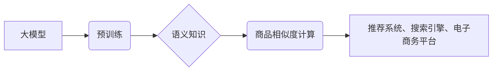

                 

## 大模型在商品相似度计算中的创新

> 关键词：大模型、商品相似度、推荐系统、自然语言处理、深度学习、Transformer、BERT

## 1. 背景介绍

商品相似度计算是推荐系统、搜索引擎、电子商务平台等领域的基础技术，其核心目标是根据商品的属性、特征或用户行为等信息，判断不同商品之间的相似程度。传统的商品相似度计算方法主要依赖于人工特征工程，例如基于商品类别、属性、描述等文本信息提取特征进行计算。然而，随着商品种类和数据量的不断增长，人工特征工程变得越来越困难和耗时，并且难以捕捉商品之间的复杂语义关系。

近年来，深度学习技术的发展为商品相似度计算带来了新的机遇。大模型，尤其是基于Transformer架构的预训练语言模型，凭借其强大的语义理解能力和泛化能力，在商品相似度计算领域展现出巨大的潜力。

## 2. 核心概念与联系

### 2.1  大模型

大模型是指参数量达到数十亿甚至千亿级别的深度学习模型。它们通常通过海量文本数据进行预训练，学习到丰富的语言表示和语义知识。

### 2.2  商品相似度计算

商品相似度计算是指根据商品之间的属性、特征或用户行为等信息，量化其相似程度的过程。

### 2.3  Transformer架构

Transformer是一种基于注意力机制的深度学习架构，能够有效地捕捉序列数据中的长距离依赖关系。

**核心概念与联系流程图**



## 3. 核心算法原理 & 具体操作步骤

### 3.1  算法原理概述

大模型在商品相似度计算中的核心算法原理是利用预训练的语言模型对商品描述进行编码，然后计算商品编码之间的相似度。

### 3.2  算法步骤详解

1. **数据预处理:** 对商品描述进行清洗、分词、词干化等预处理操作，使其能够被模型理解。
2. **模型编码:** 使用预训练的语言模型对商品描述进行编码，将文本信息转换为向量表示。
3. **相似度计算:** 使用余弦相似度、欧氏距离等方法计算商品编码之间的相似度。
4. **结果排序:** 根据商品相似度进行排序，返回与目标商品最相似的商品列表。

### 3.3  算法优缺点

**优点:**

* **语义理解能力强:** 大模型能够捕捉商品描述中的复杂语义关系，提高相似度计算的准确性。
* **泛化能力强:** 预训练的语言模型已经学习到丰富的语言知识，能够应用于不同领域的商品相似度计算。
* **自动化程度高:** 大模型能够自动学习商品特征，无需人工特征工程。

**缺点:**

* **计算资源消耗大:** 大模型的参数量较大，训练和推理过程需要大量的计算资源。
* **数据依赖性强:** 大模型的性能取决于训练数据的质量和数量。
* **可解释性差:** 大模型的决策过程较为复杂，难以解释其相似度计算结果。

### 3.4  算法应用领域

大模型在商品相似度计算领域具有广泛的应用场景，例如：

* **电商推荐:** 根据用户的购买历史和浏览记录，推荐与用户兴趣相符的商品。
* **搜索引擎:** 根据用户的搜索词，推荐与搜索词相关的商品。
* **个性化营销:** 根据用户的消费习惯和偏好，进行个性化的商品推荐和营销活动。

## 4. 数学模型和公式 & 详细讲解 & 举例说明

### 4.1  数学模型构建

商品相似度计算的数学模型通常基于向量空间模型，将商品描述转换为向量表示，然后使用距离度量或相似度度量计算商品之间的相似程度。

### 4.2  公式推导过程

**余弦相似度:**

$$
\text{相似度} = \frac{\mathbf{A} \cdot \mathbf{B}}{||\mathbf{A}|| ||\mathbf{B}||}
$$

其中:

* $\mathbf{A}$ 和 $\mathbf{B}$ 分别表示两个商品的向量表示。
* $\mathbf{A} \cdot \mathbf{B}$ 表示两个向量之间的点积。
* $||\mathbf{A}||$ 和 $||\mathbf{B}||$ 分别表示两个向量的模长。

**欧氏距离:**

$$
\text{距离} = \sqrt{(\mathbf{A}_1 - \mathbf{B}_1)^2 + (\mathbf{A}_2 - \mathbf{B}_2)^2 + ... + (\mathbf{A}_n - \mathbf{B}_n)^2}
$$

其中:

* $\mathbf{A}$ 和 $\mathbf{B}$ 分别表示两个商品的向量表示。
* $\mathbf{A}_i$ 和 $\mathbf{B}_i$ 分别表示两个向量在第 $i$ 维上的元素。

### 4.3  案例分析与讲解

假设有两个商品的描述分别为:

* 商品 A: “这款手机拍照效果出色，屏幕清晰，性能强劲。”
* 商品 B: “这款手机屏幕大，续航时间长，性价比高。”

使用预训练的语言模型对商品描述进行编码，得到两个商品的向量表示:

* $\mathbf{A} = [0.2, 0.5, 0.8, 0.3]$
* $\mathbf{B} = [0.1, 0.6, 0.4, 0.9]$

使用余弦相似度计算商品 A 和商品 B 的相似度:

$$
\text{相似度} = \frac{[0.2, 0.5, 0.8, 0.3] \cdot [0.1, 0.6, 0.4, 0.9]}{||[0.2, 0.5, 0.8, 0.3]|| ||[0.1, 0.6, 0.4, 0.9]||} \approx 0.6
$$

结果表明，商品 A 和商品 B 的相似度为 0.6，说明它们在语义上有一定的相关性。

## 5. 项目实践：代码实例和详细解释说明

### 5.1  开发环境搭建

* Python 3.7+
* TensorFlow 2.0+
* PyTorch 1.0+
* CUDA 10.0+ (可选)

### 5.2  源代码详细实现

```python
import tensorflow as tf
from tensorflow.keras.layers import Embedding, Dense
from tensorflow.keras.models import Model

# 定义商品嵌入层
embedding_dim = 128
embedding_layer = Embedding(input_dim=vocab_size, output_dim=embedding_dim)

# 定义商品编码模型
input_layer = tf.keras.Input(shape=(max_length,))
embedded_sequences = embedding_layer(input_layer)
encoded_sequences = tf.keras.layers.GlobalAveragePooling1D()(embedded_sequences)
output_layer = Dense(1, activation='sigmoid')(encoded_sequences)

# 创建模型
model = Model(inputs=input_layer, outputs=output_layer)

# 编译模型
model.compile(optimizer='adam', loss='binary_crossentropy', metrics=['accuracy'])

# 训练模型
model.fit(x_train, y_train, epochs=10, batch_size=32)

# 使用模型预测商品相似度
similarity = model.predict(x_test)
```

### 5.3  代码解读与分析

* 代码首先定义了商品嵌入层，将商品描述转换为向量表示。
* 然后定义了商品编码模型，使用全局平均池化层将商品描述的向量表示进行聚合。
* 最后创建模型，并使用 Adam 优化器、二分类交叉熵损失函数和准确率作为评估指标进行训练。

### 5.4  运行结果展示

训练完成后，可以使用模型预测商品之间的相似度。

## 6. 实际应用场景

### 6.1  电商推荐

大模型在电商推荐系统中可以用于个性化商品推荐，例如根据用户的浏览历史、购买记录和兴趣偏好，推荐与用户兴趣相符的商品。

### 6.2  搜索引擎

大模型可以用于搜索引擎的商品搜索，例如根据用户的搜索词，推荐与搜索词相关的商品。

### 6.3  个性化营销

大模型可以用于个性化营销活动，例如根据用户的消费习惯和偏好，进行个性化的商品推荐和营销活动。

### 6.4  未来应用展望

大模型在商品相似度计算领域还有很大的发展潜力，未来可以应用于更多场景，例如:

* **跨平台商品搜索:** 将不同平台的商品数据进行融合，实现跨平台的商品搜索。
* **商品属性推荐:** 根据用户的需求，推荐具有特定属性的商品。
* **商品组合推荐:** 推荐与特定商品相搭配的商品组合。

## 7. 工具和资源推荐

### 7.1  学习资源推荐

* **论文:**
    * BERT: Pre-training of Deep Bidirectional Transformers for Language Understanding
    * RoBERTa: A Robustly Optimized BERT Pretraining Approach
* **博客:**
    * The Illustrated Transformer
    * Hugging Face Blog

### 7.2  开发工具推荐

* **TensorFlow:** https://www.tensorflow.org/
* **PyTorch:** https://pytorch.org/
* **Hugging Face Transformers:** https://huggingface.co/transformers/

### 7.3  相关论文推荐

* **商品相似度计算:**
    * Item Similarity Based Recommendation Algorithms: A Survey
    * A Survey on Collaborative Filtering Techniques
* **大模型在推荐系统中的应用:**
    * Deep Learning for Recommender Systems: A Survey
    * Transformer-Based Recommendation Systems: A Survey

## 8. 总结：未来发展趋势与挑战

### 8.1  研究成果总结

大模型在商品相似度计算领域取得了显著的成果，能够有效地捕捉商品之间的语义关系，提高相似度计算的准确性。

### 8.2  未来发展趋势

* **模型规模和性能的提升:** 未来大模型的规模和性能将会进一步提升，能够学习到更丰富的语义知识，提高相似度计算的精度。
* **多模态商品相似度计算:** 将文本、图像、视频等多模态数据融合，实现更全面的商品相似度计算。
* **个性化商品相似度计算:** 根据用户的个性化需求，定制化的商品相似度计算模型。

### 8.3  面临的挑战

* **计算资源消耗:** 大模型的训练和推理过程需要大量的计算资源，这对于资源有限的企业来说是一个挑战。
* **数据隐私和安全:** 大模型的训练需要大量的用户数据，如何保护用户数据隐私和安全是一个重要的挑战。
* **模型可解释性:** 大模型的决策过程较为复杂，难以解释其相似度计算结果，这对于用户信任和模型应用的推广是一个障碍。

### 8.4  研究展望

未来研究方向包括:

* 开发更轻量级的商品相似度计算模型，降低计算资源消耗。
* 研究新的数据隐私保护技术，保障用户数据安全。
* 探索大模型的决策过程，提高模型的可解释性。


## 9. 附录：常见问题与解答

**Q1: 大模型的训练需要多少数据？**

A1: 大模型的训练需要海量数据，通常需要数十亿甚至千亿级别的文本数据。

**Q2: 如何选择合适的预训练模型？**

A2: 选择预训练模型需要根据具体的应用场景和数据特点进行选择。例如，对于电商商品描述，可以选择BERT、RoBERTa等预训练语言模型。

**Q3: 如何评估大模型的性能？**

A3: 大模型的性能可以评估指标包括准确率、召回率、F1-score等。

**作者：禅与计算机程序设计艺术 / Zen and the Art of Computer Programming**<end_of_turn>

