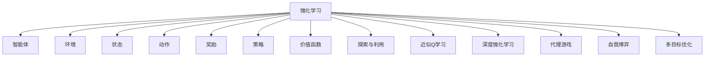

                 

# 强化学习在游戏AI中的应用：超越人类玩家

> 关键词：强化学习, 游戏AI, 神经网络, 决策树, 深度强化学习, 代理游戏, 自我博弈

## 1. 背景介绍

### 1.1 问题由来

在电子竞技领域，高度竞争的环境催生了对智能游戏AI的需求。传统的AI方法基于规则和策略，难以适应复杂多变的游戏场景，难以真正挑战顶级玩家。而强化学习(Reinforcement Learning, RL)通过不断试错学习，可实现智能体在无监督的情况下自主提升能力。利用强化学习技术，游戏AI可以在多个回合内超越人类玩家，改变游戏竞技的格局。

### 1.2 问题核心关键点

强化学习在游戏AI中的应用，在于如何构建一个能够自主学习和决策的智能体，使其在电子竞技中表现超越人类玩家。具体而言，需要解决以下关键问题：
- 智能体如何根据环境动态变化进行决策？
- 智能体如何平衡策略探索与利用的效率？
- 智能体如何在高维度空间中探索最优策略？
- 智能体如何应对复杂的对抗和多层次决策问题？

## 2. 核心概念与联系

### 2.1 核心概念概述

为更好地理解强化学习在游戏AI中的应用，本节将介绍几个密切相关的核心概念：

- 强化学习(Reinforcement Learning, RL)：通过与环境交互，智能体学习在特定策略下最大化奖励的决策过程。
- 智能体(Agent)：与环境互动的学习实体，利用策略从环境中获取奖励。
- 环境(Environment)：智能体学习决策的环境，包括状态、奖励函数、动作空间等。
- 状态(State)：环境的当前状态，表示为向量化数据，智能体根据状态进行决策。
- 动作(Action)：智能体可执行的决策，影响环境状态和获得奖励。
- 奖励(Reward)：智能体在状态之间执行动作后获得的环境反馈，用于指导策略学习。
- 策略(Policy)：智能体在不同状态下采取动作的概率分布，驱动智能体学习。
- 价值函数(Value Function)：估计智能体在不同状态或策略下的价值，辅助策略学习。
- 探索与利用(Exploration vs. Exploitation)：在策略学习中，智能体需要在探索新策略和利用已有知识之间取得平衡。
- 近似Q学习(Approximate Q-Learning)：通过逼近Q值函数而非精确计算Q值，减少计算复杂度。
- 深度强化学习(Deep RL)：结合神经网络等深度学习方法，解决高维度状态空间和动作空间决策问题。
- 代理游戏(Agent-Based Game)：智能体与环境之间的交互，用于模拟真实游戏场景。
- 自我博弈(Self-Play)：智能体与自身的博弈过程，利用自身历史数据进行策略学习。
- 多目标优化(Multi-Objective Optimization)：在多层次目标中优化智能体的表现，如胜率、胜率分布等。

这些核心概念之间的逻辑关系可以通过以下Mermaid流程图来展示：



这个流程图展示了大语言模型的核心概念及其之间的关系：

1. 强化学习作为主要的学习方式，智能体在环境中学习最优策略。
2. 智能体通过策略指导执行动作，与环境互动获取奖励。
3. 环境由状态、动作、奖励构成，提供智能体学习的场景。
4. 状态是环境的具体表现形式，智能体根据状态采取动作。
5. 动作是智能体的决策，影响环境和奖励。
6. 奖励指导智能体的学习方向，优化策略性能。
7. 策略定义智能体在不同状态下的动作概率。
8. 价值函数评估策略的好坏，辅助学习。
9. 探索与利用需要平衡，在探索新策略和利用现有策略之间取舍。
10. 近似Q学习通过逼近Q值函数优化计算。
11. 深度强化学习结合神经网络等深度学习手段，解决高维度问题。
12. 代理游戏模拟真实环境，用于训练和测试智能体。
13. 自我博弈通过智能体自身历史数据，进行策略迭代。
14. 多目标优化平衡不同目标，提升智能体综合性能。

这些概念共同构成了强化学习在游戏AI中的应用框架，使其能够通过智能体在复杂环境中自主学习，提升决策能力，进而超越人类玩家。

## 3. 核心算法原理 & 具体操作步骤
### 3.1 算法原理概述

在游戏AI中，强化学习主要通过代理游戏(Agent-Based Game)的方式，使智能体在无监督的情况下自主学习。智能体通过执行动作与环境交互，获取即时奖励，利用经验更新策略，逐步优化决策性能，从而在特定游戏中取得超越人类玩家的水平。

强化学习的核心目标是最大化长期奖励，即期望累积奖励最大化。数学形式上，对于智能体在状态$s$下采取动作$a$后获得的即时奖励$r$，以及环境转移至下一个状态$s'$的概率$P(s'|s,a)$，其期望累积奖励可以表示为：

$$
J(\pi) = \mathbb{E}_{s_0,a} \left[\sum_{t=0}^{\infty} \gamma^t r_t \right]
$$

其中$\pi$为智能体的策略，$\gamma$为折扣因子，控制奖励的时间权重。

通过优化期望累积奖励$J(\pi)$，智能体在多回合博弈中学习最优策略。

### 3.2 算法步骤详解

在游戏AI中，强化学习的应用主要涉及以下步骤：

**Step 1: 定义游戏环境和目标**

- 定义游戏规则、状态空间、动作空间和奖励函数，构建模拟环境。
- 设定智能体的目标，如胜率为最优、最大化得分等。

**Step 2: 选择学习算法**

- 根据问题特点选择适宜的学习算法，如Q-learning、SARSA、Deep Q-Networks等。
- 确定智能体策略的表示方式，如线性策略、策略梯度、策略网络等。

**Step 3: 训练智能体**

- 使用游戏环境对智能体进行训练，收集智能体与环境互动的轨迹。
- 根据学习算法更新智能体的策略或价值函数。
- 应用探索与利用策略平衡策略更新和探索新策略。

**Step 4: 评估和优化**

- 在训练过程中，定期评估智能体的性能，计算策略在特定状态下的累积奖励。
- 根据评估结果调整学习参数，优化策略性能。
- 对智能体模型进行调优，提高泛化能力和鲁棒性。

**Step 5: 测试和部署**

- 在验证集上测试智能体，评估其在不同状态下的策略效果。
- 根据测试结果进行微调，进一步优化策略。
- 部署智能体到实际游戏环境中，进行实时决策。

### 3.3 算法优缺点

强化学习在游戏AI中的应用具有以下优点：

1. 自主学习能力：强化学习无需人工干预，智能体能够自主学习最优策略，适应性强。
2. 泛化能力强：智能体能够通过策略学习，在新的游戏环境中表现良好。
3. 鲁棒性高：智能体能够处理游戏环境中的不确定性和变化。
4. 可扩展性强：结合神经网络等深度学习方法，可处理高维度游戏场景。

同时，强化学习在游戏AI中也存在一些局限：

1. 训练成本高：强化学习往往需要大量的训练样本和计算资源，训练周期长。
2. 探索效率低：在复杂环境中，智能体的探索效率可能较低，难以快速找到最优策略。
3. 策略稳定性差：智能体的策略更新可能不稳定，导致过拟合或欠拟合。
4. 安全性问题：智能体的策略可能带来未知的安全风险，需要进行严格的测试和验证。

### 3.4 算法应用领域

强化学习在游戏AI中的应用，主要涉及以下领域：

- 棋类游戏：如围棋、象棋、五子棋等。通过构建策略网络，智能体在博弈中学习最优策略。
- 策略游戏：如星际争霸、星际争霸II、DOTA2等。智能体通过策略梯度、自我博弈等方法，学习复杂博弈环境中的决策。
- 射击游戏：如守望先锋、使命召唤等。智能体利用深度强化学习，学习高维度动作空间下的战术策略。
- 竞速游戏：如FIFA、NBA 2K等。智能体在实时控制中学习快速反应和动作优化。
- 体育游戏：如足球模拟、网球模拟等。智能体学习在多层次目标中的表现，如得分、胜负、技术统计等。

除了这些经典游戏外，强化学习还被应用于更广阔的领域，如机器人控制、飞行器自主飞行、智能交通等。相信随着强化学习算法的不断演进，更多游戏和实际应用领域将能够受益于智能体的决策能力。

## 4. 数学模型和公式 & 详细讲解  
### 4.1 数学模型构建

本节将使用数学语言对强化学习在游戏AI中的应用过程进行更加严格的刻画。

设智能体在状态$s$下采取动作$a$，获得的即时奖励为$r$，环境转移至下一个状态$s'$的概率为$P(s'|s,a)$。智能体的策略为$\pi(a|s)$，即在状态$s$下选择动作$a$的概率分布。智能体的策略参数为$\theta$，优化目标是最大化长期奖励$J(\pi)$。

在强化学习中，通常采用动态规划和蒙特卡罗方法进行策略优化。以下以Q-learning为例，给出具体的数学模型构建。

定义状态-动作-奖励三元组$(s,a,r)$的Q值函数为$Q(s,a)$，表示在状态$s$下采取动作$a$后的期望累积奖励。Q值函数的贝尔曼方程为：

$$
Q(s,a) = r + \gamma \mathbb{E}_{s'} Q(s', \pi(a|s'))
$$

其中$\mathbb{E}_{s'}$表示对状态$s'$取期望。在Q-learning中，通过拟合Q值函数来优化策略。智能体的策略参数$\theta$通过以下最小化均方误差得到：

$$
\theta \leftarrow \theta - \alpha (Q(s,a) - r + \gamma \max_a Q(s', a'))_{s,a,s',a'}
$$

其中$\alpha$为学习率，$(s,a)$表示智能体采取动作$a$的状态$s$，$s'$表示智能体在执行动作后转移到的状态，$a'$表示智能体在状态$s'$下的最优动作。

### 4.2 公式推导过程

以下我们以最简单的单智能体游戏为例，推导强化学习的核心公式。

假设智能体在每个状态下只能采取一种动作，且每个动作获得的奖励$r$为常数，环境以固定概率$\delta$转移至下一个状态。在每个回合中，智能体的策略为$\pi(a|s)$，状态转移的概率为$P(s'|s,a)$。设智能体从初始状态$s_0$开始，执行策略$\pi$，游戏进行$n$个回合后的累积奖励为$J(\pi)$。

在每一回合中，智能体采取动作$a$的概率为$\pi(a|s)$，获得的即时奖励为$r$，环境转移至下一个状态$s'$的概率为$P(s'|s,a)$。则该回合的期望累积奖励为：

$$
R(s,a,s') = r + \gamma \delta \left(1 - P(s'|s,a)\right)
$$

其中$\gamma \delta$表示智能体在一次转移中获得的期望奖励。

在初始状态$s_0$下，智能体执行策略$\pi$的期望累积奖励$J(\pi)$为：

$$
J(\pi) = \sum_{s_0,a} \pi(a|s_0) \sum_{s_1,\ldots,s_{n-1}} \prod_{i=0}^{n-1} \pi(a_i|s_i) P(s_{i+1}|s_i,a_i) R(s_i,a_i,s_{i+1})
$$

其中$n$为游戏回合数，$s_i$为第$i$个状态，$a_i$为第$i$个动作。

根据贝尔曼方程，Q值函数$Q(s,a)$的递推式为：

$$
Q(s,a) = r + \gamma \delta \left(1 - P(s'|s,a)\right) \max_{a'} Q(s', a')
$$

对于状态$s$，通过最大化$Q(s,a)$，可以更新智能体的策略$\pi(a|s)$。具体而言，对于每个状态$s$，通过以下策略梯度更新：

$$
\pi(a|s) \leftarrow \frac{\pi(a|s) \exp(\alpha Q(s,a))}{\sum_{a'} \pi(a'|s) \exp(\alpha Q(s,a'))}
$$

其中$\alpha$为学习率。

在实践中，为了计算Q值函数的更新，通常采用近似方法，如神经网络逼近Q值函数，自适应学习率等。这样可以加速计算过程，同时保证学习效果。

### 4.3 案例分析与讲解

以围棋为例，分析强化学习在棋类游戏中的应用。

围棋的规则复杂，状态空间庞大，传统的搜索算法难以穷举所有可能。而强化学习通过自主学习，可以在高维度空间中优化策略，达到超越人类玩家的目标。

在游戏环境中，智能体需要不断与对手进行博弈，根据当前状态$s$和对手的动作$a'$，更新自己的策略$\pi(a|s)$。通过Q-learning等算法，智能体不断学习最优策略，逐步提高胜率。

在实际应用中，围棋AI常使用神经网络逼近Q值函数，将状态$s$和动作$a$作为输入，输出Q值$Q(s,a)$。智能体通过最大值$Q(s,a)$来更新策略，使得每个状态$s$下的最优动作$a$能够被快速识别。

围棋AI的成功，展示了强化学习在游戏AI中的巨大潜力。在复杂的博弈环境中，智能体通过自主学习和迭代优化，能够在多个回合中超越人类玩家，取得胜利。

## 5. 项目实践：代码实例和详细解释说明
### 5.1 开发环境搭建

在进行游戏AI实践前，我们需要准备好开发环境。以下是使用Python进行OpenAI Gym进行强化学习实验的环境配置流程：

1. 安装Anaconda：从官网下载并安装Anaconda，用于创建独立的Python环境。

2. 创建并激活虚拟环境：
```bash
conda create -n gym-env python=3.8 
conda activate gym-env
```

3. 安装Gym：
```bash
pip install gym
```

4. 安装OpenAI Gym所需的 Gym Environment：
```bash
pip install gym[gym[atari,render,contrib]]
```

5. 安装PyTorch：
```bash
pip install torch
```

6. 安装PyTorch Tensorboard：
```bash
pip install tensorboard
```

完成上述步骤后，即可在`gym-env`环境中开始强化学习实践。

### 5.2 源代码详细实现

这里我们以训练一个简单的玩Dots游戏(Arcade环境的Super Mario Bros)为例，展示强化学习在游戏AI中的代码实现。

首先，定义训练环境：

```python
import gym
import numpy as np
import torch
import torch.nn as nn
import torch.optim as optim
import torch.nn.functional as F

env = gym.make('SuperMarioBros-v4')
```

然后，定义神经网络模型：

```python
class DQN(nn.Module):
    def __init__(self, in_dim, out_dim):
        super(DQN, self).__init__()
        self.fc1 = nn.Linear(in_dim, 256)
        self.fc2 = nn.Linear(256, 256)
        self.fc3 = nn.Linear(256, out_dim)
        
    def forward(self, x):
        x = F.relu(self.fc1(x))
        x = F.relu(self.fc2(x))
        x = self.fc3(x)
        return x
```

接着，定义智能体策略和价值函数：

```python
class Agent:
    def __init__(self, in_dim, out_dim, lr):
        self.model = DQN(in_dim, out_dim)
        self.lr = lr
        self.optimizer = optim.Adam(self.model.parameters(), lr=self.lr)
        self.memory = []
        self.epsilon = 1.0
        self.epsilon_min = 0.01
        self.epsilon_decay = 0.99
        
    def act(self, state):
        if np.random.rand() <= self.epsilon:
            return env.action_space.sample()
        with torch.no_grad():
            q_value = self.model(torch.tensor(state, dtype=torch.float32)).detach().numpy()
        return np.argmax(q_value)
        
    def train(self, batch_size):
        if len(self.memory) < batch_size:
            return
        idx = np.random.choice(len(self.memory), batch_size, replace=False)
        states, actions, rewards, next_states, dones = [np.vstack(item) for item in zip(*self.memory[idx])]
        q_values = self.model(torch.tensor(states, dtype=torch.float32)).detach().numpy()
        q_values_next = self.model(torch.tensor(next_states, dtype=torch.float32)).detach().numpy()
        targets = np.vstack([rewards + self.gamma * np.max(q_values_next, axis=1) * (1 - dones), q_values])
        loss = nn.MSELoss()(torch.tensor(targets, dtype=torch.float32), torch.tensor(self.model(torch.tensor(states, dtype=torch.float32)).detach().numpy(), dtype=torch.float32))
        self.optimizer.zero_grad()
        loss.backward()
        self.optimizer.step()
        
        self.memory = []
        self.epsilon = max(self.epsilon_min, self.epsilon * self.epsilon_decay)
```

最后，启动训练流程：

```python
env = gym.make('SuperMarioBros-v4')
agent = Agent(env.observation_space.shape[0], env.action_space.n, lr=0.001)
g = torch.utils.tensorboard.SummaryWriter(log_dir='logs')
torch.set_num_threads(1)

episodes = 10000
for episode in range(episodes):
    state = env.reset()
    done = False
    while not done:
        env.render()
        state = np.reshape(state, [1, -1])
        action = agent.act(state)
        state_, reward, done, _ = env.step(action)
        state = np.reshape(state_, [1, -1])
        agent.train(32)
        agent.memory.append((state, action, reward, state_, done))
        if done:
            env.reset()
```

在这个例子中，我们定义了一个简单的DQN模型，用于逼近Q值函数，通过游戏环境中的状态和动作进行训练，逐步提升智能体的策略性能。

### 5.3 代码解读与分析

让我们再详细解读一下关键代码的实现细节：

**Gym环境的定义**：
- `gym.make('SuperMarioBros-v4')`：使用OpenAI Gym定义游戏环境Super Mario Bros，用于训练智能体。
- `env.reset()`：初始化游戏环境，并获取初始状态。
- `env.render()`：显示游戏画面，用于可视化智能体决策过程。
- `env.step(action)`：智能体采取动作，执行游戏操作，并获取奖励和状态。

**神经网络模型**：
- `DQN(nn.Module)`：定义DQN模型，包含三个全连接层。
- `nn.Linear(in_dim, out_dim)`：定义全连接层，输入维度为`in_dim`，输出维度为`out_dim`。
- `nn.MSELoss()`：定义均方误差损失函数。

**智能体策略**：
- `Agent`类：定义智能体类，包含模型、学习率、优化器、记忆缓冲区等属性。
- `act(self, state)`：智能体采取动作，如果探索率大于0，随机选择动作；否则使用Q值函数选择最优动作。
- `train(self, batch_size)`：智能体从记忆缓冲区中采样数据，计算损失，更新模型参数。

**训练流程**：
- `agent.epsilon`：智能体的探索率，通过时间步长进行衰减。
- `agent.memory`：记录智能体与环境互动的轨迹，用于训练。
- `agent.memory = []`：重置记忆缓冲区。

可以看到，强化学习在游戏AI中的应用需要定义清晰的环境、设计合适的智能体策略和价值函数，并进行高效训练和迭代优化。通过上述代码实现，开发者可以快速构建并测试智能体模型，进一步探索其在复杂游戏环境中的决策能力。

## 6. 实际应用场景
### 6.1 游戏AI的优化

强化学习在游戏AI中的应用，最直接的体现是对游戏的优化。通过训练具有自学习能力的智能体，能够在多个回合中超越人类玩家，实现更高效的胜负策略。

- **棋类游戏**：如围棋、象棋、五子棋等。通过训练智能体，能够在博弈中快速找到最优策略，实现高胜率。
- **策略游戏**：如星际争霸、星际争霸II、DOTA2等。智能体通过自我博弈和策略梯度等方法，能够在高复杂度环境中进行策略优化。
- **射击游戏**：如守望先锋、使命召唤等。智能体利用深度强化学习，学习快速反应和战术策略，提升游戏表现。
- **竞速游戏**：如FIFA、NBA 2K等。智能体通过策略学习，提升速度和动作精度，增强游戏竞争力。

除了这些经典游戏外，强化学习还被应用于更广泛的场景中，如无人驾驶、机器人控制、军事训练等。通过优化智能体的决策能力，使其能够在复杂环境中高效应对挑战。

### 6.2 智能设备的自动化

强化学习在游戏AI中的应用，还可扩展到智能设备的自动化。通过训练智能体，使其在特定任务中自动执行最优策略，提升设备性能和用户体验。

- **智能音箱**：如亚马逊的Alexa、谷歌的Google Assistant等。通过训练智能体，使其能够理解和回应自然语言指令，提升智能音箱的交互体验。
- **智能家居**：如智能电视、智能空调等。智能体通过学习用户行为，自动调整设备设置，提升用户体验。
- **智能交通**：如自动驾驶汽车、交通信号控制等。智能体通过学习交通规则和实时数据，实现高效和安全驾驶。

通过在游戏AI中的成功应用，强化学习展现了其强大的自学习能力和泛化能力，有望在更多智能设备自动化场景中发挥重要作用。

### 6.3 多目标优化

强化学习在游戏AI中的应用，还涉及多目标优化问题。智能体需要在多个层次目标中进行平衡，提升综合表现。

- **胜负策略**：如在对抗游戏中，智能体需要平衡攻击和防御策略，实现最大化胜率。
- **资源利用**：如在角色扮演游戏中，智能体需要平衡技能使用和资源消耗，实现最大化任务完成率。
- **时间管理**：如在竞速游戏中，智能体需要平衡速度和策略，实现最优路线和时间管理。

通过多目标优化，智能体能够平衡不同层次目标，提升综合表现，满足多方面的需求。

### 6.4 未来应用展望

随着强化学习技术的不断进步，在游戏AI中的应用将不断扩展和深化。未来可能出现以下趋势：

1. **多智能体协同**：多个智能体之间通过协同学习，提升整体性能，实现复杂的群体决策。
2. **自我博弈扩展**：智能体通过历史数据自我博弈，进行策略迭代，进一步提升决策能力。
3. **多层次目标融合**：智能体在多层次目标中优化性能，实现更全面的任务完成。
4. **跨平台应用**：智能体在多个平台和设备中无缝运行，提升用户交互体验。
5. **实时决策优化**：智能体通过实时数据调整策略，提升实时响应能力。
6. **泛化能力增强**：智能体在多种游戏环境中表现良好，具有更强的适应性。

强化学习在游戏AI中的应用将不断深化，为游戏开发和智能设备自动化提供新的思路和方向。相信随着技术的不断发展，智能体将在复杂多变的游戏环境中展现更强的决策能力，带来更多创新的应用场景。

## 7. 工具和资源推荐
### 7.1 学习资源推荐

为了帮助开发者系统掌握强化学习在游戏AI中的应用，这里推荐一些优质的学习资源：

1. 《Reinforcement Learning: An Introduction》（作者：Richard S. Sutton和Andrew G. Barto）：经典教材，系统介绍了强化学习的理论基础和应用方法，是深入学习强化学习的必备资源。
2. CS294-Two《Advanced Reinforcement Learning》课程：斯坦福大学开设的强化学习高级课程，涵盖深度强化学习、多智能体学习等内容，适合进阶学习。
3. 《Hands-On Reinforcement Learning with PyTorch》书籍：结合PyTorch实现强化学习案例，适合实践型学习者。
4. DeepMind博客和论文：DeepMind的强化学习团队发布了大量前沿研究论文，涵盖了多智能体学习、自博弈、对抗强化学习等内容，适合跟踪前沿研究动态。
5. OpenAI Gym官方文档：OpenAI Gym的官方文档，提供了丰富的环境库和样例代码，适合入门学习和实践。

通过对这些资源的学习实践，相信你一定能够快速掌握强化学习在游戏AI中的应用，并用于解决实际的NLP问题。
###  7.2 开发工具推荐

高效的开发离不开优秀的工具支持。以下是几款用于强化学习在游戏AI中开发的常用工具：

1. PyTorch：基于Python的开源深度学习框架，灵活动态的计算图，适合快速迭代研究。支持深度强化学习。

2. TensorFlow：由Google主导开发的开源深度学习框架，生产部署方便，适合大规模工程应用。支持深度强化学习。

3. OpenAI Gym：Python游戏环境库，提供大量游戏环境，方便测试和训练智能体。

4. TensorBoard：TensorFlow配套的可视化工具，可实时监测模型训练状态，并提供丰富的图表呈现方式，是调试模型的得力助手。

5. Jupyter Notebook：交互式编程环境，方便进行实验和数据可视化。

6. Visual Studio Code：轻量级代码编辑器，支持Python、TensorFlow等扩展。

合理利用这些工具，可以显著提升强化学习在游戏AI中的开发效率，加快创新迭代的步伐。

### 7.3 相关论文推荐

强化学习在游戏AI中的应用源于学界的持续研究。以下是几篇奠基性的相关论文，推荐阅读：

1. DeepMind AlphaGo Zero：DeepMind开发的围棋AI，通过强化学习和自我博弈，实现了人类级的围棋水平。

2. AlphaStar：DeepMind开发的星际争霸AI，通过强化学习和多智能体学习，实现了人类级的星际争霸水平。

3. AlphaGo：DeepMind开发的围棋AI，通过强化学习、蒙特卡罗树搜索等方法，实现了超越人类围棋水平的目标。

4. DeepMind AlphaZero：DeepMind开发的通用AI，通过强化学习和自我博弈，实现对多种游戏的高水平掌握。

5. Multi-Agent Deep Reinforcement Learning：阐述了多智能体学习的方法和应用，提升群体决策能力。

6. Human-in-the-Loop Reinforcement Learning：探讨了人类与智能体协同学习的方法，提高智能体的鲁棒性和可信度。

这些论文代表了大语言模型微调技术的发展脉络。通过学习这些前沿成果，可以帮助研究者把握学科前进方向，激发更多的创新灵感。

## 8. 总结：未来发展趋势与挑战

### 8.1 总结

本文对强化学习在游戏AI中的应用进行了全面系统的介绍。首先阐述了强化学习的核心概念及其在游戏AI中的应用背景，明确了智能体在电子竞技中超越人类玩家的目标。其次，从原理到实践，详细讲解了强化学习在游戏AI中的数学模型和关键步骤，给出了具体的代码实现。同时，本文还探讨了强化学习在游戏AI中的实际应用场景，展示了其在多领域中的潜力。此外，本文精选了强化学习的学习资源和开发工具，力求为读者提供全方位的技术指引。

通过本文的系统梳理，可以看到，强化学习在游戏AI中的应用已经取得显著进展，在复杂多变的游戏环境中展现出强大的自主学习能力。未来，随着技术的不断演进，强化学习在游戏AI中的应用将进一步深化，带来更多的创新应用场景。

### 8.2 未来发展趋势

展望未来，强化学习在游戏AI中的应用将呈现以下几个发展趋势：

1. 多智能体协同：多个智能体之间通过协同学习，提升整体性能，实现复杂的群体决策。

2. 自我博弈扩展：智能体通过历史数据自我博弈，进行策略迭代，进一步提升决策能力。

3. 多层次目标融合：智能体在多层次目标中优化性能，实现更全面的任务完成。

4. 跨平台应用：智能体在多个平台和设备中无缝运行，提升用户交互体验。

5. 实时决策优化：智能体通过实时数据调整策略，提升实时响应能力。

6. 泛化能力增强：智能体在多种游戏环境中表现良好，具有更强的适应性。

以上趋势凸显了强化学习在游戏AI中的广阔前景。这些方向的探索发展，必将进一步提升智能体的决策能力，为游戏开发和智能设备自动化提供新的思路和方向。

### 8.3 面临的挑战

尽管强化学习在游戏AI中的应用已经取得了显著成果，但在迈向更加智能化、普适化应用的过程中，仍面临诸多挑战：

1. 训练成本高：强化学习往往需要大量的训练样本和计算资源，训练周期长。

2. 探索效率低：在复杂环境中，智能体的探索效率可能较低，难以快速找到最优策略。

3. 策略稳定性差：智能体的策略更新可能不稳定，导致过拟合或欠拟合。

4. 安全性问题：智能体的策略可能带来未知的安全风险，需要进行严格的测试和验证。

5. 可解释性不足：强化学习模型通常是黑盒系统，难以解释其内部工作机制和决策逻辑。

6. 计算复杂度高：高维度的状态和动作空间，导致计算复杂度高，难以大规模部署。

7. 数据稀疏性：某些游戏环境的数据稀疏性高，难以从有限数据中学习到有效的策略。

这些挑战需要在未来的研究中加以克服，才能使强化学习在游戏AI中发挥更大的潜力。

### 8.4 研究展望

面对强化学习在游戏AI中所面临的挑战，未来的研究需要在以下几个方面寻求新的突破：

1. 探索无监督和半监督学习范式：摆脱对大规模标注数据的依赖，利用自监督学习、主动学习等无监督和半监督范式，最大限度利用非结构化数据，实现更加灵活高效的强化学习。

2. 研究参数高效和计算高效的强化学习算法：开发更加参数高效的强化学习算法，如基于策略梯度的算法、基于深度学习的方法等，在固定大部分预训练参数的情况下，只更新极少量的任务相关参数。同时优化计算过程，减少计算资源消耗，实现更加轻量级、实时性的部署。

3. 融合因果和对比学习范式：通过引入因果推断和对比学习思想，增强强化学习模型的稳定性，学习更加普适、鲁棒的语言表征，从而提升模型泛化性和抗干扰能力。

4. 引入更多先验知识：将符号化的先验知识，如知识图谱、逻辑规则等，与强化学习模型进行巧妙融合，引导模型学习更准确、合理的决策策略。同时加强不同模态数据的整合，实现视觉、语音等多模态信息与文本信息的协同建模。

5. 结合因果分析和博弈论工具：将因果分析方法引入强化学习模型，识别出模型决策的关键特征，增强输出解释的因果性和逻辑性。借助博弈论工具刻画人机交互过程，主动探索并规避模型的脆弱点，提高系统稳定性。

6. 纳入伦理道德约束：在模型训练目标中引入伦理导向的评估指标，过滤和惩罚有偏见、有害的输出倾向。同时加强人工干预和审核，建立模型行为的监管机制，确保输出符合人类价值观和伦理道德。

这些研究方向的探索，必将引领强化学习在游戏AI中迈向更高的台阶，为构建安全、可靠、可解释、可控的智能系统铺平道路。面向未来，强化学习在游戏AI中的应用还需要与其他人工智能技术进行更深入的融合，如知识表示、因果推理、强化学习等，多路径协同发力，共同推动自然语言理解和智能交互系统的进步。只有勇于创新、敢于突破，才能不断拓展强化学习在游戏AI中的边界，让智能技术更好地造福人类社会。

## 9. 附录：常见问题与解答

**Q1：强化学习在游戏AI中的应用是否需要大量标注数据？**

A: 强化学习在游戏AI中的应用，通常不需要大量标注数据。智能体通过与环境的互动，自动学习和优化策略，逐步提高性能。因此，即使没有标注数据，强化学习也能在多回合博弈中超越人类玩家。然而，在训练初期，适当的探索性数据能够加速学习过程，提升智能体的决策能力。

**Q2：如何提高强化学习模型的泛化能力？**

A: 提高强化学习模型的泛化能力，可以从以下几个方面入手：

1. 多样性探索：在训练过程中，鼓励智能体探索更多状态和动作，增加策略的多样性。

2. 多目标优化：在训练目标中引入多个层次目标，平衡不同因素的影响，提升泛化能力。

3. 多智能体协同：通过多智能体协同学习，提升整体泛化能力，处理复杂的群体决策。

4. 多模态融合：将视觉、语音、文本等多模态数据融合，提升模型的泛化能力。

5. 数据增强：通过数据增强技术，扩充训练样本，提高泛化能力。

6. 模型优化：优化模型的网络结构和参数设置，提升泛化能力。

这些方法可以帮助强化学习模型在多个环境中表现稳定，提升泛化能力。

**Q3：如何评估强化学习模型的性能？**

A: 评估强化学习模型的性能，可以从以下几个方面入手：

1. 胜率和胜率分布：在对抗游戏中，胜率和胜率分布是评估模型性能的重要指标。

2. 任务完成率：在角色扮演、任务生成等任务中，任务完成率是评估模型性能的关键指标。

3. 实时响应能力：在实时决策场景中，模型的实时响应能力和决策速度是评估性能的重要指标。

4. 资源利用率：在资源受限的环境中，模型的资源利用率是评估性能的重要指标。

5. 泛化能力：在多个环境中的表现，评估模型的泛化能力。

6. 可解释性：通过解释模型的决策过程，评估模型的可解释性。

综合考虑以上指标，可以全面评估强化学习模型的性能，发现优化方向。

**Q4：如何优化强化学习模型的训练效率？**

A: 优化强化学习模型的训练效率，可以从以下几个方面入手：

1. 计算优化：使用GPU/TPU等高性能设备，加速模型训练。

2. 参数共享：通过参数共享和参数冻结等技术，减少训练参数量。

3. 模型并行：利用模型并行技术，加速计算过程。

4. 自适应学习率：使用自适应学习率算法，优化训练过程。

5. 数据增强：通过数据增强技术，扩充训练数据集。

6. 预训练模型：使用预训练模型进行微调，加速训练过程。

7. 多智能体协同：通过多智能体协同学习，提高训练效率。

通过以上方法，可以显著提升强化学习模型的训练效率，缩短训练周期。

**Q5：如何实现强化学习模型的自适应调整？**

A: 实现强化学习模型的自适应调整，可以从以下几个方面入手：

1. 动态调整学习率：根据训练进度和性能表现，动态调整学习率。

2. 多目标优化：在多个目标中平衡策略，实现自适应调整。

3. 数据增量更新：通过增量更新模型参数，减少计算资源消耗。

4. 模型压缩：使用模型压缩技术，减少计算复杂度。

5. 知识注入：引入先验知识，指导模型自适应调整。

6. 多智能体协同：通过多智能体协同学习，提高自适应能力。

7. 实时监控：实时监控模型状态，及时调整策略。

通过以上方法，可以实现强化学习模型的自适应调整，提高其在多变环境中的表现。

---

作者：禅与计算机程序设计艺术 / Zen and the Art of Computer Programming

