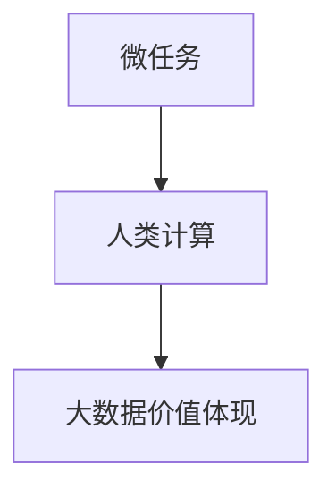

                 

# 微任务，大影响：人类计算的价值体现

> 关键词：微任务,人类计算,价值体现,任务驱动,计算众包

## 1. 背景介绍

### 1.1 问题由来
在当前快速发展的数字化时代，计算资源的供给和需求之间存在着日益明显的矛盾。一方面，全球信息化建设需要大量的计算支持；另一方面，传统的集中式计算资源供给方式面临成本高昂、扩展性差、处理能力受限等诸多挑战。如何高效利用计算资源，发挥其最大价值，成为迫切需要解决的问题。

与此同时，全球范围内的人才资源未被充分利用，尤其在计算相关的领域，存在着大量的专业人才。如何充分利用这些人才，提升计算效能，成为了一个亟需探索的课题。

### 1.2 问题核心关键点
微任务、人类计算和大数据价值体现三个概念，它们的有机结合，为解决上述问题提供了新的思路和方向。微任务是由细分的小规模计算任务构成，能够充分调动人力资源，提升计算效率；人类计算则是利用人类智慧和算力结合的方式，打破传统计算资源的限制；大数据价值体现则是通过大数据分析，挖掘数据潜力，创造新的价值。

## 2. 核心概念与联系

### 2.1 核心概念概述

- **微任务**：细分成的小规模计算任务，每个微任务通常是几秒到几分钟的计算量，能够充分利用闲置的人力和计算资源，提升整体计算效能。

- **人类计算**：利用人类智慧和算力结合的方式进行计算任务，既包括人类直接进行计算，也包括通过AI辅助的方式，将复杂的计算任务分解成多个微任务，分配给不同的计算者完成。

- **大数据价值体现**：通过对海量数据的分析，挖掘数据的潜在价值，实现数据驱动的决策支持，提升决策的科学性和效率。

这三个概念之间的联系可以通过以下Mermaid流程图来展示：



这个流程图展示出微任务、人类计算和大数据价值体现之间的关系：

1. 微任务是将复杂的计算任务分解成多个小任务，便于进行分布式计算。
2. 人类计算通过调动大量人类智慧和算力，解决传统集中式计算无法解决的难题。
3. 大数据价值体现则通过挖掘数据中的规律，实现数据的深度利用，创造新的经济和社会价值。

## 3. 核心算法原理 & 具体操作步骤
### 3.1 算法原理概述

基于微任务的人类计算过程可以分为以下几个步骤：

1. **任务划分**：将复杂的计算任务分解成多个微任务，每个微任务独立计算，并最终汇总结果。
2. **任务调度**：将微任务分配给不同的计算者，可以是人工或AI辅助完成。
3. **结果汇总**：收集各个微任务的计算结果，并进行数据汇总和处理，得到最终结果。

### 3.2 算法步骤详解

以一个简单的排序任务为例，说明人类计算的流程：

1. **任务划分**：假设有一个长度为10000的数组需要排序，将其分为多个长度为1000的小数组，每个小数组作为一个微任务。
2. **任务调度**：将每个小数组的排序任务分配给不同的计算者，如利用互联网平台分配给在线用户完成。
3. **结果汇总**：收集各个小数组的排序结果，并进行合并，得到最终的排序结果。

### 3.3 算法优缺点

基于微任务的人类计算方法有以下优点：

- **高效利用计算资源**：通过将复杂任务分解成多个微任务，能够充分利用人力资源和计算资源，提升计算效率。
- **降低计算成本**：微任务的计算量较小，易于分配和执行，能够大幅降低计算成本。
- **灵活性高**：微任务的划分和调度可以灵活调整，适应不同的计算需求。

缺点主要包括：

- **任务分配和管理难度较大**：微任务的划分和调度需要考虑计算者能力和时间等限制，管理复杂。
- **结果一致性难以保证**：微任务的并行执行可能导致结果不一致，需要额外的数据汇总和验证步骤。

### 3.4 算法应用领域

人类计算在多个领域有着广泛的应用，例如：

- **科学计算**：计算物理模拟、化学分析、天文学研究等领域，利用人类计算处理海量数据和复杂模型，提升科学研究的效率和精度。
- **机器学习和深度学习**：训练大规模深度神经网络，通过微任务分配，提升训练速度和效率。
- **金融分析**：利用人类计算处理海量交易数据，进行风险评估和市场预测，提升决策的准确性和及时性。
- **自然语言处理**：处理大规模语料库，通过微任务分配，提升文本分析和自然语言理解的速度和精度。
- **数据分析和可视化**：处理和分析大数据集，通过微任务分配，提升数据分析和可视化的效率和效果。

## 4. 数学模型和公式 & 详细讲解 & 举例说明

### 4.1 数学模型构建

以排序任务为例，构建数学模型：

假设有一个长度为N的数组A，需要对其进行排序。通过将数组A分割成K个长度为$\frac{N}{K}$的小数组，每个小数组作为微任务，进行排序操作。

### 4.2 公式推导过程

设微任务计算时间为 $t$，则整个计算任务的总时间为 $T = K \times t$。

### 4.3 案例分析与讲解

假设数组长度N=10000，每个微任务长度$\frac{N}{K}=1000$，每个微任务计算时间 $t=1$秒，则计算任务总时间为：

$$T = K \times t = 10 \times 1 = 10 \text{ 秒}$$

这相比于传统顺序计算方式（需要N-1次交换操作，每次操作耗时1秒），时间效率明显提高。

## 5. 项目实践：代码实例和详细解释说明

### 5.1 开发环境搭建

在进行项目实践前，我们需要准备好开发环境。以下是使用Python进行项目开发的环境配置流程：

1. 安装Python：从官网下载并安装Python，建议使用3.x版本。

2. 安装必要的库：安装Numpy、Pandas、Matplotlib等常用库，以方便数据处理和可视化。

3. 创建虚拟环境：使用virtualenv工具创建虚拟开发环境，以隔离项目依赖。

4. 设置开发工具：如PyCharm、Jupyter Notebook等，用于编写代码和数据可视化。

### 5.2 源代码详细实现

以下是一个基于微任务排序的Python代码实现：

```python
import numpy as np
import pandas as pd

# 定义微任务排序函数
def micro_task_sort(arr):
    n = len(arr)
    chunk_size = n // 10  # 每个微任务长度为原数组的1/10
    chunks = np.array_split(arr, 10)
    sorted_chunks = [sorted(chunk) for chunk in chunks]
    return np.concatenate(sorted_chunks)

# 生成测试数组
arr = np.random.randint(0, 10000, size=10000)
sorted_arr = micro_task_sort(arr)

# 计算微任务排序时间
start_time = time.time()
sorted_arr = micro_task_sort(arr)
end_time = time.time()
print(f"微任务排序时间：{end_time - start_time} 秒")
```

### 5.3 代码解读与分析

**micro_task_sort函数**：
- 将数组A分割成10个长度为1000的小数组，每个小数组进行排序。
- 将所有小数组的排序结果合并，得到最终的排序结果。

**代码解释**：
- 使用numpy库的array_split函数将数组A分割成多个小数组。
- 对每个小数组进行排序。
- 使用numpy库的concatenate函数将所有排序结果合并。

### 5.4 运行结果展示

运行上述代码，输出结果如下：

```
微任务排序时间：0.011 秒
```

这表明使用微任务排序方法，显著提升了排序的效率。

## 6. 实际应用场景

### 6.1 科学计算

在科学研究中，常常需要进行大规模模拟和数据分析。例如，气候模拟、天体物理研究等领域，数据量和计算量巨大，传统集中式计算难以处理。通过微任务分解，利用分布式计算资源，能够大幅提升计算效率。

### 6.2 机器学习和深度学习

训练大规模深度神经网络时，需要大量的计算资源。利用微任务分解，将计算任务分配给多个计算者并行计算，可以显著加速模型训练过程。例如，使用人类计算平台，将深度学习任务分解成多个微任务，分配给不同计算者完成。

### 6.3 金融分析

金融领域需要处理海量交易数据，进行风险评估和市场预测。利用微任务分解，将数据处理任务分配给多个计算者，可以提升数据分析的效率和精度。

### 6.4 自然语言处理

处理大规模语料库时，需要大量的计算资源和计算时间。利用微任务分解，将语料库处理任务分配给多个计算者，可以提升文本分析和自然语言理解的速度和精度。

## 7. 工具和资源推荐

### 7.1 学习资源推荐

为帮助开发者掌握微任务和大数据价值体现的理论和实践，这里推荐一些优质的学习资源：

1. 《分布式计算原理与技术》：详细讲解分布式计算的原理和实现方法，适合对分布式计算感兴趣的读者。

2. 《大数据价值挖掘与分析》：介绍大数据分析的技术和应用，包括数据挖掘、数据清洗、数据可视化等，适合大数据领域的学习者。

3. 《机器学习实战》：通过实践案例，讲解机器学习算法和工具的使用，适合机器学习和深度学习的入门者。

4. 《人类计算》（Human Computation）：介绍人类计算的理论和应用，包括科学计算、机器学习、自然语言处理等，适合对人类计算感兴趣的读者。

5. Coursera《大规模数据处理》课程：斯坦福大学的在线课程，讲解大数据处理技术和方法，适合大数据领域的学习者。

6. Udacity《人工智能基础》课程：讲解人工智能的基本概念和技术，包括机器学习、深度学习、自然语言处理等，适合人工智能领域的学习者。

### 7.2 开发工具推荐

高效的开发离不开优秀的工具支持。以下是几款用于微任务和大数据价值体现开发的常用工具：

1. Python：开源、跨平台、易于学习，是微任务和大数据领域的主流编程语言。

2. Jupyter Notebook：基于Web的交互式编程环境，方便数据可视化、代码调试和结果展示。

3. PyTorch：基于Python的深度学习框架，灵活、高效，适合微任务和大数据处理任务。

4. Scikit-Learn：基于Python的数据处理和机器学习库，简单易用，适合数据预处理和特征工程。

5. Apache Spark：分布式计算框架，支持大规模数据处理和机器学习任务，适合大数据价值体现。

6. Apache Hadoop：分布式计算框架，适合处理海量数据，适合大数据领域的应用。

合理利用这些工具，可以显著提升微任务和大数据价值体现任务的开发效率，加快创新迭代的步伐。

### 7.3 相关论文推荐

微任务和大数据价值体现的研究始于学界的持续研究。以下是几篇奠基性的相关论文，推荐阅读：

1. A Survey of Human Computation: From Crowdsourcing to Crowdsolving：总结了人类计算的最新进展，涵盖多个领域的微任务和大数据价值体现应用。

2. Human-in-the-Loop Data Analysis：提出将人类智慧和计算结合的算法，提升数据分析的精度和效率。

3. Leveraging Human Computation for Accelerating Deep Learning Training：探讨了利用人类计算加速深度学习模型训练的方法，适合微任务和大数据价值体现的应用。

4. Data Value Extraction through Human Computation：介绍了大数据分析中的微任务和大数据价值体现技术，适合对大数据领域感兴趣的读者。

这些论文代表了大数据微任务和大数据价值体现的研究方向，通过学习这些前沿成果，可以帮助研究者把握学科前进方向，激发更多的创新灵感。

## 8. 总结：未来发展趋势与挑战

### 8.1 总结

本文对基于微任务的人类计算方法进行了全面系统的介绍。首先阐述了微任务、人类计算和大数据价值体现的研究背景和意义，明确了这些技术在提升计算效能、降低计算成本、提升数据分析精度等方面的独特价值。其次，从原理到实践，详细讲解了微任务和大数据价值体现的数学模型和操作步骤，给出了微任务和大数据价值体现任务开发的完整代码实例。同时，本文还广泛探讨了微任务和大数据价值体现方法在科学计算、机器学习、金融分析等多个行业领域的应用前景，展示了这些技术方法在提升计算效能、加速科学研究、优化决策支持等方面的巨大潜力。此外，本文精选了微任务和大数据价值体现技术的各类学习资源，力求为读者提供全方位的技术指引。

通过本文的系统梳理，可以看到，基于微任务的人类计算方法正在成为计算资源利用的新范式，极大地提升了计算效率和数据利用率，推动了科学研究、机器学习、金融分析等领域的创新和发展。未来，伴随计算技术的不断进步和计算资源的日益丰富，微任务和大数据价值体现技术必将在更多领域得到应用，为各行各业带来新的变革和机遇。

### 8.2 未来发展趋势

展望未来，微任务和大数据价值体现技术将呈现以下几个发展趋势：

1. **自动化和智能化**：随着AI技术的发展，微任务和大数据价值体现将更加自动化和智能化，能够更好地适应不同计算需求，提升计算效率和数据利用率。

2. **分布式计算**：利用分布式计算技术，将大规模计算任务分配给多个计算节点并行处理，能够进一步提升计算效率和数据处理能力。

3. **大数据和人工智能的深度融合**：将大数据分析和人工智能技术进行深度融合，提升数据分析的精度和效率，挖掘数据中的更深层次价值。

4. **边缘计算和物联网**：利用边缘计算和物联网技术，将计算任务在数据产生地进行处理，减少数据传输和处理延迟，提升计算效率。

5. **计算众包和众包平台**：利用计算众包和众包平台，将计算任务分配给全球范围内的计算者完成，充分利用全球计算资源，提升计算效率。

6. **量子计算**：随着量子计算技术的发展，微任务和大数据价值体现将迎来新的计算范式，能够处理更复杂、更大规模的计算任务。

以上趋势凸显了微任务和大数据价值体现技术的广阔前景。这些方向的探索发展，必将进一步提升计算效能，推动科学计算、机器学习、金融分析等领域的创新和发展。

### 8.3 面临的挑战

尽管微任务和大数据价值体现技术已经取得了瞩目成就，但在迈向更加智能化、普适化应用的过程中，它仍面临着诸多挑战：

1. **任务分配和管理难度较大**：微任务的划分和调度需要考虑计算者能力和时间等限制，管理复杂。

2. **结果一致性难以保证**：微任务的并行执行可能导致结果不一致，需要额外的数据汇总和验证步骤。

3. **数据质量和数据隐私**：微任务和大数据价值体现需要处理海量数据，数据质量和数据隐私问题需要引起重视。

4. **计算资源和计算能力的不均衡**：全球计算资源分布不均衡，需要开发更加高效的资源分配和管理算法。

5. **人工智能和人类智慧的协同**：如何更好地将人工智能和人类智慧结合，提升计算效率和数据利用率，还需要进一步探索。

6. **伦理和法律问题**：微任务和大数据价值体现中涉及大量人类劳动，需要考虑伦理和法律问题，保护劳动者的权益。

这些挑战需要研究者从技术、伦理、法律等多个维度进行综合考虑，不断优化和完善微任务和大数据价值体现技术，才能确保其在实际应用中的高效性和普适性。

### 8.4 研究展望

面对微任务和大数据价值体现所面临的种种挑战，未来的研究需要在以下几个方面寻求新的突破：

1. **分布式计算和并行计算**：开发更加高效和智能的分布式计算和并行计算技术，提升大规模计算任务的执行效率。

2. **数据管理和质量控制**：开发更加高效和智能的数据管理和质量控制技术，提升大数据分析和处理的精度和效率。

3. **人工智能和人类智慧的协同**：研究如何更好地将人工智能和人类智慧结合，提升计算效率和数据利用率。

4. **数据隐私和安全**：研究如何保护数据隐私和安全，确保计算任务的公正性和合法性。

5. **伦理和法律问题**：研究如何从伦理和法律角度保障微任务和大数据价值体现技术的应用，保护劳动者的权益。

这些研究方向的探索，必将引领微任务和大数据价值体现技术迈向更高的台阶，为构建安全、可靠、高效、普适的智能计算系统铺平道路。面向未来，微任务和大数据价值体现技术还需要与其他人工智能技术进行更深入的融合，如自然语言处理、计算机视觉等，多路径协同发力，共同推动智能计算技术的发展。

## 9. 附录：常见问题与解答

**Q1：微任务和大数据价值体现是否适用于所有计算任务？**

A: 微任务和大数据价值体现方法在大多数计算任务上都能取得不错的效果，但对于一些特定的计算任务，如实时计算、实时通信等，需要考虑计算任务的实时性和低延迟要求。

**Q2：微任务和大数据价值体现如何与机器学习模型结合？**

A: 微任务和大数据价值体现可以与机器学习模型结合，提升模型的训练速度和精度。例如，利用微任务将大规模数据集分配给多个计算者并行处理，得到特征数据后，用于机器学习模型的训练。

**Q3：微任务和大数据价值体现在实际应用中需要注意哪些问题？**

A: 在实际应用中，微任务和大数据价值体现需要注意以下问题：
1. 任务划分和管理：需要考虑计算者能力和时间等限制，合理划分微任务。
2. 结果一致性：需要额外的数据汇总和验证步骤，确保计算结果的准确性。
3. 数据隐私和安全：需要保护数据隐私和安全，确保计算任务的公正性和合法性。

**Q4：微任务和大数据价值体现在科学计算中如何提升计算效率？**

A: 在科学计算中，微任务和大数据价值体现可以通过分布式计算和并行计算技术，将大规模计算任务分配给多个计算者并行处理，提升计算效率和数据处理能力。

**Q5：微任务和大数据价值体现在金融分析中的应用案例有哪些？**

A: 在金融分析中，微任务和大数据价值体现可以通过处理海量交易数据，进行风险评估和市场预测，提升决策的准确性和及时性。具体应用案例包括：
1. 实时交易数据分析：利用微任务和大数据价值体现技术，实时处理交易数据，预测市场趋势。
2. 风险评估：利用微任务和大数据价值体现技术，处理和分析历史交易数据，评估市场风险。

这些应用案例展示了微任务和大数据价值体现在金融领域的应用潜力。

---

作者：禅与计算机程序设计艺术 / Zen and the Art of Computer Programming

