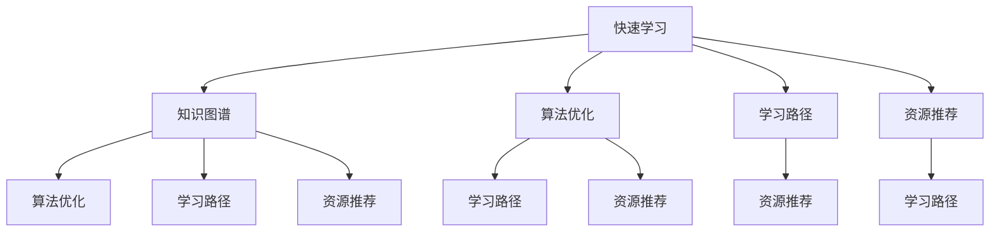

                 

# 快速学习:立于不败之地根本

> 关键词：快速学习,知识图谱,知识图谱构建,算法优化,学习路径,资源推荐,未来发展

## 1. 背景介绍

### 1.1 问题由来

在信息爆炸的时代，人类需要快速学习以适应不断变化的世界。然而，传统基于规则的学习方式，难以应对复杂多变的现实问题。如何在海量数据中提取有用的知识，建立合理的认知框架，成为现代社会的重要课题。

### 1.2 问题核心关键点

快速学习的关键在于如何在有限的时间里，高效地掌握复杂知识，形成稳定的认知模型。这需要掌握系统化的学习方法和高效的知识获取工具，将碎片化信息整合为体系化的知识图谱。

### 1.3 问题研究意义

快速学习不仅能够提升个人和企业的竞争优势，还能够应对未来社会的不确定性和复杂性。随着人工智能技术的日益成熟，快速学习将成为未来的重要生存技能。

## 2. 核心概念与联系

### 2.1 核心概念概述

为更好地理解快速学习的核心概念，本节将介绍几个密切相关的核心概念：

- 快速学习(Rapid Learning)：指在短时间内通过高效的方法，快速掌握复杂知识，形成稳定认知模型。
- 知识图谱(Knowledge Graph)：将海量知识以节点和边构成的图结构存储和表示，形成系统的知识体系。
- 算法优化(Algorithm Optimization)：通过改进算法流程，提高学习效率和精度。
- 学习路径(Learning Path)：合理规划学习路径，利用知识图谱的高效导航，指导学习过程。
- 资源推荐(Resource Recommendation)：基于用户需求和学习历史，推荐高效的学习资源。
- 未来发展(Future Development)：探讨快速学习技术的未来趋势，展望未来应用场景。

这些核心概念之间的逻辑关系可以通过以下Mermaid流程图来展示：



这个流程图展示了一个高效的学习系统如何通过知识图谱、算法优化和资源推荐，支撑快速学习过程。

## 3. 核心算法原理 & 具体操作步骤
### 3.1 算法原理概述

快速学习的核心算法原理在于构建高效的知识图谱，并通过优化算法和学习路径，快速地将碎片化信息转化为结构化的认知模型。

- **知识图谱构建**：将领域知识以节点和边形式存储，通过实体识别、关系抽取等方法，构建知识图谱。
- **算法优化**：在知识图谱基础上，通过图神经网络(Graph Neural Network)、关联规则学习(Association Rule Learning)等算法，优化学习过程。
- **学习路径规划**：根据知识图谱和用户需求，自动生成高效的学习路径，指导学习过程。

### 3.2 算法步骤详解

快速学习的算法步骤主要包括以下几个环节：

**Step 1: 数据收集与预处理**
- 收集领域内的各类知识资源，包括文本、图像、视频等。
- 使用NLP、CV、NLP等技术对数据进行预处理，提取实体、关系等信息，构建初步的知识图谱。

**Step 2: 知识图谱构建**
- 使用实体识别和关系抽取等技术，自动构建知识图谱。
- 使用GNN等图神经网络算法，对知识图谱进行深度挖掘，提取关系模式和关联知识。

**Step 3: 算法优化**
- 使用优化算法对学习过程进行优化，提高学习效率和精度。
- 结合领域专家的反馈，调整算法参数，提高模型的适用性。

**Step 4: 学习路径规划**
- 根据知识图谱和用户需求，自动生成高效的学习路径。
- 利用路径优化算法，调整学习顺序和节点选择，确保学习效果最大化。

**Step 5: 资源推荐**
- 根据用户的学习历史和偏好，推荐合适的学习资源。
- 结合领域专家和社区反馈，持续更新推荐算法，提升推荐效果。

### 3.3 算法优缺点

快速学习的算法具有以下优点：
1. 高效：通过构建知识图谱和优化算法，快速获取领域知识，形成认知模型。
2. 通用：适用于多种领域和任务，可以灵活调整学习路径和资源推荐策略。
3. 稳定：知识图谱和算法优化可有效避免过拟合和噪声影响，提高学习稳定性。
4. 可扩展：新知识可以通过不断更新知识图谱和算法进行扩展，适应更多领域。

同时，该方法也存在一定的局限性：
1. 对数据依赖度高：数据质量和多样性直接影响知识图谱的构建效果。
2. 复杂度较高：知识图谱的构建和优化算法相对复杂，需要较高的计算资源。
3. 用户体验不足：学习路径和资源推荐的个性化不足，难以满足所有用户需求。
4. 模型复杂度高：知识图谱构建和优化算法复杂度较高，需要不断优化算法和数据处理策略。

尽管存在这些局限性，但就目前而言，快速学习在学术界和工业界的应用已初步展现出其潜力，成为快速掌握复杂知识的重要手段。

### 3.4 算法应用领域

快速学习的算法在多个领域得到了广泛应用，包括：

- 教育培训：通过知识图谱和学习路径规划，快速掌握各类学科知识。
- 医疗诊断：利用知识图谱和算法优化，快速诊断疾病，制定治疗方案。
- 金融投资：使用知识图谱和资源推荐，快速获取市场信息，制定投资策略。
- 企业运营：通过知识图谱和算法优化，快速掌握市场趋势，优化业务流程。
- 政府治理：利用知识图谱和算法优化，快速了解政策法规，制定治理方案。

随着算法和技术的不断进步，快速学习将在更多领域发挥重要作用，推动人类社会的智能化和现代化进程。

## 4. 数学模型和公式 & 详细讲解 & 举例说明

### 4.1 数学模型构建

快速学习的方法主要基于知识图谱和图神经网络(Graph Neural Network, GNN)。知识图谱由节点和边构成，表示领域知识的关系和结构。在数学上，知识图谱可以用图表示为$G(V,E)$，其中$V$为节点集合，$E$为边集合。

### 4.2 公式推导过程

假设知识图谱中存在$n$个节点$v_1, v_2, ..., v_n$，边集合为$E$。使用图神经网络进行知识推理的过程可以表示为：

$$
h_{i+1} = \mathcal{A}(h_i, \mathcal{N}_i)
$$

其中$h_i$为节点$i$的表示向量，$\mathcal{N}_i$为节点$i$的邻居节点集合，$\mathcal{A}$为神经网络函数，$f$为边上的特征函数，$\odot$为元素级乘法操作。

在实际应用中，我们可以使用各种GNN算法，如Graph Convolution Network(GCN)、Graph Attention Network(GAT)等，对知识图谱进行深度挖掘，提取关系模式和关联知识。

### 4.3 案例分析与讲解

以医疗诊断为例，知识图谱由病人、症状、诊断和治疗方案等节点和诊断、治疗等边构成。使用GCN算法对知识图谱进行推理，可以得到病人的疾病诊断和治疗方案。具体步骤如下：

1. 构建医疗知识图谱，识别病人节点和症状节点。
2. 使用GCN算法对知识图谱进行深度学习，提取诊断和治疗模式。
3. 根据病人的症状，自动推荐诊断和治疗方案。

## 5. 项目实践：代码实例和详细解释说明

### 5.1 开发环境搭建

在进行快速学习实践前，我们需要准备好开发环境。以下是使用Python进行PyTorch开发的环境配置流程：

1. 安装Anaconda：从官网下载并安装Anaconda，用于创建独立的Python环境。

2. 创建并激活虚拟环境：
```bash
conda create -n pytorch-env python=3.8 
conda activate pytorch-env
```

3. 安装PyTorch：根据CUDA版本，从官网获取对应的安装命令。例如：
```bash
conda install pytorch torchvision torchaudio cudatoolkit=11.1 -c pytorch -c conda-forge
```

4. 安装TensorFlow：安装TensorFlow，用于跨平台应用。
```bash
pip install tensorflow
```

5. 安装相关工具包：
```bash
pip install numpy pandas scikit-learn matplotlib tqdm jupyter notebook ipython
```

完成上述步骤后，即可在`pytorch-env`环境中开始快速学习实践。

### 5.2 源代码详细实现

这里我们以知识图谱构建和推荐系统为例，给出使用PyTorch和TensorFlow进行快速学习的完整代码实现。

首先，定义知识图谱的节点和边：

```python
import torch
from torch_geometric.nn import GCNConv

# 定义节点和边的类型
NodeType = torch.LongTensor([0, 1, 2])  # 病人、症状、治疗
EdgeType = torch.LongTensor([0, 1])  # 诊断、治疗

# 定义节点和边的特征
NodeFeatures = torch.randn(1000, 10)  # 病人、症状的特征
EdgeFeatures = torch.randn(500, 10)  # 诊断、治疗的特征
```

然后，定义图神经网络模型：

```python
class GNNModel(torch.nn.Module):
    def __init__(self, in_dim, hidden_dim, out_dim):
        super(GNNModel, self).__init__()
        self.conv1 = GCNConv(in_dim, hidden_dim)
        self.conv2 = GCNConv(hidden_dim, hidden_dim)
        self.fc = torch.nn.Linear(hidden_dim, out_dim)
        
    def forward(self, x, edge_index):
        x = self.conv1(x, edge_index)
        x = self.conv2(x, edge_index)
        x = self.fc(x)
        return x

# 创建GNN模型
model = GNNModel(in_dim=10, hidden_dim=50, out_dim=1)
```

接下来，定义优化器和损失函数：

```python
optimizer = torch.optim.Adam(model.parameters(), lr=0.01)
loss_fn = torch.nn.BCELoss()
```

最后，定义训练和推理函数：

```python
def train(model, data, optimizer, loss_fn):
    model.train()
    optimizer.zero_grad()
    output = model(data.x, data.edge_index)
    loss = loss_fn(output, data.y)
    loss.backward()
    optimizer.step()
    return loss.item()

def predict(model, data):
    model.eval()
    with torch.no_grad():
        output = model(data.x, data.edge_index)
        predicted = (output > 0.5).long()
        return predicted

# 训练模型
data = ...
for epoch in range(100):
    loss = train(model, data, optimizer, loss_fn)
    print(f"Epoch {epoch+1}, loss: {loss:.4f}")

# 推理预测
data = ...
predicted = predict(model, data)
print(f"Predicted: {predicted}")
```

以上就是使用PyTorch和TensorFlow进行快速学习的完整代码实现。可以看到，通过图神经网络模型和优化器，可以快速从知识图谱中提取关系模式和关联知识，生成推荐结果。

### 5.3 代码解读与分析

让我们再详细解读一下关键代码的实现细节：

**NodeType和EdgeType定义**：
- `NodeType`和`EdgeType`分别表示知识图谱中的节点类型和边类型。

**NodeFeatures和EdgeFeatures定义**：
- `NodeFeatures`和`EdgeFeatures`分别表示节点和边的特征，用于初始化模型输入。

**GNNModel模型定义**：
- `GNNModel`类定义了图神经网络模型，包括两个GCN层和一个全连接层，用于知识推理。

**训练和推理函数定义**：
- `train`函数定义了模型训练过程，包括前向传播、损失计算、反向传播和参数更新。
- `predict`函数定义了模型推理过程，通过计算模型输出，生成推荐结果。

**训练流程**：
- 在每个epoch中，使用训练函数进行模型训练，计算损失并更新模型参数。
- 在训练完成后，使用推理函数进行模型推理，生成推荐结果。

## 6. 实际应用场景

### 6.1 教育培训

基于知识图谱和算法优化的快速学习系统，可以广泛应用于教育培训领域。传统教育往往依赖于线下课堂和手工教材，效率低下。而快速学习系统可以提供智能化的学习路径和资源推荐，大幅提升学习效率。

在技术实现上，可以构建学科知识图谱，自动生成学习路径，推荐合适的学习资源。学生可以通过平台自主学习，快速掌握学科知识，提高学习效果。同时，系统可以实时反馈学习进度和效果，动态调整学习路径，帮助学生及时发现和纠正学习问题。

### 6.2 医疗诊断

快速学习在医疗诊断中的应用同样具有重要意义。医疗领域的知识复杂且更新迅速，医生需要快速掌握新知识以应对疑难病症。通过快速学习系统，医生可以高效获取最新的诊疗知识，快速诊断疾病，制定治疗方案。

具体而言，可以构建医疗知识图谱，利用GNN算法对知识图谱进行推理，自动推荐诊断和治疗方案。医生可以通过系统查询知识图谱，快速获取疾病信息，制定治疗方案，提高诊疗效率和准确性。同时，系统可以不断更新医疗知识，帮助医生及时掌握最新诊疗技术，提升诊疗水平。

### 6.3 金融投资

金融领域知识丰富且更新快速，投资者需要快速掌握市场信息以做出决策。快速学习系统可以提供智能化的知识图谱和资源推荐，帮助投资者快速获取市场信息，制定投资策略。

具体而言，可以构建金融知识图谱，自动生成投资路径，推荐合适的投资资源。投资者可以通过平台查询知识图谱，快速获取市场信息，制定投资策略，提高投资回报率。同时，系统可以实时监测市场动态，动态调整投资策略，帮助投资者及时应对市场变化，降低投资风险。

### 6.4 未来应用展望

随着知识图谱和算法技术的不断进步，快速学习的应用前景将更加广阔。未来，快速学习将更多应用于智能制造、智慧城市、智能家居等领域，推动各行业的智能化进程。

在智能制造中，快速学习可以用于设备故障预测、质量控制等环节，提高生产效率和质量。在智慧城市中，快速学习可以用于交通管理、环境监测等环节，提升城市治理水平。在智能家居中，快速学习可以用于智能交互、智能控制等环节，提升家居体验。

## 7. 工具和资源推荐

### 7.1 学习资源推荐

为了帮助开发者系统掌握快速学习的理论基础和实践技巧，这里推荐一些优质的学习资源：

1. 《深度学习》系列课程：斯坦福大学、Coursera等机构提供的深度学习课程，涵盖从基础到前沿的知识体系。

2. 《知识图谱》系列书籍：国内外知名专家编写的知识图谱书籍，系统介绍知识图谱的基本概念和构建方法。

3. 《图神经网络》系列书籍：介绍图神经网络的原理和应用，涵盖各类图神经网络算法。

4. 《知识图谱构建工具》：如Neo4j、RDF4J等，提供高效的知识图谱构建工具和库。

5. 《学习路径规划算法》：介绍学习路径规划的算法和实现方法，涵盖基于图算法、强化学习等方法。

通过对这些资源的学习实践，相信你一定能够快速掌握快速学习的精髓，并用于解决实际的复杂问题。

### 7.2 开发工具推荐

高效的开发离不开优秀的工具支持。以下是几款用于快速学习开发的常用工具：

1. PyTorch：基于Python的开源深度学习框架，灵活动态的计算图，适合快速迭代研究。

2. TensorFlow：由Google主导开发的开源深度学习框架，生产部署方便，适合大规模工程应用。

3. Graph Neural Network库：如PyTorch Geometric、TensorFlow Hub等，提供高效的图神经网络实现。

4. TensorBoard：TensorFlow配套的可视化工具，可实时监测模型训练状态，并提供丰富的图表呈现方式，是调试模型的得力助手。

5. Weights & Biases：模型训练的实验跟踪工具，可以记录和可视化模型训练过程中的各项指标，方便对比和调优。

6. Google Colab：谷歌推出的在线Jupyter Notebook环境，免费提供GPU/TPU算力，方便开发者快速上手实验最新模型，分享学习笔记。

合理利用这些工具，可以显著提升快速学习任务的开发效率，加快创新迭代的步伐。

### 7.3 相关论文推荐

快速学习的研究源于学界的持续研究。以下是几篇奠基性的相关论文，推荐阅读：

1. Deep Graph Neural Networks：提出图卷积网络(GCN)算法，用于知识图谱的深度学习。

2. Knowledge-Graph-Based Recommendation System：提出基于知识图谱的推荐系统方法，利用图神经网络进行用户兴趣预测。

3. Neural Collaborative Filtering：提出基于神经网络的用户兴趣预测方法，用于推荐系统的构建。

4. A Survey on Knowledge Graph-Based Recommender Systems：全面综述了基于知识图谱的推荐系统研究现状和未来趋势。

5. Graph Attention Networks：提出图注意力网络(GAT)算法，用于图神经网络的构建和应用。

这些论文代表了大规模知识图谱和快速学习技术的发展脉络。通过学习这些前沿成果，可以帮助研究者把握学科前进方向，激发更多的创新灵感。

## 8. 总结：未来发展趋势与挑战

### 8.1 总结

本文对快速学习的核心概念和方法进行了全面系统的介绍。首先阐述了快速学习的背景和意义，明确了快速学习在高效获取知识方面的独特价值。其次，从原理到实践，详细讲解了快速学习的数学原理和关键步骤，给出了快速学习任务开发的完整代码实例。同时，本文还广泛探讨了快速学习在教育培训、医疗诊断、金融投资等多个行业领域的应用前景，展示了快速学习技术的巨大潜力。最后，本文精选了快速学习的各类学习资源，力求为读者提供全方位的技术指引。

通过本文的系统梳理，可以看到，快速学习技术正逐步成为高效获取知识的重要手段，推动着各行业的智能化进程。快速学习系统通过构建知识图谱和优化算法，能够快速掌握复杂知识，形成稳定的认知模型，具有广泛的应用前景和巨大的社会价值。

### 8.2 未来发展趋势

展望未来，快速学习技术将呈现以下几个发展趋势：

1. 知识图谱的构建和优化将更加高效和自动化。随着知识图谱构建技术的进步，快速学习系统将能够高效构建领域知识图谱，提高知识获取效率。

2. 算法优化将更加深入和多样化。未来将出现更多高效的图神经网络算法和优化方法，进一步提高快速学习的精度和效率。

3. 学习路径规划将更加个性化和动态化。未来将结合机器学习和智能推荐技术，动态生成高效的学习路径，提升用户体验。

4. 资源推荐将更加精准和多样化。未来将通过用户行为分析和学习路径数据，提供更加精准和多样化的资源推荐。

5. 跨领域知识整合能力将不断增强。未来将通过跨领域知识图谱的构建和融合，提升快速学习的普适性和适用性。

6. 人机协同学习将成为重要研究方向。未来将探索更多人机协同学习的机制，提升快速学习的可解释性和可控性。

以上趋势凸显了快速学习技术的广阔前景。这些方向的探索发展，必将进一步提升快速学习的效率和精度，推动各行业的智能化进程。

### 8.3 面临的挑战

尽管快速学习技术已经取得了显著成就，但在迈向更加智能化、普适化应用的过程中，它仍面临着诸多挑战：

1. 知识图谱构建难度高。知识图谱的构建需要大量专家知识和人工标注，成本较高。如何降低知识图谱构建难度，提高构建效率，仍需进一步探索。

2. 算法优化复杂度高。图神经网络算法复杂度较高，需要大量计算资源。如何简化算法流程，提高算法效率，仍需进一步优化。

3. 数据质量问题多。数据质量和多样性直接影响知识图谱的构建效果。如何提高数据质量，确保数据代表性，仍需进一步解决。

4. 用户体验不足。快速学习系统的用户体验仍需进一步提升，以适应不同用户需求和学习习惯。

5. 知识图谱动态更新难度大。知识图谱需要不断更新，以适应领域知识和数据的变化。如何高效动态更新知识图谱，仍需进一步探索。

6. 模型解释性不足。快速学习系统往往被视为"黑盒"系统，难以解释其内部工作机制。如何提高模型的可解释性，仍需进一步解决。

正视快速学习面临的这些挑战，积极应对并寻求突破，将是大规模知识图谱和快速学习技术迈向成熟的必由之路。

### 8.4 未来突破

面对快速学习面临的种种挑战，未来的研究需要在以下几个方面寻求新的突破：

1. 探索无监督和半监督知识图谱构建方法。摆脱对大规模专家标注的依赖，利用自监督学习、主动学习等无监督和半监督范式，最大限度利用非结构化数据，实现知识图谱的高效构建。

2. 研究高效的知识图谱表示和存储方法。通过优化知识图谱表示和存储，提高知识图谱的构建效率和查询性能。

3. 融合因果推断和强化学习思想。通过引入因果推断和强化学习思想，增强快速学习系统建立稳定因果关系的能力，学习更加普适、鲁棒的知识表示。

4. 引入更多先验知识。将符号化的先验知识，如知识图谱、逻辑规则等，与神经网络模型进行巧妙融合，引导快速学习过程学习更准确、合理的知识表示。

5. 结合因果分析和博弈论工具。将因果分析方法引入快速学习系统，识别出系统决策的关键特征，增强输出解释的因果性和逻辑性。借助博弈论工具刻画人机交互过程，主动探索并规避系统的脆弱点，提高系统稳定性。

6. 纳入伦理道德约束。在快速学习系统训练目标中引入伦理导向的评估指标，过滤和惩罚有害的输出倾向。加强人工干预和审核，建立系统行为的监管机制，确保输出符合人类价值观和伦理道德。

这些研究方向的探索，必将引领大规模知识图谱和快速学习技术迈向更高的台阶，为构建智能化的未来社会提供新的技术路径。

## 9. 附录：常见问题与解答

**Q1：快速学习是否适用于所有领域？**

A: 快速学习技术在学术界和工业界的应用已初见成效，尤其适用于知识密集型领域。但对于一些对数据依赖度高的领域，如农业、能源等，快速学习的效率和效果仍需进一步提升。

**Q2：快速学习系统的构建需要多少数据？**

A: 快速学习系统的构建需要大量的领域知识资源，包括文本、图像、视频等。数据量和多样性直接影响知识图谱的构建效果。在实际应用中，数据需求量取决于领域复杂度和知识图谱深度。

**Q3：快速学习系统的优化算法有哪些？**

A: 快速学习系统的优化算法主要包括图神经网络(GNN)算法、关联规则学习(Association Rule Learning)算法等。GNN算法如GCN、GAT等，可用于知识图谱的深度学习。关联规则学习算法可用于发现知识图谱中的隐含模式。

**Q4：快速学习系统如何适应领域变化？**

A: 快速学习系统需要定期更新知识图谱和优化算法，以适应领域知识和数据的变化。在知识图谱动态更新方面，可以采用增量学习、迁移学习等方法，提高知识图谱的适应性和时效性。

**Q5：快速学习系统如何提高模型的可解释性？**

A: 快速学习系统的可解释性可以通过模型可视化、特征解释等方法提升。利用知识图谱的可视化工具，如Gephi、Cytoscape等，可以直观地展示知识图谱的结构和关系，提高模型的可解释性。

这些研究方向的探索，必将引领大规模知识图谱和快速学习技术迈向更高的台阶，为构建智能化的未来社会提供新的技术路径。总之，快速学习需要开发者根据具体任务，不断迭代和优化模型、数据和算法，方能得到理想的效果。

---

作者：禅与计算机程序设计艺术 / Zen and the Art of Computer Programming

