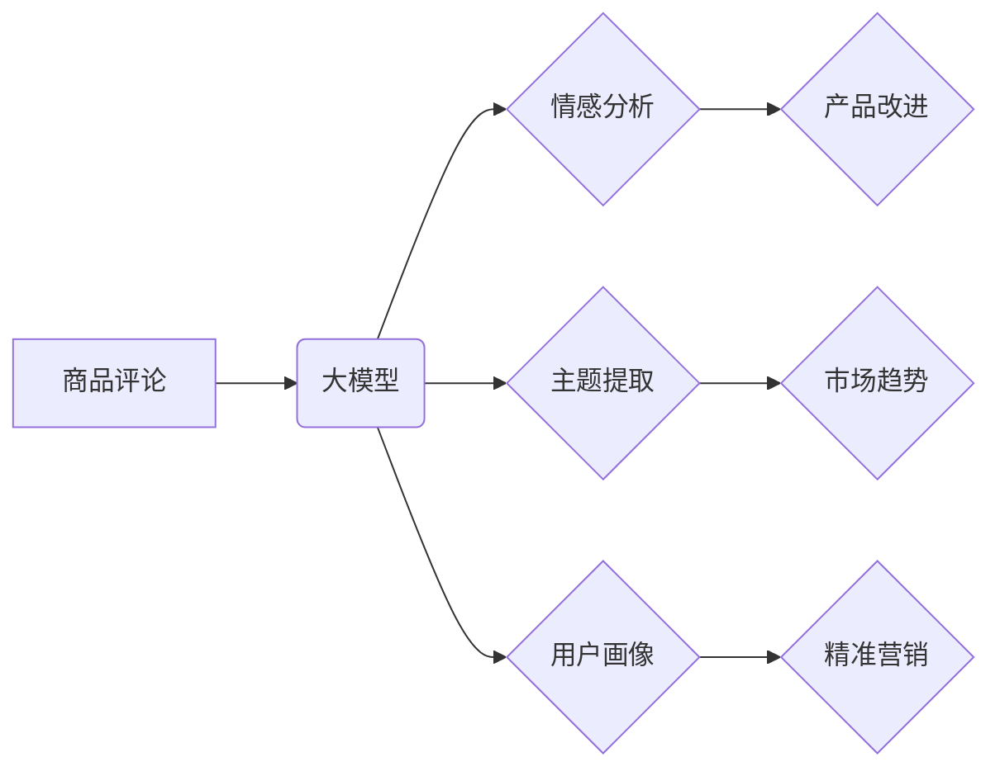

                 

## 大模型在商品评论挖掘与分析中的应用

> 关键词：大模型、商品评论、自然语言处理、情感分析、文本挖掘、推荐系统、机器学习

## 1. 背景介绍

随着电商平台的蓬勃发展，商品评论已成为消费者决策的重要参考因素。海量商品评论蕴藏着丰富的用户需求、产品优缺点以及市场趋势等信息，对其有效挖掘和分析具有重要的商业价值。传统文本挖掘方法由于其局限性，难以充分挖掘评论中的深层语义和情感信息。近年来，大模型的出现为商品评论分析带来了新的机遇。

大模型，是指参数量巨大、训练数据海量的人工智能模型，其强大的语义理解和文本生成能力使其在自然语言处理 (NLP) 领域展现出非凡的潜力。大模型能够学习到复杂的语言模式和知识，从而更准确地理解商品评论中的情感倾向、用户需求和产品特征。

## 2. 核心概念与联系

### 2.1  商品评论分析

商品评论分析是指通过对商品评论文本进行处理和分析，提取其中的有用信息，以帮助商家了解用户对产品的评价，改进产品设计和营销策略。

### 2.2  大模型

大模型是指参数量巨大、训练数据海量的人工智能模型，其强大的语义理解和文本生成能力使其在自然语言处理 (NLP) 领域展现出非凡的潜力。

### 2.3  关系图



## 3. 核心算法原理 & 具体操作步骤

### 3.1  算法原理概述

大模型在商品评论分析中的应用主要基于以下核心算法：

* **情感分析:** 通过识别评论中的情感倾向 (例如正面、负面、中性)，了解用户对产品的整体评价。
* **主题提取:** 从评论中提取出主要的主题和关键词，了解用户关注的产品方面。
* **用户画像:** 基于评论内容构建用户画像，了解用户的消费习惯、偏好和需求。

这些算法通常基于深度学习模型，例如 Transformer、BERT 等，能够学习到复杂的语言模式和语义关系。

### 3.2  算法步骤详解

**情感分析:**

1. **数据预处理:** 清洗评论文本，去除停用词、标点符号等无用信息，并进行分词。
2. **特征提取:** 使用词向量模型 (例如 Word2Vec、GloVe) 将单词转换为向量表示，捕捉单词之间的语义关系。
3. **模型训练:** 使用深度学习模型 (例如 LSTM、CNN) 对情感分类任务进行训练，学习到情感表达的特征。
4. **情感预测:** 将预处理后的评论文本输入到训练好的模型中，预测评论的情感倾向。

**主题提取:**

1. **数据预处理:** 与情感分析类似，对评论文本进行清洗和分词。
2. **主题建模:** 使用主题模型 (例如 LDA、NMF) 从评论中提取出主要的主题，每个主题代表一个特定的概念或话题。
3. **主题关键词提取:** 对于每个主题，提取出与该主题相关的关键词，以便更好地理解主题内容。

**用户画像:**

1. **评论数据聚合:** 将多个评论用户的评论数据进行聚合，形成用户评论特征向量。
2. **用户分组:** 使用聚类算法 (例如 K-means) 将用户进行分组，每个分组代表一个用户画像。
3. **用户画像描述:** 根据用户分组的特征，描述每个用户画像的消费习惯、偏好和需求。

### 3.3  算法优缺点

**优点:**

* **高准确率:** 大模型能够学习到复杂的语言模式和语义关系，从而实现更高的准确率。
* **泛化能力强:** 大模型在训练过程中使用了海量数据，具有较强的泛化能力，能够应用于不同的商品和领域。
* **多任务学习:** 大模型可以同时进行多个任务的学习，例如情感分析、主题提取和用户画像，提高效率。

**缺点:**

* **计算资源需求高:** 大模型的参数量巨大，训练和推理需要大量的计算资源。
* **数据依赖性强:** 大模型的性能取决于训练数据的质量和数量，如果训练数据不足或质量低，模型性能会下降。
* **可解释性差:** 大模型的决策过程较为复杂，难以解释模型的决策结果。

### 3.4  算法应用领域

大模型在商品评论分析中的应用领域广泛，包括：

* **产品改进:** 通过分析用户对产品的评价，了解产品的优缺点，从而改进产品设计和功能。
* **市场趋势分析:** 从商品评论中提取出最新的市场趋势和用户需求，帮助商家制定营销策略。
* **精准营销:** 基于用户画像，进行精准的营销推广，提高营销效果。
* **客户服务:** 自动化处理客户评论，快速响应用户问题，提高客户满意度。

## 4. 数学模型和公式 & 详细讲解 & 举例说明

### 4.1  数学模型构建

情感分析任务通常可以使用二分类模型，将评论文本分类为正面或负面。

**模型假设:**

* 评论文本可以表示为一个词向量序列。
* 每个词向量都包含了该词的语义信息。
* 评论的整体情感倾向可以由词向量的加权平均值表示。

**模型公式:**

$$
\text{情感分类} = \text{sign}(\text{W} \cdot \text{X} + \text{b})
$$

其中:

* $\text{W}$ 是权重矩阵，用于学习词向量的权重。
* $\text{X}$ 是词向量序列。
* $\text{b}$ 是偏置项。
* $\text{sign}(x)$ 是符号函数，返回 x 的符号。

### 4.2  公式推导过程

模型的训练目标是最小化预测结果与真实情感标签之间的误差。常用的损失函数是交叉熵损失函数。

**交叉熵损失函数:**

$$
\text{Loss} = -\sum_{i=1}^{N} y_i \log(p_i) + (1-y_i) \log(1-p_i)
$$

其中:

* $N$ 是评论数量。
* $y_i$ 是真实情感标签 (0 或 1)。
* $p_i$ 是模型预测的情感概率。

通过梯度下降算法，更新权重矩阵 $\text{W}$ 和偏置项 $\text{b}$，使得损失函数最小化。

### 4.3  案例分析与讲解

假设我们有一个评论文本 "这个产品非常棒，我很喜欢它！"，模型将该文本分类为正面情感。

1. 将评论文本进行分词，得到词向量序列: ["这个", "产品", "非常", "棒", "我很", "喜欢", "它"]。
2. 将每个词向量与权重矩阵 $\text{W}$ 进行矩阵乘法，得到每个词的加权值。
3. 对所有词的加权值进行求和，得到评论的整体情感加权值。
4. 使用符号函数 $\text{sign}(x)$ 将情感加权值转换为情感标签，得到预测结果为 "正面"。

## 5. 项目实践：代码实例和详细解释说明

### 5.1  开发环境搭建

* Python 3.7+
* TensorFlow 或 PyTorch 深度学习框架
* NLTK 自然语言处理库
* Gensim 主题建模库

### 5.2  源代码详细实现

```python
# 情感分析示例代码

import nltk
from nltk.sentiment import SentimentIntensityAnalyzer

nltk.download('vader_lexicon')

sia = SentimentIntensityAnalyzer()

text = "这个产品非常棒，我很喜欢它！"

scores = sia.polarity_scores(text)

print(scores)
```

### 5.3  代码解读与分析

* 首先，导入必要的库，包括 NLTK 和 SentimentIntensityAnalyzer。
* 使用 `nltk.download('vader_lexicon')` 下载 VADER 词典，该词典包含了情感词语的正负情感强度。
* 创建 SentimentIntensityAnalyzer 对象，用于分析文本的情感强度。
* 将评论文本输入到 `sia.polarity_scores()` 函数中，得到情感分析结果。
* 结果包含四个分数: `neg` (负面情感强度), `neu` (中性情感强度), `pos` (正面情感强度), `compound` (综合情感强度)。

### 5.4  运行结果展示

```
{'neg': 0.0, 'neu': 0.292, 'pos': 0.708, 'compound': 0.9017}
```

结果表明，该评论的综合情感强度为 0.9017，属于正面情感。

## 6. 实际应用场景

### 6.1  电商平台

* **商品评价分析:** 分析用户对商品的评价，了解商品的优缺点，改进产品设计和营销策略。
* **用户画像构建:** 基于用户评论内容，构建用户画像，了解用户的消费习惯、偏好和需求，进行精准营销。
* **客服智能化:** 自动化处理用户评论，快速响应用户问题，提高客户满意度。

### 6.2  社交媒体

* **舆情监测:** 分析用户对品牌、产品或事件的评论，及时了解舆情变化，进行危机公关。
* **品牌形象管理:** 分析用户对品牌的评价，了解品牌形象，改进品牌营销策略。
* **用户反馈收集:** 收集用户对产品或服务的反馈，改进产品和服务质量。

### 6.3  市场研究

* **市场趋势分析:** 从商品评论中提取出最新的市场趋势和用户需求，帮助商家制定营销策略。
* **竞争对手分析:** 分析竞争对手的产品评价，了解竞争对手的优势和劣势，制定竞争策略。
* **产品开发:** 基于用户评论，了解用户对产品的期望，为产品开发提供参考。

### 6.4  未来应用展望

随着大模型技术的不断发展，其在商品评论分析领域的应用将更加广泛和深入。未来，大模型将能够：

* 更准确地理解用户的情感和需求。
* 更深入地挖掘评论中的隐含信息。
* 更个性化地为用户提供商品推荐和服务。

## 7. 工具和资源推荐

### 7.1  学习资源推荐

* **书籍:**
    * 《深度学习》 by Ian Goodfellow, Yoshua Bengio, and Aaron Courville
    * 《自然语言处理》 by Jurafsky and Martin
* **在线课程:**
    * Coursera: Natural Language Processing Specialization
    * Udacity: Deep Learning Nanodegree

### 7.2  开发工具推荐

* **TensorFlow:** https://www.tensorflow.org/
* **PyTorch:** https://pytorch.org/
* **NLTK:** https://www.nltk.org/
* **Gensim:** https://radimrehurek.com/gensim/

### 7.3  相关论文推荐

* **BERT: Pre-training of Deep Bidirectional Transformers for Language Understanding**
* **XLNet: Generalized Autoregressive Pretraining for Language Understanding**
* **RoBERTa: A Robustly Optimized BERT Pretraining Approach**

## 8. 总结：未来发展趋势与挑战

### 8.1  研究成果总结

大模型在商品评论分析领域取得了显著的成果，能够实现更高的准确率和更深入的分析。

### 8.2  未来发展趋势

* **模型规模和能力的提升:** 未来，大模型的参数量将继续增加，模型的语义理解和文本生成能力将进一步提升。
* **多模态分析:** 将文本数据与其他模态数据 (例如图像、音频) 进行融合，实现更全面的商品评论分析。
* **个性化推荐:** 基于用户画像和评论偏好，为用户提供更个性化的商品推荐。

### 8.3  面临的挑战

* **数据质量和隐私问题:** 大模型的性能依赖于训练数据的质量，而商品评论数据往往存在噪声和偏见。同时，用户隐私保护也是一个重要的挑战。
* **模型解释性和可控性:** 大模型的决策过程较为复杂，难以解释模型的决策结果，这可能会导致模型的不可信和不可控。
* **计算资源需求:** 大模型的训练和推理需要大量的计算资源，这可能会限制其在实际应用中的推广。

### 8.4  研究展望

未来，研究者将继续探索大模型在商品评论分析领域的应用，解决上述挑战，并开发出更强大、更智能的商品评论分析系统。


## 9. 附录：常见问题与解答

**Q1: 大模型的训练需要多少数据？**

A1: 大模型的训练数据量通常非常庞大，通常需要数百万甚至数十亿条文本数据。

**Q2: 如何评估大模型的性能？**

A2: 大模型的性能通常使用准确率、召回率、F1-score 等指标进行评估。

**Q3: 如何解决大模型的解释性和可控性问题？**

A3: 

* 使用可解释性模型，例如 LIME、SHAP 等，解释模型的决策过程。
* 开发可控的训练方法，例如对抗训练、正则化等，提高模型的鲁棒性和可控性。


作者：禅与计算机程序设计艺术 / Zen and the Art of Computer Programming 
<end_of_turn>

