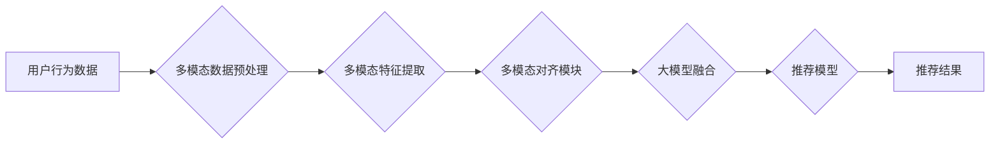

                 

## 大模型在推荐系统中的多模态对齐应用

> 关键词：大模型、推荐系统、多模态、对齐、融合、深度学习、Transformer

## 1. 背景介绍

推荐系统作为互联网时代的核心技术之一，旨在根据用户的历史行为、偏好和上下文信息，精准推荐用户感兴趣的内容。传统的推荐系统主要依赖文本数据，例如用户评分、商品描述等，但现实世界中信息的多样性远超文本。图片、视频、音频等多模态数据蕴含着丰富的语义信息，能够更全面地刻画用户需求和内容特征。

近年来，大模型的蓬勃发展为多模态推荐系统带来了新的机遇。大模型具备强大的语义理解和泛化能力，能够有效地融合不同模态数据，提升推荐系统的精准度和用户体验。然而，不同模态数据之间存在着语义鸿沟，直接融合往往难以获得理想效果。因此，如何有效地对齐不同模态数据，实现多模态信息的融合，是多模态推荐系统面临的重大挑战。

## 2. 核心概念与联系

**2.1 多模态数据**

多模态数据是指包含多种不同类型数据信息的集合，例如文本、图像、音频、视频等。每个模态数据都具有独特的特征和语义表达方式，共同构成了更丰富的、更全面的信息表达。

**2.2 多模态对齐**

多模态对齐是指将不同模态数据中的语义信息进行映射和对齐，使其能够在语义上相互理解和融合。对齐的目标是消除不同模态数据之间的语义鸿沟，使得不同模态的信息能够有效地结合起来，为推荐系统提供更全面的用户和内容特征。

**2.3 大模型**

大模型是指参数规模庞大、训练数据海量的人工智能模型。大模型具备强大的语义理解和泛化能力，能够学习到复杂的语义关系和模式，并将其应用于各种自然语言处理和多模态理解任务。

**2.4 多模态推荐系统**

多模态推荐系统是指利用多种模态数据（如文本、图像、音频等）来进行推荐的系统。它通过融合不同模态的信息，能够更准确地理解用户的需求和偏好，从而提供更个性化、更精准的推荐结果。

**2.5 架构图**



## 3. 核心算法原理 & 具体操作步骤

**3.1 算法原理概述**

多模态对齐算法旨在将不同模态数据中的语义信息进行映射和对齐，使其能够在语义上相互理解和融合。常用的多模态对齐算法包括：

* **跨模态匹配:** 利用深度学习模型学习不同模态之间的语义映射关系，将不同模态的数据点进行匹配。
* **多模态嵌入:** 将不同模态的数据映射到同一个低维空间，使得不同模态的数据点在语义上更接近。
* **注意力机制:** 利用注意力机制学习不同模态之间的重要性权重，将不同模态的信息进行加权融合。

**3.2 算法步骤详解**

1. **数据预处理:** 对不同模态的数据进行清洗、格式化和转换，使其能够被模型所接受。
2. **特征提取:** 利用预训练模型或专门设计的模型提取不同模态的数据特征。
3. **多模态对齐:** 利用跨模态匹配、多模态嵌入或注意力机制等算法对齐不同模态的数据特征。
4. **融合特征:** 将对齐后的多模态特征进行融合，形成更完整的用户和内容特征。
5. **推荐模型训练:** 利用融合后的特征训练推荐模型，并进行模型评估和优化。

**3.3 算法优缺点**

* **跨模态匹配:** 优点：能够学习到更精细的语义映射关系，提升对齐效果。缺点：训练复杂度高，需要大量的标注数据。
* **多模态嵌入:** 优点：训练相对简单，不需要大量的标注数据。缺点：难以学习到复杂的语义关系，对齐效果可能不如跨模态匹配。
* **注意力机制:** 优点：能够学习到不同模态之间的重要性权重，提升融合效果。缺点：需要额外的参数和计算量。

**3.4 算法应用领域**

多模态对齐算法在推荐系统、图像识别、自然语言理解等领域都有广泛的应用。

## 4. 数学模型和公式 & 详细讲解 & 举例说明

**4.1 数学模型构建**

假设我们有两种模态数据：文本模态 $T$ 和图像模态 $V$。我们的目标是学习一个多模态对齐模型 $f$，将文本和图像映射到同一个低维空间，使得语义相似的文本和图像在该空间中的距离更近。

我们可以使用以下数学模型来表示多模态对齐过程：

* $T \in R^{d_t}$：文本模态的特征向量，$d_t$ 为文本特征维度。
* $V \in R^{d_v}$：图像模态的特征向量，$d_v$ 为图像特征维度。
* $f_t(T)$：文本模态的特征映射函数。
* $f_v(V)$：图像模态的特征映射函数。
* $z \in R^{d}$：多模态融合后的特征向量，$d$ 为融合特征维度。

**4.2 公式推导过程**

我们可以使用以下公式来计算多模态融合后的特征向量：

$$z = f(T, V) = \frac{f_t(T) + f_v(V)}{\|f_t(T) + f_v(V)\|} $$

其中，$f(T, V)$ 表示多模态对齐模型，它将文本和图像特征向量 $f_t(T)$ 和 $f_v(V)$ 进行加权求和，并进行归一化处理，得到最终的多模态融合特征向量 $z$。

**4.3 案例分析与讲解**

例如，在电商推荐系统中，我们可以使用多模态对齐算法将商品的文本描述和图像特征进行融合。通过对齐，我们可以学习到商品文本和图像之间的语义关系，例如“红色”和“红色衣服”之间的关系。

## 5. 项目实践：代码实例和详细解释说明

**5.1 开发环境搭建**

* Python 3.7+
* PyTorch 1.7+
* CUDA 10.2+

**5.2 源代码详细实现**

```python
import torch
import torch.nn as nn

class MultiModalAlignment(nn.Module):
    def __init__(self, text_dim, image_dim, embedding_dim):
        super(MultiModalAlignment, self).__init__()
        self.text_embedding = nn.Linear(text_dim, embedding_dim)
        self.image_embedding = nn.Linear(image_dim, embedding_dim)
        self.fusion_layer = nn.Linear(embedding_dim * 2, embedding_dim)

    def forward(self, text, image):
        text_embedding = self.text_embedding(text)
        image_embedding = self.image_embedding(image)
        fused_embedding = self.fusion_layer(torch.cat((text_embedding, image_embedding), dim=1))
        return fused_embedding
```

**5.3 代码解读与分析**

* `MultiModalAlignment` 类定义了一个多模态对齐模型。
* `text_embedding` 和 `image_embedding` 是两个线性层，用于将文本和图像特征向量映射到同一个低维空间。
* `fusion_layer` 是一个线性层，用于将文本和图像特征向量进行融合。
* `forward` 方法定义了模型的正向传播过程。

**5.4 运行结果展示**

通过训练和测试，我们可以评估多模态对齐模型的性能，例如准确率、召回率等。

## 6. 实际应用场景

**6.1 图像推荐**

利用多模态对齐算法，可以将图像特征和用户偏好信息进行融合，推荐用户感兴趣的图片。例如，可以根据用户的浏览历史和点赞记录，推荐与用户兴趣相符的图片。

**6.2 视频推荐**

类似于图像推荐，多模态对齐算法也可以应用于视频推荐。可以将视频的视觉特征、音频特征和用户观看记录进行融合，推荐用户感兴趣的视频。

**6.3 商品推荐**

在电商平台，多模态对齐算法可以将商品的文本描述、图像特征和用户购买记录进行融合，推荐用户可能感兴趣的商品。

**6.4 内容推荐**

多模态对齐算法可以应用于各种内容推荐场景，例如新闻推荐、音乐推荐、博客推荐等。

**6.5 未来应用展望**

随着大模型和多模态技术的不断发展，多模态对齐算法将在推荐系统中发挥越来越重要的作用。未来，我们可以期待以下应用场景：

* **更个性化的推荐:** 通过融合更多模态数据，例如用户的情绪、行为模式等，实现更精准、更个性化的推荐。
* **跨模态搜索:** 利用多模态对齐算法，实现跨模态的搜索功能，例如通过图片搜索相关的文本信息。
* **多模态内容创作:** 利用多模态对齐算法，帮助用户生成多模态内容，例如通过文本描述生成对应的图像或视频。

## 7. 工具和资源推荐

**7.1 学习资源推荐**

* **书籍:**
    * Deep Learning by Ian Goodfellow, Yoshua Bengio, and Aaron Courville
    * Natural Language Processing with PyTorch by Yoav Goldberg
* **课程:**
    * Stanford CS224N: Natural Language Processing with Deep Learning
    * Deep Learning Specialization by Andrew Ng

**7.2 开发工具推荐**

* **PyTorch:** 深度学习框架
* **TensorFlow:** 深度学习框架
* **HuggingFace Transformers:** 预训练模型库

**7.3 相关论文推荐**

* **Multimodal Learning with Deep Neural Networks** by  Hinton et al.
* **Show, Attend and Tell: Neural Image Captioning with Visual Attention** by  Xu et al.
* **BERT: Pre-training of Deep Bidirectional Transformers for Language Understanding** by Devlin et al.

## 8. 总结：未来发展趋势与挑战

**8.1 研究成果总结**

近年来，多模态对齐算法取得了显著进展，在推荐系统、图像识别、自然语言理解等领域取得了广泛应用。大模型的蓬勃发展为多模态对齐算法提供了强大的工具和资源，推动了该领域的快速发展。

**8.2 未来发展趋势**

* **更强大的多模态模型:** 未来，我们将看到更强大的多模态模型的出现，能够更好地理解和融合不同模态数据。
* **更灵活的模型架构:** 未来，多模态模型的架构将更加灵活，能够适应不同的应用场景和数据类型。
* **更有效的训练方法:** 未来，我们将看到更有效的训练方法的出现，能够提高多模态模型的训练效率和性能。

**8.3 面临的挑战**

* **数据标注:** 多模态数据的标注工作非常耗时和费力，这限制了多模态模型的训练和发展。
* **模型解释性:** 多模态模型的内部机制复杂，难以解释其决策过程，这限制了模型的信任度和应用范围。
* **跨模态知识迁移:** 如何有效地将跨模态知识迁移到新的应用场景，仍然是一个挑战。

**8.4 研究展望**

未来，我们将继续探索多模态对齐算法的理论基础和应用方法，努力解决上述挑战，推动多模态人工智能技术的进步。


## 9. 附录：常见问题与解答

**9.1 如何选择合适的多模态对齐算法？**

选择合适的算法取决于具体的应用场景和数据特点。例如，如果数据量较大，可以使用跨模态匹配算法；如果数据量较小，可以使用多模态嵌入算法。

**9.2 如何解决多模态数据之间的语义鸿沟？**

可以通过多种方法解决语义鸿沟，例如：

* 使用预训练模型学习跨模态语义关系。
* 使用注意力机制学习不同模态之间的重要性权重。
* 使用多层网络结构学习更复杂的语义表示。

**9.3 如何评估多模态对齐模型的性能？**

常用的评估指标包括准确率、召回率、F1-score等。

作者：禅与计算机程序设计艺术 / Zen and the Art of Computer Programming 


<end_of_turn>

