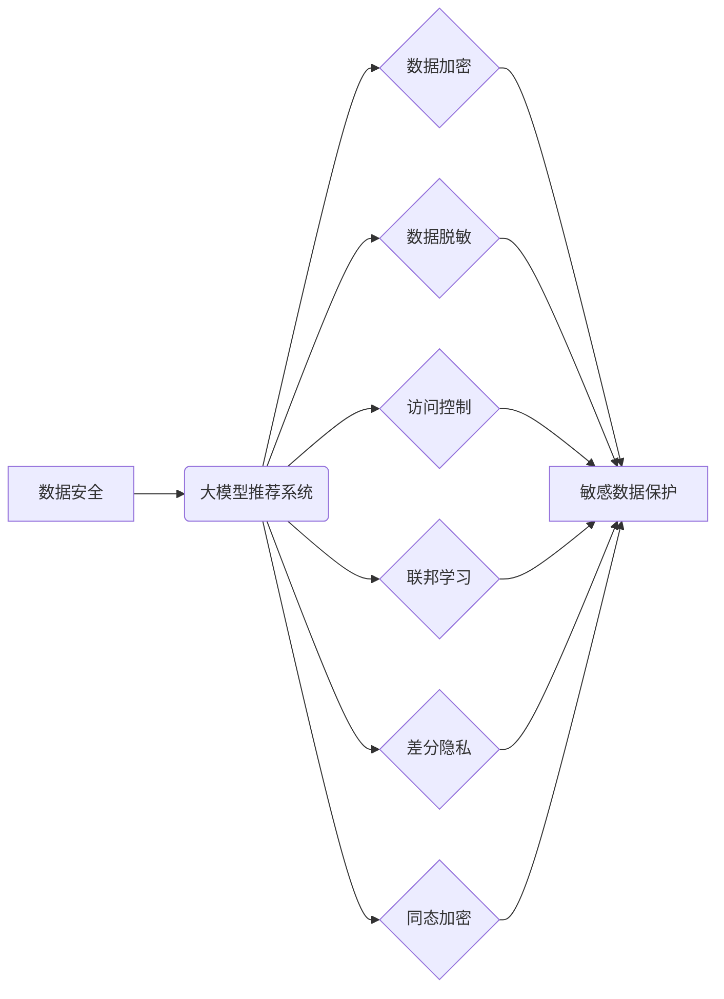

                 

## 大模型推荐场景中的数据安全与隐私保护策略

> 关键词：大模型、推荐系统、数据安全、隐私保护、联邦学习、差分隐私、同态加密

## 1. 背景介绍

推荐系统作为互联网时代的重要技术支柱，在电商、社交媒体、内容平台等领域发挥着至关重要的作用。近年来，随着深度学习技术的快速发展，大模型在推荐系统领域展现出强大的潜力，能够提供更精准、个性化的推荐服务。然而，大模型的训练和应用也带来了新的数据安全和隐私保护挑战。

大模型通常需要海量数据进行训练，这些数据往往包含用户敏感信息，如个人兴趣、消费习惯、地理位置等。如果这些数据泄露或被恶意利用，将可能导致用户隐私泄露、身份盗窃、信息欺诈等严重后果。因此，在构建大模型推荐系统时，必须充分考虑数据安全和隐私保护问题，采取有效的策略和技术手段，确保用户数据安全和隐私不被侵犯。

## 2. 核心概念与联系

**2.1 数据安全与隐私保护**

* **数据安全**是指保护数据免受未经授权的访问、使用、披露、修改或销毁等威胁。
* **隐私保护**是指保护个人敏感信息不被非法收集、使用、披露或利用，保障个人信息安全和个人尊严。

**2.2 大模型推荐系统架构**

大模型推荐系统通常由以下几个主要模块组成：

* **数据采集与预处理:** 收集用户行为数据、商品信息等数据，并进行清洗、转换、特征工程等预处理操作。
* **模型训练:** 利用大模型算法对数据进行训练，学习用户偏好和商品特征之间的关系。
* **推荐算法:** 根据训练好的模型，对用户进行个性化推荐。
* **推荐结果展示:** 将推荐结果以用户友好的方式展示给用户。

**2.3 数据安全与隐私保护策略**

在构建大模型推荐系统时，需要采取以下策略和技术手段来保障数据安全和隐私保护：

* **数据加密:** 对敏感数据进行加密，防止未经授权的访问和使用。
* **数据脱敏:** 对敏感数据进行脱敏处理，去除或隐藏用户可识别信息。
* **访问控制:** 对数据访问进行严格控制，只允许授权用户访问敏感数据。
* **联邦学习:** 将模型训练分散到多个设备上，避免将原始数据集中存储，从而保护用户隐私。
* **差分隐私:** 在数据分析和模型训练过程中添加噪声，保护用户数据隐私。
* **同态加密:** 在加密数据的情况下进行计算，保证数据安全和隐私。

**2.4 核心概念关系图**



## 3. 核心算法原理 & 具体操作步骤

### 3.1 算法原理概述

**3.1.1 联邦学习**

联邦学习是一种分布式机器学习方法，它允许模型训练在多个设备上进行，而无需将原始数据集中存储。在联邦学习中，每个设备都训练一个本地模型，然后将模型参数上传到一个中央服务器。服务器将所有设备的模型参数进行聚合，得到一个全局模型。全局模型再被分发到每个设备，用于更新本地模型。

**3.1.2 差分隐私**

差分隐私是一种对数据隐私进行保护的技术，它通过在数据分析和模型训练过程中添加噪声来保护用户数据隐私。差分隐私的原理是，对于任何两个相似的数据库，其输出结果的差异应该很小。

**3.1.3 同态加密**

同态加密是一种加密技术，它允许对加密数据进行计算，而无需解密。同态加密的原理是，将数据加密后，可以对加密数据进行加法、减法、乘法等运算，而不会泄露原始数据。

### 3.2 算法步骤详解

**3.2.1 联邦学习步骤**

1. **数据分发:** 将原始数据分散到多个设备上。
2. **本地模型训练:** 每个设备使用本地数据训练一个模型。
3. **模型参数上传:** 每个设备将训练好的模型参数上传到中央服务器。
4. **模型参数聚合:** 中央服务器将所有设备的模型参数进行聚合，得到一个全局模型。
5. **全局模型分发:** 中央服务器将全局模型分发到每个设备。
6. **本地模型更新:** 每个设备使用全局模型更新本地模型。
7. **重复步骤2-6:** 重复上述步骤，直到模型收敛。

**3.2.2 差分隐私步骤**

1. **添加噪声:** 在数据分析或模型训练过程中，添加随机噪声到数据中。
2. **计算结果:** 对添加了噪声的数据进行分析或模型训练，得到结果。
3. **去除噪声:** 从结果中去除噪声，得到最终结果。

**3.2.3 同态加密步骤**

1. **数据加密:** 将数据加密成不可读的形式。
2. **加密数据运算:** 对加密数据进行加法、减法、乘法等运算。
3. **解密结果:** 将运算结果解密成原始数据形式。

### 3.3 算法优缺点

**3.3.1 联邦学习**

* **优点:** 保护用户隐私，避免数据泄露。
* **缺点:** 训练速度慢，模型性能可能不如集中式训练。

**3.3.2 差分隐私**

* **优点:** 能够有效保护用户隐私。
* **缺点:** 会增加计算成本，可能影响模型性能。

**3.3.3 同态加密**

* **优点:** 保护数据安全，允许在加密数据上进行计算。
* **缺点:** 计算效率低，应用场景有限。

### 3.4 算法应用领域

* **联邦学习:** 医疗保健、金融、零售等领域，用于训练隐私敏感数据的模型。
* **差分隐私:** 数据分析、机器学习、人工智能等领域，用于保护用户隐私。
* **同态加密:** 医疗保健、金融、电子商务等领域，用于保护敏感数据的安全传输和处理。

## 4. 数学模型和公式 & 详细讲解 & 举例说明

### 4.1 数学模型构建

**4.1.1 联邦学习模型**

联邦学习模型通常采用深度学习算法，如神经网络。模型参数可以表示为一个向量，每个元素代表模型的一个权重。

**4.1.2 差分隐私模型**

差分隐私模型通常使用Laplace机制或Gaussian机制添加噪声。

**4.1.3 同态加密模型**

同态加密模型通常使用环论和数论中的概念，构建加密算法和解密算法。

### 4.2 公式推导过程

**4.2.1 联邦学习模型参数更新公式**

$$
\theta_{t+1} = \frac{1}{N} \sum_{i=1}^{N} \theta_{i,t}
$$

其中：

* $\theta_{t+1}$ 是全局模型参数在第 $t+1$ 轮迭代后的值。
* $N$ 是参与联邦学习的设备数量。
* $\theta_{i,t}$ 是第 $i$ 个设备在第 $t$ 轮迭代后的本地模型参数。

**4.2.2 差分隐私模型噪声添加公式**

$$
y = f(x) + \epsilon
$$

其中：

* $y$ 是添加了噪声后的结果。
* $f(x)$ 是对数据 $x$ 的函数。
* $\epsilon$ 是随机噪声。

**4.2.3 同态加密模型加密公式**

$$
E(x) = x \cdot g(k)
$$

其中：

* $E(x)$ 是数据 $x$ 的加密结果。
* $g(k)$ 是加密算法，其中 $k$ 是密钥。

### 4.3 案例分析与讲解

**4.3.1 联邦学习案例**

在医疗保健领域，可以使用联邦学习来训练疾病诊断模型。每个医院可以将患者数据用于训练本地模型，然后将模型参数上传到中央服务器。中央服务器将所有医院的模型参数进行聚合，得到一个全局模型，该模型可以用于诊断新的患者。

**4.3.2 差分隐私案例**

在市场调研领域，可以使用差分隐私来保护用户隐私。例如，可以对用户调查问卷数据进行差分隐私处理，从而保证用户隐私不被泄露，同时仍然可以进行数据分析和市场研究。

**4.3.3 同态加密案例**

在电子商务领域，可以使用同态加密来保护用户信用卡信息。用户可以在不泄露信用卡信息的条件下，使用同态加密技术进行在线支付。

## 5. 项目实践：代码实例和详细解释说明

### 5.1 开发环境搭建

* **操作系统:** Ubuntu 20.04
* **编程语言:** Python 3.8
* **深度学习框架:** TensorFlow 2.0
* **其他工具:** Git, Docker

### 5.2 源代码详细实现

```python
# 联邦学习模型训练代码示例

import tensorflow as tf

# 定义模型
model = tf.keras.models.Sequential([
    tf.keras.layers.Dense(128, activation='relu'),
    tf.keras.layers.Dense(10, activation='softmax')
])

# 定义训练函数
def train_model(data, model):
    # 使用数据训练模型
    model.compile(optimizer='adam',
                  loss='sparse_categorical_crossentropy',
                  metrics=['accuracy'])
    model.fit(data, epochs=10)
    return model

# 联邦学习训练流程
def federated_learning(clients, model):
    # 每个客户端训练本地模型
    for client in clients:
        # 获取客户端数据
        data = client.get_data()
        # 训练本地模型
        model = train_model(data, model)
        # 上传模型参数
        client.upload_model(model)

    # 聚合模型参数
    global_model = aggregate_model(clients)
    return global_model

# 聚合模型参数
def aggregate_model(clients):
    # 获取所有客户端的模型参数
    model_params = []
    for client in clients:
        model_params.append(client.get_model())
    # 聚合模型参数
    global_model = sum(model_params) / len(clients)
    return global_model
```

### 5.3 代码解读与分析

* **模型定义:** 代码中定义了一个简单的深度学习模型，用于分类任务。
* **训练函数:** `train_model()` 函数用于训练模型，接受数据和模型作为输入，并返回训练后的模型。
* **联邦学习训练流程:** `federated_learning()` 函数模拟了联邦学习的训练流程，包括数据获取、本地模型训练、模型参数上传和聚合。
* **聚合模型参数:** `aggregate_model()` 函数用于聚合所有客户端的模型参数，得到全局模型。

### 5.4 运行结果展示

运行上述代码，可以模拟联邦学习的训练过程，并观察模型在不同轮次迭代后的性能变化。

## 6. 实际应用场景

### 6.1 大模型推荐系统中的数据安全与隐私保护

大模型推荐系统在收集和使用用户数据时，需要特别注意数据安全和隐私保护。例如，在电商平台，大模型推荐系统可能会收集用户的浏览历史、购买记录、评价信息等数据，这些数据都包含用户的个人信息。如果这些数据泄露或被恶意利用，将可能导致用户的隐私泄露、身份盗窃等严重后果。

### 6.2 联邦学习在推荐系统中的应用

联邦学习可以有效地解决大模型推荐系统中的数据安全和隐私保护问题。例如，可以将用户的行为数据分散到多个设备上，每个设备训练一个本地模型，然后将模型参数上传到中央服务器进行聚合。这样，用户数据不会集中存储在任何一个地方，从而有效地保护用户的隐私。

### 6.3 差分隐私在推荐系统中的应用

差分隐私可以用于保护用户数据在推荐系统中的隐私。例如，可以对用户的行为数据进行差分隐私处理，从而保证用户隐私不被泄露，同时仍然可以进行数据分析和模型训练。

### 6.4 未来应用展望

随着大模型技术的不断发展，大模型推荐系统将应用到更多领域，例如医疗保健、教育、金融等。在这些领域，数据安全和隐私保护尤为重要。未来，我们将看到更多基于联邦学习、差分隐私等技术的隐私保护方法应用于大模型推荐系统，保障用户数据安全和隐私。

## 7. 工具和资源推荐

### 7.1 学习资源推荐

* **书籍:**
    * 《深度学习》 - Ian Goodfellow, Yoshua Bengio, Aaron Courville
    * 《机器学习》 - Tom Mitchell
* **在线课程:**
    * Coursera: 深度学习 Specialization
    * edX: 机器学习
* **博客和网站:**
    * TensorFlow Blog: https://blog.tensorflow.org/
    * PyTorch Blog: https://pytorch.org/blog/

### 7.2 开发工具推荐

* **深度学习框架:** TensorFlow, PyTorch, Keras
* **云计算平台:** AWS, Azure, Google Cloud
* **数据处理工具:** Pandas, NumPy

### 7.3 相关论文推荐

* **联邦学习:**
    * McMahan, H. B., Moore, E., Ramage, D., Hampson, S., & y Arcas, B. A. (2017). Communication-efficient learning of deep networks from decentralized data. In Proceedings of the 2017 ACM International Conference on Learning Representations (ICLR)
* **差分隐私:**
    * Dwork, C. (2008). Differential privacy. In International conference on theory and applications of models of computation (pp. 1-12). Springer.
* **同态加密:**
    * Gentry, C. (2009). A fully homomorphic encryption scheme. In Proceedings of the 41st annual ACM symposium on Theory of computing (pp. 169-178). ACM.

## 8. 总结：未来发展趋势与挑战

### 8.1 研究成果总结

近年来，在数据安全和隐私保护领域取得了显著进展，特别是联邦学习、差分隐私和同态加密等技术取得了突破性进展。这些技术为大模型推荐系统提供了有效的解决方案，能够保障用户数据安全和隐私。

### 8.2 未来发展趋势

* **联邦学习技术将更加成熟:** 联邦学习算法将更加高效、稳定，并支持更多类型的模型和数据。
* **差分隐私技术将更加广泛应用:** 差分隐私技术将应用于更多场景，例如推荐系统、广告投放、数据分析等。
* **同态加密技术将更加实用:** 同态加密技术将更加高效、易用，并应用于更多场景，例如隐私计算、安全交易等。

### 8.3 面临的挑战

* **联邦学习的通信成本:** 联邦学习需要频繁地传输模型参数，这会导致通信成本较高。
* **差分隐私的性能损耗:** 差分隐私会增加计算成本，可能导致模型性能下降。
* **同态加密的计算效率:** 同态加密的计算效率仍然较低，限制了其应用范围。

### 8.4 研究展望

未来，我们将继续研究和探索新的数据安全和隐私保护技术，以应对大模型推荐系统带来的挑战，保障用户数据安全和隐私。


## 9. 附录：常见问题与解答

**9.1 如何平衡数据安全和推荐效果？**

在构建大模型推荐系统时，需要权衡数据安全和推荐效果之间的平衡。可以采用以下方法：

* **数据脱敏:** 对敏感数据进行脱敏处理，去除或隐藏用户可识别信息。
* **联邦学习:** 将模型训练分散到多个设备上，避免将原始数据集中存储。
* **差分隐私:** 在数据分析和模型训练过程中添加噪声，保护用户数据隐私。

**9.2 如何选择合适的隐私保护技术？**

选择合适的隐私保护技术需要根据具体应用场景和需求进行选择。

* **联邦学习:** 适合训练大型模型，数据分散在多个设备上。
* **差分隐私:** 适合对数据进行分析和模型训练，保护用户数据隐私。
* **同态加密:** 适合对敏感数据进行安全处理，例如加密数据传输和计算。

**9.3 如何评估隐私保护技术的有效性？**

可以采用以下方法评估隐私保护技术的有效性：

* **隐私预算分析:** 评估差分隐私机制的隐私预算，衡量数据隐私泄露的风险。
* **模型性能评估:** 评估隐私保护技术对模型性能的影响，确保模型性能不显著下降。
* **安全审计:** 对隐私保护系统进行安全审计，确保系统安全可靠。


作者：禅与计算机程序设计艺术 / Zen and the Art of Computer Programming<end_of_turn>
<end_of_turn>

