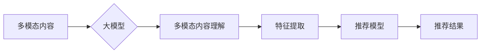

                 

## 大模型驱动的推荐系统多模态内容理解与推荐

> 关键词：大模型、推荐系统、多模态理解、内容推荐、深度学习、Transformer

## 1. 背景介绍

推荐系统作为互联网时代的核心技术之一，在电商、社交媒体、视频平台等领域发挥着至关重要的作用。传统的推荐系统主要依赖文本特征，例如用户历史行为、商品描述等，但随着内容形式的多样化，文本特征已无法满足用户个性化需求。多模态内容，例如文本、图像、音频、视频等，蕴含着更丰富的语义信息，为推荐系统提供了新的发展方向。

大模型的出现为多模态内容理解和推荐提供了强大的工具。大模型拥有海量参数和强大的学习能力，能够从多模态数据中提取更深层的语义特征，提升推荐系统的准确性和个性化程度。

## 2. 核心概念与联系

### 2.1 多模态内容理解

多模态内容理解是指理解由多种模态数据组成的复合信息，并从中提取语义信息的过程。例如，理解一篇包含文本和图像的文章，需要同时理解文本的语义和图像的视觉信息，并将其融合在一起形成完整的理解。

### 2.2 大模型

大模型是指参数规模庞大、训练数据海量的人工智能模型。大模型通常基于深度学习架构，例如 Transformer，能够学习到复杂的模式和关系，并应用于各种自然语言处理和计算机视觉任务。

### 2.3 推荐系统

推荐系统是指根据用户的历史行为、偏好等信息，预测用户可能感兴趣的内容，并将其推荐给用户的系统。

**核心概念与联系流程图**



## 3. 核心算法原理 & 具体操作步骤

### 3.1 算法原理概述

大模型驱动的推荐系统多模态内容理解与推荐主要基于以下算法原理：

* **多模态特征融合:** 将不同模态的数据转换为统一的特征表示，并将其融合在一起，形成更完整的用户和内容表示。
* **深度学习模型:** 使用深度学习模型，例如 Transformer，学习多模态特征之间的关系，并进行预测。
* **个性化推荐:** 根据用户的历史行为、偏好等信息，对推荐结果进行个性化调整。

### 3.2 算法步骤详解

1. **数据预处理:** 收集多模态数据，并进行清洗、格式化等预处理操作。
2. **特征提取:** 使用预训练的大模型，例如 CLIP、ViT 等，提取文本、图像等不同模态的数据特征。
3. **特征融合:** 将不同模态的特征进行融合，形成统一的特征表示。常用的融合方法包括：
    * **Early Fusion:** 将不同模态的特征在低层进行融合。
    * **Late Fusion:** 将不同模态的特征在高层进行融合。
    * **Hybrid Fusion:** 将 Early Fusion 和 Late Fusion 结合使用。
4. **推荐模型训练:** 使用融合后的特征训练推荐模型，例如多层感知机、深度神经网络等。
5. **推荐结果生成:** 将训练好的推荐模型应用于新的用户和内容数据，生成推荐结果。

### 3.3 算法优缺点

**优点:**

* **提升推荐准确性:** 多模态特征融合能够提供更丰富的用户和内容信息，提升推荐系统的准确性。
* **个性化推荐:** 大模型能够学习到用户的个性化偏好，提供更精准的推荐。
* **内容多样化:** 多模态内容能够丰富推荐结果，满足用户的多样化需求。

**缺点:**

* **数据获取难度:** 多模态数据的获取和标注难度较大。
* **模型训练成本:** 大模型的训练需要大量的计算资源和时间。
* **解释性差:** 深度学习模型的决策过程难以解释，难以理解推荐结果背后的原因。

### 3.4 算法应用领域

大模型驱动的推荐系统多模态内容理解与推荐应用于以下领域：

* **电商推荐:** 推荐商品、优惠券、促销活动等。
* **社交媒体推荐:** 推荐好友、话题、内容等。
* **视频平台推荐:** 推荐视频、直播、用户等。
* **教育推荐:** 推荐课程、学习资源、老师等。

## 4. 数学模型和公式 & 详细讲解 & 举例说明

### 4.1 数学模型构建

假设我们有一个包含文本和图像的多模态数据集，其中每个样本包含一个文本描述 $t$ 和一个图像 $v$。我们的目标是学习一个模型 $f$，能够将文本和图像映射到一个共同的特征空间，并预测用户对该样本的兴趣程度 $r$。

我们可以使用以下数学模型构建推荐系统：

$$
f(t, v) = \mathbf{W}_t \mathbf{h}_t + \mathbf{W}_v \mathbf{h}_v + \mathbf{b}
$$

其中：

* $f(t, v)$ 是模型输出的特征向量。
* $\mathbf{W}_t$ 和 $\mathbf{W}_v$ 是文本和图像特征的权重矩阵。
* $\mathbf{h}_t$ 和 $\mathbf{h}_v$ 是文本和图像的特征向量。
* $\mathbf{b}$ 是偏置项。

### 4.2 公式推导过程

模型输出的特征向量 $f(t, v)$ 可以用于计算用户对该样本的兴趣程度 $r$。我们可以使用以下公式计算 $r$：

$$
r = \sigma(f(t, v) \cdot \mathbf{u})
$$

其中：

* $\sigma$ 是激活函数，例如 sigmoid 函数。
* $\mathbf{u}$ 是兴趣预测的权重向量。

### 4.3 案例分析与讲解

假设我们有一个电商平台，用户可以浏览商品的文本描述和图像。我们可以使用上述模型构建一个推荐系统，推荐用户可能感兴趣的商品。

当用户浏览一个商品时，系统会提取商品的文本描述和图像特征，并将其输入到模型中。模型会将这些特征映射到一个共同的特征空间，并预测用户对该商品的兴趣程度。如果预测的兴趣程度较高，则系统会将该商品推荐给用户。

## 5. 项目实践：代码实例和详细解释说明

### 5.1 开发环境搭建

* Python 3.7+
* PyTorch 1.7+
* CUDA 10.2+
* 其他依赖库：transformers, torchvision, numpy, pandas等

### 5.2 源代码详细实现

```python
import torch
import torch.nn as nn
from transformers import CLIPProcessor, CLIPModel

class MultiModalRecommender(nn.Module):
    def __init__(self, text_dim, image_dim, hidden_dim):
        super(MultiModalRecommender, self).__init__()
        self.text_encoder = nn.Linear(text_dim, hidden_dim)
        self.image_encoder = nn.Linear(image_dim, hidden_dim)
        self.fusion_layer = nn.Linear(hidden_dim * 2, hidden_dim)
        self.output_layer = nn.Linear(hidden_dim, 1)

    def forward(self, text_features, image_features):
        text_encoded = self.text_encoder(text_features)
        image_encoded = self.image_encoder(image_features)
        fused_features = torch.cat((text_encoded, image_encoded), dim=1)
        fused_features = self.fusion_layer(fused_features)
        output = self.output_layer(fused_features)
        return output

# 实例化模型
model = MultiModalRecommender(text_dim=768, image_dim=512, hidden_dim=256)

# 定义损失函数和优化器
criterion = nn.BCEWithLogitsLoss()
optimizer = torch.optim.Adam(model.parameters(), lr=0.001)

# 训练模型
for epoch in range(num_epochs):
    for batch in dataloader:
        text_features, image_features, labels = batch
        optimizer.zero_grad()
        outputs = model(text_features, image_features)
        loss = criterion(outputs, labels)
        loss.backward()
        optimizer.step()

# 保存模型
torch.save(model.state_dict(), 'multimodal_recommender.pth')

```

### 5.3 代码解读与分析

* **模型结构:** 代码中定义了一个多模态推荐模型，包含文本编码器、图像编码器、融合层和输出层。
* **特征提取:** 使用预训练的 CLIP 模型提取文本和图像特征。
* **特征融合:** 将文本和图像特征进行拼接，并使用融合层学习特征之间的关系。
* **兴趣预测:** 使用输出层预测用户对样本的兴趣程度。
* **训练过程:** 使用交叉熵损失函数和 Adam 优化器训练模型。

### 5.4 运行结果展示

训练完成后，可以将模型应用于新的用户和内容数据，生成推荐结果。

## 6. 实际应用场景

### 6.1 电商推荐

大模型驱动的多模态推荐系统可以帮助电商平台推荐更精准的商品，例如：

* 根据用户的浏览历史、购买记录和兴趣标签，推荐相关的商品。
* 根据商品的文本描述、图像和用户评价，推荐用户可能感兴趣的商品。
* 根据用户的购物场景和需求，推荐个性化的商品组合。

### 6.2 社交媒体推荐

大模型驱动的多模态推荐系统可以帮助社交媒体平台推荐更相关的用户、话题和内容，例如：

* 根据用户的兴趣爱好和社交关系，推荐新的好友。
* 根据用户的浏览历史和点赞记录，推荐相关的文章、视频和图片。
* 根据用户的实时行为和上下文信息，推荐个性化的广告和推广内容。

### 6.3 视频平台推荐

大模型驱动的多模态推荐系统可以帮助视频平台推荐更相关的视频、直播和用户，例如：

* 根据用户的观看历史、点赞记录和评论内容，推荐相关的视频。
* 根据视频的标题、描述、封面和内容，推荐用户可能感兴趣的视频。
* 根据用户的观看时间、观看地点和观看设备，推荐个性化的视频推荐。

### 6.4 未来应用展望

大模型驱动的多模态推荐系统在未来将有更广泛的应用场景，例如：

* **教育推荐:** 推荐个性化的学习资源、课程和老师。
* **医疗推荐:** 推荐相关的医疗信息、专家和医院。
* **金融推荐:** 推荐个性化的理财产品、投资建议和金融服务。

## 7. 工具和资源推荐

### 7.1 学习资源推荐

* **书籍:**
    * 《深度学习》 by Ian Goodfellow, Yoshua Bengio, Aaron Courville
    * 《自然语言处理》 by Dan Jurafsky, James H. Martin
* **在线课程:**
    * Coursera: Deep Learning Specialization
    * Udacity: Deep Learning Nanodegree
* **博客和网站:**
    * Towards Data Science
    * Machine Learning Mastery

### 7.2 开发工具推荐

* **深度学习框架:** PyTorch, TensorFlow
* **自然语言处理库:** transformers, spaCy
* **计算机视觉库:** torchvision, OpenCV

### 7.3 相关论文推荐

* **BERT:** Devlin et al. (2018)
* **GPT-3:** Brown et al. (2020)
* **CLIP:** Radford et al. (2021)

## 8. 总结：未来发展趋势与挑战

### 8.1 研究成果总结

大模型驱动的推荐系统多模态内容理解与推荐取得了显著进展，能够提供更精准、个性化的推荐结果。

### 8.2 未来发展趋势

* **模型规模和能力提升:** 未来大模型的规模和能力将进一步提升，能够学习到更复杂的模式和关系。
* **多模态融合方法创新:** 将探索更有效的多模态特征融合方法，提升推荐系统的准确性和个性化程度。
* **解释性增强:** 将研究大模型的决策过程，提升推荐结果的解释性。
* **跨模态知识迁移:** 将探索跨模态知识迁移的方法，例如将文本知识迁移到图像理解任务中。

### 8.3 面临的挑战

* **数据获取和标注难度:** 多模态数据的获取和标注难度较大，需要开发更有效的标注方法和数据增强技术。
* **模型训练成本:** 大模型的训练需要大量的计算资源和时间，需要探索更有效的训练方法和硬件加速技术。
* **公平性和可解释性:** 大模型的决策过程难以解释，需要研究如何保证推荐系统的公平性和可解释性。

### 8.4 研究展望

未来，大模型驱动的推荐系统多模态内容理解与推荐将继续是一个重要的研究方向，需要多学科交叉融合，推动推荐系统朝着更智能、更个性化、更公平的方向发展。

## 9. 附录：常见问题与解答

**Q1: 如何选择合适的多模态特征融合方法？**

**A1:** 选择合适的特征融合方法需要根据具体应用场景和数据特点进行选择。

* **Early Fusion:** 适合数据特征维度相近的情况。
* **Late Fusion:** 适合数据特征维度差异较大，且每个模态都有独立的特征表示的情况。
* **Hybrid Fusion:** 可以结合 Early Fusion 和 Late Fusion 的优点，适用于更复杂的场景。

**Q2: 如何解决大模型训练成本高的问题？**

**A2:** 可以采用以下方法降低大模型训练成本：

* **模型压缩:** 使用模型剪枝、量化等技术压缩模型规模，减少计算量。
* **分布式训练:** 将模型训练任务分布到多个机器上，并行训练，加速训练速度。
* **预训练模型迁移学习:** 使用预训练的大模型作为基础模型，在特定任务上进行微调，减少训练时间和数据量。


作者：禅与计算机程序设计艺术 / Zen and the Art of Computer Programming<end_of_turn>

