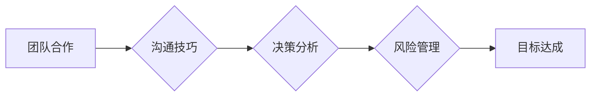

                 

## 如何从经典案例中学习管理智慧

> 关键词：管理智慧、经典案例、软件开发、项目管理、团队合作、沟通技巧、决策分析

## 1. 背景介绍

在瞬息万变的科技时代，管理智慧已成为企业持续发展的关键驱动力。优秀的管理者不仅需要精通技术，更需要具备洞察力、战略思维和领导力。学习经典案例，从成功和失败中汲取经验教训，是提升管理智慧的有效途径。

软件开发领域作为科技创新的前沿阵地，孕育了众多经典案例，这些案例不仅展现了软件开发的精髓，也蕴含着丰富的管理智慧。通过深入分析这些案例，我们可以学习到团队合作、沟通技巧、决策分析、风险管理等方面的宝贵经验，从而提升自身的管理能力。

## 2. 核心概念与联系

管理智慧的核心在于将技术、人、资源和环境有机结合，实现目标的有效达成。

**核心概念：**

* **团队合作:** 软件开发是一个高度协作的工作，团队成员需要相互配合，共同完成目标。
* **沟通技巧:**  有效的沟通是团队合作的基础，需要清晰、准确、及时地传递信息。
* **决策分析:**  在软件开发过程中，需要不断做出决策，决策分析可以帮助我们做出更明智的选择。
* **风险管理:**  软件开发存在着各种风险，需要提前识别和评估风险，制定相应的应对措施。

**架构图：**



## 3. 核心算法原理 & 具体操作步骤

### 3.1  算法原理概述

**敏捷开发**是一种迭代式软件开发方法，强调快速反馈、持续改进和团队协作。

**核心原理：**

* **迭代开发:** 将项目分解成多个小的迭代周期，每个周期都包含需求分析、设计、开发、测试和部署等环节。
* **持续反馈:** 在每个迭代周期结束时，都会进行演示和回顾，收集用户反馈和团队反思。
* **团队协作:** 敏捷开发强调团队成员之间的密切合作，鼓励成员积极参与决策和解决问题。

### 3.2  算法步骤详解

1. **需求分析:**  团队与用户共同分析需求，确定迭代周期内的目标。
2. **设计:**  根据需求，设计迭代周期内的功能模块和架构。
3. **开发:**  开发团队根据设计文档，编写代码并进行单元测试。
4. **测试:**  测试团队对开发的代码进行集成测试和验收测试。
5. **部署:**  将测试通过的代码部署到测试环境或生产环境。
6. **演示和回顾:**  团队成员和用户进行演示，回顾迭代周期内的成果和问题，并为下个迭代周期进行规划。

### 3.3  算法优缺点

**优点:**

* 能够快速响应用户需求变化。
* 能够提高软件质量，降低开发风险。
* 能够增强团队协作和沟通。

**缺点:**

* 需要团队成员具备较高的协作能力和沟通能力。
* 需要不断进行迭代和改进，可能会增加开发成本。
* 不适合所有类型的项目，例如对功能要求非常明确的项目。

### 3.4  算法应用领域

敏捷开发广泛应用于各种软件开发项目，例如：

* Web 应用开发
* 移动应用开发
* 企业级软件开发
* 游戏开发

## 4. 数学模型和公式 & 详细讲解 & 举例说明

### 4.1  数学模型构建

**项目进度模型:**

可以使用甘特图或PERT图来描述项目的进度和关键路径。

**甘特图:**

甘特图是一种条形图，用于展示项目的进度和任务之间的依赖关系。

**PERT图:**

PERT图是一种网络图，用于展示项目的关键路径和任务之间的依赖关系。

### 4.2  公式推导过程

**项目风险评估:**

可以使用概率论和统计学来评估项目的风险。

**风险概率:**

$$P(R) = \frac{N(R)}{N(T)}$$

其中：

* $P(R)$ 是风险发生的概率。
* $N(R)$ 是发生风险的事件数量。
* $N(T)$ 是所有事件的数量。

**风险影响度:**

$$I(R) = \frac{C(R)}{C(T)}$$

其中：

* $I(R)$ 是风险的影响度。
* $C(R)$ 是风险发生的损失成本。
* $C(T)$ 是项目总成本。

### 4.3  案例分析与讲解

**案例:**

假设一个软件开发项目，需要开发一个新的电商平台。

**风险分析:**

* **技术风险:**  新技术的使用可能会带来技术难题。
* **时间风险:**  项目进度可能会受到延误。
* **成本风险:**  项目成本可能会超出预算。

**风险评估:**

* 技术风险概率: 0.2
* 技术风险影响度: 0.8
* 时间风险概率: 0.3
* 时间风险影响度: 0.6
* 成本风险概率: 0.1
* 成本风险影响度: 0.9

**风险应对:**

* 技术风险:  选择成熟的技术，并进行充分的测试。
* 时间风险:  制定合理的项目计划，并进行进度监控。
* 成本风险:  控制项目预算，并进行成本分析。

## 5. 项目实践：代码实例和详细解释说明

### 5.1  开发环境搭建

* 操作系统: Ubuntu 20.04 LTS
* 编程语言: Python 3.8
* 开发工具: PyCharm

### 5.2  源代码详细实现

```python
# 需求分析模块
def analyze_requirements():
    # 与用户沟通，收集需求信息
    # 分析需求，确定迭代周期内的目标
    pass

# 设计模块
def design_modules():
    # 根据需求，设计迭代周期内的功能模块和架构
    pass

# 开发模块
def develop_code():
    # 开发团队根据设计文档，编写代码并进行单元测试
    pass

# 测试模块
def test_code():
    # 测试团队对开发的代码进行集成测试和验收测试
    pass

# 部署模块
def deploy_code():
    # 将测试通过的代码部署到测试环境或生产环境
    pass

# 演示和回顾模块
def demo_and_review():
    # 团队成员和用户进行演示，回顾迭代周期内的成果和问题
    pass

# 迭代开发流程
def agile_development():
    while True:
        analyze_requirements()
        design_modules()
        develop_code()
        test_code()
        deploy_code()
        demo_and_review()

# 启动迭代开发流程
agile_development()
```

### 5.3  代码解读与分析

* 代码示例展示了敏捷开发的迭代流程，包括需求分析、设计、开发、测试、部署和演示回顾等环节。
* 每个环节都对应了一个函数，函数内部实现具体的逻辑。
* 代码结构清晰，易于理解和维护。

### 5.4  运行结果展示

运行代码后，会启动迭代开发流程，并根据预设的规则进行循环执行。

## 6. 实际应用场景

### 6.1  案例分析

**案例:**

一家互联网公司开发了一款新的移动应用，采用敏捷开发方法。

**应用场景:**

* **需求变化:**  用户反馈不断，开发团队能够快速响应需求变化，迭代更新应用功能。
* **团队协作:**  开发团队成员之间密切合作，共同完成目标。
* **风险管理:**  开发团队能够及时识别和评估风险，制定相应的应对措施。

### 6.2  成功案例

* **Google:**  Google 使用敏捷开发方法开发其核心产品，例如搜索引擎和 Gmail。
* **Amazon:**  Amazon 使用敏捷开发方法开发其电商平台和云计算服务。
* **Facebook:**  Facebook 使用敏捷开发方法开发其社交网络平台。

### 6.3  失败案例

* **软件开发项目延期:**  由于项目计划不合理，导致项目延期。
* **软件质量问题:**  由于测试不充分，导致软件质量问题。
* **团队沟通不畅:**  由于团队成员之间沟通不畅，导致项目进度缓慢。

### 6.4  未来应用展望

敏捷开发方法将继续在软件开发领域得到广泛应用，并不断演进和完善。

* **人工智能:**  人工智能技术将被应用于敏捷开发，例如自动生成代码和测试用例。
* **云计算:**  云计算技术将使敏捷开发更加灵活和高效。
* **远程协作:**  远程协作工具将使敏捷开发更加便捷。

## 7. 工具和资源推荐

### 7.1  学习资源推荐

* **书籍:**
    * 《敏捷软件开发》
    * 《Scrum: The Art of Doing Twice the Work in Half the Time》
    * 《The Phoenix Project: A Novel About IT, DevOps, and Helping Your Business Win》
* **网站:**
    * https://www.agilealliance.org/
    * https://www.scrumguides.org/

### 7.2  开发工具推荐

* **项目管理工具:**
    * Jira
    * Trello
    * Asana
* **代码版本控制工具:**
    * Git
    * GitHub
* **持续集成/持续交付工具:**
    * Jenkins
    * CircleCI

### 7.3  相关论文推荐

* **敏捷软件开发的理论基础和实践经验**
* **敏捷开发方法在软件项目中的应用研究**
* **敏捷开发方法的未来发展趋势**

## 8. 总结：未来发展趋势与挑战

### 8.1  研究成果总结

从经典案例中学习管理智慧，可以帮助我们提升团队合作、沟通技巧、决策分析、风险管理等方面的能力。敏捷开发方法作为一种高效的软件开发方法，已得到广泛应用，并不断演进和完善。

### 8.2  未来发展趋势

* 人工智能将被应用于敏捷开发，例如自动生成代码和测试用例。
* 云计算技术将使敏捷开发更加灵活和高效。
* 远程协作工具将使敏捷开发更加便捷。

### 8.3  面临的挑战

* 如何更好地应对复杂项目的需求变化。
* 如何提高团队成员的协作能力和沟通能力。
* 如何更好地评估和管理项目风险。

### 8.4  研究展望

未来，我们将继续研究敏捷开发方法的应用和演进，探索人工智能、云计算和远程协作技术在敏捷开发中的应用，并致力于提升软件开发的效率和质量。

## 9. 附录：常见问题与解答

**常见问题:**

* **敏捷开发适合所有类型的项目吗？**

**解答:**

敏捷开发更适合需求变化频繁、迭代开发模式的项目。对于功能要求非常明确的项目，传统瀑布模型可能更合适。

* **如何评估敏捷开发的成功与否？**

**解答:**

敏捷开发的成功与否可以从以下几个方面评估：

* 项目进度是否按计划完成
* 软件质量是否满足需求
* 团队成员的满意度
* 用户的反馈

* **如何提高团队成员的协作能力和沟通能力？**

**解答:**

* 建立良好的团队文化，鼓励成员之间的沟通和合作。
* 使用协作工具，例如项目管理工具和代码版本控制工具。
* 定期进行团队建设活动，增强团队成员之间的凝聚力。


作者：禅与计算机程序设计艺术 / Zen and the Art of Computer Programming<end_of_turn>

