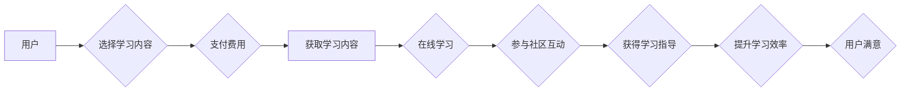

                 

## 如何利用知识付费实现在线学习与在线学习指导？

> 关键词：知识付费、在线学习、学习指导、人工智能、个性化学习、内容分发、社区互动

## 1. 背景介绍

在线学习近年来蓬勃发展，成为人们获取知识和技能的重要途径。知识付费模式作为一种新的商业模式，为在线学习提供了新的盈利模式和发展空间。它通过提供优质的学习内容和服务，以付费的方式获取知识和技能，从而实现双赢。

然而，在线学习的普及也带来了新的挑战，例如学习效率低下、缺乏个性化指导、学习内容质量参差不齐等。如何利用知识付费模式，有效解决这些问题，提升在线学习的质量和效率，成为一个重要的课题。

## 2. 核心概念与联系

**2.1 知识付费**

知识付费是指通过付费的方式获取知识和技能。它可以是付费观看课程、购买电子书、参加线下培训等多种形式。

**2.2 在线学习**

在线学习是指利用互联网技术，通过网络平台获取知识和技能的学习方式。它可以是同步学习，例如直播课程；也可以是异步学习，例如录播课程和在线文档。

**2.3 在线学习指导**

在线学习指导是指在在线学习过程中，为学习者提供个性化指导和支持。它可以是教师的在线答疑、学习伙伴的互助、人工智能驱动的学习建议等。

**2.4 核心概念联系**

知识付费模式可以为在线学习提供新的盈利模式，从而支持在线学习平台的运营和发展。同时，在线学习平台可以利用知识付费模式，提供更优质的学习内容和服务，包括个性化学习指导。

**Mermaid 流程图**



## 3. 核心算法原理 & 具体操作步骤

**3.1 算法原理概述**

在线学习指导的核心算法原理是基于用户的学习行为和数据，提供个性化的学习建议和支持。常用的算法包括：

* **协同过滤算法:** 根据用户的学习历史和其他用户的学习行为，推荐相关的学习内容。
* **内容基准算法:** 根据用户的学习目标和兴趣，推荐与之匹配的学习内容。
* **深度学习算法:** 利用深度神经网络，分析用户的学习数据，预测用户的学习需求和学习效果，提供更精准的学习指导。

**3.2 算法步骤详解**

1. **数据收集:** 收集用户的学习行为数据，例如学习时间、学习内容、学习进度、学习评价等。
2. **数据预处理:** 对收集到的数据进行清洗、转换和特征提取，以便于算法的训练和应用。
3. **模型训练:** 选择合适的算法模型，利用预处理后的数据进行模型训练，学习用户的学习模式和特征。
4. **个性化推荐:** 根据训练好的模型，对用户的学习行为进行分析，预测用户的学习需求和学习效果，并提供个性化的学习建议和支持。
5. **反馈机制:** 建立反馈机制，收集用户的学习反馈，并将其反馈到模型训练中，不断优化模型的准确性和有效性。

**3.3 算法优缺点**

* **优点:**

    * 可以提供个性化的学习指导，提高学习效率。
    * 可以根据用户的学习进度和效果，动态调整学习内容和难度。
    * 可以帮助用户发现自己感兴趣的学习内容，激发学习兴趣。

* **缺点:**

    * 需要大量的学习数据进行模型训练，数据质量直接影响算法的准确性。
    * 算法的复杂度较高，需要专业的技术人员进行开发和维护。
    * 算法可能会存在偏差，导致推荐结果不准确。

**3.4 算法应用领域**

在线学习指导算法广泛应用于在线教育平台、在线培训机构、企业内部培训等领域。

## 4. 数学模型和公式 & 详细讲解 & 举例说明

**4.1 数学模型构建**

在线学习指导算法通常采用基于用户的协同过滤模型，其核心思想是：

* 用户对相同内容的评价相似性，可以反映用户之间的相似性。
* 找到与用户兴趣相似的其他用户的学习记录，可以推荐用户可能感兴趣的内容。

**4.2 公式推导过程**

协同过滤模型常用的评分预测公式为：

$$
\hat{r}_{u,i} = \bar{r}_u + \frac{\sum_{v \in N(u)} (r_{v,i} - \bar{r}_v) \cdot sim(u,v)}{\sum_{v \in N(u)} sim(u,v)}
$$

其中：

* $\hat{r}_{u,i}$: 用户 $u$ 对物品 $i$ 的预测评分。
* $\bar{r}_u$: 用户 $u$ 的平均评分。
* $r_{v,i}$: 用户 $v$ 对物品 $i$ 的真实评分。
* $\bar{r}_v$: 用户 $v$ 的平均评分。
* $sim(u,v)$: 用户 $u$ 和用户 $v$ 之间的相似度。
* $N(u)$: 用户 $u$ 的邻居集合。

**4.3 案例分析与讲解**

假设有一个在线学习平台，用户 $A$ 对编程课程感兴趣，但还没有学习过。平台可以根据用户 $A$ 的兴趣，找到与 $A$ 兴趣相似的其他用户 $B$ 和 $C$，并分析 $B$ 和 $C$ 对编程课程的评价。如果 $B$ 和 $C$ 都对编程课程评价很高，那么平台可以预测用户 $A$ 也可能喜欢编程课程，并推荐给 $A$ 学习。

## 5. 项目实践：代码实例和详细解释说明

**5.1 开发环境搭建**

* Python 3.x
* TensorFlow 或 PyTorch 深度学习框架
* Jupyter Notebook 或 VS Code 开发环境

**5.2 源代码详细实现**

```python
# 导入必要的库
import numpy as np
from sklearn.metrics.pairwise import cosine_similarity

# 定义用户-物品评分矩阵
ratings = np.array([
    [5, 4, 3, 2, 1],  # 用户 1 的评分
    [4, 5, 2, 1, 3],  # 用户 2 的评分
    [3, 2, 5, 4, 1],  # 用户 3 的评分
    [2, 1, 4, 5, 3],  # 用户 4 的评分
    [1, 3, 1, 3, 5]   # 用户 5 的评分
])

# 计算用户之间的相似度
user_similarity = cosine_similarity(ratings)

# 获取用户 1 的邻居
user_1_neighbors = np.argsort(user_similarity[0])[::-1][1:]  # 排除自身

# 预测用户 1 对物品 4 的评分
predicted_rating = ratings[user_1_neighbors, 3].mean()

# 打印预测评分
print(f"预测用户 1 对物品 4 的评分: {predicted_rating}")
```

**5.3 代码解读与分析**

* 代码首先定义了一个用户-物品评分矩阵，其中每个元素代表用户对物品的评分。
* 然后，使用 cosine_similarity 函数计算用户之间的相似度。
* 通过获取用户 1 的邻居，并计算邻居对物品 4 的平均评分，可以预测用户 1 对物品 4 的评分。

**5.4 运行结果展示**

运行代码后，会输出用户 1 对物品 4 的预测评分。

## 6. 实际应用场景

**6.1 在线教育平台**

在线教育平台可以利用知识付费模式，提供优质的学习内容和服务，包括个性化学习指导。例如，平台可以根据用户的学习进度和效果，动态调整学习内容和难度，并提供针对性的学习建议和支持。

**6.2 在线培训机构**

在线培训机构可以利用知识付费模式，提供线上线下结合的培训服务。例如，机构可以提供线上课程和线下辅导，并根据学员的学习情况，提供个性化的学习指导。

**6.3 企业内部培训**

企业可以利用知识付费模式，建立内部知识库，并提供员工培训服务。例如，企业可以将内部技术文档和培训课程进行付费订阅，并根据员工的岗位和技能需求，提供个性化的学习指导。

**6.4 未来应用展望**

随着人工智能技术的不断发展，在线学习指导将更加智能化和个性化。未来，在线学习指导可能能够：

* 更精准地预测用户的学习需求和学习效果。
* 提供更个性化的学习建议和支持。
* 自动生成学习计划和学习材料。
* 与虚拟现实和增强现实技术结合，提供更加沉浸式的学习体验。

## 7. 工具和资源推荐

**7.1 学习资源推荐**

* **在线学习平台:** Coursera, edX, Udemy, Khan Academy
* **深度学习框架:** TensorFlow, PyTorch
* **机器学习库:** scikit-learn

**7.2 开发工具推荐**

* **Python:** 编程语言
* **Jupyter Notebook:** 数据分析和可视化工具
* **VS Code:** 代码编辑器

**7.3 相关论文推荐**

* **Collaborative Filtering for Implicit Feedback Datasets**
* **Deep Learning for Recommender Systems**
* **Personalized Learning Recommendations with Deep Neural Networks**

## 8. 总结：未来发展趋势与挑战

**8.1 研究成果总结**

知识付费模式为在线学习提供了新的盈利模式和发展空间，在线学习指导算法可以根据用户的学习行为和数据，提供个性化的学习建议和支持，提高学习效率。

**8.2 未来发展趋势**

在线学习指导将更加智能化和个性化，未来可能能够更精准地预测用户的学习需求和学习效果，提供更加个性化的学习建议和支持。

**8.3 面临的挑战**

* 数据质量问题：在线学习指导算法需要大量的学习数据进行训练，数据质量直接影响算法的准确性。
* 算法复杂度问题：在线学习指导算法的复杂度较高，需要专业的技术人员进行开发和维护。
* 算法偏差问题：算法可能会存在偏差，导致推荐结果不准确。

**8.4 研究展望**

未来研究方向包括：

* 开发更加鲁棒和准确的在线学习指导算法。
* 探索新的数据来源和数据处理方法，提高数据质量。
* 研究如何解决算法偏差问题，提高推荐结果的准确性。


## 9. 附录：常见问题与解答

**9.1 如何提高算法的准确性？**

* 提高数据质量：收集更丰富、更准确的学习数据。
* 选择合适的算法模型：根据不同的学习场景和数据特点，选择合适的算法模型。
* 优化算法参数：通过调参，优化算法的性能。

**9.2 如何解决算法偏差问题？**

* 使用更公平的数据集进行训练。
* 开发新的算法模型，减少算法偏差。
* 建立反馈机制，收集用户的反馈，并将其反馈到算法训练中。


作者：禅与计算机程序设计艺术 / Zen and the Art of Computer Programming 
<end_of_turn>

