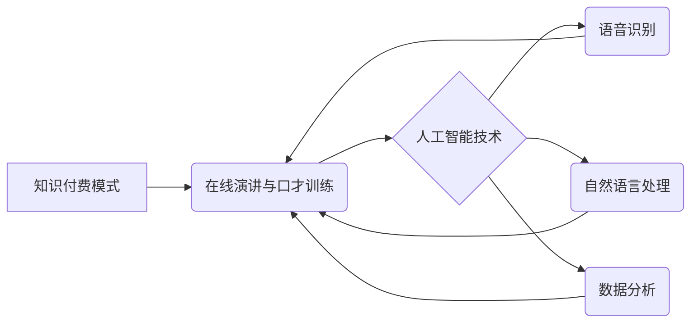

                 

## 如何利用知识付费实现在线演讲与口才训练？

> 关键词：知识付费、在线演讲、口才训练、人工智能、机器学习、语音识别、个性化学习、数据分析

## 1. 背景介绍

在当今数字化时代，线上演讲与口才训练已成为个人提升和职业发展的关键技能。无论是商务谈判、产品发布、学术报告，还是社交场合的演讲，良好的口才能力都能够提升个人影响力、增强沟通能力，并最终促进个人和职业的成功。然而，传统线下口才培训模式存在着时间、地域、成本等方面的限制，难以满足大众的需求。

知识付费模式的兴起为线上演讲与口才训练提供了新的机遇。通过线上平台，用户可以便捷地获取优质的口才培训资源，并根据自身需求进行个性化学习。人工智能技术的发展为知识付费平台提供了强大的技术支撑，例如语音识别、自然语言处理、数据分析等，能够实现更精准的个性化学习和反馈。

## 2. 核心概念与联系

**2.1 知识付费模式**

知识付费模式是指通过互联网平台，将知识、技能、经验等转化为付费产品或服务，并通过在线销售的方式，实现知识传播和价值变现。

**2.2 在线演讲与口才训练**

在线演讲与口才训练是指利用互联网平台，通过视频、音频、文字等多种形式，进行演讲技巧、语言表达、舞台表现等方面的学习和练习。

**2.3 人工智能技术**

人工智能技术是指模拟人类智能行为的计算机科学领域，包括机器学习、深度学习、自然语言处理等。

**2.4 核心概念关系图**



## 3. 核心算法原理 & 具体操作步骤

**3.1 算法原理概述**

在线演讲与口才训练的知识付费平台通常会采用以下核心算法：

* **语音识别算法:** 将用户的语音转换为文本，以便进行分析和反馈。
* **自然语言处理算法:** 对用户的文本进行分析，识别情感、语气、语法错误等，并提供相应的建议。
* **数据分析算法:** 对用户的学习数据进行分析，例如练习时长、错误率、进步趋势等，并生成个性化的学习报告和建议。

**3.2 算法步骤详解**

1. **语音采集:** 用户通过麦克风录制语音。
2. **语音预处理:** 对语音信号进行降噪、增强等处理，提高识别准确率。
3. **语音识别:** 使用语音识别算法将语音转换为文本。
4. **文本分析:** 使用自然语言处理算法对文本进行分析，识别情感、语气、语法错误等。
5. **数据存储:** 将语音、文本、分析结果等数据存储到数据库中。
6. **数据分析:** 使用数据分析算法对用户数据进行分析，生成个性化的学习报告和建议。
7. **反馈呈现:** 将分析结果以文本、语音、视频等形式呈现给用户，提供个性化的口才训练建议。

**3.3 算法优缺点**

* **优点:**

    * **个性化学习:** 根据用户的学习数据，提供个性化的训练建议和反馈。
    * **实时互动:** 用户可以实时练习，并获得即时的反馈。
    * **便捷性:** 用户可以随时随地进行学习，不受时间和地域限制。

* **缺点:**

    * **技术复杂度:** 语音识别、自然语言处理等算法的开发和维护需要较高的技术水平。
    * **数据安全:** 用户的语音和文本数据需要进行安全保护。
    * **成本高昂:** 建立和维护一个完善的在线口才训练平台需要较高的成本投入。

**3.4 算法应用领域**

* **在线教育:** 提供个性化的口才训练课程和服务。
* **企业培训:** 帮助员工提升演讲技巧和沟通能力。
* **个人提升:** 帮助个人提升口才能力，增强自信心。

## 4. 数学模型和公式 & 详细讲解 & 举例说明

**4.1 数学模型构建**

在线演讲与口才训练的知识付费平台可以构建以下数学模型：

* **用户学习进度模型:** 

    $$
    P = f(T, E, R)
    $$

    其中:

    * $P$ 表示用户的学习进度
    * $T$ 表示用户的学习时长
    * $E$ 表示用户的练习次数
    * $R$ 表示用户的错误率

* **个性化推荐模型:**

    $$
    R = g(U, C)
    $$

    其中:

    * $R$ 表示推荐的课程或资源
    * $U$ 表示用户的学习数据
    * $C$ 表示课程或资源的特征

**4.2 公式推导过程**

用户学习进度模型的推导过程可以参考以下步骤:

1. 确定学习进度指标: 例如学习时长、练习次数、错误率等。
2. 收集用户学习数据: 通过用户练习和学习行为记录数据。
3. 建立数据关系: 分析用户学习数据之间的关系，例如学习时长与练习次数、练习次数与错误率等。
4. 选择合适的数学函数: 根据数据关系，选择合适的数学函数来描述学习进度。

**4.3 案例分析与讲解**

假设一个用户学习时长为 10 小时，练习次数为 50 次，错误率为 10%。根据用户学习进度模型，可以计算出该用户的学习进度为 $P = f(10, 50, 0.1)$. 

## 5. 项目实践：代码实例和详细解释说明

**5.1 开发环境搭建**

* 操作系统: Windows/macOS/Linux
* 编程语言: Python
* 开发框架: Flask/Django
* 数据库: MySQL/PostgreSQL
* 云服务: AWS/Azure/GCP

**5.2 源代码详细实现**

```python
# Flask 应用示例

from flask import Flask, request, jsonify

app = Flask(__name__)

# 模拟用户数据
user_data = {
    "user_id": 1,
    "name": "张三",
    "learning_time": 10,
    "practice_count": 50,
    "error_rate": 0.1
}

@app.route('/api/calculate_progress', methods=['POST'])
def calculate_progress():
    data = request.get_json()
    learning_time = data.get('learning_time')
    practice_count = data.get('practice_count')
    error_rate = data.get('error_rate')

    # 计算学习进度
    progress = calculate_progress(learning_time, practice_count, error_rate)

    return jsonify({'progress': progress})

def calculate_progress(learning_time, practice_count, error_rate):
    # 使用数学模型计算学习进度
    # ...

if __name__ == '__main__':
    app.run(debug=True)
```

**5.3 代码解读与分析**

* 该代码示例是一个简单的 Flask 应用，用于模拟在线口才训练平台的学习进度计算功能。
* 用户可以通过 POST 请求发送学习数据，例如学习时长、练习次数、错误率等。
* 服务器端会使用 `calculate_progress` 函数计算用户的学习进度，并返回结果。
* 实际应用中，`calculate_progress` 函数需要根据具体的数学模型进行实现。

**5.4 运行结果展示**

当用户发送 POST 请求时，服务器会返回学习进度结果，例如:

```json
{
  "progress": 0.75
}
```

## 6. 实际应用场景

**6.1 商业培训**

* 企业可以利用在线口才训练平台，为员工提供个性化的演讲技巧培训，提升员工的沟通能力和领导力。
* 平台可以根据员工的职位、行业、学习进度等信息，推荐相应的培训课程和资源。

**6.2 教育培训**

* 教育机构可以利用在线口才训练平台，为学生提供口才训练课程，帮助学生提升演讲能力和自信心。
* 平台可以提供模拟演讲场景、语音反馈、学习进度追踪等功能，帮助学生更好地练习和提升。

**6.3 个人提升**

* 个人用户可以通过在线口才训练平台，学习演讲技巧、克服紧张情绪、提升自信心。
* 平台可以提供各种类型的口才训练课程、练习素材、专家指导等，帮助用户实现个人成长。

**6.4 未来应用展望**

* **虚拟现实 (VR) 和增强现实 (AR) 技术:** 将 VR/AR 技术应用于在线口才训练平台，可以创造更逼真的演讲场景，提升用户的沉浸感和学习效果。
* **人工智能 (AI) 驱动的个性化学习:** 利用 AI 技术，对用户的学习数据进行更深入的分析，提供更精准的个性化学习建议和反馈。
* **跨平台协作:** 在线口才训练平台可以与其他学习平台、社交平台等进行整合，实现跨平台协作，提升用户的学习体验和互动性。

## 7. 工具和资源推荐

**7.1 学习资源推荐**

* **书籍:**

    * 《演讲的力量》
    * 《如何赢得朋友和影响他人》
    * 《说服力》

* **在线课程:**

    * Coursera: 口才训练课程
    * Udemy: 演讲技巧课程
    * Skillshare: 沟通技巧课程

**7.2 开发工具推荐**

* **编程语言:** Python, JavaScript
* **开发框架:** Flask, Django, React
* **数据库:** MySQL, PostgreSQL
* **云服务:** AWS, Azure, GCP

**7.3 相关论文推荐**

* **语音识别:**

    * Automatic Speech Recognition: A Survey
    * Deep Learning for Speech Recognition

* **自然语言处理:**

    * Natural Language Processing with Deep Learning
    * A Survey of Transfer Learning in Natural Language Processing

## 8. 总结：未来发展趋势与挑战

**8.1 研究成果总结**

在线演讲与口才训练的知识付费平台已取得了显著的成果，例如：

* 提供个性化的学习体验
* 提升用户的学习效率
* 降低学习成本

**8.2 未来发展趋势**

* **AI 驱动的个性化学习:** 利用 AI 技术，提供更精准的个性化学习建议和反馈。
* **沉浸式学习体验:** 将 VR/AR 技术应用于在线口才训练平台，创造更逼真的演讲场景。
* **跨平台协作:** 在线口才训练平台与其他学习平台、社交平台等进行整合，实现跨平台协作。

**8.3 面临的挑战**

* **技术复杂度:** 语音识别、自然语言处理等算法的开发和维护需要较高的技术水平。
* **数据安全:** 用户的语音和文本数据需要进行安全保护。
* **内容质量:** 平台需要提供高质量的口才训练课程和资源。

**8.4 研究展望**

未来，在线演讲与口才训练的知识付费平台将继续朝着更智能化、个性化、沉浸式的方向发展，为用户提供更优质的学习体验。


## 9. 附录：常见问题与解答

**9.1 如何选择合适的在线口才训练平台？**

* 考虑平台的课程内容、教学方式、价格、用户评价等因素。
* 选择拥有丰富经验、专业资质的平台。
* 尝试免费试用课程，体验平台的教学效果。

**9.2 在线口才训练平台的收费标准如何？**

* 在线口才训练平台的收费标准因平台、课程类型、学习时长等因素而异。
* 一些平台提供免费课程，但功能有限。
* 付费课程通常提供更丰富的功能、更专业的指导和更个性化的学习体验。

**9.3 在线口才训练平台的学习效果如何？**

* 在线口才训练平台的学习效果取决于用户的学习态度、学习方法和练习时间。
* 坚持练习、积极互动、认真学习，才能获得良好的学习效果。

**9.4 在线口才训练平台有哪些安全保障？**

*  reputable platforms will have robust security measures in place to protect user data.
* Look for platforms that use encryption to protect data transmission and storage.
* Read the platform's privacy policy to understand how your data is used and protected.


作者：禅与计算机程序设计艺术 / Zen and the Art of Computer Programming 
<end_of_turn>

