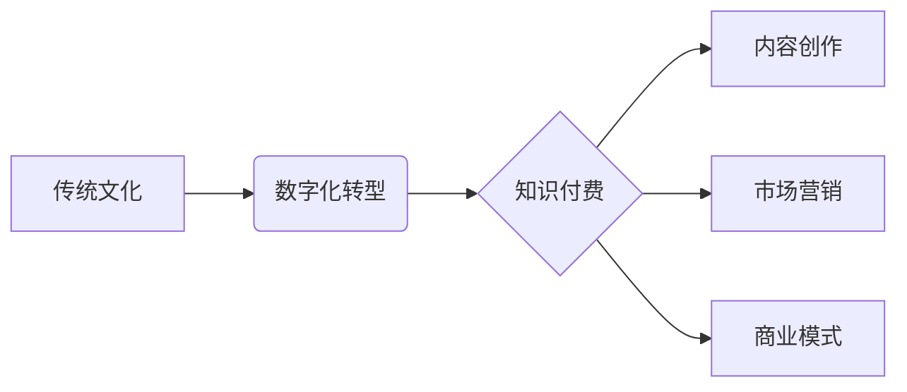

                 

## 如何发掘传统文化领域的知识付费机会

> 关键词：传统文化、知识付费、数字化转型、人工智能、内容创作、市场营销、商业模式

### 1. 背景介绍

传统文化作为中华民族的宝贵财富，蕴藏着丰富的知识和智慧。然而，随着时代的发展，传统文化面临着传承断裂、传播受限等问题。知识付费作为一种新型的商业模式，为传统文化的发展提供了新的机遇。

近年来，随着互联网和移动互联网的普及，人们对知识的需求日益增长，知识付费市场呈现出爆发式增长。传统文化领域也开始积极探索知识付费模式，通过线上平台、课程体系、文化体验等形式，将传统文化知识传播给更广泛的受众。

### 2. 核心概念与联系

#### 2.1 传统文化与知识付费

传统文化是指代代相传的文化遗产，包括但不限于：

* **历史文化**:  历史事件、人物传记、古籍文献等
* **艺术文化**:  绘画、书法、音乐、舞蹈、戏剧等
* **民俗文化**:  节日习俗、民俗故事、传统技艺等

知识付费是指以知识、技能、经验等为核心内容，通过付费的方式获取知识和服务的商业模式。

#### 2.2 数字化转型与知识付费

数字化转型是指利用数字化技术，对传统文化进行数字化采集、存储、加工、传播和应用的过程。

数字化转型为传统文化知识付费提供了重要的技术支撑：

* **内容数字化**:  将传统文化内容数字化，方便存储、传播和利用。
* **平台建设**:  搭建线上平台，提供知识付费服务。
* **技术应用**:  利用人工智能、大数据等技术，提升知识付费服务质量。

#### 2.3  核心概念关系流程图



### 3. 核心算法原理 & 具体操作步骤

#### 3.1 算法原理概述

知识付费的成功离不开算法的支撑。在传统文化领域，一些关键算法可以帮助我们更好地挖掘、整理和传播传统文化知识：

* **文本挖掘算法**:  用于从海量文本数据中提取关键信息、识别主题和情感等。
* **知识图谱构建算法**:  用于构建传统文化知识的结构化表示，方便知识检索和推理。
* **推荐算法**:  用于根据用户的兴趣和偏好，推荐相关的传统文化内容。

#### 3.2 算法步骤详解

以文本挖掘算法为例，其具体操作步骤如下：

1. **数据采集**:  收集相关领域的文本数据，例如古籍、文献、笔记、论坛等。
2. **数据预处理**:  对文本数据进行清洗、格式化、分词等处理，去除噪声和冗余信息。
3. **特征提取**:  利用自然语言处理技术，提取文本中的关键词、主题、情感等特征。
4. **模型训练**:  根据提取的特征，训练文本挖掘模型，例如主题模型、情感分析模型等。
5. **知识发现**:  利用训练好的模型，对文本数据进行分析，发现传统文化知识的隐藏规律和关联性。

#### 3.3 算法优缺点

**优点**:

* 可以自动处理海量文本数据，提高效率。
* 可以发现文本数据中隐藏的知识和规律。
* 可以为传统文化知识的传播和应用提供数据支持。

**缺点**:

* 需要大量的训练数据和计算资源。
* 模型的准确性依赖于训练数据的质量。
* 算法本身无法完全理解文本的语义和文化背景。

#### 3.4 算法应用领域

* **传统文化知识库建设**:  构建基于文本挖掘的传统文化知识库，方便知识检索和查询。
* **传统文化内容推荐**:  根据用户的兴趣和偏好，推荐相关的传统文化内容。
* **传统文化研究**:  辅助学者进行传统文化研究，发现新的研究方向和成果。

### 4. 数学模型和公式 & 详细讲解 & 举例说明

#### 4.1 数学模型构建

在知识付费领域，我们可以利用数学模型来分析用户行为、预测市场需求等。例如，我们可以构建一个用户价值模型，来评估用户的付费意愿和价值。

#### 4.2 公式推导过程

用户价值模型可以采用以下公式：

$$
UV = f(P, C, E, S)
$$

其中：

* UV: 用户价值
* P: 付费意愿
* C: 内容质量
* E: 互动体验
* S: 社交影响

#### 4.3 案例分析与讲解

假设我们想要开发一个传统文化知识付费平台，我们可以利用用户价值模型来分析用户的付费意愿。

* **内容质量 (C)**:  平台提供的传统文化内容需要高质量，例如由专家撰写的文章、视频课程等。
* **互动体验 (E)**:  平台需要提供良好的互动体验，例如在线答疑、社区讨论等。
* **社交影响 (S)**:  平台可以利用社交媒体等渠道，提升传统文化的传播力和影响力。

通过调整以上因素，我们可以提高用户的付费意愿，从而提升平台的商业价值。

### 5. 项目实践：代码实例和详细解释说明

#### 5.1 开发环境搭建

* **操作系统**:  Windows/macOS/Linux
* **编程语言**:  Python
* **开发工具**:  VS Code/PyCharm
* **库依赖**:  NLTK/spaCy/Gensim

#### 5.2 源代码详细实现

```python
# 文本挖掘示例代码

import nltk
from nltk.tokenize import word_tokenize
from nltk.corpus import stopwords

# 下载 NLTK 数据包
nltk.download('punkt')
nltk.download('stopwords')

# 文本数据
text = "中国传统文化博大精深，蕴藏着丰富的智慧。"

# 分词
tokens = word_tokenize(text)

# 去除停用词
stop_words = set(stopwords.words('english'))
filtered_tokens = [word for word in tokens if word.lower() not in stop_words]

# 打印结果
print(filtered_tokens)
```

#### 5.3 代码解读与分析

* **文本分词**:  将文本分割成单词或短语，方便后续分析。
* **停用词去除**:  去除一些常见的无意义词，例如“是”、“的”、“在”等，提高分析的准确性。

#### 5.4 运行结果展示

```
['中国', '传统', '文化', '博大', '精深', '蕴藏', '丰富', '智慧']
```

### 6. 实际应用场景

#### 6.1 线上课程平台

* 将传统文化知识整理成课程体系，提供在线学习服务。
* 利用人工智能技术，个性化推荐课程内容。
* 通过直播、互动等方式，提升用户学习体验。

#### 6.2 文化体验平台

* 提供线上线下结合的文化体验活动，例如书法、绘画、茶道等。
* 利用虚拟现实技术，打造沉浸式的文化体验场景。
* 通过社交互动，促进文化传播和交流。

#### 6.3 文化旅游平台

* 打造线上线下结合的文化旅游路线，推荐传统文化景点。
* 利用大数据分析，预测旅游需求，优化旅游资源配置。
* 通过移动互联网，提供便捷的旅游服务。

#### 6.4 未来应用展望

* **人工智能驱动的个性化学习**:  利用人工智能技术，根据用户的学习风格和兴趣，定制个性化的学习方案。
* **虚拟现实与增强现实的沉浸式体验**:  利用虚拟现实和增强现实技术，打造更加沉浸式的文化体验场景。
* **区块链技术的知识版权保护**:  利用区块链技术，保障传统文化知识的版权和价值。

### 7. 工具和资源推荐

#### 7.1 学习资源推荐

* **在线课程平台**:  Coursera、edX、Udemy等
* **传统文化研究机构**:  中国社会科学院、中国文化研究院等
* **学术期刊**:  《中国文化研究》、《中国社会科学》等

#### 7.2 开发工具推荐

* **编程语言**:  Python、Java、C++等
* **开发框架**:  Django、Flask、Spring Boot等
* **数据库**:  MySQL、MongoDB、PostgreSQL等

#### 7.3 相关论文推荐

* **传统文化数字化转型的研究**:  《传统文化数字化转型的路径与策略》
* **知识付费模式的应用研究**:  《知识付费模式的现状与发展趋势》
* **人工智能在传统文化领域的应用**:  《人工智能技术在传统文化保护与传承中的应用》

### 8. 总结：未来发展趋势与挑战

#### 8.1 研究成果总结

* 传统文化知识付费市场潜力巨大，发展前景广阔。
* 数字化转型为传统文化知识付费提供了重要的技术支撑。
* 算法技术可以帮助我们更好地挖掘、整理和传播传统文化知识。

#### 8.2 未来发展趋势

* **个性化定制**:  利用人工智能技术，提供更加个性化的学习方案和文化体验。
* **沉浸式体验**:  利用虚拟现实和增强现实技术，打造更加沉浸式的文化体验场景。
* **跨界融合**:  将传统文化与其他领域融合，例如科技、艺术、旅游等，创造新的文化产品和服务。

#### 8.3 面临的挑战

* **内容质量**:  需要不断提升传统文化知识付费内容的质量和丰富度。
* **用户体验**:  需要不断优化用户体验，提升用户粘性和付费意愿。
* **版权保护**:  需要加强传统文化知识的版权保护，保障知识产权。

#### 8.4 研究展望

* **探索更有效的知识付费模式**:  针对不同类型的传统文化知识，探索更有效的知识付费模式。
* **利用人工智能技术，挖掘传统文化更深层的价值**:  利用人工智能技术，挖掘传统文化更深层的价值，例如文化传承、社会治理等。
* **推动传统文化与现代科技的融合发展**:  推动传统文化与现代科技的融合发展，创造新的文化形态和价值。

### 9. 附录：常见问题与解答

#### 9.1 如何评估传统文化知识付费项目的成功？

* **用户增长**:  平台用户数量和活跃度
* **付费转化率**:  用户付费转化率
* **用户满意度**:  用户对平台内容和服务的满意度
* **商业效益**:  平台的收入和利润

#### 9.2 如何提升传统文化知识付费内容的质量？

* **邀请专家学者**:  邀请专家学者撰写高质量的传统文化内容。
* **注重内容原创性**:  鼓励原创内容创作，避免抄袭和剽窃。
* **进行内容审核**:  建立内容审核机制，确保内容的准确性和可靠性。
* **收集用户反馈**:  收集用户反馈，不断改进内容质量。


作者：禅与计算机程序设计艺术 / Zen and the Art of Computer Programming 
<end_of_turn>

