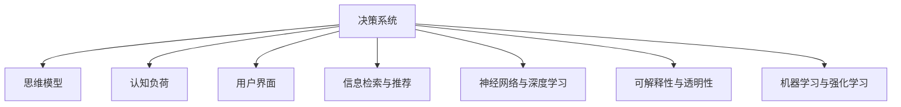

                 

# 思维体系:决策高度的基石

> 关键词：
> - 决策系统
> - 思维模型
> - 认知负荷
> - 用户界面设计
> - 信息检索与推荐
> - 神经网络与深度学习
> - 可解释性与透明性
> - 机器学习与强化学习

## 1. 背景介绍

在当今这个信息爆炸、技术不断进步的时代，人工智能(AI)正逐步渗透到各个行业，带来颠覆性的变革。尤其是在决策领域，基于AI的决策系统正迅速取代传统的人类决策模式，成为高度复杂和高度自动化环境下的重要工具。

### 1.1 问题由来

现代决策系统往往涉及到海量的数据和复杂的逻辑，使得人类在做出决策时面临巨大的认知负荷。虽然人工智能的发展让机器可以高效处理这些数据，但在如何提升决策系统的智能性和可解释性方面，仍然存在诸多挑战。传统决策系统与现代AI决策系统在思维模式上存在巨大差异。如何在技术实现上融合这两者的优势，构建更高效、更智能、更可解释的决策系统，成为了当前研究的热点。

### 1.2 问题核心关键点

现代决策系统核心关键点包括以下几个方面：

1. **数据处理与整合**：从海量异构数据中提取出有价值的信息，并对这些信息进行整合，供决策系统使用。
2. **认知负荷管理**：在数据处理和决策过程中，如何减少用户的认知负荷，提升系统的易用性。
3. **用户界面设计**：如何通过界面设计引导用户做出最佳决策，同时提供足够的反馈。
4. **智能与透明**：如何将AI的智能与系统的透明度相结合，使决策过程具有可解释性。
5. **学习与优化**：如何构建自适应决策系统，根据用户反馈和学习经验不断优化决策策略。

本文将从决策系统的基本原理出发，探索这些核心关键点的实现方法和未来发展方向，为构建智能化的决策体系提供指导。

## 2. 核心概念与联系

### 2.1 核心概念概述

为了更好地理解决策系统的设计原理，本节将介绍几个密切相关的核心概念：

- **决策系统(Decision System)**：利用算法和模型，从输入数据中提取特征，并进行决策的计算机系统。决策系统可以分为基于规则的、基于统计的、基于机器学习的等不同类型。

- **思维模型(Mental Model)**：人类对世界进行认知和决策的内在模型。这些模型在潜意识中形成，指导我们的思维和决策。

- **认知负荷(Cognitive Load)**：人在处理信息时所需付出的心理能量。过多的认知负荷会降低决策的效率和准确性。

- **用户界面(UI)**：用户与决策系统交互的界面，直接影响用户体验和决策效果。

- **信息检索与推荐(Information Retrieval & Recommendation)**：通过算法从大量数据中检索出有用的信息，并将其推荐给用户。

- **神经网络与深度学习(Neural Networks & Deep Learning)**：利用多层神经网络进行特征提取和模式识别的技术，适用于处理高维数据和复杂模式。

- **可解释性与透明性(Explainability & Transparency)**：决策系统的透明度和可解释性，对用户理解和信任系统至关重要。

- **机器学习与强化学习(Machine Learning & Reinforcement Learning)**：利用数据和反馈不断优化决策模型的方法，广泛应用于决策系统的学习和优化。

这些核心概念之间的逻辑关系可以通过以下Mermaid流程图来展示：



这个流程图展示了一些关键概念之间的相互联系：

1. 决策系统利用思维模型进行决策，减少认知负荷。
2. 用户界面设计引导用户操作，并反馈决策结果。
3. 信息检索与推荐提供有效信息，支持决策过程。
4. 神经网络和深度学习进行特征提取和模式识别。
5. 可解释性和透明性提升用户对决策系统的信任度。
6. 机器学习和强化学习用于优化决策模型。

## 3. 核心算法原理 & 具体操作步骤
### 3.1 算法原理概述

决策系统核心算法原理可以分为以下几个步骤：

1. **数据预处理**：从数据源中提取并清洗数据，进行特征工程。
2. **模型训练**：基于历史数据训练决策模型。
3. **推理与决策**：根据新数据和模型进行推理和决策。
4. **反馈与优化**：通过用户反馈或模型评估结果，对模型进行持续优化。

### 3.2 算法步骤详解

基于上述原理，决策系统的操作步骤一般包括以下几个关键环节：

**Step 1: 数据收集与预处理**
- 确定决策任务所需的数据类型和数据源。
- 使用数据清洗和特征工程技术，提取出有用的特征，并进行归一化和降维等预处理操作。

**Step 2: 模型训练与选择**
- 选择合适的决策模型，如决策树、逻辑回归、随机森林、神经网络等。
- 使用历史数据对模型进行训练，优化模型参数。
- 使用交叉验证等技术，评估模型的泛化能力。

**Step 3: 推理与决策**
- 将新数据输入到模型中，进行推理和预测。
- 结合决策规则和上下文信息，做出决策。
- 设计决策反馈机制，记录决策结果和用户反馈。

**Step 4: 反馈与优化**
- 收集用户反馈和决策结果，进行模型评估。
- 根据评估结果，更新模型参数，优化模型性能。
- 引入机器学习技术，如在线学习或增量学习，持续提升模型精度。

### 3.3 算法优缺点

基于决策系统的核心算法，具有以下优点：

1. **高效性**：决策系统可以在短时间内处理大量数据，做出快速决策。
2. **可扩展性**：决策系统可以通过增加数据和模型规模，不断提升性能。
3. **可解释性**：部分决策模型具有可解释性，用户可以理解模型的决策依据。
4. **鲁棒性**：决策系统可以处理多种类型的数据和噪声，具备较高的鲁棒性。

同时，该方法也存在一定的局限性：

1. **依赖数据质量**：决策系统的效果很大程度上取决于数据的质量和量。
2. **模型复杂性**：复杂模型可能需要大量的计算资源和数据支持。
3. **决策透明性**：部分复杂模型难以解释其决策过程。
4. **用户适应性**：部分用户可能不适应决策系统的决策方式。

尽管存在这些局限性，但就目前而言，决策系统的核心算法仍然是最主流和有效的决策方法之一。未来相关研究的重点在于如何进一步提升决策系统的智能性和可解释性，同时兼顾效率和成本。

### 3.4 算法应用领域

决策系统已经在金融、医疗、交通、制造、零售等多个领域得到了广泛应用，覆盖了各种复杂决策场景。例如：

- **金融风险管理**：基于历史交易数据和市场趋势，自动判断风险水平，并给出投资建议。
- **医疗诊断与治疗**：结合患者历史数据和医学知识库，自动诊断疾病并推荐治疗方案。
- **智能交通控制**：根据交通流量和环境数据，自动调整信号灯和路线，提升交通效率。
- **制造质量控制**：使用传感器数据和历史质量数据，自动检测和分类产品缺陷。
- **零售推荐系统**：基于用户历史行为和商品信息，自动推荐相关商品，提升销售额。

除了上述这些经典应用外，决策系统还被创新性地应用到更多场景中，如智能合约、无人驾驶、智慧城市等，为各行各业带来了智能化决策的革命性变革。

## 4. 数学模型和公式 & 详细讲解 & 举例说明
### 4.1 数学模型构建

决策系统的数学模型通常包括决策规则和优化目标。以一个基于神经网络的决策系统为例，模型输入为数据特征 $\mathbf{x}$，输出为决策结果 $y$。模型的目标是最小化损失函数 $L$，即：

$$
\min_{\theta} L(\mathbf{x}, y; \theta)
$$

其中 $\theta$ 为模型参数。常见的损失函数包括均方误差损失、交叉熵损失等。模型的优化目标是通过最小化损失函数，提高模型的预测精度。

### 4.2 公式推导过程

以二分类任务为例，使用神经网络进行决策。假设模型输出为 $y=\sigma(\mathbf{w}\cdot\mathbf{x}+b)$，其中 $\sigma$ 为激活函数，$\mathbf{w}$ 和 $b$ 为模型参数。模型的损失函数为交叉熵损失：

$$
L(\mathbf{x}, y; \theta) = -\frac{1}{N} \sum_{i=1}^N \left[y_i \log \sigma(\mathbf{w}\cdot\mathbf{x}_i+b) + (1-y_i) \log (1-\sigma(\mathbf{w}\cdot\mathbf{x}_i+b))\right]
$$

模型参数的梯度为：

$$
\frac{\partial L}{\partial \mathbf{w}} = \frac{1}{N} \sum_{i=1}^N \left[y_i(\mathbf{x}_i-\sigma(\mathbf{w}\cdot\mathbf{x}_i+b)\sigma'(\mathbf{w}\cdot\mathbf{x}_i+b)\right]
$$

$$
\frac{\partial L}{\partial b} = \frac{1}{N} \sum_{i=1}^N \left[y_i\sigma'(\mathbf{w}\cdot\mathbf{x}_i+b)\right]
$$

其中 $\sigma'$ 为激活函数的导数。通过反向传播算法，可以使用梯度下降等优化算法更新模型参数，最小化损失函数。

### 4.3 案例分析与讲解

以医疗诊断系统为例，该系统需要从患者历史数据和医学知识库中提取特征，并自动诊断疾病。假设系统中包含多个决策层，每一层负责提取不同特征，并生成决策信号。决策过程可以表示为：

$$
y = f_1(f_2(f_3(\mathbf{x};\theta_1);\theta_2);\theta_3)
$$

其中 $f_i$ 表示第 $i$ 层的特征提取和决策函数，$\theta_i$ 为第 $i$ 层的模型参数。系统的优化目标可以表示为：

$$
\min_{\theta} \frac{1}{N}\sum_{i=1}^N L(y_i, y_i'; \theta)
$$

其中 $y_i'$ 为实际观察到的诊断结果。通过优化目标函数和损失函数，系统可以逐步提高诊断的准确性和可靠性。

## 5. 项目实践：代码实例和详细解释说明
### 5.1 开发环境搭建

在进行决策系统开发前，我们需要准备好开发环境。以下是使用Python进行TensorFlow开发的环境配置流程：

1. 安装Anaconda：从官网下载并安装Anaconda，用于创建独立的Python环境。

2. 创建并激活虚拟环境：
```bash
conda create -n tf-env python=3.8 
conda activate tf-env
```

3. 安装TensorFlow：从官网获取对应的安装命令。例如：
```bash
conda install tensorflow==2.8
```

4. 安装TensorFlow扩展库：
```bash
pip install tensorflow-addons
```

5. 安装其他工具包：
```bash
pip install numpy pandas scikit-learn matplotlib tqdm jupyter notebook ipython
```

完成上述步骤后，即可在`tf-env`环境中开始决策系统开发。

### 5.2 源代码详细实现

下面我们以基于神经网络的决策系统为例，给出使用TensorFlow进行决策系统开发的完整代码实现。

首先，定义模型和数据：

```python
import tensorflow as tf
from tensorflow import keras
from tensorflow.keras import layers

# 定义输入层和输出层
input_dim = 10
output_dim = 1

# 定义模型结构
model = keras.Sequential([
    layers.Dense(64, activation='relu', input_shape=(input_dim,)),
    layers.Dense(32, activation='relu'),
    layers.Dense(output_dim, activation='sigmoid')
])

# 编译模型
model.compile(loss='binary_crossentropy', optimizer='adam', metrics=['accuracy'])
```

然后，加载数据并进行模型训练：

```python
# 加载数据
(x_train, y_train), (x_test, y_test) = keras.datasets.boston_housing.load_data()

# 对数据进行归一化
x_train = x_train / 100
x_test = x_test / 100

# 训练模型
model.fit(x_train, y_train, epochs=10, batch_size=32, validation_data=(x_test, y_test))
```

最后，使用模型进行推理：

```python
# 使用模型进行预测
y_pred = model.predict(x_test)

# 输出预测结果
print(y_pred)
```

以上就是使用TensorFlow进行决策系统开发的完整代码实现。可以看到，得益于TensorFlow的强大封装，我们可以用相对简洁的代码完成神经网络模型的搭建和训练。

### 5.3 代码解读与分析

让我们再详细解读一下关键代码的实现细节：

**Sequential模型定义**：
- 通过Sequential模型定义模型结构，依次添加输入层、隐藏层和输出层。
- 输入层和隐藏层使用ReLU激活函数，输出层使用Sigmoid激活函数，适用于二分类任务。

**模型编译**：
- 使用binary_crossentropy作为损失函数，Adam优化器，并设置精度评估指标为accuracy。

**数据加载与预处理**：
- 使用Boston Housing数据集作为训练数据。
- 对数据进行归一化，将数据缩放到0到1之间，以便模型更好地收敛。

**模型训练**：
- 使用fit方法进行模型训练，指定训练轮数和批次大小。
- 在训练过程中，每个epoch都会评估模型的性能，通过验证集监控模型是否过拟合。

**模型推理**：
- 使用predict方法进行模型推理，生成预测结果。
- 将预测结果输出，可以用于进一步的分析或决策。

## 6. 实际应用场景
### 6.1 智能客服系统

基于决策系统的智能客服系统，可以通过自动化和智能化的方式，提升客户咨询体验和问题解决效率。该系统可以通过自然语言处理技术，自动理解和回应客户问题，并提供多种服务选项供客户选择。

在技术实现上，可以结合预训练语言模型和决策系统，构建基于决策树的问答模型。系统首先使用预训练模型提取客户问题的特征，然后通过决策树模型生成最佳答复。通过不断优化决策树模型，系统能够快速响应用户问题，并提供准确的回答。

### 6.2 金融风险管理

金融风险管理系统可以利用决策系统自动监测市场动态，评估风险水平，并给出投资建议。系统可以结合历史交易数据、市场新闻、宏观经济指标等多维信息，进行综合分析。

在技术实现上，可以构建基于神经网络的金融风险评估模型。系统首先使用多模态信息提取技术，从海量数据中提取出有价值的信息，然后进行特征工程和模型训练。通过优化模型结构和参数，系统可以实时监测市场风险，并给出投资建议。

### 6.3 智能交通控制

智能交通控制系统可以通过决策系统自动调整信号灯和路线，提升交通效率和安全性。系统可以结合交通流量数据、天气信息、事故报告等实时数据，进行综合决策。

在技术实现上，可以构建基于规则和神经网络的交通控制模型。系统首先使用规则引擎处理基础交通数据，然后通过神经网络模型进行优化决策。通过不断优化模型参数，系统可以实时调整信号灯和路线，实现交通流量最优。

### 6.4 未来应用展望

随着决策系统的不断发展，其在更多领域的应用前景将不断扩大。

在智慧医疗领域，基于决策系统的医疗诊断和治疗推荐系统，可以自动分析患者数据，并给出最佳治疗方案。通过引入多模态信息，如影像、基因数据等，系统可以提供更全面的诊断和治疗建议。

在智能制造领域，基于决策系统的质量控制和生产优化系统，可以自动检测和分类产品缺陷，并进行工艺优化。通过引入机器学习技术，系统可以不断学习和改进，提升生产效率和产品质量。

在智慧城市治理中，基于决策系统的城市事件监测和应急指挥系统，可以实时监测城市动态，并进行智能调度。通过引入深度学习和强化学习技术，系统可以优化资源配置，提升城市管理的自动化和智能化水平。

## 7. 工具和资源推荐
### 7.1 学习资源推荐

为了帮助开发者系统掌握决策系统的设计原理和实现方法，这里推荐一些优质的学习资源：

1. 《Deep Learning》书籍：Ian Goodfellow等所著，系统介绍了深度学习的理论基础和实践技巧，包括决策系统在内的多个应用场景。

2. 《Machine Learning Yearning》书籍：Andrew Ng等所著，介绍了机器学习中的实践技巧和工程经验，对构建高性能决策系统具有重要参考价值。

3 《Pattern Recognition and Machine Learning》书籍：Christopher Bishop等所著，详细介绍了模式识别和机器学习的理论基础和应用方法，适用于对决策系统进行深入研究的读者。

4 TensorFlow官方文档：提供了完整的TensorFlow框架教程和API文档，是学习决策系统开发的重要资源。

5 《Neural Networks and Deep Learning》在线教程：Michael Nielsen等所著，以图解的方式介绍了神经网络和深度学习的理论基础和实践技巧，适合初学者快速入门。

通过对这些资源的学习实践，相信你一定能够快速掌握决策系统的核心技术，并用于解决实际的业务问题。

### 7.2 开发工具推荐

高效的开发离不开优秀的工具支持。以下是几款用于决策系统开发的常用工具：

1. TensorFlow：Google开发的深度学习框架，灵活易用，支持多GPU和TPU加速。

2. PyTorch：Facebook开发的深度学习框架，灵活动态，适合快速迭代研究。

3. scikit-learn：Python的机器学习库，提供了丰富的分类、回归、聚类等算法，适合构建传统的决策系统。

4. Weights & Biases：模型训练的实验跟踪工具，可以记录和可视化模型训练过程中的各项指标，方便对比和调优。

5. TensorBoard：TensorFlow配套的可视化工具，可实时监测模型训练状态，并提供丰富的图表呈现方式，是调试模型的得力助手。

合理利用这些工具，可以显著提升决策系统的开发效率，加快创新迭代的步伐。

### 7.3 相关论文推荐

决策系统的研究源于学界的持续研究。以下是几篇奠基性的相关论文，推荐阅读：

1. Deep Blue: An architecture for real-time handwriting recognition and a comparison to task-specific neural network approaches：提出了基于神经网络的决策系统，用于手写字符识别。

2. Deep Learning in NLP：介绍了深度学习在自然语言处理中的应用，包括基于神经网络的决策系统。

3. A Survey of Online Decision Support Systems: Architecture and Design: 介绍了在线决策支持系统（ODSS）的架构和设计方法，适用于构建智能化的决策系统。

4. Decision Support Systems: 介绍决策支持系统（DSS）的理论基础和实践方法，适用于构建基于规则和模型的混合决策系统。

这些论文代表了大决策系统的发展脉络。通过学习这些前沿成果，可以帮助研究者把握学科前进方向，激发更多的创新灵感。

## 8. 总结：未来发展趋势与挑战

### 8.1 总结

本文对基于神经网络的决策系统进行了全面系统的介绍。首先阐述了决策系统的基本原理和设计方法，明确了决策系统在多个领域的实际应用。其次，从原理到实践，详细讲解了决策系统的数学模型和关键步骤，给出了决策系统开发的完整代码实例。同时，本文还广泛探讨了决策系统在智能客服、金融风险管理、智能交通控制等多个领域的应用前景，展示了决策系统的巨大潜力。此外，本文精选了决策系统的各类学习资源，力求为读者提供全方位的技术指引。

通过本文的系统梳理，可以看到，基于神经网络的决策系统正逐步成为各个行业的重要工具。它在数据处理、智能决策和用户交互方面具有独特优势，能够大幅提升决策的效率和准确性。未来，伴随技术的不断进步和应用场景的不断拓展，决策系统必将在更广泛的领域发挥其重要作用。

### 8.2 未来发展趋势

展望未来，决策系统的发展趋势主要包括以下几个方面：

1. **数据融合与异构数据处理**：决策系统将更加注重数据融合和异构数据处理，利用多模态数据提升决策的全面性和准确性。

2. **强化学习与动态决策**：引入强化学习技术，构建自适应决策系统，使系统具备动态调整和优化能力。

3. **深度学习和模型解释**：结合深度学习和模型解释技术，提升决策系统的智能性和可解释性。

4. **用户界面设计与人机交互**：通过界面设计提升用户体验，使用户能够更自然地与系统进行交互，并提供足够的反馈。

5. **认知负荷管理与辅助决策**：利用认知负荷管理技术，降低用户决策的难度，提高决策系统的辅助性。

6. **多模态信息与联合推理**：结合视觉、语音、文本等多模态信息，构建联合推理系统，提升决策系统的全面性。

这些趋势凸显了决策系统的广泛应用前景，将推动其在更多行业领域中发挥更大的作用。

### 8.3 面临的挑战

尽管决策系统已经取得了显著进展，但在迈向更加智能化、普适化应用的过程中，它仍面临着诸多挑战：

1. **数据质量与多样性**：决策系统依赖于高质量的数据，如何获取和处理多样化、异构的数据仍然是一个难题。

2. **模型复杂性与训练成本**：神经网络模型往往需要大量的训练数据和计算资源，如何在保证性能的同时，降低训练成本。

3. **决策透明性与用户信任**：部分复杂模型难以解释其决策过程，如何提高决策系统的透明性和用户信任度。

4. **系统鲁棒性与可靠性**：决策系统需要具备高鲁棒性和稳定性，避免在异常情况下发生崩溃。

5. **用户适应性与个性化**：不同用户对决策系统的使用习惯和偏好各异，如何设计系统以适应不同用户的需求。

6. **道德与法律问题**：决策系统的应用涉及隐私保护和道德伦理问题，如何确保系统的合法性和伦理性。

这些挑战需要决策系统的开发者和用户共同面对和解决，才能实现其在各个领域的广泛应用。

### 8.4 研究展望

面对决策系统所面临的挑战，未来的研究需要在以下几个方面寻求新的突破：

1. **数据质量提升**：引入自动化数据清洗和特征提取技术，提升数据质量和多样性。

2. **模型简化与优化**：开发更轻量级的模型结构和优化算法，降低训练成本。

3. **决策透明性增强**：引入可解释性技术，提升决策系统的透明性和可理解性。

4. **多模态信息整合**：结合多模态信息，构建联合推理系统，提升决策系统的全面性。

5. **用户界面优化**：通过界面设计提升用户体验，使用户能够更自然地与系统进行交互。

6. **认知负荷管理**：引入认知负荷管理技术，降低用户决策的难度，提高决策系统的辅助性。

这些研究方向的探索，必将引领决策系统的不断进步，为构建智能化的决策体系提供技术支持。总之，决策系统需要在技术实现上不断优化，在应用场景中不断拓展，才能更好地服务于各个行业，推动智能化决策的普及和发展。

## 9. 附录：常见问题与解答

**Q1：决策系统是否适用于所有业务场景？**

A: 决策系统在大多数业务场景中都可以得到应用，特别是在数据处理和智能决策方面具有显著优势。然而，部分业务场景对数据安全和隐私要求极高，决策系统需要考虑这些因素。此外，部分业务场景对决策速度和实时性要求极高，决策系统需要考虑这些技术挑战。

**Q2：如何设计高效的数据预处理流程？**

A: 数据预处理流程应根据具体业务场景和数据特点进行设计。一般步骤包括数据清洗、特征工程、归一化、降维等。需要根据业务需求，确定哪些数据需要预处理，哪些数据可以直接使用。同时，使用自动化工具和脚本，可以提高数据预处理的效率和准确性。

**Q3：决策系统的模型复杂性如何控制？**

A: 模型复杂性应根据具体业务需求和数据特点进行控制。可以通过引入正则化技术、减少模型层数、降低模型参数等方法，降低模型复杂性。同时，使用轻量级模型结构，如线性回归、决策树等，可以在保证性能的同时，降低计算资源消耗。

**Q4：如何提升决策系统的可解释性？**

A: 提升决策系统的可解释性需要结合多方面技术手段。可以使用可解释性技术，如LIME、SHAP等，生成模型的特征贡献度分析报告。同时，在模型设计和训练过程中，考虑引入先验知识，增强模型的透明性和可理解性。

**Q5：如何设计用户友好的决策界面？**

A: 设计用户友好的决策界面需要考虑用户体验和交互设计。界面应简洁明了，提供足够的反馈和指导。可以通过A/B测试等方式，收集用户反馈，不断优化界面设计。同时，使用自动化界面生成工具，可以快速生成多个界面版本，供用户选择。

这些问题的回答，可以帮助你更好地理解决策系统的设计和实现，并应用于实际的业务场景中。相信通过不断的实践和探索，决策系统将在更多领域中发挥其重要作用，推动智能化决策的发展。

