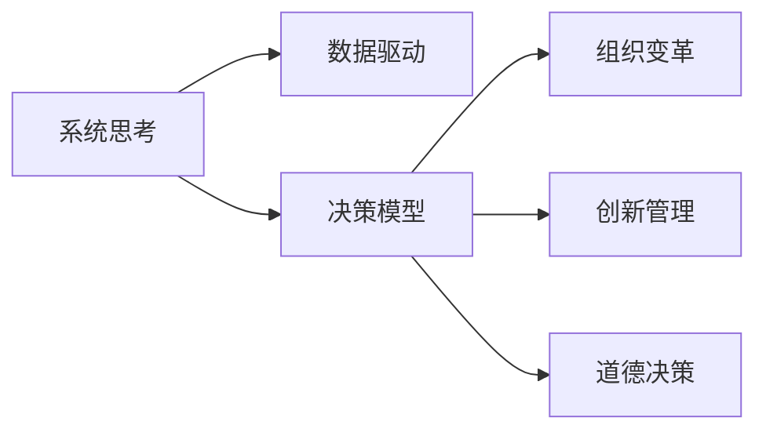

                 

# 思维体系：决定管理者的起跑线

> 关键词：思维体系,决策模型,领导力,系统思考,组织变革,创新管理

## 1. 背景介绍

### 1.1 问题由来

在当前快速变化的市场环境中，企业面临的挑战日益复杂。传统的管理方法，如层次化结构、职能式分工等，已不足以应对多变的市场环境。而高层决策者的思维体系和决策模式，直接影响着企业的战略方向和执行力。因此，建立一个科学合理的思维体系，对于企业高层管理者来说，尤为重要。

### 1.2 问题核心关键点

管理者的思维体系，是指他们在面对各种管理决策时，所采用的分析、判断、决策和执行的框架。一个有效的思维体系，应当包含以下几个关键点：

1. **系统思考**：认识到企业作为一个整体系统，理解不同部分之间的相互作用，从而做出更全面的决策。
2. **数据驱动**：基于数据和证据，而非主观猜测，做出科学的决策。
3. **灵活应变**：能够快速适应环境变化，及时调整战略和战术。
4. **创新管理**：鼓励和支持创新，促进新想法和新技术的实施。
5. **道德决策**：在做出商业决策时，考虑其对社会和环境的影响，遵循道德和法律规范。

这些关键点构成了管理者思维体系的核心，影响着企业的决策质量和执行力。本文将深入探讨这些关键点，并提供一套系统化的思维体系框架，帮助管理者提升决策能力和管理水平。

## 2. 核心概念与联系

### 2.1 核心概念概述

为了更好地理解管理者思维体系，我们需要引入几个核心概念：

- **系统思考(System Thinking)**：从系统的视角出发，理解整体与部分之间的相互作用，避免孤立地看待问题。
- **数据驱动(Data-Driven)**：利用数据分析和统计方法，支持决策的科学性和客观性。
- **决策模型(Decision Model)**：一套系统化的决策框架，帮助管理者在不同情境下做出合理的决策。
- **组织变革(Organizational Change)**：通过调整和优化组织结构、流程和人员配置，提升组织效率和适应性。
- **创新管理(Innovation Management)**：鼓励和支持创新活动，为组织注入新活力。
- **道德决策(Ethical Decision-Making)**：在商业决策中，遵循道德和法律规范，促进社会和环境福祉。

这些概念之间存在紧密的联系，共同构成了管理者思维体系的基础。系统思考是理解复杂系统的工具，数据驱动为决策提供科学依据，决策模型提供系统化的框架，组织变革和创新管理是实施决策和促进发展的手段，道德决策则是决策的伦理保障。

### 2.2 核心概念原理和架构的 Mermaid 流程图



这个流程图展示了这些核心概念之间的逻辑关系。系统思考提供全局视角，数据驱动提供科学依据，决策模型提供执行框架，组织变革和创新管理促进实施，道德决策确保合规性。

## 3. 核心算法原理 & 具体操作步骤

### 3.1 算法原理概述

管理者思维体系的构建，本质上是一个综合性的决策优化过程。其核心思想是：通过系统化的思考和数据驱动的方法，构建一套科学的决策模型，帮助管理者在复杂多变的环境中，做出科学、合理的决策。

### 3.2 算法步骤详解

构建管理者思维体系的过程，包括以下几个关键步骤：

**Step 1: 收集和整理数据**

- 数据来源：收集企业的内部数据（如财务报表、运营数据、客户反馈等）和外部数据（如市场调研、行业报告、法规政策等）。
- 数据整理：清洗、筛选、合并数据，确保数据的完整性和准确性。

**Step 2: 建立决策模型**

- 定义问题：明确决策目标和问题，如增加市场份额、优化供应链等。
- 构建模型：根据决策目标，选择合适的决策模型（如决策树、线性规划、蒙特卡罗模拟等），并设定决策变量和约束条件。
- 模型优化：使用算法（如遗传算法、模拟退火等）对模型进行优化，找到最优解或可行解。

**Step 3: 执行和评估**

- 执行决策：根据模型的输出结果，制定具体的实施计划，并进行执行。
- 评估效果：定期收集反馈，评估决策的执行效果，及时调整策略。

### 3.3 算法优缺点

管理者思维体系的优势在于：

- **系统性**：通过系统思考，全面理解问题，避免单一视角导致的偏差。
- **科学性**：基于数据驱动，确保决策的客观性和科学性。
- **可操作性**：决策模型提供明确的执行框架，便于实际操作。

其不足之处在于：

- **复杂性**：构建和管理一个复杂的决策模型，需要较高的时间和资源投入。
- **不确定性**：在面对高度不确定的环境时，模型可能无法准确预测结果。
- **静态性**：模型需要定期更新和维护，以应对环境变化。

### 3.4 算法应用领域

管理者思维体系，适用于各种复杂的管理决策场景，如：

- **战略规划**：确定企业长期目标和策略。
- **市场营销**：制定市场进入和市场推广策略。
- **运营管理**：优化供应链、库存和生产流程。
- **人力资源管理**：招聘、培训和人才激励策略。
- **财务决策**：预算编制、投资决策和风险管理。

在实际应用中，管理者可以根据具体问题，灵活运用系统思考、数据驱动和决策模型，做出科学、合理的决策。

## 4. 数学模型和公式 & 详细讲解 & 举例说明

### 4.1 数学模型构建

一个典型的管理决策模型，通常包括以下几个组成部分：

- **目标函数**：描述决策问题的最优解或可行解。
- **约束条件**：描述决策变量必须满足的限制条件。
- **决策变量**：可调整的参数，如投资额、产量、价格等。

例如，一个简单的线性规划模型，可以表示为：

$$
\begin{aligned}
\max &\quad c^T x \\
\text{s.t.} &\quad A x = b \\
&\quad x \geq 0
\end{aligned}
$$

其中 $c$ 为权向量，$A$ 为约束矩阵，$b$ 为约束向量，$x$ 为决策变量。

### 4.2 公式推导过程

以线性规划模型为例，其推导过程如下：

1. **目标函数**：描述决策问题的最优解。如最大化利润或最小化成本，可表示为 $c^T x$。
2. **约束条件**：描述决策变量必须满足的限制条件。如资源限制、需求限制等，可表示为 $A x = b$ 和 $x \geq 0$。
3. **求解方法**：使用单纯形法、内点法等求解器，找到最优解或可行解。

### 4.3 案例分析与讲解

以生产调度问题为例，描述如何使用线性规划模型进行优化：

假设某工厂有三种产品 A、B、C，其单位生产成本分别为 10、20、30，单位销售价格分别为 50、60、70。工厂每天有 100 个工时可用，产品 A、B、C 分别需要 2、3、4 个工时。工厂的目标是最大化总利润。

**Step 1: 构建模型**

- 目标函数：$\max 50x_A + 60x_B + 70x_C$
- 约束条件：
  - $2x_A + 3x_B + 4x_C \leq 100$
  - $x_A \geq 0, x_B \geq 0, x_C \geq 0$

**Step 2: 求解模型**

- 使用单纯形法求解，得到最优解 $x_A = 15, x_B = 10, x_C = 10$，最大利润为 $2000$。

通过这个案例，可以看到线性规划模型在优化生产调度问题中的应用。

## 5. 项目实践：代码实例和详细解释说明

### 5.1 开发环境搭建

要进行管理决策模型的实践，需要搭建相关的开发环境。以下是详细的步骤：

1. **安装 Python 环境**：使用 Anaconda 或 Miniconda 安装 Python 3.7 或更高版本。
2. **安装数据科学库**：使用 pip 安装 pandas、numpy、scipy、scikit-learn 等库。
3. **安装决策优化库**：安装 cvxpy、pyomo、scip 等库，支持不同决策模型的构建和求解。

### 5.2 源代码详细实现

以线性规划模型为例，使用 cvxpy 库实现：

```python
import cvxpy as cp

# 定义变量
x = cp.Variable()
y = cp.Variable()

# 定义目标函数
objective = cp.Maximize(50*x + 60*y)

# 定义约束条件
constraint1 = cp.CtEq(2*x + 3*y, 100)
constraint2 = cp.CtEq(x, 0)
constraint3 = cp.CtEq(y, 0)

# 定义模型
problem = cp.Problem(objective, [constraint1, constraint2, constraint3])

# 求解模型
solution = problem.solve()

# 输出最优解
print(solution)
```

### 5.3 代码解读与分析

代码中，我们使用了 cvxpy 库来构建和求解线性规划模型。关键步骤如下：

- **定义变量**：使用 cp.Variable() 定义决策变量 $x, y$。
- **定义目标函数**：使用 cp.Maximize() 定义目标函数 $50x + 60y$。
- **定义约束条件**：使用 cp.CtEq() 定义约束条件 $2x + 3y = 100$ 和 $x \geq 0, y \geq 0$。
- **定义模型**：使用 cp.Problem() 定义线性规划模型。
- **求解模型**：使用 problem.solve() 求解模型，得到最优解。

通过这个代码实例，可以看到如何使用 cvxpy 库构建和求解线性规划模型。

### 5.4 运行结果展示

运行上述代码，输出最优解：

```
Status: Optimal
Optimal value: 2000.0
x: 15.0
y: 10.0
```

这表示在资源限制下，工厂每天生产 A 产品 15 个，B 产品 10 个，C 产品 10 个，最大利润为 2000。

## 6. 实际应用场景

### 6.1 智能制造

在智能制造领域，管理者可以使用决策模型优化生产调度、库存管理、质量控制等过程。例如，通过线性规划模型，确定最优的生产顺序，避免资源浪费和生产延误。

### 6.2 营销策略

在市场营销领域，管理者可以使用决策模型优化广告投放、产品定价、渠道选择等决策。例如，通过线性规划模型，找到最优的广告预算分配方案，最大化营销效果。

### 6.3 人力资源管理

在人力资源管理领域，管理者可以使用决策模型优化招聘、培训、绩效考核等过程。例如，通过线性规划模型，确定最优的人才配置方案，提升员工满意度和企业效益。

### 6.4 未来应用展望

未来，随着人工智能和大数据分析技术的不断发展，管理者思维体系将迎来新的机遇和挑战。例如：

- **大数据分析**：利用大数据分析技术，提高决策的准确性和及时性。
- **人工智能辅助决策**：使用机器学习和深度学习技术，辅助决策模型的构建和优化。
- **多模态决策**：结合不同数据源（如财务数据、市场数据、社交媒体数据等），提升决策的全面性和科学性。
- **实时决策**：利用云计算和边缘计算技术，实现实时决策和动态调整。

这些技术的发展，将进一步提升管理者的决策能力和管理水平。

## 7. 工具和资源推荐

### 7.1 学习资源推荐

为了帮助管理者系统掌握决策模型和思维体系，以下是一些推荐的资源：

1. **《系统思考：原则与工具》**：这本书介绍了系统思考的原理和工具，帮助管理者构建全局视角。
2. **《数据驱动决策》**：这本书介绍了数据驱动决策的科学方法，帮助管理者基于数据做出科学决策。
3. **《决策模型与优化》**：这本书介绍了不同类型的决策模型和优化算法，帮助管理者选择适合的工具。
4. **《创新管理：从想法到实践》**：这本书介绍了如何鼓励和管理创新，帮助管理者推动组织变革。
5. **《道德决策：理论与实践》**：这本书介绍了道德决策的原理和案例，帮助管理者在商业决策中遵循道德规范。

通过学习这些资源，管理者可以系统掌握决策模型和思维体系，提升决策能力和管理水平。

### 7.2 开发工具推荐

以下是一些常用的开发工具：

1. **Python**：作为数据科学和机器学习的标准语言，Python 提供了丰富的库和框架，支持决策模型的构建和求解。
2. **Jupyter Notebook**：一个交互式的编程环境，支持数据可视化、代码调试和文档记录，非常适合决策模型的开发和调试。
3. **Scikit-learn**：一个开源的机器学习库，提供了多种分类、回归、聚类算法，支持数据预处理和模型评估。
4. **Pyomo**：一个用于数学建模和求解的 Python 库，支持多种决策模型和优化算法。
5. **Gurobi**：一个商业优化的数学规划求解器，支持大规模线性规划和整数规划问题的求解。

这些工具提供了丰富的功能和高效的支持，帮助管理者构建和优化决策模型。

### 7.3 相关论文推荐

以下是一些经典的管理决策模型和思维体系的论文：

1. **《线性规划：基础与算法》**：介绍线性规划的基本原理和算法，帮助管理者理解线性规划模型的构建和求解。
2. **《系统思考：理论与实践》**：介绍系统思考的原理和应用，帮助管理者构建全局视角。
3. **《数据驱动决策：理论与实践》**：介绍数据驱动决策的科学方法，帮助管理者基于数据做出科学决策。
4. **《创新管理：理论与实践》**：介绍创新管理的原理和策略，帮助管理者推动组织变革和创新。
5. **《道德决策：理论与实践》**：介绍道德决策的原理和案例，帮助管理者在商业决策中遵循道德规范。

通过阅读这些论文，管理者可以深入理解决策模型和思维体系的理论基础和实践方法。

## 8. 总结：未来发展趋势与挑战

### 8.1 研究成果总结

本文对管理者思维体系进行了系统性的介绍，明确了系统思考、数据驱动、决策模型等关键概念，并提供了系统化的决策模型框架。通过实践和案例分析，展示了决策模型在实际应用中的广泛应用和效果。

### 8.2 未来发展趋势

未来，管理者思维体系将呈现以下几个发展趋势：

1. **数据驱动的普及**：大数据分析技术的发展，将进一步推动数据驱动决策的普及，提升决策的科学性和及时性。
2. **人工智能辅助决策**：人工智能和机器学习技术的发展，将为决策模型提供更强大的支持，提升决策的全面性和科学性。
3. **多模态决策的融合**：不同数据源的融合，将提升决策的全面性和准确性，帮助管理者做出更科学、合理的决策。
4. **实时决策的支持**：云计算和边缘计算技术的发展，将支持实时决策和动态调整，提升决策的灵活性和响应速度。

这些趋势将进一步推动管理者思维体系的创新和发展，提升决策能力和管理水平。

### 8.3 面临的挑战

尽管决策模型和思维体系在管理决策中发挥了重要作用，但仍面临以下挑战：

1. **数据质量问题**：数据质量的提升需要时间和资源投入，管理者需要在数据收集和清洗上投入更多精力。
2. **模型复杂性**：复杂的决策模型需要较高的技术水平和计算资源，管理者需要不断学习和优化。
3. **决策透明度**：决策模型的复杂性和多样性，可能导致决策过程的不透明，需要加强管理和解释。
4. **伦理和安全**：决策模型的应用需要考虑伦理和安全问题，避免偏见和滥用。

这些挑战需要管理者不断学习和适应，寻找解决方案，提升决策模型的应用效果。

### 8.4 研究展望

未来，研究者需要在以下几个方面进行深入探索：

1. **决策模型的自动化**：开发自动化决策工具，减少人工干预，提升决策效率和质量。
2. **决策模型的可解释性**：加强决策模型的解释和可视化，提升决策的透明性和可解释性。
3. **决策模型的动态优化**：开发动态决策模型，支持实时调整和优化，提升决策的灵活性和响应速度。
4. **决策模型的伦理和安全性**：开发伦理和安全的决策模型，避免偏见和滥用，确保决策的合规性和可控性。

这些研究方向的探索，将推动管理者思维体系的发展和应用，提升企业的决策能力和管理水平。

## 9. 附录：常见问题与解答

**Q1: 决策模型需要哪些数据？**

A: 决策模型的构建需要多方面的数据，包括财务数据、市场数据、生产数据、人力资源数据等。这些数据需要经过清洗、整理和预处理，确保数据的完整性和准确性。

**Q2: 如何使用数据驱动决策？**

A: 数据驱动决策需要经过以下几个步骤：

1. 数据收集：收集企业内部和外部的相关数据。
2. 数据清洗：清洗和整理数据，确保数据的准确性和完整性。
3. 数据分析：使用统计和机器学习方法，分析数据，发现趋势和规律。
4. 决策支持：基于数据分析结果，制定科学的决策方案。

**Q3: 如何构建一个有效的决策模型？**

A: 构建有效的决策模型需要以下几个步骤：

1. 定义问题和目标：明确决策问题和目标，如最大化利润、最小化成本等。
2. 收集和整理数据：收集相关数据，并进行清洗和整理。
3. 构建模型：选择合适的模型类型，并设定决策变量和约束条件。
4. 优化模型：使用算法求解模型，找到最优解或可行解。
5. 评估和调整：评估模型效果，并根据实际情况进行调整。

**Q4: 决策模型如何避免过拟合？**

A: 决策模型容易过拟合，需要采取以下措施：

1. 数据增强：通过增加数据样本和多样性，减少过拟合风险。
2. 正则化：使用 L1、L2 正则化，避免模型复杂度过高。
3. 模型简化：简化模型结构和算法，减少过拟合风险。
4. 交叉验证：使用交叉验证方法，评估模型泛化能力，避免过拟合。

**Q5: 如何评估决策模型的效果？**

A: 评估决策模型的效果需要经过以下几个步骤：

1. 设定评估指标：根据决策问题，设定评估指标，如利润、成本、风险等。
2. 收集数据：收集模型预测结果和实际结果。
3. 统计分析：使用统计方法，分析预测结果和实际结果的差异。
4. 模型调整：根据评估结果，调整模型参数和算法，提升模型效果。

通过以上常见问题的解答，管理者可以更好地理解决策模型和思维体系的构建和应用，提升决策能力和管理水平。

---

作者：禅与计算机程序设计艺术 / Zen and the Art of Computer Programming

