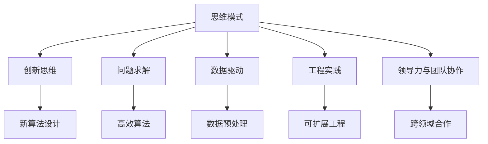

                 

# 思维模式：成功与失败的关键因素

> 关键词：思维模式, 成功因素, 失败原因, 创新, 领导力, 人工智能, 算法, 模型, 数据, 工程实践

## 1. 背景介绍

### 1.1 问题由来

在现代科技发展的洪流中，思维模式已成为决定个体和组织成功与失败的关键因素。无论是在科学研究、商业竞争，还是在日常决策中，思维方式的不同都会导致截然不同的结果。尤其是在人工智能（AI）领域，思维模式的选择直接决定了算法设计、模型训练、数据处理等诸多关键环节的效率和效果。

### 1.2 问题核心关键点

理解思维模式对于成功的关键作用，需要从以下几个维度深入探讨：
1. **创新思维**：如何打破常规，进行有意义的创新？
2. **问题求解**：面对复杂问题，如何设计高效的算法和模型？
3. **数据驱动**：在数据稀缺和噪声严重的场景下，如何合理利用有限数据？
4. **工程实践**：如何将理论转化为高效、可扩展的工程解决方案？
5. **领导力与团队协作**：如何构建高效的团队，实现跨领域的协同创新？

这些问题不仅决定了技术的成败，也直接影响了企业和社会的发展走向。因此，深入分析思维模式在成功与失败中的关键作用，对于每一位IT从业者都具有重要意义。

## 2. 核心概念与联系

### 2.1 核心概念概述

为了更好地理解思维模式在成功与失败中的作用，首先需要明确几个核心概念：

- **思维模式（Thinking Pattern）**：指个体或团队在面对问题时，所采用的思考方式、方法和策略。
- **成功因素（Success Factors）**：指影响成功的关键要素，包括技术创新、市场响应、资源配置、团队协作等。
- **失败原因（Failure Reasons）**：指导致失败的常见原因，包括决策失误、技术瓶颈、资源浪费、团队冲突等。
- **创新思维（Creative Thinking）**：指打破传统框架，提出新想法和新方法的能力。
- **问题求解（Problem Solving）**：指使用逻辑和数学工具解决实际问题的能力。
- **数据驱动（Data-Driven）**：指利用数据进行决策和预测的能力。
- **工程实践（Engineering Practice）**：指将理论应用于实际工程中的能力。
- **领导力与团队协作（Leadership and Teamwork）**：指构建高效团队，实现跨领域协同创新的能力。

这些概念之间的关系可以通过以下Mermaid流程图来展示：



这个流程图展示了几大思维模式与其具体应用领域之间的联系：

1. 创新思维是思维模式的核心，能够推动新算法和模型的设计。
2. 问题求解能力是解决复杂问题的关键，通过逻辑和数学方法找到高效算法。
3. 数据驱动使得模型训练和决策过程更加科学合理。
4. 工程实践是将理论转化为实际工程的能力，确保技术落地的高效可扩展性。
5. 领导力与团队协作是跨领域合作的基础，能够整合各领域资源，实现协同创新。

## 3. 核心算法原理 & 具体操作步骤

### 3.1 算法原理概述

在人工智能领域，思维模式的具体应用体现在算法设计和模型训练的每一个步骤中。以下是一些核心算法的原理概述：

1. **梯度下降算法（Gradient Descent）**：
   - **原理**：通过计算损失函数对模型参数的梯度，迭代更新模型参数，使损失函数最小化。
   - **操作步骤**：
     1. 初始化模型参数。
     2. 计算损失函数。
     3. 计算梯度。
     4. 更新模型参数。
     5. 重复以上步骤，直至损失函数收敛。

2. **卷积神经网络（CNN）**：
   - **原理**：利用卷积操作提取特征，通过池化操作降低特征维度，使用全连接层进行分类。
   - **操作步骤**：
     1. 设计卷积层、池化层和全连接层的网络结构。
     2. 随机初始化网络参数。
     3. 前向传播计算损失函数。
     4. 反向传播计算梯度。
     5. 使用梯度下降算法更新参数。
     6. 重复以上步骤，直至模型收敛。

3. **自编码器（Autoencoder）**：
   - **原理**：通过编码器将输入数据压缩为低维特征，再通过解码器重构原始数据。
   - **操作步骤**：
     1. 设计编码器和解码器的网络结构。
     2. 随机初始化网络参数。
     3. 前向传播计算编码器和解码器输出。
     4. 计算重构误差。
     5. 反向传播计算梯度。
     6. 使用梯度下降算法更新参数。
     7. 重复以上步骤，直至模型收敛。

### 3.2 算法步骤详解

以下是几个核心算法步骤的详细说明：

#### 梯度下降算法

**步骤1：初始化模型参数**
- 随机初始化模型参数，通常使用均值为0、标准差为$\sigma$的高斯分布。

**步骤2：计算损失函数**
- 定义损失函数，如均方误差、交叉熵等。
- 将训练集数据输入模型，计算预测值与真实值之间的差异。

**步骤3：计算梯度**
- 对损失函数求导，得到模型参数的梯度。
- 可以使用链式法则等数学工具进行求导。

**步骤4：更新模型参数**
- 使用梯度下降公式，更新模型参数：$\theta \leftarrow \theta - \eta \nabla_\theta \mathcal{L}(\theta)$，其中$\eta$为学习率，$\nabla_\theta \mathcal{L}(\theta)$为梯度。

**步骤5：重复以上步骤**
- 重复步骤1到步骤4，直至损失函数收敛或达到预设迭代次数。

#### 卷积神经网络

**步骤1：设计网络结构**
- 设计卷积层、池化层和全连接层的网络结构。
- 确定每层的参数数量和激活函数。

**步骤2：初始化网络参数**
- 随机初始化卷积核、偏置、全连接层权重和偏置等参数。

**步骤3：前向传播**
- 输入训练数据，通过卷积层、池化层和全连接层进行前向传播，计算输出。
- 使用激活函数对卷积层和全连接层的输出进行非线性映射。

**步骤4：计算损失函数**
- 将前向传播的输出与真实标签进行比较，计算损失函数，如均方误差、交叉熵等。

**步骤5：反向传播**
- 对损失函数求导，计算每个参数的梯度。
- 使用链式法则计算梯度，并进行反向传播。

**步骤6：更新模型参数**
- 使用梯度下降算法，更新模型参数。
- 重复步骤3到步骤6，直至模型收敛。

#### 自编码器

**步骤1：设计网络结构**
- 设计编码器和解码器的网络结构。
- 确定每层的参数数量和激活函数。

**步骤2：初始化网络参数**
- 随机初始化编码器和解码器的权重和偏置。

**步骤3：前向传播**
- 输入训练数据，通过编码器进行压缩，计算编码器输出。
- 使用解码器对编码器输出进行重构，计算解码器输出。

**步骤4：计算重构误差**
- 计算解码器输出与原始数据之间的差异，作为损失函数。

**步骤5：反向传播**
- 对重构误差求导，计算每个参数的梯度。
- 使用链式法则计算梯度，并进行反向传播。

**步骤6：更新模型参数**
- 使用梯度下降算法，更新模型参数。
- 重复步骤3到步骤6，直至模型收敛。

### 3.3 算法优缺点

#### 梯度下降算法

**优点**：
- 易于理解和实现。
- 能够有效收敛于最优解。

**缺点**：
- 对初始参数敏感。
- 容易陷入局部最优解。

#### 卷积神经网络

**优点**：
- 在图像处理等任务上表现优异。
- 参数共享能够减少计算量。

**缺点**：**
- 对参数和结构调节复杂。
- 对于非结构化数据处理效果不佳。

#### 自编码器

**优点**：
- 能够有效降维和特征提取。
- 对噪声数据具有一定鲁棒性。

**缺点**：
- 结构设计复杂。
- 重构误差难以优化。

### 3.4 算法应用领域

这些算法在多个领域都有广泛应用：

- **计算机视觉**：卷积神经网络在图像识别、目标检测、人脸识别等任务上表现优异。
- **自然语言处理**：自编码器在文本生成、语言建模、机器翻译等任务上取得重要进展。
- **信号处理**：梯度下降算法在语音识别、音乐生成等任务上有着广泛应用。

## 4. 数学模型和公式 & 详细讲解 & 举例说明

### 4.1 数学模型构建

以下是一个简单的数学模型构建过程，用于说明如何在实际问题中应用这些算法。

假设我们有一个二分类问题，输入数据为$x$，真实标签为$y$，模型输出为$\hat{y}$。我们的目标是通过训练模型，使得预测结果$\hat{y}$尽可能接近真实标签$y$。

**数学模型**：
$$
\min_{\theta} \mathcal{L}(\theta) = \frac{1}{N} \sum_{i=1}^N \mathcal{L}(y_i, \hat{y}_i)
$$

其中，$\mathcal{L}$为损失函数，$\theta$为模型参数。

**优化目标**：最小化损失函数$\mathcal{L}$，找到最优参数$\theta$。

### 4.2 公式推导过程

以下是损失函数常用的几种形式及其推导过程：

#### 均方误差（Mean Squared Error, MSE）

**公式**：
$$
\mathcal{L}(y, \hat{y}) = \frac{1}{N} \sum_{i=1}^N (y_i - \hat{y}_i)^2
$$

**推导**：
1. 计算预测误差$e_i = y_i - \hat{y}_i$。
2. 平方误差$e_i^2 = (y_i - \hat{y}_i)^2$。
3. 取均值$\frac{1}{N} \sum_{i=1}^N e_i^2$，得到均方误差。

#### 交叉熵（Cross-Entropy）

**公式**：
$$
\mathcal{L}(y, \hat{y}) = -\frac{1}{N} \sum_{i=1}^N y_i \log \hat{y}_i + (1-y_i) \log(1-\hat{y}_i)
$$

**推导**：
1. 定义概率预测$\hat{y}_i$。
2. 计算交叉熵损失$\mathcal{L}(y_i, \hat{y}_i) = -y_i \log \hat{y}_i - (1-y_i) \log(1-\hat{y}_i)$。
3. 取均值$\frac{1}{N} \sum_{i=1}^N \mathcal{L}(y_i, \hat{y}_i)$，得到交叉熵损失。

### 4.3 案例分析与讲解

以一个简单的图像分类任务为例，说明如何应用卷积神经网络进行模型训练和预测。

假设我们有一个包含多个类别的小型图像数据集，每个图像尺寸为$28 \times 28$像素。我们的目标是通过卷积神经网络，将这些图像分类到正确的类别中。

**模型设计**：
1. 输入层：输入图像，尺寸为$28 \times 28$。
2. 卷积层：使用$5 \times 5$的卷积核，步长为$2$，使用ReLU激活函数。
3. 池化层：使用$2 \times 2$的最大池化操作，步长为$2$。
4. 全连接层：将池化后的特征图展平，输入到全连接层，使用ReLU激活函数。
5. 输出层：使用softmax激活函数，输出每个类别的概率。

**训练过程**：
1. 初始化模型参数。
2. 随机选择一个图像作为输入。
3. 前向传播计算卷积层、池化层和全连接层的输出。
4. 计算输出层与真实标签之间的交叉熵损失。
5. 反向传播计算每个参数的梯度。
6. 使用梯度下降算法更新模型参数。
7. 重复步骤2到步骤6，直至模型收敛。

## 5. 项目实践：代码实例和详细解释说明

### 5.1 开发环境搭建

在进行项目实践前，我们需要准备好开发环境。以下是使用Python进行TensorFlow开发的环境配置流程：

1. 安装Anaconda：从官网下载并安装Anaconda，用于创建独立的Python环境。

2. 创建并激活虚拟环境：
```bash
conda create -n tf-env python=3.8 
conda activate tf-env
```

3. 安装TensorFlow：根据CUDA版本，从官网获取对应的安装命令。例如：
```bash
conda install tensorflow -c pytorch -c conda-forge
```

4. 安装各类工具包：
```bash
pip install numpy pandas scikit-learn matplotlib tqdm jupyter notebook ipython
```

完成上述步骤后，即可在`tf-env`环境中开始项目实践。

### 5.2 源代码详细实现

下面以一个简单的图像分类任务为例，给出使用TensorFlow实现卷积神经网络的代码实现。

```python
import tensorflow as tf
from tensorflow.keras import layers, models

# 定义模型
model = models.Sequential()
model.add(layers.Conv2D(32, (3, 3), activation='relu', input_shape=(28, 28, 1)))
model.add(layers.MaxPooling2D((2, 2)))
model.add(layers.Conv2D(64, (3, 3), activation='relu'))
model.add(layers.MaxPooling2D((2, 2)))
model.add(layers.Conv2D(64, (3, 3), activation='relu'))
model.add(layers.Flatten())
model.add(layers.Dense(64, activation='relu'))
model.add(layers.Dense(10, activation='softmax'))

# 编译模型
model.compile(optimizer='adam', loss='sparse_categorical_crossentropy', metrics=['accuracy'])

# 训练模型
model.fit(train_images, train_labels, epochs=5, validation_data=(test_images, test_labels))
```

### 5.3 代码解读与分析

让我们再详细解读一下关键代码的实现细节：

**定义模型**：
- 使用Sequential模型，依次添加卷积层、池化层和全连接层。
- 使用Conv2D定义卷积层，指定卷积核大小、激活函数和输入形状。
- 使用MaxPooling2D定义池化层，指定池化窗口大小。
- 使用Flatten将池化后的特征图展开，输入全连接层。
- 使用Dense定义全连接层，指定节点数量和激活函数。
- 使用Softmax激活函数输出概率。

**编译模型**：
- 使用Adam优化器。
- 使用稀疏分类交叉熵损失函数。
- 使用准确率作为评估指标。

**训练模型**：
- 使用fit方法进行模型训练。
- 指定训练集和验证集数据。
- 指定训练轮数。

### 5.4 运行结果展示

训练完成后，可以使用以下代码进行模型评估和预测：

```python
test_loss, test_acc = model.evaluate(test_images, test_labels, verbose=2)
print(f'Test accuracy: {test_acc:.2f}%')

predictions = model.predict(test_images)
```

以上代码将输出测试集的准确率，并返回预测结果。

## 6. 实际应用场景

### 6.1 智能医疗

在智能医疗领域，基于深度学习的大数据分析技术可以用于疾病预测、药物研发、医疗影像分析等任务。通过卷积神经网络和自编码器，可以从医学影像中提取关键特征，进行疾病分类和图像分割。

### 6.2 金融风控

在金融领域，基于深度学习的大数据分析技术可以用于信用评估、风险控制、欺诈检测等任务。通过卷积神经网络和全连接神经网络，可以分析客户的信用记录、交易行为等数据，预测客户的信用风险和欺诈行为。

### 6.3 智能交通

在智能交通领域，基于深度学习的大数据分析技术可以用于交通流量预测、自动驾驶、路况监控等任务。通过卷积神经网络和循环神经网络，可以分析交通监控视频，识别交通标志和行人，预测交通流量，优化交通信号灯控制。

### 6.4 未来应用展望

未来，基于深度学习的思维模式将在更多领域得到应用，为社会带来变革性影响：

1. 在智慧城市中，基于深度学习的城市数据分析技术可以用于交通流量预测、智慧能源管理、智能家居等任务。
2. 在生物医药领域，基于深度学习的蛋白质结构预测技术可以用于新药研发、分子模拟等任务。
3. 在智能制造领域，基于深度学习的工业数据分析技术可以用于质量控制、设备维护、生产优化等任务。

随着深度学习技术的不断进步，基于深度学习的思维模式将成为各行业数字化转型的重要工具。未来，深度学习技术将更加普及，人们可以通过更加高效、灵活的方式解决实际问题。

## 7. 工具和资源推荐

### 7.1 学习资源推荐

为了帮助开发者系统掌握深度学习的基本原理和实践技巧，这里推荐一些优质的学习资源：

1. Deep Learning Specialization by Andrew Ng：由斯坦福大学教授Andrew Ng开设的深度学习课程，系统介绍深度学习的基本概念和核心算法。
2. TensorFlow官方文档：TensorFlow的官方文档，提供了详尽的API文档和实际应用案例，适合初学者和高级开发者。
3. PyTorch官方文档：PyTorch的官方文档，提供了完整的API文档和实际应用案例，适合初学者和高级开发者。
4. Coursera深度学习课程：Coursera上开设的深度学习课程，由斯坦福大学、加州大学伯克利分校等知名高校教授讲授，内容丰富，实践性强。
5. Kaggle机器学习竞赛平台：Kaggle提供了大量的数据集和机器学习竞赛，可以帮助开发者提升实战能力，积累经验。

通过对这些资源的学习实践，相信你一定能够快速掌握深度学习的基本原理和实践技巧，并用于解决实际的机器学习问题。

### 7.2 开发工具推荐

高效的开发离不开优秀的工具支持。以下是几款用于深度学习开发的常用工具：

1. TensorFlow：由Google主导开发的深度学习框架，生产部署方便，适合大规模工程应用。
2. PyTorch：由Facebook主导开发的深度学习框架，灵活动态的计算图，适合快速迭代研究。
3. Jupyter Notebook：基于Web的交互式编程环境，支持Python、R、JavaScript等多种编程语言，适合数据分析和模型训练。
4. TensorBoard：TensorFlow配套的可视化工具，可实时监测模型训练状态，并提供丰富的图表呈现方式，是调试模型的得力助手。
5. Weights & Biases：模型训练的实验跟踪工具，可以记录和可视化模型训练过程中的各项指标，方便对比和调优。
6. NVIDIA Deep Learning SDK：NVIDIA提供的深度学习开发工具包，支持CUDA加速，适合GPU计算密集型的深度学习应用。

合理利用这些工具，可以显著提升深度学习开发的效率，加快创新迭代的步伐。

### 7.3 相关论文推荐

深度学习技术的发展源于学界的持续研究。以下是几篇奠基性的相关论文，推荐阅读：

1. AlexNet: ImageNet Classification with Deep Convolutional Neural Networks：提出卷积神经网络（CNN），首次在ImageNet数据集上取得优异性能。
2. VGGNet: Very Deep Convolutional Networks for Large-Scale Image Recognition：提出更深层的卷积神经网络，提升了图像分类准确率。
3. ResNet: Deep Residual Learning for Image Recognition：提出残差网络（ResNet），解决了深层网络训练中的梯度消失问题。
4. Inception: GoogLeNet Architecture for Image Recognition：提出Inception模块，提升了模型表达能力。
5. LeNet-5: Architecture for Handwritten Digit Recognition：提出经典的LeNet-5网络，用于手写数字识别任务。
6. Capsule Networks: Ergodic Capsules for Image Classification：提出胶囊网络（CapsNet），提升了图像分类准确率。

这些论文代表了大规模深度学习模型的发展脉络。通过学习这些前沿成果，可以帮助研究者把握学科前进方向，激发更多的创新灵感。

## 8. 总结：未来发展趋势与挑战

### 8.1 总结

本文对深度学习中思维模式在成功与失败中的关键作用进行了全面系统的介绍。首先阐述了深度学习的基本概念和关键算法，然后从创新思维、问题求解、数据驱动、工程实践和领导力与团队协作等维度，深入分析了思维模式对成功与失败的影响。

通过本文的系统梳理，可以看到，基于深度学习的思维模式已经成为人工智能应用的重要基础。这些模型和算法在图像识别、语音识别、自然语言处理、推荐系统等领域取得了显著成效，大大提升了机器的智能化水平。但与此同时，深度学习模型也面临着诸多挑战，如模型复杂性、计算资源消耗、过拟合、数据偏见等。

### 8.2 未来发展趋势

展望未来，深度学习中的思维模式将继续引领人工智能技术的发展，带来更多的创新突破：

1. 模型规模将进一步扩大，更深、更宽的神经网络结构将成为常态。
2. 跨领域知识融合将变得更加广泛，多模态学习、知识图谱等技术将被更多地引入深度学习模型中。
3. 端到端学习将成为主流，从数据采集、模型训练到模型部署的一体化流程将更加高效。
4. 自动机器学习（AutoML）技术将进一步成熟，让非专业人士也能轻松构建深度学习模型。
5. 模型解释性将得到更多重视，研究者将寻求更多的可解释性和透明性，减少模型偏见。
6. 联邦学习、隐私保护等技术将不断进步，确保深度学习技术在保护用户隐私的前提下，进行高效协作。

以上趋势凸显了深度学习技术的广阔前景。这些方向的探索发展，必将进一步提升人工智能系统的性能和应用范围，为社会带来更多的便利和创新。

### 8.3 面临的挑战

尽管深度学习技术已经取得了瞩目成就，但在迈向更加智能化、普适化应用的过程中，它仍面临着诸多挑战：

1. 模型复杂性：深度学习模型的参数量不断增加，训练和推理复杂度也随之上升。如何在保证性能的同时，优化模型的复杂度，是一个重要研究方向。
2. 计算资源消耗：深度学习模型对计算资源的需求巨大，需要高性能的GPU和TPU等设备支持。如何在资源有限的条件下，高效利用计算资源，也是一个亟待解决的问题。
3. 过拟合问题：深度学习模型在训练过程中容易出现过拟合现象，尤其是在数据不足的情况下。如何设计更好的正则化技术，减少过拟合风险，是当前研究的重点。
4. 数据偏见：深度学习模型容易学习到数据中的偏见，如性别、种族等，导致模型在实际应用中产生歧视性结果。如何减少数据偏见，确保模型的公平性，是社会关注的重点。
5. 模型解释性：深度学习模型通常被视为“黑盒”系统，难以解释其内部工作机制和决策逻辑。如何在保证性能的同时，赋予模型更高的可解释性和透明性，是一个重要的研究课题。

这些挑战需要研究者不断努力，才能将深度学习技术推向更加成熟和可靠的阶段。

### 8.4 研究展望

面对深度学习中思维模式所面临的诸多挑战，未来的研究需要在以下几个方面寻求新的突破：

1. 设计更加高效的模型结构，减少计算资源消耗，提高模型训练和推理效率。
2. 引入更多先验知识，如知识图谱、逻辑规则等，引导模型学习更加普适、鲁棒的语言表征。
3. 结合因果分析和博弈论工具，增强模型决策的因果关系和稳定性，减少模型的脆弱性。
4. 加强模型解释性研究，提供更多可解释性和透明性，增强用户信任度。
5. 探索无监督学习和自监督学习等技术，减少对标注数据的依赖，降低模型训练和推理成本。
6. 融合跨领域知识，提升模型的通用性和鲁棒性，拓展深度学习模型的应用范围。

这些研究方向的探索，必将引领深度学习技术迈向更高的台阶，为构建更加智能、安全、公平的AI系统铺平道路。面向未来，深度学习中的思维模式需要与其他人工智能技术进行更深入的融合，共同推动人工智能技术的发展。

## 9. 附录：常见问题与解答

**Q1：深度学习模型是否适用于所有任务？**

A: 深度学习模型在大多数NLP任务上都能取得不错的效果，特别是对于数据量较小的任务。但对于一些特定领域的任务，如医学、法律等，仅仅依靠通用语料预训练的模型可能难以很好地适应。此时需要在特定领域语料上进一步预训练，再进行微调，才能获得理想效果。此外，对于一些需要时效性、个性化很强的任务，如对话、推荐等，深度学习模型也需要针对性的改进优化。

**Q2：如何选择合适的深度学习算法？**

A: 选择合适的深度学习算法需要根据具体任务和数据特点进行综合考虑。
1. 对于图像识别任务，卷积神经网络（CNN）通常表现优异。
2. 对于自然语言处理任务，循环神经网络（RNN）和Transformer等架构较为适合。
3. 对于音频处理任务，卷积神经网络和自编码器等算法表现良好。
4. 对于推荐系统，深度神经网络（DNN）和深度矩阵分解等算法效果显著。

**Q3：深度学习模型如何优化？**

A: 深度学习模型的优化方法包括：
1. 参数共享：减少模型参数数量，降低计算资源消耗。
2. 正则化技术：如L2正则、Dropout等，减少过拟合风险。
3. 批归一化：加速模型训练，提高模型稳定性。
4. 学习率调整：选择合适的学习率，确保模型收敛。
5. 模型裁剪：去除不必要的层和参数，减小模型尺寸，加快推理速度。
6. 量化加速：将浮点模型转为定点模型，压缩存储空间，提高计算效率。

**Q4：如何提高深度学习模型的泛化能力？**

A: 提高深度学习模型的泛化能力需要从以下几个方面入手：
1. 数据增强：通过回译、近义替换等方式扩充训练集。
2. 正则化技术：如L2正则、Dropout等，减少过拟合风险。
3. 模型裁剪：去除不必要的层和参数，减小模型尺寸，加快推理速度。
4. 学习率调整：选择合适的学习率，确保模型收敛。
5. 数据预处理：对数据进行标准化、归一化等处理，提高数据质量。
6. 模型集成：训练多个深度学习模型，取平均输出，抑制过拟合。

这些方法可以综合应用，提高深度学习模型的泛化能力和鲁棒性。

**Q5：深度学习模型在工程实践中需要注意哪些问题？**

A: 将深度学习模型转化为实际应用，还需要考虑以下问题：
1. 模型裁剪：去除不必要的层和参数，减小模型尺寸，加快推理速度。
2. 量化加速：将浮点模型转为定点模型，压缩存储空间，提高计算效率。
3. 服务化封装：将模型封装为标准化服务接口，便于集成调用。
4. 弹性伸缩：根据请求流量动态调整资源配置，平衡服务质量和成本。
5. 监控告警：实时采集系统指标，设置异常告警阈值，确保服务稳定性。
6. 安全防护：采用访问鉴权、数据脱敏等措施，保障数据和模型安全。

深度学习模型在工程实践中的优化和部署，需要全面考虑模型性能、计算资源、服务质量和安全性等因素，才能实现高效、稳定、安全的部署。

---

作者：禅与计算机程序设计艺术 / Zen and the Art of Computer Programming

