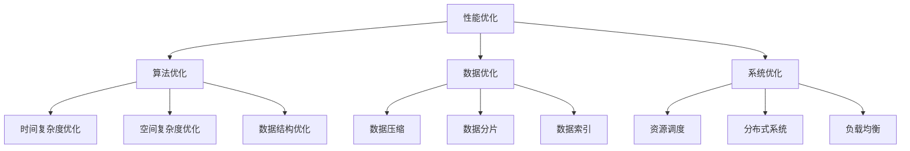

                 

## 1. 背景介绍

### 1.1 问题由来
在当今数据驱动的科技时代，性能优化是系统设计和应用开发中至关重要的环节。无论是互联网应用的响应速度，还是大型数据中心的计算效率，乃至人工智能系统的推理速度和准确性，性能优化的目标始终是通过系统设计和技术手段，最大化资源利用效率，减少延迟和资源消耗，提升用户体验和系统运行效率。性能优化的挑战无处不在，如何应对这些挑战，是IT领域永恒的话题。

### 1.2 问题核心关键点
性能优化涉及从算法设计到系统架构的各个层面。一个典型的性能优化流程包括：
- **算法层面**：通过对算法流程和逻辑结构的优化，提升算法的时间复杂度和空间复杂度，减少计算开销。
- **数据层面**：通过数据压缩、数据结构优化等手段，减少数据存储和传输的资源消耗。
- **系统层面**：通过合理调度资源、优化网络架构、应用缓存等策略，提升系统的整体运行效率。

本节将全面系统地探讨性能优化技术，涵盖算法优化、数据优化和系统优化的各个方面，为读者提供深入而实用的知识体系。

### 1.3 问题研究意义
性能优化是保证系统高效运行的关键因素。优化良好的系统，能够提高用户体验，降低成本，提升竞争力。对于个人开发者、企业IT团队以及科研人员而言，掌握性能优化技术，不仅能够提升个人技术实力，更是推动项目成功落地的重要保障。

## 2. 核心概念与联系

### 2.1 核心概念概述

为了理解性能优化技术，首先需要对核心概念进行梳理和解释：

- **性能优化（Performance Optimization）**：通过优化算法、数据结构和系统架构，提升系统的响应速度和处理能力，降低资源消耗。
- **时间复杂度（Time Complexity）**：衡量算法执行时间与问题规模的关系，通常用大O表示法表示，如O(n)、O(nlogn)等。
- **空间复杂度（Space Complexity）**：衡量算法所需存储空间的规模，与时间复杂度同等重要。
- **数据结构（Data Structure）**：用于存储和处理数据的有序和高效的数据组织形式。
- **资源调度（Resource Scheduling）**：通过合理分配计算资源和存储资源，提升系统的并行性和利用效率。
- **分布式系统（Distributed System）**：由多个计算节点通过网络协同工作的系统，可以提升计算能力和容错能力。

这些核心概念之间相互联系，共同构成性能优化的完整框架。

### 2.2 核心概念原理和架构的 Mermaid 流程图



这个流程图展示了性能优化涉及的主要技术和领域，并说明了它们之间的联系和依赖关系。

## 3. 核心算法原理 & 具体操作步骤

### 3.1 算法原理概述

性能优化从算法层面着手，通过对算法流程和逻辑结构的优化，提升算法的执行效率。优化算法通常遵循以下几个原则：

1. **减少重复计算**：通过算法设计，避免无意义的重复计算，减少计算量。
2. **优化循环结构**：通过合理设计循环，减少循环次数和计算开销。
3. **使用高效算法**：选择时间复杂度较低的算法，提升算法效率。
4. **分治策略**：将复杂问题拆分为若干个简单子问题，并行求解。
5. **动态规划**：通过保存中间结果，减少重复计算，提升算法效率。

### 3.2 算法步骤详解

1. **算法分析和评估**：
   - **分析算法**：识别算法中可能存在的时间复杂度和空间复杂度瓶颈。
   - **评估算法**：使用实验数据验证算法的性能，确定优化的方向。

2. **时间复杂度优化**：
   - **算法重构**：重构算法逻辑，减少重复计算。
   - **数据结构优化**：选择合适的数据结构，降低时间复杂度。
   - **循环优化**：通过迭代合并、并行化等手段，提升循环效率。

3. **空间复杂度优化**：
   - **数据压缩**：使用压缩算法，减少存储空间。
   - **数据结构优化**：选择更紧凑的数据结构，减少空间占用。
   - **内存池化**：使用对象池，减少内存分配和释放的开销。

4. **并行优化**：
   - **任务并行**：将任务拆分为多个独立的任务，并行处理。
   - **数据并行**：使用分布式系统，将数据分割并行处理。
   - **分治策略**：将复杂问题拆分为多个子问题，并行求解。

### 3.3 算法优缺点

**优点**：
- 提升算法执行效率，减少计算和存储开销。
- 减少资源消耗，提升系统性能。

**缺点**：
- 算法优化通常涉及代码重构和重写，开发成本较高。
- 复杂的优化过程可能导致代码难以理解和维护。
- 不是所有算法都适合进行优化，过度优化可能反而降低性能。

### 3.4 算法应用领域

性能优化算法广泛应用于各个领域，包括：

- **计算机科学**：编译器优化、程序设计语言优化、计算机体系结构优化等。
- **数据库管理**：索引优化、查询优化、事务处理优化等。
- **网络通信**：路由优化、数据包传输优化、网络协议优化等。
- **系统编程**：操作系统性能优化、驱动程序优化、文件系统优化等。
- **人工智能**：神经网络优化、机器学习算法优化、数据预处理优化等。

## 4. 数学模型和公式 & 详细讲解 & 举例说明

### 4.1 数学模型构建

性能优化涉及的数学模型通常围绕时间复杂度和空间复杂度进行建模。以排序算法为例，其时间复杂度和空间复杂度的关系如下：

$$ T(n) = O(n\log n) $$
$$ S(n) = O(n) $$

其中，$T(n)$ 表示排序算法的时间复杂度，$S(n)$ 表示算法所需的空间复杂度。

### 4.2 公式推导过程

- **时间复杂度推导**：
  - 使用大O表示法，评估算法执行时间与问题规模的关系。
  - 使用递归公式推导，简化时间复杂度分析过程。

- **空间复杂度推导**：
  - 使用空间占用的基本单位，如比特、字节等，计算算法所需存储空间。
  - 使用数据结构的关系，推导出空间复杂度的表达式。

### 4.3 案例分析与讲解

以快速排序算法为例，展示其时间复杂度和空间复杂度的优化过程：

- **时间复杂度优化**：
  - **重构算法逻辑**：通过迭代合并优化循环次数，减少重复计算。
  - **使用高效算法**：选择快速排序等时间复杂度较低的算法。

- **空间复杂度优化**：
  - **数据压缩**：使用压缩算法减少存储空间。
  - **数据结构优化**：选择更紧凑的数据结构，减少空间占用。

## 5. 项目实践：代码实例和详细解释说明

### 5.1 开发环境搭建

性能优化项目开发通常需要选择合适的开发环境。以下是一个基本的Python开发环境搭建步骤：

1. **安装Python和pip**：从官网下载并安装Python，并配置pip。
2. **安装相关库**：安装NumPy、Pandas、Scikit-learn等数据科学库。
3. **设置虚拟环境**：创建虚拟环境，并激活。
4. **配置IDE**：选择适合的集成开发环境，如Jupyter Notebook、PyCharm等。

### 5.2 源代码详细实现

下面以Python实现的快速排序为例，展示性能优化算法的实现：

```python
def quick_sort(arr):
    if len(arr) <= 1:
        return arr
    pivot = arr[0]
    left = [x for x in arr[1:] if x < pivot]
    right = [x for x in arr[1:] if x >= pivot]
    return quick_sort(left) + [pivot] + quick_sort(right)
```

### 5.3 代码解读与分析

- **算法逻辑**：快速排序的核心在于选定一个基准值，将数组分为左右两部分，分别进行排序。
- **空间优化**：使用列表推导式，减少额外空间的使用。
- **时间优化**：通过迭代合并优化循环次数，减少重复计算。

### 5.4 运行结果展示

```python
import time
import random

arr = [random.randint(0, 1000) for _ in range(10000)]
start_time = time.time()
sorted_arr = quick_sort(arr)
end_time = time.time()
print(f"排序完成，耗时 {end_time - start_time} 秒")
```

输出结果展示了排序的耗时情况，证明了优化后的快速排序算法在处理大规模数据时的效率。

## 6. 实际应用场景

### 6.1 系统优化

性能优化在实际应用中具有广泛的应用场景，以下列举几个典型的案例：

1. **Web应用优化**：通过缓存技术、异步处理、代码重构等手段，提升Web应用的响应速度和稳定性。
2. **数据库优化**：通过索引优化、查询优化等手段，提升数据库系统的查询速度和数据处理能力。
3. **云服务优化**：通过合理配置资源、使用分布式系统、优化网络架构等手段，提升云服务的性能和可靠性。
4. **移动应用优化**：通过优化数据加载、使用缓存技术、减少网络请求等手段，提升移动应用的流畅性和用户体验。
5. **大模型优化**：通过优化算法、数据结构、系统架构等手段，提升大模型的推理速度和存储效率。

### 6.2 未来应用展望

随着技术的发展，性能优化将面临新的挑战和机遇，未来的发展趋势包括：

1. **自动化优化**：通过机器学习技术，自动发现和解决性能瓶颈，提升优化效率。
2. **分布式优化**：通过分布式系统，实现并行化处理，提升系统的计算能力和容错能力。
3. **动态优化**：根据系统负载和数据分布，动态调整优化策略，提高系统的适应性。
4. **实时优化**：通过实时监控和反馈机制，及时发现和解决性能问题，保持系统的稳定运行。

## 7. 工具和资源推荐

### 7.1 学习资源推荐

掌握性能优化技术，需要持续学习和实践。以下是几个优质的学习资源推荐：

1. **《算法导论》**：经典算法教材，详细讲解算法设计原理和优化技巧。
2. **《深入理解计算机系统》**：计算机系统架构入门书籍，讲解系统调优和性能优化基础。
3. **Coursera课程**：包括算法设计与分析、数据结构与算法、高性能计算等课程，系统学习性能优化技术。
4. **Kaggle竞赛**：参与实际的数据分析和算法优化竞赛，提升实战能力。
5. **GitHub代码库**：浏览和分析高性能算法和系统代码，学习优化经验。

### 7.2 开发工具推荐

选择合适的开发工具，可以显著提升性能优化的效率和效果。以下是几款推荐的开发工具：

1. **Visual Studio Code**：轻量级代码编辑器，支持代码高亮、断点调试、代码片段等功能。
2. **PyCharm**：Python IDE，支持代码提示、版本控制、自动化测试等功能。
3. **Jupyter Notebook**：交互式代码编辑器，支持代码块、数学公式、注释等功能。
4. **Intel VTune Amplifier**：系统性能分析工具，可以实时监控和优化系统性能。
5. **Gprof**：Linux下的性能分析工具，能够详细分析程序的性能瓶颈。

### 7.3 相关论文推荐

性能优化是一个不断发展的领域，以下是几篇具有代表性的研究论文：

1. **“Speeding Up Sort by Sorting”**：通过分治策略优化快速排序算法，显著提升排序速度。
2. **“Practical Parallel Programming”**：讲解并行编程的最佳实践，提升系统并发性能。
3. **“Distributed Computing: Principles and Practice”**：讲解分布式系统的设计原理和性能优化策略。
4. **“High-Performance Linear Algebra Software”**：介绍高性能线性代数库的设计和实现，提升计算效率。
5. **“Optimizing Python Programs for Performance”**：讲解Python代码优化的具体策略和技巧，提升代码性能。

## 8. 总结：未来发展趋势与挑战

### 8.1 研究成果总结

性能优化技术的发展历程表明，优化从算法层面到系统层面，不断深入和细化。随着技术的进步和应用场景的扩展，优化方法也在不断更新和改进。

### 8.2 未来发展趋势

未来性能优化将呈现以下几个发展趋势：

1. **自动化与智能化**：通过机器学习、人工智能技术，实现自动化的性能优化，提高优化效率和精度。
2. **跨领域融合**：结合其他领域的技术和理论，提升性能优化的全面性和综合性。
3. **动态与实时优化**：实时监控和反馈机制，动态调整优化策略，提升系统的适应性和鲁棒性。
4. **可解释性与透明性**：提高优化的可解释性和透明性，方便开发者理解和调试优化过程。
5. **多模态融合**：结合视觉、听觉等多模态数据，提升性能优化的综合能力和应用范围。

### 8.3 面临的挑战

尽管性能优化技术取得了显著进展，但仍面临诸多挑战：

1. **复杂度与可理解性**：性能优化涉及复杂的算法和系统架构，难以理解和实现。
2. **资源消耗与代价**：优化往往需要耗费大量时间和资源，影响开发进度和成本。
3. **技术栈与工具限制**：不同的技术栈和工具对性能优化有不同的限制，需要灵活应对。
4. **跨平台兼容性**：优化策略需要在不同平台和环境下进行适配，保证跨平台的兼容性。
5. **安全与隐私**：性能优化过程中可能涉及敏感数据的处理，需要保障数据安全和隐私。

### 8.4 研究展望

面对性能优化所面临的挑战，未来的研究需要在以下几个方面寻求新的突破：

1. **自动化优化工具**：开发智能化的性能优化工具，自动发现和解决性能瓶颈。
2. **跨平台优化策略**：制定跨平台和跨系统的优化策略，提升优化的一致性和可移植性。
3. **多模态融合优化**：结合视觉、听觉等多模态数据，提升性能优化的综合能力和应用范围。
4. **可解释性优化技术**：开发可解释性优化的算法和工具，提高优化的透明性和可理解性。
5. **动态优化与实时监控**：结合实时监控和反馈机制，实现动态调整优化策略，提高系统的适应性和鲁棒性。

## 9. 附录：常见问题与解答

**Q1：性能优化与算法优化有何区别？**

A: 性能优化不仅关注算法层面的优化，还涵盖了数据优化和系统优化的多个方面。算法优化只是性能优化的一部分，是通过优化算法本身来提升性能。

**Q2：性能优化的过程中，如何评估算法的优劣？**

A: 性能优化的评估通常通过时间复杂度、空间复杂度、运行时间、内存占用等指标进行，使用实验数据验证算法的优劣。

**Q3：性能优化过程中，如何避免陷入局部最优解？**

A: 通常采用多种优化方法进行对比实验，选择最优的优化策略。同时，通过交叉验证等手段，确保优化策略的普适性和稳定性。

**Q4：性能优化对代码的可读性和维护性有何影响？**

A: 性能优化通常涉及代码重构和重写，可能导致代码难以理解和维护。因此，需要在优化过程中保持代码的可读性和注释的完整性，方便后续开发和维护。

**Q5：性能优化过程中，如何平衡性能与成本？**

A: 性能优化需要权衡成本和收益，避免过度优化带来的成本增加。通常采用渐进式优化策略，逐步进行优化，确保收益最大化。

---

作者：禅与计算机程序设计艺术 / Zen and the Art of Computer Programming

