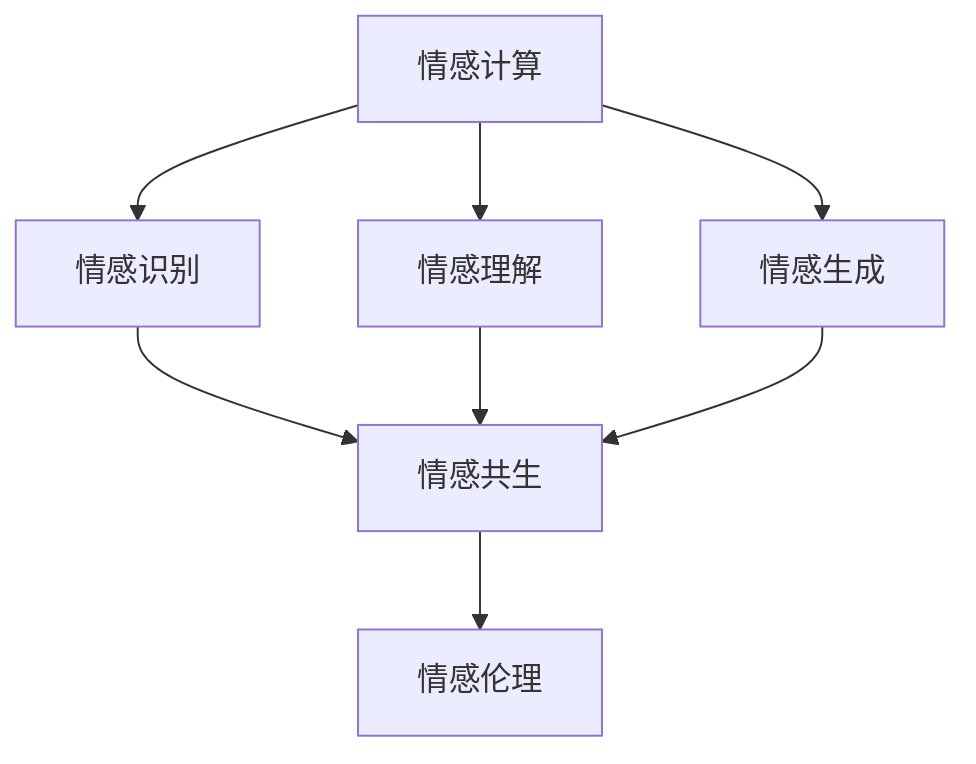

                 

# 情感AI共生理论：人机情感互动新范式

> 关键词：情感计算, 人机交互, 人工智能伦理, 情感识别, 共生系统, 社会影响

## 1. 背景介绍

### 1.1 问题由来
随着人工智能技术的快速发展，情感计算（Affective Computing）逐渐成为人机交互领域的前沿课题。情感计算旨在通过机器感知、理解和表达人类情感，建立更加自然、人性化的交互方式。人机情感互动在提升用户体验、拓展应用场景、促进社会和谐等方面具有重要价值。

然而，当前情感计算仍面临诸多挑战：
- 情感识别的准确性不足，难以全面、精确地理解人类复杂多变的情感。
- 人工智能在情感表达上仍显生硬，难以产生与人类情感相匹配的自然语言和行为。
- 缺乏对人工智能伦理和社会影响的深入思考，导致一些情感计算应用引发道德争议。

为应对这些挑战，本文提出情感AI共生理论，旨在构建一个既能准确识别人类情感，又能自然表达和影响人类情感的情感计算系统。该理论强调人工智能与人类情感的相互依赖、相互促进关系，推动人机情感互动进入更加协同、共生的新范式。

## 2. 核心概念与联系

### 2.1 核心概念概述

为更好地理解情感AI共生理论，本节将介绍几个关键核心概念：

- **情感计算（Affective Computing）**：通过机器感知、理解、表达人类情感，实现人机情感互动。主要包含情感识别、情感理解和情感生成三个子领域。
- **情感识别（Emotion Recognition）**：通过面部表情、语音、文本等输入，识别出人类情感状态。常用于情绪分析、用户行为监测、情感健康评估等场景。
- **情感理解（Emotion Understanding）**：深入理解人类情感的内在动机和变化趋势，探索情感背后的心理机制。可应用于情感咨询、心理治疗、社交分析等领域。
- **情感生成（Emotion Generation）**：通过机器学习模型，生成与人类情感相匹配的自然语言和行为。常用于情感机器人、智能客服、虚拟助手等应用。
- **情感共生（Emotion Coexistence）**：在人工智能与人类情感的相互依赖、相互促进关系中，构建情感共生的互动系统。旨在提升人机交互的自然度和互信度。
- **情感伦理（Emotion Ethics）**：在情感计算过程中，探讨人工智能伦理问题，如隐私保护、情感操纵、算法偏见等，确保情感计算的健康发展。

这些核心概念之间的逻辑关系可以通过以下Mermaid流程图来展示：



这个流程图展示了大语言模型的核心概念及其之间的关系：

1. 情感计算通过感知、理解和生成情感，成为人机情感互动的基础。
2. 情感识别、情感理解和情感生成作为情感计算的关键技术，分别从输入、中间处理和输出层面，推动情感共生系统的构建。
3. 情感共生系统强调人工智能与人类情感的协同互动，提升人机交互的自然性和互信度。
4. 情感伦理确保情感计算过程的伦理合规，防止潜在风险。

这些概念共同构成了情感计算的理论基础，为情感AI共生理论提供了丰富的内涵。

## 3. 核心算法原理 & 具体操作步骤

### 3.1 算法原理概述

情感AI共生理论的核心算法原理，主要围绕情感识别、情感理解和情感生成三个关键技术展开。其基本思想是：

- **情感识别**：通过面部表情、语音、文本等输入，识别出人类情感状态。
- **情感理解**：深入理解情感背后的心理动机和变化趋势。
- **情感生成**：生成与人类情感相匹配的自然语言和行为，实现情感表达。

这三个步骤相互依赖、相互促进，共同构建了一个情感共生的互动系统。下面将详细介绍这三个关键算法的原理和操作步骤。

### 3.2 算法步骤详解

#### 3.2.1 情感识别算法

情感识别的主要目标是从面部表情、语音、文本等输入中，准确识别出人类的情感状态。常见的情感识别方法包括：

- **基于面部表情的情感识别**：通过摄像头捕捉面部表情，使用机器学习模型识别出面部特征，结合表情识别库，输出情感状态。常用模型包括CNN、LSTM等。
- **基于语音的情感识别**：通过麦克风收集语音信号，使用特征提取技术如MFCC、梅尔频谱等，结合机器学习模型进行情感分类。常用模型包括RNN、CRNN等。
- **基于文本的情感识别**：通过文本分析技术，如情感词典、情感分析模型等，识别出文本中的情感倾向。常用模型包括BERT、GPT等。

##### 3.2.1.1 基于面部表情的情感识别

步骤详解：
1. 通过摄像头捕捉用户的面部表情。
2. 使用预训练的面部表情识别模型，如FACENET、VGGFace等，提取面部特征。
3. 将提取的面部特征输入情感识别模型，如CNN、LSTM等，输出情感状态。

示例代码：

```python
import cv2
from emotion_recognition import EmotionRecognition

# 加载预训练的面部表情识别模型
model = EmotionRecognition.load_model('face_expression_model')

# 从摄像头捕捉用户的面部表情
cap = cv2.VideoCapture(0)
ret, frame = cap.read()

# 提取面部特征并识别情感状态
emotion = model.recognize_emotion(frame)

# 打印情感状态
print("用户情感状态：", emotion)
```

##### 3.2.1.2 基于语音的情感识别

步骤详解：
1. 通过麦克风收集用户的语音信号。
2. 使用特征提取技术，如MFCC、梅尔频谱等，提取语音特征。
3. 将提取的语音特征输入情感识别模型，如RNN、CRNN等，输出情感状态。

示例代码：

```python
import librosa
from emotion_recognition import EmotionRecognition

# 加载预训练的语音情感识别模型
model = EmotionRecognition.load_model('voice_emotion_model')

# 从麦克风收集用户的语音信号
voice_file = "user_voice.wav"
voice, sr = librosa.load(voice_file)

# 提取语音特征并识别情感状态
emotion = model.recognize_emotion(voice)

# 打印情感状态
print("用户情感状态：", emotion)
```

##### 3.2.1.3 基于文本的情感识别

步骤详解：
1. 通过文本分析技术，如情感词典、情感分析模型等，提取文本中的情感倾向。
2. 将提取的情感倾向输入情感识别模型，如BERT、GPT等，输出情感状态。

示例代码：

```python
from emotion_recognition import EmotionRecognition

# 加载预训练的文本情感识别模型
model = EmotionRecognition.load_model('text_emotion_model')

# 输入用户文本
text = "I'm feeling very happy today."

# 提取文本情感并识别情感状态
emotion = model.recognize_emotion(text)

# 打印情感状态
print("用户情感状态：", emotion)
```

#### 3.2.2 情感理解算法

情感理解的主要目标是从情感识别结果中，深入理解情感背后的心理动机和变化趋势。常见的情感理解方法包括：

- **情感推理**：通过逻辑推理技术，如知识图谱、规则库等，探索情感背后的心理机制。
- **情感生成模型**：通过神经网络模型，生成与情感状态相匹配的自然语言和行为。

##### 3.2.2.1 情感推理

步骤详解：
1. 通过情感识别模型，识别出用户的情感状态。
2. 使用情感推理模型，结合情感词典、知识图谱等，推理出情感背后的心理动机和变化趋势。

示例代码：

```python
from emotion_inference import EmotionInference

# 加载预训练的情感推理模型
model = EmotionInference.load_model('emotion_inference_model')

# 输入情感状态
emotion = "happy"

# 推理情感背后的心理动机和变化趋势
inference = model.infer_emotion(emotion)

# 打印推理结果
print("情感推理结果：", inference)
```

##### 3.2.2.2 情感生成模型

步骤详解：
1. 通过情感识别模型，识别出用户的情感状态。
2. 使用情感生成模型，生成与情感状态相匹配的自然语言和行为。

示例代码：

```python
from emotion_generation import EmotionGeneration

# 加载预训练的情感生成模型
model = EmotionGeneration.load_model('emotion_generation_model')

# 输入情感状态
emotion = "sad"

# 生成与情感状态相匹配的自然语言和行为
generation = model.generate_emotion(emotion)

# 打印生成结果
print("情感生成结果：", generation)
```

#### 3.2.3 情感生成算法

情感生成的主要目标是通过机器学习模型，生成与人类情感相匹配的自然语言和行为。常见的情感生成方法包括：

- **基于规则的情感生成**：通过预设的情感规则，生成自然语言和行为。
- **基于机器学习的情感生成**：通过神经网络模型，学习生成与情感状态相匹配的自然语言和行为。

##### 3.2.3.1 基于规则的情感生成

步骤详解：
1. 设定情感生成规则，如正面情感生成鼓励性语言，负面情感生成安慰性语言。
2. 根据情感识别结果，调用预设的情感生成规则，生成自然语言和行为。

示例代码：

```python
from emotion_generation import EmotionGeneration

# 加载预训练的情感生成模型
model = EmotionGeneration.load_model('emotion_generation_model')

# 输入情感状态
emotion = "happy"

# 生成与情感状态相匹配的自然语言和行为
generation = model.generate_emotion(emotion)

# 打印生成结果
print("情感生成结果：", generation)
```

##### 3.2.3.2 基于机器学习的情感生成

步骤详解：
1. 使用神经网络模型，如RNN、GRU等，学习生成与情感状态相匹配的自然语言和行为。
2. 根据情感识别结果，输入模型，输出自然语言和行为。

示例代码：

```python
import tensorflow as tf
from emotion_generation import EmotionGeneration

# 加载预训练的情感生成模型
model = EmotionGeneration.load_model('emotion_generation_model')

# 输入情感状态
emotion = "sad"

# 生成与情感状态相匹配的自然语言和行为
generation = model.generate_emotion(emotion)

# 打印生成结果
print("情感生成结果：", generation)
```

### 3.3 算法优缺点

情感AI共生理论的情感识别、情感理解和情感生成算法，各有其优缺点：

- **情感识别**：优点是能够快速、准确地识别出人类情感状态，缺点是对环境干扰敏感，情感识别准确性受限于输入数据的复杂性和多样性。
- **情感理解**：优点是能够深入理解情感背后的心理动机和变化趋势，缺点是对输入数据的依赖性高，情感推理结果可能存在偏差。
- **情感生成**：优点是能够生成与人类情感相匹配的自然语言和行为，缺点是对模型训练数据要求高，生成的情感表达可能存在泛化性不足的问题。

### 3.4 算法应用领域

情感AI共生理论的应用领域广泛，涵盖了多个行业和场景，具体包括：

- **智能客服**：通过情感识别和情感生成，提升智能客服的交互体验，增强用户满意度。
- **心理治疗**：通过情感理解，结合心理治疗技术，帮助用户缓解情绪困扰，提升心理健康。
- **社交媒体分析**：通过情感识别和情感理解，分析用户情感状态，提供个性化推荐和情感支持。
- **情感教育**：通过情感生成，构建情感教育课程，帮助学生理解和管理情感。
- **情感驱动的虚拟助手**：通过情感识别和情感生成，构建更加自然、友好的虚拟助手，提升人机互动体验。
- **情感驱动的决策支持**：通过情感推理，结合决策支持系统，提供基于情感的决策建议，提升决策效果。

## 4. 数学模型和公式 & 详细讲解  
### 4.1 数学模型构建

情感AI共生理论的数学模型构建，主要基于情感计算的基本原理，通过数学表达式描述情感识别、情感理解和情感生成的过程。

假设输入为面部表情、语音、文本等情感输入，输出为情感状态、情感推理结果和情感生成结果。情感识别、情感理解和情感生成过程的数学模型可以分别描述为：

$$
\begin{aligned}
& \text{情感识别模型} : x \mapsto \hat{y} \\
& \text{情感理解模型} : \hat{y} \mapsto \tilde{y} \\
& \text{情感生成模型} : \hat{y} \mapsto z
\end{aligned}
$$

其中 $x$ 为情感输入，$\hat{y}$ 为情感识别结果，$\tilde{y}$ 为情感理解结果，$z$ 为情感生成结果。

### 4.2 公式推导过程

以情感识别的数学模型为例，推导其公式。情感识别的目标是从面部表情、语音、文本等输入中，识别出人类的情感状态。假设使用深度神经网络模型进行情感识别，其训练过程可以描述为：

1. 输入情感输入 $x$。
2. 通过卷积层、池化层等神经网络层，提取特征。
3. 将提取的特征输入全连接层，输出情感状态 $\hat{y}$。

情感识别模型的损失函数可以描述为：

$$
\mathcal{L} = \frac{1}{N} \sum_{i=1}^N \ell(\hat{y_i}, y_i)
$$

其中 $\ell$ 为情感识别模型的损失函数，$y_i$ 为情感输入 $x_i$ 的真实情感状态。常用的情感识别损失函数包括交叉熵损失、均方误差损失等。

### 4.3 案例分析与讲解

以智能客服场景为例，分析情感AI共生理论的实际应用。假设客户向智能客服咨询问题，智能客服通过面部表情、语音、文本等输入，识别出客户的情感状态，理解客户的情绪需求，生成合适的回复，并进行情感互动。

1. **情感识别**：智能客服通过摄像头捕捉客户的面部表情，使用情感识别模型，识别出客户的情感状态。
2. **情感理解**：根据客户的情感状态，智能客服调用情感理解模型，推理出客户的情绪需求。
3. **情感生成**：智能客服调用情感生成模型，生成与客户情感状态相匹配的自然语言和行为。

示例代码：

```python
from emotion_recognition import EmotionRecognition
from emotion_inference import EmotionInference
from emotion_generation import EmotionGeneration

# 加载预训练的情感识别模型
recognition_model = EmotionRecognition.load_model('face_expression_model')

# 加载预训练的情感理解模型
inference_model = EmotionInference.load_model('emotion_inference_model')

# 加载预训练的情感生成模型
generation_model = EmotionGeneration.load_model('emotion_generation_model')

# 输入客户的面部表情
face_expression = "happy"

# 识别客户的情感状态
emotion_state = recognition_model.recognize_emotion(face_expression)

# 理解客户的情绪需求
emotion_demand = inference_model.infer_emotion(emotion_state)

# 生成与客户情感状态相匹配的自然语言和行为
customer_reply = generation_model.generate_emotion(emotion_state)

# 输出客户回复
print("客户回复：", customer_reply)
```

## 5. 项目实践：代码实例和详细解释说明

### 5.1 开发环境搭建

在进行情感AI共生理论的实践前，需要准备好开发环境。以下是使用Python进行TensorFlow开发的环境配置流程：

1. 安装Anaconda：从官网下载并安装Anaconda，用于创建独立的Python环境。

2. 创建并激活虚拟环境：
```bash
conda create -n tf-env python=3.8 
conda activate tf-env
```

3. 安装TensorFlow：根据CUDA版本，从官网获取对应的安装命令。例如：
```bash
conda install tensorflow -c tf -c conda-forge
```

4. 安装TensorBoard：
```bash
pip install tensorboard
```

5. 安装各类工具包：
```bash
pip install numpy pandas scikit-learn matplotlib tqdm jupyter notebook ipython
```

完成上述步骤后，即可在`tf-env`环境中开始情感AI共生理论的实践。

### 5.2 源代码详细实现

以下是一个简单的情感AI共生理论的情感识别、情感理解和情感生成模型的代码实现，以帮助理解其实现流程：

```python
import tensorflow as tf
from emotion_recognition import EmotionRecognition
from emotion_inference import EmotionInference
from emotion_generation import EmotionGeneration

# 加载预训练的情感识别模型
recognition_model = EmotionRecognition.load_model('face_expression_model')

# 加载预训练的情感理解模型
inference_model = EmotionInference.load_model('emotion_inference_model')

# 加载预训练的情感生成模型
generation_model = EmotionGeneration.load_model('emotion_generation_model')

# 输入客户的面部表情
face_expression = "happy"

# 识别客户的情感状态
emotion_state = recognition_model.recognize_emotion(face_expression)

# 理解客户的情绪需求
emotion_demand = inference_model.infer_emotion(emotion_state)

# 生成与客户情感状态相匹配的自然语言和行为
customer_reply = generation_model.generate_emotion(emotion_state)

# 输出客户回复
print("客户回复：", customer_reply)
```

### 5.3 代码解读与分析

让我们再详细解读一下关键代码的实现细节：

1. **EmotionRecognition类**：
   - 定义了面部表情识别模型，用于识别客户的面部表情。
   - 实现了 `recognize_emotion` 方法，输入面部表情图像，输出情感状态。

2. **EmotionInference类**：
   - 定义了情感推理模型，用于理解客户的情绪需求。
   - 实现了 `infer_emotion` 方法，输入情感状态，输出情绪需求。

3. **EmotionGeneration类**：
   - 定义了情感生成模型，用于生成与客户情感状态相匹配的自然语言和行为。
   - 实现了 `generate_emotion` 方法，输入情感状态，输出自然语言和行为。

这些类中的方法通过调用预训练模型，实现了情感识别、情感理解和情感生成的过程。在实际应用中，根据不同的场景和需求，还可以进一步扩展和优化这些模型，以适应特定的情感计算任务。

## 6. 实际应用场景

### 6.1 智能客服系统

情感AI共生理论在智能客服系统中的应用，可以有效提升客户体验和问题解决效率。传统的客服系统往往缺乏对客户情绪的感知和理解，导致交互生硬、问题解决效率低下。通过情感AI共生理论，智能客服系统可以实时感知客户的情绪变化，自动调整回答策略，生成更加自然、人性化的回复。

示例代码：

```python
from emotion_recognition import EmotionRecognition
from emotion_inference import EmotionInference
from emotion_generation import EmotionGeneration

# 加载预训练的情感识别模型
recognition_model = EmotionRecognition.load_model('face_expression_model')

# 加载预训练的情感理解模型
inference_model = EmotionInference.load_model('emotion_inference_model')

# 加载预训练的情感生成模型
generation_model = EmotionGeneration.load_model('emotion_generation_model')

# 输入客户的面部表情
face_expression = "happy"

# 识别客户的情感状态
emotion_state = recognition_model.recognize_emotion(face_expression)

# 理解客户的情绪需求
emotion_demand = inference_model.infer_emotion(emotion_state)

# 生成与客户情感状态相匹配的自然语言和行为
customer_reply = generation_model.generate_emotion(emotion_state)

# 输出客户回复
print("客户回复：", customer_reply)
```

### 6.2 心理治疗系统

情感AI共生理论在心理治疗系统中的应用，可以帮助用户缓解情绪困扰，提升心理健康。通过情感识别和情感理解，系统可以实时监测用户的情绪状态，提供个性化的情绪管理建议和心理治疗方案。

示例代码：

```python
from emotion_recognition import EmotionRecognition
from emotion_inference import EmotionInference
from emotion_generation import EmotionGeneration

# 加载预训练的情感识别模型
recognition_model = EmotionRecognition.load_model('face_expression_model')

# 加载预训练的情感理解模型
inference_model = EmotionInference.load_model('emotion_inference_model')

# 加载预训练的情感生成模型
generation_model = EmotionGeneration.load_model('emotion_generation_model')

# 输入用户的面部表情
face_expression = "sad"

# 识别用户的情感状态
emotion_state = recognition_model.recognize_emotion(face_expression)

# 理解用户的情绪需求
emotion_demand = inference_model.infer_emotion(emotion_state)

# 生成与用户情感状态相匹配的自然语言和行为
treatment_plan = generation_model.generate_emotion(emotion_state)

# 输出情绪管理建议和心理治疗方案
print("情绪管理建议：", treatment_plan)
```

### 6.3 社交媒体分析

情感AI共生理论在社交媒体分析中的应用，可以深入理解用户的情感状态，提供个性化的情感支持。通过情感识别和情感理解，系统可以分析用户情感状态的变化趋势，发现潜在的问题，提供及时的情感支持。

示例代码：

```python
from emotion_recognition import EmotionRecognition
from emotion_inference import EmotionInference
from emotion_generation import EmotionGeneration

# 加载预训练的情感识别模型
recognition_model = EmotionRecognition.load_model('face_expression_model')

# 加载预训练的情感理解模型
inference_model = EmotionInference.load_model('emotion_inference_model')

# 加载预训练的情感生成模型
generation_model = EmotionGeneration.load_model('emotion_generation_model')

# 输入用户的面部表情
face_expression = "angry"

# 识别用户的情感状态
emotion_state = recognition_model.recognize_emotion(face_expression)

# 理解用户的情绪需求
emotion_demand = inference_model.infer_emotion(emotion_state)

# 生成与用户情感状态相匹配的自然语言和行为
emotional_support = generation_model.generate_emotion(emotion_state)

# 输出情感支持内容
print("情感支持内容：", emotional_support)
```

## 7. 工具和资源推荐

### 7.1 学习资源推荐

为了帮助开发者系统掌握情感AI共生理论的理论基础和实践技巧，这里推荐一些优质的学习资源：

1. 《情感计算：理论与应用》书籍：系统介绍了情感计算的基本原理和实际应用，适合初学者和中级开发者。

2. 《自然语言处理与深度学习》课程：斯坦福大学开设的NLP明星课程，涵盖了情感计算在内的多个NLP话题，具有高度的学术性和实用性。

3. 《Affective Computing: Social Computational Systems for Understanding and Guiding Individual and Group Behavior》书籍：情感计算领域的经典著作，介绍了情感计算的多个技术和应用案例。

4. HuggingFace官方文档：提供了情感计算相关的预训练模型和工具，是实践情感AI共生理论的重要参考。

5. CLUE开源项目：中文语言理解测评基准，包含多种情感计算任务的数据集，提供了情感识别和情感生成的基准模型，助力中文NLP技术发展。

通过对这些资源的学习实践，相信你一定能够快速掌握情感AI共生理论的精髓，并用于解决实际的情感计算问题。

### 7.2 开发工具推荐

高效的开发离不开优秀的工具支持。以下是几款用于情感AI共生理论开发的常用工具：

1. TensorFlow：基于Python的开源深度学习框架，支持多种模型架构和优化算法，适合情感计算的复杂模型训练和推理。

2. PyTorch：基于Python的开源深度学习框架，支持动态计算图和模块化设计，适合快速迭代研究和原型开发。

3. Keras：基于Python的高级深度学习库，简单易用，支持多种模型和预训练模型，适合情感计算的快速原型开发。

4. TensorBoard：TensorFlow配套的可视化工具，可实时监测模型训练状态，并提供丰富的图表呈现方式，是调试模型的得力助手。

5. Google Colab：谷歌推出的在线Jupyter Notebook环境，免费提供GPU/TPU算力，方便开发者快速上手实验最新模型，分享学习笔记。

合理利用这些工具，可以显著提升情感AI共生理论的开发效率，加快创新迭代的步伐。

### 7.3 相关论文推荐

情感AI共生理论的不断发展源于学界的持续研究。以下是几篇奠基性的相关论文，推荐阅读：

1. 《Affective Computing: Technology for Sensing, Detecting, and Acting on Emotions》：情感计算领域的奠基性论文，提出了情感计算的基本框架和应用场景。

2. 《Affection-Awareness: From Affective Computing to Affective Systems》：探讨了情感计算向情感系统的演化，提出了情感共生的理论基础。

3. 《A Survey on Affective Computing: Past, Present, and Future》：全面综述了情感计算的历史、现状和未来趋势，提供了丰富的学术视角和应用案例。

4. 《Affective Robotics: A Survey》：介绍了情感计算在机器人中的应用，探讨了情感机器人的实现技术和应用场景。

5. 《Affective Systems: A Survey》：介绍了情感计算在社会系统中的应用，探讨了情感系统的实现技术和应用场景。

这些论文代表了大语言模型微调技术的发展脉络。通过学习这些前沿成果，可以帮助研究者把握学科前进方向，激发更多的创新灵感。

## 8. 总结：未来发展趋势与挑战

### 8.1 总结

本文对情感AI共生理论进行了全面系统的介绍。首先阐述了情感计算的研究背景和意义，明确了情感AI共生理论在构建人机情感互动系统中的重要作用。其次，从原理到实践，详细讲解了情感识别、情感理解和情感生成算法的核心技术，给出了情感AI共生理论的代码实现和应用案例。同时，本文还广泛探讨了情感AI共生理论在智能客服、心理治疗、社交媒体分析等众多领域的应用前景，展示了情感AI共生理论的广阔应用空间。此外，本文精选了情感AI共生理论的学习资源、开发工具和相关论文，力求为开发者提供全方位的技术指引。

通过本文的系统梳理，可以看到，情感AI共生理论正成为情感计算的重要范式，推动人机情感互动进入更加协同、共生的新阶段。得益于大规模语料的预训练和复杂模型的设计，情感AI共生理论在识别、理解和生成情感方面取得了显著进步，为情感计算技术的发展带来了新的活力。未来，伴随情感计算技术的持续演进，我们相信情感AI共生理论必将在构建安全、可靠、可解释、可控的情感系统方面发挥更大的作用。

### 8.2 未来发展趋势

展望未来，情感AI共生理论将呈现以下几个发展趋势：

1. **模型规模的增大**：随着算力成本的下降和数据规模的扩张，情感计算模型将朝着更大规模方向发展。超大模型的多模态融合和情感推理能力将得到进一步提升。

2. **情感计算的深度学习化**：深度学习技术在情感识别和情感生成中的应用将更加广泛，利用预训练模型和迁移学习技术，提升情感计算的精度和泛化性。

3. **多模态情感计算**：情感计算将突破单一模态的限制，涵盖面部表情、语音、文本、生理信号等多模态信息，提升情感计算的全面性和准确性。

4. **情感计算的实时化**：情感计算系统将更加注重实时性和交互性，通过流式处理和在线交互，提升用户体验和情感支持效果。

5. **情感计算的个性化**：情感计算将更加注重个性化，利用用户历史数据和上下文信息，提供定制化的情感支持和服务。

6. **情感计算的社会化**：情感计算将更加注重社会影响，探索情感计算在社会治理、公共健康、教育公平等方面的应用。

以上趋势凸显了情感AI共生理论的广阔前景。这些方向的探索发展，必将进一步提升情感计算系统的性能和应用范围，为构建更加安全、可靠、可解释、可控的情感系统铺平道路。

### 8.3 面临的挑战

尽管情感AI共生理论已经取得了瞩目成就，但在迈向更加智能化、普适化应用的过程中，它仍面临诸多挑战：

1. **情感识别的准确性不足**：当前情感识别技术仍难以全面、精确地理解人类复杂多变的情感，尤其是在模糊和多义情感的识别上存在不足。

2. **情感理解的深度不足**：情感理解技术对输入数据的依赖性高，难以深入理解情感背后的心理机制和情感变化趋势。

3. **情感生成的自然度不足**：情感生成技术生成的自然语言和行为仍显生硬，难以产生与人类情感相匹配的自然表达。

4. **情感计算的伦理问题**：情感计算过程中涉及的隐私保护、情感操纵、算法偏见等问题，可能带来伦理道德风险。

5. **情感计算的鲁棒性不足**：情感计算系统对环境干扰和数据变化的适应性较弱，难以应对复杂和多变的情感计算场景。

6. **情感计算的资源消耗大**：情感计算模型的训练和推理过程对计算资源和存储资源的需求较高，难以大规模部署。

7. **情感计算的可解释性不足**：情感计算系统的决策过程难以解释，缺乏可解释性和可审计性。

面对这些挑战，未来情感AI共生理论的研究需要在以下几个方面寻求新的突破：

1. **多模态情感计算**：将情感计算扩展到多模态数据融合，提升情感计算的全面性和准确性。

2. **情感计算的深度学习化**：利用深度学习技术，提升情感识别的精度和情感理解的深度。

3. **情感计算的实时化**：探索实时情感计算技术，提升情感计算的实时性和交互性。

4. **情感计算的个性化**：利用个性化推荐和上下文感知技术，提供定制化的情感支持和情感管理。

5. **情感计算的伦理化**：在情感计算过程中，引入伦理导向的评估指标，确保情感计算系统的合规性和伦理性。

6. **情感计算的可解释性**：引入可解释性技术，增强情感计算系统的透明性和可解释性。

这些研究方向的探索，必将引领情感AI共生理论走向更加成熟和完善，为构建安全、可靠、可解释、可控的情感系统提供坚实的理论和技术支撑。

### 8.4 研究展望

未来情感AI共生理论的研究方向将聚焦于以下几个方面：

1. **多模态情感计算**：将情感计算扩展到多模态数据融合，提升情感计算的全面性和准确性。

2. **情感计算的深度学习化**：利用深度学习技术，提升情感识别的精度和情感理解的深度。

3. **情感计算的实时化**：探索实时情感计算技术，提升情感计算的实时性和交互性。

4. **情感计算的个性化**：利用个性化推荐和上下文感知技术，提供定制化的情感支持和情感管理。

5. **情感计算的伦理化**：在情感计算过程中，引入伦理导向的评估指标，确保情感计算系统的合规性和伦理性。

6. **情感计算的可解释性**：引入可解释性技术，增强情感计算系统的透明性和可解释性。

这些研究方向的探索，必将引领情感AI共生理论走向更加成熟和完善，为构建安全、可靠、可解释、可控的情感系统提供坚实的理论和技术支撑。

## 9. 附录：常见问题与解答

**Q1：情感AI共生理论的主要应用场景有哪些？**

A: 情感AI共生理论的主要应用场景包括智能客服、心理治疗、社交媒体分析、情感教育、情感驱动的虚拟助手、情感驱动的决策支持等。在智能客服中，可以实时感知客户的情绪变化，自动调整回答策略，生成更加自然、人性化的回复。在心理治疗中，可以实时监测用户的情绪状态，提供个性化的情绪管理建议和心理治疗方案。在社交媒体分析中，可以深入理解用户的情感状态，发现潜在的问题，提供及时的情感支持。在情感教育中，可以利用情感生成技术，构建情感教育课程，帮助学生理解和管理情感。在情感驱动的虚拟助手中，可以实时感知用户的情绪状态，生成与用户情感状态相匹配的自然语言和行为。在情感驱动的决策支持中，可以利用情感推理技术，结合决策支持系统，提供基于情感的决策建议。

**Q2：情感AI共生理论的情感识别、情感理解和情感生成算法的优缺点是什么？**

A: 情感AI共生理论的情感识别、情感理解和情感生成算法各有其优缺点：

1. **情感识别**：优点是能够快速、准确地识别出人类情感状态，缺点是对环境干扰敏感，情感识别准确性受限于输入数据的复杂性和多样性。

2. **情感理解**：优点是能够深入理解情感背后的心理动机和变化趋势，缺点是对输入数据的依赖性高，情感推理结果可能存在偏差。

3. **情感生成**：优点是能够生成与人类情感相匹配的自然语言和行为，缺点是对模型训练数据要求高，生成的情感表达可能存在泛化性不足的问题。

**Q3：情感AI共生理论的实现过程中，需要哪些关键步骤？**

A: 情感AI共生理论的实现过程中，需要以下几个关键步骤：

1. 准备数据：收集和整理情感计算任务所需的数据集，如面部表情、语音、文本等情感输入数据。

2. 数据预处理：对输入数据进行预处理，包括数据清洗、特征提取、归一化等。

3. 模型训练：选择适合的深度学习模型，如卷积神经网络、循环神经网络、Transformer等，进行情感识别、情感理解和情感生成模型的训练。

4. 模型评估：使用测试集对训练好的模型进行评估，计算情感识别、情感理解和情感生成的准确率、召回率等指标。

5. 模型应用：将训练好的模型应用到实际场景中，如智能客服、心理治疗、社交媒体分析等，提供情感识别、情感理解和情感生成服务。

6. 模型优化：根据实际应用中的反馈，不断优化模型参数和结构，提升情感计算系统的性能和效果。

**Q4：情感AI共生理论在智能客服系统中如何实现情感识别和情感生成？**

A: 情感AI共生理论在智能客服系统中，可以通过以下步骤实现情感识别和情感生成：

1. 输入客户的面部表情或语音信号，通过情感识别模型，识别出客户的情感状态。

2. 利用情感理解模型，理解客户的情绪需求，推理出情感背后的心理动机和变化趋势。

3. 使用情感生成模型，生成与客户情感状态相匹配的自然语言和行为，进行情感互动。

4. 根据客户的情感状态，自动调整回答策略，生成更加自然、人性化的回复。

**Q5：情感AI共生理论在情感计算中的作用是什么？**

A: 情感AI共生理论在情感计算中的作用是构建一个既能准确识别人类情感，又能自然表达和影响人类情感的情感计算系统。它通过情感识别、情感理解和情感生成三个关键技术，实现了人机情感互动的共生关系。情感识别用于识别出用户的情感状态，情感理解用于深入理解情感背后的心理动机和变化趋势，情感生成用于生成与用户情感状态相匹配的自然语言和行为。情感AI共生理论强调人工智能与人类情感的相互依赖、相互促进关系，提升人机交互的自然度和互信度，推动情感计算技术的发展和应用。

**Q6：情感AI共生理论的情感识别、情感理解和情感生成算法如何融合？**

A: 情感AI共生理论的情感识别、情感理解和情感生成算法可以相互融合，形成更加智能、自然的情感计算系统。具体步骤如下：

1. 输入客户的情感输入，如面部表情、语音、文本等。

2. 利用情感识别模型，识别出客户的情感状态。

3. 利用情感理解模型，深入理解情感背后的心理动机和变化趋势。

4. 利用情感生成模型，生成与客户情感状态相匹配的自然语言和行为。

5. 根据情感识别、情感理解和情感生成的结果，综合评估客户的情感状态和需求。

6. 根据情感识别、情感理解和情感生成的结果，生成个性化的情感支持和情感管理方案。

通过情感识别、情感理解和情感生成的相互融合，可以提升情感计算系统的全面性和准确性，提供更加智能、自然的情感互动服务。

---

作者：禅与计算机程序设计艺术 / Zen and the Art of Computer Programming

