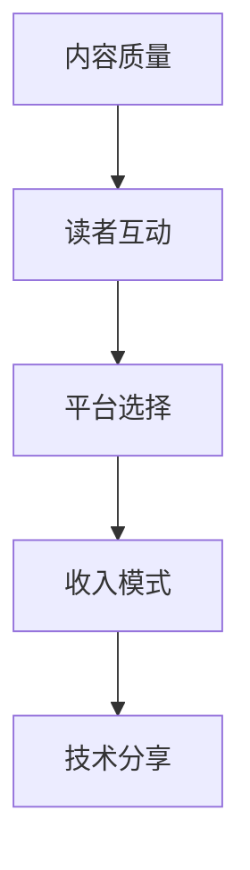

                 

# 打造个人技术博客:知识变现的基础

## 1. 背景介绍

### 1.1 问题由来
在互联网时代，个人品牌和知识变现已成为许多技术爱好者和职业人士追求的梦想。尤其是在技术领域，拥有独特见解和深厚知识的专家，可以通过建立个人技术博客，向读者分享技术知识，提升自己的影响力，最终实现知识变现。但是，如何高效地运营博客，吸引并留住读者，同时将知识转化为实际收入，却是一个不小的挑战。

### 1.2 问题核心关键点
个人技术博客的成功运营涉及多个关键点，包括内容质量、读者互动、平台选择、收入模式等。高质量的内容是吸引读者的基础，而互动和社区建设则能增强读者的粘性。选择合适的平台，如博客、视频、播客等，以及探索多元化的收入途径，如广告、赞助、课程、咨询等，都是实现知识变现的关键。

### 1.3 问题研究意义
研究如何打造和运营个人技术博客，不仅能提升技术传播的效果，还能帮助技术爱好者实现个人价值和职业发展，对于推动技术知识的普及和传播具有重要意义。

## 2. 核心概念与联系

### 2.1 核心概念概述

为更好地理解如何运营个人技术博客，本节将介绍几个关键概念：

- **个人技术博客(Personal Technology Blog)**：个人创建的专注于技术主题的博客，旨在分享技术见解、项目经验、行业趋势等内容，吸引技术爱好者和从业者关注。

- **内容质量(Content Quality)**：博客的核心价值，高质量的内容能吸引读者并提升博客的权威性。

- **读者互动(Reader Interaction)**：与读者进行积极互动，如评论回复、问答、社区建设等，能增强读者的粘性，提升博客的活跃度。

- **平台选择(Platform Selection)**：选择合适的博客平台，如WordPress、GitHub Pages、Medium等，取决于博客的定位、目标读者和功能需求。

- **收入模式(Income Model)**：通过广告、赞助、课程、咨询等多元化的方式，将博客的流量和影响力转化为实际收入。

- **技术分享(Technology Sharing)**：博客的主要功能之一，通过分享技术知识、工具、实践经验等，帮助他人学习和成长。

这些概念之间相互联系，共同构成了个人技术博客的运营框架。理解并掌握这些概念，有助于构建一个成功的技术博客。

### 2.2 核心概念原理和架构的 Mermaid 流程图



这个流程图展示了内容质量、读者互动、平台选择、收入模式和技术分享之间的逻辑关系：

1. 高质量的内容是吸引读者的基础。
2. 与读者进行积极互动，增强粘性。
3. 选择合适的平台进行发布。
4. 探索多元化的收入模式。
5. 通过技术分享，不断提升博客的影响力。

## 3. 核心算法原理 & 具体操作步骤
### 3.1 算法原理概述

打造个人技术博客的核心在于提供高质量、有价值的内容，吸引读者并建立良好的互动机制。基于这个原则，可以构建一个高效的内容生产和互动模型。

### 3.2 算法步骤详解

#### 3.2.1 内容生产
1. **选题策划**：选择具有实际价值、受众感兴趣的技术主题，如最新技术趋势、编程实践、项目案例等。
2. **内容创作**：撰写详细、结构化的文章，包括引言、正文和结论，使用清晰的标题和小标题，便于读者阅读。
3. **多媒体嵌入**：适当嵌入代码片段、项目链接、实验结果等，增加文章的可信度和互动性。
4. **内容更新**：定期更新博客内容，保持博客的新鲜度和相关性。

#### 3.2.2 读者互动
1. **评论回复**：及时回复读者的评论，增强互动感，建立社区氛围。
2. **问答环节**：开设问答环节，针对读者的具体问题，提供详细解答。
3. **社区建设**：创建论坛、邮件列表等社区，促进读者之间的交流和分享。

#### 3.2.3 平台选择
1. **博客平台**：选择WordPress、GitHub Pages、Medium等平台，根据博客的主题、目标读者和功能需求进行选择。
2. **视频平台**：如YouTube、Bilibili等，通过视频形式分享技术内容。
3. **播客平台**：如SoundCloud、Apple Podcasts等，通过音频分享技术见解。

#### 3.2.4 收入模式
1. **广告**：在博客、视频、播客等媒体上嵌入广告，通过点击率、展示量等方式获得收入。
2. **赞助**：与技术公司、工具供应商等合作，获得赞助资金或产品。
3. **课程**：开设在线课程，分享深度技术知识和实战经验。
4. **咨询**：提供一对一的咨询服务，解决读者的技术问题。

### 3.3 算法优缺点

#### 3.3.1 优点
- **广泛覆盖**：通过多种形式的内容和平台，覆盖更广泛的受众群体。
- **多样收入**：通过多元化的收入途径，降低风险，提高稳定性。
- **品牌影响力**：高质量的内容和活跃的社区，能提升个人品牌的知名度和影响力。

#### 3.3.2 缺点
- **时间和精力投入大**：内容创作、读者互动和平台维护需要大量的时间和精力。
- **竞争激烈**：技术博客市场竞争激烈，需要不断创新和优化内容。
- **变现难度高**：尤其是初期的变现，需要时间和耐心，依赖平台的流量和广告合作。

### 3.4 算法应用领域

个人技术博客不仅适用于技术爱好者和从业者，还可以应用于以下领域：

- **企业内部培训**：为内部员工提供技术知识分享平台，提升团队技术水平。
- **教育机构**：创建在线教育平台，分享学术研究和教学经验。
- **开源社区**：通过博客分享开源项目和贡献经验，推动社区发展。
- **技术创业**：为创业公司提供技术分享和营销渠道，提升品牌知名度。

## 4. 数学模型和公式 & 详细讲解  
### 4.1 数学模型构建

本节将使用数学语言对如何打造个人技术博客的模型进行更加严格的刻画。

设博客内容的质量为 $Q$，读者互动的活跃度为 $I$，平台选择的合适度为 $P$，收入模式的稳定度为 $R$。则一个成功的个人技术博客模型可以表示为：

$$
\text{博客成功度} = f(Q, I, P, R)
$$

其中 $f$ 为博客成功度的函数，具体形式如下：

$$
\text{博客成功度} = \max(Q, I, P, R)
$$

这意味着，博客的成功度取决于内容质量、读者互动、平台选择和收入模式四个方面的最佳值。

### 4.2 公式推导过程

对于内容质量 $Q$，读者互动 $I$，平台选择 $P$，收入模式 $R$，假设其分别为连续变量，通过计算各变量的值，确定最大值作为博客成功度：

- 对于内容质量 $Q$，计算公式为：

$$
Q = \frac{1}{N} \sum_{i=1}^N Q_i
$$

其中 $Q_i$ 为第 $i$ 篇文章的内容质量评分，$N$ 为总文章数。

- 对于读者互动 $I$，计算公式为：

$$
I = \frac{1}{T} \sum_{t=1}^T I_t
$$

其中 $I_t$ 为第 $t$ 时间段的读者互动评分，$T$ 为时间段的总数。

- 对于平台选择 $P$，计算公式为：

$$
P = \max(P_{blog}, P_{video}, P_{podcast})
$$

其中 $P_{blog}$、$P_{video}$、$P_{podcast}$ 分别为博客平台、视频平台和播客平台的评分。

- 对于收入模式 $R$，计算公式为：

$$
R = \max(R_{ad}, R_{sponsor}, R_{course}, R_{consult})
$$

其中 $R_{ad}$、$R_{sponsor}$、$R_{course}$、$R_{consult}$ 分别为广告收入、赞助收入、课程收入和咨询收入的评分。

### 4.3 案例分析与讲解

以一个知名的技术博客为例，其内容质量 $Q$、读者互动 $I$、平台选择 $P$ 和收入模式 $R$ 的评分分别为 9.5、8.2、9.0 和 7.8。通过上述公式计算博客成功度：

$$
\text{博客成功度} = \max(9.5, 8.2, 9.0, 7.8) = 9.5
$$

这意味着该博客在内容质量、读者互动、平台选择和收入模式方面都表现优异，具有较高的成功度。

## 5. 项目实践：代码实例和详细解释说明
### 5.1 开发环境搭建

为了进行博客的开发和测试，需要搭建一个完整的开发环境。以下是搭建开发环境的详细步骤：

1. **选择博客平台**：根据博客的定位和目标读者，选择合适的博客平台，如WordPress、GitHub Pages等。

2. **安装开发工具**：安装Python、Git等开发工具，方便代码的部署和管理。

3. **安装CMS**：根据平台选择，安装相应的内容管理系统，如WordPress、Jekyll等。

4. **配置域名和主机**：选择域名和主机，并配置DNS，使博客可以正常访问。

### 5.2 源代码详细实现

#### 5.2.1 博客平台选择

```python
# 使用Flask框架搭建博客平台
from flask import Flask, render_template, request

app = Flask(__name__)

@app.route('/')
def home():
    return render_template('index.html')

@app.route('/about')
def about():
    return render_template('about.html')

@app.route('/contact')
def contact():
    return render_template('contact.html')

if __name__ == '__main__':
    app.run(debug=True)
```

#### 5.2.2 内容创作

```python
# 内容创作
content = '''
<h1>Python编程入门</h1>
<p>Python是一种广泛使用的高级编程语言，适用于各种应用场景。下面是Python编程的基本语法：</p>
<pre><code>
# 基本语法
print("Hello, World!")
x = 10
y = 5
z = x + y
print("x + y =", z)
</code></pre>
<p>更多内容请参考<a href="https://www.python.org">Python官方文档</a>。</p>
'''

# 保存内容到博客
with open('content.txt', 'w') as f:
    f.write(content)
```

#### 5.2.3 读者互动

```python
# 读者互动
from flask import Flask, request

app = Flask(__name__)

@app.route('/comments', methods=['POST'])
def comments():
    name = request.form['name']
    email = request.form['email']
    comment = request.form['comment']
    # 将评论保存到数据库或文件中
    return '评论已提交，请稍后查看。'

if __name__ == '__main__':
    app.run(debug=True)
```

### 5.3 代码解读与分析

以上代码实现了基本的博客功能，包括主页、关于和联系页面，以及评论功能。具体解读如下：

1. **Flask框架**：使用Flask框架搭建博客平台，方便快速开发和部署。

2. **内容创作**：通过Python代码保存内容到博客上，支持Markdown格式，方便内容排版。

3. **读者互动**：实现评论功能，记录读者的反馈，增强互动性。

### 5.4 运行结果展示

博客平台搭建完成后，通过访问不同页面可以看到博客的基本功能。例如，主页显示欢迎信息和最新文章列表，关于页面介绍博客的背景和作者信息，联系页面提供读者与作者的沟通渠道。

## 6. 实际应用场景
### 6.1 智能开发社区

个人技术博客在智能开发社区中扮演重要角色。开发人员可以通过博客分享技术见解和项目经验，吸引同行关注和交流。例如，开源社区GitHub上的许多技术博客，展示了项目进展和代码分享，促进了社区的活跃和成长。

### 6.2 教育培训

教育机构可以利用技术博客提供高质量的教育资源。教师可以通过博客分享教学经验和学术研究成果，吸引学生和同行学习。例如，许多知名大学的教授通过博客分享前沿研究成果和教学经验，提升学术影响力。

### 6.3 技术创业

技术创业者可以通过博客展示技术解决方案和公司文化，吸引潜在投资者和合作伙伴。例如，许多初创公司在博客上发布公司动态和项目进展，展示技术实力和业务前景。

### 6.4 未来应用展望

随着技术的发展，个人技术博客的应用场景将更加多样，其影响力和变现方式也将不断扩展。

- **多媒体形式**：未来的博客将不仅仅局限于文字内容，还包括视频、播客、互动游戏等多种形式。
- **个性化推荐**：通过智能推荐系统，根据读者的兴趣推荐相关内容，提升读者的阅读体验。
- **社区生态**：构建博客社区，促进读者之间的交流和分享，形成良性互动的生态系统。
- **智能分析**：利用大数据和AI技术，分析读者行为和反馈，优化博客内容和互动策略。

## 7. 工具和资源推荐
### 7.1 学习资源推荐

为帮助开发者系统掌握技术博客的运营技巧，这里推荐一些优质的学习资源：

1. **《运营之光》**：介绍如何运营互联网产品，包含博客运营的详细指南。

2. **《内容营销革命》**：讲解如何通过内容营销提升品牌价值，适合博客运营者学习。

3. **Coursera**：提供内容创作和互动管理的在线课程，涵盖博客运营的各个方面。

4. **Google Analytics**：通过数据分析工具，了解读者行为和博客表现，优化博客运营策略。

5. **Ghost、WordPress、Medium**：提供高质量的博客平台，便于内容发布和读者互动。

6. **GPT-3**：利用自然语言生成技术，生成高质量的博客内容。

通过学习这些资源，相信你一定能够系统掌握技术博客的运营技巧，提升博客的影响力和变现能力。

### 7.2 开发工具推荐

为了提高博客运营的效率和质量，推荐以下开发工具：

1. **Git**：版本控制工具，便于代码的管理和协作。

2. **Jekyll**：静态网站生成工具，支持Markdown和模板化内容展示。

3. **Flask**：轻量级Web框架，适合快速搭建博客平台。

4. **GPT-3**：自然语言生成工具，辅助内容创作和自动化。

5. **Google Analytics**：网站分析工具，了解读者行为和博客表现。

6. **Ghost**：专业的博客平台，提供丰富的编辑和管理功能。

合理利用这些工具，可以显著提升技术博客的运营效率和质量。

### 7.3 相关论文推荐

技术博客的运营涉及到内容创作、读者互动、平台选择和收入模式等多个方面，以下是几篇经典论文，推荐阅读：

1. **《运营营销》**：介绍如何通过运营提升品牌价值，包含博客运营的详细指南。

2. **《内容驱动的数字营销》**：讲解如何利用内容营销吸引和保留读者，提升博客的影响力。

3. **《博客流量优化》**：通过数据分析和优化技术，提升博客的访问量和用户粘性。

4. **《博客广告优化》**：介绍如何通过广告收入提升博客的变现能力。

这些论文代表了大数据和运营技术的发展脉络，通过学习这些前沿成果，可以帮助博客运营者掌握最新的运营技巧，实现博客的成功运营。

## 8. 总结：未来发展趋势与挑战
### 8.1 总结

本文对如何打造和运营个人技术博客进行了全面系统的介绍。首先阐述了博客运营的关键点，包括内容质量、读者互动、平台选择和收入模式。其次，从原理到实践，详细讲解了博客运营的数学模型和操作步骤，给出了博客开发的完整代码实例。同时，本文还探讨了博客在智能开发社区、教育培训、技术创业等多个领域的应用前景，展示了博客的广阔发展空间。最后，本文精选了博客运营的各类学习资源和开发工具，力求为读者提供全方位的技术指引。

通过本文的系统梳理，可以看到，个人技术博客在运营过程中需要综合考虑多个因素，才能构建一个成功的平台。高质量的内容、积极的读者互动、合适的平台选择和多元化的收入模式，是博客成功的关键。只有不断优化博客运营策略，才能在激烈的市场竞争中脱颖而出。

### 8.2 未来发展趋势

展望未来，技术博客的运营将呈现以下几个发展趋势：

1. **多平台融合**：博客将与其他平台如视频、播客、社交媒体等深度融合，提供多维度的内容形式。

2. **个性化推荐**：通过智能推荐系统，提供个性化的内容推荐，提升读者的阅读体验。

3. **社区生态**：构建博客社区，促进读者之间的互动和分享，形成良性互动的生态系统。

4. **数据分析**：利用大数据和AI技术，分析读者行为和博客表现，优化运营策略。

5. **内容创新**：引入多媒体形式、交互式内容等，提升内容的多样性和互动性。

这些趋势将推动技术博客向更加智能化、个性化和互动化的方向发展，为读者提供更加丰富和有价值的内容体验。

### 8.3 面临的挑战

尽管技术博客的运营前景广阔，但在迈向更加智能化、普适化应用的过程中，仍面临诸多挑战：

1. **内容质量控制**：如何保证内容的高质量和原创性，避免抄袭和低质量内容。

2. **读者互动管理**：如何有效管理读者互动，防止恶意评论和信息泛滥。

3. **平台选择困难**：如何选择合适的博客平台，应对各种平台的功能差异和市场变化。

4. **收入模式多样化**：如何探索多元化的收入途径，降低风险，提高稳定性。

5. **技术更新迅速**：如何跟上技术发展的步伐，不断更新和优化博客平台和内容形式。

这些挑战需要博客运营者不断学习和创新，才能在激烈的市场竞争中保持优势。

### 8.4 研究展望

面对技术博客运营的诸多挑战，未来的研究需要在以下几个方面寻求新的突破：

1. **自动化内容生成**：通过AI技术，自动化生成高质量的博客内容，降低人工成本。

2. **互动性增强**：利用社交网络、游戏化技术等，增强读者的互动性和粘性。

3. **社区治理**：建立社区治理机制，防止不良行为和信息泛滥，维护社区秩序。

4. **多平台整合**：实现博客与其他平台的深度整合，提供无缝的阅读体验。

5. **数据分析工具**：开发更加智能和精准的数据分析工具，优化运营策略。

这些研究方向将推动技术博客向更加智能化、普适化、互动化的方向发展，为读者提供更加丰富和有价值的内容体验。

## 9. 附录：常见问题与解答

**Q1：如何提升博客的内容质量？**

A: 提升博客的内容质量，需要从以下几个方面入手：

1. **选题策划**：选择具有实际价值、受众感兴趣的技术主题，如最新技术趋势、编程实践、项目案例等。

2. **深度创作**：撰写详细、结构化的文章，包括引言、正文和结论，使用清晰的标题和小标题，便于读者阅读。

3. **多媒体嵌入**：适当嵌入代码片段、项目链接、实验结果等，增加文章的可信度和互动性。

4. **定期更新**：定期更新博客内容，保持博客的新鲜度和相关性。

**Q2：如何有效管理读者互动？**

A: 有效管理读者互动，需要从以下几个方面入手：

1. **积极回复**：及时回复读者的评论，增强互动感，建立社区氛围。

2. **问答环节**：开设问答环节，针对读者的具体问题，提供详细解答。

3. **社区建设**：创建论坛、邮件列表等社区，促进读者之间的交流和分享。

4. **互动工具**：使用互动工具，如投票、评论、分享等，增加互动性和用户粘性。

**Q3：如何选择博客平台？**

A: 选择博客平台，需要考虑以下几个因素：

1. **功能需求**：根据博客的主题、目标读者和功能需求，选择合适的平台。

2. **用户体验**：选择用户体验好、界面友好的平台，便于内容管理和读者互动。

3. **扩展性**：选择具有良好扩展性和可定制性的平台，便于后期功能的添加和扩展。

4. **市场支持**：选择市场占有率高、社区活跃的平台，获得更多资源和支持。

**Q4：如何探索多元化的收入途径？**

A: 探索多元化的收入途径，需要从以下几个方面入手：

1. **广告收入**：在博客、视频、播客等媒体上嵌入广告，通过点击率、展示量等方式获得收入。

2. **赞助收入**：与技术公司、工具供应商等合作，获得赞助资金或产品。

3. **课程收入**：开设在线课程，分享深度技术知识和实战经验。

4. **咨询收入**：提供一对一的咨询服务，解决读者的技术问题。

通过以上步骤和策略，相信你一定能够高效地运营个人技术博客，提升博客的影响力和变现能力。

---

作者：禅与计算机程序设计艺术 / Zen and the Art of Computer Programming

