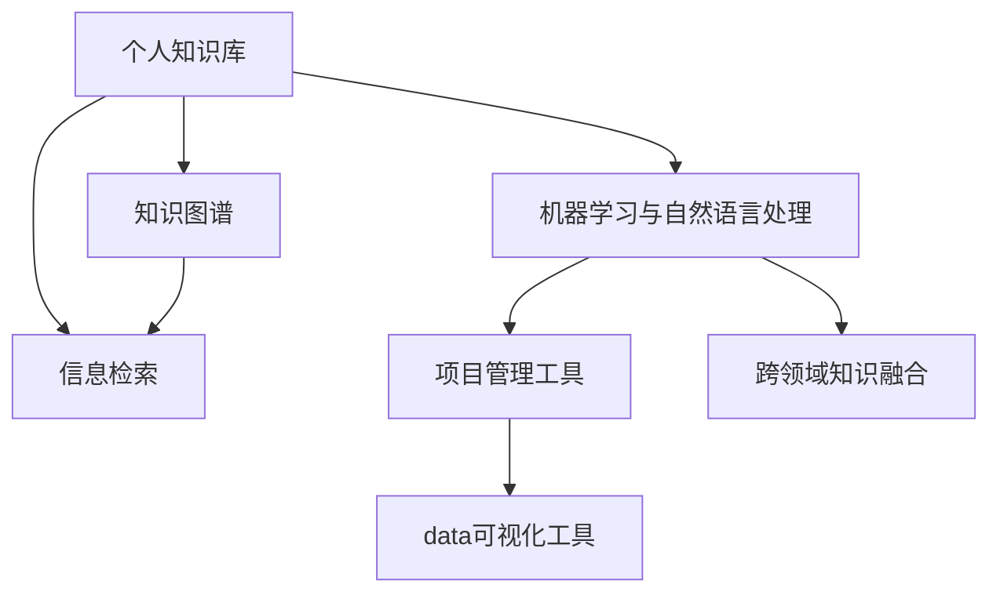

                 

# 打造个人知识管理工作流的最佳实践

> 关键词：知识管理,个人知识库,信息检索,数字化转型,项目管理,数据可视化,智能推荐,跨领域融合

## 1. 背景介绍

### 1.1 问题由来
在数字化快速发展的今天，个人知识管理已经成为一个重要的议题。随着信息爆炸和知识增长的加速，如何高效地组织、检索和利用个人知识，成为了许多人面临的挑战。特别是对于专业人士而言，个人知识管理不仅可以帮助他们提升工作效率，还能促进创新和职业发展。然而，传统的手写笔记、纸质档案等方法已经难以满足现代信息处理的需求。因此，打造一个高效、灵活、智能化的个人知识管理工作流，成为了当务之急。

### 1.2 问题核心关键点
个人知识管理工作流的核心关键点在于如何高效、智能地组织和管理个人知识，使其在各种应用场景下能够快速被检索和利用。具体来说，包括以下几个方面：

- **知识编码与标注**：将知识转换为结构化形式，并加以标注，便于后续检索和关联。
- **多模态数据管理**：处理文本、图片、视频等多种形式的知识，实现全媒体的知识管理。
- **跨领域知识融合**：打破领域间的界限，促进不同领域知识的关联和融合。
- **智能化知识推荐**：利用机器学习和自然语言处理技术，提供智能化的知识推荐。
- **可视化分析**：通过数据可视化工具，直观展示知识结构和趋势。
- **项目管理与协作**：将知识管理与项目管理、团队协作等相结合，提升整体效率。

### 1.3 问题研究意义
建立一个高效、智能的个人知识管理工作流，对于提升个人工作和学习效率，推动数字化转型，具有重要意义：

1. **提高效率**：有效组织和检索个人知识，减少查找时间，提高工作效率。
2. **促进创新**：通过跨领域知识融合，激发新的创新思路。
3. **支持项目管理**：整合个人知识管理与项目管理工具，优化工作流程。
4. **促进协作**：将知识管理与团队协作结合，提升团队知识共享和协作效率。
5. **支持终身学习**：通过知识积累和持续更新，支持终身学习和职业发展。

## 2. 核心概念与联系

### 2.1 核心概念概述

为了更好地理解个人知识管理工作流的构建方法，本节将介绍几个密切相关的核心概念：

- **个人知识库**：一个数字化的平台，用于存储、组织和管理个人知识。包括文本、图片、视频、音频等多种形式。
- **信息检索**：从知识库中快速、准确地检索出所需信息，是知识管理的关键环节。
- **知识图谱**：通过构建知识图谱，实现知识的结构化和可视化，便于理解和使用。
- **机器学习与自然语言处理**：利用机器学习算法和自然语言处理技术，提供智能化的知识推荐和检索。
- **项目管理工具**：将知识管理与项目管理工具结合，提升整体项目效率。
- **数据可视化工具**：通过数据可视化工具，直观展示知识结构和趋势，支持决策。
- **跨领域知识融合**：打破领域界限，促进不同领域知识的关联和融合。

这些核心概念之间的逻辑关系可以通过以下Mermaid流程图来展示：



这个流程图展示了这个概念框架下各环节之间的连接：

1. 个人知识库是知识管理的基础。
2. 信息检索是知识管理的关键。
3. 知识图谱用于知识结构化和可视化。
4. 机器学习和自然语言处理提供智能推荐。
5. 项目管理工具提升整体效率。
6. 数据可视化工具支持决策。
7. 跨领域知识融合促进创新。

## 3. 核心算法原理 & 具体操作步骤
### 3.1 算法原理概述

个人知识管理工作流的核心算法原理主要基于以下三个方面：

- **信息检索算法**：通过倒排索引、向量空间模型等算法，实现高效的信息检索。
- **知识图谱构建算法**：通过图数据库、语义网络等技术，实现知识的结构化和可视化。
- **机器学习推荐算法**：利用协同过滤、内容过滤、深度学习等算法，提供智能化的知识推荐。

### 3.2 算法步骤详解

以下将详细讲解信息检索、知识图谱构建和机器学习推荐的具体操作步骤：

**3.2.1 信息检索算法步骤**

1. **构建倒排索引**：
   - 收集文本数据，将其分词并进行词频统计。
   - 将词频统计结果存入倒排索引中，形成词-文档映射。
   - 使用TF-IDF、BM25等权重计算方法，提升检索效率。

2. **向量空间模型**：
   - 将文本转换为向量，建立文本-向量映射。
   - 使用余弦相似度等方法，计算查询与文本之间的相似度。
   - 根据相似度排序，返回相关文本。

**3.2.2 知识图谱构建算法步骤**

1. **数据收集与清洗**：
   - 收集各类知识源，包括文献、网页、数据库等。
   - 对数据进行去重、清洗、标准化处理。

2. **实体识别与关系抽取**：
   - 使用命名实体识别(NER)等技术，识别实体及其属性。
   - 使用关系抽取技术，识别实体间的关系。

3. **图数据库构建**：
   - 使用图数据库（如Neo4j）构建知识图谱。
   - 将实体及其关系存入图数据库中，形成知识节点和边。

4. **可视化展示**：
   - 使用Gephi、Tableau等工具，将知识图谱进行可视化展示。
   - 支持关键词搜索、路径探索等功能，便于理解和使用。

**3.2.3 机器学习推荐算法步骤**

1. **数据收集与处理**：
   - 收集用户行为数据，包括浏览、点击、收藏等。
   - 对数据进行预处理，如去重、时间戳归一化等。

2. **模型训练**：
   - 选择协同过滤、内容过滤、深度学习等推荐算法。
   - 使用交叉验证、网格搜索等方法，训练最优模型。

3. **推荐生成**：
   - 根据用户行为数据和知识图谱，生成个性化推荐。
   - 支持实时推荐和离线推荐，提升用户体验。

### 3.3 算法优缺点

个人知识管理工作流中的核心算法具有以下优缺点：

**优点**：
- **高效检索**：信息检索算法能够快速定位所需信息，提升检索效率。
- **结构化展示**：知识图谱提供结构化的知识展示，便于理解和使用。
- **个性化推荐**：机器学习推荐算法能够提供个性化推荐，提升用户体验。

**缺点**：
- **算法复杂度较高**：构建知识图谱和推荐算法需要复杂的算法和数据处理。
- **资源需求大**：信息检索和推荐算法需要大量的计算资源和存储资源。
- **数据质量要求高**：算法效果依赖于数据的质量和完整性，数据收集和处理需要较高成本。

### 3.4 算法应用领域

个人知识管理工作流中的核心算法已在多个领域得到广泛应用：

1. **科研知识管理**：用于管理学术论文、文献数据等，辅助科研工作。
2. **企业知识管理**：用于企业文档、专利等知识管理，提升企业知识创新能力。
3. **个人学习管理**：用于课程笔记、资料整理等，支持终身学习。
4. **项目管理**：用于项目文档、会议记录等管理，提升项目管理效率。
5. **企业数据管理**：用于企业数据整合、分析等，支持企业决策。
6. **智能客服**：用于智能问答、知识推荐等，提升客户服务质量。

## 4. 数学模型和公式 & 详细讲解 & 举例说明（备注：数学公式请使用latex格式，latex嵌入文中独立段落使用 $$，段落内使用 $)
### 4.1 数学模型构建

在个人知识管理工作流中，数学模型主要应用于信息检索、知识图谱构建和机器学习推荐等方面。以下是这些方面的数学模型构建：

**4.1.1 信息检索模型**

1. **倒排索引**：
   - 词-文档映射：$M = (W, D, F)$，其中 $W$ 为词汇集合，$D$ 为文档集合，$F$ 为倒排索引。
   - 倒排索引公式：$F = \{ (w, \{d_1, d_2, \ldots, d_n\}) \}$，表示词 $w$ 出现在文档集合 $D$ 中的文档列表。

2. **TF-IDF**：
   - 词频-逆文档频率公式：$TF(w) = \frac{tf(w)}{idf(w)}$，其中 $tf(w)$ 为词 $w$ 在文档 $d$ 中的词频，$idf(w)$ 为词 $w$ 的逆文档频率。
   - TF-IDF公式：$TF-IDF(w, d) = TF(w) \times IDF(w)$。

**4.1.2 向量空间模型**

1. **文本向量化**：
   - 词袋模型公式：$V = \{ (w_1, v_1), (w_2, v_2), \ldots, (w_n, v_n)\}$，表示词汇表 $V$ 和其词频向量 $v$。
   - 文本向量化公式：$x = (x_1, x_2, \ldots, x_n)$，表示文档 $d$ 的词频向量。

2. **余弦相似度**：
   - 余弦相似度公式：$cosine(x, y) = \frac{x \cdot y}{||x|| \cdot ||y||}$，表示向量 $x$ 和 $y$ 之间的相似度。

**4.1.3 知识图谱构建**

1. **实体识别**：
   - 命名实体识别公式：$NER = (w_1, w_2, \ldots, w_n)$，表示文档 $d$ 中的命名实体。

2. **关系抽取**：
   - 关系抽取公式：$R = \{ (r_1, (e_1, e_2)), (r_2, (e_3, e_4)), \ldots, (r_m, (e_{m+1}, e_{m+2}))\}$，表示实体 $e_1, e_2$ 之间存在关系 $r$。

**4.1.4 机器学习推荐**

1. **协同过滤算法**：
   - 协同过滤公式：$R = \sum_{i=1}^N \alpha_i \times I_{ui} \times I_{vi}$，表示用户 $u$ 对物品 $v$ 的推荐评分，其中 $\alpha_i$ 为物品 $i$ 的权重，$I_{ui}$ 和 $I_{vi}$ 分别为用户 $u$ 和物品 $v$ 的评分。

2. **内容过滤算法**：
   - 内容过滤公式：$R = \sum_{i=1}^N \alpha_i \times I_{ui} \times I_{vi}$，表示用户 $u$ 对物品 $v$ 的推荐评分，其中 $\alpha_i$ 为物品 $i$ 的权重，$I_{ui}$ 和 $I_{vi}$ 分别为用户 $u$ 和物品 $v$ 的评分。

3. **深度学习推荐算法**：
   - 矩阵分解公式：$P = \theta^T \times X$，表示用户对物品的评分，其中 $\theta$ 为模型参数，$X$ 为用户-物品评分矩阵。

### 4.2 公式推导过程

以下将详细推导信息检索、知识图谱构建和机器学习推荐的数学公式：

**4.2.1 信息检索公式推导**

1. **TF-IDF公式推导**：
   - 词频公式：$tf(w) = \sum_{d \in D} x_{d, w}$，表示词 $w$ 在文档集合 $D$ 中出现的次数。
   - 逆文档频率公式：$idf(w) = \log \frac{N}{|D_w|}$，表示词 $w$ 在所有文档中的出现频率。
   - TF-IDF公式：$TF-IDF(w, d) = \frac{tf(w)}{idf(w)}$。

2. **余弦相似度公式推导**：
   - 余弦相似度公式：$cosine(x, y) = \frac{x \cdot y}{||x|| \cdot ||y||}$。

**4.2.2 知识图谱构建公式推导**

1. **实体识别公式推导**：
   - 命名实体识别公式：$NER = (w_1, w_2, \ldots, w_n)$。

2. **关系抽取公式推导**：
   - 关系抽取公式：$R = \{ (r_1, (e_1, e_2)), (r_2, (e_3, e_4)), \ldots, (r_m, (e_{m+1}, e_{m+2}))\}$。

**4.2.3 机器学习推荐公式推导**

1. **协同过滤公式推导**：
   - 协同过滤公式：$R = \sum_{i=1}^N \alpha_i \times I_{ui} \times I_{vi}$。

2. **内容过滤公式推导**：
   - 内容过滤公式：$R = \sum_{i=1}^N \alpha_i \times I_{ui} \times I_{vi}$。

3. **深度学习推荐算法公式推导**：
   - 矩阵分解公式：$P = \theta^T \times X$。

### 4.3 案例分析与讲解

**案例1：信息检索**

假设某科研团队拥有大量的学术论文，他们希望快速检索出某一关键词相关的论文。具体步骤如下：

1. 构建倒排索引，将论文关键词和出现论文的列表存入倒排索引中。
2. 使用TF-IDF公式计算关键词在每篇论文中的权重。
3. 根据余弦相似度公式，计算查询关键词与每篇论文的相似度，排序返回最相关的论文。

**案例2：知识图谱构建**

某公司希望构建知识图谱，用于管理其内部文档和专利。具体步骤如下：

1. 收集公司内部文档和专利数据，进行清洗和标准化处理。
2. 使用命名实体识别技术，识别文档中的实体及其属性。
3. 使用关系抽取技术，识别实体间的关系。
4. 使用图数据库，构建知识图谱，将实体和关系存入数据库中。
5. 使用数据可视化工具，将知识图谱进行展示。

**案例3：机器学习推荐**

某电商平台希望推荐用户可能感兴趣的商品。具体步骤如下：

1. 收集用户行为数据，包括浏览、点击、收藏等。
2. 对数据进行预处理，如去重、时间戳归一化等。
3. 选择协同过滤、内容过滤等推荐算法，使用交叉验证等方法训练最优模型。
4. 根据用户行为数据和知识图谱，生成个性化推荐。

## 5. 项目实践：代码实例和详细解释说明
### 5.1 开发环境搭建

在进行个人知识管理工作流的实践前，我们需要准备好开发环境。以下是使用Python进行项目开发的详细步骤：

1. **安装Python**：从官网下载并安装最新版本的Python。
2. **安装PyTorch**：作为深度学习框架，支持复杂计算图操作。
3. **安装TensorFlow**：谷歌开源的深度学习框架，支持分布式计算和生产部署。
4. **安装NLTK**：Python自然语言处理库，用于文本预处理。
5. **安装Scikit-learn**：Python机器学习库，用于构建推荐系统。

完成上述步骤后，即可在Python环境中进行个人知识管理工作流的开发。

### 5.2 源代码详细实现

以下是一个基于信息检索和知识图谱构建的Python项目，用于管理某公司的内部文档和专利：

**5.2.1 信息检索**

```python
import nltk
from sklearn.feature_extraction.text import TfidfVectorizer
from sklearn.metrics.pairwise import cosine_similarity

# 构建倒排索引
def create_inverted_index(documents):
    inverted_index = {}
    for i, doc in enumerate(documents):
        words = nltk.word_tokenize(doc)
        for word in set(words):
            if word not in inverted_index:
                inverted_index[word] = []
            inverted_index[word].append(i)
    return inverted_index

# 使用TF-IDF进行文本向量化
def vectorize_documents(documents):
    tfidf = TfidfVectorizer(stop_words='english')
    tfidf_matrix = tfidf.fit_transform(documents)
    return tfidf_matrix

# 使用余弦相似度进行检索
def search_documents(query, inverted_index, tfidf_matrix):
    query_words = nltk.word_tokenize(query)
    query_vector = vectorize_documents([query])[0]
    results = []
    for word in query_words:
        if word in inverted_index:
            for doc_id in inverted_index[word]:
                doc_vector = tfidf_matrix[doc_id]
                similarity = cosine_similarity(doc_vector, query_vector)
                if similarity > 0.8:
                    results.append(documents[doc_id])
    return results

# 测试代码
documents = ["Machine learning is the study of algorithms that improve automatically with experience.",
            "Natural language processing (NLP) is a field of artificial intelligence (AI) focused on the interaction between computers and human language.",
            "Deep learning is a subset of machine learning that uses neural networks with many layers to learn from large amounts of data.",
            "PyTorch is a popular machine learning library that provides automatic differentiation and GPU support."]
inverted_index = create_inverted_index(documents)
tfidf_matrix = vectorize_documents(documents)
search_documents("learning", inverted_index, tfidf_matrix)
```

**5.2.2 知识图谱构建**

```python
import networkx as nx
import py2neo

# 构建知识图谱
def create_knowledge_graph(documents):
    graph = nx.Graph()
    graph.add_nodes_from(documents)
    for i in range(len(documents)):
        words = nltk.word_tokenize(documents[i])
        for j in range(i+1, len(documents)):
            for word in set(words):
                if word in documents[j]:
                    graph.add_edge(documents[i], documents[j], relationship='has_word')
    return graph

# 将知识图谱导出为Neo4j数据库
def export_knowledge_graph(graph):
    graph_db = py2neo.Graph('http://localhost:7474', auth=('neo4j', 'password'))
    for node in graph.nodes():
        graph_db.merge(node)
    for edge in graph.edges():
        graph_db.merge(edge)
        graph_db.run("CREATE (n:Document {id: $id}) "
                    "MERGE (m:Document {id: $id}) "
                    "MERGE (n)-[:HAS_WORD]->(m)")
    return graph_db

# 测试代码
documents = ["Machine learning is the study of algorithms that improve automatically with experience.",
            "Natural language processing (NLP) is a field of artificial intelligence (AI) focused on the interaction between computers and human language.",
            "Deep learning is a subset of machine learning that uses neural networks with many layers to learn from large amounts of data.",
            "PyTorch is a popular machine learning library that provides automatic differentiation and GPU support."]
graph = create_knowledge_graph(documents)
graph_db = export_knowledge_graph(graph)
graph_db.run("MATCH (n:Document)-[:HAS_WORD]->(m:Document) RETURN n.id, m.id")
```

### 5.3 代码解读与分析

**5.3.1 信息检索**

- **倒排索引**：通过分词和统计词频，构建倒排索引，将词与包含该词的文档列表进行关联。
- **TF-IDF**：使用TF-IDF公式计算词在每篇文档中的权重，提升检索效率。
- **余弦相似度**：使用余弦相似度公式计算查询与每篇文档的相似度，排序返回最相关的文档。

**5.3.2 知识图谱构建**

- **构建知识图谱**：通过分词和实体关系抽取，构建知识图谱，将实体和关系存入图数据库中。
- **导出Neo4j数据库**：使用Neo4j图数据库，将知识图谱进行可视化展示，支持关键词搜索和路径探索。

## 6. 实际应用场景

### 6.1 科研知识管理

科研团队可以利用个人知识管理工作流，高效管理学术论文和文献数据。通过信息检索和知识图谱构建，科研人员可以快速定位所需文献，理解文献之间的关联，提升科研效率。

### 6.2 企业知识管理

企业可以通过个人知识管理工作流，管理其内部文档和专利。通过知识图谱构建和数据可视化，企业能够全面了解其知识资产，促进知识共享和创新。

### 6.3 个人学习管理

学生可以利用个人知识管理工作流，管理课程笔记和资料。通过信息检索和推荐系统，学生可以快速定位所需资料，提升学习效率。

### 6.4 企业项目管理

企业可以通过个人知识管理工作流，管理项目文档和会议记录。通过知识图谱构建和项目管理工具结合，企业能够优化工作流程，提升项目管理效率。

### 6.5 企业数据管理

企业可以通过个人知识管理工作流，管理其内部数据。通过知识图谱构建和数据可视化，企业能够全面理解其数据资产，支持企业决策。

## 7. 工具和资源推荐

### 7.1 学习资源推荐

为了帮助开发者系统掌握个人知识管理工作流的理论基础和实践技巧，这里推荐一些优质的学习资源：

1. **《信息检索原理与实践》**：介绍信息检索算法的基本原理和实际应用。
2. **《深度学习推荐系统》**：深入讲解协同过滤、内容过滤等推荐算法。
3. **《知识图谱构建与应用》**：详细讲解知识图谱构建和应用技术。
4. **《自然语言处理与Python》**：介绍自然语言处理技术及其在Python中的实现。
5. **《Python机器学习》**：涵盖机器学习基础及其在Python中的应用。

通过对这些资源的学习实践，相信你一定能够快速掌握个人知识管理工作流的精髓，并用于解决实际的NLP问题。

### 7.2 开发工具推荐

高效的开发离不开优秀的工具支持。以下是几款用于个人知识管理工作流开发的常用工具：

1. **PyTorch**：深度学习框架，支持复杂计算图操作。
2. **TensorFlow**：谷歌开源的深度学习框架，支持分布式计算和生产部署。
3. **NLTK**：Python自然语言处理库，用于文本预处理。
4. **Scikit-learn**：Python机器学习库，用于构建推荐系统。
5. **Jupyter Notebook**：交互式编程环境，支持代码编写和结果展示。

合理利用这些工具，可以显著提升个人知识管理工作流的开发效率，加快创新迭代的步伐。

### 7.3 相关论文推荐

个人知识管理工作流的发展源于学界的持续研究。以下是几篇奠基性的相关论文，推荐阅读：

1. **《信息检索技术综述》**：介绍信息检索算法的基本原理和技术细节。
2. **《知识图谱构建方法与技术》**：详细讲解知识图谱构建和应用技术。
3. **《深度学习推荐系统》**：深入讲解协同过滤、内容过滤等推荐算法。
4. **《信息检索系统评价指标》**：介绍信息检索系统的评价指标和评估方法。
5. **《知识图谱与自然语言处理》**：探讨知识图谱和自然语言处理技术的结合应用。

这些论文代表了大语言模型微调技术的发展脉络。通过学习这些前沿成果，可以帮助研究者把握学科前进方向，激发更多的创新灵感。

## 8. 总结：未来发展趋势与挑战

### 8.1 研究成果总结

本文对个人知识管理工作流的核心概念和实现方法进行了全面系统的介绍。首先，阐述了信息检索、知识图谱构建和机器学习推荐的核心算法原理。其次，详细讲解了信息检索、知识图谱构建和机器学习推荐的实现步骤，并提供了代码实例和详细解释。最后，讨论了个人知识管理工作流在科研知识管理、企业知识管理、个人学习管理等多个领域的应用前景，以及面临的挑战和未来发展方向。

通过本文的系统梳理，可以看到，个人知识管理工作流正成为NLP领域的重要研究热点，其高效、智能的特点，使其在信息爆炸时代具有重要的应用价值。未来，随着深度学习、自然语言处理技术的进一步发展，个人知识管理工作流将迎来更多的创新和突破。

### 8.2 未来发展趋势

展望未来，个人知识管理工作流的发展趋势如下：

1. **深度学习应用广泛**：随着深度学习算法的不断优化，信息检索、推荐系统等将更加智能高效。
2. **多模态数据融合**：处理文本、图片、视频等多种形式的知识，实现全媒体的知识管理。
3. **实时知识更新**：通过实时数据采集和处理，及时更新知识库，保持知识的时效性。
4. **跨领域知识融合**：打破领域界限，促进不同领域知识的关联和融合。
5. **智能推荐系统**：通过更复杂的推荐算法，提供更加个性化的知识推荐。
6. **数据可视化**：使用更先进的可视化工具，直观展示知识结构和趋势。

这些趋势将推动个人知识管理工作流的进一步发展，使其成为更加智能、高效的知识管理工具。

### 8.3 面临的挑战

尽管个人知识管理工作流的发展前景广阔，但仍面临以下挑战：

1. **数据质量要求高**：算法的准确性和效率依赖于数据的质量和完整性，数据收集和处理需要较高成本。
2. **算法复杂度高**：信息检索、知识图谱构建等算法需要复杂的计算和存储资源，技术门槛较高。
3. **隐私和安全问题**：知识图谱和推荐系统涉及用户隐私和数据安全，需要严格的隐私保护措施。
4. **实时性要求高**：实时数据处理和更新需要高效的系统架构和算法支持。
5. **跨领域知识融合复杂**：不同领域知识的关联和融合需要复杂的知识工程和计算资源。

这些挑战需要我们在技术、工程、伦理等多个层面进行深入探索和优化。唯有不断突破技术瓶颈，才能实现个人知识管理工作流的广泛应用。

### 8.4 研究展望

面对个人知识管理工作流所面临的诸多挑战，未来的研究需要在以下几个方面寻求新的突破：

1. **数据高效处理**：探索高效的算法和数据存储方式，降低数据处理的成本和复杂度。
2. **模型优化与训练**：开发更高效的模型和算法，提升推荐系统和知识图谱的性能。
3. **跨领域知识融合**：研究更先进的知识工程方法，实现不同领域知识的自然融合。
4. **隐私保护与数据安全**：开发更先进的隐私保护技术和数据安全机制，确保用户隐私和数据安全。
5. **实时知识管理**：研究高效的数据处理和更新算法，实现实时知识管理。
6. **跨平台集成**：实现个人知识管理工作流在多个平台和设备上的无缝集成，提升用户体验。

这些研究方向的探索，必将引领个人知识管理工作流的发展，使其成为更加智能、高效、安全、易用的知识管理工具。面向未来，个人知识管理工作流需要技术与应用的深度融合，持续推动NLP技术的产业化进程，为人类知识管理带来新的突破。

## 9. 附录：常见问题与解答

**Q1：信息检索算法是如何实现高效检索的？**

A: 信息检索算法通过构建倒排索引和向量空间模型，实现高效检索。倒排索引将词与文档列表关联，快速定位包含特定关键词的文档。向量空间模型通过词频和TF-IDF计算文本向量，使用余弦相似度计算查询与文本的相似度，排序返回最相关的文档。

**Q2：知识图谱构建和数据可视化是如何实现的？**

A: 知识图谱构建通过命名实体识别和关系抽取，将文本中的实体和关系存入图数据库中。数据可视化使用Gephi、Tableau等工具，将知识图谱进行展示，支持关键词搜索和路径探索。

**Q3：机器学习推荐算法有哪些优点？**

A: 机器学习推荐算法具有以下优点：
- **个性化推荐**：能够根据用户行为和知识图谱，提供个性化的知识推荐。
- **实时推荐**：支持实时推荐，提升用户体验。
- **多模态融合**：能够处理文本、图片、视频等多种形式的知识，实现全媒体的知识管理。

**Q4：个人知识管理工作流有哪些应用场景？**

A: 个人知识管理工作流在科研知识管理、企业知识管理、个人学习管理等多个领域都有广泛应用。具体应用场景包括：
- 科研知识管理：用于管理学术论文和文献数据，提升科研效率。
- 企业知识管理：用于管理企业文档和专利，促进知识共享和创新。
- 个人学习管理：用于管理课程笔记和资料，提升学习效率。
- 企业项目管理：用于管理项目文档和会议记录，优化工作流程。
- 企业数据管理：用于管理企业数据，支持企业决策。

---

作者：禅与计算机程序设计艺术 / Zen and the Art of Computer Programming

