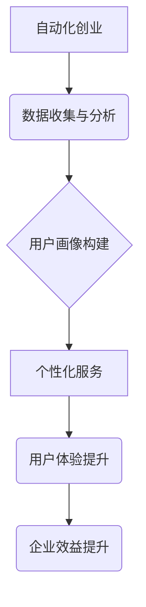

                 

## 如何在自动化创业中实现个性化服务

> 关键词：自动化创业、个性化服务、机器学习、深度学习、自然语言处理、推荐系统、数据分析、用户画像

## 1. 背景介绍

在当今数字化时代，创业者面临着激烈的竞争环境。为了脱颖而出，提供个性化服务已成为关键。个性化服务是指根据用户的独特需求和偏好，定制化地提供产品或服务，以提升用户体验和建立忠诚度。然而，传统的手工方式难以满足个性化服务的规模化需求。自动化创业的兴起为实现个性化服务提供了新的机遇。

自动化创业是指利用人工智能、大数据等技术，构建自动化化的业务流程和运营模式，以提高效率、降低成本和增强用户体验。自动化创业的核心是利用算法和数据分析，对用户行为进行精准识别和预测，从而提供个性化的产品推荐、内容定制、服务建议等。

## 2. 核心概念与联系

### 2.1 个性化服务

个性化服务是指根据用户的独特需求和偏好，定制化地提供产品或服务，以提升用户体验和建立忠诚度。个性化服务的实现需要对用户的行为、偏好、需求等进行深入的理解和分析。

### 2.2 自动化创业

自动化创业是指利用人工智能、大数据等技术，构建自动化化的业务流程和运营模式，以提高效率、降低成本和增强用户体验。自动化创业的核心是利用算法和数据分析，对用户行为进行精准识别和预测，从而提供个性化的产品推荐、内容定制、服务建议等。

### 2.3 核心技术

实现自动化创业和个性化服务的关键技术包括：

* **机器学习:** 机器学习算法可以从海量数据中学习用户行为模式，并根据这些模式进行预测和推荐。
* **深度学习:** 深度学习算法可以学习更复杂的特征和模式，从而提供更精准的个性化服务。
* **自然语言处理:** 自然语言处理技术可以理解和分析用户的文本输入，从而提供更人性化的交互体验。
* **推荐系统:** 推荐系统可以根据用户的历史行为和偏好，推荐相关的产品或服务。
* **数据分析:** 数据分析技术可以帮助企业从用户数据中挖掘洞察，从而更好地理解用户需求和行为。

**核心概念与联系流程图:**



## 3. 核心算法原理 & 具体操作步骤

### 3.1 算法原理概述

个性化服务的核心算法通常基于机器学习和深度学习技术。这些算法可以从用户的历史行为、偏好、属性等数据中学习用户特征，并根据这些特征进行预测和推荐。常见的算法包括：

* **协同过滤:** 基于用户的相似性或物品的相似性进行推荐。
* **内容过滤:** 基于物品的特征和用户的偏好进行推荐。
* **混合推荐:** 结合协同过滤和内容过滤算法进行推荐。
* **深度学习推荐:** 利用深度神经网络学习更复杂的特征和模式进行推荐。

### 3.2 算法步骤详解

以协同过滤算法为例，其具体操作步骤如下：

1. **数据收集:** 收集用户的历史行为数据，例如浏览记录、购买记录、评分记录等。
2. **用户相似度计算:** 计算用户之间的相似度，可以使用余弦相似度、皮尔逊相关系数等方法。
3. **物品相似度计算:** 计算物品之间的相似度，可以使用余弦相似度、Jaccard系数等方法。
4. **推荐生成:** 根据用户的相似用户或物品的相似物品，生成个性化的推荐列表。

### 3.3 算法优缺点

**协同过滤算法的优点:**

* 可以发现隐含的用户偏好。
* 推荐结果通常比较准确。

**协同过滤算法的缺点:**

* 数据稀疏性问题: 当用户行为数据稀疏时，算法难以准确计算相似度。
* 冷启动问题: 新用户或新物品难以获得推荐。

### 3.4 算法应用领域

协同过滤算法广泛应用于以下领域:

* **电商推荐:** 推荐商品、优惠券、促销活动等。
* **视频网站推荐:** 推荐视频、电视剧、电影等。
* **音乐平台推荐:** 推荐歌曲、专辑、音乐人等。
* **社交媒体推荐:** 推荐好友、群组、话题等。

## 4. 数学模型和公式 & 详细讲解 & 举例说明

### 4.1 数学模型构建

协同过滤算法的核心是计算用户之间的相似度和物品之间的相似度。常用的相似度度量方法包括余弦相似度和皮尔逊相关系数。

**4.1.1 余弦相似度**

余弦相似度度量两个向量的夹角大小，值范围为-1到1，其中1表示完全相似，-1表示完全相反，0表示不相关。

**公式:**

$$
\text{余弦相似度}(u,v) = \frac{u \cdot v}{||u|| ||v||}
$$

其中:

* $u$ 和 $v$ 是两个用户或物品的特征向量。
* $u \cdot v$ 是两个向量的点积。
* $||u||$ 和 $||v||$ 是两个向量的模长。

**4.1.2 皮尔逊相关系数**

皮尔逊相关系数度量两个变量之间的线性相关性，值范围为-1到1，其中1表示完全正相关，-1表示完全负相关，0表示不相关。

**公式:**

$$
\text{皮尔逊相关系数}(u,v) = \frac{\sum_{i=1}^{n}(u_i - \bar{u})(v_i - \bar{v})}{\sqrt{\sum_{i=1}^{n}(u_i - \bar{u})^2} \sqrt{\sum_{i=1}^{n}(v_i - \bar{v})^2}}
$$

其中:

* $u$ 和 $v$ 是两个用户或物品的评分向量。
* $u_i$ 和 $v_i$ 是用户或物品在第 $i$ 个物品上的评分。
* $\bar{u}$ 和 $\bar{v}$ 是用户或物品的平均评分。

### 4.2 公式推导过程

余弦相似度和皮尔逊相关系数的推导过程较为复杂，涉及线性代数和概率统计的知识。

### 4.3 案例分析与讲解

假设有两个用户A和B，他们的评分向量分别为:

* $u_A = [5, 4, 3, 2, 1]$
* $u_B = [4, 3, 2, 1, 5]$

我们可以使用余弦相似度计算用户A和B之间的相似度:

$$
\text{余弦相似度}(u_A,u_B) = \frac{5 \cdot 4 + 4 \cdot 3 + 3 \cdot 2 + 2 \cdot 1 + 1 \cdot 5}{\sqrt{5^2 + 4^2 + 3^2 + 2^2 + 1^2} \sqrt{4^2 + 3^2 + 2^2 + 1^2 + 5^2}}
$$

计算结果为0.8，表明用户A和B的评分偏好比较相似。

## 5. 项目实践：代码实例和详细解释说明

### 5.1 开发环境搭建

为了实现个性化服务，需要搭建一个开发环境，包括以下软件:

* Python 3.x
* Jupyter Notebook
* Scikit-learn
* Pandas
* NumPy

### 5.2 源代码详细实现

以下是一个使用协同过滤算法实现商品推荐的Python代码示例:

```python
import pandas as pd
from sklearn.metrics.pairwise import cosine_similarity

# 加载用户评分数据
ratings = pd.read_csv('ratings.csv')

# 计算用户之间的余弦相似度
user_similarity = cosine_similarity(ratings)

# 获取用户ID
user_id = 1

# 获取用户ID对应的相似用户
similar_users = user_similarity[user_id].argsort()[:-10:-1]

# 获取相似用户评分过的商品
recommended_items = ratings.loc[similar_users, :].mean().sort_values(ascending=False)

# 打印推荐结果
print(recommended_items)
```

### 5.3 代码解读与分析

* **数据加载:** 使用pandas库加载用户评分数据。
* **相似度计算:** 使用sklearn库的cosine_similarity函数计算用户之间的余弦相似度。
* **相似用户获取:** 根据用户ID获取其相似用户的索引。
* **推荐商品:** 获取相似用户评分过的商品，并计算平均评分，从而得到推荐商品列表。
* **结果输出:** 打印推荐商品列表。

### 5.4 运行结果展示

运行上述代码后，将输出用户ID对应的推荐商品列表，其中商品按照平均评分排序。

## 6. 实际应用场景

个性化服务在各个行业都有广泛的应用场景:

### 6.1 电商

* **商品推荐:** 根据用户的浏览历史、购买记录、评分等数据，推荐相关的商品。
* **个性化促销:** 根据用户的消费习惯和偏好，推送个性化的优惠券和促销活动。
* **定制化服务:** 提供个性化的产品定制服务，例如服装、手机壳等。

### 6.2 教育

* **个性化学习:** 根据学生的学习进度、知识掌握情况、学习风格等数据，推荐个性化的学习内容和学习路径。
* **智能辅导:** 利用人工智能技术，为学生提供个性化的学习辅导和答疑服务。
* **个性化测评:** 为学生提供个性化的能力测评和职业规划建议。

### 6.3 医疗

* **个性化诊断:** 根据患者的症状、病史、基因信息等数据，提供个性化的诊断建议。
* **个性化治疗:** 根据患者的病情、体质、生活习惯等数据，制定个性化的治疗方案。
* **远程医疗:** 提供远程医疗咨询和诊断服务，方便患者获得个性化的医疗服务。

### 6.4 未来应用展望

随着人工智能技术的不断发展，个性化服务将更加智能化、精准化和人性化。未来，个性化服务将应用于更多领域，例如金融、旅游、娱乐等，为用户提供更加便捷、高效、个性化的体验。

## 7. 工具和资源推荐

### 7.1 学习资源推荐

* **书籍:**
    * 《机器学习》 - 周志华
    * 《深度学习》 - Ian Goodfellow
    * 《推荐系统》 -  陈天奇
* **在线课程:**
    * Coursera: 机器学习、深度学习
    * edX: 数据科学、人工智能
    * Udacity: 机器学习工程师

### 7.2 开发工具推荐

* **Python:** 广泛应用于机器学习和数据分析领域。
* **Jupyter Notebook:** 用于编写和执行Python代码，并可视化数据。
* **Scikit-learn:** Python机器学习库，提供各种算法和工具。
* **TensorFlow:** 深度学习框架，用于构建和训练深度神经网络。
* **PyTorch:** 深度学习框架，灵活易用，适合研究和开发。

### 7.3 相关论文推荐

* **Collaborative Filtering for Implicit Feedback Datasets**
* **Deep Learning for Recommender Systems**
* **A Survey on Recommender Systems**

## 8. 总结：未来发展趋势与挑战

### 8.1 研究成果总结

自动化创业和个性化服务是当前科技发展的重要趋势，其核心技术包括机器学习、深度学习、自然语言处理等。这些技术已经取得了显著的成果，并在各个行业得到了广泛应用。

### 8.2 未来发展趋势

* **更精准的个性化推荐:** 利用更先进的算法和更丰富的用户数据，提供更加精准的个性化推荐。
* **更智能的交互体验:** 利用自然语言处理和语音识别技术，提供更智能、更人性化的交互体验。
* **更广泛的应用场景:** 个性化服务将应用于更多领域，例如教育、医疗、金融等。

### 8.3 面临的挑战

* **数据隐私和安全:** 个性化服务需要收集和分析大量的用户数据，如何保护用户隐私和数据安全是一个重要的挑战。
* **算法公平性:** 个性化服务算法可能会存在偏见，导致不公平的结果，如何确保算法公平性是一个重要的研究方向。
* **解释性问题:** 深度学习算法的决策过程难以解释，如何提高算法的解释性是一个重要的挑战。

### 8.4 研究展望

未来，自动化创业和个性化服务将继续发展，并带来更多创新和突破。研究者需要关注数据隐私、算法公平性和解释性等问题，并探索更先进的算法和技术，以实现更加智能、精准、人性化的个性化服务。

## 9. 附录：常见问题与解答

### 9.1 如何解决数据稀疏性问题?

数据稀疏性问题是协同过滤算法面临的一个重要挑战。解决方法包括:

* **使用混合推荐算法:** 将协同过滤算法与内容过滤算法相结合，利用物品的特征信息进行推荐。
* **使用矩阵分解技术:** 将用户评分矩阵分解成低维矩阵，从而降低数据稀疏性的影响。
* **使用基于知识图谱的推荐算法:** 利用知识图谱中的语义信息，进行更精准的推荐。

### 9.2 如何解决冷启动问题?

冷启动问题是指新用户或新物品难以获得推荐。解决方法包括:

* **利用用户属性信息:** 根据用户的年龄、性别、兴趣等属性信息，进行推荐。
* **利用物品的特征信息:** 根据物品的类别、描述、标签等信息，进行推荐。
* **使用基于内容的推荐算法:** 利用物品的特征信息，进行推荐。


作者：禅与计算机程序设计艺术 / Zen and the Art of Computer Programming 
<end_of_turn>

