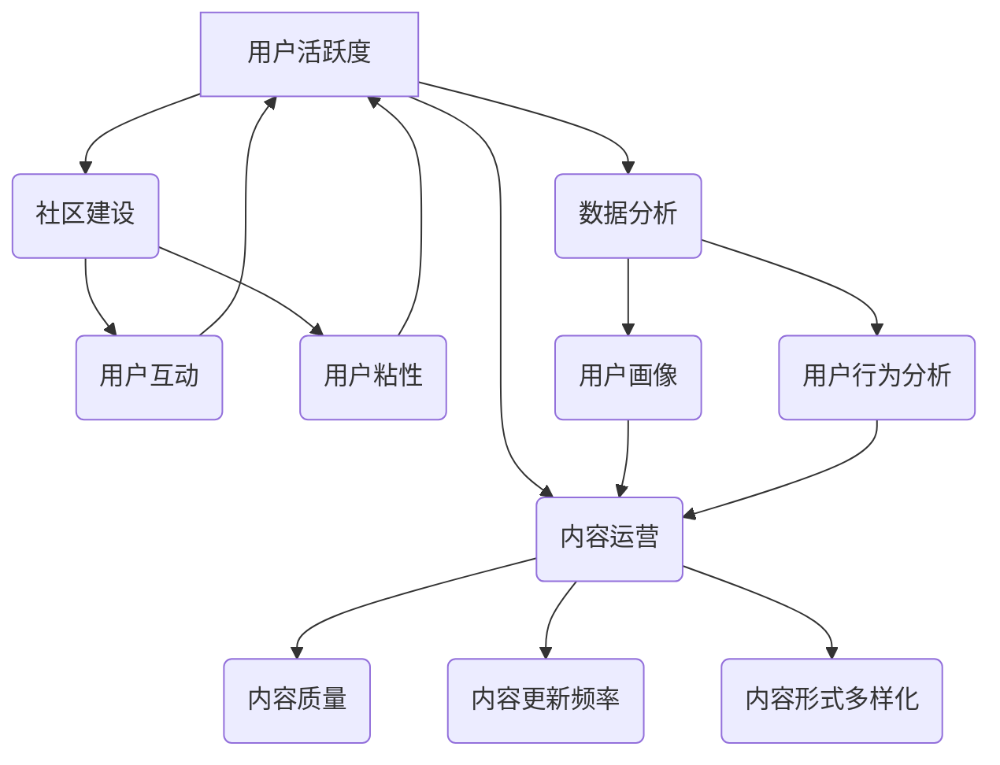

                 

## 如何提高知识付费产品的用户活跃度

> 关键词：知识付费、用户活跃度、用户留存、内容运营、社区建设、数据分析、个性化推荐

## 1. 背景介绍

知识付费市场近年来蓬勃发展，涌现出大量优质的知识产品。然而，如何提高知识付费产品的用户活跃度，让用户持续付费并获得价值，成为众多平台和创作者面临的共同挑战。用户活跃度直接关系到知识付费产品的商业可持续性，也是衡量产品成功的重要指标。

传统的知识付费产品往往以单一的课程或文档形式呈现，缺乏互动性和用户粘性。用户购买后，往往只是被动地消费内容，缺乏持续的学习动力和参与感。因此，提高用户活跃度，需要从内容运营、社区建设、数据分析等多个方面入手，打造一个更加用户友好、互动性强、价值丰富的知识付费生态系统。

## 2. 核心概念与联系

**2.1 核心概念**

* **用户活跃度 (User Activity):** 指用户在特定时间段内与知识付费产品进行交互的频率和深度。
* **用户留存 (User Retention):** 指用户在一段时间内持续使用知识付费产品的比例。
* **内容运营 (Content Operation):**  围绕知识付费产品内容的策划、制作、发布、推广和维护等一系列活动。
* **社区建设 (Community Building):**  围绕知识付费产品构建一个用户互动、交流学习的平台。
* **数据分析 (Data Analysis):**  通过收集和分析用户行为数据，洞察用户需求和痛点，优化产品和服务。

**2.2 架构关系**



## 3. 核心算法原理 & 具体操作步骤

**3.1 算法原理概述**

提高知识付费产品的用户活跃度，需要结合多种算法和技术手段，例如：

* **推荐算法:**  根据用户的学习历史、兴趣偏好等信息，推荐相关且有价值的内容，提高用户获取信息和学习的效率。
* **内容分发算法:**  根据内容的质量、时效性、用户兴趣等因素，智能分发内容，确保用户看到最合适的学习资源。
* **用户画像算法:**  通过分析用户的学习行为、互动数据等信息，构建用户画像，了解用户的学习习惯、兴趣爱好、知识需求等，为个性化内容推荐和服务提供数据支持。

**3.2 算法步骤详解**

1. **数据收集:** 收集用户学习行为数据、兴趣偏好数据、学习进度数据等，构建用户行为数据库。
2. **数据预处理:** 对收集到的数据进行清洗、转换、格式化等处理，确保数据质量和一致性。
3. **特征提取:** 从用户行为数据中提取特征，例如学习时长、学习频率、学习内容类型等，构建用户特征向量。
4. **模型训练:** 使用机器学习算法，例如协同过滤、内容基准、深度学习等，训练推荐模型，预测用户对不同内容的兴趣和偏好。
5. **个性化推荐:** 根据训练好的模型，为每个用户推荐个性化的学习内容，提高用户学习兴趣和效率。
6. **效果评估:**  定期评估推荐算法的效果，例如点击率、转化率、用户留存率等，并根据评估结果不断优化算法模型和推荐策略。

**3.3 算法优缺点**

* **优点:**  能够根据用户的个性化需求，推荐更精准、更有效的学习内容，提高用户学习兴趣和效率。
* **缺点:**  需要大量的用户数据进行训练，算法模型的复杂度较高，需要专业的技术人员进行维护和优化。

**3.4 算法应用领域**

* **在线教育平台:**  推荐课程、学习资源、学习计划等。
* **知识付费平台:**  推荐付费课程、文档、直播等。
* **内容平台:**  推荐文章、视频、音频等内容。

## 4. 数学模型和公式 & 详细讲解 & 举例说明

**4.1 数学模型构建**

用户活跃度模型可以采用以下数学模型进行构建：

$$
ActiveRate = \frac{ActiveUsers}{TotalUsers}
$$

其中：

* **ActiveRate:** 用户活跃度
* **ActiveUsers:** 在特定时间段内进行交互的用户数量
* **TotalUsers:** 平台总用户数量

**4.2 公式推导过程**

用户活跃度模型的推导过程如下：

1. 首先，定义用户活跃度为在特定时间段内进行交互的用户数量占平台总用户数量的比例。
2. 然后，使用公式 $ActiveRate = \frac{ActiveUsers}{TotalUsers}$ 来计算用户活跃度。

**4.3 案例分析与讲解**

假设一个知识付费平台有 1000 个用户，在过去一周内有 300 个用户进行了学习互动，那么该平台的用户活跃度为：

$$
ActiveRate = \frac{300}{1000} = 0.3
$$

这意味着该平台在过去一周内有 30% 的用户进行了学习互动。

## 5. 项目实践：代码实例和详细解释说明

**5.1 开发环境搭建**

* 操作系统：Windows/macOS/Linux
* 编程语言：Python
* 开发工具：Jupyter Notebook/VS Code
* 库依赖：pandas、numpy、scikit-learn

**5.2 源代码详细实现**

```python
import pandas as pd
from sklearn.metrics.pairwise import cosine_similarity

# 加载用户行为数据
data = pd.read_csv('user_behavior.csv')

# 提取用户特征
user_features = data[['user_id', 'learning_time', 'learning_frequency', 'content_type']]

# 计算用户之间的余弦相似度
user_similarity = cosine_similarity(user_features)

# 根据相似度推荐内容
def recommend_content(user_id, top_n=5):
    # 获取用户相似用户
    similar_users = user_similarity[user_id].argsort()[:-top_n-1:-1]
    # 获取相似用户学习过的内容
    recommended_content = data[data['user_id'].isin(similar_users)]['content_id'].unique()
    return recommended_content

# 获取用户推荐内容
user_id = 123
recommended_content = recommend_content(user_id)
print(f'推荐给用户 {user_id} 的内容：{recommended_content}')
```

**5.3 代码解读与分析**

* 该代码首先加载用户行为数据，并提取用户特征，例如学习时长、学习频率、学习内容类型等。
* 然后，使用余弦相似度算法计算用户之间的相似度，并根据相似度推荐内容。
* 推荐算法的核心是找到与目标用户学习习惯和兴趣相似的用户，并推荐这些用户学习过的内容。

**5.4 运行结果展示**

运行该代码后，会输出目标用户 123 的推荐内容列表。

## 6. 实际应用场景

**6.1 在线教育平台**

* 推荐个性化学习课程和学习计划。
* 根据用户学习进度，推荐相关学习资源和练习题。
* 建立用户学习社区，促进用户互动和交流学习。

**6.2 知识付费平台**

* 推荐付费课程、文档、直播等内容。
* 根据用户兴趣偏好，推荐相关付费内容。
* 建立付费内容社区，促进用户交流学习和分享经验。

**6.3 内容平台**

* 推荐个性化文章、视频、音频等内容。
* 根据用户阅读、观看、听取习惯，推荐相关内容。
* 建立内容社区，促进用户互动和内容分享。

**6.4 未来应用展望**

随着人工智能技术的不断发展，知识付费产品的用户活跃度提升将更加智能化、个性化。未来，我们可以期待：

* 更精准的推荐算法，能够根据用户的微观行为和学习状态，推荐更符合用户需求的内容。
* 更丰富的互动形式，例如虚拟现实、增强现实等技术，将为用户提供更沉浸式的学习体验。
* 更智能化的社区建设，例如AI驱动的社区管理和内容审核，将提高社区的活跃度和用户体验。

## 7. 工具和资源推荐

**7.1 学习资源推荐**

* **书籍:**
    * 《推荐系统实践》
    * 《机器学习》
    * 《深度学习》
* **在线课程:**
    * Coursera:  推荐系统课程
    * edX:  机器学习课程
    * Udemy:  深度学习课程

**7.2 开发工具推荐**

* **Python:**  数据分析、机器学习、深度学习
* **Scikit-learn:**  机器学习库
* **TensorFlow:**  深度学习库
* **PyTorch:**  深度学习库

**7.3 相关论文推荐**

* 《Collaborative Filtering for Implicit Feedback Datasets》
* 《Matrix Factorization Techniques for Recommender Systems》
* 《Deep Learning for Recommender Systems》

## 8. 总结：未来发展趋势与挑战

**8.1 研究成果总结**

通过对知识付费产品用户活跃度提升的研究，我们发现：

* 推荐算法、内容运营、社区建设、数据分析等多种技术手段可以有效提升用户活跃度。
* 个性化推荐、智能化互动、丰富的内容形式是未来知识付费产品发展的重要趋势。

**8.2 未来发展趋势**

* **更精准的推荐算法:**  利用大数据和人工智能技术，实现更精准的个性化推荐。
* **更丰富的互动形式:**  引入虚拟现实、增强现实等技术，打造更沉浸式的学习体验。
* **更智能化的社区建设:**  利用AI技术，实现社区管理和内容审核的智能化。

**8.3 面临的挑战**

* **数据隐私保护:**  在收集和使用用户数据时，需要严格遵守数据隐私保护法律法规。
* **算法公平性:**  推荐算法需要避免歧视和偏见，确保公平公正的推荐结果。
* **内容质量控制:**  需要建立有效的机制，确保平台内容的质量和可靠性。

**8.4 研究展望**

未来，我们将继续深入研究知识付费产品用户活跃度提升的机制，探索更先进的算法和技术手段，为用户提供更优质的学习体验。


## 9. 附录：常见问题与解答

**9.1 如何提高用户留存率？**

提高用户留存率需要从以下几个方面入手：

* **内容质量:**  提供高质量、有价值的内容，满足用户的学习需求。
* **内容更新频率:**  定期更新内容，保持用户新鲜感。
* **用户体验:**  优化用户界面和交互体验，提高用户使用效率。
* **社区建设:**  建立用户社区，促进用户互动和交流学习。
* **个性化推荐:**  根据用户的学习习惯和兴趣，推荐个性化的学习内容。

**9.2 如何评估推荐算法的效果？**

推荐算法的效果可以评估以下指标：

* **点击率:**  用户点击推荐内容的比例。
* **转化率:**  用户点击推荐内容后，购买或学习的比例。
* **用户留存率:**  用户持续使用平台的比例。
* **用户满意度:**  用户对推荐内容和平台的满意度。

**9.3 如何解决数据隐私保护问题？**

在收集和使用用户数据时，需要严格遵守数据隐私保护法律法规，采取以下措施：

* **匿名化处理:**  对用户数据进行匿名化处理，保护用户的个人信息。
* **数据加密:**  对用户数据进行加密存储和传输，防止数据泄露。
* **用户授权:**  明确用户数据的使用范围，并获得用户的明确授权。
* **数据安全管理:**  建立完善的数据安全管理制度，防止数据被非法访问和使用。


作者：禅与计算机程序设计艺术 / Zen and the Art of Computer Programming 
<end_of_turn>

