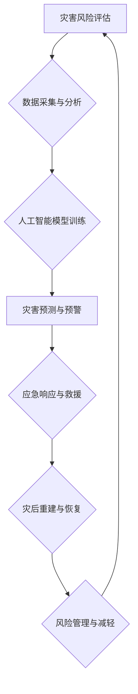

                 

## 2050年的全球减灾：从灾害应对到风险治理的综合防灾体系

> 关键词：人工智能、灾害预测、风险管理、数据分析、物联网、机器学习、云计算、可持续发展

### 1. 背景介绍

21世纪，全球气候变化加剧，极端天气事件频发，自然灾害的发生频率和强度呈现上升趋势。传统灾害应对模式已难以有效应对日益复杂的灾害形势。面对这一严峻挑战，构建一个能够从灾害应对转向风险治理的综合防灾体系势在必行。

2050年，全球减灾将迎来新的发展阶段。人工智能、物联网、云计算等新兴技术将深刻改变灾害防治的模式，构建一个更加智能化、高效化、可持续的全球减灾体系。

### 2. 核心概念与联系

**2.1 灾害风险治理**

灾害风险治理是指通过识别、分析、评估和管理灾害风险，以减少灾害造成的损失和影响。它是一个系统性的过程，涉及多个领域和多个利益相关者。

**2.2 综合防灾体系**

综合防灾体系是指以灾害风险治理为核心，整合科技、政策、社会和经济等多方面资源，构建一个全方位、多层次、协同高效的灾害防治体系。

**2.3  人工智能在减灾中的应用**

人工智能技术在灾害预测、预警、应急响应、灾后重建等方面具有广泛的应用前景。

**2.4  核心概念架构**



### 3. 核心算法原理 & 具体操作步骤

**3.1 算法原理概述**

在2050年的全球减灾体系中，人工智能算法将发挥关键作用。其中，机器学习算法在灾害预测、风险评估等方面表现尤为突出。

**3.2 算法步骤详解**

1. **数据采集与预处理:** 收集来自各种来源（如气象站、卫星遥感、地面传感器等）的灾害相关数据，并进行清洗、转换、格式化等预处理操作。
2. **特征提取:** 从原始数据中提取具有灾害预测价值的特征，例如气温、降雨量、风速、海平面等。
3. **模型训练:** 利用机器学习算法（如深度神经网络、支持向量机等）对提取的特征进行训练，建立灾害预测模型。
4. **模型评估:** 使用测试数据对训练好的模型进行评估，并根据评估结果进行模型优化和调整。
5. **灾害预测与预警:** 将训练好的模型应用于实时数据，预测未来灾害发生的可能性和强度，并及时发出预警信息。

**3.3 算法优缺点**

**优点:**

* 能够处理海量数据，发现隐藏的灾害模式。
* 预测精度高，能够提前预警灾害发生。
* 可持续学习和改进，随着数据积累，预测精度不断提高。

**缺点:**

* 需要大量高质量的数据进行训练。
* 模型训练过程复杂，需要专业的技术人员。
* 算法本身存在一定的局限性，无法预测所有类型的灾害。

**3.4 算法应用领域**

* **自然灾害预测:** 预测地震、洪水、台风、干旱等自然灾害的发生。
* **城市风险评估:** 评估城市基础设施、人口密集区等对灾害的脆弱性。
* **灾害应急响应:** 优化救援资源调度，提高灾害应急响应效率。
* **灾后重建:** 评估灾害损失，制定灾后重建规划。

### 4. 数学模型和公式 & 详细讲解 & 举例说明

**4.1 数学模型构建**

灾害风险评估模型通常采用贝叶斯网络、模糊逻辑等数学模型。

**4.2 公式推导过程**

例如，使用贝叶斯网络进行地震风险评估，可以构建如下公式：

$$P(E|D) = \frac{P(D|E)P(E)}{P(D)}$$

其中：

* $P(E|D)$: 地震发生概率（给定地质活动数据D）
* $P(D|E)$: 地质活动数据D发生概率（给定地震发生）
* $P(E)$: 地震发生概率
* $P(D)$: 地质活动数据D发生概率

**4.3 案例分析与讲解**

假设某地区的地震发生概率为0.01，地质活动数据D发生概率为0.1，给定地质活动数据D发生时，地震发生概率为0.5。根据上述公式，可以计算出该地区给定地质活动数据D发生时，地震发生的概率为：

$$P(E|D) = \frac{0.5 \times 0.01}{0.1} = 0.05$$

这意味着，在该地区出现地质活动数据D时，地震发生的概率为5%。

### 5. 项目实践：代码实例和详细解释说明

**5.1 开发环境搭建**

* 操作系统：Linux
* 编程语言：Python
* 库依赖：TensorFlow、PyTorch、Scikit-learn等

**5.2 源代码详细实现**

```python
# 导入必要的库
import tensorflow as tf

# 定义模型结构
model = tf.keras.models.Sequential([
    tf.keras.layers.Dense(64, activation='relu', input_shape=(10,)),
    tf.keras.layers.Dense(32, activation='relu'),
    tf.keras.layers.Dense(1, activation='sigmoid')
])

# 编译模型
model.compile(optimizer='adam', loss='binary_crossentropy', metrics=['accuracy'])

# 训练模型
model.fit(X_train, y_train, epochs=10, batch_size=32)

# 评估模型
loss, accuracy = model.evaluate(X_test, y_test)
print('Loss:', loss)
print('Accuracy:', accuracy)
```

**5.3 代码解读与分析**

这段代码实现了基于深度神经网络的灾害预测模型。

* 首先，导入必要的库，例如TensorFlow。
* 然后，定义模型结构，包括输入层、隐藏层和输出层。
* 接着，编译模型，选择优化器、损失函数和评估指标。
* 接下来，训练模型，使用训练数据进行模型训练。
* 最后，评估模型，使用测试数据评估模型的性能。

**5.4 运行结果展示**

训练完成后，可以将模型应用于实时数据，预测未来灾害发生的可能性和强度。

### 6. 实际应用场景

**6.1 自然灾害预警**

利用人工智能技术，可以对地震、洪水、台风等自然灾害进行预测和预警，提前做好防范措施，减少灾害造成的损失。

**6.2 城市风险评估**

通过分析城市基础设施、人口密集区等数据，可以评估城市对灾害的脆弱性，制定相应的风险管理方案。

**6.3 灾害应急响应**

在灾害发生时，人工智能可以帮助优化救援资源调度，提高应急响应效率。

**6.4 未来应用展望**

未来，人工智能技术将更加深入地应用于全球减灾体系，例如：

* **个性化灾害预警:** 根据用户的地理位置、风险等级等信息，提供个性化的灾害预警信息。
* **智能灾害救援:** 利用无人机、机器人等智能设备，进行灾区搜救和物资配送。
* **灾后重建规划:** 利用人工智能技术，分析灾后重建需求，制定科学合理的重建规划。

### 7. 工具和资源推荐

**7.1 学习资源推荐**

* **在线课程:** Coursera、edX、Udacity等平台提供人工智能、机器学习等相关课程。
* **书籍:** 《深度学习》、《机器学习实战》等书籍。
* **开源项目:** TensorFlow、PyTorch等开源项目。

**7.2 开发工具推荐**

* **编程语言:** Python、R等。
* **机器学习库:** TensorFlow、PyTorch、Scikit-learn等。
* **数据可视化工具:** Matplotlib、Seaborn等。

**7.3 相关论文推荐**

* **自然灾害预测:** "Deep Learning for Natural Disaster Prediction"
* **城市风险评估:** "Urban Risk Assessment Using Machine Learning"
* **灾害应急响应:** "Artificial Intelligence for Disaster Response"

### 8. 总结：未来发展趋势与挑战

**8.1 研究成果总结**

2050年，人工智能技术将成为全球减灾体系的核心驱动力，能够有效提升灾害预测、风险评估、应急响应等方面的能力。

**8.2 未来发展趋势**

* **模型精度提升:** 随着数据量的增加和算法的改进，灾害预测模型的精度将不断提高。
* **应用场景拓展:** 人工智能技术将应用于更多灾害防治领域，例如灾后重建、气候变化适应等。
* **协同智能:** 人工智能将与其他技术（如物联网、云计算）协同工作，构建更加智能化的灾害防治体系。

**8.3 面临的挑战**

* **数据质量:** 灾害相关数据往往存在不完整、不准确等问题，需要进行有效的数据清洗和预处理。
* **算法解释性:** 一些深度学习算法的决策过程难以解释，需要开发更加可解释的算法模型。
* **伦理问题:** 人工智能技术在灾害防治中的应用需要考虑伦理问题，例如数据隐私、算法偏见等。

**8.4 研究展望**

未来，需要加强人工智能技术在灾害防治领域的应用研究，解决上述挑战，构建更加安全、可持续的全球减灾体系。

### 9. 附录：常见问题与解答

**9.1 如何获取灾害相关数据？**

灾害相关数据可以从以下来源获取：

* **政府机构:** 气象局、地震局、水利部门等。
* **科研机构:** 大学、研究中心等。
* **国际组织:** 世界气象组织、联合国减灾办公室等。
* **民间组织:** 非政府组织、志愿者组织等。

**9.2 如何评估人工智能模型的性能？**

人工智能模型的性能可以评估以下指标：

* **准确率:** 模型预测正确的比例。
* **召回率:** 模型识别出所有实际灾害事件的比例。
* **F1-score:** 准确率和召回率的调和平均值。
* **AUC:** 曲线下面积，衡量模型的整体性能。

**9.3 人工智能技术在灾害防治中的伦理问题有哪些？**

人工智能技术在灾害防治中的应用需要考虑以下伦理问题：

* **数据隐私:** 灾害相关数据可能包含个人隐私信息，需要保护数据安全。
* **算法偏见:** 算法训练数据可能存在偏见，导致模型预测结果不公平。
* **责任归属:** 当人工智能系统导致灾害损失时，责任归属问题需要明确。


作者：禅与计算机程序设计艺术 / Zen and the Art of Computer Programming 
<end_of_turn>

