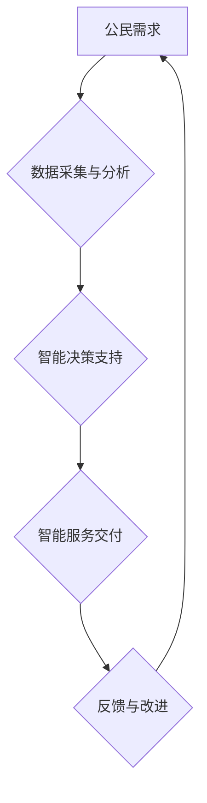

                 

## 2050年的数字治理：从电子政务到数字政府的转型升级

> 关键词：数字治理、电子政务、数字政府、人工智能、区块链、数据安全、公民参与、智能合约、去中心化

### 1. 背景介绍

21世纪以来，信息技术飞速发展，深刻地改变了人类社会各个方面。在政府治理领域，电子政务的兴起为政府服务提供了新的平台和模式，极大地提高了政府效率和服务水平。然而，随着技术的不断进步，电子政务已逐渐难以满足日益复杂的需求。2050年，数字治理将迎来新的发展阶段，从传统的电子政务向更加智能化、协同化、透明化的数字政府转型升级。

### 2. 核心概念与联系

**2.1 电子政务与数字政府**

电子政务是指政府利用信息技术手段，提供公共服务、开展行政管理、促进社会治理的活动。它主要侧重于政府内部流程的优化和对外服务的数字化。数字政府则更加注重政府与公民、企业、社会组织之间的互动和协同，构建一个更加开放、透明、高效的治理体系。

**2.2 数字治理的架构**

数字治理的架构主要包括以下几个方面：

* **数据基础设施：** 建立安全可靠、高效便捷的数据存储、处理和分析平台，为数字政府提供数据支撑。
* **智能应用平台：** 利用人工智能、大数据等技术，开发智能化政务服务、决策支持系统、风险预警系统等，提升政府服务水平和治理能力。
* **协同治理机制：** 建立政府、公民、企业、社会组织之间的协同治理机制，促进多方参与、共同治理。
* **数字安全保障体系：** 建立完善的数字安全保障体系，保障数字政府的稳定运行和数据安全。

**2.3 数字治理的流程图**



### 3. 核心算法原理 & 具体操作步骤

**3.1 算法原理概述**

数字治理的核心算法主要包括：

* **机器学习算法：** 用于分析海量数据，识别模式，预测趋势，辅助政府决策。
* **自然语言处理算法：** 用于理解和处理自然语言文本，例如公民意见反馈、舆情监测等。
* **区块链技术：** 用于构建安全、透明、不可篡改的数据记录系统，保障数据安全和治理透明度。

**3.2 算法步骤详解**

以机器学习算法为例，其具体操作步骤如下：

1. **数据收集与预处理：** 收集相关数据，并进行清洗、转换、特征提取等预处理工作。
2. **模型选择与训练：** 根据具体问题选择合适的机器学习模型，并利用训练数据训练模型参数。
3. **模型评估与优化：** 利用测试数据评估模型性能，并根据评估结果调整模型参数，优化模型效果。
4. **模型部署与应用：** 将训练好的模型部署到生产环境中，用于实际决策支持或服务交付。

**3.3 算法优缺点**

* **优点：** 能够自动学习数据规律，提高决策效率和准确性；能够处理海量数据，发现隐藏的模式和趋势。
* **缺点：** 需要大量数据进行训练，训练过程耗时；模型解释性较差，难以理解模型决策逻辑；容易受到数据偏差的影响。

**3.4 算法应用领域**

* **政府决策支持：** 利用机器学习算法分析社会经济数据，预测未来趋势，辅助政府制定政策。
* **公共服务优化：** 利用自然语言处理算法分析公民意见反馈，改进公共服务质量。
* **风险预警与防控：** 利用机器学习算法分析社会风险数据，预警潜在风险，及时采取防控措施。

### 4. 数学模型和公式 & 详细讲解 & 举例说明

**4.1 数学模型构建**

数字治理的数学模型可以根据具体问题进行构建，例如：

* **政府服务效率模型：** 可以利用队列论、网络流算法等建模，分析政府服务流程，优化资源配置，提高服务效率。
* **公民满意度模型：** 可以利用满意度调查数据、社会舆情数据等构建模型，预测公民对政府服务的满意度，并根据模型结果改进服务内容和方式。

**4.2 公式推导过程**

以政府服务效率模型为例，其核心公式可以表示为：

$$
\text{服务效率} = \frac{\text{服务量}}{\text{服务时间}}
$$

其中：

* 服务量：指政府在一定时间内完成的服务数量。
* 服务时间：指政府完成一项服务所需的时间。

**4.3 案例分析与讲解**

假设一个政府部门提供在线办理业务服务，其服务量为每天1000件，平均服务时间为5分钟。则其服务效率为：

$$
\text{服务效率} = \frac{1000}{5/60} = 12000 \text{件/小时}
$$

通过分析服务流程，发现排队等待时间是影响服务效率的主要因素。可以通过优化排队机制、增加服务窗口数量等方式提高服务效率。

### 5. 项目实践：代码实例和详细解释说明

**5.1 开发环境搭建**

数字治理项目开发环境通常包括：

* 操作系统：Linux、Windows等
* 编程语言：Python、Java等
* 数据库：MySQL、MongoDB等
* 云计算平台：AWS、Azure等

**5.2 源代码详细实现**

以利用机器学习算法进行政府决策支持为例，其源代码实现可以参考以下示例：

```python
# 导入必要的库
import pandas as pd
from sklearn.model_selection import train_test_split
from sklearn.linear_model import LogisticRegression

# 加载数据
data = pd.read_csv("government_data.csv")

# 数据预处理
X = data.drop("target", axis=1)
y = data["target"]

# 将数据划分为训练集和测试集
X_train, X_test, y_train, y_test = train_test_split(X, y, test_size=0.2)

# 训练模型
model = LogisticRegression()
model.fit(X_train, y_train)

# 模型评估
accuracy = model.score(X_test, y_test)
print("模型准确率:", accuracy)

# 模型预测
new_data = pd.DataFrame({"feature1": [1], "feature2": [2]})
prediction = model.predict(new_data)
print("预测结果:", prediction)
```

**5.3 代码解读与分析**

* 该代码首先导入必要的库，然后加载政府数据。
* 数据预处理包括特征选择和数据划分。
* 训练模型使用逻辑回归算法，并评估模型性能。
* 最后，使用训练好的模型对新数据进行预测。

**5.4 运行结果展示**

运行结果会显示模型的准确率和对新数据的预测结果。

### 6. 实际应用场景

**6.1 智慧城市建设**

数字治理可以助力智慧城市建设，例如：

* 利用大数据分析城市交通流量，优化交通信号灯控制，缓解交通拥堵。
* 利用物联网技术监测城市环境质量，及时预警环境污染问题。
* 利用人工智能技术提供智能客服，提高市民办事效率。

**6.2 公共安全保障**

数字治理可以加强公共安全保障，例如：

* 利用视频监控和人工智能技术识别犯罪嫌疑人，提高治安防控水平。
* 利用大数据分析社会风险数据，预警潜在安全隐患。
* 利用区块链技术构建安全可靠的公共安全信息共享平台。

**6.3 医疗卫生服务**

数字治理可以提升医疗卫生服务水平，例如：

* 利用电子病历系统实现医疗信息共享，提高医疗服务效率。
* 利用人工智能技术辅助医生诊断疾病，提高诊断准确率。
* 利用远程医疗技术提供便捷的医疗服务，缩短医疗服务距离。

**6.4 未来应用展望**

未来，数字治理将更加智能化、个性化、协同化。例如：

* 利用人工智能技术实现政府服务的个性化定制，满足不同公民的需求。
* 利用区块链技术构建更加透明、可信的治理体系，增强公民参与度。
* 利用虚拟现实、增强现实等技术打造沉浸式数字政府服务体验。

### 7. 工具和资源推荐

**7.1 学习资源推荐**

* **书籍：** 《数字治理：理论与实践》、《人工智能与社会治理》
* **在线课程：** Coursera、edX等平台提供数字治理、人工智能、区块链等相关课程。
* **学术期刊：** 《计算机研究与发展》、《中国科学报》等期刊发表数字治理相关研究成果。

**7.2 开发工具推荐**

* **编程语言：** Python、Java、C++等
* **数据库：** MySQL、MongoDB、PostgreSQL等
* **云计算平台：** AWS、Azure、阿里云等
* **机器学习框架：** TensorFlow、PyTorch、Scikit-learn等

**7.3 相关论文推荐**

* **数字治理的理论框架：** 《数字治理：概念、理论和实践》
* **数字治理的应用案例：** 《数字政府：案例研究》
* **数字治理的未来趋势：** 《数字治理：挑战与机遇》

### 8. 总结：未来发展趋势与挑战

**8.1 研究成果总结**

数字治理的研究取得了显著成果，为政府治理提供了新的思路和方法。

**8.2 未来发展趋势**

未来，数字治理将朝着更加智能化、协同化、透明化的方向发展。

**8.3 面临的挑战**

数字治理面临着数据安全、隐私保护、技术伦理等挑战。

**8.4 研究展望**

未来研究需要关注数字治理的伦理问题、社会影响以及可持续发展。

### 9. 附录：常见问题与解答

**9.1 数据安全保障**

数字治理需要建立完善的数据安全保障体系，保障数据安全和公民隐私。

**9.2 算法透明度**

数字治理算法的透明度需要提高，以便公众能够理解算法决策逻辑。

**9.3 公民参与**

数字治理需要鼓励公民参与，构建更加民主、透明的治理体系。


作者：禅与计算机程序设计艺术 / Zen and the Art of Computer Programming 
<end_of_turn>

