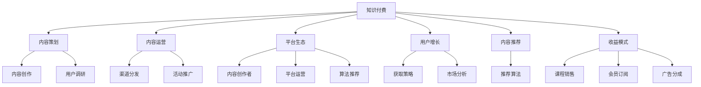

                 

# 打造知识付费专栏:内容策划与运营

> 关键词：知识付费,内容策划,内容运营,平台生态,用户增长,内容推荐,收益模式

## 1. 背景介绍

### 1.1 问题由来

近年来，知识付费市场蓬勃发展，成为新兴的互联网商业形态。内容付费不仅仅是简单的课程销售，更是知识变现的重要手段。随着在线教育、智能客服、自媒体等互联网业务的兴起，知识付费市场面临新的发展机遇。知识付费平台需要深耕内容生态，为用户提供丰富、高质、个性化的知识内容，实现业务的快速增长和可持续发展。

### 1.2 问题核心关键点

知识付费专栏的内容策划与运营，是平台生态建设的核心环节。高质量内容的制作和传播，可以提升用户体验，扩大用户基础，驱动平台的商业化进程。但内容策划与运营并非简单的内容聚合与分发，而是一个复杂的系统工程，涉及内容创作、用户需求分析、渠道分发、收益分配等多个维度。如何高效运营知识付费专栏，实现业务闭环，提升整体平台价值，是当前知识付费平台亟待解决的问题。

### 1.3 问题研究意义

解决知识付费专栏的内容策划与运营问题，对于平台生态建设、用户增长、收益模式创新具有重要意义：

1. 提升用户体验。高质量的内容能够满足用户深层次的需求，提升用户满意度和粘性，增加平台的忠诚度。
2. 扩大用户基础。吸引并留住更多新用户，提高平台的流量和活跃度，增强平台的市场竞争力。
3. 驱动商业化进程。通过优化内容生态，实现平台的商业化变现，增加平台的收入来源。
4. 强化平台品牌。优质的内容能够提升平台的品牌形象，增强用户对平台的信任感和推荐性。
5. 实现多方共赢。通过合理分配收益，实现内容创作者、平台、用户之间的共赢局面，构建健康的内容生态。

## 2. 核心概念与联系

### 2.1 核心概念概述

为更好地理解知识付费专栏的内容策划与运营方法，本节将介绍几个密切相关的核心概念：

- 知识付费(Content Paywall)：指用户需要付费获取高质量的知识内容，包括在线课程、电子书、视频讲座等。知识付费平台通过内容聚集、营销推广、用户付费等方式实现商业变现。
- 内容策划(Content Planning)：指根据用户需求和平台定位，选择合适的知识内容进行策划和生产的过程。内容策划是知识付费平台的核心竞争力之一。
- 内容运营(Content Operation)：指通过多种渠道分发和推广内容，提高内容的曝光率和点击率，吸引用户付费购买，从而实现商业化目标。
- 平台生态(Ecosystem)：指围绕知识付费平台构建的完整内容生态系统，包括内容创作者、付费用户、平台运营、推荐算法等多个环节，共同构建良性的商业循环。
- 用户增长(User Acquisition)：指通过各种手段吸引新用户注册和使用平台，提高平台的用户基础和市场份额。用户增长是知识付费平台的关键目标之一。
- 内容推荐(Content Recommendation)：指利用算法技术，根据用户行为和兴趣，推荐适合的内容，提高用户的使用粘性，增加平台收益。内容推荐是提升用户留存率的关键手段。
- 收益模式(Revenue Model)：指知识付费平台的盈利方式，包括课程销售、会员订阅、广告分成等多种形式。选择合适的收益模式，有助于平台的长远发展。

这些核心概念之间的逻辑关系可以通过以下Mermaid流程图来展示：



这个流程图展示的知识付费专栏核心概念及其之间的关系：

1. 知识付费是平台的核心商业模式，通过内容创作和用户付费实现变现。
2. 内容策划是核心竞争力，通过用户调研和内容创作，生产高质量内容。
3. 内容运营是实现商业化的重要手段，通过渠道分发和活动推广，吸引用户付费。
4. 平台生态是用户增长的重要支撑，内容创作者、平台运营和推荐算法共同构建良性循环。
5. 用户增长是商业化的关键目标，通过各种手段获取和留存用户。
6. 内容推荐是提升用户粘性的关键手段，通过推荐算法实现个性化服务。
7. 收益模式是平台盈利的基础，选择合适的盈利方式，实现可持续发展。

这些概念共同构成了知识付费专栏的内容策划与运营框架，使其能够更好地满足用户需求，实现商业化目标。

## 3. 核心算法原理 & 具体操作步骤
### 3.1 算法原理概述

知识付费专栏的内容策划与运营，本质上是一个多目标优化问题。平台需要综合考虑内容质量、用户需求、运营成本、收益模式等多个因素，制定合理的策略。

### 3.2 算法步骤详解

知识付费专栏的内容策划与运营，一般包括以下几个关键步骤：

**Step 1: 用户需求分析**
- 通过问卷调查、用户反馈、社交媒体等多种手段，收集用户对于知识内容的需求和偏好。
- 分析用户画像和行为数据，挖掘用户的潜在需求和未满足的场景。

**Step 2: 内容创作与策划**
- 根据用户需求和平台定位，选择合适的知识内容进行策划和生产。
- 邀请知名专家学者、行业领袖、经验丰富的专业人士参与内容创作，确保内容的权威性和实用性。
- 设计内容格式和结构，制作音频、视频、图文等多种形式的课程，丰富用户体验。

**Step 3: 内容分发与推广**
- 利用多种渠道分发内容，如平台自有频道、社交媒体、广告投放等。
- 设计吸引眼球的标题和介绍，吸引用户点击和购买。
- 通过活动促销、用户推荐等手段，提高内容的曝光率和点击率。

**Step 4: 内容推荐与个性化**
- 利用推荐算法，根据用户行为和兴趣，推荐适合的内容。
- 实时监测内容表现，优化推荐算法，提高用户使用粘性。

**Step 5: 收益模式设计**
- 根据平台特点和用户需求，选择合适的收益模式，如课程销售、会员订阅、广告分成等。
- 设计合理的定价策略，吸引用户付费。

**Step 6: 用户增长与留存**
- 制定用户获取策略，通过免费试用、会员优惠、推荐有奖等多种手段，吸引新用户注册和使用平台。
- 设计用户体验，提高用户满意度和粘性，减少用户流失。

### 3.3 算法优缺点

知识付费专栏的内容策划与运营方法具有以下优点：

1. 用户导向性强。通过用户需求分析，生产符合用户期望的内容，提升用户满意度。
2. 内容多样化。利用多种形式的内容，满足不同用户的需求和偏好。
3. 运营灵活性高。通过内容推荐和个性化服务，提升用户使用粘性，提高平台流量和活跃度。
4. 收益模式多样。根据平台特点和市场环境，设计合理的收益模式，实现商业化目标。
5. 市场响应快。通过快速迭代和优化，及时响应市场变化，保持平台的竞争力和创新性。

同时，该方法也存在一定的局限性：

1. 对用户调研的依赖性强。调研结果的准确性和全面性，直接影响内容策划的合理性。
2. 内容创作成本高。知名专家和专业创作者的合作成本较高，可能难以维持长期的内容输出。
3. 运营成本较大。内容分发和推广需要投入大量资源，运营成本较高。
4. 用户留存困难。用户流失是知识付费平台的常见问题，需要持续优化用户体验和留存策略。
5. 市场环境变化快。内容生态的构建和优化，需要持续关注市场变化，灵活应对。

尽管存在这些局限性，但就目前而言，内容策划与运营仍然是知识付费平台的重要方法，通过不断优化各个环节，可以实现业务闭环，提升整体平台价值。

### 3.4 算法应用领域

知识付费专栏的内容策划与运营方法，已经在在线教育、智能客服、自媒体等多个领域得到广泛应用，推动了相关业务的快速增长。

- 在线教育：各大知识付费平台通过内容策划和运营，推出各类在线课程，提升学习效果，扩大用户基础。
- 智能客服：在线客服平台通过内容运营，提供高质量的问答服务，提升用户满意度。
- 自媒体：内容创作者通过平台发布优质的文章和视频，获取流量和收益。

除了这些传统领域外，知识付费专栏的内容策划与运营，还被创新性地应用到更多场景中，如可控课程生成、跨平台协作、自适应学习等，为知识付费技术带来了新的突破。

## 4. 数学模型和公式 & 详细讲解  
### 4.1 数学模型构建

本节将使用数学语言对知识付费专栏的内容策划与运营过程进行更加严格的刻画。

设知识付费平台为 $P$，用户集为 $U$，内容集为 $C$，内容推荐算法为 $R$，收益模型为 $R$。记用户对于内容 $c$ 的兴趣程度为 $r_c$，内容 $c$ 的推荐概率为 $p_c$。

定义平台收益函数为 $\mathcal{R}(P, R) = \sum_{c \in C} r_c p_c$，目标是最小化收益函数，即找到最优的推荐算法 $R^*$：

$$
R^* = \mathop{\arg\min}_{R} \mathcal{R}(P, R)
$$

在实践中，我们通常使用基于梯度的优化算法（如SGD、Adam等）来近似求解上述最优化问题。设 $\eta$ 为学习率，$\lambda$ 为正则化系数，则推荐算法 $R$ 的更新公式为：

$$
R \leftarrow R - \eta \nabla_{R}\mathcal{R}(P, R) - \eta\lambda R
$$

其中 $\nabla_{R}\mathcal{R}(P, R)$ 为收益函数对推荐算法 $R$ 的梯度，可通过反向传播算法高效计算。

### 4.2 公式推导过程

以下我们以课程销售为例，推导推荐算法的损失函数及其梯度的计算公式。

假设课程 $c$ 的销售量 $s_c$ 与用户 $u$ 的兴趣程度 $r_u$ 成正比，定义为：

$$
s_c = \alpha r_u
$$

其中 $\alpha$ 为常数。假设课程销售收入为 $I_c$，平台需要支付课程生产成本 $C_c$，则平台收益函数为：

$$
\mathcal{R}(P, R) = \sum_{c \in C} (I_c - C_c) p_c = \sum_{c \in C} (I_c - C_c) \alpha r_u
$$

将 $p_c = R(r_u)$ 代入，得：

$$
\mathcal{R}(P, R) = \sum_{c \in C} (I_c - C_c) \alpha r_u
$$

其中 $R(r_u)$ 为推荐算法 $R$ 在用户 $u$ 上的输出，表示课程 $c$ 的推荐概率。

根据链式法则，收益函数对推荐算法 $R$ 的梯度为：

$$
\frac{\partial \mathcal{R}(P, R)}{\partial R} = \sum_{c \in C} (I_c - C_c) \alpha \nabla_{R(r_u)} r_u
$$

将 $r_u = \sum_{c \in C} p_c$ 代入，得：

$$
\frac{\partial \mathcal{R}(P, R)}{\partial R} = \sum_{c \in C} (I_c - C_c) \alpha \nabla_{R(r_u)} \sum_{c \in C} p_c
$$

在得到推荐算法的梯度后，即可带入梯度更新公式，完成推荐算法的迭代优化。重复上述过程直至收敛，最终得到适应平台用户需求的推荐算法 $R^*$。

## 5. 项目实践：代码实例和详细解释说明
### 5.1 开发环境搭建

在进行知识付费专栏的内容策划与运营实践前，我们需要准备好开发环境。以下是使用Python进行TensorFlow开发的环境配置流程：

1. 安装Anaconda：从官网下载并安装Anaconda，用于创建独立的Python环境。

2. 创建并激活虚拟环境：
```bash
conda create -n tf-env python=3.8 
conda activate tf-env
```

3. 安装TensorFlow：根据CUDA版本，从官网获取对应的安装命令。例如：
```bash
conda install tensorflow -c tf -c conda-forge
```

4. 安装各类工具包：
```bash
pip install numpy pandas scikit-learn matplotlib tqdm jupyter notebook ipython
```

完成上述步骤后，即可在`tf-env`环境中开始内容策划与运营实践。

### 5.2 源代码详细实现

这里我们以课程销售为例，给出使用TensorFlow进行推荐算法的PyTorch代码实现。

首先，定义推荐算法的损失函数：

```python
import tensorflow as tf
from tensorflow.keras.losses import MeanSquaredError

# 定义损失函数
def recommendation_loss(y_true, y_pred):
    loss = MeanSquaredError()(y_true, y_pred)
    return loss
```

然后，定义优化器：

```python
from tensorflow.keras.optimizers import Adam

# 定义优化器
optimizer = Adam(learning_rate=0.01)
```

接着，定义模型和数据集：

```python
# 定义推荐模型
model = tf.keras.Sequential([
    tf.keras.layers.Dense(64, activation='relu', input_shape=(3,)),
    tf.keras.layers.Dense(1, activation='sigmoid')
])

# 准备数据集
train_data = tf.data.Dataset.from_tensor_slices(([3, 4, 5], [0.6, 0.7, 0.8]))
test_data = tf.data.Dataset.from_tensor_slices(([2, 3, 4], [0.5, 0.6, 0.7]))

# 数据集预处理
train_dataset = train_data.shuffle(1024).batch(32)
test_dataset = test_data.batch(32)
```

最后，启动训练流程并在测试集上评估：

```python
# 训练模型
model.compile(optimizer=optimizer, loss=recommendation_loss, metrics=['mae'])
model.fit(train_dataset, epochs=10)

# 评估模型
model.evaluate(test_dataset)
```

以上就是使用TensorFlow进行课程销售推荐算法的完整代码实现。可以看到，TensorFlow提供了丰富的优化器、损失函数和模型接口，大大简化了推荐算法的开发过程。

### 5.3 代码解读与分析

让我们再详细解读一下关键代码的实现细节：

**RecommendationLoss函数**：
- 定义了课程销售推荐的损失函数，使用了均方误差（Mean Squared Error, MSE），计算预测值与真实值之间的差异。

**Adam优化器**：
- 定义了Adam优化器，学习率为0.01，使用梯度下降法更新模型参数。

**Sequential模型**：
- 定义了一个简单的神经网络模型，包含两个全连接层，用于计算课程推荐的概率。

**Dataset数据集**：
- 通过TensorFlow的Dataset API，定义了训练集和测试集，包含用户特征和课程推荐的样本数据。
- 数据集预处理使用了Shuffle和Batch，以提高训练效率和模型性能。

**模型训练与评估**：
- 使用compile函数定义了优化器和损失函数，训练模型10个epoch。
- 使用evaluate函数在测试集上评估模型表现，返回MAE（均方误差）指标。

可以看到，TensorFlow提供了丰富的工具和接口，使得推荐算法的实现变得简洁高效。开发者可以通过这些工具，快速迭代和优化推荐模型，实现业务闭环。

当然，工业级的系统实现还需考虑更多因素，如模型的保存和部署、超参数的自动搜索、更灵活的任务适配层等。但核心的推荐范式基本与此类似。

## 6. 实际应用场景
### 6.1 在线教育

在线教育平台通过内容策划与运营，提供各类在线课程，满足用户的学习需求，扩大用户基础。平台通过用户调研和内容创作，生产高质量课程，吸引用户付费购买。在运营过程中，利用推荐算法，根据用户行为和兴趣，推荐适合的课程，提升用户使用粘性，实现商业化变现。

### 6.2 智能客服

在线客服平台通过内容运营，提供高质量的问答服务，提升用户满意度。平台利用推荐算法，根据用户问题特征，推荐合适的回答和解决方案，提高问题解决效率，减少客服人员的负担。同时，平台还可以收集用户反馈，持续优化推荐算法和内容质量，实现用户留存和忠诚度的提升。

### 6.3 自媒体

内容创作者通过平台发布优质的文章和视频，获取流量和收益。平台通过内容推荐，根据用户兴趣和行为，推荐适合的自媒体内容，提升用户使用粘性，增加平台的流量和活跃度。平台还可以通过用户付费、广告分成等多种收益模式，实现商业化目标。

### 6.4 未来应用展望

随着知识付费市场的发展，内容策划与运营将面临新的机遇和挑战。未来，基于推荐算法的知识付费专栏，将更加注重个性化和精准度，提升用户体验和满意度。

1. 数据驱动：利用大数据和AI技术，深入挖掘用户需求和行为特征，实现更精准的内容推荐。
2. 内容多样化：根据不同用户的需求，提供多种形式的内容，如音频、视频、图文等，满足用户的不同偏好。
3. 用户互动：通过社交互动和社区建设，提升用户参与度和粘性，形成良好的内容生态。
4. 跨平台整合：实现跨平台的内容分发和运营，扩大平台的影响力和市场份额。
5. 收益模式创新：探索新的收益模式，如知识图谱、知识服务、付费问答等，实现多元化的商业变现。

## 7. 工具和资源推荐
### 7.1 学习资源推荐

为了帮助开发者系统掌握知识付费专栏的内容策划与运营的理论基础和实践技巧，这里推荐一些优质的学习资源：

1. 《内容策展的互联网产品实践》系列博文：由知名产品经理撰写，深入浅出地介绍了内容策展的核心原理和落地方法。

2. 《互联网产品运营》课程：豆瓣知名运营专家开设的课程，详细讲解了互联网产品运营的关键点和方法，适合产品经理、运营经理等从业者。

3. 《推荐系统实战》书籍：推荐系统领域的经典著作，系统介绍了推荐算法的基本原理和实现方法，适合算法工程师和数据科学家。

4. 《用户增长：产品运营篇》书籍：讲解了用户增长的核心方法论和实战案例，适合产品运营和市场推广从业者。

5. Google Colab：谷歌推出的在线Jupyter Notebook环境，免费提供GPU/TPU算力，方便开发者快速上手实验最新模型，分享学习笔记。

通过对这些资源的学习实践，相信你一定能够快速掌握知识付费专栏的内容策划与运营精髓，并用于解决实际的运营问题。

### 7.2 开发工具推荐

高效的开发离不开优秀的工具支持。以下是几款用于知识付费专栏开发和运营的常用工具：

1. TensorFlow：由Google主导开发的开源深度学习框架，生产部署方便，适合大规模工程应用。
2. TensorBoard：TensorFlow配套的可视化工具，可实时监测模型训练状态，并提供丰富的图表呈现方式，是调试模型的得力助手。
3. Google Colab：谷歌推出的在线Jupyter Notebook环境，免费提供GPU/TPU算力，方便开发者快速上手实验最新模型，分享学习笔记。
4. Kaggle：全球最大的数据科学竞赛平台，提供丰富的数据集和竞赛机会，适合数据科学家和机器学习从业者。
5. Jupyter Notebook：开源的交互式编程环境，支持多种编程语言，方便开发者快速迭代和实验。

合理利用这些工具，可以显著提升知识付费专栏的开发效率，加快创新迭代的步伐。

### 7.3 相关论文推荐

知识付费专栏的内容策划与运营技术的发展源于学界的持续研究。以下是几篇奠基性的相关论文，推荐阅读：

1. The Interplay between Item and Context Relevance in Recommendation Systems：研究了物品与上下文的相关性对推荐算法的影响，提出了新的推荐方法。
2. Recommender Systems Handbook：推荐系统领域的经典手册，详细介绍了推荐算法的多种方法和优化策略。
3. Collaborative Filtering Techniques for Recommender Systems：介绍了协同过滤推荐算法的原理和实现方法，是推荐系统的入门经典。
4. Adaptive Context-aware Recommendation Systems：研究了上下文感知推荐算法，提出了一种自适应上下文感知推荐模型。
5. Mining Social Preferences for Recommendations：研究了社交网络中的用户推荐问题，提出了新的推荐方法。

这些论文代表了大语言模型微调技术的发展脉络。通过学习这些前沿成果，可以帮助研究者把握学科前进方向，激发更多的创新灵感。

## 8. 总结：未来发展趋势与挑战

### 8.1 总结

本文对知识付费专栏的内容策划与运营方法进行了全面系统的介绍。首先阐述了知识付费市场的发展背景和平台运营的核心问题，明确了内容策划与运营在平台生态建设中的重要性。其次，从原理到实践，详细讲解了推荐算法的数学模型和操作步骤，给出了推荐算法的完整代码实例。同时，本文还广泛探讨了推荐算法在在线教育、智能客服、自媒体等多个行业领域的应用前景，展示了推荐算法的巨大潜力。此外，本文精选了推荐算法的各类学习资源，力求为读者提供全方位的技术指引。

通过本文的系统梳理，可以看到，推荐算法作为知识付费专栏的核心技术，正在成为平台生态建设的重要工具。推荐算法能够通过个性化服务，提升用户体验和满意度，扩大平台的用户基础和市场份额。推荐算法的不断优化和创新，也将推动知识付费平台不断提升竞争力，实现可持续发展。

### 8.2 未来发展趋势

展望未来，知识付费专栏的推荐算法将呈现以下几个发展趋势：

1. 数据驱动：利用大数据和AI技术，深入挖掘用户需求和行为特征，实现更精准的推荐。
2. 内容多样化：根据不同用户的需求，提供多种形式的内容，满足用户的不同偏好。
3. 用户互动：通过社交互动和社区建设，提升用户参与度和粘性，形成良好的内容生态。
4. 跨平台整合：实现跨平台的内容分发和运营，扩大平台的影响力和市场份额。
5. 收益模式创新：探索新的收益模式，如知识图谱、知识服务、付费问答等，实现多元化的商业变现。

这些趋势凸显了知识付费平台推荐算法的广阔前景。这些方向的探索发展，将进一步提升推荐算法的效果和适用性，为知识付费平台带来更大的商业价值。

### 8.3 面临的挑战

尽管知识付费专栏的推荐算法已经取得了瞩目成就，但在迈向更加智能化、普适化应用的过程中，它仍面临着诸多挑战：

1. 用户调研的准确性。调研结果的准确性和全面性，直接影响推荐算法的合理性。
2. 内容创作成本高。知名专家和专业创作者的合作成本较高，可能难以维持长期的内容输出。
3. 运营成本较大。内容分发和推广需要投入大量资源，运营成本较高。
4. 用户留存困难。用户流失是知识付费平台的常见问题，需要持续优化用户体验和留存策略。
5. 市场环境变化快。内容生态的构建和优化，需要持续关注市场变化，灵活应对。

尽管存在这些挑战，但推荐算法作为知识付费平台的重要技术，仍然具有广阔的应用前景。通过不断优化各个环节，可以最大限度地发挥推荐算法的优势，实现业务闭环，提升整体平台价值。

### 8.4 研究展望

面向未来，知识付费专栏的推荐算法需要在以下几个方面寻求新的突破：

1. 探索无监督和半监督推荐方法。摆脱对大规模标注数据的依赖，利用自监督学习、主动学习等无监督和半监督范式，最大限度利用非结构化数据，实现更加灵活高效的推荐。
2. 研究参数高效和计算高效的推荐范式。开发更加参数高效的推荐方法，在固定大部分推荐算法参数的情况下，只更新极少量的任务相关参数。同时优化推荐算法的计算图，减少前向传播和反向传播的资源消耗，实现更加轻量级、实时性的部署。
3. 引入因果和对比学习范式。通过引入因果推断和对比学习思想，增强推荐算法建立稳定因果关系的能力，学习更加普适、鲁棒的内容表征，从而提升推荐算法的泛化性和抗干扰能力。
4. 结合因果分析和博弈论工具。将因果分析方法引入推荐算法，识别出推荐决策的关键特征，增强推荐算法的可解释性和稳定性。借助博弈论工具刻画人机交互过程，主动探索并规避推荐算法的脆弱点，提高系统稳定性。
5. 纳入伦理道德约束。在推荐算法训练目标中引入伦理导向的评估指标，过滤和惩罚有害的内容输出倾向。同时加强人工干预和审核，建立推荐算法的监管机制，确保推荐的健康性和安全性。

这些研究方向的探索，必将引领知识付费平台推荐算法迈向更高的台阶，为构建安全、可靠、可解释、可控的智能系统铺平道路。面向未来，推荐算法还需要与其他人工智能技术进行更深入的融合，如知识表示、因果推理、强化学习等，多路径协同发力，共同推动知识付费平台的进步。

## 9. 附录：常见问题与解答

**Q1：知识付费专栏的收益模式有哪些？**

A: 知识付费专栏的收益模式主要有以下几种：
1. 课程销售：通过售卖课程，直接获取收益。适用于付费课程较多的平台。
2. 会员订阅：提供会员订阅服务，用户可以以较低价格获得课程和资讯。适用于需要持续内容输出的平台。
3. 广告分成：通过引入广告，获取广告分成收益。适用于流量较大的平台。
4. 付费问答：提供付费问答服务，用户可以付费获取专家解答。适用于特定领域的问答平台。
5. 知识图谱：通过构建知识图谱，提供知识检索和智能推荐服务，获取知识服务费。

不同的收益模式适合不同的平台和用户需求，选择合适的收益模式，有助于平台实现商业化目标。

**Q2：如何优化推荐算法的参数？**

A: 优化推荐算法的参数，通常需要结合业务需求和用户反馈，进行不断迭代和调优。具体方法包括：
1. 数据驱动：利用大数据和用户行为数据，深入挖掘用户需求和行为特征，调整推荐算法参数。
2. 用户反馈：通过用户反馈和评价，及时调整推荐算法，提升用户体验。
3. 模型调优：通过超参数调优、正则化、Dropout等技术，提升推荐算法的稳定性和鲁棒性。
4. A/B测试：通过A/B测试，对比不同推荐算法的表现，选择最优的算法参数。
5. 定期更新：根据市场变化和用户需求，定期更新推荐算法，保持算法的最新性和适用性。

通过不断优化推荐算法参数，可以提升推荐算法的效果和适用性，实现更好的商业化变现。

**Q3：推荐算法如何应对冷启动问题？**

A: 推荐算法在面对新用户或新内容时，往往会遇到冷启动问题，即难以产生有效推荐。常用的应对方法包括：
1. 推荐通用内容：通过推荐一些通用的、高质量的内容，吸引新用户注册和使用平台。
2. 用户画像：利用用户调研和行为分析，构建用户画像，实现精准推荐。
3. 协同过滤：利用协同过滤算法，根据新用户的类似用户行为，推荐相关内容。
4. 知识图谱：通过构建知识图谱，根据新内容的属性和上下文关系，推荐相关内容。
5. 时间戳：利用时间戳和动态数据，推荐与当前时间相近的内容。

这些方法可以在一定程度上缓解冷启动问题，提高推荐算法的效果和适用性。

**Q4：知识付费专栏的内容创作与运营有哪些关键步骤？**

A: 知识付费专栏的内容创作与运营，一般包括以下几个关键步骤：
1. 用户需求分析：通过问卷调查、用户反馈、社交媒体等多种手段，收集用户对于知识内容的需求和偏好。
2. 内容创作与策划：根据用户需求和平台定位，选择合适的知识内容进行策划和生产。邀请知名专家学者、行业领袖、经验丰富的专业人士参与内容创作，确保内容的权威性和实用性。设计内容格式和结构，制作音频、视频、图文等多种形式的课程，丰富用户体验。
3. 内容分发与推广：利用多种渠道分发内容，如平台自有频道、社交媒体、广告投放等。设计吸引眼球的标题和介绍，吸引用户点击和购买。通过活动促销、用户推荐等手段，提高内容的曝光率和点击率。
4. 内容推荐与个性化：利用推荐算法，根据用户行为和兴趣，推荐适合的内容。实时监测内容表现，优化推荐算法，提高用户使用粘性。
5. 收益模式设计：根据平台特点和用户需求，选择合适的收益模式，如课程销售、会员订阅、广告分成等。设计合理的定价策略，吸引用户付费。
6. 用户增长与留存：制定用户获取策略，通过免费试用、会员优惠、推荐有奖等多种手段，吸引新用户注册和使用平台。设计用户体验，提高用户满意度和粘性，减少用户流失。

这些步骤共同构成了知识付费专栏的内容创作与运营框架，使其能够更好地满足用户需求，实现商业化目标。

**Q5：推荐算法如何提高用户留存率？**

A: 推荐算法提高用户留存率，通常需要综合考虑用户行为和需求，采取多种策略：
1. 个性化推荐：利用推荐算法，根据用户兴趣和行为，推荐适合的内容，提升用户使用粘性。
2. 内容多样化：根据不同用户的需求，提供多种形式的内容，满足用户的不同偏好。
3. 用户互动：通过社交互动和社区建设，提升用户参与度和粘性，形成良好的内容生态。
4. 奖励机制：通过奖励机制，如积分、优惠券、会员特权等，激励用户持续使用平台。
5. 反馈机制：通过用户反馈和评价，及时调整推荐算法，提升用户体验。
6. 定期更新：根据市场变化和用户需求，定期更新内容，保持内容的活跃性和吸引力。

这些策略可以在一定程度上提高用户留存率，增强平台的用户粘性和忠诚度。

---

作者：禅与计算机程序设计艺术 / Zen and the Art of Computer Programming

