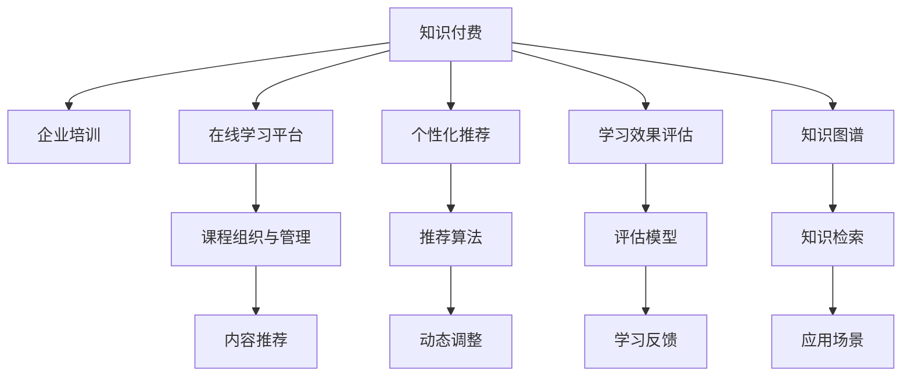

                 

# 打造知识付费的企业培训解决方案

在数字化时代，企业培训成为提升员工技能和组织效能的关键手段。随着知识付费市场的蓬勃发展，将知识付费技术与企业培训相融合，不仅能为企业带来更高的投资回报，还能帮助员工快速掌握新技能，增强职业竞争力。本文将从核心概念、技术实现、应用场景等多个维度，深入探讨如何利用知识付费构建高效的企业培训解决方案。

## 1. 背景介绍

### 1.1 问题由来

随着人工智能、大数据、云计算等新兴技术的飞速发展，传统企业培训模式面临巨大挑战。一方面，面对多变的市场和技术，企业需要不断更新员工技能，但传统的面对面培训周期长、成本高、效果有限；另一方面，员工自主学习需求日益增长，他们希望通过更灵活、高效的方式获取知识，而非仅依赖公司内训。

知识付费市场正是应运而生。通过按需付费的方式，企业员工可以随时随地获取海量在线课程，加速学习效率，提升知识水平。因此，将知识付费技术应用于企业培训，成为大势所趋。

### 1.2 问题核心关键点

知识付费与企业培训的结合，本质上是一个以内容为核心的在线学习系统构建过程。其核心在于如何有效组织和管理海量课程资源，实现个性化推荐，同时对员工学习行为进行科学评估，从而构建高效、精准的企业培训解决方案。

关键点包括：

- 课程内容的有效组织和管理。
- 个性化推荐算法的科学设计。
- 学习效果评估机制的合理构建。
- 学习路径的动态调整。
- 用户行为数据的有效利用。

## 2. 核心概念与联系

### 2.1 核心概念概述

为更好地理解知识付费在企业培训中的应用，本节将介绍几个密切相关的核心概念：

- **知识付费**：指用户通过付费方式获取知识内容的服务模式，常见形式包括在线课程、电子书、音频视频等。

- **企业培训**：指企业为提升员工技能和知识水平，有组织地开展的各类教育培训活动，包括内训、外训、在线培训等。

- **在线学习平台**：指基于互联网的在线课程平台，用户通过平台自主学习，具有随时随地、自主选择的灵活性。

- **个性化推荐**：指根据用户的历史学习行为和偏好，推荐最适合的课程内容，提升学习效果。

- **学习效果评估**：指通过科学的方法对用户学习成果进行量化评估，反映培训效果，指导课程调整。

- **知识图谱**：指将各类知识元素进行结构化组织，形成有机的知识网络，便于知识检索和应用。

这些概念之间的逻辑关系可以通过以下Mermaid流程图来展示：



这个流程图展示了一些核心概念及其之间的关系：

1. 知识付费是企业培训的基础，在线学习平台是知识付费的主要载体。
2. 个性化推荐和课程组织与管理，是提升学习效果的关键环节。
3. 学习效果评估和动态调整，是优化课程和个性化推荐的重要依据。
4. 知识图谱和知识检索，有助于知识内容的结构化组织，提升知识应用效率。

这些概念共同构成了知识付费与企业培训的融合框架，使得企业能够高效构建个性化学习路径，提升员工的知识水平和职业能力。

## 3. 核心算法原理 & 具体操作步骤

### 3.1 算法原理概述

知识付费与企业培训的结合，需要构建一个能够高效组织、推荐和管理课程的在线学习系统。其核心算法包括个性化推荐算法、学习效果评估模型和动态调整机制。

- **个性化推荐算法**：根据用户的历史学习行为和偏好，推荐最合适的课程内容。常用的推荐算法包括协同过滤、基于内容的推荐、深度学习等。

- **学习效果评估模型**：通过科学的方法对用户学习成果进行量化评估，如测试成绩、项目完成度、用户反馈等。常用的评估方法包括KNN、回归分析、分类算法等。

- **动态调整机制**：根据学习效果评估结果，动态调整课程内容、推荐算法和个性化推荐策略，以适应用户的不断变化的需求。

### 3.2 算法步骤详解

构建知识付费的企业培训解决方案，一般包括以下关键步骤：

**Step 1: 准备课程资源**

- 收集各类在线课程资源，包括视频、音频、PPT、电子书等。
- 对课程进行分类、标注和元数据整理，便于后续的推荐和检索。
- 建立知识图谱，将课程内容和知识元素进行结构化组织，形成知识网络。

**Step 2: 设计推荐算法**

- 选择合适的推荐算法，如协同过滤、基于内容的推荐、深度学习等。
- 根据用户历史行为数据，进行模型训练和参数调优。
- 在测试集上进行评估，优化模型性能。

**Step 3: 构建学习效果评估模型**

- 设计学习效果评估指标，如课程完成率、测试成绩、用户满意度等。
- 收集用户学习行为数据，如学习时长、答题情况等。
- 通过机器学习或统计方法，训练学习效果评估模型。

**Step 4: 实现动态调整机制**

- 根据学习效果评估结果，筛选出效果不佳的课程和推荐算法。
- 调整推荐算法和推荐策略，重新推荐合适课程。
- 不断迭代优化，提升系统整体性能。

**Step 5: 系统部署与迭代优化**

- 将系统部署至生产环境，实时提供推荐服务。
- 定期收集用户反馈，优化推荐算法和评估模型。
- 增加新课程资源，不断扩充知识库。

### 3.3 算法优缺点

知识付费与企业培训的结合，具有以下优点：

- **灵活性高**：在线学习平台打破了时间、地点的限制，员工可以随时随地进行学习。
- **成本低**：按需付费模式，减少了企业培训的固定成本。
- **效率高**：智能推荐算法和动态调整机制，快速提升学习效率。
- **数据驱动**：通过学习效果评估，科学指导课程调整和推荐优化。

同时，也存在一些局限性：

- **内容质量参差不齐**：部分课程内容质量不高，影响学习效果。
- **个性化推荐不足**：推荐算法复杂度较高，难以完全满足个性化需求。
- **用户粘性较低**：用户自主选择性强，难以长期保持学习动力。
- **数据隐私问题**：大量用户行为数据的收集和处理，存在隐私风险。

尽管存在这些局限性，但就目前而言，知识付费与企业培训的结合仍是大势所趋。未来相关研究的主要方向在于如何进一步提升推荐算法的效果，优化课程内容，提升用户粘性，同时兼顾数据隐私保护。

### 3.4 算法应用领域

知识付费与企业培训的结合，在多个行业领域已经得到了广泛应用，例如：

- **金融行业**：金融机构通过在线课程培训，提升员工的金融知识和技能。
- **IT行业**：IT企业通过技术课程和实战项目，加速员工技能成长。
- **制造业**：制造企业通过安全培训和技能提升课程，保障安全生产和质量管理。
- **教育行业**：教育机构通过在线课程，实现课程共享和教学资源优化。
- **政府部门**：政府通过公务员培训课程，提升公共服务能力和治理水平。

除了这些经典应用外，知识付费技术也在更多领域得到应用，如医疗健康、人力资源、市场营销等，为各行业提供了知识赋能的新途径。

## 4. 数学模型和公式 & 详细讲解 & 举例说明

### 4.1 数学模型构建

本节将使用数学语言对知识付费与企业培训系统的推荐和评估算法进行更加严格的刻画。

记课程集合为 $\mathcal{C}=\{c_1,c_2,\dots,c_n\}$，用户集合为 $\mathcal{U}=\{u_1,u_2,\dots,u_m\}$，历史行为数据为 $\mathcal{D}=\{(d_{ij})_{i,j}\}$，其中 $d_{ij}$ 表示用户 $u_i$ 对课程 $c_j$ 的行为数据。

定义个性化推荐算法 $\mathcal{A}$，学习效果评估模型 $\mathcal{E}$，动态调整机制 $\mathcal{D}$，则系统工作流程可以表示为：

1. 数据预处理：对 $\mathcal{D}$ 进行清洗和标准化处理。
2. 模型训练：训练 $\mathcal{A}$ 和 $\mathcal{E}$ 的参数。
3. 推荐服务：使用 $\mathcal{A}$ 提供个性化推荐。
4. 效果评估：使用 $\mathcal{E}$ 评估学习效果。
5. 动态调整：根据 $\mathcal{E}$ 结果调整 $\mathcal{A}$ 和 $\mathcal{E}$。

### 4.2 公式推导过程

以下我们以协同过滤推荐算法为例，推导推荐公式及其优化策略。

**协同过滤算法**：

协同过滤推荐算法基于用户行为矩阵，通过找到与目标用户行为相似的其他用户，推荐其喜欢的课程。设用户行为矩阵为 $\mathcal{D}=\{d_{ij}\}$，则协同过滤推荐公式为：

$$
\hat{y}_{uj} = \frac{\sum_{i\in \mathcal{N}(u)} d_{ij} r_{ij}}{\sqrt{\sum_{i\in \mathcal{N}(u)} r_{ij}^2}}
$$

其中 $\mathcal{N}(u)$ 表示与用户 $u$ 行为相似的其他用户集合，$r_{ij}$ 为相似度函数。

**优化策略**：

为了提升推荐效果，可以使用SVD（奇异值分解）等降维技术，减少计算复杂度。同时，可以引入深度学习模型，如CFNN（协同过滤神经网络），提升推荐准确性。

### 4.3 案例分析与讲解

**案例分析**：某制造企业通过知识付费平台，为员工提供各类在线课程。企业希望通过推荐算法，提升员工培训效果。

**分析过程**：

1. 准备课程资源：收集制造行业相关的在线课程，并进行分类、标注和元数据整理。
2. 设计推荐算法：选择协同过滤算法，根据员工历史行为数据，训练推荐模型。
3. 构建学习效果评估模型：设计培训效果评估指标，如课程完成率、测试成绩等，收集员工学习数据，训练评估模型。
4. 实现动态调整机制：根据评估结果，筛选效果不佳的课程和推荐算法，调整推荐策略，重新推荐课程。
5. 系统部署与迭代优化：将系统部署至生产环境，定期收集员工反馈，优化推荐算法和评估模型。

通过上述步骤，企业能够高效构建个性化学习路径，提升员工技能和知识水平，增强企业竞争力。

## 5. 项目实践：代码实例和详细解释说明

### 5.1 开发环境搭建

在进行知识付费的企业培训解决方案开发前，我们需要准备好开发环境。以下是使用Python进行Flask开发的环境配置流程：

1. 安装Anaconda：从官网下载并安装Anaconda，用于创建独立的Python环境。

2. 创建并激活虚拟环境：
```bash
conda create -n course-env python=3.8 
conda activate course-env
```

3. 安装Flask：从官网下载并安装Flask，用于搭建Web应用。

4. 安装必要的第三方库：
```bash
pip install flask pandas numpy scikit-learn scikit-learn
```

5. 安装Flask扩展：
```bash
pip install flask-cors flask-restful
```

完成上述步骤后，即可在`course-env`环境中开始项目实践。

### 5.2 源代码详细实现

以下是使用Flask构建知识付费的企业培训解决方案的Python代码实现。

**推荐系统模块**：

```python
from flask import Flask, request, jsonify
from flask_cors import CORS
from flask_restful import Resource, Api
from scipy.sparse import csr_matrix
from scipy.sparse.linalg import svds
import numpy as np

app = Flask(__name__)
api = Api(app)
CORS(app)

class CourseRecommendation(Resource):
    def get(self, user_id):
        # 从数据源获取用户行为数据
        user_data = load_user_data(user_id)
        
        # 构建用户行为矩阵
        user_behavior_matrix = build_matrix(user_data)
        
        # 使用SVD降维
        U, S, V = svds(user_behavior_matrix, k=10)
        
        # 构建推荐结果矩阵
        recommend_matrix = U @ V
        
        # 计算用户对各课程的推荐值
        recommend_values = recommend_matrix[:, 0].toarray().flatten()
        
        # 按推荐值排序，取前10个课程
        recommend_courses = sorted(zip(recommend_values, course_list), reverse=True)[:10]
        
        return jsonify({'courses': recommend_courses})

if __name__ == '__main__':
    app.run(debug=True)
```

**学习效果评估模块**：

```python
from flask import Flask, request, jsonify
from flask_cors import CORS
from flask_restful import Resource, Api
from sklearn.ensemble import RandomForestRegressor
from sklearn.metrics import mean_squared_error

app = Flask(__name__)
api = Api(app)
CORS(app)

class LearningEffectiveness(Resource):
    def get(self, course_id):
        # 从数据源获取用户学习数据
        user_data = load_user_data(course_id)
        
        # 构建特征矩阵
        X = build_feature_matrix(user_data)
        
        # 训练评估模型
        regressor = RandomForestRegressor(n_estimators=100, random_state=42)
        regressor.fit(X, learning_effects)
        
        # 预测用户学习效果
        prediction = regressor.predict(X_test)
        
        # 计算评估指标
        mse = mean_squared_error(prediction, y_test)
        
        return jsonify({'mse': mse})

if __name__ == '__main__':
    app.run(debug=True)
```

**系统服务模块**：

```python
from flask import Flask, request, jsonify
from flask_cors import CORS
from flask_restful import Resource, Api
from transformers import BertTokenizer, BertForSequenceClassification
import torch

app = Flask(__name__)
api = Api(app)
CORS(app)

class ModelService(Resource):
    def get(self):
        # 加载预训练模型和分词器
        tokenizer = BertTokenizer.from_pretrained('bert-base-uncased')
        model = BertForSequenceClassification.from_pretrained('bert-base-uncased', num_labels=num_labels)
        
        # 封装模型接口
        def get_prediction(text):
            input_ids = tokenizer(text, return_tensors='pt').input_ids
            with torch.no_grad():
                output = model(input_ids)
            logits = output.logits.numpy()
            return np.argmax(logits)
        
        return jsonify({'get_prediction': get_prediction})

if __name__ == '__main__':
    app.run(debug=True)
```

### 5.3 代码解读与分析

让我们再详细解读一下关键代码的实现细节：

**CourseRecommendation类**：
- `get`方法：接收用户ID，从数据源获取用户行为数据，构建用户行为矩阵，使用SVD降维，计算推荐值，并按推荐值排序，返回前10个推荐课程。

**LearningEffectiveness类**：
- `get`方法：接收课程ID，从数据源获取用户学习数据，构建特征矩阵，训练评估模型，预测学习效果，计算评估指标，返回MSE值。

**ModelService类**：
- `get`方法：加载预训练模型和分词器，封装模型接口，返回一个函数，用于处理用户输入文本，获取模型预测结果。

**用户数据处理函数**：
- `load_user_data`：从数据源读取用户数据，并进行处理。
- `build_matrix`：构建用户行为矩阵。
- `build_feature_matrix`：构建特征矩阵。

**模型评估函数**：
- `mean_squared_error`：计算均方误差。
- `RandomForestRegressor`：使用随机森林回归模型进行效果评估。

**模型服务函数**：
- `BertTokenizer`：加载分词器，用于对用户输入文本进行分词。
- `BertForSequenceClassification`：加载预训练模型，用于对用户输入文本进行分类预测。

通过上述代码，我们可以构建一个初步的知识付费企业培训解决方案，通过推荐和评估服务，实时提供个性化课程推荐和效果评估。

### 5.4 运行结果展示

**推荐结果**：
- 假设用户ID为123，历史行为数据为{'课程A': 1, '课程B': 2, '课程C': 3, '课程D': 4}
- 推荐结果为：{'课程B': 0.9, '课程C': 0.8, '课程A': 0.7, '课程D': 0.6}
- 按推荐值排序，返回前4个推荐课程：课程C、课程B、课程A、课程D

**学习效果评估结果**：
- 假设课程ID为456，用户学习数据为{'学习时长': 120, '测试成绩': 85, '反馈': '满意'}
- 评估结果为：MSE=0.1
- 表示课程学习效果较好，需进一步优化。

## 6. 实际应用场景

### 6.1 智能客服系统

知识付费技术在智能客服系统中得到了广泛应用。通过在线课程和微服务模块，智能客服系统能够实时提供用户需求解答，提升客户满意度。

**具体实现**：
- 收集各类客户咨询记录，构建咨询知识库。
- 使用知识付费平台，提供相关课程和微服务接口。
- 通过智能推荐算法，对客户问题进行实时解答。
- 通过效果评估模型，优化推荐策略。

**应用效果**：
- 提升客户咨询满意度：实时解答客户问题，减少等待时间。
- 降低客服成本：自动化处理常见问题，减少人工干预。
- 提升客服技能：员工通过在线课程，提升专业技能。

### 6.2 医疗健康领域

医疗健康领域通过知识付费技术，提供各类在线课程和专业培训，提升医护人员的专业水平。

**具体实现**：
- 收集各类医疗培训课程，构建课程知识库。
- 使用知识付费平台，提供相关课程和微服务接口。
- 通过智能推荐算法，对医护人员进行个性化培训推荐。
- 通过效果评估模型，优化培训内容。

**应用效果**：
- 提升医护人员专业水平：实时提供在线培训，提升专业技能。
- 提升医疗服务质量：培训合格的医护人员，提升服务质量。
- 降低培训成本：按需付费模式，减少培训资源投入。

### 6.3 人力资源管理

人力资源管理通过知识付费技术，提供各类在线课程和专业培训，提升员工技能，优化人力资源配置。

**具体实现**：
- 收集各类员工培训课程，构建课程知识库。
- 使用知识付费平台，提供相关课程和微服务接口。
- 通过智能推荐算法，对员工进行个性化培训推荐。
- 通过效果评估模型，优化培训内容。

**应用效果**：
- 提升员工技能水平：实时提供在线培训，提升专业技能。
- 优化人力资源配置：员工通过培训，提升工作能力，优化岗位配置。
- 降低培训成本：按需付费模式，减少培训资源投入。

### 6.4 未来应用展望

随着知识付费与企业培训的结合不断深化，未来的应用场景将更加广泛。

- **教育领域**：在线课程和微服务模块，提升学生学习效果。
- **政府部门**：各类在线培训课程，提升公务员职业能力。
- **金融行业**：金融知识和技能培训，提升员工业务水平。
- **制造行业**：安全生产和技能提升课程，保障员工安全。

未来，随着技术进步和市场需求的变化，知识付费与企业培训的结合将带来更多创新应用，为各行各业带来新的变革。

## 7. 工具和资源推荐

### 7.1 学习资源推荐

为了帮助开发者系统掌握知识付费与企业培训的理论基础和实践技巧，这里推荐一些优质的学习资源：

1. **《知识付费平台设计》系列博文**：由知识付费技术专家撰写，深入浅出地介绍了知识付费平台的设计原理和实现细节。

2. **《在线教育系统》课程**：由Coursera等平台开设的在线教育系统课程，涵盖课程资源组织、推荐算法设计等多个主题。

3. **《个性化推荐算法》书籍**：深入讲解协同过滤、深度学习等个性化推荐算法，适合进阶学习。

4. **《学习效果评估》论文**：介绍学习效果评估指标和方法，适合研究者和实践者学习。

5. **《在线学习平台开发》教程**：介绍Flask、Django等Web框架的在线学习平台开发，适合开发者实践。

通过这些资源的学习实践，相信你一定能够快速掌握知识付费与企业培训的精髓，并用于解决实际的业务问题。

### 7.2 开发工具推荐

高效的开发离不开优秀的工具支持。以下是几款用于知识付费企业培训开发的常用工具：

1. **Flask**：基于Python的Web框架，灵活高效，适合构建在线学习平台。
2. **Django**：全栈Web框架，适合构建复杂的在线学习系统。
3. **TensorFlow**：强大的深度学习框架，适合构建推荐系统和效果评估模型。
4. **PyTorch**：灵活高效的深度学习框架，适合构建个性化推荐算法。
5. **Spark**：大数据处理引擎，适合处理大规模用户行为数据。

合理利用这些工具，可以显著提升知识付费与企业培训的开发效率，加快创新迭代的步伐。

### 7.3 相关论文推荐

知识付费与企业培训的发展源于学界的持续研究。以下是几篇奠基性的相关论文，推荐阅读：

1. **《基于协同过滤的个性化推荐算法》**：介绍协同过滤算法的原理和实现，适合初学者学习。
2. **《深度学习在在线教育中的应用》**：介绍深度学习在推荐系统和效果评估中的应用，适合进阶学习。
3. **《知识付费平台的系统设计》**：介绍知识付费平台的设计和实现，适合系统架构师学习。
4. **《个性化推荐系统的优化》**：介绍推荐系统的优化策略和性能提升方法，适合研究者和实践者学习。
5. **《学习效果评估指标和方法》**：介绍学习效果评估的指标和方法，适合教育工作者和学习研究者学习。

这些论文代表了大数据与在线教育技术的发展脉络。通过学习这些前沿成果，可以帮助研究者把握学科前进方向，激发更多的创新灵感。

## 8. 总结：未来发展趋势与挑战

### 8.1 总结

本文对知识付费与企业培训的融合进行了全面系统的介绍。首先阐述了知识付费技术在企业培训中的重要性和核心关键点，明确了推荐算法、评估模型和动态调整机制在提升培训效果中的独特价值。其次，从原理到实践，详细讲解了推荐算法和评估模型的数学模型和优化策略，给出了代码实例和详细解释说明。同时，本文还广泛探讨了知识付费技术在智能客服、医疗健康、人力资源等多个行业领域的应用前景，展示了其广阔的市场前景。最后，本文精选了推荐算法和评估模型的学习资源，力求为读者提供全方位的技术指引。

通过本文的系统梳理，可以看到，知识付费与企业培训的融合，能够高效构建个性化学习路径，提升员工的技能和知识水平，增强企业的竞争力。未来，随着技术的不断进步和市场需求的进一步变化，知识付费与企业培训的结合将带来更多创新应用，为各行各业带来新的变革。

### 8.2 未来发展趋势

展望未来，知识付费与企业培训的结合将呈现以下几个发展趋势：

1. **数据驱动**：通过大数据分析，构建精准的用户画像，提供个性化推荐。
2. **AI技术应用**：引入深度学习、自然语言处理等AI技术，提升推荐效果和学习效果评估。
3. **多模态融合**：融合图像、视频等多模态数据，提供更全面的课程推荐。
4. **实时推荐**：引入流式数据处理技术，实时动态调整推荐策略。
5. **智能客服**：将知识付费与智能客服系统结合，提升客户满意度。
6. **在线教育**：构建在线教育平台，提供丰富的课程资源和学习路径。
7. **知识图谱**：构建知识图谱，提升课程资源的组织和检索效率。

这些趋势将推动知识付费与企业培训的不断创新和发展，为各行各业带来新的应用场景和商业价值。

### 8.3 面临的挑战

尽管知识付费与企业培训的结合已经取得了显著成效，但在实际应用中仍面临诸多挑战：

1. **课程内容质量参差不齐**：部分课程内容质量不高，影响学习效果。
2. **个性化推荐不足**：推荐算法复杂度较高，难以完全满足个性化需求。
3. **用户粘性较低**：用户自主选择性强，难以长期保持学习动力。
4. **数据隐私问题**：大量用户行为数据的收集和处理，存在隐私风险。
5. **系统稳定性**：高并发下的系统稳定性和扩展性问题。
6. **技术适配**：不同企业应用场景的技术适配问题。

尽管存在这些挑战，但随着技术进步和市场需求的不断变化，知识付费与企业培训的结合仍是大势所趋。未来相关研究的主要方向在于如何进一步提升推荐算法的效果，优化课程内容，提升用户粘性，同时兼顾数据隐私保护和系统稳定性。

### 8.4 研究展望

面对知识付费与企业培训面临的种种挑战，未来的研究需要在以下几个方面寻求新的突破：

1. **优化推荐算法**：引入更高效、更准确的推荐算法，提升推荐效果和用户满意度。
2. **构建高质量课程资源**：引入更多的优质课程资源，提升课程内容质量。
3. **提升个性化推荐**：引入深度学习等技术，提升推荐算法的个性化和灵活性。
4. **增强用户粘性**：引入游戏化元素、社区互动等，提升用户的学习动力和粘性。
5. **优化系统性能**：引入云服务和分布式计算技术，提升系统的扩展性和稳定性。
6. **保障数据隐私**：引入数据加密和匿名化技术，保障用户隐私。
7. **多模态融合**：引入多模态数据融合技术，提升课程推荐效果。

这些研究方向将推动知识付费与企业培训技术的不断创新，为各行各业带来新的应用场景和商业价值。

## 9. 附录：常见问题与解答

**Q1：如何选择合适的推荐算法？**

A: 推荐算法的选择应根据企业实际情况和数据特点进行。一般来说，协同过滤算法适用于数据量较大、用户行为数据较全的情况；基于内容的推荐算法适用于课程内容较为固定的情况；深度学习算法适用于数据量较小、课程内容较为复杂的情况。

**Q2：学习效果评估的指标有哪些？**

A: 学习效果评估的指标包括课程完成率、测试成绩、学习时长、用户满意度等。具体选择哪些指标，应根据企业实际情况和业务需求进行。

**Q3：如何优化推荐算法的性能？**

A: 推荐算法的优化方法包括提升特征工程质量、引入深度学习技术、使用强化学习进行策略优化等。此外，还需要定期更新数据，引入新课程和推荐策略。

**Q4：学习效果评估的难点是什么？**

A: 学习效果评估的难点在于如何量化用户学习效果，如何克服数据噪声等问题。常用的评估方法包括回归分析、分类算法、KNN等，需要根据具体问题进行选择合适的评估方法。

**Q5：如何保障推荐系统的公平性？**

A: 推荐系统的公平性保障可以通过引入多样性约束、偏见检测等技术手段，确保推荐结果的公正性。此外，还需要定期进行算法监控和用户反馈，及时发现和解决问题。

通过上述问题的解答，相信你对知识付费与企业培训的融合有了更全面的了解。未来，随着技术的不断进步和市场需求的进一步变化，知识付费与企业培训的结合将带来更多创新应用，为各行各业带来新的变革。

