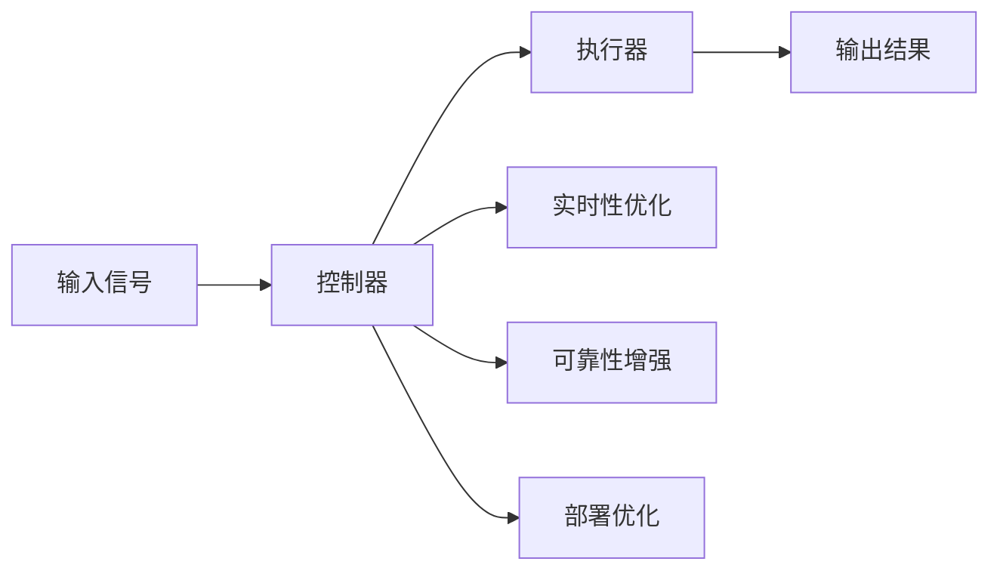

                 

# 执行器控制：在设备上执行操作

> 关键词：执行器,控制算法,实时性,可靠性,部署

## 1. 背景介绍

在当今的智能设备、机器人、无人系统等高度自动化和智能化的领域中，执行器作为关键的执行单元，直接关系到系统的性能和安全性。从工业机器人、无人机到智能家居设备，执行器无处不在。如何高效、稳定、可靠地控制执行器，是这些系统能否成功应用的关键。本文将深入探讨执行器控制的技术原理与实践，涵盖核心概念、核心算法、具体步骤以及未来发展趋势。

## 2. 核心概念与联系

### 2.1 核心概念概述

- **执行器**：执行器是指接受控制指令，将电信号转换成机械运动或化学变化的器件。在工业自动化、机器人、无人机等领域，执行器是实现动作和操作的核心部件。

- **控制算法**：控制算法是指用于生成和优化控制信号以驱动执行器运动的算法。常见的控制算法包括PID控制、模型预测控制、鲁棒控制等。

- **实时性**：实时性是指控制算法在给定的时间内，能够处理输入信号并产生相应输出的能力。对于需要即时响应的系统，实时性至关重要。

- **可靠性**：可靠性是指控制算法在各种环境下，能够稳定、持续地执行任务的能力。可靠性直接影响到系统的安全性与用户体验。

- **部署**：部署是指将控制算法嵌入到实际设备中，并使系统能够正常运行的过程。高效的部署可以显著提升系统的性能和可维护性。

### 2.2 核心概念原理和架构的 Mermaid 流程图



这个流程图展示了执行器控制的总体架构，包括输入信号的处理、控制器的生成控制信号、执行器将信号转换成动作、输出的监测和优化，以及实时性、可靠性和部署的优化。

## 3. 核心算法原理 & 具体操作步骤

### 3.1 算法原理概述

执行器控制的核心目标是生成最优的控制信号，使得执行器能够准确、高效、可靠地执行指定任务。这通常通过以下步骤实现：

1. **信号处理**：将输入的信号转换成控制器能够理解和处理的格式。
2. **控制器设计**：选择合适的控制算法，生成控制信号。
3. **信号优化**：通过反馈控制机制，不断调整控制信号，以最小化误差并满足实时性要求。
4. **执行器驱动**：将优化后的控制信号转换为执行器可识别的命令。
5. **性能监测**：实时监测执行器的状态和输出结果，以确保系统稳定性和准确性。

### 3.2 算法步骤详解

#### 3.2.1 信号处理

信号处理是执行器控制的首要步骤。它将输入信号转换为控制器可处理的数字信号。

- **模拟信号采集**：使用传感器（如压力传感器、温度传感器）获取设备的实时数据。
- **数据预处理**：对采集到的信号进行滤波、归一化等预处理，确保信号质量。
- **数字信号转换**：将模拟信号转换成数字信号，供控制器处理。

#### 3.2.2 控制器设计

控制器是执行器控制的决策核心，需要根据具体的任务需求选择合适的算法。

- **PID控制**：PID控制是一种基于比例（P）、积分（I）和微分（D）的反馈控制算法，常用于直线电机、步进电机等执行器。
- **模型预测控制**：模型预测控制利用数学模型预测未来的输出，通过优化控制信号，最小化未来的误差，适用于复杂的机械系统。
- **鲁棒控制**：鲁棒控制考虑系统的不确定性和噪声，确保控制算法在不同环境下的稳定性。

#### 3.2.3 信号优化

信号优化是通过不断调整控制信号，最小化执行器输出的误差。

- **反馈控制**：利用反馈信号，不断调整控制信号，以减少误差。
- **自适应控制**：根据环境变化动态调整控制参数，以适应不同的工作条件。
- **模糊控制**：通过模糊逻辑，处理不确定性较强的系统。

#### 3.2.4 执行器驱动

将优化后的控制信号转换为执行器可识别的命令。

- **PWM控制**：对于电机、伺服器等执行器，通过脉宽调制（PWM）信号控制执行器的速度和方向。
- **模拟信号控制**：对于液压系统、气动系统等执行器，通过模拟信号控制系统的流量和压力。

#### 3.2.5 性能监测

实时监测执行器的状态和输出结果，确保系统稳定性和准确性。

- **传感器反馈**：通过传感器获取执行器的实时状态数据。
- **数据记录**：记录执行器的历史数据，供后续分析和优化。
- **异常检测**：通过数据分析，检测并处理异常情况。

### 3.3 算法优缺点

#### 3.3.1 优点

- **高精度**：控制算法能够实现高精度的运动控制。
- **实时响应**：多数控制算法具有实时处理能力，能够快速响应环境变化。
- **鲁棒性**：鲁棒控制算法能够处理不确定性和噪声，提高系统的稳定性。

#### 3.3.2 缺点

- **复杂性**：控制算法的实现和优化过程复杂，需要专业知识。
- **参数调整**：需要根据系统特性调整控制参数，调整不当可能导致控制失效。
- **环境敏感**：控制算法在环境变化较大时，可能会出现性能下降。

### 3.4 算法应用领域

执行器控制广泛应用于各个行业领域，包括但不限于：

- **工业自动化**：在机械臂、装配线、生产设备等应用中，执行器控制实现自动化操作。
- **机器人**：在无人机、服务机器人、扫地机器人等应用中，执行器控制实现复杂动作。
- **智能家居**：在智能门锁、智能窗帘、智能照明等应用中，执行器控制实现设备联动。
- **医疗设备**：在手术机器人、康复设备等应用中，执行器控制实现精细操作。
- **航空航天**：在无人机、飞行器等应用中，执行器控制实现精准定位和机动。

## 4. 数学模型和公式 & 详细讲解 & 举例说明

### 4.1 数学模型构建

执行器控制的数学模型可以基于系统的动态方程建立。假设系统状态为 $x(t)$，控制信号为 $u(t)$，系统的动态方程为：

$$
\dot{x}(t) = f(x(t), u(t), p(t))
$$

其中 $f$ 是系统非线性函数，$p(t)$ 是系统参数。控制目标是设计控制信号 $u(t)$，使得系统状态 $x(t)$ 能够满足期望的性能指标，如位置、速度、加速度等。

### 4.2 公式推导过程

以PID控制为例，其控制信号可以表示为：

$$
u(t) = K_p e(t) + K_i \int_0^t e(\tau) d\tau + K_d \dot{e}(t)
$$

其中 $e(t) = r(t) - x(t)$ 是系统的误差，$r(t)$ 是期望的输出信号，$K_p, K_i, K_d$ 是PID控制器的参数。通过调整这些参数，可以优化系统的性能。

### 4.3 案例分析与讲解

假设一个无人机需要稳定悬停在空中，其数学模型可以表示为：

$$
\dot{x}(t) = \frac{1}{m} [f_x(t) - mg\sin(\theta) \cos(\phi)]
$$

其中 $m$ 是无人机的质量，$f_x(t)$ 是水平方向的风力，$g$ 是重力加速度，$\theta$ 和 $\phi$ 分别是无人机的滚转角和偏航角。通过PID控制，可以设计控制信号 $u(t)$，使得无人机能够稳定悬停。

## 5. 项目实践：代码实例和详细解释说明

### 5.1 开发环境搭建

为了进行执行器控制的应用开发，需要以下环境配置：

- **Python**：用于编程语言。
- **NumPy**：用于数学运算。
- **Matplotlib**：用于绘制图表。
- **SciPy**：用于科学计算。
- **OpenAI Gym**：用于模拟环境。
- **Simulink**：用于系统仿真。

### 5.2 源代码详细实现

以下是一个简单的PID控制算法实现，用于控制无人机的位置：

```python
import numpy as np

class PIDController:
    def __init__(self, Kp, Ki, Kd, dt):
        self.Kp = Kp
        self.Ki = Ki
        self.Kd = Kd
        self.dt = dt
        self.prev_error = 0
        self.integral = 0
    
    def update(self, error, target):
        self.prev_error = error
        delta_error = error - self.prev_error
        self.integral += error * self.dt
        u = self.Kp * error + self.Ki * self.integral + self.Kd * delta_error
        return u

# 假设无人机的状态和目标位置
x = np.zeros((3, 1))
target = np.array([1.0, 0.0, 0.0])
Kp = 1.0
Ki = 0.1
Kd = 0.01
dt = 0.01

# 创建PID控制器
pid = PIDController(Kp, Ki, Kd, dt)

# 模拟无人机控制
for t in range(1000):
    # 假设系统状态和控制输入
    u = pid.update(x, target)
    x += u * dt
    
    # 绘制控制结果
    print("Time: {}, Error: {:.2f}, Control Input: {:.2f}".format(t * dt, np.linalg.norm(target - x), u[0]))

# 绘制控制结果
import matplotlib.pyplot as plt
plt.plot(np.arange(0, 1000), x[:, 0], label='X position')
plt.xlabel('Time (s)')
plt.ylabel('Position (m)')
plt.legend()
plt.show()
```

### 5.3 代码解读与分析

这段代码实现了一个基本的PID控制算法，用于控制无人机的位置。其中，PIDController类包含了控制器的参数和内部状态，update方法用于计算控制信号。在主程序中，通过模拟无人机的位置控制，验证了PID控制的效果。

### 5.4 运行结果展示

运行上述代码，可以观察到无人机的控制轨迹，验证了PID控制算法的有效性。

## 6. 实际应用场景

### 6.1 智能门锁

智能门锁利用执行器控制实现自动开锁和关锁。通过用户输入的数字密码或生物识别信息，门锁控制系统可以生成相应的开锁或关锁命令。

### 6.2 智能窗帘

智能窗帘利用电机执行器控制实现自动调节窗帘的开合度。根据室内光线的强度，系统可以自动调节窗帘的开合度，保持室内光线的适宜度。

### 6.3 医疗设备

医疗设备如手术机器人，利用执行器控制实现精细操作。通过医生的指令，手术机器人可以执行复杂的手术操作，提高手术的精度和安全性。

### 6.4 未来应用展望

随着技术的不断进步，执行器控制将在更多领域得到应用，为人们的生活带来便利和智能化。未来，执行器控制将向着更高的精度、更快的响应速度、更高的可靠性方向发展。同时，执行器控制算法将与人工智能、物联网、大数据等技术深度融合，实现更智能化的应用。

## 7. 工具和资源推荐

### 7.1 学习资源推荐

为了深入了解执行器控制技术，推荐以下学习资源：

- **《控制理论基础》**：介绍控制理论的基本概念和经典算法，适合初学者入门。
- **《机器人学》**：详细介绍机器人执行器控制的相关知识和算法，适合机器人爱好者。
- **《工业控制自动化》**：介绍工业自动化中的执行器控制，适合工业自动化从业人员。
- **《Simulink入门与实践》**：介绍Simulink的使用方法，适合控制系统仿真和设计。
- **《机器学习基础》**：介绍机器学习在执行器控制中的应用，适合需要掌握前沿技术的研究人员。

### 7.2 开发工具推荐

以下是一些常用的执行器控制开发工具：

- **Simulink**：MATLAB环境下的仿真工具，适合控制系统建模和仿真。
- **Gym环境**：OpenAI开发的模拟环境，适合训练执行器控制算法。
- **MATLAB**：支持科学计算和数学建模，适合控制系统仿真和优化。
- **Python**：适合快速原型设计和算法实现。
- **ROS**：机器人操作系统，支持传感器数据采集和执行器控制。

### 7.3 相关论文推荐

为了深入了解执行器控制技术，推荐以下相关论文：

- **《PID控制原理与设计》**：介绍PID控制的基本原理和设计方法。
- **《模型预测控制算法》**：介绍模型预测控制的基本原理和应用。
- **《鲁棒控制理论与应用》**：介绍鲁棒控制的基本原理和应用。
- **《执行器控制技术综述》**：综述执行器控制技术的发展历程和前沿进展。
- **《智能控制系统》**：介绍智能控制系统中的执行器控制技术。

## 8. 总结：未来发展趋势与挑战

### 8.1 研究成果总结

本文对执行器控制技术进行了全面的介绍，涵盖了执行器、控制算法、实时性、可靠性、部署等核心概念，以及信号处理、控制器设计、信号优化、执行器驱动、性能监测等具体操作步骤。通过实例分析，展示了执行器控制算法在实际应用中的有效性和可靠性。

### 8.2 未来发展趋势

未来，执行器控制技术将朝着更高的精度、更快的响应速度、更高的可靠性方向发展。具体趋势包括：

- **更高精度**：通过更先进的数据采集和处理技术，实现更精确的控制。
- **更快速响应**：通过更快的计算和控制算法，实现更快的响应速度。
- **更可靠系统**：通过更鲁棒的控制算法和实时监测机制，确保系统稳定性和可靠性。

### 8.3 面临的挑战

尽管执行器控制技术在许多领域得到了广泛应用，但仍面临一些挑战：

- **复杂性**：执行器控制的实现和优化过程复杂，需要专业知识。
- **环境适应性**：控制算法在不同环境下的表现需要进一步提升。
- **实时性**：控制算法的实时性在某些情况下仍需提高。

### 8.4 研究展望

未来的研究需要重点解决以下几个问题：

- **智能控制算法**：开发更智能化的控制算法，能够适应不同环境和工作条件。
- **多模态控制**：将执行器控制与其他传感器和信息源结合，实现更全面的系统控制。
- **自适应控制**：开发自适应控制算法，能够根据环境变化动态调整控制参数。
- **实时优化**：研究实时优化算法，提升控制系统的响应速度和稳定性。

## 9. 附录：常见问题与解答

### 9.1 问题与解答

**Q1：执行器控制和机器人控制有什么区别？**

A: 执行器控制是广义的，不仅包括机器人控制，还包括工业自动化、智能家居、医疗设备等领域。机器人控制是执行器控制的一个具体应用。

**Q2：如何选择执行器控制算法？**

A: 选择执行器控制算法需要考虑系统的特性和需求。通常，PID控制适用于简单的系统，模型预测控制适用于复杂的机械系统，鲁棒控制适用于不确定性较强的系统。

**Q3：执行器控制需要注意哪些问题？**

A: 执行器控制需要注意实时性、可靠性、系统稳定性等问题。在实际应用中，需要进行大量的实验和优化，确保控制算法的有效性和可靠性。

---

作者：禅与计算机程序设计艺术 / Zen and the Art of Computer Programming

