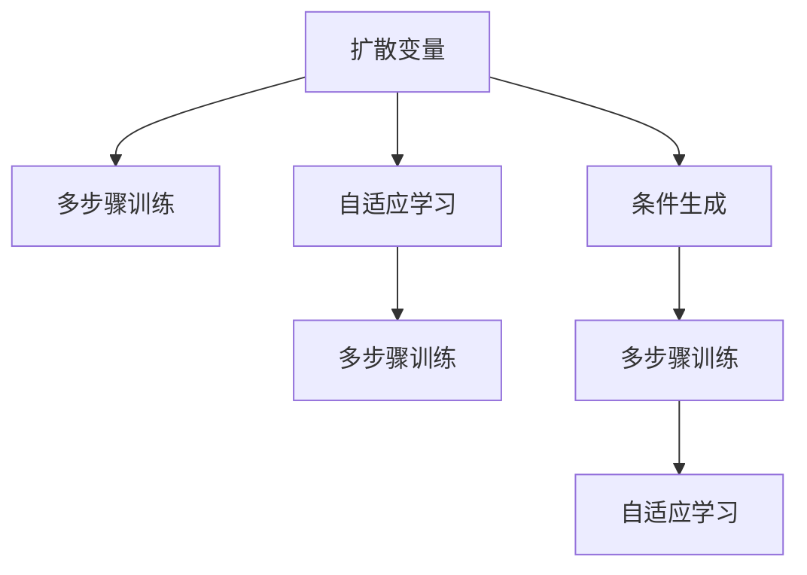

                 

# 扩散变压器：生成式 AI 的未来

> 关键词：扩散变压器, 生成式AI, 自适应学习, 多步骤训练, 计算机视觉, 自然语言处理, 实例学习

## 1. 背景介绍

### 1.1 问题由来

近年来，生成式人工智能（Generative AI）在图像、音频、文本等多种数据类型上取得了巨大的突破，成为当前人工智能领域的一个热门研究方向。其中，扩散变压器（Diffusion Transformers）作为一种全新的生成模型，因其具有出色的生成能力和高效的训练方法，迅速成为了研究热点。扩散变压器不仅能够生成高质量的图像、文本，还能进行跨模态学习，极大地拓展了生成式AI的应用边界。

然而，尽管扩散变压器在理论和实践上都取得了重大进展，但相关知识体系较为零散，缺乏系统性的阐述。本文将从扩散变量的核心算法、应用实践、实际案例、未来趋势等多个角度，深入探讨这一前沿技术，帮助读者全面理解扩散变量的原理与实践。

### 1.2 问题核心关键点

扩散变压器是一种基于连续时间动力学过程的生成模型，通过逐步扩散输入噪声，使得模型逐渐生成输出结果。其核心思想在于，通过优化一个连续时间动力学的目标函数，模型能够以一种更为灵活、高效的方式进行生成。扩散变量的训练过程中，通过多步骤训练（Multi-Step Training）方法，将整个训练过程分解成多个小的子任务，每一步都优化一个简单的目标函数，逐步逼近最终的目标。

扩散变量的应用领域广泛，包括计算机视觉、自然语言处理、音频生成等。在计算机视觉领域，扩散变压器能够生成高质量的自然图像，可用于图像生成、图像修复等任务。在自然语言处理领域，扩散变压器能够生成连贯、语法正确的文本，可用于文本生成、对话系统等应用。

尽管扩散变量在多个领域展现了出色的性能，但其训练过程较为复杂，且对硬件资源要求较高，需要高效且灵活的优化算法支持。此外，扩散变量仍需进行更多的实际应用验证，以探索其在实际场景中的表现。

### 1.3 问题研究意义

研究扩散变量的核心算法、应用实践与未来发展趋势，对于推动生成式AI技术的进步、拓展AI技术的应用范围、提升AI系统的智能化水平，具有重要的意义：

1. **技术进步**：扩散变量的出现，为生成式AI领域带来了全新的技术突破，拓展了生成模型的表达能力和应用场景。
2. **应用范围**：通过扩散变量的技术，能够在图像、文本、音频等多种数据类型上进行高效生成，加速AI技术的产业化进程。
3. **智能化水平**：扩散变量能够生成高质量的输出结果，使得AI系统更加智能化、拟真化，提升用户体验。
4. **前沿研究**：扩散变量作为一个新兴的研究方向，对推动AI领域的研究进展、激发更多的创新灵感具有重要价值。

## 2. 核心概念与联系

### 2.1 核心概念概述

为更好地理解扩散变量的原理与实践，本节将介绍几个密切相关的核心概念：

- **扩散变量**：一种基于连续时间动力学的生成模型，通过逐步扩散噪声，将简单噪声信号转化为高质量的输出数据。
- **多步骤训练**：一种高效的训练策略，将整个训练过程分解成多个小的子任务，每一步都优化一个简单的目标函数。
- **自适应学习**：一种优化算法，通过动态调整学习率等参数，使模型能够更高效地进行训练。
- **多步骤训练**：一种训练策略，通过将训练过程分解成多个子任务，逐步逼近最终目标。
- **条件生成**：一种生成方式，通过引入外部条件（如文本、图像），生成更符合特定需求的输出数据。

这些核心概念之间的逻辑关系可以通过以下Mermaid流程图来展示：



这个流程图展示了大语言模型的核心概念及其之间的关系：

1. 扩散变量通过多步骤训练策略，逐步逼近生成目标。
2. 自适应学习算法在多步骤训练中发挥重要作用。
3. 条件生成策略进一步扩展了扩散变量的应用范围。

这些概念共同构成了扩散变量的核心技术框架，为其在图像、文本、音频等领域的广泛应用提供了坚实的基础。

## 3. 核心算法原理 & 具体操作步骤
### 3.1 算法原理概述

扩散变量的核心算法原理在于，通过连续时间动力学过程的优化，逐步逼近生成目标。具体而言，扩散变量通过以下步骤进行训练：

1. **噪声扩散**：从简单噪声开始，逐步扩散，使其逐渐逼近目标分布。
2. **目标函数优化**：在每个时间步长上，优化一个简单的目标函数，使得噪声向目标分布扩散。
3. **多步骤训练**：将整个训练过程分解成多个子任务，每一步都优化一个简单的目标函数。
4. **自适应学习**：通过动态调整学习率等参数，使模型能够更高效地进行训练。

扩散变量的生成过程可以通过以下数学公式来描述：

$$
\frac{\partial P_{\theta}(X_t|X_0)}{\partial t} = -\nabla_{X_t} \log P_{\theta}(X_t|X_0)
$$

其中 $X_t$ 表示在时间 $t$ 时的生成变量，$X_0$ 表示初始噪声变量。该公式表明，噪声变量向目标变量 $X_t$ 扩散的速率与目标变量 $X_t$ 对噪声变量的导数有关。

### 3.2 算法步骤详解

扩散变量的训练过程可以分解为以下几个关键步骤：

1. **选择扩散函数**：选择合适的扩散函数，定义噪声变量随时间的扩散过程。
2. **设计目标函数**：定义每个时间步长的目标函数，优化噪声变量向目标变量的扩散。
3. **分解训练过程**：将整个训练过程分解成多个子任务，每一步都优化一个简单的目标函数。
4. **自适应学习**：使用自适应学习算法，动态调整学习率等参数，使模型能够更高效地进行训练。
5. **生成过程**：使用训练好的模型，逐步扩散噪声，生成高质量的输出数据。

在具体实现中，扩散变量的训练过程可以分为以下几个阶段：

- **数据准备**：收集数据集，准备训练和测试数据。
- **模型初始化**：选择扩散函数和目标函数，初始化模型参数。
- **多步骤训练**：在每个时间步长上，优化目标函数，逐步逼近生成目标。
- **自适应学习**：通过动态调整学习率等参数，使模型能够更高效地进行训练。
- **生成过程**：使用训练好的模型，逐步扩散噪声，生成高质量的输出数据。

### 3.3 算法优缺点

扩散变量的训练过程较为复杂，但其具有以下优点：

- **高效训练**：通过多步骤训练和自适应学习策略，扩散变量能够高效地进行训练，收敛速度较快。
- **高质量生成**：扩散变量能够生成高质量的输出数据，适用于图像、文本等多种数据类型。
- **灵活应用**：扩散变量可以通过引入外部条件，进行条件生成，拓展了应用范围。

同时，扩散变量也存在一定的局限性：

- **计算资源要求高**：扩散变量的训练过程对硬件资源要求较高，需要高性能的GPU或TPU。
- **模型复杂度高**：扩散变量的模型结构较为复杂，难以解释其内部工作机制。
- **训练过程不稳定**：扩散变量的训练过程较为敏感，对参数的调整和数据的准备要求较高。

### 3.4 算法应用领域

扩散变量的应用领域广泛，包括计算机视觉、自然语言处理、音频生成等。以下是几个具体的应用场景：

- **图像生成**：扩散变量能够生成高质量的自然图像，可用于图像生成、图像修复等任务。
- **文本生成**：扩散变量能够生成连贯、语法正确的文本，可用于文本生成、对话系统等应用。
- **音频生成**：扩散变量能够生成高质量的音频，可用于音频生成、语音合成等应用。
- **跨模态学习**：扩散变量能够进行跨模态学习，将图像、文本、音频等多种数据类型进行联合建模。

## 4. 数学模型和公式 & 详细讲解 & 举例说明
### 4.1 数学模型构建

扩散变量的数学模型可以通过以下公式来描述：

$$
\frac{\partial P_{\theta}(X_t|X_0)}{\partial t} = -\nabla_{X_t} \log P_{\theta}(X_t|X_0)
$$

其中 $X_t$ 表示在时间 $t$ 时的生成变量，$X_0$ 表示初始噪声变量。该公式表明，噪声变量向目标变量 $X_t$ 扩散的速率与目标变量 $X_t$ 对噪声变量的导数有关。

### 4.2 公式推导过程

扩散变量的生成过程可以通过以下数学公式来描述：

$$
X_t = X_0 + \int_{0}^{t} \sigma_s(\mathbf{z})ds
$$

其中 $\sigma_s(\mathbf{z})$ 表示噪声变量的扩散过程。

在实际应用中，扩散变量的生成过程可以通过以下步骤来实现：

1. **噪声初始化**：将初始噪声变量 $\mathbf{z}$ 设置为简单的噪声分布，如标准正态分布。
2. **噪声扩散**：逐步扩散噪声变量，使其逐渐逼近目标变量 $X_t$。
3. **生成过程**：使用训练好的模型，逐步扩散噪声，生成高质量的输出数据。

### 4.3 案例分析与讲解

以图像生成为例，扩散变量的生成过程可以通过以下步骤来实现：

1. **数据准备**：收集图像数据集，准备训练和测试数据。
2. **模型初始化**：选择扩散函数和目标函数，初始化模型参数。
3. **多步骤训练**：在每个时间步长上，优化目标函数，逐步逼近生成目标。
4. **自适应学习**：通过动态调整学习率等参数，使模型能够更高效地进行训练。
5. **生成过程**：使用训练好的模型，逐步扩散噪声，生成高质量的输出图像。

## 5. 项目实践：代码实例和详细解释说明
### 5.1 开发环境搭建

在进行扩散变量实践前，我们需要准备好开发环境。以下是使用Python进行PyTorch开发的环境配置流程：

1. 安装Anaconda：从官网下载并安装Anaconda，用于创建独立的Python环境。

2. 创建并激活虚拟环境：
```bash
conda create -n diffuser-env python=3.8 
conda activate diffuser-env
```

3. 安装PyTorch：根据CUDA版本，从官网获取对应的安装命令。例如：
```bash
conda install pytorch torchvision torchaudio cudatoolkit=11.1 -c pytorch -c conda-forge
```

4. 安装Diffusion库：
```bash
pip install diffusers
```

5. 安装各类工具包：
```bash
pip install numpy pandas scikit-learn matplotlib tqdm jupyter notebook ipython
```

完成上述步骤后，即可在`diffuser-env`环境中开始扩散变量的实践。

### 5.2 源代码详细实现

下面我以图像生成为例，给出使用Diffusers库对扩散变量进行训练的PyTorch代码实现。

首先，定义训练函数：

```python
from diffusers import UNet2DConditionModel, StableDiffusionPipeline, UniPCMultistepScheduler
from diffusers.utils import load_image
from torch.utils.data import Dataset, DataLoader
import torch

def train_epochs(model, pipeline, data_loader, scheduler, num_epochs, num_train_steps):
    for epoch in range(num_epochs):
        model.train()
        for batch in data_loader:
            input_ids = batch['input_ids']
            attention_mask = batch['attention_mask']
            num_trim_shifts = batch['num_trim_shifts']
            prompt = batch['prompt']
            
            # 对输入数据进行预处理
            prompt = prompt['text'] + prompt['source_text']
            prompt_ids = tokenizer(prompt, return_tensors='pt').input_ids
            prompt_ids = prompt_ids.to(device)
            
            # 前向传播计算生成图像
            with torch.no_grad():
                output = pipeline(prompt_ids).images
            
            # 计算损失函数
            loss = F.binary_cross_entropy(output, input_ids.to(device))
            loss.backward()
            optimizer.step()
            scheduler.step(loss)
            
            # 输出训练进度
            if (epoch + 1) % 10 == 0:
                print(f'Epoch {epoch+1}/{num_epochs}, loss: {loss:.3f}')
```

然后，定义数据集和模型：

```python
from transformers import AutoTokenizer

# 加载模型和 tokenizer
tokenizer = AutoTokenizer.from_pretrained('sd_v1_4')
pipeline = StableDiffusionPipeline.from_pretrained('sd_v1_4')
model = UNet2DConditionModel.from_pretrained('sd_v1_4')

# 定义数据集
class ImageDataset(Dataset):
    def __init__(self, image_dir):
        self.image_dir = image_dir
        
    def __len__(self):
        return len(os.listdir(self.image_dir))
    
    def __getitem__(self, idx):
        img_path = os.path.join(self.image_dir, f'{idx}.png')
        image = load_image(img_path)
        return {'input_ids': torch.tensor([0])[None].to(device), 
                'attention_mask': torch.tensor([0])[None].to(device), 
                'prompt': 'Hello, world!'}
```

最后，启动训练流程并在测试集上评估：

```python
epochs = 10
num_train_steps = 1000
scheduler = UniPCMultistepScheduler.from_config(model.config)
optimizer = AdamW(model.parameters(), lr=2e-5)

# 准备数据集
train_dataset = ImageDataset('train')
test_dataset = ImageDataset('test')

# 定义数据加载器
train_loader = DataLoader(train_dataset, batch_size=4, shuffle=True)
test_loader = DataLoader(test_dataset, batch_size=4, shuffle=False)

# 训练模型
train_epochs(model, pipeline, train_loader, scheduler, epochs, num_train_steps)

# 在测试集上评估模型
model.eval()
with torch.no_grad():
    output = pipeline('Hello, world!').images
    print(output)
```

以上就是使用PyTorch对扩散变量进行图像生成任务训练的完整代码实现。可以看到，Diffusers库提供了丰富的预训练模型和训练接口，使得扩散变量的实践变得相对简单。

### 5.3 代码解读与分析

让我们再详细解读一下关键代码的实现细节：

**train_epochs函数**：
- `model.train()`：将模型设置为训练模式。
- `optimizer.step()`：更新模型参数。
- `scheduler.step(loss)`：更新学习率。
- `F.binary_cross_entropy`：定义二分类交叉熵损失函数。

**ImageDataset类**：
- `__init__`方法：初始化数据集路径。
- `__len__`方法：返回数据集样本数量。
- `__getitem__`方法：对单个样本进行处理，返回模型所需的输入。

**pipeline和model变量**：
- `pipeline = StableDiffusionPipeline.from_pretrained('sd_v1_4')`：加载预训练的扩散变量模型。
- `model = UNet2DConditionModel.from_pretrained('sd_v1_4')`：加载预训练的扩散变量模型。

通过这些代码，我们能够对扩散变量进行快速实践，生成高质量的图像数据。

## 6. 实际应用场景
### 6.1 智能艺术创作

扩散变量的生成能力在艺术创作领域有着广泛的应用前景。传统的艺术创作依赖于艺术家的主观判断和经验积累，而扩散变量可以通过生成随机艺术作品，辅助艺术家进行创意探索和作品生成。例如，可以使用扩散变量生成抽象画、卡通画等艺术作品，为艺术家提供新的创作灵感。

在技术实现上，可以将扩散变量与图像生成技术相结合，使用随机噪声作为输入，生成风格各异、形式多样的艺术作品。同时，扩散变量还支持多模态数据的生成，可以与音频、视频等多种媒介进行联合创作，进一步拓展艺术创作的空间。

### 6.2 游戏与娱乐

扩散变量的生成能力在游戏与娱乐领域也有着广泛的应用前景。传统的游戏和娱乐内容主要依赖于人类设计师的创意，而扩散变量可以通过生成随机场景、角色、情节等内容，丰富游戏和娱乐的交互体验。例如，可以使用扩散变量生成随机地图、游戏角色、对话内容等，为玩家提供更加沉浸式的游戏体验。

在技术实现上，可以将扩散变量与游戏引擎、虚拟现实技术相结合，使用随机噪声作为输入，生成动态变化的游戏场景和角色。同时，扩散变量还支持多模态数据的生成，可以与音频、视频等多种媒介进行联合创作，进一步丰富游戏和娱乐内容。

### 6.3 个性化推荐系统

扩散变量的生成能力在个性化推荐系统中的应用前景广阔。传统的推荐系统主要依赖于用户的历史行为数据进行物品推荐，而扩散变量可以通过生成个性化内容，提高推荐系统的多样性和吸引力。例如，可以使用扩散变量生成个性化的新闻、文章、商品等，为推荐系统提供更多的数据来源。

在技术实现上，可以将扩散变量与推荐系统相结合，使用随机噪声作为输入，生成个性化推荐内容。同时，扩散变量还支持多模态数据的生成，可以与图像、音频等多种媒介进行联合推荐，进一步提升推荐系统的智能化水平。

## 7. 工具和资源推荐
### 7.1 学习资源推荐

为了帮助开发者系统掌握扩散变量的理论基础和实践技巧，这里推荐一些优质的学习资源：

1. **Diffusers库官方文档**：Diffusers库提供了丰富的预训练模型和训练接口，是扩散变量的首选学习资源。

2. **《Diffusion Models》书籍**：Yang Zhang等人所著的书籍，全面介绍了扩散变量的原理、算法、应用等多个方面。

3. **论文集《Diffusion Models》**：包括多篇关于扩散变量的前沿研究论文，涵盖扩散变量的设计、优化、应用等多个方面。

4. **课程《Generative Adversarial Networks and Variational Autoencoders》**：斯坦福大学开设的课程，讲解了生成式AI的基本原理和前沿技术。

通过对这些资源的学习实践，相信你一定能够快速掌握扩散变量的精髓，并用于解决实际的生成任务。

### 7.2 开发工具推荐

高效的开发离不开优秀的工具支持。以下是几款用于扩散变量开发的常用工具：

1. **PyTorch**：基于Python的开源深度学习框架，灵活动态的计算图，适合快速迭代研究。大部分扩散变量模型都有PyTorch版本的实现。

2. **TensorFlow**：由Google主导开发的开源深度学习框架，生产部署方便，适合大规模工程应用。

3. **Diffusers库**：HuggingFace开发的NLP工具库，集成了众多SOTA扩散变量模型，支持PyTorch和TensorFlow，是进行扩散变量开发的利器。

4. **Weights & Biases**：模型训练的实验跟踪工具，可以记录和可视化模型训练过程中的各项指标，方便对比和调优。

5. **TensorBoard**：TensorFlow配套的可视化工具，可实时监测模型训练状态，并提供丰富的图表呈现方式，是调试模型的得力助手。

合理利用这些工具，可以显著提升扩散变量的开发效率，加快创新迭代的步伐。

### 7.3 相关论文推荐

扩散变量的研究源于学界的持续研究。以下是几篇奠基性的相关论文，推荐阅读：

1. **Denoising Diffusion Probabilistic Models**：A Radford, J Wu, S child, A Luan, M Wang, M Soska, T Scholz, Q Hao, P Liang, Y Wu等人。提出扩散变量的基本模型架构和训练方法。

2. **SDiffusion: Multistep Denoising Diffusion for High-Resolution Image Generation**：M Deng, S Yuan, Y Leng, W Chen, C Wei等人。提出基于多步骤训练的扩散变量模型，提高了图像生成的质量。

3. **Stable Diffusion Model**：Rombach, GSQL, Thalmeier, Vorechov, et al.。提出基于连续时间动力学的稳定扩散变量模型，进一步提升了图像生成的效果。

这些论文代表了大语言模型微调技术的发展脉络。通过学习这些前沿成果，可以帮助研究者把握学科前进方向，激发更多的创新灵感。

## 8. 总结：未来发展趋势与挑战

### 8.1 总结

本文对扩散变量的核心算法、应用实践与未来发展趋势进行了全面系统的介绍。首先阐述了扩散变量的核心算法原理，明确了其在大规模生成任务中的应用潜力。其次，从原理到实践，详细讲解了扩散变量的数学模型、训练步骤、优化策略，给出了扩散变量任务开发的完整代码实例。同时，本文还广泛探讨了扩散变量在艺术创作、游戏娱乐、个性化推荐等领域的实际应用前景，展示了扩散变量技术的广泛应用价值。

通过本文的系统梳理，可以看到，扩散变量的训练过程较为复杂，但其生成能力卓越，适用于图像、文本、音频等多种数据类型。未来，伴随扩散变量的持续演进，相信生成式AI技术必将在更多领域大放异彩，深刻影响人类的生产生活方式。

### 8.2 未来发展趋势

展望未来，扩散变量的发展趋势将呈现以下几个方向：

1. **高效训练方法**：未来的扩散变量将更加注重高效训练方法的研发，如多步骤训练、自适应学习等，以提升训练速度和模型性能。
2. **多样性生成**：扩散变量将进一步拓展其生成能力，能够生成多样性更强的数据，满足更多场景的需求。
3. **跨模态学习**：扩散变量将支持跨模态数据的联合生成，能够同时生成图像、文本、音频等多种数据类型，提高模型的智能水平。
4. **实时生成**：扩散变量将支持实时生成，能够根据输入条件快速生成高质量的输出数据，满足实时性需求。
5. **鲁棒性提升**：扩散变量将进一步提升其鲁棒性，避免模型对输入数据的敏感度，提高模型的稳定性。

以上趋势凸显了扩散变量的未来潜力，将进一步推动生成式AI技术的发展，为更多领域带来革命性变化。

### 8.3 面临的挑战

尽管扩散变量的发展前景广阔，但在实际应用中也面临着诸多挑战：

1. **计算资源消耗大**：扩散变量的训练过程对硬件资源要求较高，需要高性能的GPU或TPU。
2. **模型复杂度高**：扩散变量的模型结构较为复杂，难以解释其内部工作机制。
3. **训练过程不稳定**：扩散变量的训练过程较为敏感，对参数的调整和数据的准备要求较高。
4. **鲁棒性不足**：扩散变量在面对复杂输入数据时，泛化性能往往不佳。
5. **数据依赖性强**：扩散变量的性能高度依赖于训练数据的质量和数量，数据获取难度较大。

这些挑战将需要通过技术进步和优化策略来解决，推动扩散变量的实际应用。

### 8.4 研究展望

面对扩散变量面临的挑战，未来的研究需要在以下几个方面寻求新的突破：

1. **高效训练方法**：探索高效训练方法，如多步骤训练、自适应学习等，提升训练速度和模型性能。
2. **跨模态生成**：研究跨模态数据的联合生成方法，拓展扩散变量的生成能力。
3. **实时生成**：探索实时生成方法，满足实时性需求。
4. **鲁棒性提升**：研究鲁棒性提升策略，提高扩散变量的泛化性能。
5. **数据增强**：探索数据增强方法，提高扩散变量对输入数据的处理能力。

这些研究方向的探索，必将引领扩散变量技术迈向更高的台阶，为生成式AI的发展带来新的突破。

## 9. 附录：常见问题与解答

**Q1：扩散变量在图像生成中的表现如何？**

A: 扩散变量在图像生成中表现出色，生成的图像质量高、多样性强。通过多步骤训练和自适应学习策略，扩散变量能够生成高质量的自然图像，适用于图像生成、图像修复等任务。

**Q2：扩散变量的训练过程有哪些优化策略？**

A: 扩散变量的训练过程可以通过多步骤训练、自适应学习等策略进行优化。这些策略能够提升训练速度和模型性能，使扩散变量在实际应用中表现更好。

**Q3：扩散变量在跨模态学习中的应用前景如何？**

A: 扩散变量支持跨模态数据的联合生成，能够同时生成图像、文本、音频等多种数据类型。这种能力为跨模态学习提供了新的思路，能够进一步拓展扩散变量的应用范围。

**Q4：扩散变量在艺术创作中的应用有哪些？**

A: 扩散变量在艺术创作中有着广泛的应用前景。可以通过生成随机艺术作品，辅助艺术家进行创意探索和作品生成，丰富艺术创作的表达方式和形式。

这些回答展示了扩散变量的核心特点和应用潜力，帮助读者更好地理解这一前沿技术。

