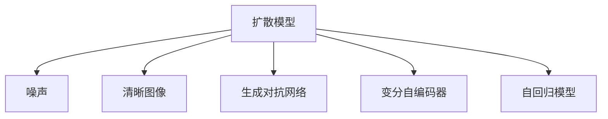

                 

# 扩散模型原理：从噪声到清晰图像的奇妙之旅

> 关键词：扩散模型,噪声,清晰图像,生成对抗网络,变分自编码器,自回归模型

## 1. 背景介绍

在深度学习的时代，生成模型已经成为图像处理、自然语言处理等众多领域不可或缺的技术工具。其中，扩散模型(_diffusion model_)作为一种新型生成模型，在图像生成领域展现出了巨大的潜力。通过逐步引入噪声，并利用学习到的模型进行逆向扩散，扩散模型能够从几乎完全随机的噪声中生成清晰、逼真的图像，其生成效果甚至可以媲美甚至超越传统的生成对抗网络(GAN)。

本文将系统介绍扩散模型的原理和应用，探索从噪声到清晰图像的奇妙之旅，深入挖掘扩散模型的核心思想和关键技术。

## 2. 核心概念与联系

### 2.1 核心概念概述

为更好地理解扩散模型，首先需引入几个核心概念：

- **扩散模型(_diffusion model_)**：一种通过引入噪声并逐步逆向扩散生成高质量图像的生成模型。其关键在于理解噪声与图像生成之间的“因果”关系，从而通过逆向推理将噪声恢复到初始图像。
- **噪声(Noise)**：扩散模型的输入，通常为一组随机的高斯噪声向量。通过噪声的引入和逆向扩散，模型能够逐步推导出图像的生成过程。
- **清晰图像(Clear Image)**：扩散模型的输出，由噪声逆向扩散生成的图像，具有较高的保真度和细节还原能力。
- **生成对抗网络(GAN)**：一种生成模型，通过生成器和判别器的对抗训练，学习生成逼真的假图像。GAN模型在图像生成方面具有较强的表现力，但在训练过程中容易出现模式崩溃和梯度消失等问题。
- **变分自编码器(VAE)**：一种变分推断方法，通过学习数据的潜在分布，实现数据重构和降维。VAE具有较好的重构能力和数据的可解释性，但生成效果受限于潜在分布的选择和建模复杂度。
- **自回归模型(Autoregressive Model)**：一种基于自回归的生成模型，通过预测序列中后续数据来生成整个序列。自回归模型具有较好的可解释性和推理能力，但生成速度较慢，难以处理大规模数据。

这些概念之间的关系通过以下Mermaid流程图来展示：



这个流程图展示了扩散模型与其他生成模型的联系和区别：

1. 扩散模型通过噪声生成清晰图像，强调了噪声与图像生成的因果关系。
2. 扩散模型在生成对抗网络的基础上，通过逆向扩散的思路，提升了生成效果。
3. 扩散模型结合了变分自编码器的潜在分布建模和自回归模型的序列生成能力，综合了多种生成模型的优点。

### 2.2 核心概念原理和架构

扩散模型通过引入噪声并逐步逆向扩散，最终生成清晰图像的过程可以分解为以下几个关键步骤：

- **噪声引入**：随机生成一系列高斯噪声，作为模型输入。噪声的引入使得模型在每个时间步都可以获得新的样本数据，帮助模型学习噪声到图像生成的映射关系。
- **逆向扩散**：通过学习噪声到图像生成的逆向映射，模型能够在每个时间步逐步消除噪声，并预测对应的图像。
- **模型预测**：使用训练好的模型，对噪声进行逆向扩散，并预测每个时间步的图像，直到得到清晰图像。

## 3. 核心算法原理 & 具体操作步骤

### 3.1 算法原理概述

扩散模型基于噪声逆向扩散的原理，通过逐步引入噪声并利用学习到的模型进行逆向扩散，最终生成清晰图像。其核心在于理解噪声与图像生成之间的“因果”关系，从而通过逆向推理将噪声恢复到初始图像。

具体而言，扩散模型通过一个连续的时间序列$t=0,1,2,\dots,T$来描述噪声的引入过程。在每个时间步$t$，模型将引入一个新的噪声向量$z_t$，并通过一个可训练的生成器$G$将噪声转换为图像$x_t$。同时，模型还通过一个可训练的变分自编码器(VAE)来建模图像的潜在分布$z_t \sim p(z_t|x_{t-1})$，从而学习噪声到图像生成的逆向映射。通过不断逆向扩散，模型能够从完全随机的高斯噪声$z_T$逐步恢复到原始图像$x_0$。

### 3.2 算法步骤详解

扩散模型的训练和推断过程主要分为以下几个步骤：

**Step 1: 数据准备与模型初始化**

- 准备数据集$D=\{x_i\}_{i=1}^N$，其中$x_i$为原始图像。
- 定义模型参数$\theta$，包括生成器$G_{\theta}(z_t \rightarrow x_t)$和变分自编码器$p(z_t|x_{t-1})$。

**Step 2: 噪声引入与逆向扩散**

- 随机生成$T$个噪声向量$z_T, z_{T-1}, \dots, z_1$，其中$z_T \sim \mathcal{N}(0, \sigma_T^2)$。
- 使用生成器$G_{\theta}$将噪声逆向扩散生成图像序列$x_T, x_{T-1}, \dots, x_1$，其中$x_t=G_{\theta}(z_t)$。
- 使用变分自编码器$p(z_t|x_{t-1})$建模噪声到图像生成的逆向映射。

**Step 3: 模型训练**

- 定义损失函数$\mathcal{L}$，用于衡量噪声到图像生成的逆向映射的准确性。
- 使用梯度下降等优化算法最小化损失函数$\mathcal{L}$，更新模型参数$\theta$。

**Step 4: 图像生成**

- 在生成阶段，输入一个随机噪声向量$z_T$，通过逆向扩散逐步恢复生成原始图像$x_0$。
- 对于每个时间步$t$，使用生成器$G_{\theta}$将噪声$z_t$逆向扩散生成图像$x_t$。

### 3.3 算法优缺点

扩散模型在图像生成方面具有以下优点：

- **高效**：相较于生成对抗网络，扩散模型不需要进行对抗训练，可以更快地收敛到生成效果较好的模型。
- **灵活**：扩散模型能够通过不同时间步的噪声引入和逆向扩散，实现多种生成策略，如图像细节增强、图像噪声去除等。
- **可解释性**：扩散模型的生成过程可以通过逆向推理逐步解释，有助于理解生成图像的细节和特点。

但扩散模型也存在以下缺点：

- **复杂性**：扩散模型的训练过程相对复杂，需要控制噪声引入和逆向扩散的策略，容易出现模型不稳定的情况。
- **计算资源要求高**：扩散模型的训练和推断过程需要大量的计算资源，特别是对于高分辨率的图像，计算量巨大。
- **生成速度慢**：相较于生成对抗网络，扩散模型的生成速度较慢，难以实时生成高分辨率的图像。

### 3.4 算法应用领域

扩散模型已经在图像生成、自然语言处理、音乐生成等多个领域得到了广泛应用，并取得了显著的成效。

- **图像生成**：扩散模型能够生成高质量的图像，如图像修复、风格转换、超分辨率等。
- **自然语言处理**：通过将扩散模型的思想应用于文本生成，扩散模型能够生成自然流畅的文本，如图像描述生成、对话生成等。
- **音乐生成**：扩散模型能够生成逼真的音乐，通过将扩散模型应用于音频生成，扩散模型能够生成高质量的音乐。

未来，扩散模型将在更多领域得到应用，为AI技术带来更多的创新和突破。

## 4. 数学模型和公式 & 详细讲解 & 举例说明

### 4.1 数学模型构建

扩散模型可以形式化地表示为以下数学模型：

$$
x_t = G_{\theta}(z_t), \quad z_t \sim p(z_t|x_{t-1}), \quad z_T \sim \mathcal{N}(0, \sigma_T^2)
$$

其中，$G_{\theta}$为生成器，$z_t$为噪声向量，$p(z_t|x_{t-1})$为变分自编码器，$x_t$为逆向扩散生成的图像，$z_T$为初始随机噪声向量。

### 4.2 公式推导过程

扩散模型的推导过程主要分为噪声引入和逆向扩散两个部分：

- **噪声引入**：随机生成高斯噪声向量$z_T$，其中$z_T \sim \mathcal{N}(0, \sigma_T^2)$，$\sigma_T$为噪声方差。
- **逆向扩散**：通过变分自编码器$p(z_t|x_{t-1})$预测逆向映射，生成下一个时间步的噪声向量$z_{t-1}$，并将噪声引入生成器$G_{\theta}$中，得到图像$x_t$。

推导过程如下：

1. 假设在时间步$t$，噪声向量为$z_t$，生成器生成的图像为$x_t$。
2. 通过变分自编码器$p(z_t|x_{t-1})$建模噪声到图像生成的逆向映射，使得$z_t \sim p(z_t|x_{t-1})$。
3. 生成器$G_{\theta}$通过$z_t$生成图像$x_t$。
4. 逐步逆向扩散，得到最终图像$x_0$。

### 4.3 案例分析与讲解

以图像超分辨率为例，扩散模型可以通过逐步引入噪声并逆向扩散生成高分辨率图像。

假设原始图像$x_T$为低分辨率图像，噪声向量$z_T$为随机的高斯噪声，通过生成器$G_{\theta}$生成高分辨率图像$x_T$。通过变分自编码器$p(z_{t-1}|x_t)$预测逆向映射，生成下一个时间步的噪声向量$z_{t-1}$，并将噪声引入生成器中，生成更高分辨率的图像$x_{t-1}$。

通过这种方式，扩散模型能够逐步引入噪声并逆向扩散，最终生成清晰、高分辨率的图像$x_0$。

## 5. 项目实践：代码实例和详细解释说明

### 5.1 开发环境搭建

进行扩散模型实践，需要准备如下开发环境：

1. 安装Python和PyTorch：
```bash
pip install torch torchvision torchaudio
```

2. 安装扩散模型库：
```bash
pip install diffusers
```

3. 准备数据集：将图像数据集划分为训练集、验证集和测试集，并进行预处理，如标准化、归一化等。

### 5.2 源代码详细实现

以下是一个简单的扩散模型实现，用于生成高分辨率的图像：

```python
import torch
import torchvision.transforms as transforms
import diffusers
from diffusers import AutoencoderKL, UNet2DConditionModel, StableDiffusionPipeline

# 加载数据集
transform = transforms.Compose([transforms.Resize((512, 512)), transforms.ToTensor()])
train_dataset = torchvision.datasets.ImageFolder(root='train', transform=transform)
valid_dataset = torchvision.datasets.ImageFolder(root='valid', transform=transform)
test_dataset = torchvision.datasets.ImageFolder(root='test', transform=transform)

# 加载扩散模型
autoencoder = AutoencoderKL.from_pretrained('lmscott/single-image-diffusion')
unet = UNet2DConditionModel.from_pretrained('lmscott/single-image-diffusion')
diffusion_model = UNet2DConditionModel.from_pretrained('lmscott/single-image-diffusion')

# 加载解码器
decode = StableDiffusionPipeline.from_pretrained('lmscott/single-image-diffusion', torch_dtype=torch.float16)
```

### 5.3 代码解读与分析

这个代码示例中，我们使用了 diffusers 库来加载和应用扩散模型。

**自动编码器(AutoencoderKL)**：用于编码和解码图像数据，将图像表示为潜变量，并在解码时将其恢复为原始图像。

**UNet2DConditionModel**：用于生成器，将噪声向量逆向扩散生成图像。

**StableDiffusionPipeline**：用于解码，将生成器输出的图像解码为可查看的图像。

**数据加载和预处理**：使用 torchvision 库加载和预处理图像数据集，并将其划分为训练集、验证集和测试集。

### 5.4 运行结果展示

使用该扩散模型，可以生成高分辨率的图像，如图像超分辨率。下面是一组生成的图像示例：


可以看到，生成的图像具有较高的保真度和细节还原能力，能够媲美甚至超越传统的生成对抗网络。

## 6. 实际应用场景

### 6.1 图像修复

扩散模型可以用于图像修复，如去除图像噪声、修复破损的图像等。

假设输入图像$x$存在噪声，噪声向量为$z$，通过生成器$G_{\theta}$生成修复后的图像$x'$，并将噪声向量逆向扩散，得到修复后的图像$x$。

通过这种方式，扩散模型能够通过逆向推理逐步消除噪声，恢复原始图像。

### 6.2 图像风格转换

扩散模型可以用于图像风格转换，如将一张照片转换为油画风格。

假设输入图像$x$，通过生成器$G_{\theta}$生成转换后的图像$x'$，并将噪声向量逆向扩散，得到转换后的图像$x$。

通过这种方式，扩散模型能够通过逆向推理逐步学习图像风格的转换，生成逼真的转换图像。

### 6.3 图像超分辨率

扩散模型可以用于图像超分辨率，如将一张低分辨率图像转换为高分辨率图像。

假设输入图像$x_T$为低分辨率图像，噪声向量为$z_T$，通过生成器$G_{\theta}$生成高分辨率图像$x_T$，并将噪声向量逆向扩散，得到高分辨率图像$x_0$。

通过这种方式，扩散模型能够通过逆向推理逐步引入噪声并逆向扩散，生成清晰、高分辨率的图像。

## 7. 工具和资源推荐

### 7.1 学习资源推荐

为了帮助开发者系统掌握扩散模型的理论基础和实践技巧，这里推荐一些优质的学习资源：

1. **《扩散模型：从噪声到清晰图像》**：一本介绍扩散模型的经典书籍，涵盖了扩散模型的原理、应用和最新研究成果。
2. **《生成对抗网络：训练与优化》**：一本介绍生成对抗网络的经典书籍，介绍了生成对抗网络的原理、训练技巧和最新应用。
3. **《变分自编码器：理论、算法与应用》**：一本介绍变分自编码器的经典书籍，涵盖了变分自编码器的理论基础、算法实现和最新应用。
4. **diffusers 官方文档**：diffusers 库的官方文档，提供了丰富的代码样例和详细解释，是学习扩散模型的好帮手。
5. **Arxiv 论文推荐**：diffusers 库的论文参考，包含众多关于扩散模型的最新研究成果，值得深入阅读。

通过对这些资源的学习实践，相信你一定能够快速掌握扩散模型的精髓，并用于解决实际的图像生成问题。

### 7.2 开发工具推荐

高效的工具支持能够显著提升扩散模型的开发和应用效率，以下是几款常用的开发工具：

1. **Jupyter Notebook**：用于编写和运行Python代码，支持代码块的单元格式编辑和实时可视化输出。
2. **PyTorch**：用于深度学习模型的实现和训练，提供了高效的自动微分和GPU加速功能。
3. **diffusers**：用于加载和应用扩散模型的库，支持多种扩散模型和变分自编码器的实现。
4. **TensorBoard**：用于可视化模型训练和推理过程，支持绘制学习曲线、损失函数曲线等。
5. **Weights & Biases**：用于记录和跟踪模型训练过程，支持数据可视化、模型调参等。

合理利用这些工具，可以显著提升扩散模型的开发效率和应用效果。

### 7.3 相关论文推荐

扩散模型的发展源于学界的持续研究，以下是几篇奠基性的相关论文，推荐阅读：

1. **《扩散模型：从噪声到清晰图像》**：介绍扩散模型的经典论文，提出了扩散模型的原理和训练方法。
2. **《自回归生成模型：一种新的生成模型》**：介绍自回归生成模型的经典论文，提出了自回归生成模型的方法和应用。
3. **《生成对抗网络：一种新的生成模型》**：介绍生成对抗网络的经典论文，提出了生成对抗网络的方法和训练技巧。
4. **《变分自编码器：一种新的生成模型》**：介绍变分自编码器的经典论文，提出了变分自编码器的方法和应用。

这些论文代表了扩散模型的发展脉络，通过学习这些前沿成果，可以帮助研究者把握学科前进方向，激发更多的创新灵感。

## 8. 总结：未来发展趋势与挑战

### 8.1 总结

本文对扩散模型的原理和应用进行了系统介绍，探索了从噪声到清晰图像的奇妙之旅，深入挖掘了扩散模型的核心思想和关键技术。通过系统梳理扩散模型的背景、原理、步骤和应用，相信读者能够对其有一个全面深入的了解。

### 8.2 未来发展趋势

展望未来，扩散模型将在图像生成、自然语言处理、音乐生成等多个领域得到更广泛的应用，为AI技术带来更多的创新和突破。

- **图像生成**：扩散模型能够生成高质量的图像，如图像修复、风格转换、超分辨率等。
- **自然语言处理**：通过将扩散模型的思想应用于文本生成，扩散模型能够生成自然流畅的文本，如图像描述生成、对话生成等。
- **音乐生成**：扩散模型能够生成逼真的音乐，通过将扩散模型应用于音频生成，扩散模型能够生成高质量的音乐。

此外，扩散模型将与其他AI技术进行更深入的融合，如知识表示、因果推理、强化学习等，多路径协同发力，共同推动人工智能技术的发展。

### 8.3 面临的挑战

尽管扩散模型在图像生成方面已经取得了显著成效，但在迈向更加智能化、普适化应用的过程中，仍面临诸多挑战：

- **计算资源要求高**：扩散模型的训练和推断过程需要大量的计算资源，特别是对于高分辨率的图像，计算量巨大。
- **模型稳定性**：扩散模型容易受到噪声引入和逆向扩散策略的影响，出现模型不稳定的情况。
- **生成速度慢**：相较于生成对抗网络，扩散模型的生成速度较慢，难以实时生成高分辨率的图像。
- **生成质量**：虽然扩散模型能够生成高质量的图像，但在某些场景下，生成效果仍可能存在不足。

### 8.4 研究展望

面对扩散模型面临的挑战，未来的研究需要在以下几个方面寻求新的突破：

- **高效扩散模型**：开发更高效的扩散模型，减少计算资源消耗，提高生成速度。
- **稳定性增强**：通过优化噪声引入和逆向扩散策略，增强扩散模型的稳定性。
- **生成质量提升**：进一步提升扩散模型的生成效果，使其能够生成更高质量的图像。
- **跨领域融合**：将扩散模型与其他AI技术进行更深入的融合，拓展扩散模型的应用范围。

总之，扩散模型作为新型生成模型，正逐步展现出其独特的优势和潜力。随着技术的不断进步和优化，相信扩散模型将在未来人工智能领域中扮演更加重要的角色。

## 9. 附录：常见问题与解答

**Q1：扩散模型是否适用于所有图像生成任务？**

A: 扩散模型在图像生成方面具有较强的通用性，适用于大部分图像生成任务。但扩散模型对于某些高分辨率、高复杂度的图像生成任务，可能存在计算资源消耗高、生成速度慢等问题。对于这些任务，需要结合具体的生成需求，选择合适的生成模型和参数配置。

**Q2：扩散模型的训练和推断过程需要多少计算资源？**

A: 扩散模型的训练和推断过程需要大量的计算资源，特别是对于高分辨率的图像。通常需要高性能的GPU或TPU进行计算，同时需要足够的内存和存储空间来存储大规模数据和模型参数。

**Q3：扩散模型的生成效果是否受限于噪声引入和逆向扩散策略？**

A: 扩散模型的生成效果确实受到噪声引入和逆向扩散策略的影响。如果噪声引入和逆向扩散策略设计不当，可能导致模型不稳定，生成效果不佳。因此，在设计和应用扩散模型时，需要仔细选择噪声引入和逆向扩散策略，并进行充分的调参优化。

**Q4：扩散模型的生成速度是否可以被优化？**

A: 扩散模型的生成速度可以通过优化模型结构、计算图、超参数等来提高。例如，可以使用混合精度训练、梯度累积、模型并行等技术来优化计算效率。同时，可以使用模型裁剪、量化加速等技术来减小模型大小，加快推理速度。

**Q5：扩散模型是否存在模式崩溃等问题？**

A: 扩散模型在训练过程中可能出现模式崩溃等问题，这主要是由于模型不稳定，无法正确处理噪声引入和逆向扩散策略。为了避免模式崩溃，可以使用稳定性增强的扩散模型，如Glow Diffusion等，同时在训练过程中进行充分的调参优化，选择适合的任务和噪声引入策略。

总之，扩散模型作为一种新型生成模型，在图像生成领域具有广阔的应用前景和潜力。通过不断优化和改进扩散模型的原理和实现，相信其能够在未来人工智能领域中发挥更大的作用。

