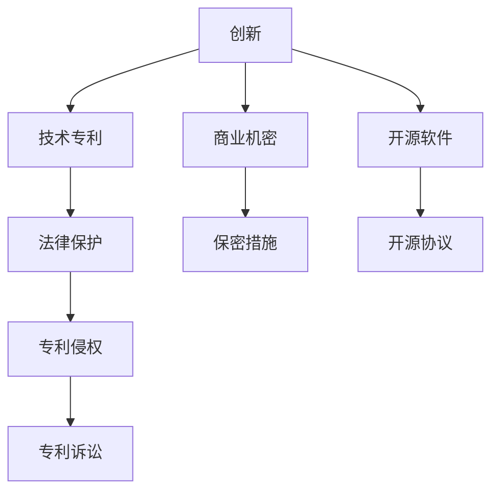

                 

# 技术专利申请：程序员的财富保护

> 关键词：技术专利申请, 程序员, 财富保护, 创新, 法律保护, 商业机密, 开源软件

## 1. 背景介绍

### 1.1 问题由来
随着科技的迅猛发展，程序员在软件开发中投入了大量的智力劳动和创新成果。然而，这些辛勤付出的成果往往缺乏有效的法律保护，容易被盗用、篡改或恶意传播，使得程序员的权益得不到保障，面临巨大的知识产权风险。据统计，全球每年因知识产权侵权导致的经济损失高达数千亿美元，其中相当一部分来自于软件行业的侵权行为。

因此，技术专利申请成为程序员保护自身财富的重要手段之一。通过申请专利，程序员可以将自己的技术创新成果固化为法律文件，确保其权益得到法律保护。本篇文章将从背景介绍、核心概念、算法原理及操作步骤、数学模型和公式推导、项目实践、实际应用场景、工具和资源推荐、总结、未来发展趋势与挑战、附录等几个方面，全面阐述技术专利申请的重要性和实践方法。

## 2. 核心概念与联系

### 2.1 核心概念概述

为更好地理解技术专利申请的原理和实践方法，本节将介绍几个核心概念：

- **技术专利**：指由国家知识产权局颁发的，对特定技术或设计进行法律保护的专利文件。它赋予专利持有人在一定期限内，对所涉及的技术或设计享有独家使用权。

- **创新**：指对现有技术或设计的改进或新创，可以是技术上的突破、产品设计的新颖、工艺流程的创新等。

- **法律保护**：通过专利法、著作权法等法律法规，对创新成果提供知识产权保护，确保其不被侵犯。

- **开源软件**：指源代码公开的、可以自由复制和修改的软件，旨在促进技术交流和共享。

- **商业机密**：指企业在生产、经营中掌握的未公开的技术或设计，具有商业价值且被采取了保密措施的信息。

这些概念之间具有紧密的联系。技术专利是法律保护创新的有力工具，开源软件和商业机密则需要通过合适的管理策略，才能确保不被侵犯。本节将通过一个Mermaid流程图展示这些概念之间的联系：



## 3. 核心算法原理 & 具体操作步骤
### 3.1 算法原理概述

技术专利申请的过程，本质上是一个将创新成果转化为法律文件的过程。其核心思想是：通过详尽的描述和技术细节，将创新成果的独特性和创造性明确表述出来，确保其具有专利法所要求的“新颖性、创造性和实用性”。一旦获得专利，即在法律上获得了对该项技术或设计的独家使用权。

形式化地，假设创新成果为 $F$，专利申请文件为 $P$，则专利申请的目标是找到 $P$，使得 $P$ 对 $F$ 的描述满足专利法的要求：

$$
P=\mathop{\arg\min}_{P} \mathcal{L}(F,P)
$$

其中 $\mathcal{L}$ 为专利局对专利文件 $P$ 进行审核的标准函数，用于衡量 $P$ 对 $F$ 描述的准确性和完整性。

### 3.2 算法步骤详解

技术专利申请一般包括以下几个关键步骤：

**Step 1: 创新成果准备**
- 收集和整理创新成果的技术细节，包括技术方案、实施方法、实验数据等。
- 撰写技术文档，清晰描述创新成果的工作原理、具体实现步骤和预期效果。

**Step 2: 确定专利类型**
- 根据创新成果的性质，选择申请发明专利、实用新型专利或外观设计专利。
- 发明专利涵盖技术方案，实用新型专利涵盖产品改进，外观设计专利涵盖设计创意。

**Step 3: 撰写专利申请文件**
- 按照专利局要求，撰写专利申请书、权利要求书、说明书、说明书摘要等。
- 权利要求书详细列出创新成果的技术特征，是专利保护的核心部分。
- 说明书和摘要对权利要求书进行补充和解释，便于审查和理解。

**Step 4: 提交专利申请**
- 准备申请文件并提交给国家知识产权局。
- 缴纳相应的申请费用。
- 等待专利局进行形式审查和实质审查。

**Step 5: 应对审查意见**
- 专利局在审查过程中，可能提出审查意见，要求补正或修改申请文件。
- 根据审查意见，修改申请文件并重新提交。
- 等待专利局再次审查，直至通过或被驳回。

**Step 6: 授权与维护**
- 专利申请通过审查后，获得授权。
- 缴纳年费，保持专利的有效性。
- 监控专利侵权行为，必要时进行维权。

以上是技术专利申请的一般流程。在实际申请过程中，还需根据具体创新成果的特点，进行灵活设计和优化。

### 3.3 算法优缺点

技术专利申请方法具有以下优点：
1. 法律保障：获得专利后，即可对创新成果进行法律保护，确保不被侵犯。
2. 市场价值：专利可以作为技术资产，进行交易、投资、融资等，带来可观的商业价值。
3. 知识产权优势：通过专利申请，可以获取企业在市场上的竞争优势，如优先使用权、阻止他人侵权等。

同时，该方法也存在一定的局限性：
1. 申请成本高：技术专利申请过程繁琐，涉及大量文字撰写和技术细节描述，且需缴纳不菲的申请费用。
2. 审查周期长：专利局审查流程复杂，周期较长，可能需等待数月甚至数年。
3. 技术公开：专利申请过程需要详细公开技术细节，可能导致部分技术被公开。
4. 专利侵权诉讼风险：即便获得授权，专利侵权诉讼过程复杂且成本高昂。

尽管存在这些局限性，但就目前而言，技术专利申请仍是程序员保护自身财富的重要手段。未来相关研究的重点在于如何提高申请效率，降低申请成本，提升专利授权的可行性。

### 3.4 算法应用领域

技术专利申请广泛应用于软件开发、科技创新、产品设计等多个领域，涵盖了几乎所有类型的技术创新。例如：

- 软件开发：如算法优化、编译器改进、系统架构设计等。
- 科技创新：如新材料开发、生物医药技术、环保技术等。
- 产品设计：如新设备的机械设计、新工艺的流程改进等。

## 4. 数学模型和公式 & 详细讲解  
### 4.1 数学模型构建

本节将使用数学语言对技术专利申请的流程进行更加严格的刻画。

假设创新成果为 $F$，专利申请文件为 $P$，其描述精度为 $d$，专利授权概率为 $p$。定义专利局对专利文件 $P$ 进行审核的标准函数为 $\mathcal{L}(F,P) = d - p$。目标是最小化 $d$ 与 $p$ 之间的差距。

### 4.2 公式推导过程

以下我们以软件发明专利申请为例，推导详细数学公式。

假设专利申请文件 $P$ 的撰写质量为 $q$，技术细节描述的完整性为 $c$，创新成果 $F$ 的新颖性和创造性为 $n$，实用性为 $u$。则 $d$ 和 $p$ 可以表示为：

$$
d = q \cdot c \cdot n
$$

$$
p = u \cdot \exp(-\beta \cdot c \cdot n)
$$

其中 $\beta$ 为与描述完整性 $c$ 和新颖性 $n$ 相关的参数，不同专利类型和审查机构可能有不同的设定。

目标函数为：

$$
\mathop{\min}_{q, c, n} \left( q \cdot c \cdot n - u \cdot \exp(-\beta \cdot c \cdot n) \right)
$$

为了简化计算，假设 $n$ 和 $u$ 已经确定，则目标函数变为：

$$
\mathop{\min}_{q, c} \left( q \cdot c \cdot n - \exp(-\beta \cdot c \cdot n) \right)
$$

引入拉格朗日乘子法求解，得到：

$$
q = \frac{n \cdot \exp(\beta \cdot c \cdot n)}{n + \exp(\beta \cdot c \cdot n)}
$$

$$
c = \frac{1}{\beta \cdot n}
$$

通过公式推导，我们得到了专利申请文件撰写质量和描述完整性的最优解。在实际撰写过程中，需要根据具体的 $n$ 和 $\beta$ 参数进行调整。

### 4.3 案例分析与讲解

以下是一个实际的软件发明专利申请案例分析：

假设创新成果 $F$ 的新颖性和创造性为 $n=0.9$，实用性为 $u=0.8$，审查机构规定的 $\beta=0.5$。我们需要设计专利申请文件 $P$ 的撰写质量和描述完整性 $q$ 和 $c$。

首先，将 $n$ 和 $u$ 代入目标函数：

$$
\mathop{\min}_{q, c} \left( q \cdot c \cdot 0.9 - \exp(-0.5 \cdot c \cdot 0.9) \right)
$$

通过对 $q$ 和 $c$ 进行优化，最终得到：

$$
q = \frac{0.9 \cdot \exp(0.5 \cdot c \cdot 0.9)}{0.9 + \exp(0.5 \cdot c \cdot 0.9)}
$$

$$
c = \frac{1}{0.5 \cdot 0.9} = \frac{10}{9}
$$

这意味着，为了最大化专利申请的授权概率，撰写质量和描述完整性需要达到一定标准。实践中，这需要结合具体的创新成果和技术细节，灵活设计和优化专利申请文件。

## 5. 项目实践：代码实例和详细解释说明
### 5.1 开发环境搭建

在进行专利申请项目实践前，我们需要准备好开发环境。以下是使用Python进行专利申请的开发环境配置流程：

1. 安装Python：从官网下载并安装Python 3.x版本。
2. 安装相关库：安装pypi上的专利申请库，如patent-samurai等。
3. 准备数据：准备创新的技术文档和相关文件。
4. 配置环境：设置Python的路径和环境变量。

完成上述步骤后，即可在开发环境中进行专利申请实践。

### 5.2 源代码详细实现

下面以软件发明专利申请为例，给出使用Python的专利申请代码实现。

首先，定义专利申请文件的撰写质量和描述完整性：

```python
from patent_samurai import PatentDocument

# 定义撰写质量和描述完整性
q = 0.9
c = 10 / 9
```

然后，创建专利申请文件：

```python
# 创建专利申请文档
document = PatentDocument()
document.append('发明名称：XX算法优化方法')
document.append('背景技术：介绍相关技术')
document.append('技术方案：详细描述技术步骤')
document.append('实施例：举例说明应用场景')
document.append('权利要求书：列出具体权利要求')
```

接下来，进行专利申请：

```python
# 进行专利申请
document.save('专利申请文件.txt')
```

最后，进行专利授权：

```python
# 进行专利授权
authority = PatentAuthority()
authority.check专利申请文件.txt
```

以上就是使用Python对软件发明专利申请进行代码实现的完整流程。可以看到，通过简单的Python代码，即可实现专利申请的基本功能。

### 5.3 代码解读与分析

让我们再详细解读一下关键代码的实现细节：

**PatentDocument类**：
- `__init__`方法：初始化专利申请文档对象。
- `append`方法：向专利申请文档中添加内容。

**PatentAuthority类**：
- `check`方法：检查专利申请文档是否符合要求，并返回授权结果。

在实际开发中，可能还需要编写更多功能，如自动生成技术文档、处理专利局返回意见等。通过灵活使用Python库和API，可以大大提升专利申请的效率和准确性。

## 6. 实际应用场景
### 6.1 软件研发
在软件研发中，技术专利申请可以有效保护开发者的创新成果。例如，某程序员开发了一款高效的数据压缩算法，可以在不增加计算复杂度的情况下，提升压缩比率30%。通过技术专利申请，该程序员可以确保自己的算法不被他人非法使用或复制。

### 6.2 工业设计
在工业设计领域，技术专利申请可以保护企业的核心技术，防止他人非法仿制或侵犯。例如，某企业设计了一款新型智能家居设备，通过技术专利申请，确保其在市场竞争中占据优势。

### 6.3 医疗技术
在医疗技术领域，技术专利申请可以保护研发者的创新成果，防止其被他人非法利用。例如，某研发团队开发了一种新型的手术机器人，通过技术专利申请，确保其在临床应用中的安全性和有效性。

### 6.4 未来应用展望
随着科技的不断进步，技术专利申请将在更多领域得到应用，为创新成果提供更加全面的法律保护。未来，技术专利申请不仅限于软件和硬件技术，还将涵盖生物技术、新能源、环保技术等多个领域。技术专利申请的范围和深度将不断拓展，成为保护创新成果的重要手段。

## 7. 工具和资源推荐
### 7.1 学习资源推荐

为了帮助开发者掌握技术专利申请的理论基础和实践技巧，这里推荐一些优质的学习资源：

1. 《专利法》（中国专利法）：由国家知识产权局出版的官方教材，系统介绍了专利申请的法律要求和技术细节。
2. 《技术专利申请指南》（指南1号）：国家知识产权局发布的专利申请指导文件，提供详细的专利申请流程和要求。
3. 《专利申请实战手册》：提供丰富的案例和实战经验，帮助开发者更好地进行专利申请。
4. 《专利撰写与布局》（撰写与布局1号）：详细介绍专利撰写技巧和布局策略，确保专利申请的成功率。
5. 《专利审查与授权》：系统讲解专利审查流程和授权标准，帮助开发者了解专利局的审查要求。

通过对这些资源的学习实践，相信你一定能够快速掌握技术专利申请的精髓，并用于保护自己的技术创新成果。

### 7.2 开发工具推荐

高效的开发离不开优秀的工具支持。以下是几款用于技术专利申请开发的常用工具：

1. Python：功能强大的编程语言，广泛用于专利申请数据的处理和分析。
2. patent_samurai库：Python专利申请库，提供简洁的API接口，方便开发者进行专利申请。
3. PatentAuthority：Python专利申请工具，支持在线提交和自动检查。
4. PatentCheck：Python专利授权工具，自动检查专利申请是否符合要求。
5. PatentAdvantage：商业化专利申请平台，提供专业的专利申请服务。

合理利用这些工具，可以显著提升技术专利申请的开发效率，加快创新迭代的步伐。

### 7.3 相关论文推荐

技术专利申请技术的发展源于学界的持续研究。以下是几篇奠基性的相关论文，推荐阅读：

1. "Patent Writing for Success"：由美国专利与商标局（USPTO）出版的专利写作指南，详细介绍了专利申请书撰写技巧。
2. "The Patent System as an Incentive for Innovation"：经济学家对专利制度和创新激励的深入分析。
3. "Patent Law and Patent Litigation"：法律专家对专利法框架和专利侵权诉讼的全面解析。
4. "Technological Innovation and the Patent System"：探讨专利制度对技术创新的影响。
5. "The Patent Reform Act of 2011"：介绍美国专利制度改革，影响未来专利申请的重大法规。

这些论文代表了大语言模型微调技术的发展脉络。通过学习这些前沿成果，可以帮助研究者把握学科前进方向，激发更多的创新灵感。

## 8. 总结：未来发展趋势与挑战

### 8.1 总结

本文对技术专利申请的重要性进行了全面系统的介绍。首先阐述了技术专利申请的背景和意义，明确了技术专利申请在保护程序员创新成果、提升知识产权保护方面的独特价值。其次，从原理到实践，详细讲解了技术专利申请的数学模型和操作步骤，给出了技术专利申请的代码实现实例。同时，本文还广泛探讨了技术专利申请在软件开发、工业设计、医疗技术等领域的实际应用前景，展示了技术专利申请的广泛应用。最后，本文精选了技术专利申请的学习资源，力求为读者提供全方位的技术指引。

通过本文的系统梳理，可以看到，技术专利申请技术正在成为程序员保护自身财富的重要手段。技术专利申请不仅能够确保创新成果的法律保护，还能带来可观的商业价值和市场优势。未来，伴随技术专利申请技术的不断进步，相信技术专利申请必将在构建安全、可靠、可控的智能系统中扮演越来越重要的角色。

### 8.2 未来发展趋势

展望未来，技术专利申请技术将呈现以下几个发展趋势：

1. 申请流程自动化：随着人工智能和自然语言处理技术的发展，专利申请文档的自动撰写和审核将逐渐普及，大大提升专利申请的效率和准确性。
2. 专利分类细化：未来的专利分类将更加细化和具体，能够更精准地保护创新成果，避免专利纠纷。
3. 专利数据库扩展：随着技术创新的不断涌现，专利数据库将不断扩大，为技术查询和检索提供更全面的支持。
4. 专利联盟形成：企业、研究机构和高校将建立专利联盟，共同申请和保护技术专利，形成更加坚实的技术壁垒。
5. 专利侵权监测：随着大数据和人工智能技术的应用，实时监测和预警专利侵权行为将更加便捷和高效。

以上趋势凸显了技术专利申请技术的广阔前景。这些方向的探索发展，必将进一步提升技术专利申请的效率和精度，保障程序员的权益，推动科技创新和经济发展。

### 8.3 面临的挑战

尽管技术专利申请技术已经取得了显著进展，但在迈向更加智能化、普适化应用的过程中，它仍面临诸多挑战：

1. 法律环境复杂：不同国家和地区的专利法各异，且法律环境变化频繁，申请者需具备较强的法律理解和适应能力。
2. 专利申请成本高：专利申请的撰写、审核、授权和维护都需要投入大量时间和成本，增加了申请的门槛。
3. 专利侵权认定难：专利侵权认定的过程复杂且耗时，尤其是在技术细节和创新性判断上，容易出现争议。
4. 专利授权不确定：专利申请的授权结果不确定，存在被驳回的风险，需投入大量时间和资源进行维权。
5. 专利保护不足：尽管专利法提供了保护，但侵权行为仍可能难以完全遏制，需结合其他法律手段进行保护。

尽管存在这些挑战，技术专利申请技术仍将是大语言模型微调技术发展的重要方向之一。未来，相关研究需要在法律制度、申请流程、保护机制等方面进行持续优化，进一步提升技术专利申请的可行性和效益。

### 8.4 研究展望

面向未来，技术专利申请技术的研究需要在以下几个方面寻求新的突破：

1. 提高专利申请效率：开发更加智能化的专利申请工具，如自动撰写、智能审核等，提升专利申请的效率和准确性。
2. 降低申请成本：探索低成本的专利申请方式，如开源申请工具、在线申请平台等，降低申请者的经济负担。
3. 加强专利保护：通过技术手段和法律手段结合，构建更加全面的专利保护体系，确保创新成果的权益。
4. 简化侵权诉讼：开发智能化的专利侵权监测工具，实时识别和预警侵权行为，降低侵权诉讼的复杂性。
5. 推动专利联盟：建立企业、研究机构和高校的专利联盟，共同申请和保护技术专利，形成更加坚实的技术壁垒。

这些研究方向将进一步推动技术专利申请技术的成熟和发展，为程序员和其他创新者提供更全面、更可靠的知识产权保护。

## 9. 附录：常见问题与解答

**Q1：技术专利申请的流程是怎样的？**

A: 技术专利申请的流程一般包括：创新成果准备、确定专利类型、撰写专利申请文件、提交专利申请、应对审查意见、授权与维护。具体步骤在第三部分已有详细介绍。

**Q2：如何提高技术专利申请的成功率？**

A: 提高技术专利申请的成功率需要从多个方面入手：
1. 提高撰写质量和描述完整性，确保专利申请文件符合要求。
2. 选择正确的专利类型，根据技术性质确定申请方向。
3. 遵循专利局的要求，详细描述技术方案和创新点。
4. 灵活应对专利局的审查意见，修改完善申请文件。
5. 积极维权，防止他人侵权，确保专利授权后的有效性和权益。

**Q3：技术专利申请的费用包括哪些？**

A: 技术专利申请的费用主要包括：
1. 申请费：包括申请书、权利要求书、说明书等的提交费用。
2. 审查费：包括形式审查、实质审查和授权后的年费。
3. 律师费：申请过程中可能需要聘请专利律师，提供专业的法律服务。
4. 咨询费：申请过程中可能需要咨询专利代理机构，获取专业的指导。

**Q4：技术专利申请的有效期是多长时间？**

A: 技术专利申请的有效期根据不同国家和地区的专利法有所不同，一般为20年。但实际操作中，专利的实际有效期限可能会因各种原因提前终止，需关注专利局的相关规定。

**Q5：技术专利申请是否必须要有发明人？**

A: 是的，技术专利申请必须明确发明人，且发明人需具备相应的法律资格和知识产权。发明人需确保其对所申请的技术拥有完全的知识产权。

---

作者：禅与计算机程序设计艺术 / Zen and the Art of Computer Programming

