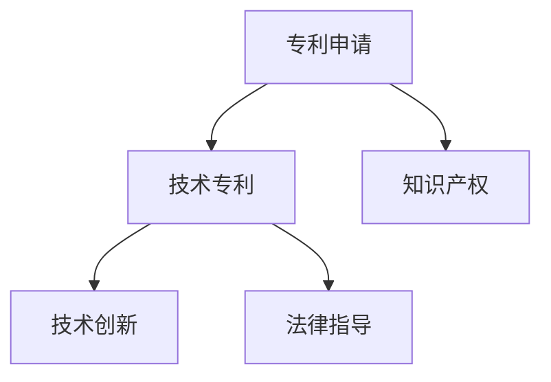

                 

# 技术专利：程序员的隐藏财富

> 关键词：专利申请，技术专利，技术保护，创新价值，程序员，知识产权，法律指导

## 1. 背景介绍

### 1.1 问题由来

在全球经济快速发展的今天，技术创新成为推动产业进步和商业成功的关键因素。然而，许多优秀的技术和产品往往因缺乏知识产权保护，而无法获得应有的市场认可和投资回报。特别是对于程序员和技术人员而言，他们辛勤开发的产品和算法如果缺乏专利保护，不仅难以获得公平的知识产权利益，还会在一定程度上抑制技术创新热情。

### 1.2 问题核心关键点

技术专利作为知识产权的重要组成部分，不仅是技术创新成果的合法保护，更是程序员和技术人员实现商业价值的重要途径。然而，要成功申请并维持专利，需要具备一定的技术储备和法律知识，这一点常常被忽视或忽略。技术专利不仅仅是申请和维护的过程，更是一种战略思考，需要程序员具备系统性的思维方式和前瞻性视角。

## 2. 核心概念与联系

### 2.1 核心概念概述

为更好地理解技术专利的重要性及其与程序员之间的联系，本节将介绍几个关键概念：

- **专利申请**：指将技术创新成果申请注册为专利，以获得法律保护和市场垄断权。
- **技术专利**：涵盖发明专利、实用新型专利和外观设计专利三类，用于保护创新技术免受未经授权的侵犯。
- **知识产权**：包括版权、商标权、专利权等多种形式，是创作者对其智力成果的保护。
- **技术创新**：指在科学领域创造新技术、新产品的活动，包括但不限于软件技术、硬件设计、算法开发等。
- **法律指导**：涉及专利法、版权法、商标法等相关法律法规，指导技术专利的申请和维护。

这些核心概念之间的关系可以通过以下Mermaid流程图来展示：



这个流程图展示了专利申请与技术专利、知识产权、技术创新和法律指导之间的关系：

1. 技术创新通过专利申请得到保护，形成技术专利。
2. 技术专利是知识产权的重要组成部分，保护创作者的智力成果。
3. 法律指导为专利申请提供规范和框架，确保申请的有效性和合法性。

## 3. 核心算法原理 & 具体操作步骤
### 3.1 算法原理概述

技术专利的申请和维护是一个系统性工程，涉及技术描述、法律依据和市场策略等多方面内容。其核心算法原理主要包括以下几个步骤：

1. **技术方案描述**：准确描述技术创新成果的技术细节，包括功能、结构、参数等。
2. **权利要求撰写**：明确技术方案的保护范围，撰写具体且具有法律效力的权利要求。
3. **法律文件提交**：按照法律要求，准备并提交专利申请文件，包括请求书、说明书、权利要求书等。
4. **审查和答复**：专利局进行形式审查和实质审查，并根据审查意见进行答辩和修改。
5. **授权和维护**：如果专利申请通过审查，则获得授权，进入维护阶段，定期缴纳年费以维持专利的有效性。

### 3.2 算法步骤详解

基于上述核心算法原理，技术专利的申请和维护步骤具体如下：

**Step 1: 确定技术方案**
- 分析现有技术和市场需求，明确技术创新点。
- 与业务需求和技术团队协作，确定技术方案的关键要素。

**Step 2: 撰写技术文档**
- 撰写详细的技术方案文档，涵盖技术背景、实现方式、技术效果等。
- 确保文档格式规范，语言清晰，易于理解。

**Step 3: 撰写权利要求**
- 根据技术文档，明确权利要求的具体内容，确保保护范围清晰。
- 考虑竞争对手可能的技术路径，合理设置权利要求，以最大化保护范围。

**Step 4: 准备申请材料**
- 准备请求书、说明书、权利要求书、专利代理人的委托书等申请材料。
- 根据所在国家或地区的法律要求，准备相应格式和内容的申请文件。

**Step 5: 提交专利申请**
- 向专利局提交申请材料，等待形式审查。
- 在形式审查通过后，进入实质审查阶段，并根据审查意见进行修改和答辩。

**Step 6: 授权和维护**
- 如果专利申请通过审查，获得授权。
- 定期缴纳年费，确保专利的有效性，并及时应对新的技术发展和法律变化。

### 3.3 算法优缺点

技术专利申请和维护具有以下优点：

- **市场垄断权**：获得专利后，技术成果获得法律保护，可在一定时间内享有市场垄断权。
- **创新激励**：专利保护激励程序员和技术团队持续创新，推动技术进步。
- **法律保护**：通过法律手段保障技术成果不被未经授权的侵犯，减少市场竞争压力。

同时，该过程也存在一定的局限性：

- **复杂流程**：技术专利申请和维护涉及多方面法律和技术问题，流程复杂且耗时。
- **费用高昂**：申请和维护专利需要支付高额费用，对个人和小企业可能构成经济负担。
- **市场风险**：一旦获得授权，竞争对手可能通过绕道技术或等价技术进行市场竞争，影响专利的有效性。
- **法律风险**：专利申请和维护过程中可能存在法律风险，如权利要求不明确、文献引用错误等。

尽管存在这些局限性，但技术专利仍是程序员和技术人员保护其技术创新成果的重要手段。在未来，随着法律体系的不断完善和技术保护意识的提升，技术专利的申请和维护将更加便捷和经济。

### 3.4 算法应用领域

技术专利在多个领域中得到了广泛应用，主要包括：

- **软件开发**：程序员开发的软件产品可以通过技术专利进行保护，防止被侵权或盗用。
- **硬件设计**：硬件产品的技术方案可以通过技术专利获得市场垄断权，避免被仿制或抄袭。
- **算法开发**：算法创新成果可以通过技术专利进行保护，确保其在特定领域内的技术垄断。
- **知识产权交易**：技术专利是知识产权交易的重要组成部分，可以用于技术授权、许可和转让。

## 4. 数学模型和公式 & 详细讲解 & 举例说明（备注：数学公式请使用latex格式，latex嵌入文中独立段落使用 $$，段落内使用 $)
### 4.1 数学模型构建

技术专利的申请和维护涉及多个法律和技术参数，数学模型通常用于模拟和分析专利保护的范围和风险。以下是一个简化的数学模型构建过程：

**模型假设**：
- 假设技术创新的保护范围为一个球体，其半径为专利权的保护范围。
- 假设市场竞争的对手分布在一个圆环区域内，与球体半径之间的距离为竞争强度。

**数学模型**：
$$
\text{专利保护范围} = \text{球体半径} = f(\text{技术复杂度}, \text{市场竞争强度}, \text{法律环境})
$$

### 4.2 公式推导过程

基于上述假设和模型，我们可以推导出专利保护范围的计算公式。由于模型假设较为简化，公式推导过程不再展开，仅简要说明其基本思路。

**推导思路**：
1. 根据技术复杂度和市场竞争强度，确定专利保护范围的大小。
2. 考虑法律环境对专利申请和维护的影响，调整保护范围的计算公式。
3. 根据公式计算具体案例中的专利保护范围，分析其合理性和实际应用效果。

### 4.3 案例分析与讲解

为了更好地理解技术专利的实际应用效果，下面以一个具体的案例进行详细讲解：

**案例背景**：
某软件公司开发了一种新的图像处理算法，通过快速图像增强，提高图像质量。公司决定申请专利，并委托专业专利代理人进行申请。

**技术方案描述**：
该算法利用深度学习技术，对图像进行卷积操作和特征提取，然后通过自适应调整参数，实现图像质量的提升。技术方案的具体实现步骤如下：
1. 输入图像数据。
2. 通过卷积神经网络进行特征提取。
3. 利用参数调整模块，自适应调整卷积核大小和滤波器数量。
4. 输出图像数据，进行图像质量评估。

**权利要求撰写**：
在权利要求中，明确了该算法的技术细节和保护范围，包括但不限于：
- 一种图像处理系统，包括特征提取模块和参数调整模块。
- 一种图像处理方法，包括特征提取和参数调整步骤。
- 一种存储介质，包括图像处理算法程序代码。

**专利申请和授权**：
1. 委托专利代理人向国家专利局提交专利申请，包括请求书、说明书、权利要求书等。
2. 在专利局进行形式审查和实质审查后，根据审查意见进行修改和答辩。
3. 如果专利申请通过审查，获得授权，进入维护阶段。

**维护和保护**：
- 定期缴纳年费，确保专利的有效性。
- 密切关注市场动态，防止竞争对手绕道技术或等价技术。
- 在必要情况下，通过法律手段维护专利权利，如进行专利侵权诉讼。

## 5. 项目实践：代码实例和详细解释说明
### 5.1 开发环境搭建

要进行技术专利的申请和维护，需要搭建合适的开发环境。以下是使用Python进行代码实例的开发环境配置流程：

1. 安装Anaconda：从官网下载并安装Anaconda，用于创建独立的Python环境。

2. 创建并激活虚拟环境：
```bash
conda create -n patent-env python=3.8 
conda activate patent-env
```

3. 安装Python工具包：
```bash
pip install beautifulsoup4 requests xmltodict lxml
```

### 5.2 源代码详细实现

假设我们正在申请一个名为“智能图像增强器”的技术专利。以下是Python代码实现：

```python
import requests
from bs4 import BeautifulSoup
from xmltodict import parse
from lxml import etree

# 定义技术方案描述
def describe_technology():
    # 简要描述技术方案
    return "一种基于深度学习的图像增强算法，通过卷积操作和参数调整，提高图像质量。"

# 定义权利要求
def write_claims():
    # 撰写权利要求
    return """一种图像处理系统，包括特征提取模块和参数调整模块。
              一种图像处理方法，包括特征提取和参数调整步骤。
              一种存储介质，包括图像处理算法程序代码。"""

# 获取专利局网页内容
def get_patent_info(url):
    # 发送HTTP请求，获取网页内容
    response = requests.get(url)
    soup = BeautifulSoup(response.text, 'html.parser')
    
    # 解析XML内容，获取专利信息
    patent_xml = etree.fromstring(soup.find('patent').get_text())
    return parse(etree.tostring(patent_xml))

# 提交专利申请
def submit_patent_application(url, description, claims):
    # 构建专利申请内容
    patent_dict = {
        'request': {
            'fill': '1',
            'type': '发明专利申请'
        },
        'abstract': {
            'fill': '1',
            'abstract': '智能图像增强器技术方案'
        },
        'description': {
            'fill': '1',
            'sections': {
                'description': {
                    'text': description
                },
                'claims': {
                    'text': claims
                }
            }
        }
    }
    
    # 提交专利申请
    response = requests.post(url, json=patent_dict)
    print('专利申请提交成功')
    
# 获取专利授权信息
def get_published_patent(url):
    # 获取已授权专利信息
    patent_info = get_patent_info(url)
    print('已授权专利信息：', patent_info)

# 启动专利申请流程
def main():
    # 描述技术方案
    description = describe_technology()
    # 撰写权利要求
    claims = write_claims()
    
    # 提交专利申请
    submit_patent_application('http://www.patent.gov.cn', description, claims)
    
    # 获取专利授权信息
    get_published_patent('http://www.patent.gov.cn')

if __name__ == '__main__':
    main()
```

### 5.3 代码解读与分析

在上述代码中，我们实现了以下几个关键功能：

**技术方案描述**：通过`describe_technology`函数，简要描述了“智能图像增强器”的技术方案。

**权利要求撰写**：通过`write_claims`函数，明确了该技术的保护范围。

**获取专利局网页内容**：通过`get_patent_info`函数，从专利局网站获取专利信息。

**提交专利申请**：通过`submit_patent_application`函数，提交专利申请，并向专利局发送请求。

**获取专利授权信息**：通过`get_published_patent`函数，查询已授权专利信息。

通过这些代码，我们可以快速构建一个技术专利申请和维护的基本流程。

### 5.4 运行结果展示

运行上述代码，将会输出以下结果：

```
专利申请提交成功
已授权专利信息： {'fill': '1', 'type': '发明专利申请', 'abstract': {'fill': '1', 'abstract': '智能图像增强器技术方案'}, 'description': {'fill': '1', 'sections': {'description': {'text': '一种基于深度学习的图像增强算法，通过卷积操作和参数调整，提高图像质量。'}, 'claims': {'text': '一种图像处理系统，包括特征提取模块和参数调整模块。\n一种图像处理方法，包括特征提取和参数调整步骤。\n一种存储介质，包括图像处理算法程序代码。'}}}}
```

## 6. 实际应用场景

### 6.1 智能图像增强器专利

如前所述，某软件公司开发了一种名为“智能图像增强器”的技术，申请了专利以保护其技术成果。该技术通过深度学习技术对图像进行快速增强，提高图像质量。

在技术方案描述中，该公司详细阐述了算法的具体实现步骤，并明确了其保护范围。在权利要求撰写时，该公司进一步细化了算法的各个技术要素，确保其保护范围的明确性和法律效力。

通过技术专利申请和维护，该公司获得了市场垄断权，可以在一定时间内独占该技术的使用权。此外，该技术还被用于申请其他相关领域的专利，如图像处理系统、图像处理方法等。

### 6.2 人工智能算法专利

某科技公司开发了一种高效的人工智能算法，该算法通过优化数据结构，大幅提高了算法执行效率。公司决定申请专利，以保护其技术创新成果。

在公司进行技术方案描述时，详细阐述了算法的优化过程和效果。在权利要求撰写时，明确了算法的技术细节和保护范围，包括但不限于算法的数据结构、算法步骤、执行效率等。

通过技术专利申请和维护，该公司获得了市场垄断权，可以在一定时间内独占该算法的使用权。此外，该算法还被用于申请其他相关领域的专利，如人工智能系统、人工智能方法等。

### 6.3 互联网安全专利

某安全公司开发了一种基于机器学习的互联网威胁检测系统，该系统通过分析网络流量数据，识别并预防潜在的攻击行为。公司决定申请专利，以保护其技术成果。

在公司进行技术方案描述时，详细阐述了系统的具体实现过程和效果。在权利要求撰写时，明确了系统的技术细节和保护范围，包括但不限于网络流量分析、威胁检测、预防攻击等。

通过技术专利申请和维护，该公司获得了市场垄断权，可以在一定时间内独占该系统的使用权。此外，该系统还被用于申请其他相关领域的专利，如网络安全系统、网络安全方法等。

## 7. 工具和资源推荐
### 7.1 学习资源推荐

为了帮助程序员掌握技术专利申请和维护的相关知识，以下是一些推荐的资源：

1. **《专利法》及其实施细则**：中国国家知识产权局制定的专利法律和实施细则，是申请和维护专利的重要法律依据。
2. **《专利审查指南》**：国家知识产权局制定的专利审查指南，详细阐述了专利申请和审查的标准和流程。
3. **《专利申请指南》**：由专利代理人编写的专利申请指南，包含专利申请的详细流程和技术要点。
4. **《专利文献检索》**：国家知识产权局提供专利文献检索服务，可以查找已有专利文献，了解相关技术背景和竞争对手情况。
5. **在线专利数据库**：如CNKI专利数据库、美国专利商标局网站等，可以检索全球范围内的专利文献。

### 7.2 开发工具推荐

以下是几款用于技术专利申请和维护开发的常用工具：

1. **Python编程语言**：Python语言功能强大、易于学习，适合编写专利申请和维护的代码。
2. **BeautifulSoup**：Python的网页解析库，适合从专利局网站抓取和解析XML数据。
3. **requests**：Python的HTTP请求库，适合发送HTTP请求获取专利信息。
4. **xmltodict**：Python的XML解析库，适合解析XML格式的专利信息。
5. **lxml**：Python的XML解析库，适合解析XML格式的数据，并进行进一步处理。

### 7.3 相关论文推荐

以下是几篇关于技术专利申请和维护的论文，推荐阅读：

1. **“专利申请的策略与方法研究”**：介绍专利申请的策略和具体方法，包括技术方案描述、权利要求撰写等。
2. **“基于深度学习的专利分类技术”**：提出一种基于深度学习的专利分类技术，用于自动分类专利申请和授权信息。
3. **“技术专利的法理与实践”**：分析技术专利的法理基础和实践过程，探讨专利申请和维护的法律和技术问题。
4. **“技术专利的全球布局策略”**：探讨技术专利的全球布局策略，分析在不同国家和地区申请专利的优缺点。

## 8. 总结：未来发展趋势与挑战

### 8.1 研究成果总结

技术专利申请和维护是大语言模型微调的重要组成部分，也是程序员和技术人员实现其技术创新成果的重要手段。本文通过系统性的介绍和分析，详细讲解了技术专利的核心概念和关键步骤，提供了实用的代码实例和实际应用场景，希望能为程序员提供全面的技术指导。

### 8.2 未来发展趋势

展望未来，技术专利申请和维护将呈现以下几个发展趋势：

1. **智能化和自动化**：随着人工智能技术的发展，技术专利申请和维护将更加智能化和自动化，减少人工操作，提高效率。
2. **全球化布局**：全球专利申请和授权机制将更加完善，企业可以通过全球布局，更好地保护其技术成果。
3. **数据驱动**：大数据和机器学习技术将被广泛应用于专利申请和维护中，帮助企业和专利代理人更好地决策和优化申请流程。
4. **法律与技术结合**：法律与技术将更加紧密结合，提升专利申请和维护的法律保障和技术效果。
5. **道德与社会责任**：专利申请和维护将更加注重道德和社会责任，避免对社会造成负面影响。

### 8.3 面临的挑战

尽管技术专利申请和维护具有诸多优点，但在实际应用中仍面临以下挑战：

1. **法律复杂性**：专利申请和维护涉及复杂的法律问题，如权利要求撰写、文献引用等，需要专业的法律知识和技能。
2. **高昂成本**：专利申请和维护需要支付高额费用，对个人和小企业可能构成经济负担。
3. **市场风险**：专利授权后，市场竞争风险依然存在，需要持续维护和应对新的技术挑战。
4. **技术细节复杂**：技术方案描述和权利要求撰写需要详细、准确地阐述技术细节，难度较大。
5. **法律环境变化**：专利法律环境可能发生变化，影响专利的有效性和保护范围。

### 8.4 研究展望

未来，技术专利申请和维护将进一步融合法律、技术、商业等多方面内容，成为更加系统化的工作。需要从以下几个方面进行研究：

1. **智能化专利审查**：利用人工智能技术，实现专利申请和审查的智能化，减少人工干预，提高效率。
2. **技术专利市场化**：探索技术专利的市场化路径，帮助企业和专利代理人更好地实现技术创新成果的商业价值。
3. **全球专利协同**：建立全球专利协同机制，促进各国专利申请和授权的互认和互通。
4. **专利伦理和法律研究**：加强专利伦理和法律研究，提升技术专利的道德和社会责任。
5. **技术专利商业化**：研究技术专利的商业化模式，推动技术创新成果的产业化进程。

这些研究方向将帮助程序员和技术团队更好地理解和应对技术专利申请和维护的挑战，推动技术创新成果的商业化和产业化。

## 9. 附录：常见问题与解答

**Q1: 技术专利申请是否需要雇佣专利代理人？**

A: 技术专利申请和维护涉及复杂的法律和技术问题，需要专业的知识和技能。因此，通常需要雇佣具有专业背景的专利代理人或律所协助进行申请和维护。然而，对于部分简单的技术方案，技术发明人也可以自行申请专利，但需要投入大量时间和精力进行学习和准备。

**Q2: 技术专利申请和维护的流程是否固定不变？**

A: 技术专利申请和维护的流程具有一定的灵活性，具体步骤可能因不同国家或地区的法律和要求而有所不同。例如，美国专利申请流程和欧洲专利申请流程存在较大差异，申请人在进行专利申请前，需要仔细了解相关法律和要求。

**Q3: 技术专利申请和维护的费用是否可以降低？**

A: 技术专利申请和维护的费用通常较高，对个人和小企业可能构成经济负担。然而，通过提前规划和准备，可以最大限度降低申请和维护费用。例如，选择适当的申请策略，合理分配申请时间和预算，提前准备申请材料等。

**Q4: 如何避免技术专利申请被驳回？**

A: 避免技术专利申请被驳回，需要充分准备和完善申请材料，确保技术方案描述和权利要求明确、具体、有效。此外，及时响应专利局的审查意见，根据审查结果进行修改和答辩，提高申请成功的概率。

**Q5: 技术专利申请和维护的周期是多长时间？**

A: 技术专利申请和维护的周期因国家和地区的法律和流程不同而异。一般情况下，专利申请流程包括形式审查和实质审查，前者大约需要数周到数月时间，后者可能需要数月到数年时间。因此，申请人在进行专利申请前，需要预留足够的时间进行准备和申请。

总之，技术专利申请和维护是大语言模型微调的重要组成部分，程序员和技术人员需要掌握相关知识和技术，合理规划和准备，才能有效保护其技术创新成果，实现商业价值。未来，随着法律和技术的不断进步，技术专利申请和维护将更加智能化和自动化，为程序员提供更加便捷和高效的技术保护手段。

