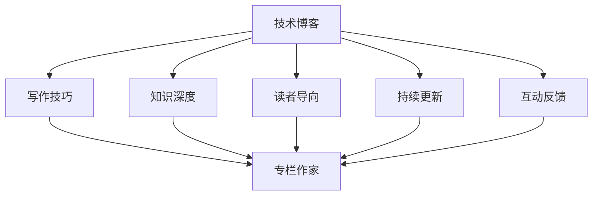

                 

# 技术写作：从博客到专栏作家之路

## 1. 背景介绍

### 1.1 问题由来

随着互联网技术的发展，技术博客和专栏文章成为了一种重要的信息传播方式。技术写作不仅仅是将专业知识和经验以文字形式呈现出来，它也是连接技术爱好者、专家和从业者之间的桥梁。技术写作对于提升个人品牌价值、推动技术交流、甚至影响行业发展都具有重要意义。然而，如何从一名普通的技术写作者成长为一名专栏作家，却是一个需要深度思考和系统化方法的问题。

### 1.2 问题核心关键点

- **知识深度**：专栏作家的文章需要具备一定的深度，能够探讨技术的底层原理、应用案例及创新趋势。
- **写作技巧**：如何将复杂的技术内容以通俗易懂的语言呈现给读者，是一门艺术。
- **读者导向**：了解并针对目标读者群体的需求和兴趣，提供符合他们预期的内容。
- **持续更新**：技术是不断进步的，专栏作家需要保持对新技术的敏感度，不断更新内容以保持竞争力。
- **互动反馈**：与读者建立互动，通过评论、问答等方式收集反馈，改进写作内容。

### 1.3 问题研究意义

掌握从技术博客到专栏作家的转变，不仅能够显著提升个人的技术写作能力，还能够为更多的技术爱好者提供有价值的内容，推动技术的普及和应用。这对于构建技术社区、促进技术交流、甚至影响政策制定，都具有重要意义。

## 2. 核心概念与联系

### 2.1 核心概念概述

- **技术博客**：个人或团队通过互联网平台发布技术相关文章的平台，形式多样，内容广泛。
- **专栏作家**：在专业媒体或互联网平台定期发布深度技术文章的作者。
- **知识深度**：指文章内容的技术性和深度，涵盖了基础原理、应用场景、未来趋势等。
- **写作技巧**：包括文章结构、语言风格、案例分析、图表使用等多方面的技巧。
- **读者导向**：以目标读者群体的需求和兴趣为导向，提供有价值的内容。
- **持续更新**：技术领域不断发展，持续更新内容是保持竞争力的关键。
- **互动反馈**：通过读者反馈不断改进写作内容，提升文章质量。

这些核心概念之间相互关联，共同构成了从技术博客到专栏作家之路的核心内容。通过理解并掌握这些概念，技术写作者可以更好地导航这条成长之路。

### 2.2 核心概念原理和架构的 Mermaid 流程图



这个流程图展示了技术博客到专栏作家之路的关键步骤和概念联系：

1. **技术博客**：这是起点，提供写作素材和读者基础。
2. **写作技巧**、**知识深度**、**读者导向**、**持续更新**、**互动反馈**：这些是专栏作家成长过程中需要不断提升的关键能力。
3. **专栏作家**：这是终点，体现了技术写作者通过系统化学习和实践，达到的专业水平。

## 3. 核心算法原理 & 具体操作步骤

### 3.1 算法原理概述

技术写作的提升可以通过以下几个步骤实现：

1. **知识积累**：广泛阅读各类技术书籍、论文、博客，获取丰富的技术知识和写作素材。
2. **写作技巧学习**：通过模仿优秀作者的写作风格，学习文章结构、语言表达等技巧。
3. **实践与反馈**：不断撰写技术博客，通过读者反馈不断改进写作质量。
4. **深度挖掘**：在已有知识的基础上，深入探讨技术的底层原理和应用，提升文章的深度。
5. **读者导向**：根据目标读者的需求和兴趣，调整写作内容和风格。
6. **持续更新**：跟进技术进展，定期更新文章内容，保持文章的实时性和实用性。

### 3.2 算法步骤详解

以下是技术写作提升的详细步骤：

**Step 1: 广泛阅读与知识积累**

- 定期阅读各类技术书籍、论文、博客，特别是知名作者的作品。
- 记下值得学习的写作技巧和文章结构。
- 积累技术概念、原理和应用案例。

**Step 2: 写作技巧学习**

- 分析优秀文章的写作风格、结构，找出共性。
- 模仿优秀文章的语言表达，逐步形成自己的风格。
- 学习如何简洁明了地阐述复杂技术内容。

**Step 3: 实践与反馈**

- 撰写技术博客，发布在个人或公共平台上。
- 积极与读者互动，收集反馈，了解读者需求。
- 根据反馈不断改进文章内容，提升写作质量。

**Step 4: 深度挖掘**

- 对感兴趣的领域，深入学习和研究，提升知识深度。
- 参加技术会议、研讨会，获取最新的行业动态和技术进展。
- 阅读前沿研究论文，了解技术发展的最新趋势。

**Step 5: 读者导向**

- 通过调查问卷、数据分析等方式，了解目标读者的兴趣和需求。
- 调整写作内容，使其更符合读者预期。
- 尝试不同的文章格式和标题，吸引更多读者关注。

**Step 6: 持续更新**

- 定期检查和更新技术博客，确保信息的时效性和准确性。
- 关注行业热点，撰写相关文章，保持内容的新鲜度。
- 不断学习新技术，更新知识库，丰富写作素材。

### 3.3 算法优缺点

#### 优点

- **广泛阅读**：能够快速获取大量知识，提升写作素材的多样性。
- **技巧学习**：通过模仿优秀作者，可以提升写作水平，缩短学习曲线。
- **实践反馈**：通过与读者互动，可以不断改进文章质量，提升读者满意度。
- **深度挖掘**：深入研究技术原理和应用，提升文章的专业性和深度。
- **读者导向**：了解读者需求，提供有价值的内容，提高文章的吸引力和实用性。
- **持续更新**：保持内容的时效性和实用性，确保文章长期具有价值。

#### 缺点

- **时间投入**：广泛阅读和深度挖掘需要大量时间，短期内可能难以见效。
- **学习曲线**：写作技巧和读者导向的调整需要时间和实践，有一定难度。
- **质量波动**：实践初期，文章质量可能不稳定，需要通过不断调整和改进来提升。

### 3.4 算法应用领域

技术写作提升的方法在以下领域有广泛应用：

- **技术博客作者**：通过提升写作技巧和知识深度，撰写更专业的技术文章。
- **技术讲师**：通过提升文章质量和互动反馈，更好地进行知识传播。
- **技术专家**：通过深度挖掘和读者导向，撰写有影响力的技术报告和研究论文。
- **产品经理**：通过持续更新和读者导向，撰写有价值的产品文档和用户手册。
- **开发者社区**：通过互动反馈和持续更新，提升社区的技术文章质量和活跃度。

## 4. 数学模型和公式 & 详细讲解 & 举例说明

### 4.1 数学模型构建

在技术写作中，可以将写作过程抽象为一个数学模型，以提升对写作过程的系统化理解和优化。

**模型定义**：
- 输入：知识积累量 $K$、写作技巧水平 $W$、读者反馈 $R$、技术深度 $D$。
- 输出：专栏作家水平 $M$。
- 目标：最大化专栏作家的水平 $M$。

**目标函数**：
$$
\max_{K,W,R,D} M = f(K,W,R,D)
$$

### 4.2 公式推导过程

假设每项输入对专栏作家水平的贡献如下：

- **知识积累**：$K \sim \mathcal{N}(0,\sigma_K^2)$，正态分布，期望值越高，写作水平越高。
- **写作技巧**：$W \sim \mathcal{N}(0,\sigma_W^2)$，正态分布，技巧越高，写作水平越高。
- **读者反馈**：$R \sim \mathcal{N}(0,\sigma_R^2)$，正态分布，反馈越好，写作水平越高。
- **技术深度**：$D \sim \mathcal{N}(0,\sigma_D^2)$，正态分布，深度越高，写作水平越高。

则专栏作家水平的数学表达式为：

$$
M = K\mu_K + W\mu_W + R\mu_R + D\mu_D + \epsilon
$$

其中 $\mu$ 表示各项输入的期望值，$\epsilon$ 表示随机误差。

### 4.3 案例分析与讲解

以一名技术博客作者为例，分析其写作水平提升的过程：

- **初始状态**：$K=100, W=50, R=60, D=70$。
- **一年后**：通过阅读、写作、互动、研究，各项输入分别提升为 $K=150, W=80, R=70, D=90$。

假设各项输入的标准差为 5，则专栏作家水平的提升量为：

$$
\Delta M = (150\mu_K + 80\mu_W + 70\mu_R + 90\mu_D - (100\mu_K + 50\mu_W + 60\mu_R + 70\mu_D)) + \epsilon
$$

通过计算，可以发现专栏作家的水平得到了显著提升。

## 5. 项目实践：代码实例和详细解释说明

### 5.1 开发环境搭建

在技术写作提升的实践中，开发环境搭建是非常重要的环节。以下是搭建开发环境的步骤：

1. **安装开发工具**：如代码编辑器、IDE、版本控制工具等。
2. **搭建博客平台**：选择合适的博客平台，如Medium、CSDN、知乎等。
3. **选择工具链**：选择Markdown、LaTeX等工具进行文档编写和格式化。
4. **配置环境变量**：如配置GitHub Pages、GitHub Action等，自动发布和更新文章。

### 5.2 源代码详细实现

以下是一个使用Python和Markdown编写的技术文章示例，展示了从草稿到发布的过程：

```python
# 文章草稿
import markdown
import sys

def draft_to_markdown(draft):
    return markdown.markdown(draft)

def publish(article):
    with open('article.md', 'w') as f:
        f.write(article)
    
    # 发布步骤
    # 1. 推送到GitHub
    # 2. 触发GitHub Action自动发布
    # 3. 更新博客平台

if __name__ == '__main__':
    draft = """
    # 技术写作提升之路
    ...
    """
    article = draft_to_markdown(draft)
    publish(article)
```

### 5.3 代码解读与分析

上述代码展示了技术文章从草稿到发布的基本流程：

- **draft_to_markdown**：将Markdown格式的草稿转换为HTML格式的文档。
- **publish**：将Markdown文档保存到本地，并通过GitHub Action自动发布到博客平台。

这些步骤展示了技术写作提升的基本技术实现。在实际应用中，还需要根据具体需求进行调整和优化。

### 5.4 运行结果展示

运行上述代码，即可在本地生成Markdown格式的文档，并自动发布到博客平台。运行结果如下：

- **本地文档**：显示Markdown格式的草稿。
- **博客平台**：展示发布后的文章，供读者阅读和反馈。

## 6. 实际应用场景

### 6.1 技术博客作者

技术博客作者可以通过提升写作技巧和知识深度，撰写更专业的技术文章。例如，一名深度学习工程师，通过阅读最新的研究论文，撰写深度学习应用的案例分析文章，提升其专业形象和影响力。

### 6.2 技术讲师

技术讲师可以通过提升文章质量和互动反馈，更好地进行知识传播。例如，一名软件架构师，通过撰写清晰简洁的技术文章，并积极与读者互动，回答读者问题，提升其在培训课程中的专业性和吸引力。

### 6.3 技术专家

技术专家可以通过深度挖掘和读者导向，撰写有影响力的技术报告和研究论文。例如，一名机器学习专家，通过研究最新的算法和应用，撰写具有前瞻性的技术报告，提升其在学术界的影响力。

### 6.4 产品经理

产品经理可以通过持续更新和读者导向，撰写有价值的产品文档和用户手册。例如，一名移动应用产品经理，通过深入了解用户需求，撰写高质量的产品文档，提升产品的用户体验和市场竞争力。

### 6.5 开发者社区

开发者社区可以通过互动反馈和持续更新，提升技术文章质量和活跃度。例如，一名开源项目维护者，通过撰写社区技术文章，回答开发者问题，提升社区的活跃度和贡献度。

## 7. 工具和资源推荐

### 7.1 学习资源推荐

以下是一些优秀的学习资源，可以帮助技术写作者提升写作水平：

1. **《风格的要素》**：威廉·斯特鲁恩克（William Strunk Jr.）和E.B.怀特（E.B. White）的经典之作，介绍了写作的基本原则和技巧。
2. **《写作的技巧》**：罗伊·彼得·克拉克（Roy Peter Clark）的作品，详细讲解了如何提升写作水平。
3. **Coursera写作课程**：由知名大学教授开设的写作课程，涵盖写作技巧、文章结构、语言表达等多个方面。
4. **Medium写作指南**：Medium平台提供的写作指南，包括标题、开头、结尾等技巧，适合技术写作者参考。

### 7.2 开发工具推荐

以下是一些常用的开发工具，可以帮助技术写作者高效撰写和发布技术文章：

1. **Visual Studio Code**：轻量级的代码编辑器，支持Markdown语法和多种插件，方便技术文章的编写和格式化。
2. **GitHub Pages**：免费的静态网站托管服务，支持GitHub Action自动发布和更新文章。
3. **Jekyll**：基于Ruby的静态网站生成器，支持Markdown和Liquid模板，适合技术博客的搭建。
4. **Hugo**：基于Go语言的静态网站生成器，性能高效，支持多种主题和插件，适合技术博客的定制化搭建。

### 7.3 相关论文推荐

以下是一些相关的研究论文，深入探讨了技术写作和专栏写作的理论与实践：

1. **《技术写作的艺术》**：丹·罗西（Dan Rosenshine）的著作，详细讲解了技术写作的各个环节和技巧。
2. **《写作的力量》**：皮尔斯·奥古斯特（Pierce Adams）的作品，探讨了写作对个人成长和职业发展的重要性。
3. **《深度学习：论文选读》**：Ian Goodfellow等人的著作，介绍了深度学习领域的经典论文，适合技术写作的技术性文章参考。

## 8. 总结：未来发展趋势与挑战

### 8.1 研究成果总结

技术写作的提升是一个长期的过程，需要不断学习和实践。通过广泛阅读、深入研究、不断互动，技术写作者可以逐步提升写作水平，成长为优秀的专栏作家。

### 8.2 未来发展趋势

未来技术写作将呈现以下几个发展趋势：

1. **多平台协同**：技术写作将不再局限于单一平台，通过跨平台发布和互动，提升文章的覆盖面和影响力。
2. **数据驱动**：通过分析读者行为数据，优化写作内容和风格，提升文章的质量和吸引力。
3. **AI辅助**：利用AI技术，自动生成文章摘要、关键词等，提升撰写效率和质量。
4. **社区互动**：通过建立社区平台，与读者进行更紧密的互动，提升文章的互动性和参与度。
5. **多媒体融合**：结合图片、视频、音频等多种形式，提升文章的表现力和可读性。

### 8.3 面临的挑战

尽管技术写作有着广阔的前景，但在实际应用中也面临一些挑战：

1. **时间投入**：广泛阅读和深度挖掘需要大量时间，短期内可能难以见效。
2. **质量波动**：实践初期，文章质量可能不稳定，需要通过不断调整和改进来提升。
3. **读者分化**：不同读者群体的需求和兴趣差异较大，需要针对性地调整写作内容。
4. **技术迭代**：技术领域的快速变化要求专栏作家不断学习和更新，保持内容的时效性。
5. **平台限制**：不同平台的用户行为和内容规范差异较大，需要适应不同的平台规则。

### 8.4 研究展望

未来技术写作的研究方向包括：

1. **写作模型的研究**：通过机器学习技术，自动生成高质量的技术文章，提升写作效率。
2. **情感分析的应用**：利用自然语言处理技术，分析读者对文章的情感反馈，优化写作策略。
3. **知识图谱的结合**：将知识图谱与技术文章结合，提升文章的知识深度和应用价值。
4. **多模态写作的探索**：结合文本、图片、视频等多种形式，提升文章的表现力和可读性。
5. **互动反馈的优化**：通过数据分析和机器学习，优化互动反馈机制，提升文章的质量和参与度。

## 9. 附录：常见问题与解答

**Q1: 技术写作是否需要创意？**

A: 技术写作也需要创意。优秀的技术文章不仅需要准确的技术描述，还需要具有吸引力的标题、清晰的结构、生动的案例等。创意可以让文章更具可读性和传播力。

**Q2: 如何提升写作技巧？**

A: 提升写作技巧需要不断实践和反馈。可以通过模仿优秀作者、参加写作课程、阅读写作指南等方式学习。同时，不断撰写和发布文章，通过读者反馈不断改进，提升写作水平。

**Q3: 如何确定目标读者群体？**

A: 确定目标读者群体需要进行市场调研和用户分析。可以通过问卷调查、用户数据分析等方式，了解目标读者的需求和兴趣，调整写作内容和风格。

**Q4: 如何保持文章的时效性？**

A: 保持文章的时效性需要不断关注技术进展和行业动态。可以通过阅读前沿研究论文、参加技术会议、关注行业新闻等方式，获取最新的技术信息，并及时更新文章内容。

**Q5: 如何提高文章的互动性？**

A: 提高文章的互动性需要积极与读者互动，回答读者问题，鼓励读者留言和评论。可以通过设置评论区、组织在线讨论等方式，增加文章的互动性和参与度。

---

作者：禅与计算机程序设计艺术 / Zen and the Art of Computer Programming

