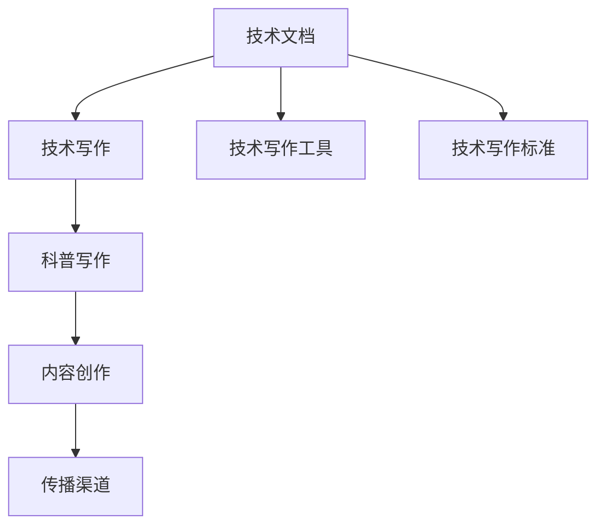

                 

# 技术写作：从技术文档到畅销书

> 关键词：技术文档, 技术写作, 畅销书, 科普, 技术传播, 内容创作

## 1. 背景介绍

### 1.1 问题由来

随着科技的快速发展，越来越多复杂的技术和知识涌现出来，如何清晰、准确地将这些知识传达给非专业人士，成为当下的一大挑战。技术文档和科普文章是实现这一目标的主要手段，但现有的技术写作方式往往难以满足广大读者的需求。这不仅导致知识传播的效率低下，还可能引发误解和歧义。

### 1.2 问题核心关键点

技术写作的挑战主要集中在以下几个方面：

- **复杂性**：技术文档往往内容庞杂，涉及众多专业术语和概念，非专业人士难以理解。
- **枯燥性**：传统的技术写作往往只关注数据和算法，缺乏故事性和情感联系，难以引起读者的兴趣。
- **可读性**：过于专业和复杂的表达方式，使得普通读者难以消化，影响传播效果。
- **交流障碍**：不同领域的读者对专业术语的理解可能存在差异，影响信息的有效传递。
- **标准化问题**：技术写作缺乏统一的标准和规范，导致内容质量参差不齐。

解决这些问题，需要从技术文档的内容、形式和传播渠道等多个层面进行创新。如何将深奥的技术知识转化为易于理解、传播广泛的内容，是当下技术写作面临的重要课题。

## 2. 核心概念与联系

### 2.1 核心概念概述

为了更好地理解技术写作的过程和方法，我们需要先介绍几个核心概念：

- **技术文档**：以技术为核心的文档，主要用于记录、传达技术知识，如开发手册、用户手册、技术报告等。
- **技术写作**：一种专注于将技术知识转化为易于理解、传播广泛的形式的写作方法。
- **技术写作工具**：辅助技术写作的自动化工具，如DocBook、LaTeX等。
- **技术写作标准**：确保技术文档质量和一致性的规范和指南。
- **科普写作**：将复杂的技术知识转化为通俗易懂、有趣有料的形式，传播给更广泛的受众。
- **内容创作**：通过创作具有高度吸引力和深度的内容，促进技术知识的传播和理解。

这些概念之间的逻辑关系可以通过以下Mermaid流程图来展示：



这个流程图展示了从技术文档到内容创作的整个流程，以及各个环节之间的联系。

## 3. 核心算法原理 & 具体操作步骤

### 3.1 算法原理概述

技术写作的原理是通过科学合理的组织和表达方式，将技术知识转化为易于理解、传播广泛的内容。其核心在于将复杂的技术问题分解为易于理解的小单元，并通过故事性、情感联系、图解等多维度的表达方式，使得受众能够顺畅地接受和理解。

### 3.2 算法步骤详解

技术写作的具体步骤如下：

**Step 1: 确定目标受众**

- 分析目标受众的知识背景、需求和兴趣点。
- 确定受众希望从文档中获取哪些信息，以及期望的表达方式。

**Step 2: 分解技术问题**

- 将复杂的项目或技术问题分解为多个子问题。
- 针对每个子问题，明确其输入、输出和内部机制。

**Step 3: 设计结构框架**

- 确定文档的总体结构，如引言、正文、结论等部分。
- 对每个部分的内容进行详细规划，确保逻辑清晰、层次分明。

**Step 4: 撰写文本内容**

- 根据结构框架，逐一撰写每个部分的文本内容。
- 使用易于理解的语言，避免使用专业术语或复杂的数学表达式。
- 通过图解、案例分析等方式增强内容的可读性。

**Step 5: 进行内容优化**

- 审校文本，检查语法、拼写等错误。
- 确保内容的准确性和一致性。
- 通过反馈和迭代，不断优化内容表达方式。

### 3.3 算法优缺点

技术写作的优势在于其能够将复杂的技术知识转化为易于理解、传播广泛的形式，提高知识传播的效率和效果。其缺点在于，编写高质量的技术文档需要较高的专业水平和表达能力，且难以量化其效果。

### 3.4 算法应用领域

技术写作在科技文献、产品文档、培训材料、科普文章等多个领域均有广泛应用。通过合理的技术写作，可以将深奥的技术知识传播给更广泛的受众，促进技术创新和应用。

## 4. 数学模型和公式 & 详细讲解 & 举例说明

### 4.1 数学模型构建

技术写作的数学模型主要涉及信息传播的效率和效果。假设有一个技术知识 $K$，通过技术写作转化为易于理解的内容 $C$，传播给受众 $R$，传播效果 $E$ 可以表示为：

$$
E = f(K, C, R)
$$

其中，$f$ 表示传播效果与知识复杂度、内容可读性和受众理解能力之间的关系。

### 4.2 公式推导过程

为了简化公式，假设 $f$ 为线性函数，则传播效果可以表示为：

$$
E = k_1 \cdot \frac{K}{k_2} + k_3 \cdot C + k_4 \cdot R
$$

其中，$k_1$、$k_2$、$k_3$、$k_4$ 为模型参数，分别代表知识复杂度、内容可读性、受众理解能力对传播效果的影响。

### 4.3 案例分析与讲解

以机器学习算法为例，一个复杂的深度学习模型可能包含数百个参数和数十层网络。为了使读者易于理解，可以将模型结构分解为多个子模块，分别介绍其功能和输入输出。同时，通过图解和案例分析，使读者能够直观地理解模型的运行机制和应用场景。

## 5. 项目实践：代码实例和详细解释说明

### 5.1 开发环境搭建

为了进行技术写作，我们需要准备一个适合开发和编辑的开发环境。以下是使用Markdown和LaTeX进行技术文档编写的环境配置流程：

1. 安装Markdown编辑器：从官网下载并安装Markdown编辑器，如Typora、Sublime Text等。
2. 安装LaTeX发行版：从官网下载并安装LaTeX发行版，如MiKTeX、MacTeX等。
3. 配置LaTeX编辑器：在Markdown编辑器中配置LaTeX编译器，确保能够进行自动编译。

### 5.2 源代码详细实现

下面以编写一个简单的技术文档为例，展示技术写作的过程。

```markdown
# 技术文档：Python爬虫开发教程

## 1. 引言

Python爬虫技术在数据采集和网络应用中有着广泛的应用。本文档将详细介绍Python爬虫的开发过程，包括需求分析、代码编写、测试和部署等方面。

## 2. 需求分析

### 2.1 数据源分析

在选择数据源时，需要考虑数据的结构、规模和来源。常见的数据源包括网页、API、数据库等。

### 2.2 爬虫目标

明确爬虫的爬取目标，如抓取网页内容、下载图片、提取数据等。

## 3. 代码编写

### 3.1 环境配置

安装必要的Python库和工具，如requests、BeautifulSoup、Scrapy等。

### 3.2 爬虫实现

通过Scrapy框架实现爬虫逻辑，包括爬虫启动、页面请求、数据解析和存储等。

## 4. 测试和部署

### 4.1 单元测试

使用unittest框架编写单元测试，确保代码的正确性。

### 4.2 部署

将爬虫部署到服务器上，设置定时任务，定期爬取数据。

## 5. 结论

通过本文档的学习，读者可以掌握Python爬虫的开发过程，应用于实际项目中。
```

### 5.3 代码解读与分析

上述Markdown文档使用了标题、有序列表、无序列表、代码块等基本元素，通过LaTeX编译器可以生成格式规范、美观的技术文档。读者可以通过阅读文档，了解Python爬虫的基本开发流程和要点。

## 6. 实际应用场景

### 6.1 技术文档

技术文档是技术写作的主要形式，广泛应用于软件开发、产品使用、技术支持等领域。通过合理的技术写作，开发者可以清晰地记录和传递技术知识，提高开发效率和用户体验。

### 6.2 科普文章

科普文章是将复杂的技术知识转化为易于理解的形式，传播给更广泛的受众。通过故事性和情感联系，科普文章可以激发读者的兴趣，提高传播效果。

### 6.3 培训材料

培训材料是技术写作在教育培训领域的重要应用。通过简洁明了的表达方式，培训材料可以使学习者快速掌握技术知识，提高培训效果。

### 6.4 未来应用展望

未来，随着技术写作的不断发展，其将更加注重内容的创新和传播方式的优化。通过引入多媒体元素、互动体验等新技术，技术写作将更加生动、有趣，能够更好地满足受众的需求。

## 7. 工具和资源推荐

### 7.1 学习资源推荐

为了帮助开发者系统掌握技术写作的方法和技巧，这里推荐一些优质的学习资源：

1. 《技术写作的艺术》（The Art of Technical Writing）：经典技术写作教材，详细介绍了技术写作的各个方面，是入门学习的必备资料。
2. 《科学写作的艺术》（The Art of Scientific Writing）：科学写作的权威指南，介绍了科学研究的写作规范和技巧。
3. 《科普写作的技巧》（The Craft of Science Communication）：专注于科普写作的指南，提供了丰富的案例和实用建议。
4. Coursera技术写作课程：由知名大学教授开设的在线课程，提供系统化的技术写作培训。
5. Udemy科普写作课程：面向非专业人士的科普写作课程，强调内容的趣味性和可读性。

通过对这些资源的学习实践，相信你一定能够快速掌握技术写作的精髓，并用于解决实际的传播问题。

### 7.2 开发工具推荐

高效的开发离不开优秀的工具支持。以下是几款用于技术写作开发的常用工具：

1. Markdown编辑器：如Typora、Sublime Text等，支持Markdown语法，易于编写和编辑技术文档。
2. LaTeX编辑器：如TeXstudio、Overleaf等，支持LaTeX语法，用于生成高质量的技术文档。
3. Jupyter Notebook：支持代码和文本的混合编写，便于进行数据处理和模型训练。
4. Visual Studio Code：支持多种编程语言和扩展，提供强大的代码编辑和调试功能。
5. GitHub Pages：提供免费的静态网站托管服务，方便发布和分享技术文档。

合理利用这些工具，可以显著提升技术写作的效率和质量，加速创新迭代的步伐。

### 7.3 相关论文推荐

技术写作的研究源于学界的持续探索。以下是几篇奠基性的相关论文，推荐阅读：

1. "The Art of Scientific Writing"（科学写作的艺术）：作者D.E. Littlefield，介绍科学写作的基本规范和技巧。
2. "Technical Writing: A Process Approach"（技术写作：过程方法）：作者Karlene Z. Zerby，详细介绍了技术写作的流程和工具。
3. "Communicating Technical Information: Styles, Genres, and Communities"（技术信息的传播：风格、类型和社区）：作者Marianne M. Burkhardt，探讨了技术写作的风格和类型。
4. "Technical Writing and Communication: An Handbook"（技术写作与沟通：手册）：作者John G. Landis，提供了技术写作的综合指南。
5. "Writing Effective Documentation"（编写有效的技术文档）：作者Mark Weinger，介绍了有效技术文档的编写技巧。

这些论文代表了大语言模型微调技术的发展脉络。通过学习这些前沿成果，可以帮助研究者把握学科前进方向，激发更多的创新灵感。

## 8. 总结：未来发展趋势与挑战

### 8.1 总结

本文对技术写作的过程和方法进行了全面系统的介绍。首先阐述了技术写作的背景和意义，明确了其重要性。其次，从原理到实践，详细讲解了技术写作的数学模型和操作步骤，给出了技术文档编写的完整代码实例。同时，本文还广泛探讨了技术写作在多个行业领域的应用前景，展示了技术写作范式的巨大潜力。此外，本文精选了技术写作的各种学习资源，力求为读者提供全方位的技术指引。

通过本文的系统梳理，可以看到，技术写作作为技术知识传播的重要手段，其重要性日益凸显。通过技术写作，开发者能够清晰地记录和传递技术知识，提高开发效率和用户体验，为技术创新和应用提供坚实的基础。未来，随着技术写作的不断发展，必将更好地推动技术知识的传播和应用，为人类社会的进步贡献力量。

### 8.2 未来发展趋势

展望未来，技术写作将呈现以下几个发展趋势：

1. **多媒体元素的引入**：通过视频、音频、动画等多媒体元素，使技术文档更加生动有趣，吸引读者的注意力。
2. **互动体验的设计**：通过互动式界面和工具，使读者能够更直观地理解和应用技术知识。
3. **数据驱动的写作**：利用大数据和人工智能技术，分析受众的行为和需求，优化技术写作的内容和形式。
4. **全球化传播**：利用多语言支持和跨文化理解，使技术文档能够更好地服务于全球受众。
5. **可持续发展**：强调环保和可持续发展的理念，将绿色技术知识融入技术写作中。

这些趋势将推动技术写作向更加高效、生动、可读的方向发展，为技术知识传播提供更多可能。

### 8.3 面临的挑战

尽管技术写作已经取得了一定的发展，但在迈向更加智能化、普适化应用的过程中，它仍面临着诸多挑战：

1. **知识深度和广度的平衡**：如何在保持知识深度的同时，让技术文档更加易于理解，这是一个需要不断探索的难题。
2. **多语言和跨文化传播**：不同语言和文化背景的受众对技术文档的理解可能存在差异，如何统一规范和表达方式，是一个挑战。
3. **技术变化迅速**：技术文档需要不断更新和维护，以适应快速变化的技术环境。
4. **数据隐私和安全性**：在技术写作中，如何保护用户的数据隐私和系统安全，也是一个重要问题。

这些挑战需要通过技术创新和政策支持来逐步解决。唯有不断探索和优化技术写作的方法，才能更好地满足受众的需求，推动技术知识的传播和应用。

### 8.4 研究展望

未来的技术写作研究需要在以下几个方面寻求新的突破：

1. **多模态融合**：将文本、图片、视频等多模态信息结合起来，丰富技术文档的表现形式。
2. **交互式设计**：开发更加智能和交互式的技术文档，使读者能够更主动地探索和理解内容。
3. **人工智能辅助**：利用人工智能技术自动生成和优化技术文档，提高写作效率和质量。
4. **情感化表达**：通过故事性和情感联系，使技术文档更具亲和力和吸引力。
5. **多学科交叉**：结合心理学、社会学、语言学等多学科知识，提升技术写作的效果和传播效果。

这些研究方向的探索，必将引领技术写作技术迈向更高的台阶，为构建人机协同的智能社会提供新的可能性。面向未来，技术写作需要与其他人工智能技术进行更深入的融合，共同推动技术知识传播的进步。

## 9. 附录：常见问题与解答

**Q1：如何提高技术文档的可读性？**

A: 技术文档的可读性是其传播效果的关键。以下是一些提高可读性的方法：
1. 使用简洁明了的语言，避免使用专业术语和复杂的数学表达式。
2. 通过图解、案例分析等方式增强内容的可读性。
3. 根据受众的需求，调整文档的结构和内容。
4. 定期更新和维护技术文档，保持其时效性和准确性。

**Q2：如何选择适合的技术写作工具？**

A: 技术写作工具的选择应根据具体需求和个人喜好来决定。以下是一些常用工具的优缺点：
1. Markdown编辑器：易于编写和编辑，支持多平台。
2. LaTeX编辑器：生成高质量文档，但学习曲线较陡。
3. Jupyter Notebook：支持代码和文本的混合编写，便于数据处理和模型训练。
4. Visual Studio Code：支持多种编程语言和扩展，提供强大的代码编辑和调试功能。

**Q3：如何进行技术写作的质量评估？**

A: 技术写作的质量评估可以从以下几个方面进行：
1. 内容的准确性和一致性。
2. 受众的反馈和满意度。
3. 知识传播的效果和影响。
4. 技术的创新性和实用性。

**Q4：如何优化技术文档的传播效果？**

A: 技术文档的传播效果可以通过以下方法优化：
1. 通过社交媒体和线上平台，扩大文档的传播范围。
2. 结合多媒体元素，增强文档的吸引力和可读性。
3. 与实际应用相结合，提高文档的实用性和价值。
4. 定期更新和维护文档，保持其时效性和相关性。

**Q5：如何撰写高质量的科普文章？**

A: 撰写高质量的科普文章需要以下步骤：
1. 确定目标受众，了解受众的知识背景和兴趣点。
2. 将复杂的技术问题分解为多个小问题，逐一解答。
3. 使用易于理解的语言，避免使用专业术语。
4. 通过故事性和情感联系，使文章更具亲和力和吸引力。
5. 通过案例分析和图解等方式，使读者能够直观地理解内容。

总之，技术写作是一项需要不断探索和优化的工作。通过技术创新和政策支持，相信技术写作将更好地满足受众的需求，推动技术知识的传播和应用。面向未来，技术写作需要与其他人工智能技术进行更深入的融合，共同推动技术知识传播的进步。

---

作者：禅与计算机程序设计艺术 / Zen and the Art of Computer Programming

