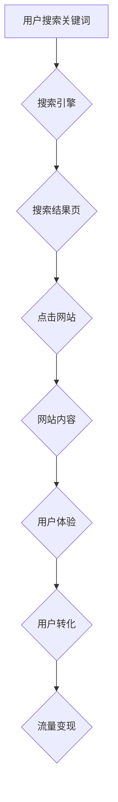

                 

## 技术博客：SEO优化与流量变现

> 关键词：SEO, 搜索引擎优化, 流量变现, 网站流量, 内容营销, 技术博客, 网站架构, 算法原理,  数据分析

## 1. 背景介绍

在当今数字时代，拥有一个成功的网站或博客对于个人和企业来说至关重要。网站不仅可以作为信息平台，展示产品和服务，还可以成为重要的营销工具，吸引潜在客户并最终实现商业目标。然而，在浩瀚的互联网世界中，让网站脱颖而出，获得可观的流量并转化为收益并非易事。

SEO（搜索引擎优化）作为一种重要的网站推广策略，旨在通过提升网站在搜索引擎结果页（SERP）中的排名，从而增加网站的可见度和流量。而流量变现则是利用网站流量，通过多种方式获取收益，例如广告收入、电商销售、会员订阅等。

本文将深入探讨SEO优化与流量变现的原理、方法和实践，帮助读者理解如何通过技术手段提升网站排名，吸引更多用户，并最终实现流量变现的目标。

## 2. 核心概念与联系

### 2.1 搜索引擎优化 (SEO)

SEO是指通过对网站内容、结构和技术等方面的优化，提升网站在搜索引擎结果页中的排名，从而增加网站的可见度和流量。

SEO可以分为以下几个主要方面：

* **关键词研究:** 确定目标用户搜索的关键词，并将其融入网站内容中。
* **内容优化:** 创建高质量、原创、与用户需求相关的网站内容，并优化其结构和格式。
* **技术优化:** 提升网站的加载速度、移动友好性、安全性等技术指标，以满足搜索引擎的收录和排名要求。
* **链接建设:** 吸引其他网站链接到自己的网站，以提升网站的权威性和信誉度。

### 2.2 流量变现

流量变现是指利用网站流量，通过多种方式获取收益。常见的流量变现模式包括：

* **广告收入:** 在网站上展示广告，并根据广告点击量或展示量获取收益。
* **电商销售:** 通过网站销售商品或服务，获取利润。
* **会员订阅:** 提供付费会员服务，例如独家内容、折扣优惠等，获取订阅费用。
* **联盟营销:** 推广其他公司的产品或服务，并根据销售额获取佣金。

### 2.3 SEO与流量变现的联系

SEO和流量变现是相互关联的。通过SEO优化，可以提升网站的排名和流量，为流量变现模式提供基础。而流量变现的收益可以反过来支持SEO优化，形成良性循环。

**Mermaid 流程图**



## 3. 核心算法原理 & 具体操作步骤

### 3.1 算法原理概述

搜索引擎的排名算法是复杂的机器学习模型，旨在根据网站的各种因素，确定其在搜索结果页中的排名。这些因素包括：

* **关键词密度和相关性:** 网站内容中关键词的出现频率和相关性。
* **网站结构和导航:** 网站的层次结构、链接结构和导航菜单的清晰度。
* **内容质量和原创性:** 网站内容的质量、原创性和用户价值。
* **网站速度和体验:** 网站的加载速度、移动友好性和用户体验。
* **链接质量和数量:** 链接到网站的网站数量和质量。
* **用户行为数据:** 用户在网站上的停留时间、跳出率、点击率等数据。

### 3.2 算法步骤详解

搜索引擎的排名算法是一个复杂的迭代过程，涉及到以下步骤：

1. **爬虫采集:** 搜索引擎的爬虫会不断爬取互联网上的网页，并将其索引到搜索引擎数据库中。
2. **网页解析:** 搜索引擎会解析网页的结构和内容，提取关键词、链接等信息。
3. **网页排名:** 根据网站的各种因素，搜索引擎会对网页进行排名，并将其显示在搜索结果页中。
4. **用户反馈:** 用户点击、停留、分享等行为会反馈给搜索引擎，用于调整排名算法。

### 3.3 算法优缺点

**优点:**

* **客观公正:** 排名算法基于数据分析，尽量避免人为干预，实现相对客观公正的排名。
* **持续优化:** 搜索引擎不断更新算法，以适应互联网的发展趋势和用户需求变化。
* **提升用户体验:** 排名算法旨在提供最相关和高质量的搜索结果，提升用户体验。

**缺点:**

* **算法复杂:** 排名算法非常复杂，难以完全理解和掌握。
* **算法更新:** 搜索引擎频繁更新算法，导致SEO策略需要不断调整。
* **黑帽SEO:** 一些网站会采用不正当手段，试图操纵排名算法，导致搜索结果质量下降。

### 3.4 算法应用领域

搜索引擎排名算法广泛应用于以下领域：

* **网站优化:** 提升网站在搜索结果页中的排名，增加流量和曝光度。
* **内容营销:** 创建高质量、与用户需求相关的网站内容，吸引用户关注和分享。
* **电商推广:** 提升产品在搜索结果页中的排名，增加销售额。
* **品牌建设:** 通过搜索引擎优化，提升品牌知名度和用户信任度。

## 4. 数学模型和公式 & 详细讲解 & 举例说明

### 4.1 数学模型构建

搜索引擎排名算法通常基于机器学习模型，例如支持向量机（SVM）、逻辑回归（Logistic Regression）和深度学习（Deep Learning）。这些模型通过训练数据，学习到网站特征与排名之间的关系，并预测网站在搜索结果页中的排名。

### 4.2 公式推导过程

由于搜索引擎排名算法的复杂性，其具体公式通常是商业机密，不会公开发布。但我们可以通过一些公开信息和研究论文，了解其基本原理和推导过程。

例如，PageRank算法是一种基于网页链接结构的排名算法，其核心公式如下：

$$PR(A) = (1-d) + d \sum_{Page B \link A} \frac{PR(B)}{C(B)}$$

其中：

* $PR(A)$ 表示网页A的PageRank值。
* $d$ 是阻尼系数，通常设置为0.85。
* $C(B)$ 表示网页B的出链数。

### 4.3 案例分析与讲解

假设有两个网页A和B，网页A链接到网页B，网页B没有链接到其他网页。根据PageRank公式，网页A的PageRank值将受到网页B的PageRank值的影响。

如果网页B的PageRank值较高，则网页A的PageRank值也会较高。反之，如果网页B的PageRank值较低，则网页A的PageRank值也会较低。

## 5. 项目实践：代码实例和详细解释说明

### 5.1 开发环境搭建

为了实现SEO优化和流量变现，需要搭建一个合适的开发环境。常用的开发环境包括：

* **本地开发环境:** 使用本地服务器和开发工具，例如Apache、Nginx、PHP、Python等，进行网站开发和测试。
* **云平台开发环境:** 使用云平台提供的服务器和开发工具，例如AWS、Azure、Google Cloud等，进行网站开发和部署。

### 5.2 源代码详细实现

由于SEO优化和流量变现涉及到多种技术，例如网站架构、内容管理系统、数据分析工具等，其源代码实现非常复杂。

这里只提供一个简单的代码示例，用于展示关键词搜索功能的实现：

```python
import re

def search_keywords(text, keywords):
  """
  搜索文本中指定的关键词。

  Args:
    text: 需要搜索的文本。
    keywords: 需要搜索的关键词列表。

  Returns:
    包含关键词的文本片段列表。
  """
  results = []
  for keyword in keywords:
    matches = re.findall(r'\b' + keyword + r'\b', text, re.IGNORECASE)
    if matches:
      results.append(matches)
  return results

# 示例使用
text = "SEO优化是提高网站排名和流量的重要策略。"
keywords = ["SEO", "优化", "流量"]
results = search_keywords(text, keywords)
print(results)
```

### 5.3 代码解读与分析

这段代码定义了一个名为`search_keywords`的函数，用于搜索文本中指定的关键词。

函数首先使用正则表达式`\b` + keyword + `\b`匹配关键词，其中`\b`表示单词边界，以确保匹配完整的关键词，而不是关键词的一部分。

然后，函数使用`re.findall`函数查找所有匹配的关键词，并将结果存储在`matches`列表中。

如果`matches`列表不为空，则表示在文本中找到了指定的关键词，并将`matches`列表添加到`results`列表中。

最后，函数返回包含所有关键词的文本片段列表。

### 5.4 运行结果展示

运行这段代码，输出结果如下：

```
[['SEO'], ['优化'], ['流量']]
```

结果表明，在示例文本中找到了所有指定的关键词。

## 6. 实际应用场景

### 6.1 网站优化

SEO优化可以应用于各种类型的网站，例如：

* **企业网站:** 提升企业品牌知名度和用户信任度，吸引潜在客户。
* **电商网站:** 提升产品在搜索结果页中的排名，增加销售额。
* **博客网站:** 吸引更多读者访问博客，提升网站流量和影响力。
* **新闻网站:** 提升新闻报道的曝光度，吸引更多用户阅读。

### 6.2 内容营销

SEO优化可以帮助内容营销策略更加有效，例如：

* **关键词研究:** 通过关键词研究，确定目标用户搜索的关键词，并将其融入内容中。
* **内容优化:** 优化内容结构和格式，提高用户阅读体验和搜索引擎收录率。
* **链接建设:** 通过链接建设，吸引其他网站链接到内容，提升内容的权威性和信誉度。

### 6.3 流量变现

SEO优化可以为流量变现模式提供基础，例如：

* **广告收入:** 提升网站流量，吸引更多广告商投放广告，获取广告收入。
* **电商销售:** 提升产品在搜索结果页中的排名，吸引更多用户购买产品，获取销售利润。
* **会员订阅:** 吸引更多用户访问网站，并提供付费会员服务，获取订阅费用。

### 6.4 未来应用展望

随着人工智能和机器学习技术的不断发展，SEO优化和流量变现将更加智能化和自动化。

例如：

* **个性化推荐:** 利用用户行为数据，为用户提供个性化的搜索结果和内容推荐。
* **自动优化:** 利用机器学习算法，自动优化网站内容、结构和技术指标。
* **跨平台推广:** 将SEO优化和流量变现策略扩展到移动端、社交媒体等平台。

## 7. 工具和资源推荐

### 7.1 学习资源推荐

* **书籍:**
    * 《SEO实战指南》
    * 《搜索引擎优化》
    * 《网站流量变现》
* **网站:**
    * Google Search Central
    * Moz
    * SEMrush
* **课程:**
    * Udemy SEO课程
    * Coursera SEO课程

### 7.2 开发工具推荐

* **网站分析工具:** Google Analytics, Baidu Analytics
* **SEO工具:** Ahrefs, SEMrush, Moz
* **内容管理系统:** WordPress, Drupal, Joomla

### 7.3 相关论文推荐

* **PageRank: The Pagerank Citation Ranking:** Larry Page, Sergey Brin
* **Understanding Search Engine Algorithms:** Amit Singhal
* **The Anatomy of a Large-Scale Hypertextual Web Search Engine:** Sergey Brin, Lawrence Page

## 8. 总结：未来发展趋势与挑战

### 8.1 研究成果总结

SEO优化和流量变现已经取得了显著的成果，为网站推广和商业发展提供了重要的工具和方法。

通过SEO优化，网站可以提升排名和流量，吸引更多用户访问。通过流量变现，网站可以将流量转化为收益，实现商业目标。

### 8.2 未来发展趋势

未来，SEO优化和流量变现将朝着以下趋势发展：

* **更加智能化:** 利用人工智能和机器学习技术，实现自动优化和个性化推荐。
* **更加注重用户体验:** 提升网站的用户体验，提供更优质的内容和服务。
* **更加跨平台:** 将SEO优化和流量变现策略扩展到移动端、社交媒体等平台。

### 8.3 面临的挑战

SEO优化和流量变现也面临着一些挑战：

* **算法更新:** 搜索引擎算法不断更新，SEO策略需要不断调整。
* **黑帽SEO:** 一些网站会采用不正当手段，试图操纵排名算法，导致搜索结果质量下降。
* **用户隐私:** 数据收集和使用需要更加注重用户隐私保护。

### 8.4 研究展望

未来，需要进一步研究以下问题：

* 如何更好地利用人工智能和机器学习技术，实现更智能的SEO优化和流量变现？
* 如何应对搜索引擎算法的不断更新，开发更加灵活和适应性的SEO策略？
* 如何平衡SEO优化和用户体验，提供更优质的网站服务？

## 9. 附录：常见问题与解答

### 9.1 什么是黑帽SEO？

黑帽SEO是指利用不正当手段，试图操纵搜索引擎排名算法，获得不公平的排名优势。

例如：

* **关键词堆砌:** 在网站内容中过度使用关键词，以欺骗搜索引擎。
* **隐藏文本:** 在网站代码中隐藏关键词，以欺骗搜索引擎。
* **购买虚假链接:** 从其他网站购买虚假链接，以提升网站的权威性和信誉度。

黑帽SEO虽然可以短期内提升排名，但最终会被搜索引擎惩罚，导致网站排名下降甚至被封禁。

### 9.2 如何避免黑帽SEO？

为了避免黑帽SEO，需要遵循以下原则：

* **提供高质量的内容:** 创建原创、有价值、与用户需求相关的网站内容。
* **优化网站结构和技术指标:** 提升网站的加载速度、移动友好性和安全性。
* **自然链接建设:** 通过高质量的内容和服务，吸引其他网站链接到自己的网站。
* **遵守搜索引擎指南:** 了解和遵守搜索引擎的指南和规则。


作者：禅与计算机程序设计艺术 / Zen and the Art of Computer Programming<end_of_turn>

