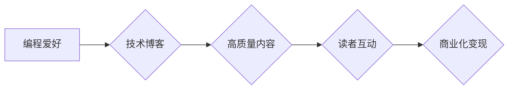

                 

## 技术博客：从爱好到主要收入来源

> 关键词：编程，软件开发，副业，开源，技术博客，收入来源，技术写作，技术社区

## 1. 背景介绍

在当今数字时代，技术日新月异，编程技能成为越来越重要的资产。对于许多人来说，编程最初可能只是个兴趣爱好，但随着技术的进步和市场需求的增长，越来越多的人开始将编程技能转化为主要的收入来源。本文将探讨如何将编程爱好发展为稳定的收入来源，并分享一些经验和建议。

## 2. 核心概念与联系

### 2.1  技术博客的本质

技术博客是一种在线平台，用于分享技术知识、经验和见解。它可以是个人博客，也可以是公司或组织的官方博客。技术博客的本质是传播和交流技术信息，帮助读者学习和理解新的技术，并促进技术社区的建设。

### 2.2  编程技能与技术博客的关联

编程技能是技术博客的核心基础。优秀的技术博客作者通常具备扎实的编程基础，能够深入理解和分析技术问题，并用清晰易懂的语言进行解释和说明。编程技能不仅可以帮助作者创作高质量的技术内容，还可以使他们更具说服力和权威性。

### 2.3  技术博客的商业化模式

技术博客可以采用多种商业化模式，例如：

* **广告收入：** 通过在博客上展示广告来获取收入。
* **赞助文章：** 与企业合作撰写赞助文章，获得报酬。
* **电子书和课程销售：** 将技术知识整理成电子书或课程，进行销售。
* **会员订阅：** 提供付费会员服务，获得独家内容和支持。
* **开源软件开发：** 开发开源软件，并通过捐赠或赞助获得收入。

### 2.4  技术博客的价值链

技术博客的价值链可以概括为以下几个环节：

* **内容创作：** 作者创作高质量的技术内容，满足读者的需求。
* **内容传播：** 通过社交媒体、搜索引擎等渠道，将内容传播给更广泛的读者。
* **读者互动：** 与读者进行互动交流，收集反馈意见，不断改进内容。
* **商业化变现：** 通过多种商业化模式，将技术博客的价值转化为收入。

**Mermaid 流程图**



## 3. 核心算法原理 & 具体操作步骤

### 3.1  算法原理概述

技术博客的成功运营需要一定的算法原理和操作步骤来指导内容创作、传播和变现。这些算法原理可以帮助作者更好地理解读者需求，创作更优质的内容，并提高内容的传播效果和商业价值。

### 3.2  算法步骤详解

1. **内容策划：** 

    * 分析目标读者群体，了解他们的兴趣和需求。
    * 确定博客的主题方向，并进行内容规划。
    * 使用关键词工具，研究热门技术话题和搜索趋势。

2. **内容创作：**

    * 撰写清晰易懂、有价值的技术文章。
    * 使用代码示例、图表和图片等多种形式，增强内容的可读性和趣味性。
    * 优化文章标题和内容，提高搜索引擎排名。

3. **内容传播：**

    * 利用社交媒体平台，推广博客文章。
    * 参与技术社区论坛和讨论组，分享技术经验。
    * 与其他技术博主进行合作，互推文章。

4. **读者互动：**

    * 回复读者评论，解答读者疑问。
    * 举办线上线下活动，与读者互动交流。
    * 收集读者反馈意见，不断改进内容。

5. **商业化变现：**

    * 选择合适的商业化模式，例如广告收入、赞助文章、电子书销售等。
    * 与企业合作，提供技术咨询和培训服务。
    * 开发开源软件，并通过捐赠或赞助获得收入。

### 3.3  算法优缺点

* **优点：**

    * 能够帮助作者更好地理解读者需求，创作更优质的内容。
    * 提高内容的传播效果和商业价值。
    * 促进技术社区的建设和发展。

* **缺点：**

    * 需要一定的学习成本和实践经验。
    * 需要不断更新和改进算法，以适应市场变化。
    * 需要投入一定的精力和时间进行运营和推广。

### 3.4  算法应用领域

技术博客的算法原理和操作步骤可以应用于各种技术领域，例如：

* 软件开发
* 数据科学
* 人工智能
* 网络安全
* 云计算

## 4. 数学模型和公式 & 详细讲解 & 举例说明

### 4.1  数学模型构建

技术博客的运营可以看作是一个复杂的系统，我们可以使用数学模型来描述其运作机制。例如，我们可以使用以下模型来描述博客文章的传播速度：

$$
P(t) = P_0 * e^{kt}
$$

其中：

* $P(t)$ 是文章在时间 $t$ 时的传播量。
* $P_0$ 是文章发布时的传播量。
* $k$ 是传播系数，表示文章传播的速度。
* $t$ 是时间。

### 4.2  公式推导过程

这个模型的推导过程基于指数增长模型，假设文章的传播速度与当前传播量成正比。

### 4.3  案例分析与讲解

假设一篇技术博客文章发布时，传播量为 100 人，传播系数为 0.1，那么我们可以计算出文章在不同时间点的传播量：

* $t = 1$ 天：$P(1) = 100 * e^{0.1 * 1} = 110.52$ 人
* $t = 2$ 天：$P(2) = 100 * e^{0.1 * 2} = 122.14$ 人
* $t = 3$ 天：$P(3) = 100 * e^{0.1 * 3} = 134.49$ 人

从这些数据可以看出，文章的传播量随着时间的推移呈指数增长。

## 5. 项目实践：代码实例和详细解释说明

### 5.1  开发环境搭建

为了实现技术博客的功能，我们可以使用以下开发环境：

* **操作系统：** Linux、macOS 或 Windows
* **编程语言：** Python、Ruby 或 Node.js
* **框架：** Django、Ruby on Rails 或 Express.js
* **数据库：** MySQL、PostgreSQL 或 MongoDB

### 5.2  源代码详细实现

以下是一个使用 Python 和 Django 框架实现技术博客的基本代码示例：

```python
# urls.py
from django.urls import path
from . import views

urlpatterns = [
    path('', views.index, name='index'),
    path('blog/<int:post_id>/', views.post_detail, name='post_detail'),
]

# views.py
from django.shortcuts import render

def index(request):
    # 获取博客文章列表
    posts = Post.objects.all()
    return render(request, 'index.html', {'posts': posts})

def post_detail(request, post_id):
    # 获取指定文章
    post = Post.objects.get(id=post_id)
    return render(request, 'post_detail.html', {'post': post})
```

### 5.3  代码解读与分析

* `urls.py` 文件定义了博客的 URL 路由规则。
* `views.py` 文件定义了博客的视图函数，用于处理用户请求并返回响应。
* `index.html` 和 `post_detail.html` 是博客的模板文件，用于渲染页面内容。

### 5.4  运行结果展示

运行上述代码后，我们可以访问博客网站，查看博客文章列表和文章详情页。

## 6. 实际应用场景

技术博客可以应用于各种实际场景，例如：

* **个人品牌建设：** 通过技术博客，个人可以展示自己的技术能力和经验，建立个人品牌，吸引潜在雇主或客户。
* **技术交流与分享：** 技术博客可以成为技术人员交流和分享技术知识的平台，促进技术社区的建设和发展。
* **企业宣传推广：** 企业可以利用技术博客，宣传推广自己的产品和服务，提升品牌知名度和影响力。
* **教育培训：** 技术博客可以作为技术教育培训的工具，帮助读者学习和理解新的技术。

### 6.4  未来应用展望

随着技术的不断发展，技术博客的应用场景将会更加广泛。例如：

* **人工智能技术应用：** 利用人工智能技术，技术博客可以实现自动内容生成、个性化推荐等功能，提升用户体验。
* **虚拟现实和增强现实技术应用：** 利用虚拟现实和增强现实技术，技术博客可以提供更加沉浸式的学习和体验。
* **区块链技术应用：** 利用区块链技术，技术博客可以实现内容版权保护和激励机制，促进内容创作者的收益。

## 7. 工具和资源推荐

### 7.1  学习资源推荐

* **在线学习平台：** Coursera、edX、Udemy
* **技术博客网站：** Hacker News、Medium、Dev.to
* **技术论坛：** Stack Overflow、Reddit

### 7.2  开发工具推荐

* **代码编辑器：** Visual Studio Code、Sublime Text、Atom
* **版本控制系统：** Git、GitHub
* **数据库管理工具：** MySQL Workbench、PostgreSQL Admin

### 7.3  相关论文推荐

* **"The Impact of Blogging on Software Development"**
* **"Technical Blogging: A Survey of Practices and Trends"**
* **"The Role of Technical Blogs in Open Source Software Development"**

## 8. 总结：未来发展趋势与挑战

### 8.1  研究成果总结

技术博客已经成为技术人员学习、交流和分享技术知识的重要平台。通过分析技术博客的运营模式、算法原理和应用场景，我们可以更好地理解其价值和发展趋势。

### 8.2  未来发展趋势

技术博客的未来发展趋势将更加注重用户体验、个性化定制和人工智能技术应用。

### 8.3  面临的挑战

技术博客面临的挑战包括内容质量的保证、商业模式的创新和竞争的加剧。

### 8.4  研究展望

未来研究可以进一步探讨技术博客的个性化推荐算法、人工智能技术应用以及区块链技术在技术博客中的应用。

## 9. 附录：常见问题与解答

### 9.1  如何选择合适的博客平台？

选择博客平台需要考虑以下因素：

* **功能需求：** 不同的博客平台提供不同的功能，例如文章管理、评论系统、社交分享等。
* **易用性：** 选择易于使用的平台，可以节省时间和精力。
* **价格：** 不同的博客平台有不同的价格策略，需要根据预算选择。
* **社区支持：** 选择拥有活跃社区支持的平台，可以获得更多帮助和资源。

### 9.2  如何提高博客文章的曝光率？

提高博客文章的曝光率可以通过以下方法：

* **优化文章标题和内容：** 使用关键词，编写吸引人的标题和内容。
* **推广博客文章：** 利用社交媒体平台、技术论坛等渠道推广文章。
* **参与技术社区：** 积极参与技术社区，分享技术经验，建立人脉关系。

### 9.3  如何将技术博客变现？

技术博客可以采用多种变现模式，例如：

* **广告收入：** 在博客上展示广告，获得广告收入。
* **赞助文章：** 与企业合作撰写赞助文章，获得报酬。
* **电子书和课程销售：** 将技术知识整理成电子书或课程，进行销售。
* **会员订阅：** 提供付费会员服务，获得独家内容和支持。


作者：禅与计算机程序设计艺术 / Zen and the Art of Computer Programming 
<end_of_turn>

