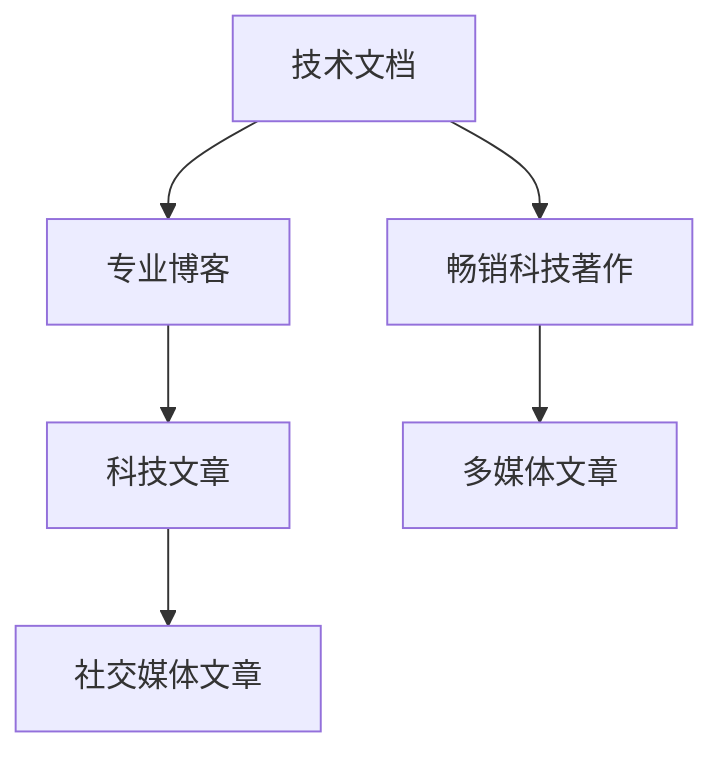

                 

# 技术写作：从技术文档到畅销科技著作

> 关键词：技术写作, 技术文档, 畅销科技著作, 专业博客, 写作技巧, 科技文章

## 1. 背景介绍

### 1.1 问题由来

在信息时代，科技的迅猛发展带来了大量的新技术和新工具，这要求相关专业人士能够将复杂的科学原理和实际应用有效地传达给他人。技术写作正是在这样的背景下逐渐成为一门重要技能。从技术文档到畅销科技著作，技术写作的目的是为了让读者理解和应用科技，但不同形式的科技作品在内容深度、受众和形式上都有所不同。

### 1.2 问题核心关键点

技术写作的核心在于将复杂的科技概念清晰地传达给不同背景的读者。这不仅要求作者拥有扎实的专业知识，还需要对写作技巧有深刻的理解。畅销科技著作更是将技术写作提升到了一个新的层次，它们不仅要吸引目标读者，还要让读者能够在轻松愉悦的阅读体验中获取知识。

本文将探讨技术写作的不同形式及其技巧，帮助作者从技术文档写作到畅销科技著作的创作，提升写作水平和作品影响力。

### 1.3 问题研究意义

技术写作在科技普及、教育培训和商业交流中扮演着至关重要的角色。掌握有效的技术写作技能，可以：

- **提升专业水平**：准确、清晰地表达科技概念，提升个人或团队的科技影响力。
- **促进知识传播**：通过写作将知识分享给更广泛的受众，推动科技进步。
- **促进商业成功**：吸引投资者和用户，增强产品或服务的市场竞争力。
- **教育培训**：在教育领域中，技术写作可以辅助教学，提高学生对科技的理解和兴趣。

因此，深入研究技术写作的方法和技巧，对于推动科技发展、促进教育和商业交流具有重要意义。

## 2. 核心概念与联系

### 2.1 核心概念概述

技术写作包含多种形式，从简单的技术文档到复杂的畅销科技著作，每种形式都有其特定的写作目的和受众。

- **技术文档**：通常包含操作说明、用户手册、系统设计文档等，旨在帮助用户或开发者理解和使用技术。
- **专业博客**：旨在向专业领域内的人士分享深度技术分析和见解，推动技术讨论和交流。
- **畅销科技著作**：面向大众读者，旨在普及科学知识，提高公众对科技的理解和兴趣。
- **科技文章**：可以在各种平台上发布，旨在吸引读者关注并促进信息的传播。

这些核心概念之间的逻辑关系可以通过以下Mermaid流程图来展示：



这个流程图展示了一系列技术写作的形式及其联系：

1. 技术文档是基础，是其他形式的基础。
2. 专业博客和畅销科技著作在技术文档的基础上，针对不同受众和目的进行扩展和深化。
3. 科技文章和多媒体文章是技术写作的延伸，旨在通过多样化的形式吸引更广泛的受众。

## 3. 核心算法原理 & 具体操作步骤

### 3.1 算法原理概述

技术写作的核心算法原理在于将复杂的科技概念用易懂的语言表达出来，同时保持信息的准确性和完整性。这包括选择合适的语言风格、逻辑结构、信息组织方式等。

### 3.2 算法步骤详解

技术写作的算法步骤通常包括以下几个关键步骤：

**Step 1: 确定受众和写作目的**
- 识别目标受众的科技水平和兴趣点。
- 明确写作的主要目的是介绍技术原理、分享见解还是普及知识。

**Step 2: 策划和收集资料**
- 进行背景调研，收集相关的科技资料和数据。
- 制定写作大纲，明确文章结构，包括引言、主体和结论。

**Step 3: 编写和修订**
- 根据大纲，逐步撰写文章内容，确保逻辑清晰、信息准确。
- 反复修订，确保文章语言风格一致，避免冗余和歧义。

**Step 4: 优化和发布**
- 使用技术工具（如语法检查、排版工具）优化文章。
- 选择合适的平台发布文章，确保文章易于传播。

**Step 5: 反馈和改进**
- 收集读者反馈，评估文章效果。
- 根据反馈不断改进写作技巧，提升文章质量。

### 3.3 算法优缺点

技术写作的算法具有以下优点：

1. **信息传递准确**：通过精确的科学语言和数据支持，确保读者能够正确理解科技概念。
2. **目标明确**：明确受众和目的，使得写作更具针对性和实效性。
3. **结构清晰**：遵循严格的逻辑结构和信息组织方式，帮助读者更容易理解复杂概念。

然而，技术写作也存在一些缺点：

1. **专业性强**：要求作者对科技原理有深入的理解，对于非专业人士来说可能难以完全掌握。
2. **内容抽象**：科技概念往往抽象复杂，难以通过简单的语言表达清楚。
3. **受众有限**：对于大众读者，可能过于专业或难以理解。

### 3.4 算法应用领域

技术写作在多个领域都有广泛的应用，包括但不限于：

- **科技教育**：在课堂教学、在线教育、科普读物中使用。
- **商业推广**：在产品介绍、市场分析、客户培训中使用。
- **科技咨询**：在科技咨询报告、白皮书、案例分析中使用。
- **技术博客**：在技术社区、专业博客、社交媒体中使用。

## 4. 数学模型和公式 & 详细讲解 & 举例说明

### 4.1 数学模型构建

技术写作的数学模型通常涉及如何有效地组织和呈现复杂的信息。以下是一个简单的数学模型示例：

**模型定义**：设有一篇关于算法效率的文章，其目标是为读者展示算法的运行时间复杂度 $T(n)$ 与数据规模 $n$ 的关系。

**模型变量**：
- $n$：数据规模。
- $T(n)$：算法运行时间复杂度。

**目标函数**：最小化算法运行时间。

### 4.2 公式推导过程

假设一个算法的时间复杂度为 $T(n) = O(n^2)$，表示随着数据规模 $n$ 的增加，算法的运行时间以平方速度增长。公式推导如下：

$$
T(n) = O(n^2) = \sum_{i=1}^{n}i
$$

简化得到：

$$
T(n) = O(n^2) = \frac{n(n+1)}{2}
$$

这个模型展示了算法效率随数据规模变化的规律，帮助读者理解算法时间复杂度的含义。

### 4.3 案例分析与讲解

考虑一个排序算法时间复杂度的案例。设有一个排序算法的时间复杂度 $T(n)$，其中 $n$ 为待排序数据的个数。假设 $T(n)$ 可以表示为：

$$
T(n) = O(n \log n)
$$

这个模型表示排序算法的时间复杂度随数据规模 $n$ 的增长而增长，但增长速度较慢，可以用于解释排序算法的效率优势。

## 5. 项目实践：代码实例和详细解释说明

### 5.1 开发环境搭建

技术写作的实践通常需要使用计算机辅助工具。以下是使用Markdown和GitHub进行技术写作的开发环境搭建步骤：

1. 安装GitHub Desktop：从官网下载并安装GitHub Desktop，用于版本控制和项目管理。
2. 安装Markdown编辑器：如Typora、Sublime Text等，用于撰写技术文档。
3. 设置GitHub仓库：创建新的GitHub仓库，并克隆到本地计算机。

### 5.2 源代码详细实现

以下是一个简单的技术文档示例，介绍如何使用Python编写一个排序算法：

```python
def bubble_sort(arr):
    n = len(arr)
    for i in range(n):
        for j in range(n-i-1):
            if arr[j] > arr[j+1]:
                arr[j], arr[j+1] = arr[j+1], arr[j]
    return arr
```

**代码解释**：
- 定义了一个名为`bubble_sort`的函数，用于实现冒泡排序算法。
- 函数接受一个列表作为输入，返回排好序的列表。

### 5.3 代码解读与分析

这个代码段展示了如何使用冒泡排序算法对一个列表进行排序。冒泡排序算法的基本思想是通过不断交换相邻元素的位置，将较大的元素逐渐“冒泡”到列表末尾，最终实现排序。代码中的两个嵌套循环分别用于遍历和交换元素，时间复杂度为 $O(n^2)$。

## 6. 实际应用场景

### 6.1 技术博客

技术博客是技术写作中较为灵活的形式，可以通过撰写深度技术分析和见解，推动技术讨论和交流。例如，可以撰写一篇关于人工智能前沿技术的博客文章，详细分析当前趋势和未来发展方向。

### 6.2 技术论文

技术论文通常用于学术界，是技术写作的高端形式。它要求作者对所研究的技术有深刻的理解和独到的见解。例如，可以撰写一篇关于深度学习模型优化技术的论文，介绍最新的研究成果和应用案例。

### 6.3 科普文章

科普文章面向大众读者，旨在普及科学知识，提高公众对科技的理解和兴趣。例如，可以撰写一篇关于区块链技术的科普文章，解释其原理和应用场景。

### 6.4 未来应用展望

未来，随着技术写作的不断发展，以下趋势将愈发明显：

1. **多平台发布**：技术写作将不仅仅局限于传统的书籍和期刊，更多的科技文章将通过社交媒体、博客、视频等多样化的形式传播。
2. **多媒体融合**：科技文章将更多地结合图片、视频、代码等元素，提升内容的吸引力和易理解性。
3. **跨学科应用**：技术写作将与其他学科（如心理学、教育学）结合，探索如何在不同受众中更有效地传播科技知识。

## 7. 工具和资源推荐

### 7.1 学习资源推荐

以下是一些有助于提升技术写作水平的资源：

1. **《写作的艺术》**：一本经典书籍，详细介绍了写作的基本原则和技巧。
2. **《技术写作与编辑》**：针对科技写作的专门书籍，提供大量案例和实践指导。
3. **Coursera《写作专业课程》**：Coursera提供的多门写作课程，包括科技写作、商业写作等。
4. **Grammarly**：一款在线语法检查工具，帮助提升写作质量。
5. **Medium**：一个广泛使用的技术写作平台，提供大量优秀文章的示例。

### 7.2 开发工具推荐

以下是一些常用的技术写作工具：

1. **Markdown编辑器**：如Typora、Sublime Text、Atom等，用于撰写技术文档。
2. **GitHub**：用于版本控制和项目管理，方便协作和发布。
3. **GitHub Pages**：提供免费的静态网站托管服务，方便发布技术文档。
4. **LaTeX**：用于撰写专业书籍和技术报告，支持复杂的排版和格式设置。
5. **Python代码编辑器**：如PyCharm、VSCode等，用于编写和调试代码。

### 7.3 相关论文推荐

以下是几篇具有代表性的技术写作相关论文：

1. **《科技写作的多媒体融合》**：探讨了在技术写作中如何有效地结合多媒体元素，提升内容的吸引力和易理解性。
2. **《科技写作的跨学科应用》**：研究了如何在不同受众中更有效地传播科技知识，探讨了与心理学、教育学等学科的结合。
3. **《技术写作的未来趋势》**：总结了技术写作的发展趋势，展望了未来技术写作的多样化和跨界应用。

## 8. 总结：未来发展趋势与挑战

### 8.1 总结

本文对技术写作的不同形式和技巧进行了全面系统的介绍。从技术文档到畅销科技著作，技术写作的目标是通过准确、清晰地表达科技概念，提升读者对科技的理解和应用。通过系统梳理技术写作的原理和步骤，文章提供了从基础到高级的写作技巧，帮助读者提升写作水平。

### 8.2 未来发展趋势

展望未来，技术写作将呈现以下几个发展趋势：

1. **多样化的形式**：技术写作将更加多样化和多媒体化，结合图片、视频、代码等元素，提升内容的吸引力。
2. **跨学科的应用**：技术写作将与其他学科结合，探索如何在不同受众中更有效地传播科技知识。
3. **全球化的传播**：随着全球化的发展，技术写作将更加注重跨文化、跨语言的传播和交流。

### 8.3 面临的挑战

尽管技术写作有着广阔的前景，但面临以下挑战：

1. **受众的多样性**：不同受众对科技的理解和需求差异较大，如何满足多样化的需求是一个挑战。
2. **内容的专业性**：如何平衡专业性和可理解性，确保技术写作既准确又易于理解。
3. **语言的跨界**：在全球化的背景下，如何跨语言地传播科技知识，是一个重要课题。

### 8.4 研究展望

未来的技术写作研究需要在以下几个方面寻求新的突破：

1. **受众分析**：通过大数据分析，了解不同受众的需求和偏好，定制化技术写作内容。
2. **多媒体融合**：结合多媒体元素，提升技术写作内容的吸引力。
3. **跨文化交流**：研究如何在不同文化背景下有效地传播科技知识。

## 9. 附录：常见问题与解答

**Q1: 如何提升技术写作的水平？**

A: 提升技术写作水平需要不断练习和学习。可以通过以下方式提升：
- **多读多写**：阅读优秀的科技文章，模仿其写作风格和技巧。
- **学习语法和修辞**：掌握基本的语法规则和修辞手法，提升写作的准确性和可读性。
- **参与社区**：加入技术写作社区，与同行交流，获取反馈和建议。

**Q2: 技术写作中应避免哪些常见错误？**

A: 技术写作中应避免以下常见错误：
- **过于专业**：避免使用过于专业和难懂的术语，尽量使用通俗易懂的语言。
- **冗长和冗余**：避免冗长和重复，尽量简洁明了地表达观点。
- **缺乏结构**：确保文章具有清晰的结构，每部分都有明确的目的和内容。

**Q3: 如何选择合适的话题进行技术写作？**

A: 选择合适的话题进行技术写作需要考虑以下几个因素：
- **兴趣和热情**：选择自己感兴趣和有热情的话题，确保写作的动力和质量。
- **受众需求**：了解目标受众的需求和兴趣点，选择相关话题。
- **现实意义**：选择具有现实意义和应用前景的话题，有助于提升文章的影响力。

---

作者：禅与计算机程序设计艺术 / Zen and the Art of Computer Programming

