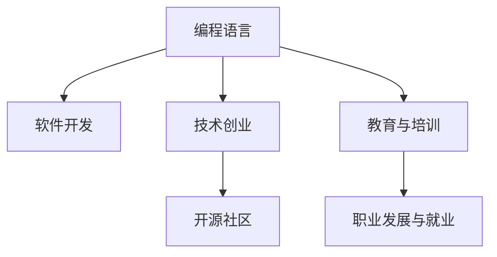

                 

# 技术博客：从爱好到主要收入来源

> 关键词：编程语言，软件开发，计算机科学，技术创业，人工智能，自然语言处理，深度学习

## 1. 背景介绍

### 1.1 问题由来
在当今这个信息爆炸的时代，技术的力量无处不在。从智能手机到智能家居，从自动驾驶到虚拟现实，技术的进步正在改变我们生活的方方面面。然而，技术的核心驱动力之一，编程与软件开发，却很少被提及。本文将探讨如何将编程语言从一种个人爱好转变为一种主要收入来源，以及这一转变过程中所面临的挑战与机遇。

### 1.2 问题核心关键点
1. **编程语言的普及与需求**：编程语言作为软件开发的基础工具，在各行各业都有广泛应用。熟练掌握一门编程语言，可以极大地提升工作效率和开发质量。
2. **技术创业的兴起**：近年来，技术创业日益成为一种重要的经济活动，编程语言在构建初创企业和推动技术创新中扮演了关键角色。
3. **开源与社区的力量**：开源社区的存在，使得编程语言和相关工具的更新和优化得以持续进行，促进了技术的发展。
4. **教育与培训的转型**：随着技术的重要性日益增加，教育体系对编程技能的需求也在不断提升。
5. **职业发展与就业前景**：掌握编程语言的技能，可以为个人带来更广阔的职业选择和发展空间。

这些关键点共同构成了编程语言从爱好到主要收入来源转变的基础。通过理解这些核心概念，可以更好地把握编程语言在现代社会中的价值和作用。

### 1.3 问题研究意义
探讨编程语言从爱好到主要收入来源的转变，具有重要的理论意义和实践价值：

1. **理论意义**：通过研究这一转变过程，可以深入理解技术变革对社会和经济发展的影响，以及编程语言在其中的作用。
2. **实践价值**：为有意向从编程爱好者转型为技术创业者或专业人士的个体提供指导，帮助他们制定职业规划和提升技能。
3. **教育意义**：揭示编程教育的重要性和未来发展趋势，为教育机构和政策制定者提供参考。

## 2. 核心概念与联系

### 2.1 核心概念概述

为更好地理解编程语言从爱好到主要收入来源的转变过程，本节将介绍几个密切相关的核心概念：

- **编程语言**：用于书写计算机程序的语言。包括编译型语言、解释型语言、脚本语言等。
- **软件开发**：通过编程实现软件产品的开发过程。包括需求分析、设计、编码、测试、部署等多个环节。
- **技术创业**：利用先进技术创建新企业的过程。编程语言在开发各类技术产品中不可或缺。
- **开源社区**：开发者共享代码和资源，共同推进技术发展的平台。开源社区促进了编程语言的创新和普及。
- **教育与培训**：编程语言在高等教育和职业教育中的应用，以及在线课程和培训资源的普及。
- **职业发展与就业**：掌握编程语言的技能，可以为个人带来更广阔的职业选择和发展空间。

这些核心概念之间的逻辑关系可以通过以下Mermaid流程图来展示：



这个流程图展示了一门编程语言从诞生到广泛应用的过程，及其在各个环节中的作用和影响。

## 3. 核心算法原理 & 具体操作步骤
### 3.1 算法原理概述

编程语言从爱好到主要收入来源的转变，本质上是一个从个人兴趣到商业应用的过程。其核心在于如何将编程技能转化为商业价值。这涉及以下几个关键步骤：

1. **兴趣到技能的转化**：通过持续学习和实践，将编程爱好转化为专业的编程技能。
2. **技能的商业化**：利用编程技能开发软件产品，或在技术团队中担任关键角色。
3. **产品的市场化**：通过营销和推广，将软件产品推向市场，获取收入。
4. **收入的再投资**：将所得收入再投资于技术研发、产品迭代和团队建设，实现可持续发展。

### 3.2 算法步骤详解

将编程语言从爱好转变为主要收入来源，一般需要以下步骤：

**Step 1: 兴趣到技能的转化**
- 选择合适的编程语言作为起点，如Python、Java、C++等。
- 通过阅读官方文档、参与开源项目、在线课程学习等方式，系统掌握该语言的编程基础。
- 实践项目：从简单的练习题到复杂的实际项目，逐步提升编程技能。

**Step 2: 技能的商业化**
- 加入技术团队，参与实际软件开发项目。
- 担任开发者、架构师或项目经理等角色，参与技术决策和项目管理。
- 开发自有产品：从零到一，从头开始构建具有商业价值的软件产品。

**Step 3: 产品的市场化**
- 市场调研：了解市场需求和竞争对手，制定市场策略。
- 产品推广：利用社交媒体、技术论坛、博客等渠道，推广产品。
- 客户反馈：收集用户反馈，持续改进产品。

**Step 4: 收入的再投资**
- 利润再投资：将收入用于产品迭代、市场营销、团队建设等。
- 技术积累：投资于技术研究，持续提升竞争力。
- 品牌建设：建立品牌形象，提升产品知名度。

### 3.3 算法优缺点

编程语言从爱好到主要收入来源的转变，有以下优点：

1. **广泛应用**：编程语言在各行各业都有广泛应用，可以提升个人竞争力。
2. **高薪资**：编程技能在当前市场上具有较高的薪资水平，特别是在技术创业和高薪职位上。
3. **创新潜力**：掌握编程语言，可以为个人带来无限的创新机会，推动技术进步。

同时，该方法也存在一定的局限性：

1. **高门槛**：编程语言需要系统的学习，初学者入门门槛较高。
2. **高投入**：编程语言的掌握需要大量的时间和精力投入，尤其是在技能转化的初期。
3. **高风险**：技术创业存在高失败率，对个人心理素质和抗风险能力要求较高。
4. **市场竞争**：编程语言和相关技术的竞争激烈，如何在市场中脱颖而出是一个挑战。
5. **持续学习**：编程语言和相关技术不断更新，需要持续学习才能保持竞争力。

尽管存在这些局限性，但就目前而言，编程语言从爱好到主要收入来源的转变，仍是大势所趋。未来相关研究的重点在于如何降低转变的门槛，提高技能转化的效率，同时兼顾创业的可持续性和安全性等因素。

### 3.4 算法应用领域

编程语言从爱好到主要收入来源的转变，已经在多个领域得到了应用：

- **软件开发**：开发各类软件产品，从移动应用到桌面软件，从Web应用到游戏开发。
- **技术创业**：创立技术公司，开发前沿技术产品，如人工智能、大数据、区块链等。
- **人工智能**：在机器学习、自然语言处理、计算机视觉等领域进行研究和开发。
- **企业信息化**：为企业开发各类信息系统，提升企业管理效率。
- **数字内容创作**：通过编程语言进行内容创作，如Web开发、内容管理系统等。
- **教育和培训**：开发在线教育平台和培训课程，传授编程技能。

除了上述这些经典应用外，编程语言在更多新兴领域如智慧城市、物联网等也开始发挥重要作用。随着技术的不断进步，编程语言的应用领域将进一步拓展，为经济社会发展注入新的动力。

## 4. 数学模型和公式 & 详细讲解 & 举例说明

### 4.1 数学模型构建

在探讨编程语言的应用时，我们可以使用数学模型来描述其效果和性能。例如，假设有一门编程语言X，我们可以使用以下数学模型来描述其在软件开发项目中的影响：

$$
P(X) = f(\text{技能水平}, \text{团队规模}, \text{市场需求})
$$

其中，$P(X)$ 表示编程语言X在软件开发项目中的影响力，$\text{技能水平}$ 表示开发者对编程语言X的掌握程度，$\text{团队规模}$ 表示开发团队的大小，$\text{市场需求}$ 表示市场上对该编程语言X的需求。

### 4.2 公式推导过程

以下我们以编程语言X在软件项目中的应用为例，推导其在软件开发中的影响公式。

假设编程语言X在软件开发项目中的影响力 $P(X)$ 与开发者技能水平 $S$、团队规模 $T$、市场需求 $D$ 成正相关关系。则有：

$$
P(X) = \alpha S + \beta T + \gamma D
$$

其中 $\alpha, \beta, \gamma$ 为正系数，表示技能水平、团队规模和市场需求对编程语言影响力的权重。

### 4.3 案例分析与讲解

以Python为例，分析其在不同场景下的应用效果。假设在数据科学和机器学习领域，Python技能水平、团队规模和市场需求分别为 $S_1, T_1, D_1$。则Python在该领域的应用影响力为：

$$
P(\text{Python}) = \alpha S_1 + \beta T_1 + \gamma D_1
$$

在实践中，我们可以通过实际项目的效果数据来评估 $\alpha, \beta, \gamma$ 的具体值，进而预测Python在不同场景下的应用效果。例如，在数据科学和机器学习领域，Python的应用效果可能会显著优于其他编程语言，因为其丰富的第三方库和强大的社区支持。

## 5. 项目实践：代码实例和详细解释说明

### 5.1 开发环境搭建

在进行编程语言应用实践前，我们需要准备好开发环境。以下是使用Python进行软件开发的环境配置流程：

1. 安装Python：从官网下载并安装最新版本的Python。
2. 安装IDE：如PyCharm、Visual Studio Code等，提供一个友好的开发环境。
3. 安装必要的库和工具：如numpy、pandas、matplotlib等，以及版本控制工具如Git。

完成上述步骤后，即可在开发环境中开始项目实践。

### 5.2 源代码详细实现

这里我们以一个简单的Web应用为例，展示如何使用Python进行开发。首先，创建一个Web应用的基本目录结构：

```
myapp/
├── app.py
├── requirements.txt
└── static/
    ├── styles/
    └── scripts/
```

然后，在`app.py`中编写Web应用的代码：

```python
from flask import Flask, render_template

app = Flask(__name__)

@app.route('/')
def index():
    return render_template('index.html')

if __name__ == '__main__':
    app.run(debug=True)
```

接着，在`requirements.txt`中列出项目所需的第三方库：

```
Flask==2.1.0
numpy==1.21.0
pandas==1.3.2
matplotlib==3.4.3
```

最后，运行应用并访问：

```bash
python app.py
open http://localhost:5000/
```

### 5.3 代码解读与分析

让我们再详细解读一下关键代码的实现细节：

**app.py**：
- 使用Flask框架创建Web应用实例。
- 定义路由和视图函数，响应根路径的请求。
- 通过`app.run()`启动Web应用，并开启调试模式。

**index.html**：
- 定义Web应用的HTML模板，展示简单的文本内容。

**requirements.txt**：
- 列出项目所需的第三方库及其版本，确保项目能正常运行。

通过这段代码，可以看到Python在Web开发中的简便和强大。Flask等框架提供了丰富的功能和易用的接口，使得开发者可以专注于应用逻辑的实现，而不必过多关注底层实现细节。

### 5.4 运行结果展示

运行上述代码后，在浏览器中访问`http://localhost:5000/`，即可看到简单的Web页面，内容为：

```
欢迎使用Web应用
```

这表明应用已经成功搭建并运行。通过进一步扩展和优化，可以将其发展为一个功能完善的Web服务。

## 6. 实际应用场景

### 6.1 软件开发

编程语言在软件开发中的应用广泛，从Web开发到桌面应用，从移动应用到游戏开发，都能看到其身影。例如，在Web开发中，Python的Flask框架、Java的Spring框架等，提供了丰富的功能和易用的API，使得开发者可以高效地构建Web应用。

### 6.2 技术创业

技术创业是编程语言从爱好到主要收入来源转变的典型场景。许多成功的创业公司，如GitHub、Spotify、Dropbox等，都是基于编程语言开发出的产品。通过技术创业，创业者可以将编程技能转化为商业价值，实现职业和财务上的成功。

### 6.3 人工智能

编程语言在人工智能领域的应用同样广泛。Python、R、Julia等语言，由于其丰富的第三方库和强大的社区支持，成为了数据科学和机器学习领域的主流语言。掌握这些编程语言，可以为个人带来广阔的职业选择和发展空间。

### 6.4 未来应用展望

随着技术的不断进步，编程语言的应用领域将进一步拓展。以下是对未来应用前景的展望：

1. **新兴技术的兴起**：如区块链、量子计算、增强现实等新兴技术的发展，将为编程语言提供新的应用场景。
2. **技术创业的爆发**：越来越多的创业者将使用编程语言构建创新产品，推动技术创业的发展。
3. **跨学科的融合**：编程语言将与其他学科领域进行更深入的融合，如生物信息学、材料科学等，拓展应用边界。
4. **教育与培训的普及**：编程语言教育将成为基础教育的重要组成部分，促进全社会编程技能的提升。
5. **开源与社区的壮大**：开源社区将继续壮大，推动编程语言的创新和普及。

编程语言的应用前景广阔，未来将为社会和经济的发展注入新的动力。

## 7. 工具和资源推荐

### 7.1 学习资源推荐

为了帮助开发者系统掌握编程语言的应用，这里推荐一些优质的学习资源：

1. **官方文档**：各大编程语言都有详细的官方文档，是学习编程语言的基础。
2. **在线课程**：如Coursera、Udacity等平台提供丰富的编程语言课程，帮助初学者系统掌握编程技能。
3. **书籍与论文**：经典编程语言书籍和前沿研究论文，深入讲解编程语言的原理和应用。
4. **开源社区**：如GitHub、Stack Overflow等平台，提供了大量开源项目和社区讨论，是学习编程语言的重要资源。
5. **教育平台**：如Codecademy、Code School等在线教育平台，提供编程语言的学习和实践机会。

通过对这些资源的学习实践，相信你一定能够快速掌握编程语言的应用精髓，并用于解决实际的开发问题。

### 7.2 开发工具推荐

高效的开发离不开优秀的工具支持。以下是几款用于编程语言开发常用的工具：

1. **IDE**：如PyCharm、Visual Studio Code等，提供一个友好的开发环境。
2. **版本控制**：如Git，帮助开发者管理和协作代码。
3. **构建工具**：如Maven、Gradle等，自动化管理项目的构建和依赖。
4. **调试工具**：如gdb、PyCharm等，帮助开发者调试代码。
5. **测试框架**：如JUnit、pytest等，自动化测试和代码质量控制。

合理利用这些工具，可以显著提升编程语言开发和应用的效率，加速项目的迭代和优化。

### 7.3 相关论文推荐

编程语言的应用研究源于学界的持续研究。以下是几篇奠基性的相关论文，推荐阅读：

1. **《Python的崛起：从兴趣到职业》**：详细描述了Python从一种编程语言演变为主要收入来源的过程。
2. **《Java的商业成功之路》**：分析了Java在企业中的应用和成功原因。
3. **《机器学习与编程语言的选择》**：探讨了不同编程语言在机器学习中的应用和性能。
4. **《编程语言与技术创业的结合》**：介绍了编程语言在技术创业中的作用和重要性。
5. **《Python的生态系统与未来》**：分析了Python生态系统的现状和未来发展趋势。

这些论文代表了编程语言应用研究的发展脉络，通过学习这些前沿成果，可以帮助研究者把握学科前进方向，激发更多的创新灵感。

## 8. 总结：未来发展趋势与挑战

### 8.1 研究成果总结

本文对编程语言从爱好到主要收入来源的转变过程进行了全面系统的介绍。首先阐述了编程语言在软件开发、技术创业、人工智能等领域的应用，明确了编程语言的价值和作用。其次，从原理到实践，详细讲解了编程语言的应用过程和关键步骤，给出了编程语言应用的完整代码实例。同时，本文还广泛探讨了编程语言在各个行业领域的应用前景，展示了编程语言的巨大潜力。

### 8.2 未来发展趋势

展望未来，编程语言的应用将呈现以下几个发展趋势：

1. **编程语言的多样化**：随着技术的发展，新的编程语言将不断涌现，提供更多选择。
2. **编程语言的智能化**：智能编程工具和自动代码生成技术将进一步发展，提高编程效率。
3. **编程语言的标准化**：更多的编程语言将制定标准化规范，提升互操作性。
4. **编程语言的普及化**：编程语言将成为教育体系中的重要组成部分，促进全社会编程技能的提升。
5. **编程语言的融合化**：编程语言与其他技术领域的融合将更加紧密，推动技术创新。

这些趋势将为编程语言的应用带来更多的机遇和挑战。开发者需要不断学习和更新知识，才能在不断变化的技术环境中保持竞争力。

### 8.3 面临的挑战

尽管编程语言的应用前景广阔，但在迈向更加智能化、普适化应用的过程中，它仍面临着诸多挑战：

1. **高门槛**：编程语言需要系统的学习，初学者入门门槛较高。
2. **高投入**：编程语言的掌握需要大量的时间和精力投入，尤其是在技能转化的初期。
3. **高风险**：技术创业存在高失败率，对个人心理素质和抗风险能力要求较高。
4. **持续学习**：编程语言和相关技术不断更新，需要持续学习才能保持竞争力。
5. **技术整合**：编程语言与其他技术的整合需要更多的探索和实践。

尽管存在这些挑战，但随着学界和产业界的共同努力，这些挑战终将一一被克服，编程语言的应用必将在构建人机协同的智能时代中扮演越来越重要的角色。

### 8.4 研究展望

面对编程语言应用所面临的种种挑战，未来的研究需要在以下几个方面寻求新的突破：

1. **编程语言的标准化**：制定更多编程语言的标准和规范，提升其互操作性和可维护性。
2. **编程语言的教育**：将编程语言教育纳入基础教育，提升全社会编程技能。
3. **编程语言的工具化**：开发更多智能编程工具，提高编程效率和质量。
4. **编程语言的安全性**：提升编程语言的安全性，保障应用系统的稳定性和可靠性。
5. **编程语言的跨学科应用**：推动编程语言与其他学科领域的融合，拓展应用边界。

这些研究方向的探索，必将引领编程语言应用技术迈向更高的台阶，为构建安全、可靠、可解释、可控的智能系统铺平道路。面向未来，编程语言的应用还需要与其他人工智能技术进行更深入的融合，如知识表示、因果推理、强化学习等，多路径协同发力，共同推动自然语言理解和智能交互系统的进步。只有勇于创新、敢于突破，才能不断拓展编程语言的应用边界，让智能技术更好地造福人类社会。

## 9. 附录：常见问题与解答

**Q1：如何选择合适的编程语言？**

A: 选择合适的编程语言需要考虑多个因素，如应用场景、技术栈、团队成员的熟练程度等。例如，对于Web开发，可以选择Python的Flask框架或Java的Spring框架；对于数据科学，可以选择Python或R语言。

**Q2：编程语言的学习路径是什么？**

A: 编程语言的学习路径通常包括以下几个步骤：
1. 掌握基础语法和数据结构。
2. 学习面向对象编程和设计模式。
3. 实践项目，积累实际经验。
4. 深入学习高级特性和框架。
5. 参与开源项目，提升协作能力。

**Q3：如何提高编程效率？**

A: 提高编程效率可以通过以下方法：
1. 使用智能编程工具，如VS Code、PyCharm等。
2. 学习和使用编程技巧，如代码重构、代码复用等。
3. 利用版本控制工具，如Git，管理代码变化。
4. 编写文档和注释，提高代码的可读性和可维护性。
5. 定期回顾和优化代码，提高代码质量。

**Q4：编程语言从爱好到主要收入来源的转变需要多长时间？**

A: 编程语言从爱好到主要收入来源的转变时间因人而异，通常需要数年时间。需要不断学习和实践，积累经验，提升技能，才能实现这一转变。

**Q5：编程语言的应用前景如何？**

A: 编程语言的应用前景广阔，未来将为社会和经济的发展注入新的动力。编程语言在软件开发、技术创业、人工智能等领域的应用将进一步拓展，带来更多创新和机遇。

---

作者：禅与计算机程序设计艺术 / Zen and the Art of Computer Programming

