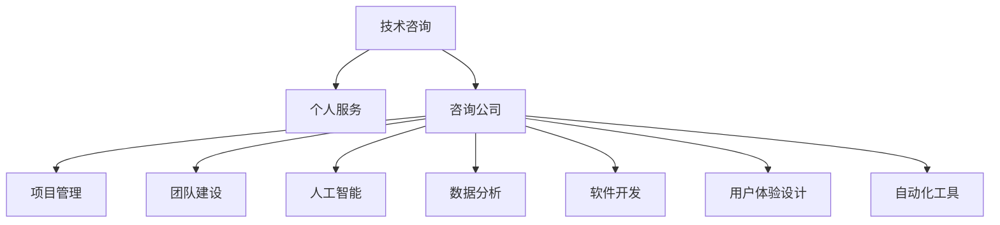

                 

# 技术咨询：从个人服务到咨询公司

> 关键词：技术咨询, 个人服务, 咨询公司, 项目管理, 团队建设, 人工智能, 数据分析, 软件开发, 用户体验设计, 自动化工具

## 1. 背景介绍

### 1.1 问题由来
随着信息技术在各行各业的广泛应用，技术咨询业也迎来了前所未有的发展机遇。技术咨询公司不再仅限于为大型企业提供软件开发和IT解决方案，而是逐渐转型为综合性的技术服务提供商。这对从业者提出了更高的要求，需要从单一的技术专家，转变为能够提供全栈技术服务的综合型人才。

### 1.2 问题核心关键点
从个人服务到咨询公司，技术咨询业的发展趋势对从业者的技术能力、项目管理能力、团队协作能力、商业洞察能力等提出了多方面的挑战。本文旨在系统梳理这些关键点，帮助从业者应对转型挑战，提升技术咨询服务质量。

### 1.3 问题研究意义
技术咨询公司的崛起，一方面为技术人才提供了新的职业发展方向，另一方面也为企业的技术转型和创新提供了有力支持。通过深入分析技术咨询的实践和挑战，可以为行业从业者和企业领导者提供战略指导和实际操作的参考，推动技术咨询行业的健康发展。

## 2. 核心概念与联系

### 2.1 核心概念概述

在技术咨询行业，从业者需要具备多维度的核心能力，具体包括：

- **技术咨询**：为企业的技术问题提供咨询和解决方案，涵盖软件开发、系统集成、云服务、人工智能、数据分析等多个领域。
- **个人服务**：个体技术专家提供的一对一技术支持服务，如技术培训、软件开发、技术支持等。
- **咨询公司**：由多位技术专家组成的团队，为企业的技术项目提供全面服务，包括需求分析、方案设计、项目实施、运维支持等。
- **项目管理**：运用项目管理方法论，对技术项目进行规划、执行、监控和控制，确保项目按时按质按预算完成。
- **团队建设**：通过合理的团队管理，提高团队协作效率，培养技术团队的技能和素质。
- **人工智能**：应用人工智能技术，提高技术咨询的智能化水平，实现自动化、智能化、定制化的技术解决方案。
- **数据分析**：通过数据分析技术，挖掘业务数据价值，支持企业决策和业务优化。
- **软件开发**：提供定制化的软件开发服务，满足企业业务需求。
- **用户体验设计**：结合用户行为和反馈，设计高效、易用、美观的产品和交互界面。
- **自动化工具**：使用自动化工具，提高工作效率，减少人为错误，提升服务质量。

这些核心概念之间的逻辑关系可以通过以下Mermaid流程图来展示：



这个流程图展示了个体技术专家向咨询公司转型的核心步骤和关键领域：

1. 从个人服务转向技术咨询，需要具备更全面的技术能力。
2. 组建咨询公司，需要综合运用项目管理、团队建设等技能。
3. 应用人工智能、数据分析等先进技术，提升咨询服务水平。
4. 通过软件开发、用户体验设计等具体实践，提供多样化的技术支持。
5. 引入自动化工具，提高工作效率和服务质量。

## 3. 核心算法原理 & 具体操作步骤

### 3.1 算法原理概述

技术咨询的核心是提供定制化的解决方案，满足企业特定的技术需求。这包括对企业业务流程、技术架构、数据资产等多个维度的深入理解和分析，以及提供创新的技术方案。

技术咨询的流程可以分为以下几个步骤：

1. **需求分析**：与企业沟通，明确技术需求和目标。
2. **方案设计**：根据需求设计技术方案，包括系统架构、技术栈、开发流程等。
3. **项目实施**：组建团队，执行技术方案，确保项目按时按质按预算完成。
4. **运维支持**：对系统进行运维和优化，保障系统稳定运行。

### 3.2 算法步骤详解

技术咨询的具体操作步骤可以分为以下五个阶段：

#### 3.2.1 需求分析阶段

1. **与客户沟通**：通过访谈、问卷等方式，了解客户的技术需求和业务背景。
2. **需求文档编制**：将需求转化为详细的文档，明确需求范围、功能点、技术要求等。
3. **需求评审**：与客户确认需求文档，确保需求理解和范围明确。

#### 3.2.2 方案设计阶段

1. **技术评估**：根据需求，评估不同的技术方案和架构，选择最优方案。
2. **方案文档编制**：将方案设计转化为详细的技术文档，包括系统架构、技术栈、开发流程等。
3. **方案评审**：与客户确认方案文档，确保方案设计符合需求。

#### 3.2.3 项目实施阶段

1. **团队组建**：根据方案设计，组建项目团队，明确成员职责。
2. **项目计划制定**：制定详细的项目计划，包括时间表、里程碑等。
3. **项目执行**：按照计划执行项目任务，确保项目按时按质按预算完成。

#### 3.2.4 运维支持阶段

1. **系统测试**：对系统进行全面测试，发现和修复问题。
2. **系统上线**：将系统部署到生产环境，进行正式运行。
3. **系统维护**：对系统进行日常维护和优化，确保系统稳定运行。

### 3.3 算法优缺点

技术咨询具有以下优点：

1. **综合能力**：技术咨询需要综合运用技术、项目管理、团队建设等多方面能力，提升服务质量。
2. **定制化解决方案**：能够根据企业需求提供定制化的解决方案，满足多样化的技术需求。
3. **经验积累**：通过多个项目实施，积累丰富的经验，提升服务水平。

同时，技术咨询也存在一些局限性：

1. **高成本**：项目实施需要大量的人力和资源投入，成本较高。
2. **风险管理**：项目实施过程中，存在各种风险，需要有效的风险管理策略。
3. **沟通协调**：涉及多方利益相关者，需要良好的沟通协调能力。

### 3.4 算法应用领域

技术咨询的应用领域非常广泛，涵盖软件开发、系统集成、云服务、人工智能、数据分析等多个领域。具体应用场景包括：

- **软件开发**：为企业提供定制化的软件开发服务，如ERP系统、CRM系统、电子商务平台等。
- **系统集成**：将不同的软件系统和硬件设备集成起来，构建一体化解决方案。
- **云服务**：提供云平台部署和运维支持，如AWS、Azure等云服务解决方案。
- **人工智能**：运用人工智能技术，提供智能客服、推荐系统、语音识别等解决方案。
- **数据分析**：通过数据分析技术，提供数据仓库、数据挖掘、商业智能等解决方案。

## 4. 数学模型和公式 & 详细讲解 & 举例说明

### 4.1 数学模型构建

为了更好地理解技术咨询的流程和效果评估，本节将构建一个简单的数学模型。假设企业的技术需求数量为 $n$，每个需求的价值为 $v_i$，成本为 $c_i$，技术咨询的投入成本为 $C$，则技术咨询的期望收益 $R$ 可以表示为：

$$
R = \sum_{i=1}^n v_i - C
$$

其中，$v_i$ 和 $c_i$ 分别表示第 $i$ 个需求的价值和成本，$C$ 表示技术咨询的投入成本。

### 4.2 公式推导过程

假设技术咨询企业有 $m$ 个项目，每个项目的期望收益为 $R_j$，则总期望收益 $R$ 可以表示为：

$$
R = \sum_{j=1}^m R_j = \sum_{j=1}^m \left(\sum_{i=1}^n v_i^{(j)} - c_i^{(j)}\right)
$$

其中，$v_i^{(j)}$ 和 $c_i^{(j)}$ 分别表示第 $j$ 个项目中第 $i$ 个需求的实际价值和成本。

通过求解最大化 $R$，可以确定最优的技术咨询方案。具体来说，可以采用以下步骤：

1. **需求评估**：对每个需求进行价值和成本评估，确定 $v_i$ 和 $c_i$。
2. **方案设计**：根据需求评估结果，设计最优的技术方案，确定 $R_j$。
3. **方案优化**：根据 $R_j$ 的求解结果，优化技术方案，确保总期望收益最大化。

### 4.3 案例分析与讲解

假设某技术咨询公司服务了三家企业，需求和成本如下表所示：

| 企业 | 需求 | 价值 | 成本 |
|------|------|------|------|
| A    | 需求1 | $10,000$ | $5,000$ |
| B    | 需求2 | $8,000$ | $4,000$ |
| C    | 需求3 | $5,000$ | $3,000$ |

公司有三种方案可供选择：

| 方案 | 需求 | 价值 | 成本 |
|------|------|------|------|
| 方案1 | 需求1 | $10,000$ | $5,000$ |
| 方案2 | 需求2 | $8,000$ | $4,000$ |
| 方案3 | 需求1, 需求3 | $15,000$ | $8,000$ |

计算各方案的期望收益，得到：

| 方案 | 期望收益 |
|------|----------|
| 方案1 | $10,000 - 5,000 = 5,000$ |
| 方案2 | $8,000 - 4,000 = 4,000$ |
| 方案3 | $15,000 - 8,000 = 7,000$ |

由此可见，方案3的期望收益最高，是最优方案。

## 5. 项目实践：代码实例和详细解释说明

### 5.1 开发环境搭建

在进行技术咨询的实践时，需要搭建完善的开发环境，包括编程工具、版本控制、持续集成等。以下是常用的开发环境搭建流程：

1. **安装编程工具**：安装常用的编程工具，如Python、Java、Git等。
2. **版本控制**：使用Git进行版本控制，确保代码的可追溯性和协作性。
3. **持续集成**：使用Jenkins、Travis CI等工具，实现代码的自动构建和测试。
4. **项目管理工具**：使用JIRA、Trello等工具，进行任务分配和进度管理。

完成上述步骤后，即可在开发环境中进行技术咨询项目的实践。

### 5.2 源代码详细实现

以下是一个简单的技术咨询项目需求分析的Python代码实现：

```python
import pandas as pd

# 需求数据
demands = [
    {'id': 1, 'name': '需求1', 'value': 10000, 'cost': 5000},
    {'id': 2, 'name': '需求2', 'value': 8000, 'cost': 4000},
    {'id': 3, 'name': '需求3', 'value': 5000, 'cost': 3000},
]

# 方案数据
solutions = [
    {'id': 1, 'name': '方案1', 'cost': 5000, 'demand_ids': [1]},
    {'id': 2, 'name': '方案2', 'cost': 4000, 'demand_ids': [2]},
    {'id': 3, 'name': '方案3', 'cost': 8000, 'demand_ids': [1, 3]},
]

# 需求价值矩阵
value_matrix = pd.DataFrame({
    'demand_id': [demand['id'] for demand in demands],
    'solution_id': [solution['id'] for solution in solutions],
    'value': [solution['demand_ids'].count(demand['id']) * demand['value'] for demand in demands]
})

# 成本矩阵
cost_matrix = pd.DataFrame({
    'demand_id': [demand['id'] for demand in demands],
    'solution_id': [solution['id'] for solution in solutions],
    'cost': [solution['demand_ids'].count(demand['id']) * demand['cost'] for demand in demands]
})

# 期望收益矩阵
revenue_matrix = value_matrix - cost_matrix

# 求解期望收益最大化的方案
best_solution = revenue_matrix.idxmax().name

print(f"最优方案：{best_solution}")
```

### 5.3 代码解读与分析

以上代码实现了对技术咨询项目需求和方案的计算，具体步骤包括：

1. **需求和方案数据定义**：定义需求和方案的ID、名称、价值和成本等属性。
2. **价值和成本矩阵计算**：根据需求和方案数据，计算价值和成本矩阵。
3. **期望收益矩阵计算**：通过价值和成本矩阵计算期望收益矩阵。
4. **最优方案求解**：通过期望收益矩阵求解最优方案。

## 6. 实际应用场景

### 6.1 智能客服系统

技术咨询公司在为智能客服系统提供解决方案时，可以结合自然语言处理、语音识别、人工智能等技术，提供全面的服务支持。具体应用场景包括：

1. **需求分析**：与客户沟通，了解客服系统的业务需求和功能需求。
2. **方案设计**：设计基于人工智能的客服系统架构，包括自然语言处理、语音识别、聊天机器人等组件。
3. **项目实施**：组建技术团队，进行系统开发和部署，确保系统按时按质按预算完成。
4. **运维支持**：对系统进行日常运维和优化，确保系统稳定运行。

### 6.2 金融数据分析

技术咨询公司可以为企业提供金融数据分析解决方案，帮助企业挖掘数据价值，支持决策和业务优化。具体应用场景包括：

1. **需求分析**：与客户沟通，了解数据需求和业务目标。
2. **方案设计**：设计基于数据分析的解决方案，包括数据挖掘、商业智能等。
3. **项目实施**：组建数据科学团队，进行数据采集、处理、分析和建模。
4. **运维支持**：对系统进行日常运维和优化，确保数据服务稳定可靠。

### 6.3 电子商务平台

技术咨询公司可以为电子商务平台提供全面的技术支持，包括网站开发、系统集成、云服务优化等。具体应用场景包括：

1. **需求分析**：与客户沟通，了解平台的需求和功能需求。
2. **方案设计**：设计基于云计算的电商平台架构，包括前端开发、后端服务、数据存储等。
3. **项目实施**：组建技术团队，进行平台开发和部署，确保平台按时按质按预算完成。
4. **运维支持**：对平台进行日常运维和优化，确保平台稳定运行。

### 6.4 未来应用展望

随着技术咨询行业的不断发展，未来将在以下几个方面取得新的突破：

1. **全栈技术支持**：技术咨询公司将具备更加全面的技术能力，能够提供全栈技术支持，涵盖软件开发、系统集成、云服务、人工智能、数据分析等多个领域。
2. **智能化和自动化**：通过引入人工智能、自动化工具等先进技术，提高技术咨询的智能化和自动化水平，提升服务效率和质量。
3. **综合化服务模式**：技术咨询公司将从单一的技术服务，转变为综合化服务模式，涵盖项目管理、团队建设、商业咨询等各个方面。
4. **全球化服务**：随着全球化进程的加快，技术咨询公司将拓展全球市场，提供国际化的技术支持和解决方案。

## 7. 工具和资源推荐

### 7.1 学习资源推荐

为了帮助从业者系统掌握技术咨询的实践技能和前沿技术，以下是一些优质的学习资源：

1. **项目管理书籍**：《项目管理知识体系指南》(PMBOK Guide)、《敏捷项目管理》(Agile Project Management)等。
2. **软件开发框架**：学习常见的软件开发框架，如Spring、Django等。
3. **数据分析工具**：学习常用的数据分析工具，如Python、R、SQL等。
4. **人工智能库**：学习深度学习框架，如TensorFlow、PyTorch等。
5. **商业管理书籍**：《商业模型画布》(Business Model Canvas)、《创新者的窘境》(The Innovator's Dilemma)等。

### 7.2 开发工具推荐

为了提高技术咨询项目的开发效率和质量，以下是一些常用的开发工具：

1. **编程工具**：如Visual Studio、Eclipse等。
2. **版本控制工具**：如Git、SVN等。
3. **项目管理工具**：如JIRA、Trello等。
4. **持续集成工具**：如Jenkins、Travis CI等。
5. **数据管理工具**：如Hadoop、Spark等。

### 7.3 相关论文推荐

技术咨询领域的研究论文众多，以下是几篇具有代表性的论文，推荐阅读：

1. **《项目管理：过程、方法和工具》(Project Management: Processes, Practices and Tools)**：介绍了项目管理的基本理论和实践方法。
2. **《敏捷开发：原则、模式与实践》(Agile Development: Principles, Patterns and Practices)**：介绍了敏捷开发的方法和实践。
3. **《软件工程：过程、工具和架构》(Software Engineering: Processes, Tools and Architectures)**：介绍了软件工程的基本原理和实践方法。
4. **《大数据技术与商业应用》(Big Data Technology and Business Applications)**：介绍了大数据技术在商业应用中的实践。
5. **《人工智能在商业决策中的应用》(Application of Artificial Intelligence in Business Decision Making)**：介绍了人工智能在商业决策中的应用和实践。

## 8. 总结：未来发展趋势与挑战

### 8.1 总结

本文对技术咨询的实践和挑战进行了系统梳理，帮助从业者从个人服务转型为咨询公司，提升技术咨询服务质量。通过分析技术咨询的核心概念、操作步骤、数学模型和实际应用场景，可以为从业者提供全面的技术指导。

### 8.2 未来发展趋势

展望未来，技术咨询行业将在以下几个方面取得新的突破：

1. **技术融合创新**：通过引入更多先进技术和工具，提升技术咨询的智能化和自动化水平。
2. **服务模式多样化**：从单一的技术服务，转变为综合化服务模式，涵盖项目管理、团队建设、商业咨询等各个方面。
3. **全球化服务**：拓展全球市场，提供国际化的技术支持和解决方案。
4. **持续学习和创新**：通过持续学习和创新，不断提高技术咨询的服务质量和效率。

### 8.3 面临的挑战

尽管技术咨询行业前景广阔，但在发展过程中也面临诸多挑战：

1. **人才短缺**：高水平的技术咨询人才相对稀缺，需要进一步加强人才培养和引进。
2. **市场竞争激烈**：技术咨询市场竞争激烈，需要不断提高服务质量和效率，提升市场竞争力。
3. **成本控制**：技术咨询项目需要投入大量的人力和资源，需要有效控制成本，提高项目收益。
4. **客户沟通**：涉及多方利益相关者，需要良好的沟通协调能力，确保项目顺利实施。

### 8.4 研究展望

未来技术咨询的研究方向将聚焦于以下几个方面：

1. **全栈技术支持**：提升技术咨询公司的综合技术能力，涵盖软件开发、系统集成、云服务、人工智能、数据分析等多个领域。
2. **智能化和自动化**：引入人工智能、自动化工具等先进技术，提高技术咨询的智能化和自动化水平。
3. **综合化服务模式**：从单一的技术服务，转变为综合化服务模式，涵盖项目管理、团队建设、商业咨询等各个方面。
4. **全球化服务**：拓展全球市场，提供国际化的技术支持和解决方案。

## 9. 附录：常见问题与解答

**Q1: 如何评估技术咨询方案的优劣？**

A: 可以通过以下几个指标评估技术咨询方案的优劣：
1. **收益与成本**：计算方案的期望收益，选择期望收益最高的方案。
2. **项目周期**：评估项目实施的时间周期，选择实施时间较短的方案。
3. **风险管理**：评估项目的风险管理措施，选择风险管理措施完善的方案。
4. **用户满意度**：通过用户反馈和评估，选择用户满意度较高的方案。

**Q2: 技术咨询项目实施过程中，需要注意哪些关键问题？**

A: 技术咨询项目实施过程中，需要注意以下几个关键问题：
1. **需求明确**：确保客户需求明确，避免需求变更带来的风险。
2. **团队协作**：加强团队协作，提高工作效率和质量。
3. **项目管理**：运用项目管理工具和方法，确保项目按时按质按预算完成。
4. **风险管理**：识别项目风险，制定风险应对策略，降低项目风险。

**Q3: 技术咨询公司的可持续发展策略有哪些？**

A: 技术咨询公司的可持续发展策略包括：
1. **持续学习**：不断学习最新的技术和方法，保持技术领先优势。
2. **品牌建设**：加强品牌建设，提升公司在行业内的知名度和影响力。
3. **人才培养**：加强人才培养和引进，提升公司的人才竞争力。
4. **市场拓展**：拓展市场，扩大业务范围，提高市场份额。

**Q4: 技术咨询公司如何进行商业化运营？**

A: 技术咨询公司可以通过以下几个方面进行商业化运营：
1. **定价策略**：制定合理的定价策略，确保项目收益。
2. **市场营销**：加强市场营销，提高公司在行业内的知名度和影响力。
3. **客户关系管理**：加强客户关系管理，提升客户满意度和忠诚度。
4. **产品化运营**：将技术咨询项目产品化，提高项目可重复性和可扩展性。

**Q5: 技术咨询公司如何应对市场竞争？**

A: 技术咨询公司可以通过以下几个方面应对市场竞争：
1. **差异化服务**：提供差异化的服务，提升服务质量和竞争力。
2. **客户定制化**：根据客户需求提供定制化的解决方案，满足客户的多样化需求。
3. **成本控制**：有效控制项目成本，提升项目收益。
4. **技术创新**：引入新技术和方法，提高技术咨询的智能化和自动化水平。

---

作者：禅与计算机程序设计艺术 / Zen and the Art of Computer Programming

