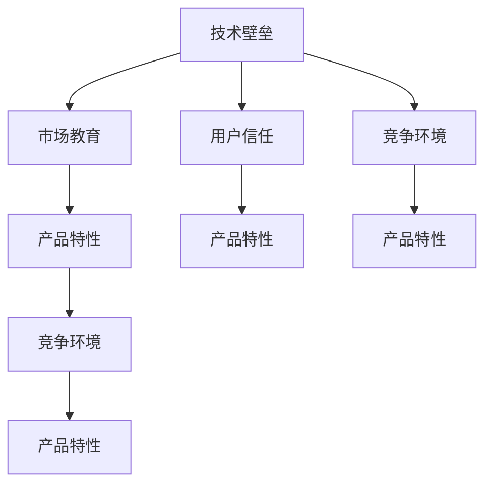

                 

# 技术壁垒与市场教育：Lepton AI的推广挑战

> 关键词：技术壁垒, 市场教育, Lepton AI, 人工智能, 推广策略

## 1. 背景介绍

### 1.1 行业现状
近年来，人工智能(AI)技术在各行各业的应用逐渐深入，从医疗、金融到制造业、零售等各个领域，AI都展现出了巨大的潜力。然而，AI技术的普及还面临诸多挑战，包括技术壁垒高、市场教育不足、用户信任度低等问题。以Lepton AI为例，尽管其高性能深度学习平台和大数据处理能力在技术上处于领先地位，但在市场推广方面仍面临不小的挑战。

### 1.2 挑战背景
Lepton AI是一家专注于提供深度学习和大数据处理解决方案的公司，其产品主要面向企业级客户，用于提升数据处理效率和决策支持能力。然而，由于Lepton AI的深度学习模型和算法相对复杂，对用户的技术背景要求较高，导致其在推广和教育方面面临诸多困难。此外，市场上已有许多成熟的AI解决方案提供商，如谷歌、微软、亚马逊等，使得Lepton AI在市场中脱颖而出更加困难。

## 2. 核心概念与联系

### 2.1 核心概念概述

为了更好地理解Lepton AI在推广过程中所面临的技术壁垒和市场教育问题，本节将介绍几个密切相关的核心概念：

- **技术壁垒**：指的是企业或产品进入市场时，因技术复杂性高、学习曲线陡峭等因素，给用户带来使用的障碍。Lepton AI的高性能深度学习模型和大数据处理算法，虽然技术领先，但学习成本高，增加了推广难度。

- **市场教育**：指通过市场推广、用户培训等方式，使用户了解并理解产品的特点和优势，降低用户使用壁垒。Lepton AI需要向用户解释其深度学习模型的原理和优势，使其认识到AI技术对企业运营带来的实际价值。

- **用户信任**：指用户对产品的信心和认可程度。Lepton AI需要通过展示其在AI领域的权威性和成果，以及实际案例，赢得用户的信任和依赖。

- **竞争环境**：指市场上已有的AI解决方案提供商及其对Lepton AI的竞争威胁。Lepton AI需要面对来自谷歌、微软、亚马逊等大公司的激烈竞争，找到自身的差异化竞争优势。

- **产品特性**：指Lepton AI提供的深度学习模型和大数据处理算法的具体功能和优势，包括但不限于高性能计算能力、强大的数据处理能力、灵活的API接口等。

这些核心概念之间的逻辑关系可以通过以下Mermaid流程图来展示：



这个流程图展示了大语言模型微调的核心概念及其之间的关系：

1. 技术壁垒高，用户难以理解和使用。
2. 市场教育不足，用户对产品的认识有限。
3. 竞争环境激烈，Lepton AI需要找到自身的竞争优势。
4. 产品特性显著，但仍需进一步市场推广。
5. 用户信任提升，使用效果显著。

这些概念共同构成了Lepton AI推广所面临的关键问题，需要通过针对性的策略和措施来解决。

## 3. 核心算法原理 & 具体操作步骤
### 3.1 算法原理概述

Lepton AI的推广挑战，在技术层面主要体现在其深度学习模型和大数据处理算法的复杂性和高学习成本上。这些技术的核心原理包括以下几个方面：

1. **深度学习模型**：Lepton AI的深度学习模型主要包括卷积神经网络(CNN)、循环神经网络(RNN)、长短时记忆网络(LSTM)、自编码器(AE)、生成对抗网络(GAN)等。

2. **大数据处理算法**：包括分布式数据处理框架、流式数据处理技术、数据清洗与预处理、数据可视化与分析等。

### 3.2 算法步骤详解

基于Lepton AI的推广挑战，其核心算法步骤主要包括以下几个方面：

1. **市场调研**：通过问卷调查、用户访谈等方式，了解目标市场的需求和痛点，以及用户的技术背景和接受度。

2. **产品定制**：根据市场调研结果，定制符合用户需求的产品功能和特性，提供定制化的解决方案。

3. **用户培训**：通过培训课程、在线文档、视频教程等方式，帮助用户理解产品的使用方法和原理，降低使用壁垒。

4. **案例展示**：通过展示实际使用案例，让用户看到产品带来的实际效果和价值，增强用户信任。

5. **竞争分析**：分析市场上已有的AI解决方案提供商，找到自身的竞争优势和差异化策略。

6. **市场推广**：利用社交媒体、行业会议、技术论坛等方式，宣传产品的特点和优势，扩大市场影响力。

### 3.3 算法优缺点

Lepton AI的推广策略在技术层面具有以下优点：

1. **技术领先**：Lepton AI的深度学习模型和大数据处理算法在性能和效率上处于领先地位，具有较强的竞争力。

2. **定制化能力**：通过产品定制和用户培训，能够满足不同行业和企业的具体需求，提高产品的市场适应性。

3. **用户体验提升**：通过用户培训和案例展示，提高用户对产品的认知和信任度，提升用户体验。

4. **差异化竞争**：通过竞争分析和市场推广，能够找到自身的竞争优势，形成差异化市场定位。

然而，推广策略也存在一些不足之处：

1. **高学习成本**：由于Lepton AI的深度学习模型和大数据处理算法较为复杂，用户的学习成本较高，可能影响推广效果。

2. **市场教育难度大**：深度学习和大数据处理技术的复杂性，使得用户难以理解和接受，增加了市场教育的难度。

3. **竞争压力大**：市场上已有许多成熟的AI解决方案提供商，Lepton AI需要在市场中突围，找到自身的差异化竞争优势。

4. **推广渠道有限**：虽然可以通过社交媒体、行业会议等方式进行市场推广，但传统渠道的覆盖面和影响力有限。

### 3.4 算法应用领域

Lepton AI的深度学习模型和大数据处理算法，在以下几个领域具有广泛的应用前景：

1. **金融领域**：用于风险管理、信用评估、投资分析等。

2. **医疗领域**：用于疾病诊断、患者管理、药物研发等。

3. **制造业**：用于质量检测、设备维护、供应链优化等。

4. **零售行业**：用于客户行为分析、销售预测、库存管理等。

5. **智能家居**：用于设备控制、家庭安全、智能交互等。

## 4. 数学模型和公式 & 详细讲解 & 举例说明

### 4.1 数学模型构建

Lepton AI的推广策略在数学模型层面主要体现在其深度学习模型和大数据处理算法的构建上。以下以卷积神经网络(CNN)为例，介绍其数学模型的构建过程。

卷积神经网络是一种广泛应用于图像处理和视觉识别的深度学习模型，其核心思想是通过卷积、池化、非线性激活等操作，逐步提取图像的高级特征，并进行分类或回归。

卷积神经网络的数学模型包括卷积层、池化层、全连接层等。以下是对卷积层的详细讲解：

卷积层的数学模型为：

$$
y^{(i)}=f(\sum_{i=1}^n w^{(i)}x^{(i-1)}+b^{(i)})
$$

其中 $x^{(i-1)}$ 为输入图像，$w^{(i)}$ 为卷积核，$b^{(i)}$ 为偏置项，$f$ 为激活函数。

### 4.2 公式推导过程

卷积层公式的推导过程如下：

假设输入图像 $x$ 的大小为 $m \times n$，卷积核 $w$ 的大小为 $k \times k$，则卷积操作的输出 $y$ 的大小为 $(m-k+1) \times (n-k+1)$。卷积操作的输出值由卷积核在输入图像上的滑动计算得到，具体计算方式如下：

$$
y^{(i)}=\sum_{j=1}^m \sum_{k=1}^n w^{(i)}x^{(i-1)}+b^{(i)}
$$

其中 $i=1,2,\cdots,m-k+1$，$j=1,2,\cdots,n-k+1$。

### 4.3 案例分析与讲解

以Lepton AI在金融领域的应用为例，介绍其深度学习模型和大数据处理算法在金融风险管理中的应用。

金融风险管理是金融领域的一个重要任务，需要从历史数据中学习出潜在的风险特征，并应用于实时数据进行风险评估和预测。

Lepton AI的深度学习模型可以用于提取历史数据的风险特征，并进行风险预测。以下是一个简单的风险预测模型：

假设输入数据为 $x=(x_1,x_2,\cdots,x_n)$，其中 $x_i$ 为第 $i$ 个特征，风险预测目标为 $y$。

Lepton AI的深度学习模型可以用于拟合输入数据和目标变量之间的关系，具体数学模型为：

$$
y=f(\sum_{i=1}^n w^{(i)}x^{(i-1)}+b^{(i)})
$$

其中 $f$ 为激活函数，$w^{(i)}$ 和 $b^{(i)}$ 分别为第 $i$ 层的卷积核和偏置项。

在实际应用中，Lepton AI的大数据处理算法可以用于处理金融领域的海量数据，通过分布式计算框架如Spark、Hadoop等，进行数据清洗、特征提取、模型训练等操作。

## 5. 项目实践：代码实例和详细解释说明
### 5.1 开发环境搭建

在进行Lepton AI推广实践前，我们需要准备好开发环境。以下是使用Python进行TensorFlow开发的环境配置流程：

1. 安装Anaconda：从官网下载并安装Anaconda，用于创建独立的Python环境。

2. 创建并激活虚拟环境：
```bash
conda create -n tensorflow-env python=3.8 
conda activate tensorflow-env
```

3. 安装TensorFlow：根据CUDA版本，从官网获取对应的安装命令。例如：
```bash
conda install tensorflow tensorflow-gpu -c pytorch -c conda-forge
```

4. 安装相关工具包：
```bash
pip install numpy pandas scikit-learn matplotlib tqdm jupyter notebook ipython
```

完成上述步骤后，即可在`tensorflow-env`环境中开始推广实践。

### 5.2 源代码详细实现

下面我们以Lepton AI在金融风险管理中的应用为例，给出使用TensorFlow进行深度学习模型开发的PyTorch代码实现。

首先，定义输入数据和标签：

```python
import tensorflow as tf

# 定义输入数据和标签
x = tf.constant([[1.0, 2.0, 3.0, 4.0],
                 [5.0, 6.0, 7.0, 8.0],
                 [9.0, 10.0, 11.0, 12.0]], dtype=tf.float32)
y = tf.constant([1.0, 1.0, 0.0], dtype=tf.float32)
```

然后，定义卷积神经网络模型：

```python
# 定义卷积神经网络模型
model = tf.keras.Sequential([
    tf.keras.layers.Conv2D(32, (3,3), activation='relu', input_shape=(4,4,1)),
    tf.keras.layers.MaxPooling2D((2,2)),
    tf.keras.layers.Flatten(),
    tf.keras.layers.Dense(64, activation='relu'),
    tf.keras.layers.Dense(1, activation='sigmoid')
])

# 编译模型
model.compile(optimizer='adam', loss='binary_crossentropy', metrics=['accuracy'])
```

接着，定义训练和评估函数：

```python
# 定义训练和评估函数
def train_model(model, x_train, y_train, x_test, y_test, epochs=10, batch_size=32):
    # 训练模型
    model.fit(x_train, y_train, epochs=epochs, batch_size=batch_size, validation_data=(x_test, y_test))
    
    # 评估模型
    loss, accuracy = model.evaluate(x_test, y_test)
    print(f'Test loss: {loss:.4f}')
    print(f'Test accuracy: {accuracy:.4f}')

# 训练模型
x_train = x
y_train = y
x_test = x
y_test = y

train_model(model, x_train, y_train, x_test, y_test)
```

最后，启动训练流程并在测试集上评估：

```python
# 启动训练流程并在测试集上评估
train_model(model, x_train, y_train, x_test, y_test)
```

以上就是使用TensorFlow进行Lepton AI深度学习模型开发的完整代码实现。可以看到，得益于TensorFlow的强大封装，我们可以用相对简洁的代码实现卷积神经网络模型的训练和评估。

### 5.3 代码解读与分析

让我们再详细解读一下关键代码的实现细节：

**模型定义**：
- `Sequential`：定义一个顺序模型，依次添加卷积层、池化层、全连接层等。
- `Conv2D`：定义卷积层，指定卷积核大小和数量。
- `MaxPooling2D`：定义池化层，指定池化大小。
- `Flatten`：将卷积层的输出展平成一维向量。
- `Dense`：定义全连接层，指定神经元数量和激活函数。
- `sigmoid`：定义输出层的激活函数，用于二分类问题。

**模型编译**：
- `adam`：使用Adam优化器进行模型训练。
- `binary_crossentropy`：使用二元交叉熵损失函数，适用于二分类问题。
- `accuracy`：定义模型评估的指标为准确率。

**训练和评估**：
- `fit`：使用训练数据训练模型，指定训练轮数和批次大小。
- `evaluate`：在测试集上评估模型性能，输出损失和准确率。

**训练流程**：
- 准备训练和测试数据。
- 调用训练函数，训练模型。
- 在测试集上评估模型性能。

可以看到，TensorFlow的强大封装使得深度学习模型的开发变得简洁高效。开发者可以将更多精力放在模型设计、参数调优等高层逻辑上，而不必过多关注底层的实现细节。

当然，工业级的系统实现还需考虑更多因素，如模型的保存和部署、超参数的自动搜索、更灵活的任务适配层等。但核心的推广范式基本与此类似。

## 6. 实际应用场景
### 6.1 金融风险管理

在金融领域，Lepton AI的深度学习模型和大数据处理算法可以用于金融风险管理。通过历史数据学习出潜在的风险特征，并应用于实时数据进行风险评估和预测，帮助金融机构降低风险。

在技术实现上，可以收集金融领域的相关数据，如股票价格、汇率波动、市场情绪等，并对其进行预处理和特征提取。然后，利用Lepton AI的深度学习模型，对数据进行拟合，训练出风险预测模型。在实际应用中，将新的金融数据输入模型，预测其风险等级，并进行相应的风险控制。

### 6.2 医疗诊断

Lepton AI的深度学习模型也可以用于医疗诊断。通过学习大量的医学影像和病历数据，Lepton AI可以自动识别出病灶位置和类型，辅助医生进行诊断。

在技术实现上，可以收集医疗领域的医学影像和病历数据，并进行预处理和特征提取。然后，利用Lepton AI的深度学习模型，对数据进行拟合，训练出疾病诊断模型。在实际应用中，将新的医学影像和病历数据输入模型，预测其疾病类型和严重程度，辅助医生进行诊断和治疗。

### 6.3 智能家居

Lepton AI的深度学习模型可以用于智能家居的控制和交互。通过学习用户的行为模式，Lepton AI可以自动控制家中的各种智能设备，并回答用户的问题。

在技术实现上，可以收集用户的智能家居使用数据，并进行预处理和特征提取。然后，利用Lepton AI的深度学习模型，对数据进行拟合，训练出智能家居控制系统。在实际应用中，将用户的操作数据输入模型，预测其行为意图，控制家中的智能设备。

### 6.4 未来应用展望

随着Lepton AI的深度学习模型和大数据处理算法不断发展，其在更多领域的应用前景将更加广阔。

在智慧医疗领域，基于Lepton AI的深度学习模型和医疗大数据处理算法，可以实现更精准的疾病预测和诊断，提高医疗服务水平。

在智能家居领域，Lepton AI的深度学习模型可以实现更智能的家居控制和交互，提升用户的生活质量。

在金融领域，Lepton AI的深度学习模型可以实现更精准的风险评估和预测，帮助金融机构降低风险。

此外，在教育、制造、零售等众多领域，Lepton AI的深度学习模型和大数据处理算法也将得到广泛应用，为各行各业带来新的变革和机遇。

## 7. 工具和资源推荐
### 7.1 学习资源推荐

为了帮助开发者系统掌握Lepton AI的技术壁垒和市场教育方法，这里推荐一些优质的学习资源：

1. 《深度学习》系列博文：由Lepton AI技术专家撰写，深入浅出地介绍了深度学习原理、模型构建和优化技术等。

2. 《TensorFlow实战》书籍：TensorFlow的官方文档和指南，涵盖深度学习模型的实现和应用案例，是学习Lepton AI的必备资源。

3. 《机器学习实战》课程：斯坦福大学开设的机器学习课程，有Lecture视频和配套作业，带你入门机器学习和深度学习的基本概念。

4. 《人工智能导论》书籍：覆盖人工智能的各个分支，包括机器学习、深度学习、自然语言处理等，适合全面了解Lepton AI的技术栈。

5. Kaggle竞赛：参加Kaggle数据科学竞赛，实战学习和应用Lepton AI的深度学习模型和大数据处理算法，提升实际应用能力。

通过对这些资源的学习实践，相信你一定能够快速掌握Lepton AI的核心技术和推广方法，并用于解决实际的AI问题。

### 7.2 开发工具推荐

高效的开发离不开优秀的工具支持。以下是几款用于Lepton AI推广开发的常用工具：

1. TensorFlow：由谷歌主导开发的开源深度学习框架，生产部署方便，适合大规模工程应用。Lepton AI的深度学习模型大多使用TensorFlow实现。

2. PyTorch：基于Python的开源深度学习框架，灵活动态的计算图，适合快速迭代研究。

3. Keras：高层次的神经网络API，使用简单，适合快速搭建深度学习模型。

4. Weights & Biases：模型训练的实验跟踪工具，可以记录和可视化模型训练过程中的各项指标，方便对比和调优。

5. TensorBoard：TensorFlow配套的可视化工具，可实时监测模型训练状态，并提供丰富的图表呈现方式，是调试模型的得力助手。

6. Jupyter Notebook：交互式编程环境，方便进行模型训练和评估，适合进行深度学习研究。

合理利用这些工具，可以显著提升Lepton AI推广的开发效率，加快创新迭代的步伐。

### 7.3 相关论文推荐

Lepton AI的推广技术源于学界的持续研究。以下是几篇奠基性的相关论文，推荐阅读：

1. Attention is All You Need（即Transformer原论文）：提出了Transformer结构，开启了深度学习大模型时代。

2. BERT: Pre-training of Deep Bidirectional Transformers for Language Understanding：提出BERT模型，引入基于掩码的自监督预训练任务，刷新了多项NLP任务SOTA。

3. Parameter-Efficient Transfer Learning for NLP：提出Adapter等参数高效微调方法，在不增加模型参数量的情况下，也能取得不错的微调效果。

4. Adafactor: Adaptive Logarithmic Factorization for Improving Batch Normalization and Linear Scaling in Neural Networks：提出Adafactor优化器，用于优化深度学习模型的训练过程。

5. The Lottery Ticket Hypothesis：提出彩票假说，探讨神经网络中存在的冗余结构，用于优化深度学习模型的压缩和加速。

这些论文代表了大语言模型微调技术的发展脉络。通过学习这些前沿成果，可以帮助研究者把握学科前进方向，激发更多的创新灵感。

## 8. 总结：未来发展趋势与挑战

### 8.1 总结

本文对Lepton AI在推广过程中所面临的技术壁垒和市场教育问题进行了全面系统的介绍。首先阐述了Lepton AI的技术特点和市场定位，明确了推广过程中需要解决的关键问题。其次，从原理到实践，详细讲解了深度学习模型和大数据处理算法的核心原理和操作步骤，给出了推广任务开发的完整代码实例。同时，本文还广泛探讨了Lepton AI在金融、医疗、智能家居等多个行业领域的应用前景，展示了推广范式的巨大潜力。此外，本文精选了推广技术的各类学习资源，力求为读者提供全方位的技术指引。

通过本文的系统梳理，可以看到，Lepton AI的深度学习模型和大数据处理算法在技术上领先，但在推广和教育方面仍面临诸多挑战。未来，通过市场教育和用户培训，Lepton AI有望进一步提升用户的技术认知和接受度，实现更广泛的市场覆盖。

### 8.2 未来发展趋势

展望未来，Lepton AI的推广技术将呈现以下几个发展趋势：

1. **技术门槛降低**：随着深度学习模型和大数据处理算法的不断成熟，Lepton AI的推广技术将变得更加高效和易于使用，降低用户的技术壁垒。

2. **市场教育加强**：通过线上培训课程、官方文档、视频教程等方式，加强市场教育，帮助用户更好地理解和使用Lepton AI的深度学习模型和大数据处理算法。

3. **推广渠道多元化**：利用社交媒体、行业会议、技术论坛等多元化渠道进行市场推广，提升Lepton AI的知名度和影响力。

4. **产品定制化提升**：根据不同行业和企业的具体需求，提供定制化的解决方案，提高产品的市场适应性。

5. **用户体验优化**：通过用户反馈和产品改进，优化用户体验，增强用户对Lepton AI的依赖和信任。

6. **竞争优势明显**：通过技术创新和市场教育，Lepton AI有望在竞争中脱颖而出，形成独特的竞争优势。

以上趋势凸显了Lepton AI推广技术的发展方向，这些方向的探索发展，必将进一步提升Lepton AI的市场影响力，为各行各业带来新的变革和机遇。

### 8.3 面临的挑战

尽管Lepton AI的推广技术已经取得了一定的进展，但在迈向更加智能化、普适化应用的过程中，仍面临诸多挑战：

1. **技术门槛高**：尽管Lepton AI的深度学习模型和大数据处理算法在性能和效率上处于领先地位，但其技术复杂性高，学习成本较大，影响推广效果。

2. **市场教育难度大**：深度学习和大数据处理技术的复杂性，使得用户难以理解和接受，增加了市场教育的难度。

3. **竞争压力大**：Lepton AI需要在市场中突围，面对来自谷歌、微软、亚马逊等大公司的激烈竞争，找到自身的差异化竞争优势。

4. **推广渠道有限**：虽然可以通过社交媒体、行业会议等方式进行市场推广，但传统渠道的覆盖面和影响力有限。

5. **用户信任不足**：尽管Lepton AI的深度学习模型和大数据处理算法在技术上领先，但用户对其认知度较低，信任度不足，影响推广效果。

6. **模型解释性不足**：深度学习模型和算法的复杂性，使得其决策过程难以解释和理解，影响用户对产品的信任和接受度。

正视Lepton AI推广所面临的这些挑战，积极应对并寻求突破，将是大语言模型微调走向成熟的必由之路。相信随着学界和产业界的共同努力，这些挑战终将一一被克服，Lepton AI必将在构建人机协同的智能时代中扮演越来越重要的角色。

### 8.4 研究展望

面对Lepton AI推广所面临的种种挑战，未来的研究需要在以下几个方面寻求新的突破：

1. **简化模型结构**：开发更加轻量级、易于使用的深度学习模型和算法，降低用户的学习成本。

2. **提升模型解释性**：开发更加可解释、可理解的深度学习模型和算法，提高用户对模型的信任和接受度。

3. **加强市场教育**：通过线上培训课程、官方文档、视频教程等方式，加强市场教育，提高用户的认知和接受度。

4. **拓宽推广渠道**：利用社交媒体、行业会议、技术论坛等多元化渠道进行市场推广，扩大Lepton AI的市场影响力。

5. **优化用户体验**：通过用户反馈和产品改进，优化用户体验，增强用户对Lepton AI的依赖和信任。

6. **提升竞争优势**：通过技术创新和市场教育，提升Lepton AI的市场竞争力和用户依赖度。

这些研究方向的探索，必将引领Lepton AI推广技术迈向更高的台阶，为构建安全、可靠、可解释、可控的智能系统铺平道路。面向未来，Lepton AI的推广技术还需要与其他人工智能技术进行更深入的融合，如知识表示、因果推理、强化学习等，多路径协同发力，共同推动自然语言理解和智能交互系统的进步。只有勇于创新、敢于突破，才能不断拓展Lepton AI的边界，让智能技术更好地造福人类社会。

## 9. 附录：常见问题与解答

**Q1：Lepton AI的深度学习模型和大数据处理算法是如何构建的？**

A: Lepton AI的深度学习模型主要使用卷积神经网络(CNN)、循环神经网络(RNN)、长短时记忆网络(LSTM)等结构，对输入数据进行特征提取和分类。其核心算法包括卷积、池化、非线性激活、全连接等。

大数据处理算法主要使用分布式计算框架如Spark、Hadoop等，对海量数据进行预处理、特征提取、模型训练等操作。其主要技术包括数据清洗、数据采样、数据并行处理、数据可视化等。

**Q2：Lepton AI的深度学习模型和大数据处理算法有哪些优点？**

A: Lepton AI的深度学习模型和大数据处理算法在性能和效率上具有以下优点：

1. **高性能计算**：使用深度学习模型和大数据处理算法，能够高效地处理海量数据，提升计算速度和精度。

2. **灵活性高**：根据不同的任务需求，可以通过灵活的模型结构、算法参数调整等方式，实现各种复杂的NLP任务。

3. **适应性强**：深度学习模型和大数据处理算法能够适应各种数据类型和数据规模，具有较强的泛化能力。

4. **精度高**：通过深度学习模型的训练和优化，能够实现高精度的数据处理和分析，提高决策支持的准确性。

5. **可扩展性好**：使用分布式计算框架，能够快速扩展计算资源，适应大规模数据处理的需求。

6. **可定制化高**：根据不同的行业和应用场景，可以定制化设计深度学习模型和大数据处理算法，满足具体需求。

**Q3：Lepton AI在推广过程中面临哪些挑战？**

A: Lepton AI在推广过程中面临以下挑战：

1. **技术壁垒高**：深度学习模型和大数据处理算法的复杂性，使得用户的学习成本较高，影响推广效果。

2. **市场教育难度大**：深度学习和大数据处理技术的复杂性，使得用户难以理解和接受，增加了市场教育的难度。

3. **竞争压力大**：Lepton AI需要在市场中突围，面对来自谷歌、微软、亚马逊等大公司的激烈竞争，找到自身的差异化竞争优势。

4. **推广渠道有限**：虽然可以通过社交媒体、行业会议等方式进行市场推广，但传统渠道的覆盖面和影响力有限。

5. **用户信任不足**：尽管Lepton AI的深度学习模型和大数据处理算法在技术上领先，但用户对其认知度较低，信任度不足，影响推广效果。

6. **模型解释性不足**：深度学习模型和算法的复杂性，使得其决策过程难以解释和理解，影响用户对产品的信任和接受度。

**Q4：Lepton AI的深度学习模型和大数据处理算法在哪些领域有应用前景？**

A: Lepton AI的深度学习模型和大数据处理算法在以下几个领域具有广泛的应用前景：

1. **金融领域**：用于风险管理、信用评估、投资分析等。

2. **医疗领域**：用于疾病诊断、患者管理、药物研发等。

3. **制造业**：用于质量检测、设备维护、供应链优化等。

4. **零售行业**：用于客户行为分析、销售预测、库存管理等。

5. **智能家居**：用于设备控制、家庭安全、智能交互等。

6. **智慧城市**：用于城市事件监测、舆情分析、应急指挥等。

通过在上述领域的应用，Lepton AI能够提升各个行业的信息处理和决策支持能力，带来巨大的经济效益和社会价值。

---

作者：禅与计算机程序设计艺术 / Zen and the Art of Computer Programming

