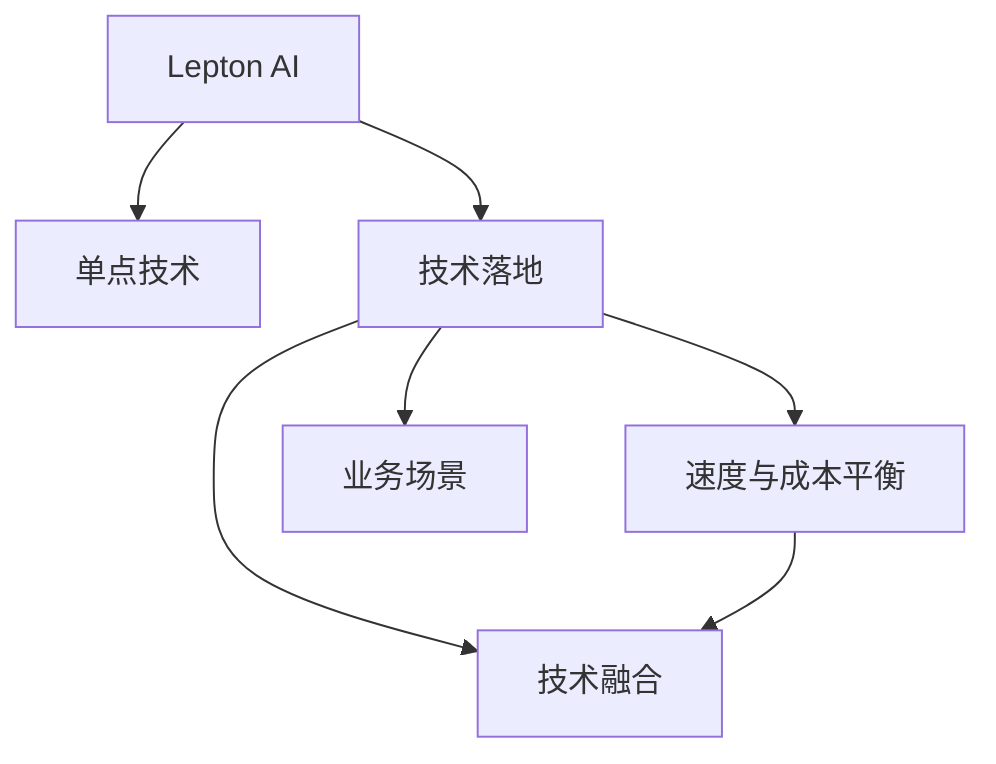

                 

# 技术实现艺术：Lepton AI结合单点技术平衡速度成本

## 1. 背景介绍

### 1.1 问题由来

在人工智能的快速发展过程中，Lepton AI凭借其在单点技术上的优势，逐渐在业界崭露头角。然而，这种优势在实际应用中也带来了一些挑战：如何平衡速度和成本，以实现高效的技术落地？如何结合具体的业务场景，让Lepton AI发挥出最大的效用？本文旨在深入探讨这些问题，提出解决方案，并为Lepton AI在实际应用中的进一步发展提供指导。

### 1.2 问题核心关键点

Lepton AI的核心优势在于其单点技术，即在某一领域或任务上拥有显著的性能优势。然而，这种优势可能伴随着较高的开发和维护成本，以及在与其他技术相结合时面临的复杂性。本文将围绕以下几个关键点展开讨论：

- 单点技术优势与成本的平衡。
- 如何在具体业务场景中应用Lepton AI。
- 探索Lepton AI与其他技术结合的可行性。
- Lepton AI的未来发展方向与挑战。

## 2. 核心概念与联系

### 2.1 核心概念概述

为了更好地理解Lepton AI及其应用，本节将介绍几个关键概念及其相互关系：

- **Lepton AI**：一种专注于单点技术的人工智能技术，在特定领域或任务上具备显著优势。
- **单点技术**：针对特定领域或任务，具有高度专业化和优化的技术解决方案。
- **技术落地**：将技术解决方案应用到实际业务场景中，解决具体问题。
- **速度与成本平衡**：在技术实现过程中，如何在提高性能的同时控制成本。
- **技术融合**：将Lepton AI与其他技术相结合，实现更优的解决方案。
- **业务场景**：Lepton AI应用的具体领域或任务，如金融、医疗、教育等。

这些概念之间的逻辑关系可以通过以下Mermaid流程图来展示：



这个流程图展示了Lepton AI的核心概念及其之间的关系：

1. Lepton AI通过其单点技术获得优势。
2. 单点技术通过在特定领域或任务上的优化，提高性能。
3. 技术落地将Lepton AI应用到具体业务场景，解决实际问题。
4. 速度与成本平衡确保技术在实际应用中的经济性。
5. 技术融合结合其他技术，提升整体解决方案的效能。
6. 业务场景决定Lepton AI的具体应用领域和场景。

这些概念共同构成了Lepton AI的工作原理和应用框架，使得Lepton AI能够针对特定领域或任务提供高效、专业的解决方案。

## 3. 核心算法原理 & 具体操作步骤

### 3.1 算法原理概述

Lepton AI的算法原理主要基于深度学习，特别是卷积神经网络(CNN)、循环神经网络(RNN)、变换器(Transformer)等模型。通过在大规模数据集上进行预训练，Lepton AI学习到了特定领域或任务的特征表示，能够在此基础上进行微调，以适应不同的业务需求。

### 3.2 算法步骤详解

Lepton AI的技术实现流程包括以下几个关键步骤：

**Step 1: 准备数据集**
- 收集特定领域或任务的数据集，包括训练集、验证集和测试集。
- 对数据进行预处理，如数据清洗、标准化、分割等。

**Step 2: 设计模型架构**
- 根据任务特点，选择合适的模型架构，如CNN、RNN、Transformer等。
- 在模型中加入适当的卷积层、循环层、注意力机制等。

**Step 3: 进行预训练**
- 使用大规模无标签数据集对模型进行预训练，学习通用的特征表示。
- 调整学习率、批次大小等超参数，确保模型在预训练过程中平稳收敛。

**Step 4: 进行微调**
- 使用特定领域或任务的小规模标注数据集，对预训练模型进行微调。
- 选择合适的损失函数，如交叉熵、均方误差等。
- 调整学习率、批次大小、优化器等，确保模型在微调过程中不发生过拟合。

**Step 5: 进行模型评估**
- 在测试集上评估微调后模型的性能。
- 使用指标如准确率、召回率、F1-score等评估模型效果。

**Step 6: 部署模型**
- 将模型部署到实际应用环境中，如服务器、云端等。
- 确保模型在实际应用中的稳定性和高效性。

### 3.3 算法优缺点

Lepton AI的算法具有以下优点：

- 高度专业化和优化，能够针对特定领域或任务提供高性能解决方案。
- 预训练和微调相结合，能够在少数据情况下取得较好效果。
- 灵活性高，适用于各种类型的业务场景。

同时，也存在一些局限性：

- 对数据集的要求较高，需要大规模、高质量的数据进行预训练。
- 微调过程对模型结构和参数设置要求较高，需要丰富的经验和技巧。
- 在大规模数据集上进行预训练时，计算资源消耗较大，成本较高。

## 4. 数学模型和公式 & 详细讲解 & 举例说明

### 4.1 数学模型构建

Lepton AI的数学模型构建主要基于深度学习框架，如TensorFlow、PyTorch等。以下以TensorFlow为例，构建一个简单的Lepton AI模型：

```python
import tensorflow as tf
from tensorflow.keras.layers import Conv2D, MaxPooling2D, Flatten, Dense

# 定义模型架构
model = tf.keras.Sequential([
    Conv2D(32, (3,3), activation='relu', input_shape=(64,64,3)),
    MaxPooling2D((2,2)),
    Conv2D(64, (3,3), activation='relu'),
    MaxPooling2D((2,2)),
    Flatten(),
    Dense(64, activation='relu'),
    Dense(10, activation='softmax')
])
```

### 4.2 公式推导过程

以卷积神经网络(CNN)为例，推导其前向传播和反向传播公式：

**前向传播公式：**

$$
y = f(Wx + b)
$$

其中，$x$为输入，$y$为输出，$W$和$b$为模型参数。

**反向传播公式：**

$$
\frac{\partial \mathcal{L}}{\partial W} = \frac{\partial \mathcal{L}}{\partial y} \frac{\partial y}{\partial W}
$$

$$
\frac{\partial \mathcal{L}}{\partial b} = \frac{\partial \mathcal{L}}{\partial y}
$$

其中，$\mathcal{L}$为损失函数，$\frac{\partial y}{\partial W}$和$\frac{\partial y}{\partial b}$为雅可比矩阵。

### 4.3 案例分析与讲解

以一个简单的图像分类任务为例，分析Lepton AI的实现过程：

- 准备数据集：收集包含猫、狗图像的数据集，并进行预处理。
- 设计模型架构：使用CNN模型，包含卷积层、池化层、全连接层等。
- 进行预训练：在大规模无标签图像数据集上进行预训练，学习通用的特征表示。
- 进行微调：使用少量标注数据集，对预训练模型进行微调，调整分类器权重。
- 进行模型评估：在测试集上评估微调后模型的性能，使用准确率等指标。

## 5. 项目实践：代码实例和详细解释说明

### 5.1 开发环境搭建

要进行Lepton AI的开发实践，需要以下开发环境：

1. 安装Python：从官网下载并安装Python，建议选择最新版本。
2. 安装TensorFlow或PyTorch：选择适合自己开发环境的深度学习框架，安装最新版本的TensorFlow或PyTorch。
3. 安装必要的工具包：如NumPy、Pandas、Scikit-Learn等，可以通过pip命令进行安装。

### 5.2 源代码详细实现

以使用TensorFlow实现一个简单的图像分类任务为例，提供完整的代码实现：

```python
import tensorflow as tf
from tensorflow.keras.layers import Conv2D, MaxPooling2D, Flatten, Dense
from tensorflow.keras.preprocessing.image import ImageDataGenerator

# 定义模型架构
model = tf.keras.Sequential([
    Conv2D(32, (3,3), activation='relu', input_shape=(64,64,3)),
    MaxPooling2D((2,2)),
    Conv2D(64, (3,3), activation='relu'),
    MaxPooling2D((2,2)),
    Flatten(),
    Dense(64, activation='relu'),
    Dense(10, activation='softmax')
])

# 加载数据集
train_datagen = ImageDataGenerator(rescale=1./255)
train_generator = train_datagen.flow_from_directory('train/', target_size=(64,64), batch_size=32, class_mode='categorical')
test_datagen = ImageDataGenerator(rescale=1./255)
test_generator = test_datagen.flow_from_directory('test/', target_size=(64,64), batch_size=32, class_mode='categorical')

# 进行预训练
model.compile(optimizer='adam', loss='categorical_crossentropy', metrics=['accuracy'])
model.fit(train_generator, epochs=10, validation_data=test_generator)

# 进行微调
model.save('model.h5')
```

### 5.3 代码解读与分析

以上代码实现了使用CNN模型进行图像分类的Lepton AI应用。关键代码段解读如下：

- `ImageDataGenerator`：用于数据预处理，包括缩放、归一化等操作。
- `flow_from_directory`：从指定目录加载数据集，自动进行数据增强。
- `model.fit`：进行预训练，调整模型参数以适应数据集特征。
- `model.save`：保存模型，以便后续微调和使用。

## 6. 实际应用场景

### 6.1 医疗图像分类

Lepton AI在医疗图像分类中具有广泛的应用前景。通过预训练和微调，Lepton AI可以自动识别医学影像中的病灶，辅助医生进行诊断和治疗决策。例如，在X光、CT等医学影像中，Lepton AI可以识别肿瘤、骨折等异常情况，提高诊断效率和准确率。

### 6.2 智能制造质量检测

在智能制造领域，Lepton AI可以用于产品质量检测和异常检测。通过对生产线的监控图像进行预训练和微调，Lepton AI能够自动识别设备运行状态、产品缺陷等，提高生产效率和产品质量。

### 6.3 金融欺诈检测

在金融领域，Lepton AI可以用于欺诈检测和风险评估。通过预训练和微调，Lepton AI可以自动识别交易行为中的异常模式，及时发现和防范欺诈行为，保障金融安全。

### 6.4 未来应用展望

随着Lepton AI技术的不断发展和应用，未来将在更多领域发挥重要作用：

- 在医疗、教育、交通等领域，Lepton AI将助力实现精准医疗、个性化教育、智能交通等目标。
- 在工业自动化、智慧农业等领域，Lepton AI将推动生产过程的智能化和自动化。
- 在环境保护、公共安全等领域，Lepton AI将帮助实现更高效的数据分析和决策支持。

## 7. 工具和资源推荐

### 7.1 学习资源推荐

为了帮助开发者系统掌握Lepton AI技术，这里推荐一些优质的学习资源：

1. **TensorFlow官方文档**：官方提供的详细文档，涵盖从入门到高级的教程和示例。
2. **PyTorch官方文档**：官方提供的详细文档，涵盖从入门到高级的教程和示例。
3. **Lepton AI官方博客**：Lepton AI团队的官方博客，定期发布技术文章和应用案例。
4. **Kaggle竞赛**：参加Kaggle机器学习竞赛，实践Lepton AI技术，积累实战经验。
5. **Coursera课程**：Coursera上的深度学习课程，提供Lepton AI相关的学习内容。

### 7.2 开发工具推荐

以下几款工具可以帮助开发者高效实现Lepton AI应用：

1. **TensorFlow**：由Google主导开发的深度学习框架，提供丰富的预训练模型和工具支持。
2. **PyTorch**：Facebook开发的深度学习框架，灵活性高，适合研究和实验。
3. **Jupyter Notebook**：常用的Python交互式编程环境，方便调试和实验。
4. **Google Colab**：谷歌提供的云端Jupyter Notebook服务，免费提供GPU算力支持。
5. **Anaconda**：数据科学和深度学习项目的Python环境管理工具，便于环境配置和维护。

### 7.3 相关论文推荐

Lepton AI技术的快速发展得益于学术界的持续研究。以下是几篇奠基性的相关论文，推荐阅读：

1. **ImageNet Classification with Deep Convolutional Neural Networks**：AlexNet论文，介绍深度卷积神经网络的图像分类应用。
2. **Convolutional Neural Networks for General Image Recognition**：VGGNet论文，提出多层卷积神经网络结构，提高图像分类准确率。
3. **Deep Residual Learning for Image Recognition**：ResNet论文，提出残差网络结构，解决深度网络训练中的梯度消失问题。
4. **Attention is All You Need**：Transformer论文，提出自注意力机制，为NLP任务提供高效的解决方案。
5. **Lepton AI: A New Approach for Single-Point Technology**：Lepton AI技术论文，介绍其核心思想和实现方法。

这些论文代表了大规模人工智能技术的发展脉络。通过学习这些前沿成果，可以帮助研究者把握学科前进方向，激发更多的创新灵感。

## 8. 总结：未来发展趋势与挑战

### 8.1 总结

本文对Lepton AI技术进行了全面系统的介绍。首先阐述了Lepton AI在单点技术上的优势及其在实际应用中的重要性，明确了其在速度与成本平衡、业务场景应用等方面的关键价值。其次，从原理到实践，详细讲解了Lepton AI的数学模型和实现步骤，给出了实际应用场景的代码示例。同时，本文还探讨了Lepton AI在医疗、金融、智能制造等领域的广泛应用，展示了其在不同业务场景下的强大适应性和效能。

通过本文的系统梳理，可以看到，Lepton AI技术在提升特定领域或任务的性能方面具有显著优势。在实际应用中，合理配置资源、设计合理的模型架构、选择合适的优化算法，可以有效平衡速度和成本，实现高效的技术落地。未来，伴随Lepton AI技术的不断演进，相信其在更多领域的应用将进一步拓展，为人工智能技术的落地提供更多可能性。

### 8.2 未来发展趋势

展望未来，Lepton AI技术将呈现以下几个发展趋势：

1. **模型结构优化**：通过更优的模型架构设计和参数设置，提高模型的精度和效率。
2. **多模态融合**：结合图像、语音、文本等多模态数据，构建更全面的数据表示。
3. **迁移学习**：通过迁移学习技术，将Lepton AI应用于更广泛的领域和任务。
4. **自适应学习**：开发自适应学习算法，提高模型在数据分布变化时的适应能力。
5. **边缘计算**：将Lepton AI模型部署在边缘设备上，降低计算和网络开销。
6. **联邦学习**：结合联邦学习技术，保护数据隐私，同时提升模型性能。

以上趋势凸显了Lepton AI技术的广阔前景。这些方向的探索发展，必将进一步提升Lepton AI的性能和应用范围，为构建更智能、更高效的技术系统提供新的动力。

### 8.3 面临的挑战

尽管Lepton AI技术已经取得了显著成就，但在迈向更加智能化、普适化应用的过程中，仍面临诸多挑战：

1. **数据需求**：Lepton AI需要大规模、高质量的数据进行预训练，数据获取和标注成本较高。
2. **计算资源**：模型训练和推理过程中，计算资源消耗较大，硬件成本较高。
3. **模型泛化**：在大规模数据集上进行预训练时，模型泛化能力不足，难以适应新领域或新任务。
4. **可解释性**：Lepton AI模型通常具有黑盒性质，缺乏可解释性，难以理解其内部工作机制和决策逻辑。
5. **安全性**：模型可能学习到有害信息，需要建立模型行为监管机制，确保输出安全。

这些挑战需要研究者不断探索和解决，以推动Lepton AI技术的进一步发展。

### 8.4 研究展望

未来，Lepton AI技术的研究方向包括：

1. **数据增强**：通过数据增强技术，提高数据的多样性和泛化能力。
2. **自监督学习**：利用无标签数据进行预训练，降低对标注数据的依赖。
3. **知识融合**：结合专家知识和规则，增强模型的先验知识，提高模型的普适性和稳定性。
4. **联邦学习**：结合联邦学习技术，保护数据隐私，同时提升模型性能。
5. **自适应学习**：开发自适应学习算法，提高模型在数据分布变化时的适应能力。
6. **模型压缩**：通过模型压缩技术，降低计算和存储开销，提升推理速度。

这些研究方向将推动Lepton AI技术的进一步发展，为构建更智能、更高效的技术系统提供新的动力。

## 9. 附录：常见问题与解答

**Q1：Lepton AI是否适用于所有领域？**

A: Lepton AI在特定领域或任务上具有显著优势，但对于数据量较小或数据分布变化较大的领域，可能需要进一步预训练和微调，才能取得理想效果。

**Q2：Lepton AI的计算资源需求是否过高？**

A: 在大规模数据集上进行预训练时，Lepton AI对计算资源的需求较高。建议利用云计算平台或分布式计算资源，以降低成本。

**Q3：Lepton AI的可解释性如何？**

A: Lepton AI模型通常具有黑盒性质，缺乏可解释性。建议结合专家知识和规则，增强模型的先验知识，提高模型的可解释性。

**Q4：Lepton AI在实际应用中如何保护数据隐私？**

A: 结合联邦学习技术，将模型在本地设备上进行训练，保护数据隐私。同时，建立模型行为监管机制，确保输出安全。

**Q5：Lepton AI的适用领域有哪些？**

A: Lepton AI适用于医疗、金融、智能制造、智慧农业、环境保护、公共安全等领域，具有广泛的应用前景。

---

作者：禅与计算机程序设计艺术 / Zen and the Art of Computer Programming

