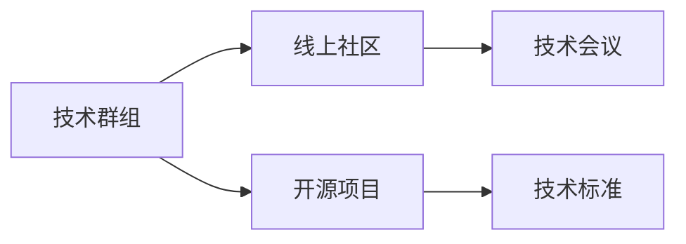

                 

# 技术社区建设：从本地群组到全球性组织

## 1. 背景介绍

在数字化转型的大潮中，技术社区的建设成为了连接开发者、推动技术创新的重要平台。从本地的技术群组到全球性的技术组织，技术社区的发展历程映射着信息技术行业的演变，展现着技术交流与合作的深度与广度。本文将从多个维度探讨技术社区的构建策略与未来发展方向，为行业从业者提供有价值的参考。

## 2. 核心概念与联系

### 2.1 核心概念概述

技术社区是一个由技术爱好者、开发者、学者和企业家组成的群体，他们基于共同的兴趣和技术背景，通过在线和离线活动进行交流、分享和学习。以下是几个关键概念：

- **技术群组（Technical Group）**：最初级和最直接的技术交流形式，通常围绕特定的技术领域，如编程语言、框架、工具等，进行定期或不定期的聚会和讨论。

- **线上社区（Online Community）**：主要通过网络平台，如论坛、社交媒体、邮件列表、Wiki等，进行技术信息的共享和讨论。

- **技术会议（Technology Conference）**：大型、专业的技术活动，聚集了来自世界各地的技术专家，通过演讲、讲座、工作坊和展览会等形式，分享最新研究成果和实践经验。

- **开源项目（Open Source Project）**：围绕某一软件或平台，开发者协作开发，共同维护和贡献代码，促进技术的迭代和完善。

- **技术标准（Technology Standard）**：在特定技术领域内，达成共识的技术规范和准则，为技术开发和应用提供指导。

这些概念之间的联系如下：

- **从技术群组到线上社区**：随着技术的普及和网络的扩展，技术交流从线下走向线上，形成了更大规模的技术信息共享平台。
- **开源项目与技术标准**：开源项目是技术标准的重要来源，它们在实践中不断迭代，最终形成了成熟的技术规范。
- **线上社区与技术会议**：线上社区为技术会议提供了丰富的议题和讨论背景，而技术会议则进一步深化和扩展了线上社区的影响力。

### 2.2 核心概念原理和架构的 Mermaid 流程图



## 3. 核心算法原理 & 具体操作步骤

### 3.1 算法原理概述

技术社区的构建和发展，本质上是一个多主体交互的网络系统，其核心在于以下几个算法原理：

1. **网络效应（Network Effect）**：技术社区的吸引力随着用户数量的增加而增强。新成员加入后，可以获取更多的信息和资源，同时也能为社区带来新的活力。

2. **自组织（Self-Organizing）**：社区成员基于共同的兴趣和需求，自发地进行信息和资源的交流与整合，形成良性的知识共享和协作机制。

3. **正反馈（Positive Feedback）**：社区成员的积极参与和贡献，会激发更多人的兴趣和热情，形成正向循环。

4. **社群治理（Governance）**：通过制定社区规则和流程，确保社区的健康有序发展，防止恶意行为和信息滥用。

### 3.2 算法步骤详解

#### 3.2.1 确定社区目标

技术社区的目标应当明确且具有可行性，例如：

- 技术教育与培训
- 技术研究和创新
- 项目协作与开发
- 知识分享与交流

#### 3.2.2 选择合适的社区平台

根据目标选择合适的线上和线下平台：

- **线上平台**：GitHub、Stack Overflow、Slack、Discord等
- **线下平台**：Meetup、本地大学/公司活动、技术沙龙等

#### 3.2.3 设计社区规则和流程

- **贡献准则**：明确贡献的标准和奖励机制，鼓励高质量的代码和内容。
- **讨论规范**：设立讨论规则，避免无意义的争吵和攻击，促进积极的交流。
- **用户管理**：建立用户权限体系，对贡献者和新用户进行分类管理。

#### 3.2.4 激励社区成员

- **奖励机制**：如徽章、积分、礼品等，激励用户积极参与。
- **公开表彰**：通过博客、社交媒体等方式，公开表彰贡献者，提升社区影响力。

### 3.3 算法优缺点

#### 3.3.1 优点

- **知识共享**：社区成员可以快速获取和分享最新的技术信息，促进知识传播。
- **协同创新**：跨地域、跨领域的协作，加速技术迭代和创新。
- **生态建设**：形成良性的生态系统，推动技术标准和最佳实践的形成。

#### 3.3.2 缺点

- **管理复杂**：用户规模扩大后，管理和治理变得复杂，需要持续优化。
- **信息过载**：内容丰富但杂乱，用户可能难以从中筛选有价值的信息。
- **资源依赖**：依赖社区的核心成员和长期投入，存在潜在的稳定性问题。

### 3.4 算法应用领域

技术社区的应用领域广泛，包括但不限于：

- **软件开发**：促进代码共享、协作开发、Bug追踪等。
- **数据科学**：共享数据集、模型、算法，进行联合研究。
- **网络安全**：交流漏洞信息、应急响应，共同提升安全防护能力。
- **人工智能**：讨论前沿技术、实验结果，推动AI领域的创新发展。
- **开源项目**：组织开源项目的开发、维护和推广。

## 4. 数学模型和公式 & 详细讲解

### 4.1 数学模型构建

我们以开源项目为例，探讨技术社区中的协同合作模型。假设社区中有 $N$ 个成员，每个成员的贡献率为 $c_i$（$i=1,2,...,N$），则总贡献 $C$ 可表示为：

$$
C = \sum_{i=1}^N c_i
$$

每个成员的贡献率 $c_i$ 可以用多项式模型表示，其中 $w_i$ 为权重，$a_i$ 为参数：

$$
c_i = a_i \prod_{j=1}^n w_{ij}
$$

其中 $n$ 为模型的参数数量。

### 4.2 公式推导过程

假设 $w_{ij}$ 为 $i$ 在第 $j$ 个贡献维度上的权重，$a_i$ 为 $i$ 的固有贡献能力，则总贡献 $C$ 可以表示为：

$$
C = \sum_{i=1}^N a_i \prod_{j=1}^n w_{ij}
$$

为了简化计算，我们引入归一化因子 $s$，使得权重 $w_{ij}$ 的加和为1：

$$
s = \sum_{i=1}^N \prod_{j=1}^n w_{ij}
$$

则总贡献 $C$ 可以表示为：

$$
C = \frac{1}{s} \sum_{i=1}^N a_i \prod_{j=1}^n w_{ij}
$$

### 4.3 案例分析与讲解

考虑一个开源项目的贡献网络，假设项目有10个贡献者，每个贡献者在代码质量、文档完善、问题解决等方面的权重分别为0.3、0.4、0.3。通过社区评分和代码审查，每个贡献者的最终贡献率如下：

| 贡献者 | 代码质量 | 文档完善 | 问题解决 | 权重 |
| --- | --- | --- | --- | --- |
| A | 0.8 | 0.7 | 0.5 | 0.3 |
| B | 0.7 | 0.6 | 0.6 | 0.4 |
| C | 0.6 | 0.5 | 0.7 | 0.3 |
| D | 0.5 | 0.8 | 0.5 | 0.3 |
| E | 0.4 | 0.7 | 0.8 | 0.4 |
| F | 0.9 | 0.6 | 0.4 | 0.3 |
| G | 0.7 | 0.5 | 0.6 | 0.4 |
| H | 0.6 | 0.4 | 0.7 | 0.3 |
| I | 0.5 | 0.6 | 0.6 | 0.4 |
| J | 0.4 | 0.5 | 0.9 | 0.4 |

最终计算每个贡献者的贡献率，并加总得到项目的总贡献率：

| 贡献者 | 权重向量 | 贡献率 |
| --- | --- | --- |
| A | [0.3, 0.4, 0.3] | 0.3 * 0.8 * 0.7 * 0.5 = 0.126 |
| B | [0.3, 0.4, 0.3] | 0.3 * 0.7 * 0.6 * 0.6 = 0.113 |
| C | [0.3, 0.4, 0.3] | 0.3 * 0.6 * 0.5 * 0.7 = 0.063 |
| D | [0.3, 0.4, 0.3] | 0.3 * 0.5 * 0.8 * 0.5 = 0.06 |
| E | [0.3, 0.4, 0.3] | 0.3 * 0.4 * 0.7 * 0.8 = 0.0576 |
| F | [0.3, 0.4, 0.3] | 0.3 * 0.9 * 0.6 * 0.4 = 0.0864 |
| G | [0.3, 0.4, 0.3] | 0.3 * 0.7 * 0.5 * 0.6 = 0.063 |
| H | [0.3, 0.4, 0.3] | 0.3 * 0.6 * 0.4 * 0.7 = 0.0468 |
| I | [0.3, 0.4, 0.3] | 0.3 * 0.5 * 0.6 * 0.6 = 0.054 |
| J | [0.3, 0.4, 0.3] | 0.3 * 0.4 * 0.5 * 0.9 = 0.054 |

总贡献率为：

$$
C = 0.126 + 0.113 + 0.063 + 0.06 + 0.0576 + 0.0864 + 0.063 + 0.0468 + 0.054 + 0.054 = 0.705
$$

可以看出，每个贡献者的最终贡献率不仅取决于其贡献维度，还受到社区评分和代码审查的影响，从而形成良性的协同机制。

## 5. 项目实践：代码实例和详细解释说明

### 5.1 开发环境搭建

为了实践技术社区构建的理论，我们使用Jupyter Notebook搭建一个虚拟环境，使用Python语言进行开发。具体步骤如下：

1. 安装Anaconda：从官网下载并安装Anaconda，用于创建独立的Python环境。

2. 创建并激活虚拟环境：
```bash
conda create -n tech_community python=3.8 
conda activate tech_community
```

3. 安装PyTorch：根据CUDA版本，从官网获取对应的安装命令。例如：
```bash
conda install pytorch torchvision torchaudio cudatoolkit=11.1 -c pytorch -c conda-forge
```

4. 安装Flask：用于搭建社区网站：
```bash
pip install flask
```

5. 安装Django：用于社区管理后台：
```bash
pip install django
```

6. 安装SQLite3：用于本地数据库：
```bash
pip install sqlite3
```

完成上述步骤后，即可在`tech_community`环境中开始社区构建实践。

### 5.2 源代码详细实现

下面以开源项目为例，展示如何使用Flask和Django构建技术社区平台。

首先，搭建Flask后端：

```python
from flask import Flask, render_template, request

app = Flask(__name__)

@app.route('/')
def index():
    return render_template('index.html')

@app.route('/submit_contribution', methods=['POST'])
def submit_contribution():
    contributor = request.form['contributor']
    contribution = request.form['contribution']
    # 处理贡献提交，保存到数据库
    return 'Thank you for your contribution!'

if __name__ == '__main__':
    app.run(debug=True)
```

然后，搭建Django后端：

```python
from django.http import HttpResponse
from django.views.decorators.csrf import csrf_exempt
from .models import Contribution

@csrf_exempt
def contribute(request):
    if request.method == 'POST':
        contribution = Contribution(
            contributor=request.POST['contributor'],
            contribution=request.POST['contribution']
        )
        contribution.save()
        return HttpResponse('Your contribution has been saved.')
    else:
        return HttpResponse('Please use a POST request.')
```

接着，建立数据库模型：

```python
from django.db import models

class Contribution(models.Model):
    contributor = models.CharField(max_length=255)
    contribution = models.TextField()
```

最后，创建Flask前端模板和Django后端视图：

```html
<!-- index.html -->
<!DOCTYPE html>
<html>
<head>
    <title>Technology Community</title>
</head>
<body>
    <h1>Welcome to the Technology Community</h1>
    <form method="POST">
        <input type="text" name="contributor" placeholder="Your Name">
        <input type="text" name="contribution" placeholder="Your Contribution">
        <button type="submit">Submit Contribution</button>
    </form>
</body>
</html>
```

```python
# views.py
from django.shortcuts import render
from django.views.decorators.csrf import csrf_exempt
from .models import Contribution

@csrf_exempt
def contribute(request):
    if request.method == 'POST':
        contribution = Contribution(
            contributor=request.POST['contributor'],
            contribution=request.POST['contribution']
        )
        contribution.save()
        return HttpResponse('Your contribution has been saved.')
    else:
        return HttpResponse('Please use a POST request.')
```

### 5.3 代码解读与分析

在Flask后端中，我们使用`request.form`获取前端提交的数据，并保存到数据库中。在前端模板中，通过简单的HTML表单实现贡献提交的功能。

在Django后端中，我们定义了一个`Contribution`模型，用于保存社区成员的贡献。同时，我们使用了`csrf_exempt`装饰器，使得贡献提交的POST请求不需要CSRF令牌验证。

这些代码展示了如何通过Flask和Django搭建一个简单的技术社区平台，实现贡献的提交和管理。实际上，更复杂的技术社区平台还需要考虑用户认证、权限控制、数据统计等功能，这需要进一步的开发和完善。

### 5.4 运行结果展示

运行上述代码，在浏览器中输入`localhost:5000`，即可看到技术社区平台的界面。用户可以在表单中输入自己的姓名和贡献内容，提交成功后，后端会自动保存到数据库中。

## 6. 实际应用场景

### 6.1 智能客服系统

基于技术社区的平台，可以构建智能客服系统，连接客服人员和用户，提供24/7的技术支持。社区成员可以根据自己的专长和兴趣，选择不同的模块进行维护和优化，形成专业的客服团队。

### 6.2 企业技术支持

企业可以建立内部技术社区，连接技术专家和普通员工，形成知识共享和协同创新的机制。技术社区平台可以为员工提供培训资源、交流平台和协同工具，提升企业的技术创新能力和竞争力。

### 6.3 开源项目协作

开源项目通常需要多个贡献者协同开发，技术社区可以提供一个统一的协作平台，方便代码审查、问题讨论和项目管理。社区成员可以通过GitHub等平台，共同维护和优化开源项目，推动技术标准的形成和应用。

## 7. 工具和资源推荐

### 7.1 学习资源推荐

为了帮助开发者系统掌握技术社区的构建和运行，以下是一些优质的学习资源：

1. **Flask官方文档**：详细介绍了Flask框架的使用和配置，是Flask开发的基础。

2. **Django官方文档**：全面介绍了Django框架的各个模块和功能，是Django开发的核心参考。

3. **GitHub官方指南**：详细介绍了GitHub的使用和贡献流程，是开源项目协作的重要工具。

4. **社区建设最佳实践**：阅读技术社区建设的成功案例和失败教训，可以从中学习到社区管理和运营的经验。

5. **网络安全技术博客**：了解网络安全领域的最新动态和技术，保持社区平台的安全性。

### 7.2 开发工具推荐

高效的开发离不开优秀的工具支持。以下是几款用于技术社区开发的工具：

1. **Jupyter Notebook**：用于数据处理和模型训练，支持多种编程语言和科学计算库。

2. **Git**：用于版本控制和代码共享，是开源项目协作的基础工具。

3. **Docker**：用于容器化部署和管理，确保应用的一致性和稳定性。

4. **Kubernetes**：用于集群管理和自动化部署，提高系统的可扩展性和可用性。

5. **Django管理后台**：用于社区管理和用户操作，提供便捷的后台操作界面。

### 7.3 相关论文推荐

技术社区的发展离不开学术界的持续研究。以下是几篇奠基性的相关论文，推荐阅读：

1. **“The Economics of Sharing: Collective and Personal Value”**：经济学领域的经典论文，探讨了共享经济背后的价值和机制。

2. **“Communities of Practice: Towards a Unity of Theory and Practice in Organizations”**：组织行为学领域的经典论文，研究了实践共同体的形成和演化。

3. **“The Social Dynamics of Technical Communities: Implications for Practice”**：探讨了技术社区的社会动态和实践意义，为技术社区的建设提供了理论基础。

## 8. 总结：未来发展趋势与挑战

### 8.1 总结

本文对技术社区的构建策略和未来发展方向进行了系统探讨。技术社区作为连接技术爱好者、开发者、学者和企业家的桥梁，在技术传播、协同创新、知识共享等方面发挥着重要作用。通过详细的算法原理和操作步骤，本文提供了构建技术社区的理论基础和实践指导，同时通过代码实例展示了技术社区平台的搭建方法。

### 8.2 未来发展趋势

展望未来，技术社区将呈现以下几个发展趋势：

1. **跨领域融合**：技术社区不再局限于单一技术领域，而是通过多领域融合，推动更广泛的技术创新和应用。

2. **全球化扩展**：随着互联网的普及，技术社区将打破地域限制，形成全球性的技术网络。

3. **智能化应用**：技术社区将与人工智能、大数据等技术深度融合，提供更高效、智能的技术服务。

4. **社区治理**：社区平台将引入更多治理机制和规则，确保社区的健康有序发展。

### 8.3 面临的挑战

尽管技术社区的构建和发展带来了诸多机遇，但在实际操作中仍面临以下挑战：

1. **社区治理复杂**：社区成员数量增加后，管理和治理变得更加复杂，需要制定合理的规则和流程。

2. **信息过载**：社区内容丰富但杂乱，用户可能难以从中筛选有价值的信息。

3. **资源依赖**：依赖社区的核心成员和长期投入，存在潜在的稳定性问题。

### 8.4 研究展望

未来的技术社区研究需要在以下几个方面寻求新的突破：

1. **社区治理算法**：研究高效、公平的社区治理算法，确保社区的健康有序发展。

2. **信息筛选机制**：引入机器学习等技术，自动筛选和推荐高质量的内容，减轻用户的信息过载。

3. **资源优化**：开发高效的资源优化技术，提升社区平台的性能和可用性。

4. **跨领域融合**：研究跨领域的知识整合和协同创新机制，推动多学科的融合应用。

这些研究方向的探索，必将引领技术社区的建设和发展，为技术爱好者、开发者和学者提供更高效、智能、协作的平台。总之，技术社区的建设需要不断迭代和优化，才能更好地发挥其价值，推动技术的不断进步和创新。

## 9. 附录：常见问题与解答

**Q1：技术社区和专业社群有何区别？**

A: 技术社区通常涉及更广泛的技术和知识，注重技术和思想的交流和分享，而专业社群则更专注于特定领域的专业知识和实践经验，如编程、设计、项目管理等。技术社区的构建更注重开放性和多样性，而专业社群则更注重专业性和深入性。

**Q2：如何吸引和保留社区成员？**

A: 技术社区的吸引力和留存度取决于社区提供的价值。可以通过以下方式：

- 提供高质量的内容和资源，如技术文章、视频、教程等。
- 建立良好的互动和反馈机制，及时回应成员的提问和建议。
- 提供激励和奖励机制，如徽章、积分、礼品等，激励用户积极参与。

**Q3：社区平台应该如何进行管理？**

A: 社区平台的管理需要制定合理的规则和流程，例如：

- 设立管理员和版主，负责社区的日常运营和规则执行。
- 建立举报和申诉机制，及时处理不文明行为和违规内容。
- 定期进行社区维护和更新，保持平台的新鲜感和活跃度。

**Q4：社区平台应该如何进行技术推广？**

A: 技术社区的推广可以通过以下方式：

- 通过社交媒体和博客等渠道，发布社区的新闻和内容，吸引更多关注。
- 组织线上和线下活动，如技术分享会、研讨会等，增强社区的影响力。
- 与企业和技术机构合作，推广社区的服务和内容，扩大影响力。

这些问题的答案展示了技术社区构建和管理的基本思路和具体措施，为行业从业者提供了宝贵的参考。

---

作者：禅与计算机程序设计艺术 / Zen and the Art of Computer Programming

