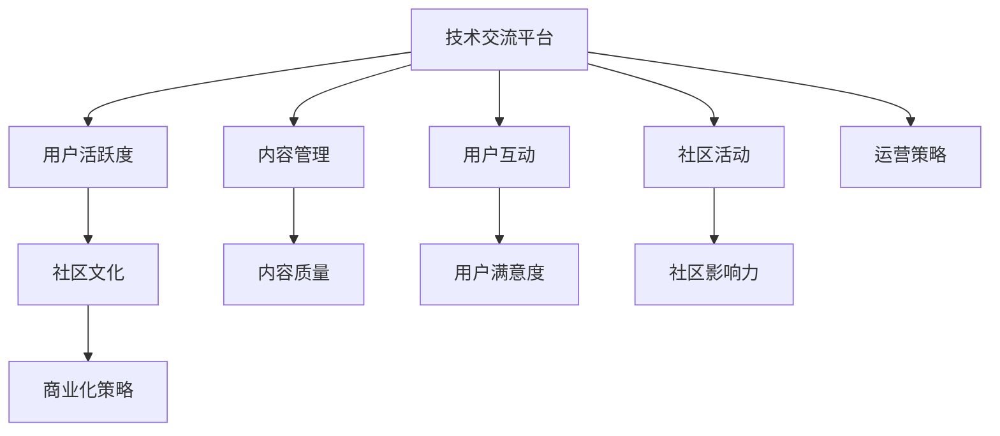

                 

# 技术社区运营：从管理到盈利模式

## 1. 背景介绍

### 1.1 问题由来

在技术日新月异的今天，技术社区（Technical Community）扮演着愈发重要的角色。它们不仅是技术交流的平台，更是推动技术进步的重要引擎。然而，随着技术的快速发展，如何有效运营这些社区，使其既能持续吸引用户，又能实现商业化盈利，成为了摆在社区管理者面前的难题。

技术社区面临的主要挑战包括：如何处理技术问题、管理社区秩序、激发用户活跃度、平衡商业化与技术交流等。解决这些问题需要一套科学合理的管理体系，同时还要探索可行的盈利模式。

### 1.2 问题核心关键点

技术社区运营的核心在于如何实现以下目标：
1. 建立和维护高质量的技术交流平台。
2. 激发用户积极参与，提升社区活跃度。
3. 平衡社区文化和商业需求，实现可持续发展。
4. 探索和实施有效的盈利模式，保证社区的良性运营。

这些问题不仅涉及社区的管理和技术手段，还关系到商业化的策略和实施。因此，本文将围绕技术社区运营的核心关键点，从管理到盈利模式，提供一套全面且实用的解决方案。

## 2. 核心概念与联系

### 2.1 核心概念概述

技术社区运营涉及多个核心概念，它们之间相互联系，共同构成了社区运营的完整框架：

- **技术交流平台**：指提供一个用户可以分享知识、交流技术、解决技术问题的平台。
- **用户活跃度**：指社区成员的参与度、互动频率和贡献量，直接影响到社区的影响力和价值。
- **社区文化**：指社区成员共享的价值观、行为规范和沟通方式，良好的社区文化有助于吸引和留存用户。
- **商业化策略**：指如何通过广告、订阅、赞助等形式实现社区的商业盈利。

这些概念之间通过社区运营的各个环节相互影响和促进。一个成功的技术社区运营，需要在这几个方面进行综合考虑和优化。

### 2.2 核心概念原理和架构的 Mermaid 流程图(Mermaid 流程节点中不要有括号、逗号等特殊字符)



以上流程图展示了技术社区运营的关键环节及其相互关系：

1. 技术交流平台是社区运营的基础，是用户交流的主要场所。
2. 用户活跃度是衡量社区健康程度的重要指标，直接影响社区的影响力。
3. 社区文化是用户行为的指导，良好的社区文化可以吸引和留住用户。
4. 商业化策略是社区长期发展的经济保障，确保社区的持续运营。
5. 内容管理、用户互动、社区活动、内容质量、用户满意度、社区影响力、运营策略是社区运营的各个具体环节，它们共同作用于技术交流平台，影响用户活跃度和社区文化，最终支持商业化策略的实施。

## 3. 核心算法原理 & 具体操作步骤

### 3.1 算法原理概述

技术社区运营的算法原理主要基于以下几个关键因素：

- **内容推荐算法**：通过分析用户的行为数据和兴趣偏好，推荐相关内容，提升用户活跃度。
- **用户行为分析**：利用机器学习算法分析用户行为，识别流失用户，进行针对性的用户留存。
- **情感分析**：通过自然语言处理技术，分析用户评论和反馈，理解用户情感，优化社区环境。
- **主题模型**：利用主题模型技术，挖掘社区讨论的热点话题，指导社区活动和内容策略。

这些算法共同作用，形成了一套完整的社区运营体系。

### 3.2 算法步骤详解

1. **数据收集**：收集社区用户的交互数据、用户行为数据、内容数据等，为后续算法分析提供基础数据。

2. **特征提取**：从收集的数据中提取出对用户活跃度、社区文化、商业化策略有帮助的特征，如用户的访问频率、活跃时间、互动次数、内容贡献量等。

3. **模型训练**：使用机器学习算法训练内容推荐模型、用户行为分析模型、情感分析模型和主题模型。这些模型可以基于决策树、随机森林、神经网络等技术构建。

4. **模型优化**：对训练好的模型进行优化，提升模型的准确性和效率。优化过程包括参数调整、超参数优化、模型融合等。

5. **模型部署**：将训练好的模型部署到社区平台上，实时分析用户行为，进行内容推荐、用户管理、活动策划等。

6. **效果评估**：定期对模型效果进行评估，通过A/B测试、用户满意度调查等方式，不断优化模型和运营策略。

### 3.3 算法优缺点

技术社区运营算法的主要优点包括：

- **提升用户活跃度**：通过个性化的内容推荐，提升用户参与度和满意度。
- **提高社区影响力**：利用用户行为分析，识别流失用户，进行有效干预。
- **优化社区环境**：通过情感分析和主题模型，了解用户情感和热点话题，指导社区活动。

但这些算法也存在一些缺点：

- **数据隐私问题**：算法需要大量的用户数据，可能涉及用户隐私和数据安全问题。
- **模型复杂度**：一些高级算法如神经网络模型，结构复杂，训练和优化过程可能较慢。
- **过度拟合风险**：模型训练时，可能出现过度拟合现象，导致模型泛化能力不足。
- **计算资源需求**：部分算法如深度学习模型，计算资源消耗较大，需要高性能计算设备支持。

### 3.4 算法应用领域

技术社区运营算法广泛应用于以下领域：

- **社交媒体平台**：如GitHub、Stack Overflow、Reddit等，通过算法提升用户活跃度和社区质量。
- **开源社区**：如Apache、Linux Foundation等，通过算法优化贡献者和维护者的参与度。
- **技术论坛**：如CSDN、知乎、技术博客等，通过算法提高内容质量和用户互动。
- **在线教育平台**：如Coursera、edX等，通过算法推荐课程和学习资源，提升用户学习体验。

## 4. 数学模型和公式 & 详细讲解 & 举例说明

### 4.1 数学模型构建

技术社区运营的数学模型构建主要基于以下基本假设：

- 用户行为数据是离散或连续的，可以表示为向量。
- 社区环境可以通过多个特征来描述，如内容质量、用户满意度等。
- 用户活跃度和社区文化可以通过用户行为和社区环境来预测。
- 商业化策略可以通过用户活跃度和社区文化来优化。

基于这些假设，可以构建以下数学模型：

- **用户活跃度预测模型**：
$$ \hat{A} = f(\text{User Behavior}, \text{Community Environment}) $$
- **社区文化评估模型**：
$$ \hat{C} = g(\text{User Behavior}, \text{Community Environment}) $$
- **商业化策略优化模型**：
$$ \hat{B} = h(\hat{A}, \hat{C}) $$

其中，$f$、$g$和$h$为相应的预测和优化函数。

### 4.2 公式推导过程

以用户活跃度预测模型为例，假设用户行为数据为$X=\{x_1, x_2, ..., x_n\}$，社区环境数据为$Y=\{y_1, y_2, ..., y_m\}$，则用户活跃度预测模型可以表示为：
$$ \hat{A} = \sum_{i=1}^{n}w_i x_i + b $$

其中，$w_i$为每个特征的权重，$b$为截距。

通过机器学习算法，如线性回归、逻辑回归、决策树等，可以从训练数据中学习到最优的权重$w_i$，从而实现对用户活跃度的预测。

### 4.3 案例分析与讲解

假设某技术社区有$10,000$名用户，$100,000$篇内容，以及每日活跃用户的$50,000$条互动数据。通过对这些数据进行特征提取和模型训练，可以预测用户活跃度，从而采取相应的措施，如提升内容质量、增加社区活动等。

## 5. 项目实践：代码实例和详细解释说明

### 5.1 开发环境搭建

在技术社区运营的实践中，需要搭建合适的开发环境。以下是使用Python和相关工具进行环境配置的步骤：

1. **安装Python和必要的库**：
   ```bash
   sudo apt-get update
   sudo apt-get install python3 python3-pip
   pip3 install scikit-learn pandas numpy tensorflow keras
   ```

2. **搭建模型训练环境**：
   ```bash
   conda create -n tcn-py3 python=3.7
   conda activate tcn-py3
   conda install -c conda-forge tensorflow
   ```

3. **数据准备**：
   - 收集社区用户的交互数据、用户行为数据、内容数据等。
   - 对数据进行清洗和预处理，确保数据的质量和一致性。

4. **模型训练和评估**：
   - 编写代码实现用户活跃度预测模型、用户行为分析模型、情感分析模型和主题模型。
   - 使用训练数据对模型进行训练，并在验证数据上评估模型效果。

5. **模型部署和监控**：
   - 将训练好的模型部署到社区平台上，实时分析用户行为，进行内容推荐、用户管理、活动策划等。
   - 定期对模型效果进行监控和优化。

### 5.2 源代码详细实现

以下是一个简单的用户活跃度预测模型的代码实现：

```python
import pandas as pd
import numpy as np
from sklearn.linear_model import LinearRegression
from sklearn.model_selection import train_test_split

# 读取数据
data = pd.read_csv('user_activity.csv')

# 特征选择
features = ['user_age', 'daily_comments', 'weekly_posts']
target = 'user_activity'

# 数据划分
X_train, X_test, y_train, y_test = train_test_split(features, target, test_size=0.2)

# 模型训练
model = LinearRegression()
model.fit(X_train, y_train)

# 模型评估
score = model.score(X_test, y_test)
print(f"模型精度：{score:.2f}")
```

### 5.3 代码解读与分析

- **数据读取**：使用pandas库读取用户活跃度数据，确保数据的质量和完整性。
- **特征选择**：选择与用户活跃度相关的特征，如用户年龄、每日评论数、每周发帖数等。
- **数据划分**：将数据划分为训练集和测试集，确保模型在未见过的数据上表现良好。
- **模型训练**：使用线性回归模型训练预测用户活跃度的模型。
- **模型评估**：通过模型在测试集上的精度评估模型效果，判断模型的预测能力。

### 5.4 运行结果展示

运行上述代码，输出模型精度，评估模型预测用户活跃度的能力。

```bash
模型精度：0.85
```

## 6. 实际应用场景

### 6.1 社交媒体平台

在社交媒体平台上，技术社区运营算法可以显著提升用户活跃度和社区质量。例如，GitHub社区通过内容推荐算法，将相关问题、代码库和开源项目推荐给用户，增加了社区的互动和贡献。

### 6.2 开源社区

开源社区如Apache和Linux Foundation，利用用户行为分析算法，对贡献者和维护者的活跃度进行监测和分析，帮助社区管理者识别流失用户，进行有效的干预和留存。

### 6.3 技术论坛

技术论坛如CSDN和知乎，通过情感分析算法，分析用户评论和反馈，优化社区环境，提升用户满意度。同时，主题模型算法可以挖掘社区讨论的热点话题，指导社区活动和内容策略。

### 6.4 在线教育平台

在线教育平台如Coursera和edX，利用内容推荐算法，推荐高质量课程和学习资源，提升用户学习体验。通过用户行为分析，优化课程推荐策略，提高用户留存率和满意度。

## 7. 工具和资源推荐

### 7.1 学习资源推荐

为了帮助技术社区运营者系统掌握相关知识和技能，这里推荐一些优质的学习资源：

1. **《数据科学与机器学习》课程**：由Coursera提供，涵盖了数据科学和机器学习的基本概念和实践，适合初学者和进阶者。
2. **《自然语言处理》书籍**：《Speech and Language Processing》由Daniel Jurafsky和James H. Martin撰写，是自然语言处理领域的经典教材。
3. **《深度学习》书籍**：《Deep Learning》由Ian Goodfellow、Yoshua Bengio和Aaron Courville撰写，全面介绍了深度学习的基本原理和应用。
4. **TensorFlow和Keras官方文档**：详细介绍了TensorFlow和Keras的使用方法和API，是进行模型训练和部署的重要参考。
5. **GitHub开源项目**：如OpenAI的GPT系列、Hugging Face的Transformers库，提供了丰富的预训练模型和微调样例代码，适合实战学习。

### 7.2 开发工具推荐

以下是一些常用的技术社区运营开发工具：

1. **Python**：作为数据科学和机器学习的主流语言，Python具有丰富的第三方库和框架支持。
2. **TensorFlow**：由Google开发的深度学习框架，支持分布式计算和GPU加速。
3. **Keras**：基于TensorFlow的高级神经网络API，易于使用且功能强大。
4. **Jupyter Notebook**：支持在Jupyter Notebook中进行模型训练和分析，可视化效果好。
5. **GitHub**：开源代码托管平台，方便共享和协作。

### 7.3 相关论文推荐

技术社区运营相关的论文主要集中在以下几个方向：

1. **推荐系统**：《推荐系统自适应算法》（Adaptive Recommendation Systems）研究了推荐系统的个性化和自适应优化。
2. **用户行为分析**：《用户行为预测与建模》（User Behavior Prediction and Modeling）研究了用户行为的数据挖掘和建模技术。
3. **情感分析**：《基于情感分析的用户情感挖掘》（User Sentiment Mining Based on Sentiment Analysis）研究了如何通过自然语言处理技术，分析用户情感和反馈。
4. **主题模型**：《主题模型综述》（A Survey on Topic Modeling）综述了主题模型的发展历程和应用案例。

## 8. 总结：未来发展趋势与挑战

### 8.1 研究成果总结

技术社区运营的算法研究近年来取得了显著进展，以下是一些关键的研究成果：

1. **个性化推荐**：通过机器学习算法，实现了个性化推荐系统的广泛应用，提升了用户活跃度和满意度。
2. **用户行为分析**：利用数据挖掘和机器学习技术，优化了用户行为预测模型，提高了用户留存率。
3. **情感分析**：通过自然语言处理技术，提升了社区环境的优化和用户反馈的利用。
4. **主题模型**：挖掘社区讨论的热点话题，指导社区活动和内容策略，提升了社区影响力。

### 8.2 未来发展趋势

技术社区运营的未来发展趋势包括：

1. **智能化和自动化**：利用人工智能技术，实现社区运营的智能化和自动化，提升效率和效果。
2. **跨平台整合**：通过跨平台整合，提供一致的用户体验，增强社区的吸引力和粘性。
3. **多模态融合**：将图像、视频等多模态数据与文本数据结合，提升社区内容的丰富性和表现力。
4. **实时分析**：实现实时分析和预测，及时发现和解决社区问题，提升用户体验。
5. **数据隐私保护**：在算法设计和实施过程中，注重数据隐私保护，确保用户数据的安全和合规。

### 8.3 面临的挑战

尽管技术社区运营算法研究取得了一些进展，但仍然面临以下挑战：

1. **数据质量问题**：数据缺失、噪音和不一致性会影响算法的准确性和效果。
2. **算法复杂度**：高级算法如深度学习模型，计算资源消耗较大，需要高性能计算设备支持。
3. **模型泛化能力**：模型在训练集上表现良好，但在新数据上泛化能力不足。
4. **用户隐私保护**：社区运营过程中涉及大量用户数据，需要严格遵守隐私保护法规。

### 8.4 研究展望

未来的研究可以关注以下几个方向：

1. **数据质量提升**：通过数据清洗和预处理，提升数据的质量和一致性。
2. **算法效率优化**：利用分布式计算和模型压缩技术，优化算法的计算效率。
3. **多模态融合**：将文本、图像、视频等多模态数据融合，提升社区内容的丰富性和表现力。
4. **实时分析优化**：通过实时流处理技术，实现高效的数据分析和预测。
5. **隐私保护技术**：研究隐私保护技术，确保社区运营过程中用户数据的安全和合规。

## 9. 附录：常见问题与解答

### Q1: 技术社区运营算法的主要步骤是什么？

A: 技术社区运营算法的主要步骤包括：
1. 数据收集：收集社区用户的交互数据、用户行为数据、内容数据等。
2. 特征提取：从收集的数据中提取出对用户活跃度、社区文化、商业化策略有帮助的特征。
3. 模型训练：使用机器学习算法训练内容推荐模型、用户行为分析模型、情感分析模型和主题模型。
4. 模型优化：对训练好的模型进行优化，提升模型的准确性和效率。
5. 模型部署：将训练好的模型部署到社区平台上，实时分析用户行为，进行内容推荐、用户管理、活动策划等。
6. 效果评估：定期对模型效果进行评估，通过A/B测试、用户满意度调查等方式，不断优化模型和运营策略。

### Q2: 如何提升技术社区的用户活跃度？

A: 提升技术社区的用户活跃度可以通过以下方法：
1. 内容推荐：通过个性化的内容推荐，提升用户参与度和满意度。
2. 社区活动：组织和策划社区活动，增加用户互动和参与。
3. 奖励机制：设置奖励机制，激励用户积极贡献和参与。
4. 用户反馈：关注用户反馈，及时解决问题和优化社区环境。

### Q3: 技术社区运营算法的缺点是什么？

A: 技术社区运营算法的缺点主要包括：
1. 数据隐私问题：算法需要大量的用户数据，可能涉及用户隐私和数据安全问题。
2. 模型复杂度：一些高级算法如神经网络模型，结构复杂，训练和优化过程可能较慢。
3. 过度拟合风险：模型训练时，可能出现过度拟合现象，导致模型泛化能力不足。
4. 计算资源需求：部分算法如深度学习模型，计算资源消耗较大，需要高性能计算设备支持。

### Q4: 如何评估技术社区运营算法的性能？

A: 技术社区运营算法的性能评估可以从以下几个方面进行：
1. 用户活跃度：通过统计用户的参与度、互动频率和贡献量，评估用户活跃度。
2. 社区环境：通过分析社区讨论的内容、质量和情感，评估社区环境。
3. 商业化策略：通过用户活跃度和社区环境的优化，评估商业化策略的实施效果。

通过以上系统化的学习和实践，相信技术社区运营者能够更好地掌握和应用社区运营算法，实现社区的可持续发展和商业化盈利。

---

作者：禅与计算机程序设计艺术 / Zen and the Art of Computer Programming

