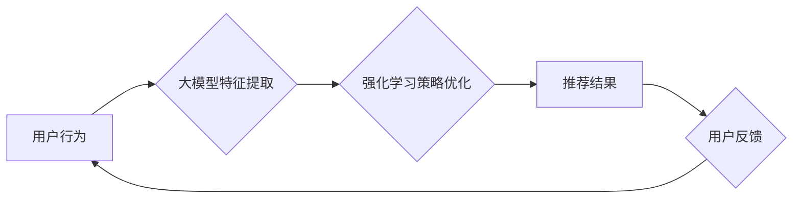

                 

## 推荐系统中的大模型强化学习与探索

> 关键词：推荐系统、大模型、强化学习、探索、推荐算法、用户行为

## 1. 背景介绍

推荐系统作为互联网时代的重要组成部分，旨在根据用户的历史行为、偏好和上下文信息，预测用户对特定物品的兴趣，并提供个性化的推荐结果。传统的推荐系统主要依赖于协同过滤、内容过滤和基于知识图谱的方法，但这些方法在面对海量数据、用户多样性和冷启动问题时，往往表现力不足。

近年来，大模型和强化学习技术在人工智能领域取得了突破性进展，为推荐系统的优化提供了新的思路。大模型能够学习到更丰富的用户和物品特征，而强化学习则可以使推荐系统更加智能化，能够根据用户的反馈不断调整推荐策略，提升推荐效果。

## 2. 核心概念与联系

### 2.1 强化学习

强化学习是一种机器学习方法，它通过让智能体在环境中进行交互，学习最优的策略来最大化累积奖励。

在推荐系统中，用户点击、评分等行为可以看作是环境的反馈，而推荐系统则扮演着智能体角色，通过学习用户的行为模式，不断调整推荐策略，以获得更高的用户满意度。

### 2.2 大模型

大模型是指参数量巨大、训练数据海量的人工智能模型。大模型能够学习到更复杂的模式和关系，在自然语言处理、图像识别等领域取得了显著成果。

在推荐系统中，大模型可以用于学习用户和物品的潜在特征，构建更精准的用户画像和物品描述，从而提高推荐的准确性和个性化程度。

### 2.3 强化学习与大模型的结合

将强化学习与大模型结合，可以构建更智能、更适应用户需求的推荐系统。大模型可以提供丰富的用户和物品特征，为强化学习算法提供更精准的数据输入，而强化学习算法则可以根据用户的反馈不断优化推荐策略，使推荐系统更加智能化。

**Mermaid 流程图**



## 3. 核心算法原理 & 具体操作步骤

### 3.1 算法原理概述

强化学习推荐算法的核心思想是将推荐系统看作一个马尔可夫决策过程 (MDP)，其中：

* **状态 (State)**：用户当前的状态，例如用户历史行为、用户偏好、上下文信息等。
* **动作 (Action)**：推荐系统可以采取的动作，例如推荐某个物品、展示某个广告等。
* **奖励 (Reward)**：用户对推荐结果的反馈，例如点击、评分、购买等。
* **策略 (Policy)**：推荐系统根据当前状态选择动作的策略。

强化学习算法的目标是学习一个最优的策略，使得在长期交互中，用户获得的总奖励最大化。

### 3.2 算法步骤详解

1. **环境初始化**: 建立推荐系统环境，定义状态空间、动作空间、奖励函数等。
2. **初始化策略**: 选择一个初始的策略，例如随机策略或贪婪策略。
3. **交互学习**: 智能体与环境交互，根据当前状态选择动作，并观察环境的反馈 (奖励)。
4. **策略更新**: 根据观察到的奖励，更新策略参数，使策略朝着最优方向调整。
5. **重复步骤3-4**: 重复交互学习和策略更新过程，直到策略收敛或达到预设的目标。

### 3.3 算法优缺点

**优点**:

* **智能化**: 可以根据用户的反馈不断调整推荐策略，提升推荐效果。
* **个性化**: 可以学习到用户的个性化偏好，提供更精准的推荐。
* **适应性强**: 可以适应用户行为的变化，不断优化推荐策略。

**缺点**:

* **训练复杂**: 需要大量的用户数据和计算资源进行训练。
* **数据依赖**: 算法性能受用户数据质量的影响。
* **黑盒问题**: 强化学习算法的决策过程相对复杂，难以解释。

### 3.4 算法应用领域

强化学习推荐算法在以下领域具有广泛的应用前景:

* **电商推荐**: 个性化商品推荐、新品推荐、促销活动推荐等。
* **内容推荐**: 个性化新闻推荐、视频推荐、音乐推荐等。
* **社交推荐**: 个性化好友推荐、兴趣小组推荐等。
* **广告推荐**: 个性化广告推荐、精准投放等。

## 4. 数学模型和公式 & 详细讲解 & 举例说明

### 4.1 数学模型构建

强化学习推荐系统可以建模为一个马尔可夫决策过程 (MDP)，其中：

* **状态空间 S**: 用户的特征向量，例如用户历史行为、用户偏好、上下文信息等。
* **动作空间 A**: 推荐系统可以采取的动作，例如推荐某个物品、展示某个广告等。
* **奖励函数 R(s, a)**: 用户对推荐结果的反馈，例如点击、评分、购买等。
* **转移概率 P(s', r|s, a)**: 从状态 s 执行动作 a 后，转移到状态 s' 的概率，以及获得奖励 r 的概率。

### 4.2 公式推导过程

强化学习算法的目标是学习一个最优的策略 π(s)，使得在长期交互中，用户获得的总奖励最大化。

可以使用动态规划方法或蒙特卡罗方法来学习最优策略。

**Bellman 方程**:

$$
V^{\pi}(s) = \max_a \left[ R(s, a) + \gamma \sum_{s'} P(s'|s, a) V^{\pi}(s') \right]
$$

其中：

* $V^{\pi}(s)$: 状态 s 下按照策略 π 的价值函数。
* $R(s, a)$: 状态 s 执行动作 a 后获得的奖励。
* $\gamma$: 折扣因子，控制未来奖励的权重。
* $P(s'|s, a)$: 从状态 s 执行动作 a 后转移到状态 s' 的概率。

### 4.3 案例分析与讲解

假设一个电商推荐系统，用户状态包括用户历史购买记录、用户浏览记录、用户性别、用户年龄等信息。

动作空间包括推荐商品、推荐广告、推荐优惠券等。

奖励函数可以定义为用户点击、购买、评分等行为。

使用强化学习算法，可以学习到用户不同状态下对不同动作的偏好，从而优化推荐策略，提高推荐效果。

## 5. 项目实践：代码实例和详细解释说明

### 5.1 开发环境搭建

* Python 3.6+
* TensorFlow 2.0+
* PyTorch 1.0+
* Jupyter Notebook

### 5.2 源代码详细实现

```python
import tensorflow as tf

# 定义用户状态和动作空间
user_state_dim = 10
action_dim = 5

# 定义强化学习模型
class RecommenderModel(tf.keras.Model):
    def __init__(self):
        super(RecommenderModel, self).__init__()
        self.dense1 = tf.keras.layers.Dense(64, activation='relu')
        self.dense2 = tf.keras.layers.Dense(action_dim, activation='softmax')

    def call(self, inputs):
        x = self.dense1(inputs)
        outputs = self.dense2(x)
        return outputs

# 实例化模型
model = RecommenderModel()

# 定义损失函数和优化器
loss_fn = tf.keras.losses.CategoricalCrossentropy()
optimizer = tf.keras.optimizers.Adam(learning_rate=0.001)

# 训练模型
for epoch in range(10):
    # 训练数据
    user_states = tf.random.normal([100, user_state_dim])
    actions = tf.random.uniform([100, action_dim], minval=0, maxval=1, dtype=tf.float32)
    # 计算损失
    with tf.GradientTape() as tape:
        predictions = model(user_states)
        loss = loss_fn(actions, predictions)
    # 更新模型参数
    gradients = tape.gradient(loss, model.trainable_variables)
    optimizer.apply_gradients(zip(gradients, model.trainable_variables))

# 保存模型
model.save('recommender_model.h5')
```

### 5.3 代码解读与分析

* 代码首先定义了用户状态和动作空间的维度。
* 然后定义了一个强化学习模型，使用两层全连接神经网络，输出每个动作的概率分布。
* 使用 TensorFlow 的 API 进行模型训练，包括定义损失函数、优化器和训练循环。
* 最后保存训练好的模型。

### 5.4 运行结果展示

训练完成后，可以将模型应用于实际场景，例如推荐商品、推荐广告等。

## 6. 实际应用场景

### 6.1 电商推荐

强化学习推荐算法可以用于个性化商品推荐、新品推荐、促销活动推荐等。

例如，淘宝的推荐系统就利用强化学习算法，根据用户的历史购买记录、浏览记录、评分等信息，推荐用户可能感兴趣的商品。

### 6.2 内容推荐

强化学习推荐算法可以用于个性化新闻推荐、视频推荐、音乐推荐等。

例如，YouTube 的推荐系统就利用强化学习算法，根据用户的观看历史、点赞记录、评论等信息，推荐用户可能感兴趣的视频。

### 6.3 社交推荐

强化学习推荐算法可以用于个性化好友推荐、兴趣小组推荐等。

例如，Facebook 的推荐系统就利用强化学习算法，根据用户的社交关系、兴趣爱好、行为模式等信息，推荐用户可能感兴趣的朋友和社群。

### 6.4 未来应用展望

随着人工智能技术的不断发展，强化学习推荐算法将在更多领域得到应用，例如：

* **医疗推荐**: 个性化疾病诊断、治疗方案推荐等。
* **教育推荐**: 个性化学习内容推荐、学习路径规划等。
* **金融推荐**: 个性化理财产品推荐、投资策略建议等。

## 7. 工具和资源推荐

### 7.1 学习资源推荐

* **书籍**:
    * Reinforcement Learning: An Introduction by Richard S. Sutton and Andrew G. Barto
    * Deep Reinforcement Learning Hands-On by Maxim Lapan
* **在线课程**:
    * Deep Reinforcement Learning Specialization by DeepLearning.AI
    * Reinforcement Learning by David Silver (University of DeepMind)

### 7.2 开发工具推荐

* **TensorFlow**: https://www.tensorflow.org/
* **PyTorch**: https://pytorch.org/
* **OpenAI Gym**: https://gym.openai.com/

### 7.3 相关论文推荐

* **Proximal Policy Optimization Algorithms** by John Schulman et al.
* **Deep Q-Network** by Volodymyr Mnih et al.
* **Asynchronous Methods for Deep Reinforcement Learning** by David Silver et al.

## 8. 总结：未来发展趋势与挑战

### 8.1 研究成果总结

强化学习推荐算法取得了显著的成果，在提升推荐效果、个性化推荐、适应性强等方面表现出色。

### 8.2 未来发展趋势

* **模型架构**: 探索更深、更复杂的强化学习模型架构，例如Transformer、Graph Neural Networks等。
* **数据效率**: 研究更有效的强化学习算法，提高数据利用效率，降低训练成本。
* **解释性**: 提升强化学习算法的解释性，使推荐决策更加透明可信。
* **多模态推荐**: 将强化学习与其他人工智能技术结合，实现多模态数据融合，构建更全面的用户画像。

### 8.3 面临的挑战

* **数据稀疏性**: 现实世界中的用户行为数据往往是稀疏的，难以训练有效的强化学习模型。
* **样本效率**: 强化学习算法通常需要大量的样本进行训练，这在实际应用中可能存在挑战。
* **安全性和公平性**: 强化学习模型的决策过程可能存在偏差，需要保证推荐结果的安全性和公平性。

### 8.4 研究展望

未来，强化学习推荐算法将继续朝着更智能、更个性化、更安全的方向发展，为用户提供更精准、更有效的推荐服务。

## 9. 附录：常见问题与解答

**Q1: 强化学习推荐算法与传统的推荐算法相比，有哪些优势？**

**A1:** 强化学习推荐算法能够根据用户的反馈不断调整推荐策略，提升推荐效果；能够学习到用户的个性化偏好，提供更精准的推荐；适应性强，能够适应用户行为的变化，不断优化推荐策略。

**Q2: 强化学习推荐算法有哪些局限性？**

**A2:** 强化学习推荐算法需要大量的用户数据和计算资源进行训练；算法性能受用户数据质量的影响；黑盒问题，难以解释强化学习算法的决策过程。

**Q3: 如何评估强化学习推荐算法的性能？**

**A3:** 可以使用点击率 (CTR)、转化率 (CVR)、用户满意度等指标来评估强化学习推荐算法的性能。

**Q4: 强化学习推荐算法有哪些应用场景？**

**A4:** 强化学习推荐算法可以应用于电商推荐、内容推荐、社交推荐等多个领域。


作者：禅与计算机程序设计艺术 / Zen and the Art of Computer Programming<end_of_turn>

