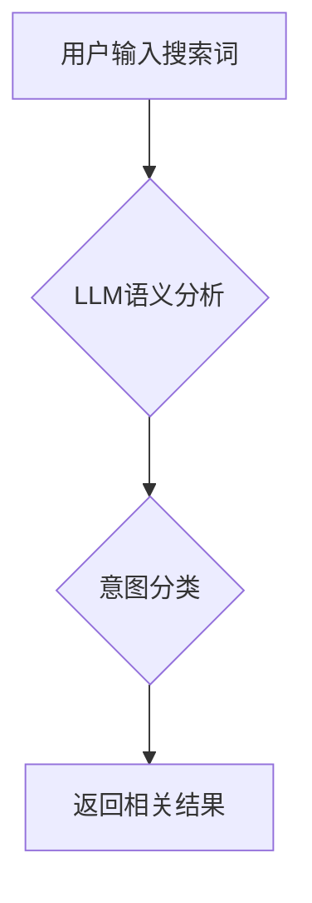

                 

## 搜索意图识别：大模型的语义理解突破

> 关键词：搜索意图识别、大语言模型、自然语言理解、语义分析、信息检索、推荐系统

## 1. 背景介绍

在信息爆炸的时代，人们通过搜索引擎获取信息的需求日益增长。搜索引擎的核心功能是理解用户搜索的意图，并返回最相关的结果。搜索意图识别（Search Intent Recognition，SIR）作为信息检索的关键环节，旨在准确识别用户搜索背后的真实需求，例如查找信息、比较产品、完成任务等。传统的搜索意图识别方法主要依赖于关键词匹配和规则匹配，但这些方法难以捕捉用户搜索的复杂语义，识别率有限。

近年来，随着深度学习技术的快速发展，大语言模型（Large Language Model，LLM）的出现为搜索意图识别带来了新的突破。LLM拥有强大的语义理解能力，能够从文本中提取丰富的语义信息，并进行复杂的逻辑推理。利用LLM的优势，搜索意图识别取得了显著的进展，识别精度大幅提升，能够更准确地理解用户的搜索意图。

## 2. 核心概念与联系

**2.1 搜索意图的概念**

搜索意图是指用户在输入搜索词时，想要获取的信息或完成的任务。它可以分为以下几种类型：

* **信息搜索意图:** 用户想要获取特定主题的信息，例如“中国历史”，“人工智能发展”。
* **导航搜索意图:** 用户想要访问特定网站或页面，例如“百度首页”，“淘宝网”。
* **交易搜索意图:** 用户想要购买商品或服务，例如“手机价格”，“订机票”。
* **品牌搜索意图:** 用户想要了解特定品牌的详细信息，例如“苹果公司”，“华为手机”。

**2.2 大语言模型的概念**

大语言模型是一种基于深度学习的强大人工智能模型，能够理解和生成人类语言。它通过训练大量的文本数据，学习语言的语法、语义和上下文关系。常见的LLM模型包括GPT-3、BERT、LaMDA等。

**2.3 核心概念联系**

LLM能够通过其强大的语义理解能力，从用户的搜索词中提取丰富的语义信息，并根据上下文关系判断用户的搜索意图。例如，对于搜索词“苹果手机”，LLM可以识别出用户的意图是“交易搜索意图”，因为用户可能想要购买苹果手机。

**2.4  Mermaid 流程图**



## 3. 核心算法原理 & 具体操作步骤

**3.1 算法原理概述**

搜索意图识别算法通常基于以下核心原理：

* **文本表示:** 将用户搜索词转换为机器可理解的向量表示，例如Word2Vec、GloVe等词嵌入模型。
* **特征提取:** 从文本向量中提取语义特征，例如关键词、词性、依存关系等。
* **分类模型:** 利用机器学习模型，例如支持向量机、随机森林、深度神经网络等，对提取的特征进行分类，识别用户的搜索意图。

**3.2 算法步骤详解**

1. **数据预处理:** 对用户搜索词进行清洗、分词、去停用词等预处理操作，去除无关信息，提取关键语义。
2. **文本表示:** 使用词嵌入模型将预处理后的搜索词转换为向量表示，每个词对应一个稠密的向量，向量维度通常为100-300。
3. **特征提取:** 从词向量中提取语义特征，例如关键词、词性、依存关系等。可以使用TF-IDF、WordNet等方法提取关键词，可以使用词性标注模型提取词性信息，可以使用依存句法分析模型提取依存关系信息。
4. **分类模型训练:** 将提取的特征作为输入，使用机器学习模型进行训练，例如支持向量机、随机森林、深度神经网络等。训练过程中，需要使用标注好的搜索意图数据，将搜索词与对应的意图进行匹配，训练模型识别不同意图的特征。
5. **意图预测:** 将新的用户搜索词输入到训练好的分类模型中，模型根据输入的特征进行预测，输出用户的搜索意图。

**3.3 算法优缺点**

**优点:**

* 能够识别多种类型的搜索意图。
* 识别精度较高，能够准确理解用户的搜索需求。
* 可以根据用户的搜索历史和行为特征进行个性化推荐。

**缺点:**

* 需要大量的标注数据进行训练，数据标注成本较高。
* 对长尾关键词的识别能力有限。
* 难以捕捉用户搜索的隐含意图。

**3.4 算法应用领域**

* 搜索引擎优化 (SEO)
* 信息检索
* 个性化推荐系统
* 自然语言处理 (NLP)
* 聊天机器人

## 4. 数学模型和公式 & 详细讲解 & 举例说明

**4.1 数学模型构建**

搜索意图识别算法通常使用分类模型进行预测，例如逻辑回归、支持向量机、神经网络等。这些模型可以表示为以下形式：

$$
y = f(x; \theta)
$$

其中：

* $y$ 是预测的搜索意图类别。
* $x$ 是用户的搜索词特征向量。
* $f$ 是分类函数。
* $\theta$ 是模型参数。

**4.2 公式推导过程**

具体的分类函数和参数推导过程取决于选择的模型类型。例如，逻辑回归模型的分类函数为：

$$
f(x; \theta) = \frac{1}{1 + e^{-(w^T x + b)}}
$$

其中：

* $w$ 是权重向量。
* $b$ 是偏置项。

参数 $\theta = (w, b)$ 可以通过最大似然估计或梯度下降等方法进行优化。

**4.3 案例分析与讲解**

假设我们使用逻辑回归模型进行搜索意图识别，训练数据包含以下信息：

* 搜索词： “苹果手机”，“华为手机”，“天气预报”，“百度首页”
* 搜索意图： “交易搜索”，“交易搜索”，“信息搜索”，“导航搜索”

训练完成后，模型可以根据用户的搜索词预测其搜索意图。例如，对于搜索词 “小米手机”，模型可能会预测其搜索意图为 “交易搜索”。

## 5. 项目实践：代码实例和详细解释说明

**5.1 开发环境搭建**

* Python 3.6+
* TensorFlow/PyTorch
* NLTK/SpaCy

**5.2 源代码详细实现**

```python
import tensorflow as tf
from tensorflow.keras.models import Sequential
from tensorflow.keras.layers import Embedding, LSTM, Dense

# 数据预处理
# ...

# 模型构建
model = Sequential()
model.add(Embedding(input_dim=vocab_size, output_dim=embedding_dim, input_length=max_length))
model.add(LSTM(units=128))
model.add(Dense(units=num_classes, activation='softmax'))

# 模型编译
model.compile(loss='sparse_categorical_crossentropy', optimizer='adam', metrics=['accuracy'])

# 模型训练
model.fit(x_train, y_train, epochs=10, batch_size=32)

# 模型评估
loss, accuracy = model.evaluate(x_test, y_test)
print('Loss:', loss)
print('Accuracy:', accuracy)

# 模型预测
predictions = model.predict(x_new)
```

**5.3 代码解读与分析**

* 代码首先定义了模型的结构，包括嵌入层、LSTM层和全连接层。
* 嵌入层将词向量转换为稠密的向量表示。
* LSTM层能够捕捉文本序列中的长距离依赖关系。
* 全连接层将LSTM层的输出进行分类。
* 代码然后编译了模型，指定了损失函数、优化器和评价指标。
* 模型训练完成后，可以使用测试数据评估模型的性能。
* 最后，可以使用训练好的模型对新的用户搜索词进行预测。

**5.4 运行结果展示**

运行代码后，可以得到模型的训练损失、准确率以及对新数据进行预测的结果。

## 6. 实际应用场景

**6.1 搜索引擎优化 (SEO)**

搜索意图识别可以帮助网站优化其内容，以满足用户的搜索需求。例如，如果用户的搜索意图是“信息搜索”，网站可以提供详细的解释和信息；如果用户的搜索意图是“交易搜索”，网站可以提供产品信息和购买链接。

**6.2 信息检索**

搜索意图识别可以提高信息检索的准确性。例如，在学术搜索引擎中，可以根据用户的搜索意图，返回与用户需求更相关的论文。

**6.3 个性化推荐系统**

搜索意图识别可以帮助推荐系统提供更个性化的推荐。例如，电商平台可以根据用户的搜索意图，推荐相关的商品。

**6.4 自然语言处理 (NLP)**

搜索意图识别是自然语言处理的一个重要任务，可以应用于各种NLP应用场景，例如聊天机器人、问答系统、文本摘要等。

**6.5 未来应用展望**

随着大语言模型的不断发展，搜索意图识别将有更广泛的应用场景。例如，可以用于虚拟助手、智能家居、自动驾驶等领域。

## 7. 工具和资源推荐

**7.1 学习资源推荐**

* **书籍:**

    * 《深度学习》 by Ian Goodfellow, Yoshua Bengio, Aaron Courville
    * 《自然语言处理》 by Dan Jurafsky, James H. Martin

* **在线课程:**

    * Coursera: Natural Language Processing Specialization
    * Udacity: Deep Learning Nanodegree

**7.2 开发工具推荐**

* **TensorFlow:** https://www.tensorflow.org/
* **PyTorch:** https://pytorch.org/
* **NLTK:** https://www.nltk.org/
* **SpaCy:** https://spacy.io/

**7.3 相关论文推荐**

* BERT: Pre-training of Deep Bidirectional Transformers for Language Understanding
* GPT-3: Language Models are Few-Shot Learners
* XLNet: Generalized Autoregressive Pretraining for Language Understanding

## 8. 总结：未来发展趋势与挑战

**8.1 研究成果总结**

大语言模型的出现为搜索意图识别带来了新的突破，识别精度大幅提升。

**8.2 未来发展趋势**

* **更强大的大语言模型:** 未来将会有更强大的大语言模型出现，能够更好地理解用户的搜索意图。
* **跨模态搜索意图识别:** 将文本、图像、音频等多模态信息融合，实现更全面的搜索意图识别。
* **个性化搜索意图识别:** 基于用户的搜索历史、行为特征等信息，提供更个性化的搜索结果。

**8.3 面临的挑战**

* **数据标注成本:** 大规模标注数据仍然是搜索意图识别的一个挑战。
* **长尾关键词识别:** 对于长尾关键词的识别能力仍然有限。
* **隐含意图识别:** 难以捕捉用户搜索的隐含意图。

**8.4 研究展望**

未来研究将继续探索更有效的搜索意图识别算法，提高识别精度，并扩展到更多应用场景。


## 9. 附录：常见问题与解答

**9.1 如何选择合适的搜索意图识别算法？**

选择合适的算法取决于具体的应用场景和数据特点。例如，对于文本数据量较少的情况，可以使用规则匹配或基于机器学习的分类模型；对于文本数据量较多且语义复杂的情况，可以使用基于深度学习的模型，例如BERT、GPT等。

**9.2 如何进行数据标注？**

数据标注是搜索意图识别训练的关键步骤。可以采用人工标注、自动标注或混合标注的方式。人工标注需要专业人员进行标注，成本较高；自动标注可以使用规则或机器学习模型进行标注，效率较高但准确率可能较低；混合标注可以结合人工标注和自动标注，提高标注效率和准确率。

**9.3 如何评估搜索意图识别模型的性能？**

常用的评估指标包括准确率、召回率、F1-score等。准确率是指模型正确预测的搜索意图数量占总预测数量的比例；召回率是指模型预测出的所有正确搜索意图数量占所有真实搜索意图数量的比例；F1-score是准确率和召回率的调和平均值。

作者：禅与计算机程序设计艺术 / Zen and the Art of Computer Programming 


<end_of_turn>

