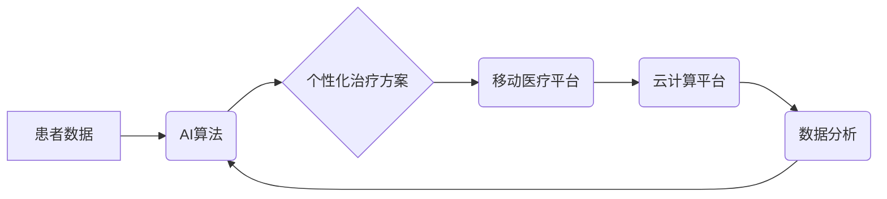

                 

## 数字疗法创业：科技驱动的健康管理

> 关键词：数字疗法、人工智能、健康管理、机器学习、数据分析、移动医疗、远程医疗、个性化医疗

### 1. 背景介绍

随着科技的飞速发展，人工智能、大数据、云计算等技术日益成熟，为数字疗法的兴起提供了强有力的技术支撑。数字疗法，是指利用数字技术，如移动应用程序、人工智能算法、虚拟现实等，提供预防、诊断、治疗和管理疾病的医疗服务。它以其便捷性、个性化和可及性，正在逐渐改变传统的医疗模式，成为未来医疗发展的重要趋势。

数字疗法创业是一个充满机遇和挑战的领域。一方面，全球范围内慢性病的患病率不断上升，对医疗资源的需求日益增长，数字疗法可以有效缓解医疗压力，提高医疗效率。另一方面，数字疗法还面临着技术、监管、伦理等方面的挑战，需要不断探索和解决。

### 2. 核心概念与联系

数字疗法的核心概念包括：

* **人工智能（AI）：** 数字疗法广泛应用于人工智能技术，例如机器学习、深度学习等，用于分析患者数据，预测疾病风险，提供个性化治疗方案。
* **大数据分析：** 数字疗法收集和分析海量患者数据，例如医疗记录、生活习惯、基因信息等，从中挖掘疾病规律，提高诊断和治疗的准确性。
* **移动医疗：** 数字疗法利用移动设备，如智能手机、平板电脑等，提供便捷的医疗服务，例如远程咨询、健康监测、药物提醒等。
* **云计算：** 数字疗法利用云计算平台存储和处理海量数据，提高数据安全性和可访问性。

**核心概念架构：**



### 3. 核心算法原理 & 具体操作步骤

#### 3.1  算法原理概述

数字疗法中常用的核心算法包括：

* **机器学习：** 通过训练模型，从数据中学习规律，用于疾病预测、诊断辅助、个性化治疗方案推荐等。
* **深度学习：** 基于多层神经网络，能够处理更复杂的数据，例如图像、语音等，用于疾病诊断、药物研发等。
* **自然语言处理：** 用于处理文本数据，例如患者病历、聊天记录等，用于疾病分析、患者情绪识别等。

#### 3.2  算法步骤详解

以机器学习算法为例，其具体操作步骤如下：

1. **数据收集和预处理：** 收集相关患者数据，例如医疗记录、生活习惯、基因信息等，并进行清洗、转换、归一化等预处理操作。
2. **特征工程：** 从原始数据中提取有价值的特征，例如年龄、性别、血压、血糖等，用于训练模型。
3. **模型选择和训练：** 选择合适的机器学习算法，例如支持向量机、决策树、神经网络等，并根据训练数据进行模型训练。
4. **模型评估和优化：** 使用测试数据评估模型性能，例如准确率、召回率、F1-score等，并根据评估结果对模型进行优化。
5. **模型部署和应用：** 将训练好的模型部署到实际应用场景中，例如用于疾病预测、诊断辅助等。

#### 3.3  算法优缺点

**优点：**

* **自动化和效率提升：** 机器学习算法可以自动化处理大量数据，提高医疗诊断和治疗的效率。
* **个性化医疗：** 根据患者的个体特征，提供个性化的治疗方案，提高治疗效果。
* **降低医疗成本：** 通过预测疾病风险和辅助诊断，可以减少不必要的医疗检查和治疗，降低医疗成本。

**缺点：**

* **数据依赖性：** 机器学习算法需要大量高质量的数据进行训练，数据质量直接影响模型性能。
* **算法解释性：** 一些深度学习算法的决策过程难以解释，缺乏透明度。
* **伦理和安全问题：** 数字疗法涉及患者隐私和数据安全，需要严格的伦理和安全保障措施。

#### 3.4  算法应用领域

数字疗法算法广泛应用于以下领域：

* **疾病预测和预防：** 利用患者数据预测疾病风险，提供个性化预防建议。
* **疾病诊断辅助：** 辅助医生进行疾病诊断，提高诊断准确率。
* **个性化治疗方案推荐：** 根据患者的个体特征，推荐个性化的治疗方案。
* **药物研发：** 利用机器学习算法加速药物研发过程。
* **远程医疗：** 提供远程咨询、健康监测、药物提醒等服务。

### 4. 数学模型和公式 & 详细讲解 & 举例说明

#### 4.1  数学模型构建

数字疗法中常用的数学模型包括：

* **线性回归模型：** 用于预测连续变量，例如患者血压、血糖等。
* **逻辑回归模型：** 用于预测分类变量，例如患者是否患有某种疾病。
* **支持向量机模型：** 用于分类和回归问题，能够处理高维数据。
* **神经网络模型：** 用于处理复杂数据，例如图像、语音等，能够学习非线性关系。

#### 4.2  公式推导过程

以线性回归模型为例，其目标是找到一条直线，使得预测值与实际值之间的误差最小。

**公式：**

$$y = \beta_0 + \beta_1x + \epsilon$$

其中：

* $y$ 是预测值
* $x$ 是输入特征
* $\beta_0$ 是截距
* $\beta_1$ 是斜率
* $\epsilon$ 是误差项

**损失函数：**

$$J(\beta_0, \beta_1) = \frac{1}{n}\sum_{i=1}^{n}(y_i - \hat{y}_i)^2$$

其中：

* $n$ 是样本数量
* $y_i$ 是实际值
* $\hat{y}_i$ 是预测值

**梯度下降算法：**

通过迭代更新 $\beta_0$ 和 $\beta_1$ 的值，使得损失函数最小化。

#### 4.3  案例分析与讲解

假设我们想要预测患者的血压值，可以使用线性回归模型。

* **数据：** 收集患者的年龄、性别、体重等特征数据以及对应的血压值。
* **模型训练：** 使用梯度下降算法训练线性回归模型，找到最佳的 $\beta_0$ 和 $\beta_1$ 值。
* **模型评估：** 使用测试数据评估模型性能，例如计算预测值的均方误差。
* **应用：** 将训练好的模型应用于新的患者数据，预测其血压值。

### 5. 项目实践：代码实例和详细解释说明

#### 5.1  开发环境搭建

* **操作系统：** Windows、macOS、Linux
* **编程语言：** Python
* **机器学习库：** scikit-learn、TensorFlow、PyTorch
* **数据分析库：** Pandas、NumPy
* **云计算平台：** AWS、Azure、GCP

#### 5.2  源代码详细实现

```python
import pandas as pd
from sklearn.linear_model import LinearRegression

# 加载数据
data = pd.read_csv('patient_data.csv')

# 提取特征和目标变量
X = data[['age', 'gender', 'weight']]
y = data['blood_pressure']

# 创建线性回归模型
model = LinearRegression()

# 训练模型
model.fit(X, y)

# 预测血压值
new_patient_data = pd.DataFrame({'age': [30], 'gender': [0], 'weight': [70]})
predicted_blood_pressure = model.predict(new_patient_data)

# 打印预测结果
print(f'Predicted blood pressure: {predicted_blood_pressure[0]}')
```

#### 5.3  代码解读与分析

* **数据加载：** 使用 Pandas 库加载患者数据。
* **特征和目标变量提取：** 提取用于预测血压值的特征和目标变量。
* **模型创建：** 使用 scikit-learn 库创建线性回归模型。
* **模型训练：** 使用训练数据训练模型，找到最佳的模型参数。
* **模型预测：** 使用训练好的模型预测新的患者的血压值。

#### 5.4  运行结果展示

运行代码后，将输出预测的血压值。

### 6. 实际应用场景

数字疗法在以下场景中得到广泛应用：

* **慢性病管理：** 为糖尿病、高血压、心血管疾病等慢性病患者提供远程监测、个性化治疗方案和生活方式指导。
* **心理健康服务：** 提供心理咨询、情绪管理、压力缓解等服务，帮助患者改善心理健康状况。
* **康复治疗：** 为患者提供个性化的康复训练计划，帮助他们恢复身体功能。
* **药物研发：** 利用机器学习算法加速药物研发过程，提高药物开发效率。

#### 6.4  未来应用展望

数字疗法未来将朝着以下方向发展：

* **更精准的个性化医疗：** 利用人工智能和基因组学等技术，为患者提供更精准的个性化医疗服务。
* **更便捷的远程医疗：** 利用虚拟现实、增强现实等技术，提供更沉浸式的远程医疗服务。
* **更智能的医疗设备：** 开发更智能的医疗设备，例如智能血糖仪、智能血压计等，为患者提供更便捷的健康监测服务。

### 7. 工具和资源推荐

#### 7.1  学习资源推荐

* **在线课程：** Coursera、edX、Udacity 等平台提供人工智能、机器学习、数据分析等方面的在线课程。
* **书籍：** 《深度学习》、《机器学习实战》、《Python数据科学手册》等书籍。
* **博客和论坛：** 机器学习社区、Kaggle 等平台提供丰富的学习资源和讨论论坛。

#### 7.2  开发工具推荐

* **编程语言：** Python、R
* **机器学习库：** scikit-learn、TensorFlow、PyTorch
* **数据分析库：** Pandas、NumPy
* **云计算平台：** AWS、Azure、GCP

#### 7.3  相关论文推荐

* **深度学习在医疗领域的应用：** 《Deep Learning in Healthcare: A Comprehensive Review》
* **机器学习在疾病预测中的应用：** 《Machine Learning for Disease Prediction: A Review》
* **数字疗法对医疗保健的影响：** 《The Impact of Digital Therapeutics on Healthcare》

### 8. 总结：未来发展趋势与挑战

#### 8.1  研究成果总结

数字疗法在医疗保健领域取得了显著的进展，为患者提供更便捷、更个性化的医疗服务。

#### 8.2  未来发展趋势

数字疗法将朝着更精准、更智能、更便捷的方向发展，并与其他医疗技术融合，例如基因组学、生物信息学等，为患者提供更全面的医疗服务。

#### 8.3  面临的挑战

数字疗法还面临着以下挑战：

* **数据隐私和安全：** 数字疗法涉及大量患者数据，需要严格的隐私和安全保障措施。
* **算法解释性和透明度：** 一些深度学习算法的决策过程难以解释，缺乏透明度，需要进一步研究和改进。
* **监管和标准化：** 数字疗法的监管和标准化工作尚未完善，需要制定相应的政策和标准。

#### 8.4  研究展望

未来，数字疗法研究将重点关注以下方面：

* **开发更精准、更智能的算法：** 利用人工智能、机器学习等技术，开发更精准、更智能的数字疗法算法。
* **加强数据隐私和安全保障：** 研究和开发更安全的医疗数据存储和传输技术，保障患者数据隐私和安全。
* **推动数字疗法的监管和标准化：** 积极参与数字疗法的监管和标准化工作，推动数字疗法的健康发展。

### 9. 附录：常见问题与解答

**Q1：数字疗法是否可以替代传统医疗？**

**A1：** 数字疗法可以补充和辅助传统医疗，但不能完全替代传统医疗。数字疗法更适合于慢性病管理、心理健康服务等领域，而对于急症、手术等需要专业医师介入的疾病，仍然需要依靠传统医疗。

**Q2：数字疗法是否安全可靠？**

**A2：** 数字疗法的安全性取决于算法的准确性、数据的质量以及平台的安全性。选择信誉良好的数字疗法平台，并严格遵守平台的使用规则，可以提高安全性。

**Q3：数字疗法是否适用于所有人？**

**A3：** 数字疗法并非适用于所有人，例如对于认知障碍、语言障碍等患者，数字疗法可能不适用。在使用数字疗法之前，建议咨询医生。


作者：禅与计算机程序设计艺术 / Zen and the Art of Computer Programming 
<end_of_turn>

