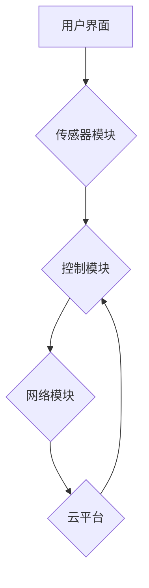

                 

## 智能家居温控创业：精准舒适的居住环境

> 关键词：智能家居、温控系统、机器学习、预测建模、算法优化、用户体验、物联网、数据分析

## 1. 背景介绍

随着科技的飞速发展，智能家居已成为现代生活的重要趋势。其中，智能温控系统作为智能家居的核心应用之一，凭借其能够精准控制室内温度，提升居住舒适度和节能环保的优势，备受关注。

传统温控系统通常采用定时开关或手动调节的方式，存在着温度波动大、能源浪费严重等问题。而智能温控系统则通过传感器、云计算、机器学习等技术，实现对室内温度的实时监测和智能控制，能够根据用户的需求和环境变化，自动调节温度，提供更加舒适、便捷、节能的居住体验。

## 2. 核心概念与联系

智能家居温控系统主要由以下几个核心模块组成：

* **传感器模块:** 用于实时监测室内温度、湿度、光照等环境参数。常见的传感器包括温度传感器、湿度传感器、光照传感器等。
* **控制模块:** 根据传感器采集的数据，通过算法进行分析和决策，控制加热、制冷设备的开关和运行状态。
* **网络模块:** 用于将传感器数据和控制指令传输到云端平台，实现远程控制和数据分析。
* **云平台:** 提供数据存储、分析、处理和用户交互等功能，支持远程控制、智能调度和个性化定制。
* **用户界面:** 用于用户查看实时温度、设置温控方案、远程控制设备等。

**核心概念原理和架构的 Mermaid 流程图:**



## 3. 核心算法原理 & 具体操作步骤

### 3.1  算法原理概述

智能家居温控系统的核心算法主要包括：

* **预测建模:** 利用历史温度数据和环境参数，预测未来室内温度变化趋势，以便提前调整设备运行状态。常用的预测模型包括线性回归、ARIMA模型、神经网络等。
* **温度控制策略:** 根据预测结果和用户设定，制定合适的温度控制策略，例如：恒温控制、节能控制、舒适控制等。
* **设备调度:** 根据控制策略，协调加热、制冷设备的运行，实现精准的温度控制。

### 3.2  算法步骤详解

**预测建模步骤:**

1. **数据采集:** 收集历史室内温度数据、环境参数数据（例如：室外温度、湿度、光照等）以及用户行为数据（例如：出勤时间、睡眠时间等）。
2. **数据预处理:** 对采集到的数据进行清洗、转换、归一化等处理，去除噪声和异常值，以便于模型训练。
3. **模型选择:** 根据数据特点和预测精度要求，选择合适的预测模型，例如：线性回归、ARIMA模型、神经网络等。
4. **模型训练:** 利用预处理后的数据，训练选择的预测模型，并评估模型的预测精度。
5. **模型部署:** 将训练好的模型部署到云平台，用于实时预测未来室内温度变化趋势。

**温度控制策略步骤:**

1. **用户设定:** 用户可以通过用户界面设定目标温度、温度波动范围、节能模式等参数。
2. **预测结果融合:** 将预测模型预测的未来室内温度变化趋势与用户设定参数进行融合，得到最终的温度控制目标。
3. **控制策略制定:** 根据融合后的温度控制目标，制定相应的控制策略，例如：恒温控制、节能控制、舒适控制等。

**设备调度步骤:**

1. **设备状态监测:** 实时监测加热、制冷设备的运行状态，例如：温度、功率、运行时间等。
2. **控制指令发送:** 根据温度控制策略，向加热、制冷设备发送相应的控制指令，例如：开启、关闭、调节功率等。
3. **设备运行反馈:** 收集设备运行反馈信息，例如：温度变化、功率消耗等，并反馈到云平台进行数据分析和模型更新。

### 3.3  算法优缺点

**优点:**

* **精准控制:** 通过预测建模和智能算法，能够精准控制室内温度，实现用户设定的舒适温度。
* **节能环保:** 根据用户需求和环境变化，智能调节设备运行状态，减少能源浪费，降低能耗成本。
* **便捷舒适:** 用户可以通过手机APP或语音助手远程控制温控设备，实现更加便捷舒适的居住体验。

**缺点:**

* **数据依赖:** 预测建模算法依赖于历史数据，如果数据质量不高或数据量不足，预测精度会降低。
* **算法复杂度:** 智能算法的训练和部署需要一定的技术门槛，对硬件资源和软件平台也有较高要求。
* **网络安全:** 智能温控系统需要连接网络，存在网络安全风险，需要采取相应的安全措施。

### 3.4  算法应用领域

智能温控算法广泛应用于以下领域：

* **智能家居:** 提供精准舒适的居住环境，提升用户生活品质。
* **商业建筑:** 控制办公楼、商场等公共场所的温度，降低能耗成本，提高能源效率。
* **工业生产:** 控制工业生产环境的温度，保证生产设备的正常运行。
* **农业种植:** 控制温室环境的温度，提高作物产量和品质。

## 4. 数学模型和公式 & 详细讲解 & 举例说明

### 4.1  数学模型构建

智能温控系统的核心算法通常基于以下数学模型：

* **线性回归模型:** 用于预测室内温度变化趋势，假设温度变化与时间、环境参数呈线性关系。

$$
T(t) = a + b_1 * t + b_2 * Temp_{out} + b_3 * Humidity + ...
$$

其中：

* $T(t)$: 室内温度
* $t$: 时间
* $Temp_{out}$: 室外温度
* $Humidity$: 湿度
* $a$, $b_1$, $b_2$, $b_3$: 模型参数

* **ARIMA模型:** 用于预测时间序列数据，例如室内温度数据，假设温度变化符合一定的统计规律。

### 4.2  公式推导过程

ARIMA模型的具体推导过程较为复杂，涉及到时间序列分析、自回归、移动平均等概念。

### 4.3  案例分析与讲解

通过对历史温度数据进行ARIMA模型训练，可以得到模型参数，并预测未来室内温度变化趋势。例如，假设模型预测未来24小时内室内温度变化如下：

* 0点: 22℃
* 1点: 21.5℃
* 2点: 21℃
* ...
* 23点: 22.5℃

根据预测结果，智能温控系统可以提前调节设备运行状态，确保室内温度在用户设定的范围内波动。

## 5. 项目实践：代码实例和详细解释说明

### 5.1  开发环境搭建

智能家居温控系统开发环境通常包括：

* **硬件平台:** 基于ARM或x86架构的微控制器或嵌入式系统，用于控制温控设备。
* **软件平台:** 基于Linux或Android的操作系统，用于运行应用程序和数据处理。
* **云平台:** 提供数据存储、分析、处理和用户交互等功能的云服务平台，例如：AWS、Azure、阿里云等。

### 5.2  源代码详细实现

以下是一个简单的Python代码示例，用于实现基于线性回归模型的室内温度预测：

```python
import pandas as pd
from sklearn.linear_model import LinearRegression

# 加载历史温度数据
data = pd.read_csv('temperature_data.csv')

# 选择特征变量和目标变量
X = data[['Time', 'Temp_out', 'Humidity']]
y = data['Temp_in']

# 创建线性回归模型
model = LinearRegression()

# 训练模型
model.fit(X, y)

# 预测未来温度
future_data = pd.DataFrame({'Time': [24], 'Temp_out': [25], 'Humidity': [60]})
predicted_temp = model.predict(future_data)

# 打印预测结果
print(f'预测的未来温度: {predicted_temp[0]}℃')
```

### 5.3  代码解读与分析

* 该代码首先加载历史温度数据，并选择时间、室外温度、湿度作为特征变量，室内温度作为目标变量。
* 然后创建线性回归模型，并使用训练数据训练模型。
* 最后，利用训练好的模型预测未来温度，并打印预测结果。

### 5.4  运行结果展示

运行该代码后，会输出预测的未来室内温度值。

## 6. 实际应用场景

智能家居温控系统已广泛应用于以下场景：

* **住宅:** 通过智能温控系统，用户可以根据自己的需求和习惯，设定不同的温度方案，例如：白天工作时保持舒适温度，晚上睡觉时降低温度，节约能源。
* **酒店:** 智能温控系统可以根据房间入住情况，自动调节温度，提供更加舒适的入住体验。
* **办公楼:** 智能温控系统可以根据办公楼的实际使用情况，优化温度控制策略，降低能耗成本。

### 6.4  未来应用展望

未来，智能家居温控系统将更加智能化、个性化和融合化。

* **更精准的预测:** 利用更先进的机器学习算法，例如深度学习，实现更加精准的温度预测。
* **更个性化的定制:** 根据用户的行为习惯和喜好，提供更加个性化的温度控制方案。
* **更强大的融合功能:** 与其他智能家居设备，例如灯光、窗帘等，实现更加智能的场景联动。

## 7. 工具和资源推荐

### 7.1  学习资源推荐

* **书籍:**
    * 《机器学习》 - 周志华
    * 《深度学习》 - Ian Goodfellow
* **在线课程:**
    * Coursera: Machine Learning
    * edX: Artificial Intelligence
* **开源项目:**
    * TensorFlow
    * PyTorch

### 7.2  开发工具推荐

* **编程语言:** Python
* **机器学习库:** scikit-learn, TensorFlow, PyTorch
* **云平台:** AWS, Azure, 阿里云

### 7.3  相关论文推荐

* **论文标题:** A Survey of Smart Home Temperature Control Systems
* **作者:** [作者姓名]
* **期刊:** [期刊名称]

## 8. 总结：未来发展趋势与挑战

### 8.1  研究成果总结

智能家居温控系统已取得了显著的成果，能够精准控制室内温度，提升居住舒适度和节能环保效果。

### 8.2  未来发展趋势

未来，智能家居温控系统将朝着更加智能化、个性化和融合化的方向发展。

### 8.3  面临的挑战

智能家居温控系统还面临着一些挑战，例如：

* **数据安全:** 用户隐私数据安全需要得到保障。
* **算法鲁棒性:** 算法需要能够应对各种环境变化和用户行为，提高鲁棒性。
* **成本控制:** 需要降低智能温控系统的成本，使其更加普及。

### 8.4  研究展望

未来，需要进一步研究以下方面：

* **更先进的预测算法:** 开发更加精准、高效的温度预测算法。
* **更个性化的用户体验:** 基于用户行为和喜好，提供更加个性化的温度控制方案。
* **更强大的场景联动:** 与其他智能家居设备实现更加智能的场景联动。

## 9. 附录：常见问题与解答

* **Q1: 智能温控系统如何保证数据安全？**

* **A1:** 智能温控系统通常采用加密传输和数据脱敏等技术，保障用户隐私数据安全。

* **Q2: 智能温控系统是否容易被黑客攻击？**

* **A2:** 智能温控系统需要采取相应的安全措施，例如：防火墙、入侵检测系统等，降低被黑客攻击的风险。

* **Q3: 智能温控系统是否需要专业人员安装？**

* **A3:** 一些简单的智能温控系统可以用户自行安装，而复杂的系统则需要专业人员进行安装和调试。


作者：禅与计算机程序设计艺术 / Zen and the Art of Computer Programming 
<end_of_turn>

