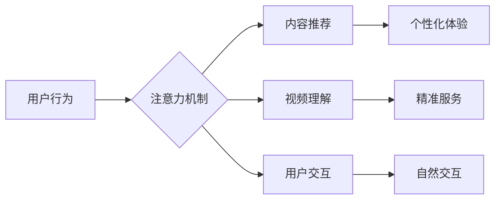

                 

## 智能电视：客厅场景下的注意力之争

> 关键词：智能电视、注意力机制、自然语言处理、计算机视觉、深度学习、用户体验、客厅场景

## 1. 背景介绍

智能电视已成为现代家庭娱乐中心的重要组成部分，其功能不断升级，从简单的视频播放扩展到联网、语音控制、游戏、智能家居控制等。然而，随着功能的丰富，智能电视也面临着新的挑战：如何更好地理解用户的需求，提供个性化和沉浸式的体验，并有效地应对客厅场景中复杂的注意力分配问题。

传统电视的模式是单向的，内容提供者决定了用户观看的内容。而智能电视则试图打破这种模式，通过人工智能技术，实现更智能的交互和内容推荐，从而更好地满足用户的个性化需求。

然而，客厅场景是一个充满干扰的复杂环境。用户可能同时进行多种活动，例如观看电视、聊天、玩游戏、使用手机等。在这种情况下，如何有效地吸引用户的注意力，并引导他们专注于电视内容，成为智能电视发展的重要课题。

## 2. 核心概念与联系

### 2.1 注意力机制

注意力机制是近年来深度学习领域取得的重要突破，它能够模拟人类大脑对重要信息进行聚焦的机制。在智能电视领域，注意力机制可以用于以下几个方面：

* **内容推荐:** 通过分析用户的观看历史、偏好和行为，智能电视可以利用注意力机制，推荐更符合用户兴趣的内容。
* **视频理解:** 注意力机制可以帮助智能电视更好地理解视频内容，例如识别人物、场景、事件等，从而提供更精准的字幕、语音描述和互动体验。
* **用户交互:** 智能电视可以通过注意力机制，识别用户的视线和手势，从而实现更自然、更直观的交互方式。

### 2.2  客厅场景分析

客厅场景是一个复杂的多模态环境，包含了视觉、音频、触觉等多种信息。智能电视需要能够理解和处理这些信息，才能更好地服务于用户。

* **视觉信息:** 客厅场景中包含了各种物体、人物、灯光等视觉信息。智能电视需要能够识别这些信息，并将其与用户行为和上下文信息结合起来，才能提供更精准的交互和服务。
* **音频信息:** 客厅场景中包含了各种声音，例如电视声音、音乐、对话等。智能电视需要能够识别这些声音，并将其与用户行为和上下文信息结合起来，才能提供更个性化的体验。
* **触觉信息:** 用户在客厅场景中可能通过遥控器、手势等方式与智能电视进行交互。智能电视需要能够识别这些触觉信息，并将其与其他信息结合起来，才能提供更自然、更直观的交互体验。

### 2.3  注意力机制与客厅场景的结合

注意力机制可以帮助智能电视更好地理解和处理客厅场景中的复杂信息，从而提供更个性化、更沉浸式的体验。

* **内容推荐:** 通过分析用户的观看历史、偏好和行为，智能电视可以利用注意力机制，推荐更符合用户兴趣的内容。例如，如果用户经常观看体育节目，智能电视可以利用注意力机制，识别用户观看体育节目的时间段和内容，并推荐相关的体育赛事和新闻。
* **视频理解:** 注意力机制可以帮助智能电视更好地理解视频内容，例如识别人物、场景、事件等，从而提供更精准的字幕、语音描述和互动体验。例如，如果用户观看一部电影，智能电视可以利用注意力机制，识别电影中的重要人物和情节，并提供相应的字幕和语音描述。
* **用户交互:** 智能电视可以通过注意力机制，识别用户的视线和手势，从而实现更自然、更直观的交互方式。例如，用户可以通过视线选择菜单项，通过手势控制视频播放等。

**Mermaid 流程图**



## 3. 核心算法原理 & 具体操作步骤

### 3.1  算法原理概述

注意力机制的核心思想是，在处理信息时，将重点关注与任务相关的部分，而忽略无关的部分。这与人类大脑的注意力机制类似，我们也倾向于关注与当前任务相关的信息，而忽略无关的信息。

在深度学习领域，注意力机制通常通过一个注意力权重来实现。注意力权重是一个数值，表示对某个信息单元的关注程度。注意力权重通常通过一个可学习的参数来计算，通过训练模型，让注意力权重能够更好地反映与任务相关的关键信息。

### 3.2  算法步骤详解

1. **输入数据:** 将需要处理的信息作为输入数据，例如视频帧、文本句子等。
2. **特征提取:** 使用深度学习模型提取输入数据的特征，例如卷积神经网络 (CNN) 用于提取图像特征，循环神经网络 (RNN) 用于提取文本特征。
3. **注意力计算:** 计算每个信息单元的注意力权重，可以使用多种注意力机制，例如自注意力机制、位置注意力机制等。
4. **加权求和:** 将特征与注意力权重相乘，然后求和，得到最终的输出。

### 3.3  算法优缺点

**优点:**

* **提高模型性能:** 注意力机制可以帮助模型更好地理解和处理复杂信息，从而提高模型的性能。
* **可解释性增强:** 注意力权重可以反映模型对哪些信息更加关注，从而提高模型的可解释性。
* **处理长序列数据:** 注意力机制可以有效地处理长序列数据，例如文本和视频。

**缺点:**

* **计算复杂度高:** 注意力机制的计算复杂度较高，需要更多的计算资源。
* **参数量大:** 注意力机制通常需要更多的参数，这可能会导致模型训练时间更长。

### 3.4  算法应用领域

注意力机制在深度学习领域有着广泛的应用，例如：

* **自然语言处理:** 机器翻译、文本摘要、问答系统等。
* **计算机视觉:** 图像识别、目标检测、视频理解等。
* **语音识别:** 语音转文本、语音合成等。

## 4. 数学模型和公式 & 详细讲解 & 举例说明

### 4.1  数学模型构建

注意力机制的数学模型通常基于一个加权求和的操作。假设我们有一个输入序列 $X = \{x_1, x_2, ..., x_n\}$，每个元素 $x_i$ 代表一个信息单元。我们希望计算每个信息单元的注意力权重 $a_i$，然后将这些权重与对应的特征向量相乘，求和得到最终的输出 $O$。

数学模型可以表示为：

$$O = \sum_{i=1}^{n} a_i * x_i$$

其中，$a_i$ 是信息单元 $x_i$ 的注意力权重，满足以下条件：

$$0 \leq a_i \leq 1$$

$$\sum_{i=1}^{n} a_i = 1$$

### 4.2  公式推导过程

注意力权重 $a_i$ 的计算方法有很多种，其中一种常用的方法是基于一个得分函数 $s(x_i, h)$，该函数计算信息单元 $x_i$ 与一个隐藏状态 $h$ 之间的相关性。

$$a_i = \frac{exp(s(x_i, h))}{\sum_{j=1}^{n} exp(s(x_j, h))}$$

其中，$s(x_i, h)$ 可以是一个简单的点积或内积，也可以是一个更复杂的函数，例如多层感知机 (MLP)。

### 4.3  案例分析与讲解

假设我们有一个文本序列 $X = \{“我”, “喜欢”, “编程”\}$，我们希望计算每个单词的注意力权重，然后将这些权重与对应的词向量相乘，求和得到最终的文本表示。

我们可以使用一个简单的点积作为得分函数，计算每个单词与隐藏状态之间的相关性。然后，我们可以使用softmax函数将得分转换为注意力权重。

最终的文本表示可以表示为：

$$O = a_1 * v_1 + a_2 * v_2 + a_3 * v_3$$

其中，$v_1$, $v_2$, $v_3$ 是单词 “我”, “喜欢”, “编程” 的词向量，$a_1$, $a_2$, $a_3$ 是对应的注意力权重。

## 5. 项目实践：代码实例和详细解释说明

### 5.1  开发环境搭建

* **操作系统:** Ubuntu 20.04 LTS
* **编程语言:** Python 3.8
* **深度学习框架:** TensorFlow 2.0
* **其他工具:** Jupyter Notebook, Git

### 5.2  源代码详细实现

```python
import tensorflow as tf

# 定义注意力机制
def attention_layer(inputs, hidden_state):
    # 计算得分
    scores = tf.matmul(inputs, hidden_state, transpose_b=True)
    # 使用softmax函数计算注意力权重
    attention_weights = tf.nn.softmax(scores, axis=-1)
    # 将注意力权重与输入相乘，得到加权求和
    context_vector = tf.matmul(attention_weights, inputs)
    return context_vector, attention_weights

# 定义模型
class AttentionModel(tf.keras.Model):
    def __init__(self, vocab_size, embedding_dim, hidden_dim):
        super(AttentionModel, self).__init__()
        self.embedding = tf.keras.layers.Embedding(vocab_size, embedding_dim)
        self.lstm = tf.keras.layers.LSTM(hidden_dim)
        self.attention_layer = attention_layer

    def call(self, inputs):
        # 将输入转换为词向量
        embedded_inputs = self.embedding(inputs)
        # 使用LSTM编码输入
        encoded_inputs = self.lstm(embedded_inputs)
        # 使用注意力机制计算上下文向量
        context_vector, attention_weights = self.attention_layer(embedded_inputs, encoded_inputs)
        return context_vector, attention_weights

# 实例化模型
model = AttentionModel(vocab_size=10000, embedding_dim=128, hidden_dim=256)

# 训练模型
# ...

```

### 5.3  代码解读与分析

* **注意力层:** `attention_layer` 函数实现了一个简单的注意力机制，计算每个单词与隐藏状态之间的相关性，然后使用softmax函数将得分转换为注意力权重。
* **模型:** `AttentionModel` 类定义了一个简单的注意力机制模型，包含嵌入层、LSTM层和注意力层。
* **训练模型:** 训练模型的过程需要使用训练数据，并使用优化器和损失函数进行训练。

### 5.4  运行结果展示

训练完成后，我们可以使用模型对新的文本进行预测，并观察注意力权重分布，从而了解模型对哪些单词更加关注。

## 6. 实际应用场景

### 6.1  智能电视内容推荐

智能电视可以通过分析用户的观看历史、偏好和行为，利用注意力机制，推荐更符合用户兴趣的内容。例如，如果用户经常观看体育节目，智能电视可以利用注意力机制，识别用户观看体育节目的时间段和内容，并推荐相关的体育赛事和新闻。

### 6.2  个性化视频体验

智能电视可以通过注意力机制，根据用户的观看习惯和偏好，动态调整视频的字幕、语音描述和画面质量，提供更个性化的观看体验。例如，如果用户对剧情细节比较感兴趣，智能电视可以利用注意力机制，突出重点情节的字幕和语音描述。

### 6.3  智能家居控制

智能电视可以通过注意力机制，识别用户的语音指令和手势，从而实现更自然、更直观的智能家居控制。例如，用户可以通过语音指令控制电视音量、亮度和频道，也可以通过手势控制电视播放暂停、快进和后退等功能。

### 6.4  未来应用展望

随着人工智能技术的不断发展，注意力机制在智能电视领域的应用将更加广泛和深入。例如，智能电视可以利用注意力机制，实现更精准的视频理解，提供更丰富的互动体验，甚至可以根据用户的注意力分布，动态调整电视内容的播放顺序和节奏。

## 7. 工具和资源推荐

### 7.1  学习资源推荐

* **书籍:**
    * 《深度学习》 - Ian Goodfellow, Yoshua Bengio, Aaron Courville
    * 《Attention Is All You Need》 - Vaswani et al.
* **在线课程:**
    * Coursera: Deep Learning Specialization
    * Udacity: Deep Learning Nanodegree

### 7.2  开发工具推荐

* **深度学习框架:** TensorFlow, PyTorch
* **编程语言:** Python
* **IDE:** VS Code, PyCharm

### 7.3  相关论文推荐

* **Attention Is All You Need:** https://arxiv.org/abs/1706.03762
* **BERT: Pre-training of Deep Bidirectional Transformers for Language Understanding:** https://arxiv.org/abs/1810.04805

## 8. 总结：未来发展趋势与挑战

### 8.1  研究成果总结

注意力机制在智能电视领域取得了显著的成果，例如：

* **内容推荐:** 注意力机制可以帮助智能电视更精准地推荐用户感兴趣的内容。
* **个性化体验:** 注意力机制可以帮助智能电视提供更个性化的视频体验。
* **智能家居控制:** 注意力机制可以帮助智能电视实现更自然、更直观的智能家居控制。

### 8.2  未来发展趋势

未来，注意力机制在智能电视领域的应用将更加广泛和深入，例如：

* **更精准的视频理解:** 注意力机制可以帮助智能电视更精准地理解视频内容，提供更丰富的互动体验。
* **动态内容调整:** 智能电视可以根据用户的注意力分布，动态调整电视内容的播放顺序和节奏。
* **跨模态交互:** 智能电视可以利用注意力机制，实现更自然、更丰富的跨模态交互，例如语音、图像、手势等。

### 8.3  面临的挑战

注意力机制在智能电视领域也面临一些挑战，例如：

* **计算复杂度:** 注意力机制的计算复杂度较高，需要更多的计算资源。
* **参数量大:** 注意力机制通常需要更多的参数，这可能会导致模型训练时间更长。
* **数据标注:** 训练注意力机制模型需要大量的标注数据，这可能会比较耗时和费力。

### 8.4  研究展望

未来，研究者将继续探索注意力机制的应用，并尝试解决其面临的挑战，例如：

* **开发更高效的注意力机制:** 研究更轻量级、更高效的注意力机制，降低计算复杂度和参数量。
* **探索新的注意力机制应用场景:** 探索注意力机制在智能电视领域的更多应用场景，例如游戏、教育、医疗等。
* **研究注意力机制与其他技术的结合:** 研究注意力机制与其他人工智能技术，例如强化学习、迁移学习等，实现更智能、更强大的智能电视应用。

## 9. 附录：常见问题与解答

### 9.1  Q: 注意力机制与传统机器学习模型有什么区别？

**A:** 传统机器学习模型通常是基于特征工程，需要人工提取特征，而注意力机制可以自动学习到重要的特征，从而提高模型的性能。

### 9.2  Q: 注意力机制的计算复杂度很高吗？

**A:** 注意力机制的计算复杂度较高，但随着硬件性能的提升和算法的优化，其计算复杂度也在不断降低。

### 9.3  Q: 注意力机制的应用场景有哪些？

**A:** 注意力机制的应用场景非常广泛，例如自然语言处理、计算机视觉、语音识别等。

### 9.4  Q: 如何训练注意力机制模型？

**A:** 训练注意力机制模型需要使用训练数据，并使用优化器和损失函数进行训练。

### 9.5  Q: 注意力机制的未来发展趋势是什么？

**A:** 未来，注意力机制将更加深入地应用于人工智能领域，并与其他人工智能技术结合，实现更智能、更强大的应用。


作者：禅与计算机程序设计艺术 / Zen and the Art of Computer Programming<end_of_turn>

