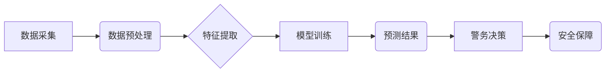

                 

## 关键词：人工智能、犯罪预测、预测性警务、机器学习、深度学习、数据分析、安全保障、社会治理

## 1. 背景介绍

随着科技的飞速发展，人工智能（AI）正深刻地改变着我们生活的方方面面，其中，在安防领域，AI技术展现出巨大的潜力。传统的安防模式主要依靠人力的巡逻和反应，效率低下，且难以应对突发事件。而智能安防，通过AI技术，能够实现对犯罪行为的预测和预防，从而提升安全保障水平。

2050年，智能安防将更加成熟和普及，预测性警务（Predictive Policing）将成为主流。预测性警务利用大数据分析和机器学习算法，分析历史犯罪数据、社会经济因素、人口流动等信息，预测未来可能发生的犯罪地点、时间和类型，从而帮助警方提前部署资源，预防犯罪发生。

## 2. 核心概念与联系

**2.1 核心概念**

* **犯罪预测 (Crime Prediction):** 利用历史犯罪数据、社会经济因素、人口流动等信息，通过机器学习算法预测未来可能发生的犯罪地点、时间和类型。
* **预测性警务 (Predictive Policing):** 基于犯罪预测结果，帮助警方优化资源配置、制定警务策略，提前预防犯罪发生。
* **大数据分析 (Big Data Analytics):** 收集、存储、分析海量数据，从中发现隐藏的模式和趋势。
* **机器学习 (Machine Learning):** 算法能够从数据中学习，不断改进预测精度。
* **深度学习 (Deep Learning):** 一种更高级的机器学习算法，能够处理更复杂的数据，例如图像、语音等。

**2.2 架构图**



**2.3 核心联系**

犯罪预测和预测性警务是相互关联的。犯罪预测提供预测结果，而预测性警务则利用这些结果进行警务决策，最终实现安全保障的目标。大数据分析和机器学习是实现犯罪预测的关键技术，深度学习则可以处理更复杂的数据，提升预测精度。

## 3. 核心算法原理 & 具体操作步骤

**3.1 算法原理概述**

预测性警务常用的算法包括：

* **线性回归:** 用于预测连续变量，例如犯罪次数。
* **逻辑回归:** 用于预测分类变量，例如犯罪类型。
* **支持向量机 (SVM):** 用于分类和回归，能够处理高维数据。
* **决策树:** 用于分类和回归，易于理解和解释。
* **随机森林:** 结合多个决策树，提升预测精度。
* **神经网络:** 能够处理复杂数据，例如图像、语音等。

**3.2 算法步骤详解**

1. **数据采集:** 收集历史犯罪数据、社会经济因素、人口流动等信息。
2. **数据预处理:** 清洗、转换、归一化数据，使其适合算法训练。
3. **特征提取:** 从原始数据中提取有价值的特征，例如犯罪时间、地点、类型、天气等。
4. **模型训练:** 选择合适的算法，利用训练数据训练模型，并评估模型性能。
5. **模型部署:** 将训练好的模型部署到生产环境中，用于预测未来犯罪事件。
6. **结果分析:** 分析预测结果，并根据实际情况调整警务策略。

**3.3 算法优缺点**

| 算法 | 优点 | 缺点 |
|---|---|---|
| 线性回归 | 简单易懂，计算效率高 | 只能处理线性关系，预测精度有限 |
| 逻辑回归 | 适用于分类问题，易于解释 | 只能处理线性关系，预测精度有限 |
| SVM | 能够处理高维数据，预测精度高 | 计算复杂度高，参数设置较难 |
| 决策树 | 易于理解和解释，可处理非线性关系 | 容易过拟合，预测精度可能较低 |
| 随机森林 | 结合多个决策树，提升预测精度 | 计算复杂度高 |
| 神经网络 | 能够处理复杂数据，预测精度高 | 计算复杂度高，参数设置较难，解释性差 |

**3.4 算法应用领域**

* 犯罪预测
* 预测性警务
* 犯罪热点识别
* 犯罪嫌疑人识别
* 犯罪趋势分析

## 4. 数学模型和公式 & 详细讲解 & 举例说明

**4.1 数学模型构建**

预测性警务模型通常采用回归模型或分类模型。

* **回归模型:** 用于预测连续变量，例如犯罪次数。常用的回归模型包括线性回归、多项式回归等。
* **分类模型:** 用于预测分类变量，例如犯罪类型。常用的分类模型包括逻辑回归、支持向量机、决策树等。

**4.2 公式推导过程**

以线性回归为例，其目标是找到一条直线，使得预测值与实际值之间的误差最小。

线性回归模型的公式为：

$$y = mx + c$$

其中：

* $y$ 是预测值
* $x$ 是输入特征
* $m$ 是斜率
* $c$ 是截距

为了找到最佳的 $m$ 和 $c$ 值，可以使用最小二乘法。最小二乘法的目标是找到一条直线，使得所有数据点到直线的距离之和最小。

**4.3 案例分析与讲解**

假设我们想要预测某个城市的犯罪次数，输入特征包括人口密度、失业率、平均收入等。我们可以使用线性回归模型，训练模型并得到最佳的 $m$ 和 $c$ 值。然后，我们可以输入新的城市数据，例如人口密度、失业率、平均收入等，预测该城市的犯罪次数。

## 5. 项目实践：代码实例和详细解释说明

**5.1 开发环境搭建**

* 操作系统：Windows/Linux/macOS
* Python 版本：3.6+
* 必要的库：pandas、scikit-learn、matplotlib等

**5.2 源代码详细实现**

```python
import pandas as pd
from sklearn.linear_model import LinearRegression
from sklearn.model_selection import train_test_split
from sklearn.metrics import mean_squared_error

# 加载数据
data = pd.read_csv('crime_data.csv')

# 选择特征和目标变量
features = ['population_density', 'unemployment_rate', 'average_income']
target = 'crime_count'

# 数据分割
X_train, X_test, y_train, y_test = train_test_split(data[features], data[target], test_size=0.2)

# 创建线性回归模型
model = LinearRegression()

# 模型训练
model.fit(X_train, y_train)

# 模型预测
y_pred = model.predict(X_test)

# 模型评估
mse = mean_squared_error(y_test, y_pred)
print('Mean Squared Error:', mse)
```

**5.3 代码解读与分析**

1. 首先，我们加载犯罪数据，并选择特征和目标变量。
2. 然后，我们将数据分割成训练集和测试集。
3. 接下来，我们创建线性回归模型，并使用训练集训练模型。
4. 训练完成后，我们可以使用测试集预测犯罪次数，并评估模型性能。

**5.4 运行结果展示**

运行代码后，会输出模型的均方误差 (MSE) 值。MSE 值越小，模型的预测精度越高。

## 6. 实际应用场景

**6.1 犯罪热点识别**

预测性警务可以帮助警方识别犯罪热点，例如高犯罪率的区域、时间段等。警方可以根据预测结果，增加巡逻力度，部署更多警力，从而有效降低犯罪率。

**6.2 犯罪嫌疑人识别**

通过分析犯罪嫌疑人的特征，例如年龄、性别、身高、体重等，预测性警务可以帮助警方识别潜在的犯罪嫌疑人，提高抓捕效率。

**6.3 犯罪趋势分析**

预测性警务可以分析历史犯罪数据，预测未来犯罪趋势，例如犯罪类型、犯罪时间等。警方可以根据预测结果，制定相应的预防措施，例如加强对特定犯罪类型的打击力度。

**6.4 未来应用展望**

随着人工智能技术的不断发展，预测性警务将更加智能化、精准化。未来，预测性警务可能应用于以下领域：

* **智能监控:** 利用摄像头和人工智能技术，实时监控城市环境，识别潜在的犯罪行为。
* **预警系统:** 建立预警系统，根据预测结果，提前预警潜在的犯罪事件。
* **个性化警务:** 根据个人的犯罪风险评估，制定个性化的警务策略。

## 7. 工具和资源推荐

**7.1 学习资源推荐**

* **书籍:**
    * "Predictive Policing: The Promise and Peril of Forecasting Crime" by Jeff Asher
    * "The Master Algorithm" by Pedro Domingos
* **在线课程:**
    * Coursera: Machine Learning
    * edX: Artificial Intelligence

**7.2 开发工具推荐**

* **Python:** 广泛应用于机器学习和数据分析。
* **R:** 专注于统计计算和数据可视化。
* **TensorFlow:** 开源深度学习框架。
* **PyTorch:** 开源深度学习框架。

**7.3 相关论文推荐**

* "Predicting Crime with Machine Learning" by Jeff Asher
* "Crime Prediction Using Machine Learning" by H. Liu et al.

## 8. 总结：未来发展趋势与挑战

**8.1 研究成果总结**

预测性警务在犯罪预测、犯罪热点识别、犯罪嫌疑人识别等方面取得了显著成果，有效提升了安全保障水平。

**8.2 未来发展趋势**

* **更精准的预测:** 利用更先进的机器学习算法和更丰富的训练数据，提高预测精度。
* **更智能的决策:** 将人工智能技术与警务决策相结合，实现更智能化的警务策略制定。
* **更广泛的应用:** 将预测性警务应用于更多领域，例如交通安全、公共卫生等。

**8.3 面临的挑战**

* **数据隐私:** 预测性警务需要大量个人数据，如何保护数据隐私是一个重要挑战。
* **算法偏见:** 机器学习算法可能存在偏见，导致预测结果不公平。
* **伦理问题:** 预测性警务可能引发伦理问题，例如过度监控、歧视等。

**8.4 研究展望**

未来，需要加强对预测性警务的伦理规范和法律监管，确保其安全、公平、透明地应用。同时，需要不断改进算法模型，提高预测精度和准确性，并探索更广泛的应用场景。


## 9. 附录：常见问题与解答

**9.1 预测性警务是否会侵犯个人隐私？**

预测性警务确实需要收集和分析大量个人数据，因此数据隐私保护是一个重要问题。需要采取措施确保数据安全，例如匿名化处理、加密传输等。

**9.2 预测性警务的算法是否会存在偏见？**

是的，机器学习算法可能存在偏见，导致预测结果不公平。需要采取措施减少算法偏见，例如使用更公平的数据集、调整算法参数等。

**9.3 预测性警务是否会导致过度监控？**

过度监控是一个值得关注的问题。需要制定相应的法律法规，规范预测性警务的应用，避免过度监控。


作者：禅与计算机程序设计艺术 / Zen and the Art of Computer Programming 
<end_of_turn>

