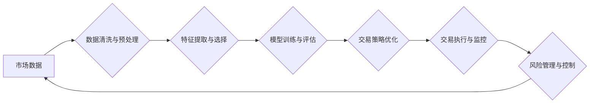

                 

## 未来的智能投资：2050年的量化交易与风险管理

> 关键词：量化交易、人工智能、机器学习、风险管理、预测模型、区块链、金融科技、算法交易

## 1. 背景介绍

金融市场在过去几十年经历了巨大的变革，从传统的基于经验和直觉的交易方式逐渐向数据驱动、算法化的量化交易模式转变。随着人工智能（AI）和机器学习（ML）技术的飞速发展，量化交易的未来将更加智能化、自动化和精准化。

2050年，量化交易将成为金融市场的主流模式，AI和ML将扮演着至关重要的角色。智能算法将能够分析海量数据，识别复杂的市场趋势和模式，并做出快速、高效的交易决策。同时，风险管理也将更加智能化，AI和ML将帮助投资者更好地评估和控制风险，实现更稳健的投资回报。

## 2. 核心概念与联系

量化交易的核心是利用数学模型和算法来分析市场数据，识别交易机会并自动执行交易。AI和ML技术为量化交易提供了强大的工具，可以帮助投资者：

* **数据分析和特征提取:** AI和ML算法能够从海量市场数据中提取有价值的特征，识别潜在的交易信号。
* **预测模型构建:** 基于历史数据和市场特征，AI和ML算法可以构建复杂的预测模型，预测未来市场走势。
* **交易策略优化:** AI和ML算法可以根据市场变化和投资目标，优化交易策略，提高交易效率和盈利能力。
* **风险管理:** AI和ML算法可以评估交易风险，制定有效的风险控制策略，保护投资者的资金安全。

**Mermaid 流程图:**



## 3. 核心算法原理 & 具体操作步骤

### 3.1  算法原理概述

量化交易中常用的算法包括：

* **回归分析:** 用于预测连续型变量，例如股票价格。
* **分类算法:** 用于分类不同类型的交易机会，例如买入、卖出或持有。
* **时间序列分析:** 用于分析时间序列数据，识别市场趋势和模式。
* **神经网络:** 用于构建复杂的预测模型，学习非线性关系。

### 3.2  算法步骤详解

**以回归分析为例，其具体操作步骤如下：**

1. **数据收集:** 收集历史市场数据，例如股票价格、交易量、宏观经济指标等。
2. **数据清洗与预处理:** 处理缺失值、异常值和数据格式问题。
3. **特征选择:** 选择与股票价格相关的特征变量。
4. **模型训练:** 使用历史数据训练回归模型，例如线性回归、逻辑回归等。
5. **模型评估:** 使用测试数据评估模型的预测精度。
6. **交易策略制定:** 根据模型预测结果制定交易策略，例如买入信号、卖出信号和止损点。
7. **交易执行:** 通过交易平台自动执行交易策略。

### 3.3  算法优缺点

**回归分析的优点:**

* 算法简单易懂，易于实现。
* 训练速度快，计算量小。
* 可以解释模型结果，了解特征变量对预测的影响。

**回归分析的缺点:**

* 只能预测连续型变量，无法处理分类问题。
* 对非线性关系的捕捉能力有限。
* 容易受到异常值的影响。

### 3.4  算法应用领域

回归分析广泛应用于量化交易领域，例如：

* **股票价格预测:** 预测股票未来价格走势。
* **风险评估:** 评估投资组合的风险水平。
* **收益率优化:** 优化投资组合收益率。

## 4. 数学模型和公式 & 详细讲解 & 举例说明

### 4.1  数学模型构建

量化交易中常用的数学模型包括：

* **线性回归模型:** 用于预测连续型变量，假设变量之间存在线性关系。

$$
y = \beta_0 + \beta_1x_1 + \beta_2x_2 + ... + \beta_nx_n + \epsilon
$$

其中：

* $y$ 是预测变量
* $x_1, x_2, ..., x_n$ 是特征变量
* $\beta_0, \beta_1, ..., \beta_n$ 是模型参数
* $\epsilon$ 是误差项

* **逻辑回归模型:** 用于分类问题，预测事件发生的概率。

$$
P(y=1) = \frac{1}{1 + e^{-( \beta_0 + \beta_1x_1 + \beta_2x_2 + ... + \beta_nx_n )}}
$$

其中：

* $P(y=1)$ 是事件发生的概率
* $x_1, x_2, ..., x_n$ 是特征变量
* $\beta_0, \beta_1, ..., \beta_n$ 是模型参数

### 4.2  公式推导过程

线性回归模型的参数可以通过最小二乘法估计，其目标是最小化模型预测值与实际值的平方差。逻辑回归模型的参数可以通过最大似然估计法估计，其目标是最大化模型预测结果与实际结果的似然度。

### 4.3  案例分析与讲解

**以股票价格预测为例，使用线性回归模型进行分析：**

假设我们收集了历史股票价格和交易量的相关数据，并选择交易量作为特征变量，股票价格作为预测变量。

通过训练线性回归模型，我们可以得到模型参数 $\beta_0$ 和 $\beta_1$。

$$
y = \beta_0 + \beta_1x
$$

其中：

* $y$ 是股票价格
* $x$ 是交易量
* $\beta_0$ 和 $\beta_1$ 是模型参数

根据模型参数，我们可以预测未来股票价格。例如，如果交易量为 $x$，则预测价格为：

$$
y = \beta_0 + \beta_1x
$$

## 5. 项目实践：代码实例和详细解释说明

### 5.1  开发环境搭建

量化交易项目开发环境通常包括：

* **编程语言:** Python 是量化交易开发中常用的编程语言，因为它拥有丰富的金融数据处理和机器学习库。
* **数据处理库:** Pandas 是 Python 中常用的数据处理库，可以用于数据清洗、转换和分析。
* **机器学习库:** Scikit-learn 是 Python 中常用的机器学习库，提供各种机器学习算法和工具。
* **交易平台接口:** 需要连接交易平台的 API 接口，以便自动执行交易策略。

### 5.2  源代码详细实现

以下是一个简单的 Python 代码示例，演示如何使用线性回归模型进行股票价格预测：

```python
import pandas as pd
from sklearn.linear_model import LinearRegression
from sklearn.model_selection import train_test_split

# 加载数据
data = pd.read_csv('stock_data.csv')

# 选择特征变量和预测变量
X = data[['交易量']]
y = data['股票价格']

# 将数据分为训练集和测试集
X_train, X_test, y_train, y_test = train_test_split(X, y, test_size=0.2)

# 创建线性回归模型
model = LinearRegression()

# 训练模型
model.fit(X_train, y_train)

# 预测测试集数据
y_pred = model.predict(X_test)

# 评估模型性能
print('模型系数:', model.coef_)
print('模型截距:', model.intercept_)
```

### 5.3  代码解读与分析

* 代码首先加载股票数据，并选择交易量作为特征变量，股票价格作为预测变量。
* 然后将数据分为训练集和测试集，用于训练和评估模型。
* 创建线性回归模型，并使用训练集数据训练模型。
* 训练完成后，使用测试集数据预测股票价格，并评估模型性能。

### 5.4  运行结果展示

运行代码后，会输出模型系数和截距，以及模型预测结果与实际结果的误差。

## 6. 实际应用场景

量化交易已经广泛应用于各种金融市场，例如：

* **股票市场:** 利用技术指标、基本面数据和市场情绪等信息，进行股票价格预测和交易策略制定。
* **期货市场:** 利用价格走势、供需关系和宏观经济指标等信息，进行期货价格预测和套利交易。
* **外汇市场:** 利用汇率波动、经济数据和央行政策等信息，进行外汇汇率预测和交易策略制定。

### 6.4  未来应用展望

未来，量化交易将更加智能化、自动化和精准化。

* **人工智能和机器学习技术的进一步发展:** 将使量化交易模型更加复杂、强大，能够识别更加复杂的市场趋势和模式。
* **大数据和云计算技术的应用:** 将使量化交易能够处理更加海量的数据，并进行更加实时和高效的分析。
* **区块链技术的应用:** 将提高交易效率和安全性，并降低交易成本。

## 7. 工具和资源推荐

### 7.1  学习资源推荐

* **书籍:**
    * 《量化投资》
    * 《算法交易》
    * 《机器学习实战》
* **在线课程:**
    * Coursera: 量化金融
    * edX: 机器学习
    * Udemy: 算法交易

### 7.2  开发工具推荐

* **编程语言:** Python
* **数据处理库:** Pandas
* **机器学习库:** Scikit-learn
* **交易平台接口:** Alpaca, Interactive Brokers

### 7.3  相关论文推荐

* **量化交易的数学模型和算法:**
    * 《量化投资策略的数学模型》
    * 《机器学习在量化交易中的应用》
* **人工智能和机器学习在量化交易中的应用:**
    * 《深度学习在金融市场中的应用》
    * 《强化学习在量化交易中的应用》

## 8. 总结：未来发展趋势与挑战

### 8.1  研究成果总结

量化交易已经取得了显著的成果，为投资者提供了更加高效、精准的投资工具。人工智能和机器学习技术的应用将进一步推动量化交易的发展，使其更加智能化、自动化和精准化。

### 8.2  未来发展趋势

* **模型复杂度提升:** 量化交易模型将更加复杂，能够识别更加复杂的市场趋势和模式。
* **数据来源多元化:** 量化交易将利用更加多元化的数据来源，例如社交媒体数据、新闻数据和卫星图像数据。
* **交易策略个性化:** 量化交易将更加个性化，根据投资者的风险偏好和投资目标定制交易策略。

### 8.3  面临的挑战

* **数据质量和可获取性:** 量化交易依赖于高质量的数据，而获取高质量的数据仍然是一个挑战。
* **模型解释性和可信度:** 量化交易模型的复杂性使得模型解释性和可信度成为一个挑战。
* **监管和伦理问题:** 量化交易的快速发展也带来了监管和伦理问题，需要制定相应的法律法规和伦理规范。

### 8.4  研究展望

未来，量化交易的研究将更加注重以下几个方面:

* **开发更加高效、精准的量化交易模型。**
* **提高量化交易模型的解释性和可信度。**
* **解决量化交易带来的监管和伦理问题。**


## 9. 附录：常见问题与解答

**Q1: 量化交易适合所有投资者吗？**

**A1:** 量化交易需要一定的技术背景和风险承受能力，不适合所有投资者。

**Q2: 量化交易的风险有多大？**

**A2:** 量化交易的风险与任何投资方式一样，存在市场风险、模型风险和操作风险。

**Q3: 如何学习量化交易？**

**A3:** 可以通过阅读书籍、参加在线课程、学习编程等方式学习量化交易。

**Q4: 量化交易的未来发展趋势是什么？**

**A4:** 量化交易的未来发展趋势是更加智能化、自动化和精准化。

**Q5: 量化交易有哪些伦理问题？**

**A5:** 量化交易可能导致市场操纵、信息不对称和算法偏见等伦理问题。


作者：禅与计算机程序设计艺术 / Zen and the Art of Computer Programming 
<end_of_turn>

